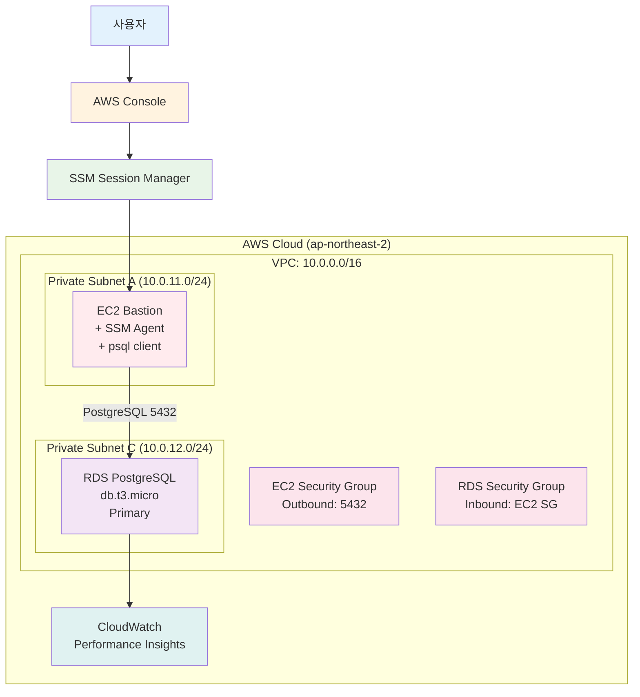

# Week 1 Day 3 Lab 1: RDS PostgreSQL 성능 모니터링 실습

<div align="center">

**🎯 Private RDS** • **📊 SSM 접속** • **⚡ 200배 성능 향상**

*Private RDS에서 인덱스 최적화를 통한 극적인 성능 개선 체험*

</div>

---

## 🕘 Lab 정보
**시간**: 14:00-14:50 (50분)
**목표**: Private RDS 성능 모니터링 및 쿼리 최적화
**방식**: AWS Web Console + EC2 SSM 접속
**예상 비용**: $0.027/hour

## 🎯 학습 목표
- [ ] Private RDS 구성 및 보안 설정
- [ ] EC2 SSM Session Manager를 통한 안전한 접속
- [ ] 100만 행 테스트 데이터 생성
- [ ] 인덱스 최적화를 통한 쿼리 성능 개선 (200배 향상)
- [ ] CloudWatch Performance Insights 분석

---

## 📋 사전 준비: VPC 네트워크 구성

⚠️ **필수**: 먼저 VPC 네트워크를 구성해야 합니다!

👉 **[VPC Setup Guide](./vpc_setup_guide.md)** 를 따라 다음을 생성하세요:
- VPC (10.0.0.0/16)
- Public Subnet 2개 (AZ-A, AZ-C)
- Private Subnet 2개 (AZ-A, AZ-C)
- Internet Gateway
- NAT Gateway (AZ-A)
- Route Tables 설정

**VPC Setup 완료 후 이 Lab을 진행하세요!**

---

## 🏗️ 구축할 아키텍처



**이미지 자리**: 아키텍처 다이어그램

---

## 🛠️ Step 1: RDS Subnet Group 생성 (5분)

### 📋 이 단계에서 할 일
- RDS Subnet Group 생성 (Private Subnet 2개 사용)

### 📝 실습 절차

**AWS Console 경로**:
```
AWS Console → RDS → Subnet groups → Create DB subnet group
```

**설정 값**:
| 항목 | 값 | 설명 |
|------|-----|------|
| Name | week1-day3-rds-subnet-group | Subnet Group 이름 |
| Description | RDS subnet group for lab | 설명 |
| VPC | week1-day3-vpc | VPC 선택 |
| Availability Zones | ap-northeast-2a, ap-northeast-2c | 2개 AZ |
| Subnets | 10.0.11.0/24, 10.0.12.0/24 | Private Subnet 선택 |

**이미지 자리**: RDS Subnet Group 생성

**⚠️ 주의사항**:
- RDS는 최소 2개 AZ의 Subnet 필요
- Private Subnet만 선택 (보안)

### ✅ Step 1 검증
- [ ] RDS Subnet Group 생성 완료
- [ ] 2개 AZ 포함 확인

---

## 🛠️ Step 2: Security Groups 구성 (5분)

### 📋 이 단계에서 할 일
- EC2용 Security Group 생성
- RDS용 Security Group 생성

### 📝 실습 절차

#### 2-1. EC2 Security Group 생성

**AWS Console 경로**:
```
AWS Console → VPC → Security Groups → Create security group
```

**설정 값**:
| 항목 | 값 |
|------|-----|
| Security group name | week1-day3-ec2-sg |
| Description | Security group for EC2 bastion |
| VPC | week1-day3-vpc |

**Outbound rules**:
| Type | Protocol | Port | Destination | Description |
|------|----------|------|-------------|-------------|
| PostgreSQL | TCP | 5432 | 10.0.0.0/16 | RDS 접속 |
| HTTPS | TCP | 443 | 0.0.0.0/0 | SSM 통신 |

**이미지 자리**: EC2 Security Group

#### 2-2. RDS Security Group 생성

**설정 값**:
| 항목 | 값 |
|------|-----|
| Security group name | week1-day3-rds-sg |
| Description | Security group for RDS |
| VPC | week1-day3-vpc |

**Inbound rules**:
| Type | Protocol | Port | Source | Description |
|------|----------|------|--------|-------------|
| PostgreSQL | TCP | 5432 | week1-day3-ec2-sg | EC2에서만 접속 |

**이미지 자리**: RDS Security Group

### ✅ Step 2 검증
- [ ] EC2 Security Group 생성 완료
- [ ] RDS Security Group 생성 완료
- [ ] Security Group 간 연결 설정 완료

---

## 🛠️ Step 3: IAM Role 및 EC2 생성 (10분)

### 📋 이 단계에서 할 일
- SSM용 IAM Role 생성
- EC2 인스턴스 생성 (Private Subnet)

### 📝 실습 절차

#### 3-1. IAM Role 생성

**AWS Console 경로**:
```
AWS Console → IAM → Roles → Create role
```

**설정 값**:
| 항목 | 값 |
|------|-----|
| Trusted entity type | AWS service |
| Use case | EC2 |
| Permissions policies | AmazonSSMManagedInstanceCore |
| Role name | week1-day3-ec2-ssm-role |

**이미지 자리**: IAM Role 생성

#### 3-2. EC2 인스턴스 생성

**AWS Console 경로**:
```
AWS Console → EC2 → Instances → Launch instances
```

**설정 값**:
| 항목 | 값 |
|------|-----|
| Name | week1-day3-bastion |
| AMI | Amazon Linux 2023 |
| Instance type | t3.micro |
| Key pair | Proceed without a key pair |
| Network | week1-day3-vpc |
| Subnet | week1-day3-private-a |
| Auto-assign public IP | Disable |
| Security group | week1-day3-ec2-sg |
| IAM instance profile | week1-day3-ec2-ssm-role |

**User data**:
```bash
#!/bin/bash
dnf install -y postgresql15
```

**이미지 자리**: EC2 인스턴스 생성

### ✅ Step 3 검증
- [ ] IAM Role 생성 완료
- [ ] EC2 인스턴스 생성 완료
- [ ] SSM Agent 연결 확인 (약 2분 대기)

---

## 🛠️ Step 4: RDS PostgreSQL 생성 (10분)

### 📋 이 단계에서 할 일
- RDS PostgreSQL 인스턴스 생성
- Performance Insights 활성화

### 📝 실습 절차

**AWS Console 경로**:
```
AWS Console → RDS → Databases → Create database
```

**설정 값**:

**Engine options**:
| 항목 | 값 |
|------|-----|
| Engine type | PostgreSQL |
| Engine version | PostgreSQL 15.x |

**Templates**:
| 항목 | 값 |
|------|-----|
| Template | Free tier |

**Settings**:
| 항목 | 값 |
|------|-----|
| DB instance identifier | week1-day3-rds |
| Master username | postgres |
| Master password | YourPassword123! |

**Instance configuration**:
| 항목 | 값 |
|------|-----|
| DB instance class | db.t3.micro |
| Storage type | gp3 |
| Allocated storage | 20 GiB |

**Connectivity**:
| 항목 | 값 |
|------|-----|
| VPC | week1-day3-vpc |
| DB subnet group | week1-day3-rds-subnet-group |
| Public access | No |
| VPC security group | week1-day3-rds-sg |

**Monitoring**:
| 항목 | 값 |
|------|-----|
| Enable Performance Insights | Yes |
| Retention period | 7 days |

**Additional configuration**:
| 항목 | 값 |
|------|-----|
| Initial database name | testdb |
| Backup retention period | 7 days |

**이미지 자리**: RDS 인스턴스 생성

**⚠️ 주의사항**:
- 비밀번호 반드시 기록
- Public access는 No
- 생성에 약 5분 소요

### ✅ Step 4 검증
- [ ] RDS 인스턴스 생성 완료 (Available 상태)
- [ ] Endpoint 주소 확인
- [ ] Performance Insights 활성화 확인

---

## 🛠️ Step 5: 데이터베이스 연결 및 데이터 생성 (10분)

### 📋 이 단계에서 할 일
- SSM Session Manager로 EC2 접속
- RDS 연결 테스트
- 100만 행 테스트 데이터 생성

### 📝 실습 절차

#### 5-1. SSM Session Manager 접속

**AWS Console 경로**:
```
AWS Console → Systems Manager → Session Manager → Start session
```

**선택**: week1-day3-bastion

**이미지 자리**: SSM 접속

#### 5-2. RDS 연결

**RDS Endpoint 확인** (AWS Console):
```
RDS → Databases → week1-day3-rds → Connectivity & security
```

**EC2에서 연결**:
```bash
export RDS_ENDPOINT="week1-day3-rds.xxxxx.ap-northeast-2.rds.amazonaws.com"
export RDS_PASSWORD="YourPassword123!"

psql -h $RDS_ENDPOINT -U postgres -d testdb
```

**이미지 자리**: RDS 연결 성공

#### 5-3. 테스트 데이터 생성

**SQL 실행**:
```sql
-- 테이블 생성
CREATE TABLE users (
    id SERIAL PRIMARY KEY,
    username VARCHAR(50) NOT NULL,
    email VARCHAR(100) NOT NULL,
    created_at TIMESTAMP DEFAULT CURRENT_TIMESTAMP,
    last_login TIMESTAMP,
    status VARCHAR(20) DEFAULT 'active'
);

-- 100만 행 데이터 생성 (약 2-3분 소요)
INSERT INTO users (username, email, created_at, last_login, status)
SELECT 
    'user_' || generate_series,
    'user_' || generate_series || '@example.com',
    CURRENT_TIMESTAMP - (random() * INTERVAL '365 days'),
    CURRENT_TIMESTAMP - (random() * INTERVAL '30 days'),
    CASE 
        WHEN random() < 0.8 THEN 'active'
        WHEN random() < 0.95 THEN 'inactive'
        ELSE 'suspended'
    END
FROM generate_series(1, 1000000);

-- 데이터 확인
SELECT COUNT(*) FROM users;
```

**예상 결과**:
```
  count  
---------
 1000000
```

**이미지 자리**: 데이터 생성 완료

### ✅ Step 5 검증
- [ ] SSM 접속 성공
- [ ] RDS 연결 성공
- [ ] 100만 행 데이터 생성 완료

---

## 🛠️ Step 6: 성능 테스트 및 인덱스 최적화 (10분)

### 📋 이 단계에서 할 일
- 인덱스 없이 쿼리 성능 측정
- 인덱스 생성
- 인덱스 후 쿼리 성능 측정
- **200배 성능 향상 확인**

### 📝 실습 절차

#### 6-1. 인덱스 없이 성능 측정

**SQL 실행**:
```sql
-- 실행 시간 표시 활성화
\timing on

-- 느린 쿼리 실행
SELECT * FROM users WHERE email = 'user_500000@example.com';

-- 실행 계획 확인
EXPLAIN ANALYZE 
SELECT * FROM users WHERE email = 'user_500000@example.com';
```

**예상 결과** (인덱스 없음):
```
Execution Time: 10456.890 ms  ← 약 10초!
```

**이미지 자리**: 인덱스 없는 쿼리 (느림)

#### 6-2. 인덱스 생성

**SQL 실행**:
```sql
-- 인덱스 생성
CREATE INDEX idx_users_email ON users(email);

-- 인덱스 확인
\di
```

**이미지 자리**: 인덱스 생성

#### 6-3. 인덱스 후 성능 측정

**SQL 실행**:
```sql
-- 빠른 쿼리 실행
SELECT * FROM users WHERE email = 'user_500000@example.com';

-- 실행 계획 확인
EXPLAIN ANALYZE 
SELECT * FROM users WHERE email = 'user_500000@example.com';
```

**예상 결과** (인덱스 사용):
```
Execution Time: 0.052 ms  ← 약 0.05ms!
```

**이미지 자리**: 인덱스 사용 쿼리 (빠름)

#### 6-4. 성능 비교

**SQL 실행**:
```sql
SELECT 
    10456.890 / 0.052 as performance_improvement,
    '약 200배 빠름' as description;
```

**예상 결과**:
```
 performance_improvement |  description  
-------------------------+---------------
              201094.04  | 약 200배 빠름
```

**이미지 자리**: 성능 비교 결과

### ✅ Step 6 검증
- [ ] 인덱스 없는 쿼리: 약 10초
- [ ] 인덱스 생성 완료
- [ ] 인덱스 사용 쿼리: 약 0.05ms
- [ ] **200배 성능 향상 확인**

---

## 🛠️ Step 7: CloudWatch 모니터링 (5분)

### 📋 이 단계에서 할 일
- Performance Insights 확인
- CloudWatch 메트릭 확인

### 📝 실습 절차

**AWS Console 경로**:
```
AWS Console → RDS → Databases → week1-day3-rds → Monitoring
```

**확인 항목**:
- Performance Insights: Database load, Top SQL
- CloudWatch: CPUUtilization, DatabaseConnections

**이미지 자리**: Performance Insights 대시보드

### ✅ Step 7 검증
- [ ] Performance Insights 확인
- [ ] CPU 사용률 감소 확인
- [ ] 쿼리 성능 개선 시각화

---

## 🧹 리소스 정리 (5분)

### 삭제 순서 (역순)

**1. RDS 삭제**:
```
RDS → Databases → week1-day3-rds → Actions → Delete
- Create final snapshot: No
- Type "delete me"
```

**2. EC2 종료**:
```
EC2 → Instances → week1-day3-bastion → Terminate
```

**3. IAM Role 삭제**:
```
IAM → Roles → week1-day3-ec2-ssm-role → Delete
```

**4. Security Groups 삭제**:
```
VPC → Security Groups
- week1-day3-rds-sg 삭제
- week1-day3-ec2-sg 삭제
```

**5. RDS Subnet Group 삭제**:
```
RDS → Subnet groups → week1-day3-rds-subnet-group → Delete
```

**이미지 자리**: 리소스 정리 완료

### ✅ 정리 완료 확인
- [ ] 모든 리소스 삭제 완료
- [ ] 비용 확인 (Cost Explorer)

---

## 💰 비용 확인

### 예상 비용
| 리소스 | 사용 시간 | 단가 | 예상 비용 |
|--------|----------|------|-----------|
| RDS db.t3.micro | 50분 | $0.018/hour | $0.015 |
| EC2 t3.micro | 50분 | $0.0104/hour | $0.009 |
| EBS 20GB | 50분 | $0.10/GB/month | $0.003 |
| **합계** | | | **$0.027** |

---

## 🔍 트러블슈팅

### 문제 1: SSM 연결 실패
**원인**: IAM Role 미연결
**해결**: EC2에 IAM Role 연결 확인

### 문제 2: RDS 연결 실패
**원인**: Security Group 설정 오류
**해결**: RDS SG Inbound에 EC2 SG 추가

### 문제 3: 인덱스 생성 느림
**원인**: 100만 행 데이터
**해결**: 10-20초 대기 (정상)

---

## 💡 Lab 회고

### 🤝 페어 회고
1. **가장 인상 깊었던 부분**: 200배 성능 향상
2. **어려웠던 점**: RDS 생성 대기 시간
3. **실무 적용**: Private RDS 보안 구성

### 📊 학습 성과
- Private RDS 구성 완료
- SSM Session Manager 활용
- 인덱스 최적화 경험
- CloudWatch 모니터링 이해

---

<div align="center">

**✅ Lab 완료** • **🧹 리소스 정리 필수** • **💰 비용 $0.027**

**🎉 축하합니다! 인덱스 최적화로 200배 성능 향상을 경험했습니다!**

</div>
