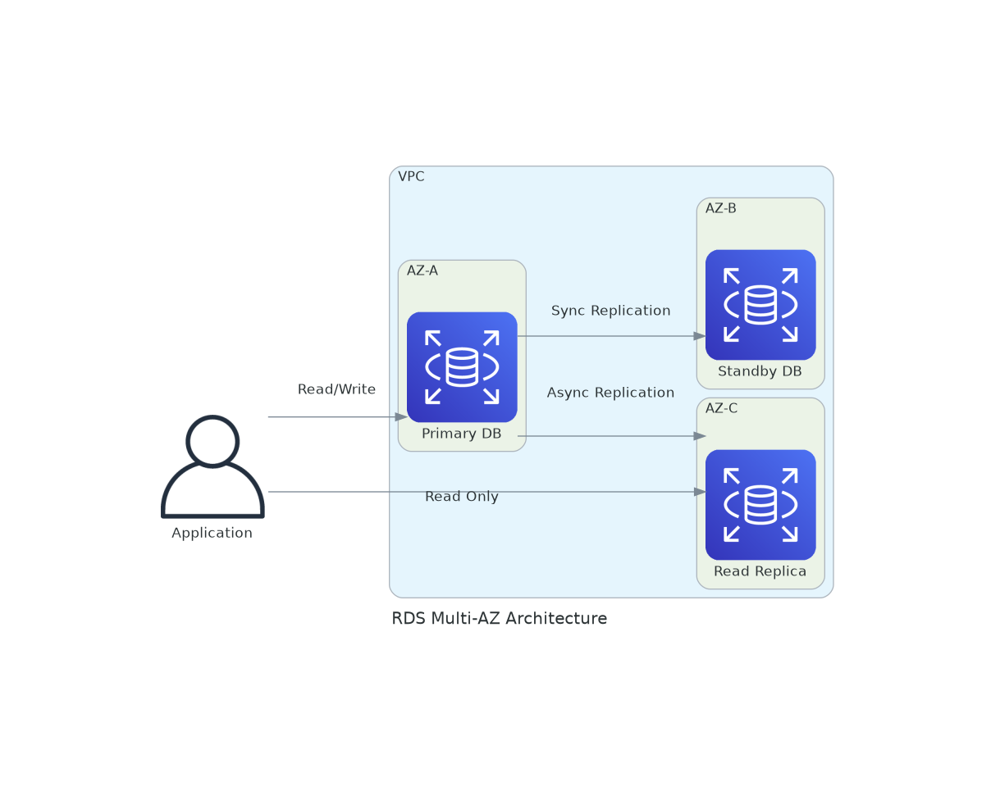
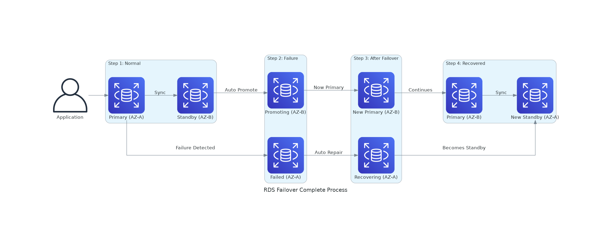
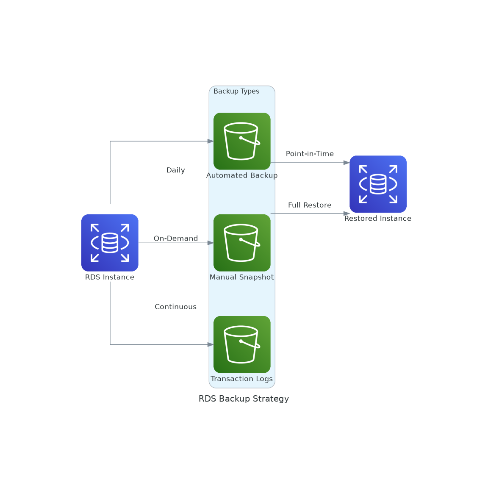
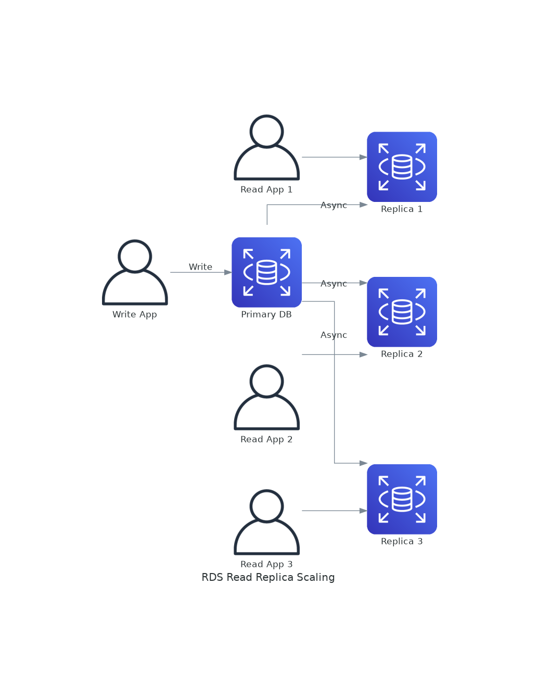

# November Week 1 Day 3 Session 1: RDS (Relational Database Service)

<div align="center">

**🗄️ 관리형 데이터베이스** • **🔄 고가용성** • **📊 자동 백업**

*AWS RDS로 데이터베이스 운영 부담 제거*

</div>

---

## 🕘 세션 정보
**시간**: 09:00-09:20 (20분)
**목표**: RDS 관리형 데이터베이스 이해 및 고가용성 구현

---

## 📖 서비스 개요

### 1. 생성 배경 (Why?)

**문제 상황**:
- **EC2에 직접 DB 설치**: 패치, 백업, 복제 모두 수동 관리
- **고가용성 구현 어려움**: Master-Slave 복제 직접 구성 복잡
- **백업 관리 부담**: 정기 백업, 복구 테스트 수동 수행
- **스케일링 복잡**: 읽기 부하 분산 위해 Read Replica 직접 구성

**AWS RDS 솔루션**:
- **완전 관리형**: 패치, 백업, 복제 자동화
- **Multi-AZ**: 자동 Failover로 고가용성
- **Read Replica**: 클릭 몇 번으로 읽기 성능 향상
- **자동 백업**: 일일 자동 백업 및 트랜잭션 로그

---

### 2. 핵심 원리 (How?)

**RDS 아키텍처**:



*그림: RDS Multi-AZ 및 Read Replica 아키텍처*

```
Primary DB (AZ-A)
    ↓ 동기 복제
Standby DB (AZ-B) - Multi-AZ
    ↓ 비동기 복제
Read Replica (AZ-C) - 읽기 전용
```

**작동 원리**:



*그림: RDS Multi-AZ 완전한 Failover 프로세스 (장애 → 복구 → 역할 전환)*

**Failover 전체 과정**:
1. **정상 상태**: Primary (AZ-A) ↔ Standby (AZ-B) 동기 복제
2. **장애 감지**: Primary 장애 발생 (30-120초 내 감지)
3. **자동 승격**: Standby가 자동으로 Primary로 승격
4. **DNS 전환**: RDS 엔드포인트가 새 Primary를 가리킴
5. **기존 Primary 복구**: 자동으로 복구 시작
6. **역할 전환**: 복구된 인스턴스가 새로운 Standby로 전환
7. **정상화 완료**: 새 Primary (AZ-B) ↔ 새 Standby (AZ-A)

**💡 핵심 포인트**:
- ✅ **자동 복구**: 장애 인스턴스가 자동으로 복구됨
- ✅ **역할 전환**: 복구 후 Standby로 자동 전환
- ✅ **무중단**: 애플리케이션은 DNS 엔드포인트만 사용하면 됨
- ✅ **데이터 무손실**: 동기 복제로 데이터 손실 없음

1. **Primary DB**: 모든 쓰기 작업 처리
2. **Standby DB**: Primary와 동기 복제 (Multi-AZ)
3. **Read Replica**: Primary에서 비동기 복제 (읽기 부하 분산)
4. **자동 Failover**: Primary 장애 시 Standby가 자동 승격
5. **자동 백업**: 매일 자동 스냅샷 + 트랜잭션 로그



*그림: RDS 백업 전략 - 자동 백업, 스냅샷, 트랜잭션 로그*

**지원 엔진**:
- **MySQL**: 오픈소스, 웹 애플리케이션
- **PostgreSQL**: 고급 기능, 복잡한 쿼리
- **MariaDB**: MySQL 호환, 성능 개선
- **Oracle**: 엔터프라이즈, 라이선스 필요
- **SQL Server**: Microsoft, Windows 통합
- **Aurora**: AWS 자체 엔진, MySQL/PostgreSQL 호환

---

### 3. 주요 사용 사례 (When?)

**적합한 경우**:
- ✅ 웹 애플리케이션 데이터베이스
- ✅ 트랜잭션 처리 (ACID 보장)
- ✅ 고가용성 필요 (Multi-AZ)
- ✅ 읽기 부하 분산 (Read Replica)

**실제 사례**:
- **Airbnb**: Aurora로 예약 시스템
- **Samsung**: RDS PostgreSQL로 IoT 데이터
- **Expedia**: Multi-AZ로 24/7 가용성



*그림: Read Replica를 통한 읽기 부하 분산*

---

### 4. 비슷한 서비스 비교 (Which?)

**EC2 직접 설치 vs RDS**:
- **EC2 사용**: 완전한 제어, 특수 설정 필요
- **RDS 사용**: 관리 부담 최소화, 표준 워크로드

**RDS vs Aurora**:
- **RDS 사용**: 표준 MySQL/PostgreSQL, 저렴
- **Aurora 사용**: 고성능, 고가용성, 비쌈

**선택 기준**:

| 기준 | EC2 DB | RDS | Aurora |
|------|--------|-----|--------|
| 관리 | 수동 | 자동 | 자동 |
| 성능 | 중간 | 높음 | 매우 높음 |
| 비용 | 낮음 | 중간 | 높음 |
| 고가용성 | 수동 구성 | Multi-AZ | 자동 |

---

### 5. 장단점 분석

**장점**:
- ✅ 자동 패치 및 업데이트
- ✅ 자동 백업 및 복구
- ✅ Multi-AZ 고가용성
- ✅ Read Replica 읽기 성능
- ✅ 모니터링 및 알람

**단점/제약사항**:
- ⚠️ OS 접근 불가
- ⚠️ 특수 설정 제한
- ⚠️ 비용 (EC2 대비)
- ⚠️ 일부 플러그인 미지원

**대안**:
- 완전한 제어: EC2 직접 설치
- 고성능: Aurora
- NoSQL: DynamoDB

---

### 6. 비용 구조 💰

**과금 방식**:
- **인스턴스 시간**: 시간당 과금
- **스토리지**: GB당 월 단위
- **백업**: 스냅샷 스토리지
- **데이터 전송**: 아웃바운드 전송

**프리티어 혜택** (12개월):
- db.t3.micro: 750시간/월
- 20GB 스토리지
- 20GB 백업

**비용 최적화**:
1. Reserved Instance (1-3년 약정)
2. 적절한 인스턴스 크기
3. 스토리지 타입 선택 (gp3)
4. 불필요한 Read Replica 삭제

**예상 비용 (ap-northeast-2)**:

| 인스턴스 | vCPU | 메모리 | 시간당 | 월간 |
|----------|------|--------|--------|------|
| db.t3.micro | 2 | 1GB | $0.017 | $12.41 |
| db.t3.small | 2 | 2GB | $0.034 | $24.82 |

---

### 7. 최신 업데이트 🆕

**2024년 주요 변경사항**:
- **Blue/Green 배포**: 무중단 업그레이드
- **RDS Optimized Reads**: 읽기 성능 향상
- **Graviton3**: ARM 기반 인스턴스

**2025년 예정**:
- 더 큰 인스턴스 타입
- 더 빠른 스토리지

**참조**: [AWS RDS What's New](https://aws.amazon.com/rds/whats-new/)

---

### 8. 잘 사용하는 방법 ✅

**베스트 프랙티스**:
1. **Multi-AZ 활성화**: 프로덕션 필수
2. **자동 백업 설정**: 7-35일 보관
3. **암호화 활성화**: 저장 시 암호화
4. **Parameter Group**: 워크로드 최적화
5. **CloudWatch 모니터링**: 알람 설정

**실무 팁**:
- **Read Replica**: 읽기 부하 분산
- **Maintenance Window**: 업무 외 시간 설정
- **Snapshot 공유**: 계정 간 공유 가능

---

### 9. 잘못 사용하는 방법 ❌

**흔한 실수**:
1. **Single-AZ 프로덕션**: 장애 시 다운타임
2. **백업 미설정**: 데이터 손실 위험
3. **Public 접근**: 보안 취약
4. **과도한 인스턴스**: 비용 낭비
5. **모니터링 미설정**: 장애 감지 불가

**안티 패턴**:
- **Public Subnet 배치**: Private Subnet 필수
- **Root 계정 사용**: IAM 인증 사용
- **암호화 미사용**: 민감 데이터 보호

---

### 10. 구성 요소 상세

**주요 구성 요소**:

**1. DB Instance**:
- 역할: 데이터베이스 서버
- 속성: 엔진, 버전, 인스턴스 타입
- 생명주기: 생성, 수정, 삭제

**2. DB Subnet Group**:
- 역할: Multi-AZ 배치
- 속성: VPC, Subnet 목록
- 요구사항: 최소 2개 AZ

**3. Parameter Group**:
- 역할: DB 설정
- 속성: 엔진별 파라미터
- 용도: 성능 튜닝

**설정 옵션**:
- **Multi-AZ**: 고가용성
- **Read Replica**: 읽기 성능
- **Backup**: 자동 백업 기간
- **Encryption**: KMS 키

**의존성**:
- **VPC**: Private Subnet 배치
- **Security Group**: 접근 제어
- **KMS**: 암호화 키

---

### 11. 공식 문서 링크 (필수 5개)

**⚠️ 학생들이 직접 확인해야 할 공식 문서**:
- 📘 [RDS란 무엇인가?](https://docs.aws.amazon.com/AmazonRDS/latest/UserGuide/Welcome.html)
- 📗 [RDS 사용자 가이드](https://docs.aws.amazon.com/AmazonRDS/latest/UserGuide/)
- 📙 [RDS API 레퍼런스](https://docs.aws.amazon.com/AmazonRDS/latest/APIReference/)
- 📕 [RDS 요금](https://aws.amazon.com/rds/pricing/)
- 🆕 [RDS 최신 업데이트](https://aws.amazon.com/rds/whats-new/)

---

<div align="center">

**🗄️ 관리형 DB** • **🔄 Multi-AZ** • **📊 자동 백업** • **💰 비용 효율**

*RDS로 데이터베이스 운영 부담 제거*

</div>
