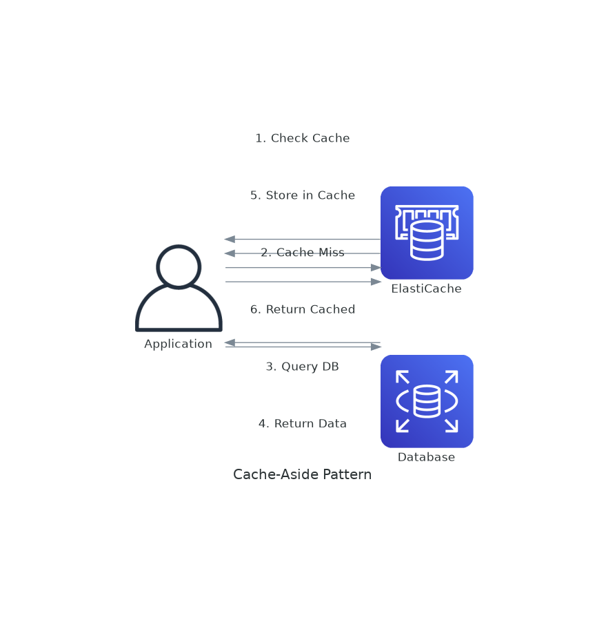
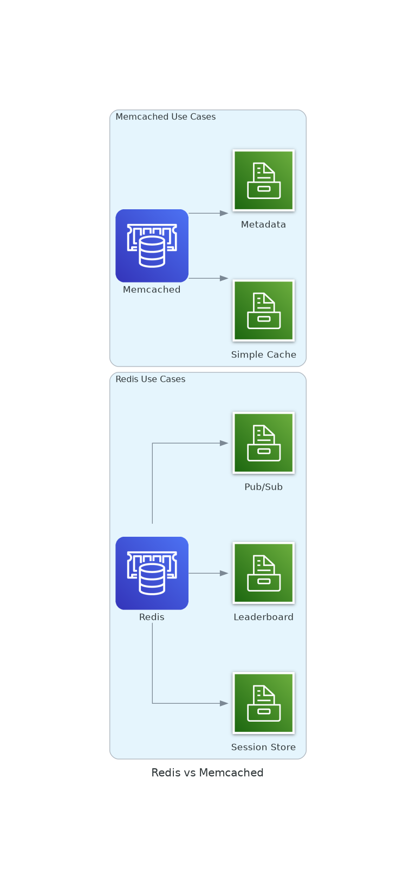
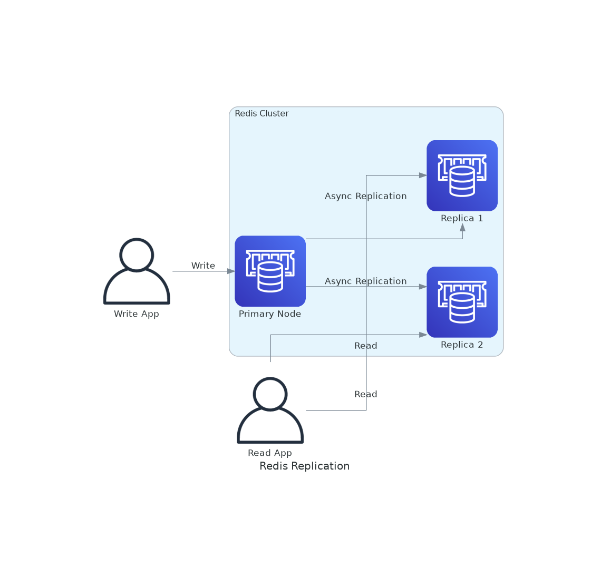

# November Week 1 Day 3 Session 2: ElastiCache (Redis & Memcached)

<div align="center">

**⚡ 인메모리 캐시** • **🚀 성능 향상** • **🔄 캐싱 전략**

*ElastiCache로 데이터베이스 부하 감소 및 응답 속도 개선*

</div>

---

## 🕘 세션 정보
**시간**: 09:30-09:50 (20분)
**목표**: ElastiCache 이해 및 캐싱 전략 수립

---

## 📖 서비스 개요

### 1. 생성 배경 (Why?)

**문제 상황**:
- **데이터베이스 부하**: 동일한 쿼리 반복 실행으로 DB 과부하
- **느린 응답 속도**: 디스크 기반 DB는 밀리초 단위 지연
- **확장성 한계**: DB 스케일링은 비용이 높고 복잡
- **세션 관리**: 여러 서버 간 세션 공유 어려움

**AWS ElastiCache 솔루션**:
- **인메모리 캐시**: 마이크로초 단위 응답 속도
- **DB 부하 감소**: 자주 조회되는 데이터 캐싱
- **완전 관리형**: 패치, 백업, 복제 자동화
- **고가용성**: 자동 Failover 및 복제

---

### 2. 핵심 원리 (How?)

**ElastiCache 아키텍처**:



*그림: Cache-Aside 패턴 - 가장 일반적인 캐싱 전략*

```
Application
    ↓ 1. 캐시 확인
ElastiCache (Redis/Memcached)
    ↓ 2. 캐시 미스 시
RDS Database
    ↓ 3. 데이터 조회
ElastiCache
    ↓ 4. 캐시 저장
Application (응답)
```

**작동 원리**:
1. **캐시 확인**: 애플리케이션이 먼저 캐시 조회
2. **캐시 히트**: 데이터 있으면 즉시 반환 (마이크로초)
3. **캐시 미스**: 데이터 없으면 DB 조회
4. **캐시 저장**: DB 결과를 캐시에 저장
5. **TTL 관리**: 일정 시간 후 자동 삭제

**Redis vs Memcached**:



*그림: Redis와 Memcached 사용 사례 비교*

| 특성 | Redis | Memcached |
|------|-------|-----------|
| **데이터 구조** | String, List, Set, Hash, Sorted Set | Key-Value만 |
| **영속성** | ✅ 지원 (RDB, AOF) | ❌ 미지원 |
| **복제** | ✅ Master-Replica | ❌ 미지원 |
| **트랜잭션** | ✅ 지원 | ❌ 미지원 |
| **Pub/Sub** | ✅ 지원 | ❌ 미지원 |
| **멀티스레드** | ❌ 단일 스레드 | ✅ 멀티스레드 |
| **용도** | 복잡한 데이터, 세션, 순위 | 단순 캐싱 |

---

### 3. 주요 사용 사례 (When?)

**Redis 적합한 경우**:
- ✅ 세션 스토어 (로그인 세션)
- ✅ 실시간 순위표 (Sorted Set)
- ✅ Pub/Sub 메시징
- ✅ 복잡한 데이터 구조
- ✅ 데이터 영속성 필요

**Memcached 적합한 경우**:
- ✅ 단순 Key-Value 캐싱
- ✅ 멀티스레드 성능 필요
- ✅ 수평 확장 (샤딩)
- ✅ 메모리 효율 중요

**실제 사례**:
- **Airbnb**: Redis로 세션 및 검색 결과 캐싱
- **Twitter**: Redis로 타임라인 캐싱
- **Pinterest**: Memcached로 이미지 메타데이터



*그림: Redis 복제 아키텍처 - Primary와 Read Replica*

---

### 4. 비슷한 서비스 비교 (Which?)

**ElastiCache vs DynamoDB DAX**:
- **ElastiCache 사용**: 범용 캐싱, 다양한 데이터 소스
- **DAX 사용**: DynamoDB 전용 캐싱

**Redis vs Memcached**:
- **Redis 사용**: 복잡한 데이터, 영속성, 고가용성
- **Memcached 사용**: 단순 캐싱, 멀티스레드, 수평 확장

**선택 기준**:

| 기준 | Redis | Memcached | DynamoDB DAX |
|------|-------|-----------|--------------|
| 데이터 구조 | 다양 | Key-Value | Key-Value |
| 영속성 | ✅ | ❌ | ❌ |
| 복제 | ✅ | ❌ | ✅ |
| 성능 | 높음 | 매우 높음 | 매우 높음 |
| 복잡도 | 높음 | 낮음 | 낮음 |

---

### 5. 장단점 분석

**장점**:
- ✅ 마이크로초 단위 응답 속도
- ✅ DB 부하 감소 (80-90%)
- ✅ 자동 Failover (Redis)
- ✅ 완전 관리형 (패치, 백업)
- ✅ 수평 확장 가능

**단점/제약사항**:
- ⚠️ 메모리 기반 (비용)
- ⚠️ 캐시 무효화 복잡
- ⚠️ 데이터 일관성 이슈
- ⚠️ 콜드 스타트 (캐시 워밍업)

**대안**:
- 단순 캐싱: CloudFront (CDN)
- 애플리케이션 캐시: 로컬 메모리
- NoSQL: DynamoDB

---

### 6. 비용 구조 💰

**과금 방식**:
- **노드 시간**: 시간당 과금
- **데이터 전송**: 아웃바운드 전송
- **백업**: 스냅샷 스토리지 (Redis)

**프리티어 혜택** (12개월):
- cache.t3.micro: 750시간/월 (Redis/Memcached)

**비용 최적화**:
1. **적절한 노드 크기**: 메모리 사용률 70-80%
2. **Reserved Nodes**: 1-3년 약정 (최대 55% 할인)
3. **불필요한 복제 제거**: Read Replica 최소화
4. **TTL 최적화**: 적절한 만료 시간 설정

**예상 비용 (ap-northeast-2)**:

| 노드 타입 | 메모리 | 시간당 | 월간 |
|----------|--------|--------|------|
| cache.t3.micro | 0.5GB | $0.017 | $12.41 |
| cache.t3.small | 1.37GB | $0.034 | $24.82 |
| cache.m5.large | 6.38GB | $0.136 | $99.28 |

**Lab 예상 비용**:
- cache.t3.micro (1시간): $0.017
- 합계: ~$0.02

---

### 7. 최신 업데이트 🆕

**2024년 주요 변경사항**:
- **Redis 7.0 지원**: 향상된 성능 및 기능
- **Data Tiering**: 메모리 + SSD 하이브리드
- **Serverless**: 자동 스케일링 (Redis)

**2025년 예정**:
- Redis 7.2 지원
- 더 큰 노드 타입

**참조**: [AWS ElastiCache What's New](https://aws.amazon.com/elasticache/whats-new/)

---

### 8. 잘 사용하는 방법 ✅

**베스트 프랙티스**:
1. **Cache-Aside 패턴**: 가장 일반적인 캐싱 전략
2. **적절한 TTL**: 데이터 특성에 맞는 만료 시간
3. **캐시 워밍업**: 애플리케이션 시작 시 주요 데이터 미리 로드
4. **모니터링**: CloudWatch로 히트율, 메모리 사용률 추적
5. **Failover 테스트**: 정기적인 장애 복구 테스트

**실무 팁**:
- **세션 스토어**: Redis로 여러 서버 간 세션 공유
- **순위표**: Sorted Set으로 실시간 리더보드
- **Rate Limiting**: Redis로 API 호출 제한

**성능 최적화**:
- **파이프라이닝**: 여러 명령어 한 번에 전송
- **Connection Pooling**: 연결 재사용
- **적절한 데이터 구조**: Redis 데이터 타입 활용

---

### 9. 잘못 사용하는 방법 ❌

**흔한 실수**:
1. **캐시를 DB처럼 사용**: 영속성 보장 안됨
2. **TTL 미설정**: 메모리 부족 발생
3. **큰 객체 저장**: 1MB 이상 객체는 성능 저하
4. **캐시 무효화 미흡**: 오래된 데이터 제공
5. **모니터링 미설정**: 문제 감지 불가

**안티 패턴**:
- **Write-Through만 사용**: 불필요한 캐시 저장
- **캐시 의존**: 캐시 장애 시 서비스 중단
- **과도한 캐싱**: 모든 데이터 캐싱 시도

**보안 취약점**:
- **Public 접근**: Private Subnet 필수
- **암호화 미사용**: 전송 중 암호화 활성화
- **인증 미설정**: Redis AUTH 사용

---

### 10. 구성 요소 상세

**주요 구성 요소**:

**1. Cache Cluster**:
- 역할: 캐시 노드 그룹
- 속성: 엔진, 노드 타입, 개수
- 모드: Cluster Mode (Redis), Standalone

**2. Replication Group (Redis)**:
- 역할: Master-Replica 복제
- 속성: Primary, Read Replica
- 용도: 고가용성, 읽기 성능

**3. Parameter Group**:
- 역할: 엔진 설정
- 속성: 메모리 정책, 최대 연결 수
- 용도: 성능 튜닝

**설정 옵션**:
- **엔진**: Redis, Memcached
- **노드 타입**: cache.t3, cache.m5, cache.r5
- **복제**: Multi-AZ, Read Replica
- **백업**: 자동 백업 (Redis)
- **암호화**: 전송 중, 저장 시

**의존성**:
- **VPC**: Private Subnet 배치
- **Security Group**: 포트 제어 (6379, 11211)
- **CloudWatch**: 모니터링

---

### 11. 공식 문서 링크 (필수 5개)

**⚠️ 학생들이 직접 확인해야 할 공식 문서**:
- 📘 [ElastiCache란 무엇인가?](https://docs.aws.amazon.com/AmazonElastiCache/latest/red-ug/WhatIs.html)
- 📗 [ElastiCache 사용자 가이드](https://docs.aws.amazon.com/AmazonElastiCache/latest/red-ug/)
- 📙 [ElastiCache API 레퍼런스](https://docs.aws.amazon.com/AmazonElastiCache/latest/APIReference/)
- 📕 [ElastiCache 요금](https://aws.amazon.com/elasticache/pricing/)
- 🆕 [ElastiCache 최신 업데이트](https://aws.amazon.com/elasticache/whats-new/)

---

<div align="center">

**⚡ 인메모리 캐시** • **🚀 마이크로초 응답** • **🔄 DB 부하 감소** • **💰 비용 효율**

*ElastiCache로 애플리케이션 성능 극대화*

</div>
