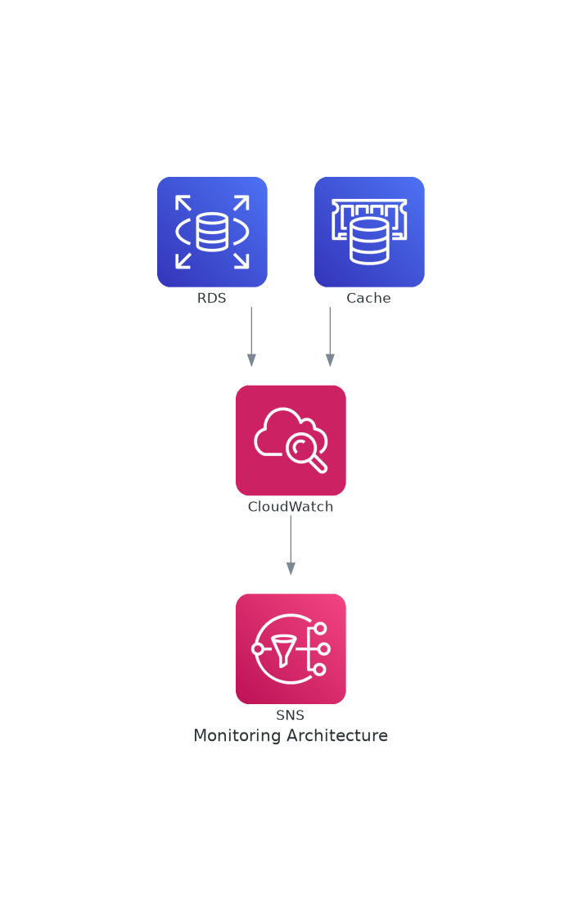

# November Week 1 Day 3 Session 3: 데이터베이스 운영 및 최적화

<div align="center">

**📊 모니터링** • **🔧 성능 최적화** • **🔄 백업 복구**

*RDS와 ElastiCache의 효과적인 운영 및 관리*

</div>

---

## 🕘 세션 정보
**시간**: 10:20-11:00 (40분)
**목표**: 데이터베이스 모니터링, 성능 최적화, 장애 대응

---

## 📖 서비스 개요

### 1. 생성 배경 (Why?)

**문제 상황**:
- **성능 저하 원인 파악 어려움**: 느린 쿼리 찾기 힘듦
- **장애 대응 지연**: 문제 발생 후 사후 대응
- **백업 복구 실패**: 백업 테스트 부족으로 복구 실패
- **비용 증가**: 불필요한 리소스 과다 프로비저닝

**AWS 모니터링 솔루션**:
- **CloudWatch**: 실시간 메트릭 및 알람
- **Performance Insights**: 쿼리 성능 분석
- **Enhanced Monitoring**: OS 수준 메트릭
- **자동 백업**: 일일 자동 백업 및 복구

---

### 2. 핵심 원리 (How?)

**모니터링 아키텍처**:



*그림: 데이터베이스 모니터링 아키텍처 - CloudWatch 메트릭 수집 및 SNS 알람*

```
RDS/ElastiCache
    ↓ 메트릭 수집
CloudWatch
    ↓ 임계값 초과 시
SNS (알람)
    ↓ 알림 전송
운영팀 (이메일/SMS)
```

**작동 원리**:
1. **메트릭 수집**: CPU, 메모리, 연결 수, IOPS 등
2. **임계값 설정**: 알람 조건 정의 (예: CPU > 80%)
3. **알람 발생**: 조건 충족 시 SNS 알림
4. **자동 대응**: Lambda로 자동 스케일링 (선택)
5. **로그 분석**: 느린 쿼리 로그 확인

**주요 메트릭**:

**RDS 메트릭**:
- **CPUUtilization**: CPU 사용률
- **DatabaseConnections**: 연결 수
- **FreeableMemory**: 사용 가능 메모리
- **ReadIOPS/WriteIOPS**: 디스크 IOPS
- **ReadLatency/WriteLatency**: 디스크 지연시간

**ElastiCache 메트릭**:
- **CPUUtilization**: CPU 사용률
- **DatabaseMemoryUsagePercentage**: 메모리 사용률
- **CacheHitRate**: 캐시 히트율
- **Evictions**: 메모리 부족으로 삭제된 항목
- **CurrConnections**: 현재 연결 수

---

### 3. 주요 사용 사례 (When?)

**적합한 경우**:
- ✅ 프로덕션 데이터베이스 운영
- ✅ 성능 문제 진단 및 해결
- ✅ 용량 계획 및 스케일링
- ✅ 장애 예방 및 대응

**실제 사례**:
- **Netflix**: Performance Insights로 쿼리 최적화
- **Uber**: CloudWatch 알람으로 장애 예방
- **Lyft**: Enhanced Monitoring으로 OS 수준 분석

---

### 4. 비슷한 서비스 비교 (Which?)

**CloudWatch vs Performance Insights**:
- **CloudWatch 사용**: 인프라 메트릭, 알람, 대시보드
- **Performance Insights 사용**: 쿼리 성능 분석, 병목 지점 파악

**Enhanced Monitoring vs CloudWatch**:
- **CloudWatch 사용**: 기본 메트릭, 무료
- **Enhanced Monitoring 사용**: OS 수준 메트릭, 유료

**선택 기준**:

| 기준 | CloudWatch | Performance Insights | Enhanced Monitoring |
|------|------------|---------------------|---------------------|
| 메트릭 | 인프라 | 쿼리 성능 | OS 수준 |
| 비용 | 무료 | 유료 | 유료 |
| 상세도 | 기본 | 높음 | 매우 높음 |
| 용도 | 일반 모니터링 | 성능 튜닝 | 심층 분석 |

---

### 5. 장단점 분석

**장점**:
- ✅ 실시간 모니터링 및 알람
- ✅ 쿼리 성능 분석 (Performance Insights)
- ✅ 자동 백업 및 복구
- ✅ 대시보드 및 시각화
- ✅ 이력 데이터 보관

**단점/제약사항**:
- ⚠️ Performance Insights 비용
- ⚠️ 메트릭 보관 기간 제한
- ⚠️ 실시간 알람 지연 (1-5분)
- ⚠️ 복잡한 쿼리 분석 제한

**대안**:
- 오픈소스: Prometheus + Grafana
- APM: New Relic, Datadog
- 로그 분석: CloudWatch Logs Insights

---

### 6. 비용 구조 💰

**과금 방식**:
- **CloudWatch 메트릭**: 기본 메트릭 무료, 커스텀 메트릭 유료
- **Performance Insights**: vCPU당 시간당 과금
- **Enhanced Monitoring**: 인스턴스당 시간당 과금
- **CloudWatch Logs**: GB당 과금

**프리티어 혜택**:
- CloudWatch: 10개 메트릭, 10개 알람 무료
- Logs: 5GB 수집, 5GB 저장 무료

**비용 최적화**:
1. **기본 메트릭 활용**: 대부분 충분
2. **Performance Insights**: 필요 시에만 활성화
3. **로그 보관 기간**: 적절한 기간 설정 (7-30일)
4. **알람 최소화**: 중요한 알람만 설정

**예상 비용 (ap-northeast-2)**:

| 항목 | 단가 | 월 비용 |
|------|------|---------|
| CloudWatch 기본 | 무료 | $0 |
| Performance Insights (db.t3.micro) | $0.009/시간 | $6.57 |
| Enhanced Monitoring | $0.30/인스턴스/월 | $0.30 |

**Lab 예상 비용**:
- CloudWatch 기본: $0
- 합계: ~$0

---

### 7. 최신 업데이트 🆕

**2024년 주요 변경사항**:
- **Performance Insights 개선**: 더 상세한 쿼리 분석
- **CloudWatch Logs Insights**: 강력한 로그 쿼리
- **Anomaly Detection**: AI 기반 이상 탐지

**2025년 예정**:
- 더 빠른 메트릭 수집
- 더 긴 메트릭 보관 기간

**참조**: [AWS CloudWatch What's New](https://aws.amazon.com/cloudwatch/whats-new/)

---

### 8. 잘 사용하는 방법 ✅

**베스트 프랙티스**:
1. **알람 설정**: CPU, 메모리, 연결 수, IOPS
2. **대시보드 구성**: 주요 메트릭 한눈에 확인
3. **Performance Insights**: 느린 쿼리 정기 분석
4. **자동 백업**: 7-35일 보관 기간 설정
5. **복구 테스트**: 정기적인 백업 복구 테스트

**실무 팁**:
- **알람 임계값**: 80% 경고, 90% 위험
- **복합 알람**: 여러 메트릭 조합 (CPU + 메모리)
- **SNS 통합**: Slack, PagerDuty 연동

**성능 최적화**:
- **인덱스 최적화**: Performance Insights로 확인
- **쿼리 튜닝**: 느린 쿼리 개선
- **Connection Pooling**: 연결 재사용

---

### 9. 잘못 사용하는 방법 ❌

**흔한 실수**:
1. **알람 미설정**: 장애 발생 후 인지
2. **백업 테스트 안함**: 복구 실패 위험
3. **메트릭 무시**: 성능 저하 방치
4. **과도한 알람**: 알람 피로 (Alert Fatigue)
5. **로그 미수집**: 문제 원인 파악 불가

**안티 패턴**:
- **모든 메트릭 알람**: 중요한 것만 선택
- **짧은 백업 기간**: 최소 7일 이상
- **수동 모니터링**: 자동화 필수

**보안 취약점**:
- **로그 공개**: CloudWatch Logs 접근 제어
- **알람 미설정**: 보안 이벤트 감지 불가
- **백업 암호화 미사용**: 스냅샷 암호화

---

### 10. 구성 요소 상세

**주요 구성 요소**:

**1. CloudWatch Metrics**:
- 역할: 메트릭 수집 및 저장
- 속성: 네임스페이스, 메트릭명, 차원
- 보관: 15개월

**2. CloudWatch Alarms**:
- 역할: 임계값 기반 알람
- 속성: 메트릭, 조건, 액션
- 액션: SNS, Auto Scaling, Lambda

**3. Performance Insights**:
- 역할: 쿼리 성능 분석
- 속성: Top SQL, Wait Events
- 보관: 7일 (무료), 최대 2년 (유료)

**설정 옵션**:
- **메트릭 주기**: 1분, 5분
- **알람 조건**: >, <, >=, <=
- **알람 액션**: SNS, Auto Scaling
- **로그 보관**: 1일 ~ 무제한

**의존성**:
- **SNS**: 알람 알림
- **Lambda**: 자동 대응
- **S3**: 로그 아카이브

---

### 11. 공식 문서 링크 (필수 5개)

**⚠️ 학생들이 직접 확인해야 할 공식 문서**:
- 📘 [CloudWatch란 무엇인가?](https://docs.aws.amazon.com/AmazonCloudWatch/latest/monitoring/WhatIsCloudWatch.html)
- 📗 [RDS 모니터링 가이드](https://docs.aws.amazon.com/AmazonRDS/latest/UserGuide/CHAP_Monitoring.html)
- 📙 [Performance Insights](https://docs.aws.amazon.com/AmazonRDS/latest/UserGuide/USER_PerfInsights.html)
- 📕 [CloudWatch 요금](https://aws.amazon.com/cloudwatch/pricing/)
- 🆕 [CloudWatch 최신 업데이트](https://aws.amazon.com/cloudwatch/whats-new/)

---

<div align="center">

**📊 실시간 모니터링** • **🔧 성능 최적화** • **🔄 자동 백업** • **💰 비용 효율**

*효과적인 데이터베이스 운영으로 안정성 확보*

</div>
