# 🌐 VPC 생성 완벽 가이드 (초보자용)

**📚 단계별 따라하기** • **🖼️ 스크린샷 포함** • **⚠️ 주의사항 강조**

*처음 AWS를 사용하는 분도 따라할 수 있는 상세 가이드*

---

## 🎯 이 가이드로 만들 것

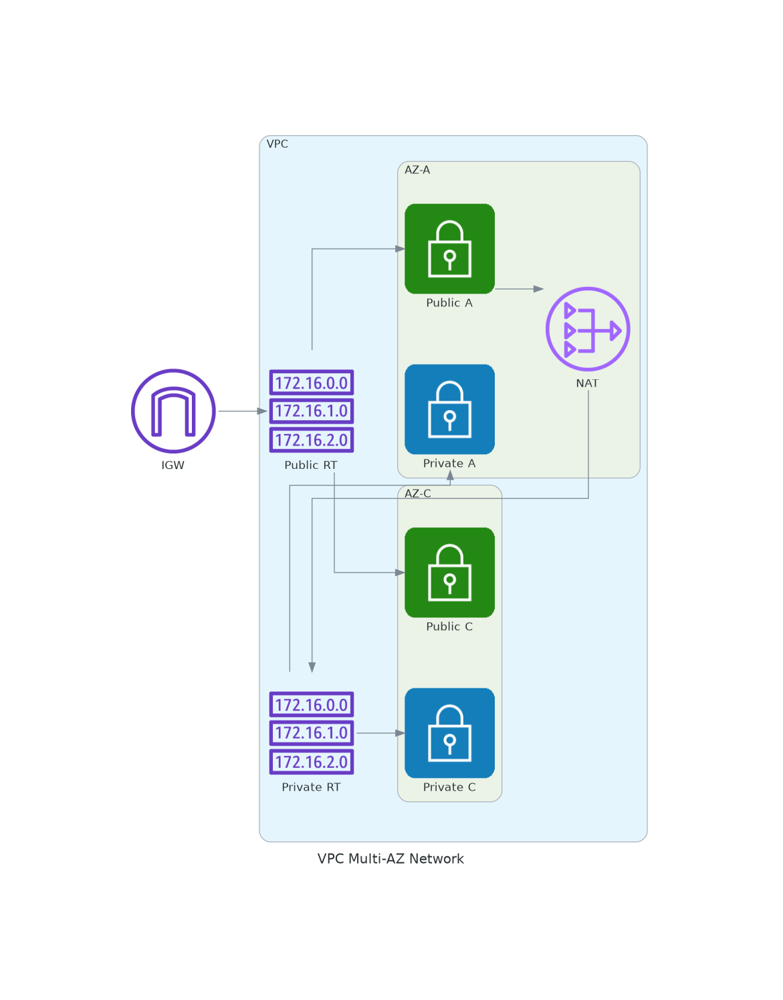

**아키텍처 설명**:
- **VPC**: 10.0.0.0/16 IP 범위의 격리된 네트워크
- **Internet Gateway**: 외부 인터넷과 연결
- **Route Tables** (2개):
  - **Public RT**: Internet Gateway로 트래픽 전달 (0.0.0.0/0 → IGW)
  - **Private RT**: NAT Gateway로 트래픽 전달 (0.0.0.0/0 → NAT) - 두 Private Subnet 공유
- **NAT Gateway**: AZ-A Public Subnet에 배치 (비용 절감을 위해 1개만 사용)
- **AZ-A (ap-northeast-2a)**: 첫 번째 가용 영역
  - Public Subnet (10.0.1.0/24): NAT Gateway 배치, Public RT 연결
  - Private Subnet (10.0.11.0/24): 데이터베이스 등 배치 예정, Private RT 연결
- **AZ-C (ap-northeast-2c)**: 두 번째 가용 영역
  - Public Subnet (10.0.2.0/24): 인터넷 연결용, Public RT 연결
  - Private Subnet (10.0.12.0/24): 데이터베이스 등 배치 예정, Private RT 연결

**트래픽 흐름**:
- **Public Subnet → 인터넷**: Public RT → Internet Gateway
- **Private Subnet → 인터넷**: Private RT → NAT Gateway → Public RT → Internet Gateway

**만들 리소스**:
- ✅ VPC 1개
- ✅ Public Subnet 2개 (AZ-A, AZ-C)
- ✅ Private Subnet 2개 (AZ-A, AZ-C)
- ✅ Internet Gateway 1개
- ✅ NAT Gateway 1개 (AZ-A에만 배치)
- ✅ Route Table 2개 (Public용 1개, Private용 1개)

---

## ⏱️ 예상 소요 시간
- **총 시간**: 약 20-25분
- **각 단계**: 2-5분씩

---

## 💰 비용 안내
- **VPC, Subnet, Route Table**: 무료
- **Internet Gateway**: 무료
- **NAT Gateway**: 시간당 약 $0.045 (1개만 사용)
- **실습 1시간 예상 비용**: 약 $0.05

⚠️ **중요**: 실습 완료 후 반드시 NAT Gateway를 삭제해야 비용이 발생하지 않습니다!

---

## 📋 사전 준비

### 1. AWS Console 로그인
1. 브라우저에서 https://console.aws.amazon.com 접속
2. 계정 정보 입력하여 로그인
3. 우측 상단에서 **서울 리전 (ap-northeast-2)** 선택 확인

### 2. VPC 서비스로 이동
1. 상단 검색창에 "VPC" 입력
2. "VPC" 클릭하여 VPC 대시보드로 이동

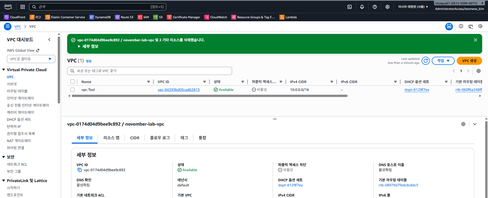

---

## 🏗️ Step 1: VPC 생성 (3분)

### 1-1. VPC 생성 시작
1. 좌측 메뉴에서 **"Your VPCs"** 클릭
2. 우측 상단 **"Create VPC"** 버튼 클릭

### 1-2. VPC 설정 입력

**⚠️ 중요: 아래 값을 정확히 입력하세요!**

| 항목 | 입력 값 | 설명 |
|------|---------|------|
| **Resources to create** | VPC only | ⚠️ "VPC only" 선택 (다른 것 선택 X) |
| **Name tag** | `november-w1-d3-vpc` | VPC 이름 (복사해서 붙여넣기) |
| **IPv4 CIDR block** | `10.0.0.0/16` | IP 주소 범위 (정확히 입력!) |
| **IPv6 CIDR block** | No IPv6 CIDR block | IPv6는 사용 안 함 |
| **Tenancy** | Default | 기본값 유지 |

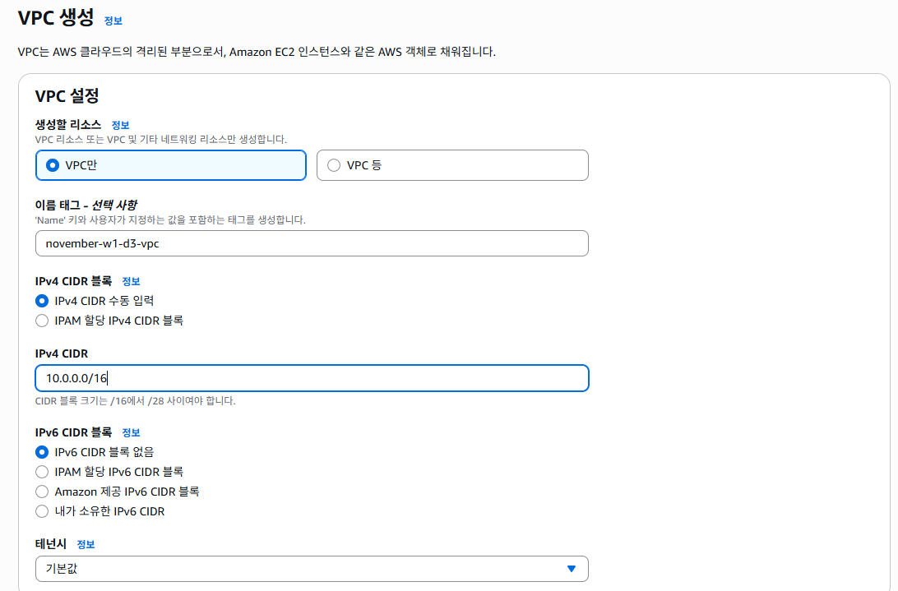
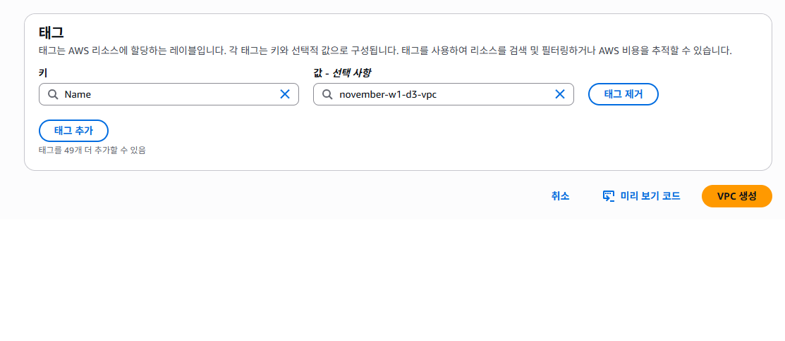

### 1-3. VPC 생성 완료
1. 하단 **"Create VPC"** 버튼 클릭
2. 녹색 성공 메시지 확인: "VPC november-w1-d3-vpc created successfully"
3. **VPC ID** 복사해두기 (예: vpc-0abc123def456...)

**📸 스크린샷 자리**: VPC 생성 완료 메시지 및 VPC ID

✅ **체크포인트**: VPC 목록에 `november-w1-d3-vpc`가 보이나요?

---

## 🌐 Step 2: Internet Gateway 생성 및 연결 (3분)

### 2-1. Internet Gateway 생성
1. 좌측 메뉴에서 **"Internet Gateways"** 클릭
2. 우측 상단 **"Create internet gateway"** 버튼 클릭

3. **Name tag**: `november-w1-d3-igw` 입력
4. 하단 **"Create internet gateway"** 버튼 클릭

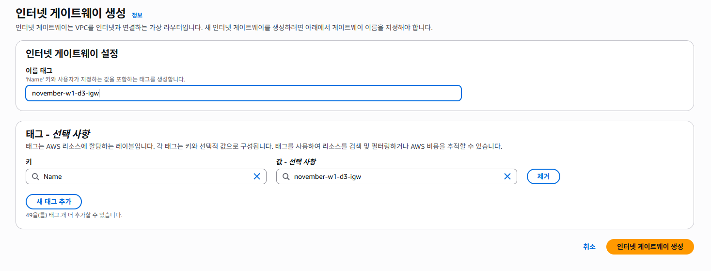

### 2-2. VPC에 연결 (⚠️ 중요!)
1. 생성 완료 후 나타나는 녹색 배너에서 **"Attach to a VPC"** 클릭
   - 또는 상단 **Actions** → **Attach to VPC** 클릭

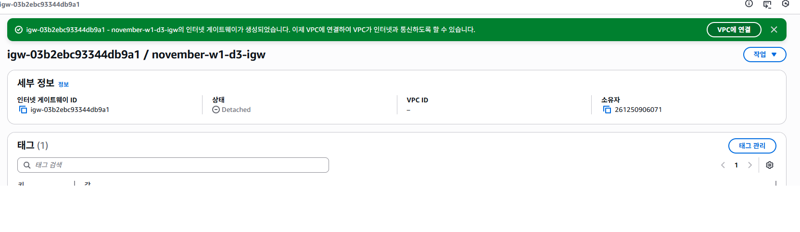

2. **Available VPCs** 드롭다운에서 `november-w1-d3-vpc` 선택
3. 하단 **"Attach internet gateway"** 버튼 클릭

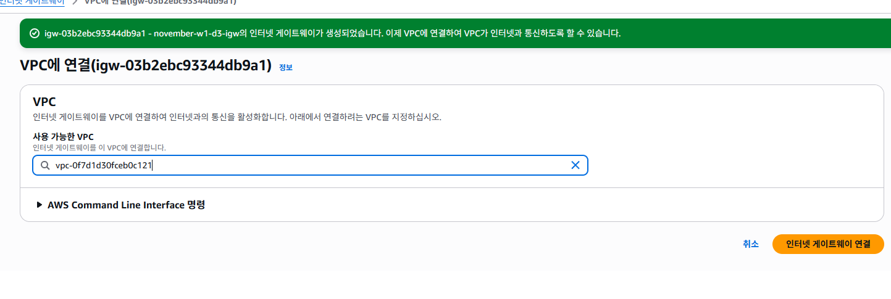

✅ **체크포인트**: State가 "Attached"로 변경되었나요?

---

## 📦 Step 3: Subnet 생성 (10분)

### ⚠️ 주의사항
- **총 4개의 Subnet**을 만들어야 합니다
- **Public 2개** (AZ-A, AZ-C)
- **Private 2개** (AZ-A, AZ-C)
- **순서대로** 하나씩 만들어야 합니다

---

### 3-1. Public Subnet A 생성

1. 좌측 메뉴에서 **"Subnets"** 클릭
2. 우측 상단 **"Create subnet"** 버튼 클릭
97.png)

**VPC 선택**:
- **VPC ID**: `november-w1-d3-vpc` 선택

**Subnet 설정**:

| 항목 | 입력 값 | 설명 |
|------|---------|------|
| **Subnet name** | `november-w1-d3-public-a` | Public Subnet A 이름 |
| **Availability Zone** | `ap-northeast-2a` | ⚠️ 반드시 2a 선택! |
| **IPv4 CIDR block** | `10.0.1.0/24` | IP 범위 (정확히 입력!) |

3. 하단 **"Create subnet"** 버튼 클릭

---

### 3-2. Public Subnet C 생성

1. 다시 **"Create subnet"** 버튼 클릭

**VPC 선택**:
- **VPC ID**: `november-w1-d3-vpc` 선택

**Subnet 설정**:

| 항목 | 입력 값 | 설명 |
|------|---------|------|
| **Subnet name** | `november-w1-d3-public-c` | Public Subnet C 이름 |
| **Availability Zone** | `ap-northeast-2c` | ⚠️ 반드시 2c 선택! |
| **IPv4 CIDR block** | `10.0.2.0/24` | IP 범위 (정확히 입력!) |

2. 하단 **"Create subnet"** 버튼 클릭

---

### 3-3. Private Subnet A 생성

1. 다시 **"Create subnet"** 버튼 클릭

**VPC 선택**:
- **VPC ID**: `november-w1-d3-vpc` 선택

**Subnet 설정**:

| 항목 | 입력 값 | 설명 |
|------|---------|------|
| **Subnet name** | `november-w1-d3-private-a` | Private Subnet A 이름 |
| **Availability Zone** | `ap-northeast-2a` | ⚠️ 반드시 2a 선택! |
| **IPv4 CIDR block** | `10.0.11.0/24` | IP 범위 (정확히 입력!) |

2. 하단 **"Create subnet"** 버튼 클릭

---

### 3-4. Private Subnet C 생성

1. 다시 **"Create subnet"** 버튼 클릭

**VPC 선택**:
- **VPC ID**: `november-w1-d3-vpc` 선택

**Subnet 설정**:

| 항목 | 입력 값 | 설명 |
|------|---------|------|
| **Subnet name** | `november-w1-d3-private-c` | Private Subnet C 이름 |
| **Availability Zone** | `ap-northeast-2c` | ⚠️ 반드시 2c 선택! |
| **IPv4 CIDR block** | `10.0.12.0/24` | IP 범위 (정확히 입력!) |

2. 하단 **"Create subnet"** 버튼 클릭

**📸 스크린샷 자리**: 4개 Subnet 생성 완료 목록

---

### 3-5. Public Subnet에 자동 Public IP 할당 설정 (⚠️ 매우 중요!)

**Public Subnet A 설정**:
1. Subnet 목록에서 `november-w1-d3-public-a` 체크박스 선택
2. 상단 **Actions** → **Edit subnet settings** 클릭

3. **Auto-assign IP settings** 섹션에서:
   - ✅ **"Enable auto-assign public IPv4 address"** 체크박스 선택

4. 하단 **"Save"** 버튼 클릭

**Public Subnet C 설정**:
1. Subnet 목록에서 `november-w1-d3-public-c` 체크박스 선택
2. 상단 **Actions** → **Edit subnet settings** 클릭
3. **Auto-assign IP settings** 섹션에서:
   - ✅ **"Enable auto-assign public IPv4 address"** 체크박스 선택
4. 하단 **"Save"** 버튼 클릭

✅ **체크포인트**: 
- Subnet 목록에 4개의 Subnet이 보이나요?
- Public Subnet 2개의 "Auto-assign public IPv4 address" 컬럼이 "Yes"인가요?

---

## 🚪 Step 4: NAT Gateway 생성 (3분)

### ⚠️ 중요 개념
- **NAT Gateway**: Private Subnet의 인스턴스가 인터넷에 접근할 수 있게 해주는 관문
- **반드시 Public Subnet에 배치**해야 합니다!
- **비용 절감**: 1개만 만들어서 두 AZ의 Private Subnet이 공유합니다

---

### 4-1. NAT Gateway 생성

1. 좌측 메뉴에서 **"NAT Gateways"** 클릭
2. 우측 상단 **"Create NAT gateway"** 버튼 클릭

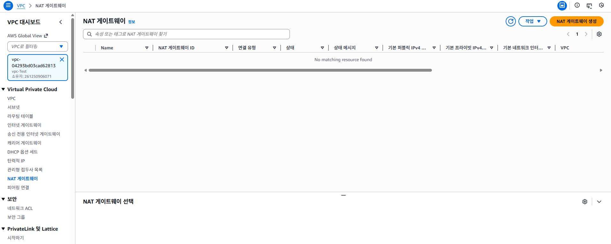

**NAT Gateway 설정**:

| 항목 | 입력 값 | 설명 |
|------|---------|------|
| **Name** | `november-w1-d3-nat` | NAT Gateway 이름 |
| **Subnet** | `november-w1-d3-public-a` | ⚠️ Public Subnet A 선택! |
| **Connectivity type** | Public | Public 선택 (기본값) |
| **Elastic IP allocation ID** | **"Allocate Elastic IP"** 버튼 클릭 | 새 IP 할당 |

3. 하단 **"Create NAT gateway"** 버튼 클릭
4. 생성 완료까지 약 1-2분 대기 (Status: Pending → Available)

✅ **체크포인트**: 
- NAT Gateway가 "Available" 상태인가요?
- Public Subnet A에 배치되었나요?
- Elastic IP가 할당되었나요?

---

## 🛣️ Step 5: Route Table 생성 및 설정 (5분)

### ⚠️ 중요 개념
- **Route Table**: 네트워크 트래픽이 어디로 가야 하는지 알려주는 이정표
- **Public Route Table**: 인터넷으로 가는 길 (Internet Gateway 사용)
- **Private Route Table**: NAT Gateway를 통해 인터넷으로 가는 길 (두 Private Subnet 공유)

---

### 5-1. Public Route Table 생성

1. 좌측 메뉴에서 **"Route Tables"** 클릭
2. 우측 상단 **"Create route table"** 버튼 클릭

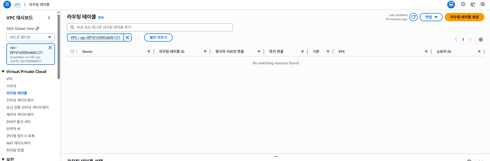

**Route Table 설정**:

| 항목 | 입력 값 |
|------|---------|
| **Name** | `november-w1-d3-public-rt` |
| **VPC** | `november-w1-d3-vpc` 선택 |

3. 하단 **"Create route table"** 버튼 클릭

---

### 5-2. Public Route Table에 인터넷 경로 추가

1. 생성된 `november-w1-d3-public-rt` 선택
2. 하단 탭에서 **"Routes"** 탭 클릭
3. **"Edit routes"** 버튼 클릭

4. **"Add route"** 버튼 클릭

**경로 추가**:

| 항목 | 입력 값 | 설명 |
|------|---------|------|
| **Destination** | `0.0.0.0/0` | 모든 인터넷 트래픽 |
| **Target** | Internet Gateway → `november-w1-d3-igw` 선택 | IGW로 보내기 |

5. 하단 **"Save changes"** 버튼 클릭

---

### 5-3. Public Subnet들을 Public Route Table에 연결

1. `november-w1-d3-public-rt` 선택 상태에서
2. 하단 탭에서 **"Subnet associations"** 탭 클릭
3. **"Edit subnet associations"** 버튼 클릭

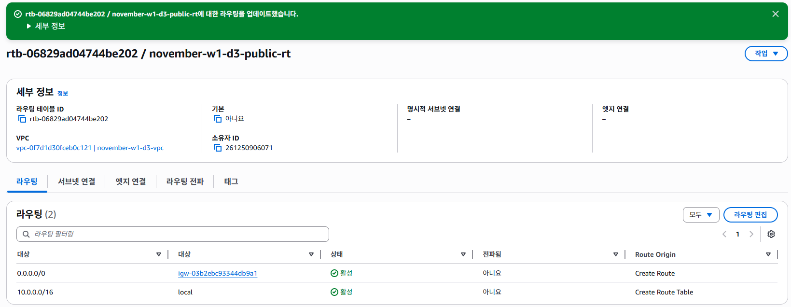

4. 다음 2개 Subnet 체크박스 선택:
   - ✅ `november-w1-d3-public-a`
   - ✅ `november-w1-d3-public-c`

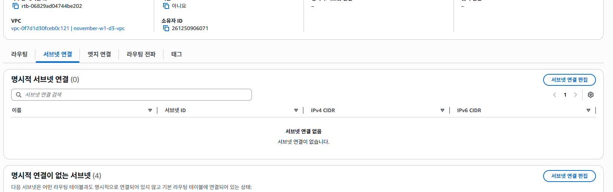

5. 하단 **"Save associations"** 버튼 클릭

---

### 5-4. Private Route Table 생성

1. 다시 **"Create route table"** 버튼 클릭

**Route Table 설정**:

| 항목 | 입력 값 |
|------|---------|
| **Name** | `november-w1-d3-private-rt` |
| **VPC** | `november-w1-d3-vpc` 선택 |

2. 하단 **"Create route table"** 버튼 클릭

---

### 5-5. Private Route Table에 NAT Gateway 경로 추가

1. 생성된 `november-w1-d3-private-rt` 선택
2. 하단 탭에서 **"Routes"** 탭 클릭
3. **"Edit routes"** 버튼 클릭
4. **"Add route"** 버튼 클릭

**경로 추가**:

| 항목 | 입력 값 | 설명 |
|------|---------|------|
| **Destination** | `0.0.0.0/0` | 모든 인터넷 트래픽 |
| **Target** | NAT Gateway → `november-w1-d3-nat` 선택 | NAT Gateway로 보내기 |

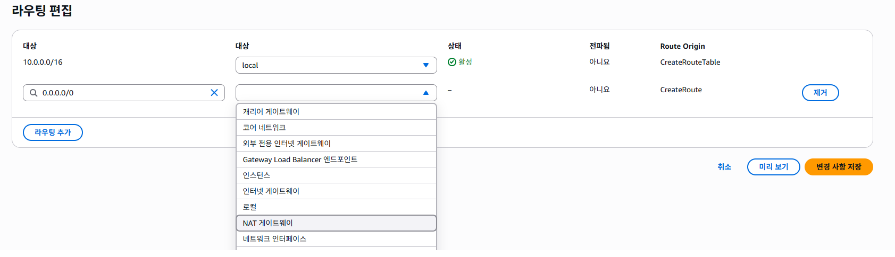

5. 하단 **"Save changes"** 버튼 클릭

---

### 5-6. Private Subnet 2개를 Private Route Table에 연결

1. `november-w1-d3-private-rt` 선택 상태에서
2. 하단 탭에서 **"Subnet associations"** 탭 클릭
3. **"Edit subnet associations"** 버튼 클릭
4. 다음 2개 Subnet 체크박스 선택:
   - ✅ `november-w1-d3-private-a`
   - ✅ `november-w1-d3-private-c`

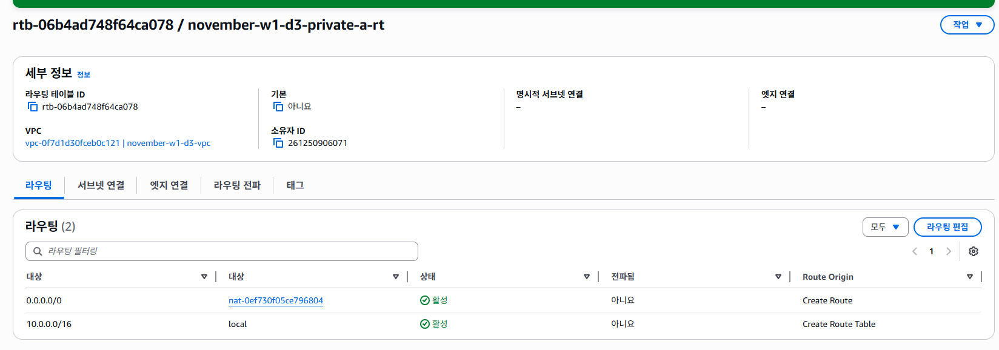

5. 하단 **"Save associations"** 버튼 클릭

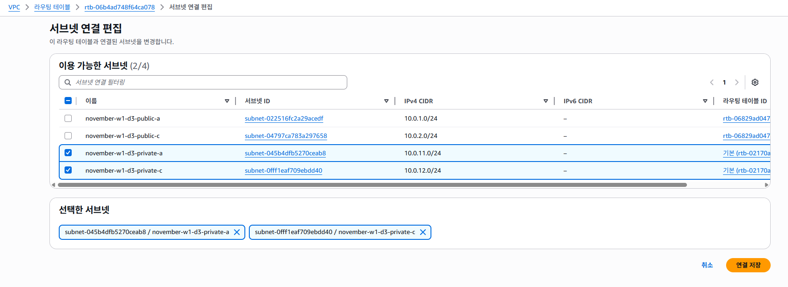

---

## ✅ 최종 검증 체크리스트

### VPC 리소스 확인

**VPC**:
- [ ] `november-w1-d3-vpc` (10.0.0.0/16) 존재

**Internet Gateway**:
- [ ] `november-w1-d3-igw` 존재
- [ ] State: Attached

**Subnets** (총 4개):
- [ ] `november-w1-d3-public-a` (10.0.1.0/24, AZ-A)
- [ ] `november-w1-d3-public-c` (10.0.2.0/24, AZ-C)
- [ ] `november-w1-d3-private-a` (10.0.11.0/24, AZ-A)
- [ ] `november-w1-d3-private-c` (10.0.12.0/24, AZ-C)
- [ ] Public Subnet 2개 모두 "Auto-assign public IPv4 address" = Yes

**NAT Gateways** (총 1개):
- [ ] `november-w1-d3-nat` (Public Subnet A에 배치)
- [ ] Status: Available
- [ ] Elastic IP 할당됨

**Route Tables** (총 2개):
- [ ] `november-w1-d3-public-rt`
  - [ ] Route: 0.0.0.0/0 → IGW
  - [ ] Associated: Public Subnet A, C
- [ ] `november-w1-d3-private-rt`
  - [ ] Route: 0.0.0.0/0 → NAT Gateway
  - [ ] Associated: Private Subnet A, C (두 Subnet 모두 연결)

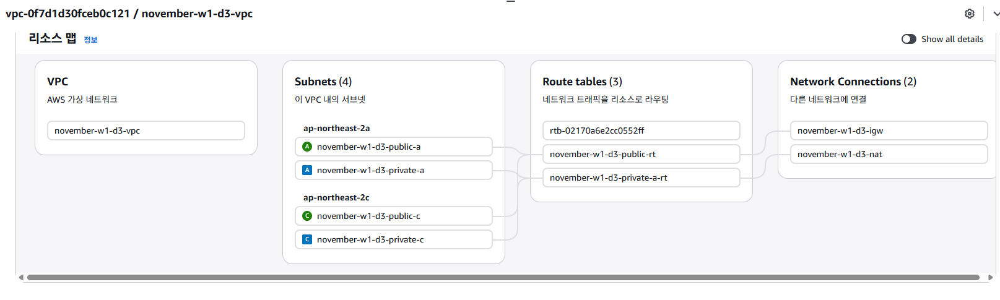

---

## 🎉 완료!

축하합니다! VPC 네트워크 구성이 완료되었습니다.

이제 다음 단계로 진행할 수 있습니다:
- ✅ Public Subnet에 EC2 인스턴스 배치 가능
- ✅ Private Subnet에 RDS 데이터베이스 배치 가능
- ✅ 고가용성 Multi-AZ 아키텍처 준비 완료

---

## 🧹 실습 완료 후 리소스 정리 (중요!)

⚠️ **비용 발생 방지를 위해 반드시 순서대로 삭제하세요!**

### 삭제 순서 (역순)

**1. NAT Gateway 삭제** (가장 먼저! ⚠️)
1. VPC → NAT Gateways
2. `november-w1-d3-nat` 선택 → Actions → Delete NAT gateway
3. "delete" 입력하여 확인
4. 삭제 완료까지 약 5분 대기

**📸 스크린샷 자리**: NAT Gateway 삭제 확인

**2. Elastic IP 해제**
1. VPC → Elastic IPs
2. NAT Gateway에 사용된 IP 선택 → Actions → Release Elastic IP addresses
3. "Release" 버튼 클릭

**📸 스크린샷 자리**: Elastic IP 해제 확인

**3. Route Table 삭제**
1. Route Tables → Private RT 2개 선택
2. Actions → Delete route table
3. Public RT도 Subnet 연결 해제 후 삭제

**4. Subnet 삭제**
1. Subnets → 4개 모두 선택
2. Actions → Delete subnet

**5. Internet Gateway 분리 및 삭제**
1. Internet Gateways → IGW 선택
2. Actions → Detach from VPC
3. 분리 후 → Actions → Delete internet gateway

**6. VPC 삭제**
1. Your VPCs → VPC 선택
2. Actions → Delete VPC

**📸 스크린샷 자리**: 모든 리소스 삭제 완료

---

## 🔍 트러블슈팅

### 문제 1: Subnet 생성 시 "CIDR block overlaps" 오류
**원인**: IP 범위가 겹침
**해결**: CIDR 블록을 정확히 입력했는지 확인
- Public A: 10.0.1.0/24
- Public C: 10.0.2.0/24
- Private A: 10.0.11.0/24
- Private C: 10.0.12.0/24

### 문제 2: NAT Gateway 생성 시 "Subnet must be public" 오류
**원인**: Private Subnet을 선택함
**해결**: 반드시 Public Subnet (public-a 또는 public-c) 선택

### 문제 3: Route Table 연결 시 Subnet이 안 보임
**원인**: 다른 VPC의 Subnet을 보고 있음
**해결**: Route Table 생성 시 올바른 VPC를 선택했는지 확인

### 문제 4: Public IP가 자동 할당되지 않음
**원인**: Auto-assign public IPv4 address 설정 안 함
**해결**: Public Subnet 선택 → Actions → Edit subnet settings → 체크박스 활성화

### 문제 5: NAT Gateway 삭제가 안 됨
**원인**: 아직 사용 중이거나 삭제 진행 중
**해결**: 5분 정도 대기 후 다시 시도, Route Table에서 연결 해제 확인

### 문제 6: VPC 삭제 시 "has dependencies" 오류
**원인**: 아직 연결된 리소스가 남아있음
**해결**: 
1. NAT Gateway 완전 삭제 확인 (5분 대기)
2. Elastic IP 해제 확인
3. 모든 Subnet 삭제 확인
4. IGW 분리 확인

---

**🌐 VPC 완성** • **🔒 보안 네트워크** • **🚀 고가용성 준비**

*이제 안전하고 확장 가능한 AWS 네트워크가 준비되었습니다!*

