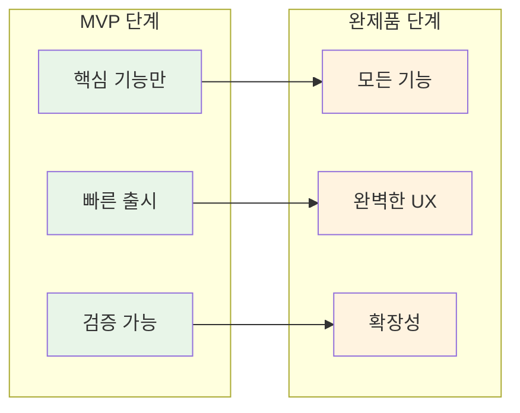
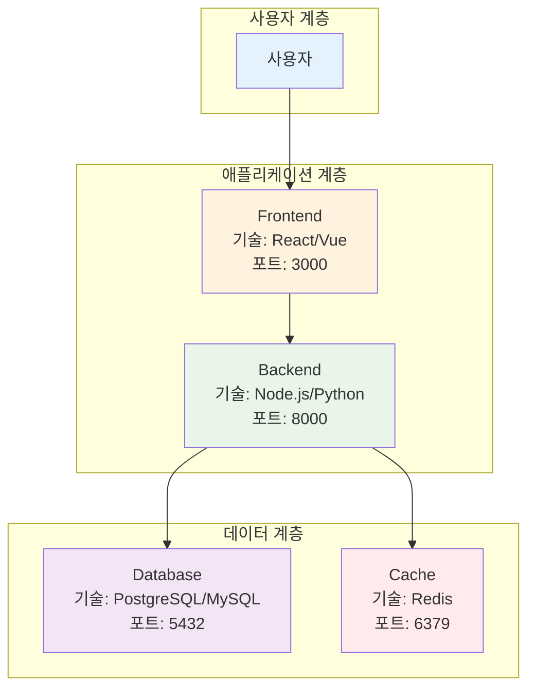
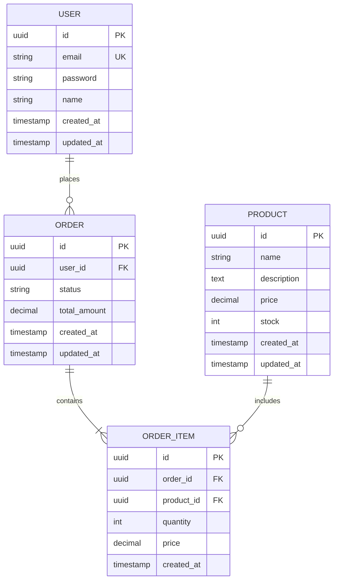
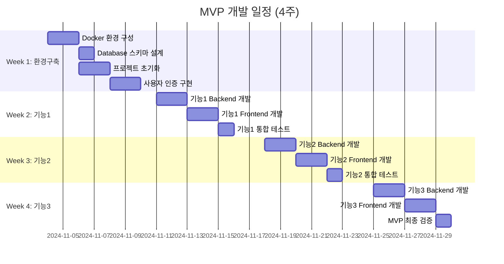
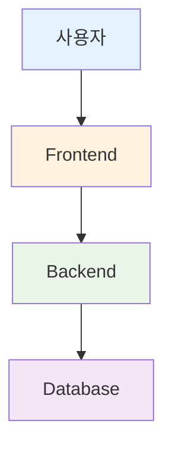

# November Week 1 Day 4 Challenge 1: MVP 추출 및 아키텍처 설계

<div align="center">

**🎯 MVP 정의** • **🏗️ 아키텍처 설계** • **📋 기능 목록 작성**

*프로젝트의 핵심 가치를 담은 최소 기능 제품 설계*

</div>

---

## 🕘 Challenge 정보
**시간**: 15:15-16:05 (50분)
**목표**: 팀 프로젝트의 MVP 정의 및 구현 계획 수립
**방식**: 팀 협업 (3-4명)
**산출물**: MVP 정의 문서 (Markdown)

## 🎯 Challenge 목표

### 📚 학습 목표
- MVP (Minimum Viable Product) 개념 이해
- 필수 기능과 부가 기능 구분 능력
- 실현 가능한 아키텍처 설계
- 팀 내 기능 우선순위 합의

### 🛠️ 실무 역량
- 제한된 시간/리소스 내 핵심 가치 전달
- 기술 스택 선택 및 정당화
- 단계적 개발 계획 수립
- 팀 커뮤니케이션 및 합의 도출

---

## 🤔 MVP란 무엇인가?

### 정의
> **MVP (Minimum Viable Product)**: 고객에게 핵심 가치를 전달할 수 있는 최소한의 기능을 가진 제품

### 핵심 원칙
1. **핵심 가치 집중**: 프로젝트의 본질적 목적에 집중
2. **빠른 검증**: 최소 기능으로 아이디어 검증
3. **반복 개선**: 피드백 기반 점진적 개선
4. **리소스 효율**: 시간과 비용 최소화

### MVP vs 완제품


---

## 📋 Challenge 과제

### 🎯 산출물: MVP 정의 문서

**제출 형식**: Markdown 파일 (`team-name-mvp.md`)
**제출 위치**: 팀 GitHub Repository
**제출 기한**: Challenge 종료 시 (16:05)

---

## 📝 MVP 정의 문서 템플릿

```markdown
# [프로젝트명] MVP 정의서

## 📌 프로젝트 개요

### 프로젝트명
[프로젝트 이름]

### 한 줄 설명
[프로젝트를 한 줄로 설명]

### 핵심 가치
[이 프로젝트가 사용자에게 제공하는 핵심 가치는 무엇인가?]

**예시**:
- 티켓팅 시스템: "공정한 선착순 티켓 예매 경험"
- 채팅 앱: "실시간 그룹 커뮤니케이션"
- 쇼핑몰: "간편한 온라인 구매 경험"

---

## 🎯 MVP 범위 정의

### ✅ 필수 기능 (Must Have)
> 이 기능 없이는 프로젝트의 핵심 가치를 전달할 수 없음

**기능 1**: [기능명]
- **설명**: [무엇을 하는 기능인가?]
- **사용자 시나리오**: [사용자가 어떻게 사용하는가?]
- **핵심 이유**: [왜 필수인가?]

**기능 2**: [기능명]
- **설명**: 
- **사용자 시나리오**: 
- **핵심 이유**: 

**기능 3**: [기능명]
- **설명**: 
- **사용자 시나리오**: 
- **핵심 이유**: 

**💡 팁**: 필수 기능은 3-5개로 제한하세요!

---

### 🔄 2차 기능 (Should Have)
> MVP 이후 바로 추가할 중요한 기능

**기능 1**: [기능명]
- **설명**: 
- **추가 시기**: [MVP 완성 후 언제?]

**기능 2**: [기능명]
- **설명**: 
- **추가 시기**: 

---

### 💡 3차 기능 (Nice to Have)
> 있으면 좋지만 당장 필요하지 않은 기능

- [기능 1]
- [기능 2]
- [기능 3]

---

### ❌ 제외 기능 (Won't Have)
> MVP에서 명확히 제외하는 기능 (범위 관리)

- [기능 1]: [제외 이유]
- [기능 2]: [제외 이유]

---

## 🏗️ MVP 아키텍처

### 시스템 구성도



**💡 팁**: 위 다이어그램을 팀 프로젝트에 맞게 수정하세요!

---

### 기술 스택

#### Frontend
- **프레임워크**: [React/Vue/Angular]
- **상태 관리**: [Redux/Vuex/Context API]
- **스타일링**: [Tailwind/Material-UI/Bootstrap]
- **선택 이유**: [왜 이 기술을 선택했는가?]

#### Backend
- **언어/프레임워크**: [Node.js/Python/Java]
- **웹 프레임워크**: [Express/FastAPI/Spring]
- **인증**: [JWT/Session]
- **선택 이유**: [왜 이 기술을 선택했는가?]

#### Database
- **RDBMS**: [PostgreSQL/MySQL]
- **NoSQL**: [MongoDB/Redis] (필요시)
- **선택 이유**: [왜 이 데이터베이스를 선택했는가?]

#### Infrastructure
- **컨테이너**: Docker + Docker Compose
- **배포**: [AWS/GCP/Azure]
- **CI/CD**: [GitHub Actions/GitLab CI]

---

### 데이터 모델 (핵심만)

#### ERD (Entity Relationship Diagram)



**💡 팁**: 위 ERD를 팀 프로젝트에 맞게 수정하세요!

---

#### ERD 작성 도구

**추천 도구**:

1. **ERDCloud** (무료, 한글 지원) ⭐
   - URL: https://www.erdcloud.com/
   - 장점: 한글 UI, 협업 가능, 이미지 내보내기
   - 사용법: 회원가입 → 새 다이어그램 → 테이블 추가

2. **dbdiagram.io** (무료)
   - URL: https://dbdiagram.io/
   - 장점: 코드로 ERD 작성, 빠른 수정
   - 사용법: 코드 입력 → 자동 다이어그램 생성

3. **draw.io** (무료)
   - URL: https://app.diagrams.net/
   - 장점: 다양한 다이어그램 지원
   - 사용법: Entity Relationship 템플릿 선택

4. **Mermaid Live Editor** (무료)
   - URL: https://mermaid.live/
   - 장점: Markdown에 바로 삽입 가능
   - 사용법: 위 Mermaid 코드 복사 → 편집

---

#### ERD 링크 (팀 작성)

**팀 ERD 링크**: [여기에 ERDCloud 또는 dbdiagram 링크 입력]

**예시**:
- ERDCloud: `https://www.erdcloud.com/d/xxxxx`
- dbdiagram: `https://dbdiagram.io/d/xxxxx`

**이미지 파일**: `docs/erd.png` (Repository에 저장)

---

#### ERD 작성 가이드

**ERD에 반드시 포함할 정보**:
- ✅ **테이블명**: 명확하고 일관된 네이밍
- ✅ **컬럼명 + 타입**: `id UUID`, `email VARCHAR(255)`
- ✅ **제약조건**: `PK`, `FK`, `UK` (Unique Key), `NOT NULL`
- ✅ **관계**: `1:1`, `1:N`, `N:M` 명확히 표시
- ✅ **인덱스**: 자주 조회하는 컬럼 표시

**예시**:
```
USER 테이블
- id: UUID [PK]
- email: VARCHAR(255) [UK, NOT NULL, INDEX]
- password: VARCHAR(255) [NOT NULL]
- name: VARCHAR(100) [NOT NULL]
- created_at: TIMESTAMP
- updated_at: TIMESTAMP

관계: USER (1) --- (N) ORDER
```

**💡 팁**: ERD 도구에서 제약조건과 인덱스를 명확히 표시하면 별도 문서 불필요!

---

### API 엔드포인트 (핵심만)

#### 인증
- `POST /api/auth/register` - 회원가입
- `POST /api/auth/login` - 로그인
- `POST /api/auth/logout` - 로그아웃

#### 핵심 기능
- `GET /api/[resource]` - 목록 조회
- `POST /api/[resource]` - 생성
- `GET /api/[resource]/:id` - 상세 조회
- `PUT /api/[resource]/:id` - 수정
- `DELETE /api/[resource]/:id` - 삭제

**💡 팁**: 필수 기능에 필요한 API만 나열하세요!

---

## 📅 개발 일정 및 마일스톤

### 🎯 Milestone 1: 개발 환경 구축 (Week 1)
**목표**: 로컬에서 전체 시스템 실행 가능

**Day 1-2**: 인프라 설정
- [ ] Docker Compose 환경 구성
- [ ] Database 스키마 설계 및 생성
- [ ] Frontend 프로젝트 초기화
- [ ] Backend 프로젝트 초기화
- [ ] Git Repository 및 브랜치 전략 수립

**Day 3-5**: 기본 기능 구현
- [ ] 사용자 인증 (회원가입/로그인)
- [ ] 기본 UI 레이아웃
- [ ] API 기본 구조
- [ ] Database 연결 테스트

**완료 기준**:
- ✅ `docker-compose up`으로 전체 시스템 실행
- ✅ 회원가입/로그인 동작
- ✅ 기본 API 응답 확인

---

### 🎯 Milestone 2: 필수 기능 1 구현 (Week 2)
**목표**: [필수 기능 1명] 완전 동작

**Day 1-2**: Backend 구현
- [ ] [기능 1] API 엔드포인트 개발
- [ ] 비즈니스 로직 구현
- [ ] Database CRUD 작업
- [ ] 단위 테스트 작성

**Day 3-4**: Frontend 구현
- [ ] [기능 1] UI 컴포넌트 개발
- [ ] API 연동
- [ ] 상태 관리
- [ ] 에러 처리

**Day 5**: 통합 및 테스트
- [ ] Frontend-Backend 통합 테스트
- [ ] 사용자 시나리오 테스트
- [ ] 버그 수정

**완료 기준**:
- ✅ [기능 1] 사용자 시나리오 완주 가능
- ✅ 에러 없이 안정적 동작
- ✅ 팀원 전체 리뷰 완료

---

### 🎯 Milestone 3: 필수 기능 2 구현 (Week 3)
**목표**: [필수 기능 2명] 완전 동작

**Day 1-2**: Backend 구현
- [ ] [기능 2] API 엔드포인트 개발
- [ ] 비즈니스 로직 구현
- [ ] [기능 1]과 연동
- [ ] 단위 테스트 작성

**Day 3-4**: Frontend 구현
- [ ] [기능 2] UI 컴포넌트 개발
- [ ] API 연동
- [ ] [기능 1]과 통합
- [ ] 에러 처리

**Day 5**: 통합 및 테스트
- [ ] Frontend-Backend 통합 테스트
- [ ] [기능 1] + [기능 2] 연계 테스트
- [ ] 버그 수정

**완료 기준**:
- ✅ [기능 2] 사용자 시나리오 완주 가능
- ✅ [기능 1]과 연계 동작 확인
- ✅ 팀원 전체 리뷰 완료

---

### 🎯 Milestone 4: 필수 기능 3 구현 (Week 4)
**목표**: [필수 기능 3명] 완전 동작 + MVP 완성

**Day 1-2**: Backend 구현
- [ ] [기능 3] API 엔드포인트 개발
- [ ] 비즈니스 로직 구현
- [ ] 전체 기능 연동
- [ ] 단위 테스트 작성

**Day 3-4**: Frontend 구현
- [ ] [기능 3] UI 컴포넌트 개발
- [ ] API 연동
- [ ] 전체 기능 통합
- [ ] 에러 처리

**Day 5**: MVP 최종 검증
- [ ] 전체 사용자 시나리오 테스트
- [ ] 성능 테스트 (응답 시간, 동시 사용자)
- [ ] 버그 수정
- [ ] README 문서 작성

**완료 기준**:
- ✅ 모든 필수 기능 동작
- ✅ 전체 사용자 시나리오 완주 가능
- ✅ 성능 기준 충족
- ✅ 문서화 완료

---

### 📊 상세 일정표 (Gantt Chart)



**일일 작업 시간**: 4-6시간 (팀 전체)
**주간 작업 시간**: 20-30시간 (팀 전체)

---

### 🔄 반복 작업 (매주)

**매주 월요일**:
- [ ] 주간 계획 회의 (30분)
- [ ] 이슈 우선순위 정리
- [ ] 역할 재분배 (필요시)

**매주 금요일**:
- [ ] 주간 회고 (30분)
- [ ] 완료 기능 데모
- [ ] 다음 주 계획 수립
- [ ] 문서 업데이트

---

## 🎯 성공 기준

### 기능적 요구사항
- [ ] 모든 필수 기능 동작
- [ ] 사용자 시나리오 완주 가능
- [ ] 에러 없이 안정적 동작

### 비기능적 요구사항
- [ ] 응답 시간 < 2초
- [ ] 동시 사용자 10명 처리 가능
- [ ] 모바일 반응형 지원

### 배포 요구사항
- [ ] Docker Compose로 로컬 실행 가능
- [ ] AWS에 배포 가능
- [ ] README 문서 완비

---

## 💡 팀 역할 분담

### Frontend
- **담당자**: [이름]
- **책임**: [구체적 역할]

### Backend
- **담당자**: [이름]
- **책임**: [구체적 역할]

### DevOps
- **담당자**: [이름]
- **책임**: [구체적 역할]

### 공통
- **코드 리뷰**: 모든 팀원
- **문서화**: 모든 팀원

---

## 🚨 리스크 관리

### 기술적 리스크
**리스크 1**: [예상되는 기술적 어려움]
- **영향도**: 상/중/하
- **대응 방안**: [어떻게 해결할 것인가?]

**리스크 2**: [예상되는 기술적 어려움]
- **영향도**: 상/중/하
- **대응 방안**: [어떻게 해결할 것인가?]

### 일정 리스크
**리스크 1**: [일정 지연 가능성]
- **영향도**: 상/중/하
- **대응 방안**: [어떻게 해결할 것인가?]

---

## 📊 의사결정 기록

### 결정 1: [기술 선택 / 기능 제외 등]
- **날짜**: YYYY-MM-DD
- **결정 내용**: [무엇을 결정했는가?]
- **이유**: [왜 이렇게 결정했는가?]
- **참여자**: [누가 참여했는가?]

### 결정 2: [기술 선택 / 기능 제외 등]
- **날짜**: YYYY-MM-DD
- **결정 내용**: 
- **이유**: 
- **참여자**: 

---

## 🔗 참고 자료

### 프로젝트 링크
- **GitHub Repository**: [URL]
- **Figma 디자인**: [URL] (있는 경우)
- **API 문서**: [URL] (있는 경우)

### 기술 문서
- [기술 스택 공식 문서 링크]
- [참고한 아키텍처 패턴]

---

## ✅ 체크리스트

### 문서 완성도
- [ ] 프로젝트 개요 작성
- [ ] 필수 기능 3-5개 정의
- [ ] 아키텍처 다이어그램 작성
- [ ] 기술 스택 선택 및 이유 명시
- [ ] API 엔드포인트 정의
- [ ] 개발 일정 수립
- [ ] 팀 역할 분담
- [ ] 리스크 관리 계획

### 팀 합의
- [ ] 모든 팀원이 MVP 범위에 동의
- [ ] 기술 스택 선택에 합의
- [ ] 역할 분담에 동의
- [ ] 일정에 동의

---

<div align="center">

**작성일**: YYYY-MM-DD
**작성자**: [팀명] 전체
**버전**: 1.0

</div>
```

---

## 🎯 Challenge 진행 방법

### Step 1: 팀 브레인스토밍 (15분)

**질문 리스트**:
1. **핵심 가치**: 우리 프로젝트의 본질은 무엇인가?
2. **사용자 시나리오**: 사용자가 가장 먼저 하고 싶은 일은?
3. **필수 vs 부가**: 이 기능 없이도 프로젝트가 의미 있는가?
4. **기술 선택**: 우리 팀이 가장 잘 다루는 기술은?
5. **시간 제약**: 2주 안에 구현 가능한가?

**브레인스토밍 방법**:
```
1. 각자 포스트잇에 기능 아이디어 작성 (5분)
2. 벽에 붙이고 그룹핑 (5분)
3. 필수/2차/3차로 분류 (5분)
```

---

### Step 2: MVP 범위 정의 (10분)

**필수 기능 선정 기준**:
- ✅ 이 기능 없으면 프로젝트 의미 없음
- ✅ 사용자가 핵심 가치를 경험할 수 있음
- ✅ 2주 안에 구현 가능
- ✅ 팀원 모두 동의

**제외 기능 선정 기준**:
- ❌ 있으면 좋지만 없어도 됨
- ❌ 구현 복잡도가 너무 높음
- ❌ 핵심 가치와 무관
- ❌ 시간 부족

---

### Step 3: 아키텍처 설계 (15분)

**설계 순서**:
1. **컴포넌트 식별**: Frontend, Backend, Database, Cache 등
2. **연결 관계**: 어떤 컴포넌트가 어떻게 통신하는가?
3. **기술 스택**: 각 컴포넌트에 어떤 기술을 사용할 것인가?
4. **데이터 흐름**: 데이터가 어떻게 흐르는가?

**Mermaid 다이어그램 작성**:


---

### Step 4: 문서 작성 (10분)

**작성 팁**:
- **간결하게**: 핵심만 작성
- **구체적으로**: "좋은 UX" (X) → "2초 이내 응답" (O)
- **측정 가능하게**: "빠르게" (X) → "10명 동시 접속" (O)
- **합의 기반**: 팀원 모두 동의한 내용만

**Markdown 작성 도구**:
- VS Code
- Typora
- GitHub 직접 편집

---

## 💡 실제 프로젝트 예시

### 예시 1: 티켓팅 시스템

**핵심 가치**: 공정한 선착순 티켓 예매

**필수 기능** (3개):
1. **좌석 선택**: 실시간 좌석 상태 확인 및 선택
2. **예매 처리**: 선착순 예매 및 중복 방지
3. **예매 확인**: 예매 내역 조회

**제외 기능**:
- ❌ 결제 시스템 (MVP에서는 "예매 완료" 상태만)
- ❌ 이메일 알림 (나중에 추가)
- ❌ 소셜 로그인 (기본 회원가입만)

**아키텍처**:
```
Frontend (React) → Backend (Node.js) → PostgreSQL
                                    → Redis (분산 락)
```

---

### 예시 2: 실시간 채팅

**핵심 가치**: 실시간 그룹 커뮤니케이션

**필수 기능** (3개):
1. **채팅방 생성**: 그룹 채팅방 만들기
2. **실시간 메시지**: WebSocket 기반 실시간 전송
3. **메시지 히스토리**: 이전 대화 내역 조회

**제외 기능**:
- ❌ 파일 전송 (나중에 추가)
- ❌ 읽음 표시 (나중에 추가)
- ❌ 이모지 반응 (나중에 추가)

**아키텍처**:
```
Frontend (Vue) → Backend (Python FastAPI) → MongoDB
                                          → Redis (Pub/Sub)
```

---

### 예시 3: 간단한 쇼핑몰

**핵심 가치**: 간편한 온라인 구매

**필수 기능** (4개):
1. **상품 목록**: 상품 검색 및 필터링
2. **장바구니**: 상품 담기 및 수량 조절
3. **주문하기**: 주문 정보 입력 및 완료
4. **주문 내역**: 내 주문 확인

**제외 기능**:
- ❌ 실제 결제 (MVP에서는 "주문 완료" 상태만)
- ❌ 상품 리뷰 (나중에 추가)
- ❌ 위시리스트 (나중에 추가)

**아키텍처**:
```
Frontend (React) → Backend (Spring Boot) → MySQL
                                        → Redis (장바구니 캐시)
```

---

---

## 📦 제품 백로그 (Product Backlog)

### 🎯 MVP 백로그 (11월 - 4주)
> 반드시 구현해야 하는 핵심 기능

#### Epic 1: 사용자 관리
- [ ] **US-001**: 회원가입 (이메일, 비밀번호)
  - **우선순위**: P0 (최고)
  - **예상 시간**: 1일
  - **담당자**: [이름]
  
- [ ] **US-002**: 로그인/로그아웃
  - **우선순위**: P0
  - **예상 시간**: 1일
  - **담당자**: [이름]

#### Epic 2: [필수 기능 1]
- [ ] **US-003**: [기능 1 - 세부 기능 A]
  - **우선순위**: P0
  - **예상 시간**: 2일
  - **담당자**: [이름]
  - **의존성**: US-001, US-002
  
- [ ] **US-004**: [기능 1 - 세부 기능 B]
  - **우선순위**: P0
  - **예상 시간**: 2일
  - **담당자**: [이름]
  - **의존성**: US-003

#### Epic 3: [필수 기능 2]
- [ ] **US-005**: [기능 2 - 세부 기능 A]
  - **우선순위**: P0
  - **예상 시간**: 2일
  - **담당자**: [이름]
  - **의존성**: US-003
  
- [ ] **US-006**: [기능 2 - 세부 기능 B]
  - **우선순위**: P0
  - **예상 시간**: 2일
  - **담당자**: [이름]
  - **의존성**: US-005

#### Epic 4: [필수 기능 3]
- [ ] **US-007**: [기능 3 - 세부 기능 A]
  - **우선순위**: P0
  - **예상 시간**: 2일
  - **담당자**: [이름]
  - **의존성**: US-005
  
- [ ] **US-008**: [기능 3 - 세부 기능 B]
  - **우선순위**: P0
  - **예상 시간**: 2일
  - **담당자**: [이름]
  - **의존성**: US-007

---

### 🚀 심화 프로젝트 백로그 (12월 - 4주)
> MVP 완성 후 추가할 고급 기능

#### Phase 1: 사용자 경험 개선 (Week 1)
- [ ] **US-101**: 소셜 로그인 (Google, GitHub)
  - **우선순위**: P1
  - **예상 시간**: 2일
  - **기술**: OAuth 2.0
  - **가치**: 사용자 편의성 향상
  
- [ ] **US-102**: 프로필 관리 (아바타, 닉네임)
  - **우선순위**: P1
  - **예상 시간**: 2일
  - **기술**: S3 이미지 업로드
  - **가치**: 개인화 경험

- [ ] **US-103**: 알림 시스템 (이메일/푸시)
  - **우선순위**: P1
  - **예상 시간**: 3일
  - **기술**: AWS SES, FCM
  - **가치**: 사용자 재방문 유도

#### Phase 2: 고급 기능 추가 (Week 2)
- [ ] **US-201**: [2차 기능 1]
  - **우선순위**: P1
  - **예상 시간**: 3일
  - **기술**: [사용할 기술]
  - **가치**: [비즈니스 가치]
  
- [ ] **US-202**: [2차 기능 2]
  - **우선순위**: P1
  - **예상 시간**: 3일
  - **기술**: [사용할 기술]
  - **가치**: [비즈니스 가치]

- [ ] **US-203**: 검색 및 필터링 고도화
  - **우선순위**: P2
  - **예상 시간**: 2일
  - **기술**: Elasticsearch
  - **가치**: 사용자 편의성

#### Phase 3: 성능 및 확장성 (Week 3)
- [ ] **US-301**: 캐싱 전략 구현
  - **우선순위**: P1
  - **예상 시간**: 2일
  - **기술**: Redis
  - **가치**: 응답 속도 개선
  
- [ ] **US-302**: API 응답 최적화
  - **우선순위**: P1
  - **예상 시간**: 2일
  - **기술**: Query 최적화, 인덱싱
  - **가치**: 성능 향상

- [ ] **US-303**: 이미지 최적화 및 CDN
  - **우선순위**: P2
  - **예상 시간**: 2일
  - **기술**: CloudFront, Image Optimization
  - **가치**: 로딩 속도 개선

#### Phase 4: 운영 및 모니터링 (Week 4)
- [ ] **US-401**: 로깅 시스템 구축
  - **우선순위**: P1
  - **예상 시간**: 2일
  - **기술**: CloudWatch Logs
  - **가치**: 디버깅 용이성
  
- [ ] **US-402**: 모니터링 대시보드
  - **우선순위**: P1
  - **예상 시간**: 2일
  - **기술**: CloudWatch, Grafana
  - **가치**: 시스템 안정성

- [ ] **US-403**: 에러 추적 시스템
  - **우선순위**: P2
  - **예상 시간**: 1일
  - **기술**: Sentry
  - **가치**: 빠른 문제 해결

---

### 💡 Nice-to-Have 백로그 (시간 여유 시)
> 있으면 좋지만 필수는 아닌 기능

#### 사용자 경험
- [ ] **US-501**: 다크 모드
  - **우선순위**: P3
  - **예상 시간**: 1일
  
- [ ] **US-502**: 다국어 지원 (i18n)
  - **우선순위**: P3
  - **예상 시간**: 2일

- [ ] **US-503**: 접근성 개선 (ARIA)
  - **우선순위**: P3
  - **예상 시간**: 2일

#### 관리 기능
- [ ] **US-601**: 관리자 대시보드
  - **우선순위**: P3
  - **예상 시간**: 3일
  
- [ ] **US-602**: 통계 및 분석
  - **우선순위**: P3
  - **예상 시간**: 3일

- [ ] **US-603**: 사용자 피드백 시스템
  - **우선순위**: P3
  - **예상 시간**: 2일

---

### 📊 백로그 우선순위 정의

**P0 (Critical)**: MVP 필수 기능
- 이 기능 없이는 프로젝트 의미 없음
- 11월 내 반드시 완료

**P1 (High)**: 심화 프로젝트 핵심 기능
- 사용자 경험 크게 향상
- 12월 내 완료 목표

**P2 (Medium)**: 개선 기능
- 있으면 좋은 기능
- 시간 여유 시 구현

**P3 (Low)**: 부가 기능
- 나중에 추가 가능
- 우선순위 낮음

---

### 🔄 백로그 관리 프로세스

#### 주간 백로그 리뷰 (매주 월요일)
1. **완료 항목 확인**: 지난주 완료한 User Story
2. **진행 중 항목 점검**: 현재 진행 상황 및 블로커
3. **다음 주 계획**: 다음 주 구현할 User Story 선정
4. **우선순위 재조정**: 필요시 우선순위 변경

#### User Story 작성 규칙
```
제목: [US-XXX] 간단한 기능 설명

설명:
- As a [사용자 유형]
- I want [기능]
- So that [목적/가치]

인수 조건 (Acceptance Criteria):
- [ ] 조건 1
- [ ] 조건 2
- [ ] 조건 3

기술 스택:
- Frontend: [기술]
- Backend: [기술]
- Database: [스키마 변경사항]

의존성:
- US-XXX 완료 필요

예상 시간: X일
담당자: [이름]
```

#### 백로그 상태 관리
- **📋 To Do**: 아직 시작 안 함
- **🏗️ In Progress**: 현재 작업 중
- **👀 Review**: 코드 리뷰 대기
- **✅ Done**: 완료 및 배포

---

## ✅ 체크리스트

### 문서 완성도
- [ ] 프로젝트 개요 작성
- [ ] 필수 기능 3-5개 정의
- [ ] 아키텍처 다이어그램 작성
- [ ] 기술 스택 선택 및 이유 명시
- [ ] API 엔드포인트 정의
- [ ] **마일스톤 4개 정의** (신규)
- [ ] **상세 일정 수립** (신규)
- [ ] **MVP 백로그 작성** (신규)
- [ ] **심화 프로젝트 백로그 작성** (신규)
- [ ] 팀 역할 분담
- [ ] 리스크 관리 계획

### 팀 합의
- [ ] 모든 팀원이 MVP 범위에 동의
- [ ] 기술 스택 선택에 합의
- [ ] 역할 분담에 동의
- [ ] **마일스톤 일정에 동의** (신규)
- [ ] **백로그 우선순위에 동의** (신규)

---

## ✅ 평가 기준

### 문서 완성도 (40점)
- [ ] 프로젝트 개요 명확 (5점)
- [ ] 필수 기능 3-5개 정의 (10점)
- [ ] 아키텍처 다이어그램 (10점)
- [ ] 기술 스택 선택 이유 (10점)
- [ ] 개발 일정 현실적 (5점)

### 범위 정의 명확성 (30점)
- [ ] 필수/2차/3차 기능 구분 (10점)
- [ ] 제외 기능 명시 (10점)
- [ ] 각 기능의 이유 설명 (10점)

### 실현 가능성 (20점)
- [ ] 2주 내 구현 가능 (10점)
- [ ] 팀 기술 수준 고려 (10점)

### 팀 협업 (10점)
- [ ] 모든 팀원 참여 (5점)
- [ ] 역할 분담 명확 (5점)

---

## 🔍 자주 묻는 질문

### Q1: 필수 기능이 너무 많으면?
**A**: 우선순위를 다시 정하세요. 진짜 "없으면 안 되는" 기능만 남기세요.

### Q2: 기술 스택을 어떻게 선택하나요?
**A**: 
1. 팀원이 가장 잘 아는 기술
2. 프로젝트 요구사항에 적합한 기술
3. 학습 곡선이 낮은 기술

### Q3: 아키텍처가 너무 복잡하면?
**A**: 단순화하세요. MVP는 "최소"가 핵심입니다.

### Q4: 2주 안에 못 끝낼 것 같으면?
**A**: 범위를 더 줄이세요. 완성도 높은 3개 기능이 미완성 10개보다 낫습니다.

---

## 💡 Challenge 회고

### 🤝 팀 회고 (Challenge 종료 후)
1. **가장 어려웠던 점**: 
2. **합의 과정에서 배운 점**:
3. **MVP 정의의 중요성**:
4. **다음에 개선할 점**:

### 📊 학습 성과
- **MVP 개념 이해**: 핵심 가치 집중의 중요성
- **범위 관리**: 필수와 부가 기능 구분 능력
- **팀 협업**: 합의 도출 및 의사결정 경험
- **실무 연계**: 실제 프로젝트 계획 수립 능력

---

## 🔗 다음 단계

### 다음 주 (Week 2)
- **Day 1**: MVP 개발 시작
- **Day 2**: 필수 기능 1 구현
- **Day 3**: 필수 기능 2 구현
- **Day 4**: 필수 기능 3 구현
- **Day 5**: 통합 및 테스트

### 지속적 개선
- 매주 MVP 문서 업데이트
- 구현하면서 발견한 이슈 반영
- 우선순위 재조정

---

<div align="center">

**🎯 핵심 가치 집중** • **📋 명확한 범위** • **🏗️ 실현 가능한 설계** • **🤝 팀 합의**

*MVP로 빠르게 검증하고 점진적으로 개선하세요*

</div>
