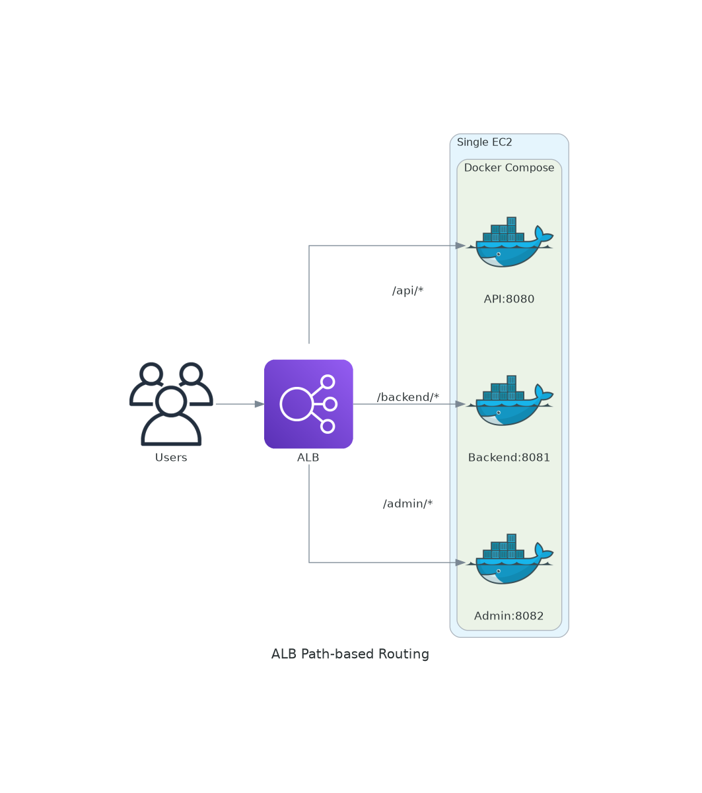
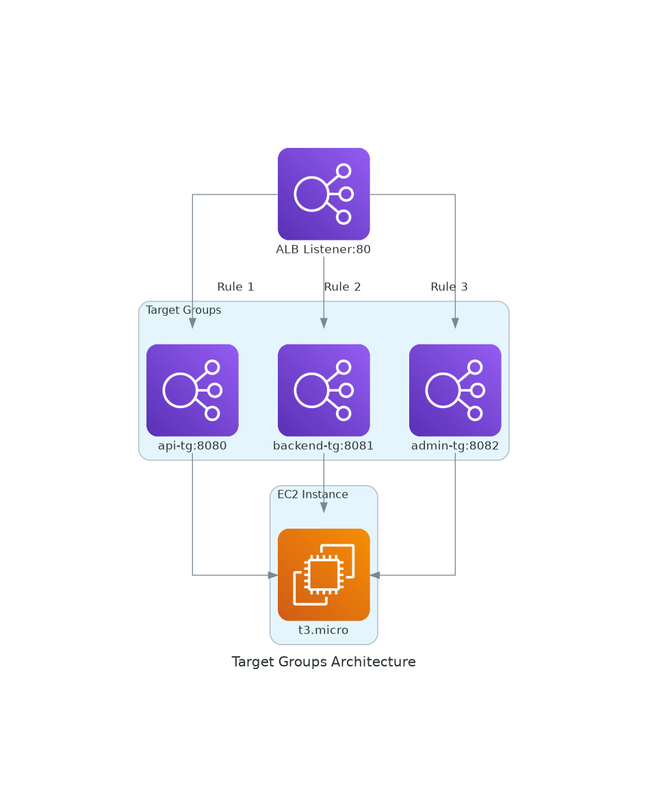

# November Week 1 Day 4 Lab 1: ALB 경로 기반 라우팅 + Docker Compose

<div align="center">

**🔀 경로 라우팅** • **🐳 Docker Compose** • **⚖️ 단일 EC2 멀티 서비스**

*ALB로 단일 EC2의 여러 컨테이너를 경로별로 라우팅*

</div>

---

## 🕘 Lab 정보
**시간**: 11:10-12:00 (50분)
**목표**: ALB 경로 기반 라우팅으로 단일 EC2에서 여러 API 서비스 운영
**방식**: AWS Console + Docker Compose

## 🎯 학습 목표
- ALB 경로 기반 라우팅 구성
- 단일 EC2에서 Docker Compose로 여러 서비스 실행
- Target Group별 포트 매핑
- SSM Session Manager로 EC2 접속

---

## ⚠️ 사전 준비 필수

### VPC 네트워크 구성
이 Lab을 진행하기 전에 **반드시** VPC 네트워크가 구성되어 있어야 합니다.

**📘 필수 가이드**: [VPC Setup Guide](../../../guide/vpc_setup_guide.md)

**필요한 구성 요소**:
- ✅ VPC (10.0.0.0/16)
- ✅ Public Subnet (최소 2개, 서로 다른 AZ)
- ✅ Private Subnet (최소 2개, 서로 다른 AZ)
- ✅ Internet Gateway
- ✅ NAT Gateway
- ✅ Route Tables (Public/Private)

**⚠️ VPC가 없다면**: 위 가이드를 먼저 완료하고 돌아오세요!

---

## 🔗 참조 Session

**당일 Session**:
- [Session 1: Elastic Load Balancing](./session_1.md) - ALB 개념, Target Groups, Health Checks
- [Session 2: Auto Scaling](./session_2.md) - Launch Template, ASG 구성 (향후 확장 시 활용)
- [Session 3: 고가용성 아키텍처](./session_3.md) - Multi-AZ 배포 원칙

**이전 Day Session**:
- [Week 1 Day 2 Session 1: EC2 기초](../../day2/session_1.md) - EC2 인스턴스 생성 및 관리
- [Week 1 Day 2 Session 2: Security Groups](../../day2/session_2.md) - 보안 그룹 설정

---

## 🏗️ 구축할 아키텍처



*그림: ALB 경로 기반 라우팅 - 단일 EC2의 여러 Docker 컨테이너로 라우팅*

```
사용자 (api.example.com)
    ↓
ALB (Listener: 80)
    ↓
    ├─ /api/*     → Target Group 1 (EC2:8080) → API 컨테이너
    ├─ /backend/* → Target Group 2 (EC2:8081) → Backend 컨테이너
    └─ /admin/*   → Target Group 3 (EC2:8082) → Admin 컨테이너
    
단일 EC2 (t3.micro)
    ├─ Docker Compose
    │   ├─ api:8080
    │   ├─ backend:8081
    │   └─ admin:8082
```



*그림: Target Groups 구조 - 3개 Target Group이 동일 EC2의 다른 포트로 연결*

---

## 🛠️ Step 1: EC2 생성 및 Docker 설치 (10분)

### 🔗 참조 개념
- [Session 1: Elastic Load Balancing](./session_1.md) - Target Groups 개념

### AWS Console에서 EC2 생성

**AWS Console 경로**:
```
AWS Console → EC2 → Instances → Launch instances
```

**이미지 자리**: EC2 Launch 화면 스크린샷

**설정 값**:
| 항목 | 값 |
|------|-----|
| AMI | Amazon Linux 2023 |
| Instance Type | t3.micro |
| VPC | 가지고 있는 VPC / 생성한 VPC |
| Subnet | Public Subnet (AZ-A) |
| Auto-assign Public IP | Enable |
| IAM Instance Profile | SSM-Role (Systems Manager 접속용) |
| Security Group | HTTP (80), Custom TCP (8080-8082) |

**이미지 자리**: Security Group 설정 화면

### Security Group 규칙 (초기 설정)
```
Inbound:
- Type: HTTP, Port: 80, Source: 0.0.0.0/0
- Type: Custom TCP, Port: 8080-8082, Source: 0.0.0.0/0 (임시)

Outbound:
- Type: All traffic, Destination: 0.0.0.0/0
```

**⚠️ 주의**: 
- SSH 포트는 열지 않습니다 (SSM Session Manager 사용)
- 8080-8082 포트는 Step 3에서 ALB Security Group으로 변경 예정

### Docker 및 Docker Compose 설치

**SSM Session Manager로 EC2 접속**:
```
AWS Console → Systems Manager → Session Manager → Start session → 인스턴스 선택
```

**이미지 자리**: SSM Session Manager 접속 화면

```bash
# Docker 설치
sudo yum update -y
sudo yum install -y docker
sudo systemctl start docker
sudo systemctl enable docker
sudo usermod -aG docker ssm-user

# Docker Compose 설치
sudo curl -L "https://github.com/docker/compose/releases/latest/download/docker-compose-$(uname -s)-$(uname -m)" -o /usr/local/bin/docker-compose
sudo chmod +x /usr/local/bin/docker-compose

# 세션 재시작 (그룹 권한 적용)
exit
# 다시 SSM Session Manager로 접속

# 확인
docker --version
docker-compose --version
```

### ✅ 검증
```bash
docker ps
# 예상: 빈 목록 (정상)
```

**이미지 자리**: Docker 설치 완료 확인 스크린샷

---

## 🛠️ Step 2: Docker Compose로 3개 서비스 실행 (10분)

### 🔗 참조 개념
- [Session 1: Elastic Load Balancing](./session_1.md) - Target Groups 포트 매핑

### 프로젝트 디렉토리 생성
```bash
mkdir -p ~/multi-api/{api,backend,admin}
cd ~/multi-api
```

### 각 서비스 HTML 파일 생성
```bash
# API 서비스
cat > api/index.html <<EOF
<!DOCTYPE html>
<html>
<head><title>API Service</title></head>
<body>
    <h1>🚀 API Service</h1>
    <p>Running on port 8080</p>
    <p>Path: /api/*</p>
</body>
</html>
EOF

# Backend 서비스
cat > backend/index.html <<EOF
<!DOCTYPE html>
<html>
<head><title>Backend Service</title></head>
<body>
    <h1>⚙️ Backend Service</h1>
    <p>Running on port 8081</p>
    <p>Path: /backend/*</p>
</body>
</html>
EOF

# Admin 서비스
cat > admin/index.html <<EOF
<!DOCTYPE html>
<html>
<head><title>Admin Service</title></head>
<body>
    <h1>🔧 Admin Service</h1>
    <p>Running on port 8082</p>
    <p>Path: /admin/*</p>
</body>
</html>
EOF
```

### docker-compose.yml 생성
```bash
cat > docker-compose.yml <<EOF
version: '3'
services:
  api:
    image: nginx:alpine
    container_name: api-service
    ports:
      - "8080:80"
    volumes:
      - ./api:/usr/share/nginx/html:ro
    restart: always

  backend:
    image: nginx:alpine
    container_name: backend-service
    ports:
      - "8081:80"
    volumes:
      - ./backend:/usr/share/nginx/html:ro
    restart: always

  admin:
    image: nginx:alpine
    container_name: admin-service
    ports:
      - "8082:80"
    volumes:
      - ./admin:/usr/share/nginx/html:ro
    restart: always
EOF
```

### 컨테이너 실행
```bash
docker-compose up -d
```

### ✅ 검증
```bash
# 컨테이너 확인
docker-compose ps

# 각 서비스 테스트
curl localhost:8080
curl localhost:8081
curl localhost:8082

# 예상: 각각 다른 HTML 응답
```

**이미지 자리**: Docker Compose 실행 결과 스크린샷

---

## 🛠️ Step 3: ALB 및 Target Groups 생성 (15분)

### 🔗 참조 개념
- [Session 1: Elastic Load Balancing](./session_1.md) - ALB, Target Groups, Health Checks

### 3-1. Target Group 1 생성 (API)

**경로**: AWS Console → EC2 → Target Groups → Create target group

**이미지 자리**: Target Group 생성 화면

**설정**:
| 항목 | 값 |
|------|-----|
| Target type | Instances |
| Target group name | api-tg |
| Protocol | HTTP |
| Port | 8080 |
| VPC | 가지고 있는 VPC / 생성한 VPC |
| Health check path | / |

**이미지 자리**: Target Group 설정 완료

**Targets 등록**:
- EC2 인스턴스 선택
- Port: 8080
- Include as pending below

**이미지 자리**: Target 등록 화면

### 3-2. Target Group 2 생성 (Backend)

**설정**:
| 항목 | 값 |
|------|-----|
| Target group name | backend-tg |
| Port | 8081 |
| Health check path | / |

**Targets 등록**: 동일 EC2, Port 8081

### 3-3. Target Group 3 생성 (Admin)

**설정**:
| 항목 | 값 |
|------|-----|
| Target group name | admin-tg |
| Port | 8082 |
| Health check path | / |

**Targets 등록**: 동일 EC2, Port 8082

### 3-4. ALB 생성

**경로**: AWS Console → EC2 → Load Balancers → Create load balancer

**이미지 자리**: ALB 타입 선택 화면

**설정**:
| 항목 | 값 |
|------|-----|
| Type | Application Load Balancer |
| Name | multi-api-alb |
| Scheme | Internet-facing |
| IP address type | IPv4 |
| VPC | week5-vpc |
| Mappings | Public Subnet 2개 AZ 선택 |
| Security groups | HTTP (80) 허용 |

**이미지 자리**: ALB 네트워크 설정 화면

**Listener 설정**:
- Protocol: HTTP
- Port: 80
- Default action: Forward to api-tg (기본)

**이미지 자리**: ALB 생성 완료

### 3-5. EC2 Security Group 업데이트 (보안 강화)

**경로**: AWS Console → EC2 → Security Groups → EC2 SG 선택

**이미지 자리**: Security Group 수정 화면

**Inbound 규칙 수정**:
```
기존: Custom TCP, Port: 8080-8082, Source: 0.0.0.0/0
변경: Custom TCP, Port: 8080-8082, Source: <ALB-Security-Group-ID>
```

**이유**: ALB를 통해서만 접근 가능하도록 보안 강화

**이미지 자리**: Security Group 수정 완료

### ✅ 검증
```bash
# ALB DNS 확인
aws elbv2 describe-load-balancers \
  --names multi-api-alb \
  --query 'LoadBalancers[0].DNSName' \
  --output text

# Target Group ARN 조회
aws elbv2 describe-target-groups \
  --names api-tg backend-tg admin-tg \
  --query 'TargetGroups[*].[TargetGroupName,TargetGroupArn]' \
  --output table

# Target Groups Health 확인 (ARN은 위에서 복사)
aws elbv2 describe-target-health --target-group-arn <api-tg-arn>
aws elbv2 describe-target-health --target-group-arn <backend-tg-arn>
aws elbv2 describe-target-health --target-group-arn <admin-tg-arn>

# 예상: 모두 healthy
```

**이미지 자리**: Target Health 확인 결과

---

## 🛠️ Step 4: 경로 기반 라우팅 설정 (10분)

### 🔗 참조 개념
- [Session 1: Elastic Load Balancing](./session_1.md) - Listener Rules, 경로 기반 라우팅

### Listener Rules 추가

**경로**: ALB → Listeners → HTTP:80 → View/edit rules

**이미지 자리**: Listener Rules 편집 화면

**Rule 1: /api/***
- Condition: Path is `/api/*`
- Action: Forward to `api-tg`
- Priority: 1

**Rule 2: /backend/***
- Condition: Path is `/backend/*`
- Action: Forward to `backend-tg`
- Priority: 2

**Rule 3: /admin/***
- Condition: Path is `/admin/*`
- Action: Forward to `admin-tg`
- Priority: 3

**Default Rule**:
- Forward to `api-tg` (기본)

**이미지 자리**: Listener Rules 설정 완료

### ✅ 검증
```bash
# ALB DNS 가져오기
ALB_DNS=$(aws elbv2 describe-load-balancers \
  --names multi-api-alb \
  --query 'LoadBalancers[0].DNSName' \
  --output text)

# 각 경로 테스트 (슬래시 포함)
curl http://$ALB_DNS/api/
curl http://$ALB_DNS/backend/
curl http://$ALB_DNS/admin/

# 슬래시 없이도 테스트
curl http://$ALB_DNS/api
curl http://$ALB_DNS/backend
curl http://$ALB_DNS/admin

# 하위 경로 테스트
curl http://$ALB_DNS/api/test
curl http://$ALB_DNS/backend/health
curl http://$ALB_DNS/admin/dashboard

# 예상: 모두 해당 서비스로 라우팅됨
```

**이미지 자리**: 경로별 라우팅 테스트 결과

---

## 🛠️ Step 5: Route 53 설정 (5분)

### 옵션 1: 도메인이 있는 경우

**경로**: AWS Console → Route 53 → Hosted zones → 도메인 선택

**A 레코드 생성**:
| 항목 | 값 |
|------|-----|
| Record name | api (또는 원하는 서브도메인) |
| Record type | A |
| Alias | Yes |
| Route traffic to | Alias to Application Load Balancer |
| Region | ap-northeast-2 |
| Load balancer | multi-api-alb |

**테스트**:
```bash
curl http://api.example.com/api/
curl http://api.example.com/backend/
curl http://api.example.com/admin/
```

### 옵션 2: 도메인이 없는 경우 (로컬 테스트)

**로컬 /etc/hosts 수정**:
```bash
# Mac/Linux
sudo nano /etc/hosts

# Windows
notepad C:\Windows\System32\drivers\etc\hosts

# 추가
<ALB-DNS-IP>  api.local

# IP 확인
nslookup <ALB-DNS>
```

**테스트**:
```bash
curl http://api.local/api/
curl http://api.local/backend/
curl http://api.local/admin/
```

---

## 📊 실습 결과 확인

### 브라우저 테스트
```
http://<ALB-DNS>/api/      → 🚀 API Service
http://<ALB-DNS>/backend/  → ⚙️ Backend Service
http://<ALB-DNS>/admin/    → 🔧 Admin Service
```

**이미지 자리**: 브라우저에서 각 경로 접근 결과 (3개 스크린샷)

### CloudWatch 메트릭 확인
- Target Group별 Request Count
- Healthy/Unhealthy Host Count
- Response Time

**이미지 자리**: CloudWatch 메트릭 대시보드

---

## ✅ 실습 체크포인트

### ✅ Step 1: EC2 및 Docker
- [ ] EC2 인스턴스 생성
- [ ] Docker 및 Docker Compose 설치
- [ ] Security Group 설정 (8080-8082)

### ✅ Step 2: Docker Compose
- [ ] 3개 서비스 HTML 생성
- [ ] docker-compose.yml 작성
- [ ] 컨테이너 실행 및 확인

### ✅ Step 3: ALB 및 Target Groups
- [ ] 3개 Target Group 생성 (8080, 8081, 8082)
- [ ] ALB 생성
- [ ] Target Health 확인 (모두 healthy)
- [ ] EC2 Security Group 업데이트 (ALB SG로 제한)

### ✅ Step 4: 경로 라우팅
- [ ] Listener Rules 3개 추가
- [ ] 각 경로별 라우팅 테스트 성공

### ✅ Step 5: Route 53 (선택)
- [ ] A 레코드 생성 또는 /etc/hosts 설정
- [ ] 도메인으로 접근 테스트

---

## 🧹 리소스 정리 (5분)

### ⚠️ 중요: 반드시 순서대로 삭제

**삭제 순서** (역순으로):
```
Step 4 → Step 3 → Step 2 → Step 1
```

### 🗑️ 삭제 절차

#### 1. ALB 삭제
**AWS Console 경로**:
```
AWS Console → EC2 → Load Balancers → multi-api-alb 선택 → Actions → Delete
```

**이미지 자리**: ALB 삭제 확인

#### 2. Target Groups 삭제
**AWS Console 경로**:
```
AWS Console → EC2 → Target Groups → 각 TG 선택 → Actions → Delete
```

**이미지 자리**: Target Groups 삭제 확인

#### 3. Docker Compose 중지
```bash
cd ~/multi-api
docker-compose down
```

**이미지 자리**: Docker Compose 중지 확인

#### 4. EC2 인스턴스 종료
**AWS Console 경로**:
```
AWS Console → EC2 → Instances → 인스턴스 선택 → Instance state → Terminate
```

**이미지 자리**: EC2 종료 확인

**cleanup.sh**:
```bash
#!/bin/bash
echo "=== Lab 1 리소스 정리 ==="

# ALB 삭제
aws elbv2 delete-load-balancer --load-balancer-arn <alb-arn>

# Target Groups 삭제
aws elbv2 delete-target-group --target-group-arn <api-tg-arn>
aws elbv2 delete-target-group --target-group-arn <backend-tg-arn>
aws elbv2 delete-target-group --target-group-arn <admin-tg-arn>

# EC2 종료
aws ec2 terminate-instances --instance-ids <instance-id>

echo "=== 정리 완료 ==="
```

---

## 💡 Lab 회고

### 🤝 페어 회고 (5분)
1. **가장 인상 깊었던 부분**: ALB 경로 라우팅의 유연성
2. **어려웠던 점**: Target Group별 포트 설정
3. **실무 적용**: 마이크로서비스 아키텍처 구현 방법

### 📊 학습 성과
- **기술적 성취**: 단일 EC2에서 여러 서비스 운영
- **이해도 향상**: ALB 경로 기반 라우팅 원리
- **실무 역량**: 비용 효율적인 아키텍처 설계

---

## 💰 예상 비용

| 리소스 | 사용 시간 | 단가 | 예상 비용 |
|--------|----------|------|-----------|
| EC2 t3.micro | 1시간 | $0.0104/hour | $0.010 |
| ALB | 1시간 | $0.0225/hour | $0.023 |
| 데이터 전송 | 1GB | 무료 (프리티어) | $0 |
| **합계** | | | **$0.03** |

---

## 🔍 트러블슈팅

### 문제 1: Target Unhealthy
**증상**: Target Group Health Check 실패

**해결**:
```bash
# Security Group 확인
aws ec2 describe-security-groups --group-ids <sg-id>

# 컨테이너 확인
docker-compose ps
docker-compose logs

# 포트 확인
netstat -tlnp | grep 808
```

### 문제 2: 경로 라우팅 안 됨
**증상**: 모든 경로가 같은 서비스로 이동

**해결**:
- Listener Rules 우선순위 확인
- Path 패턴 정확히 입력 (`/api/*`)
- Default Rule 확인

---

<div align="center">

**🔀 경로 라우팅** • **🐳 Docker Compose** • **⚖️ 단일 EC2 멀티 서비스**

*실무에서 바로 사용 가능한 ALB 경로 기반 라우팅*

</div>
