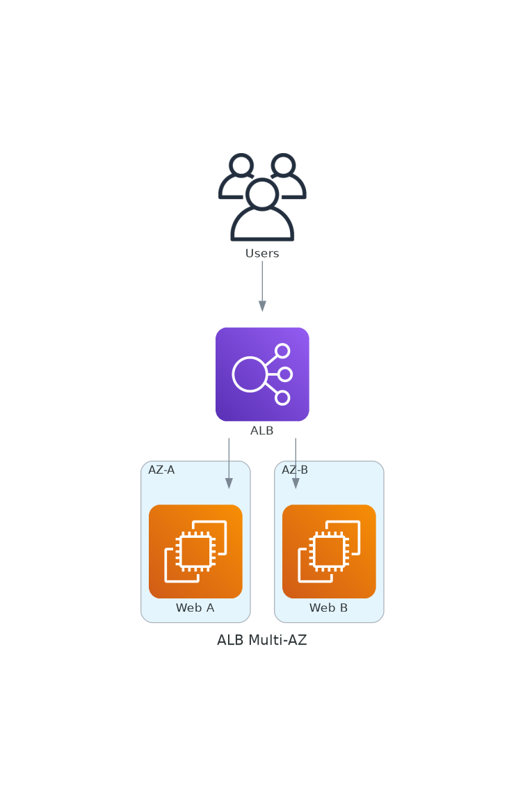
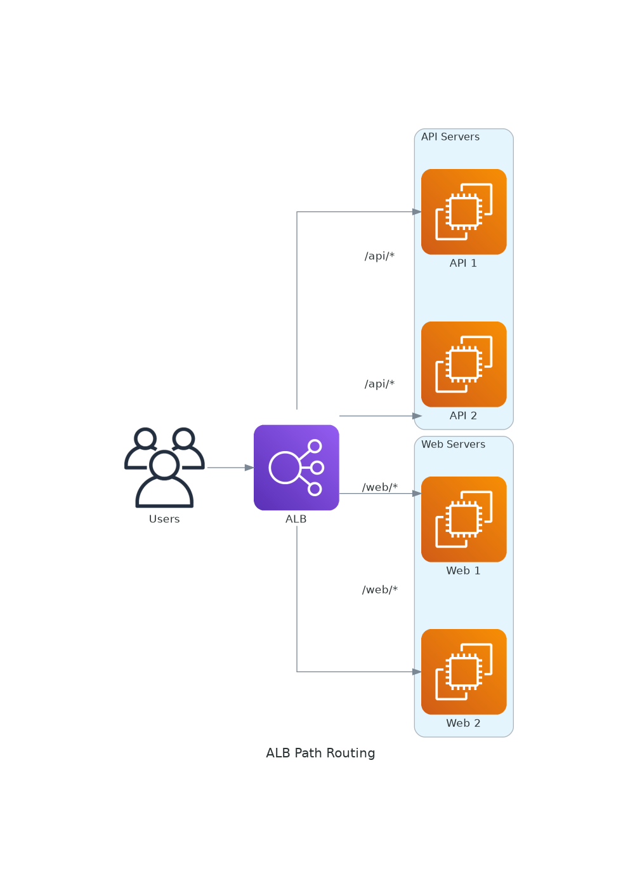
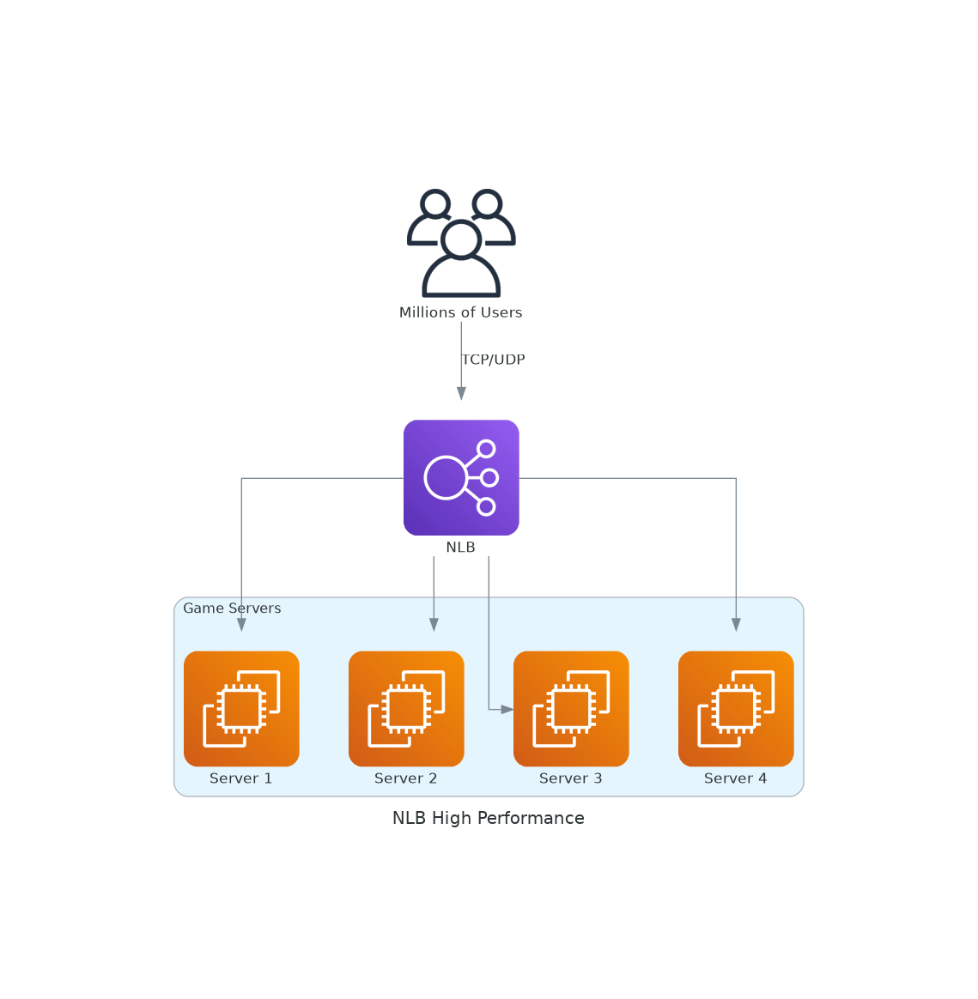
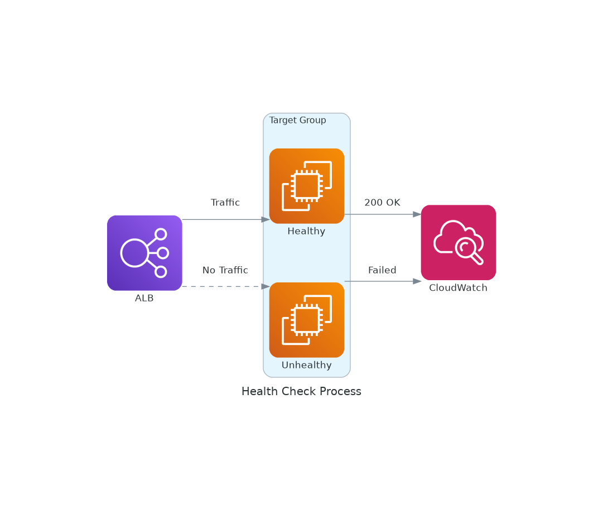

# November Week 1 Day 4 Session 1: Elastic Load Balancing

<div align="center">

**⚖️ 트래픽 분산** • **🔄 고가용성** • **🎯 Health Check**

*ALB, NLB, CLB로 안정적인 트래픽 분산*

</div>

---

## 🕘 세션 정보
**시간**: 09:00-09:20 (20분)
**목표**: Elastic Load Balancing 이해 및 타입별 선택 기준

---

## 📖 서비스 개요

### 1. 생성 배경 (Why?)

**문제 상황**:
- **단일 서버 한계**: 트래픽 증가 시 서버 과부하
- **장애 대응 어려움**: 서버 다운 시 서비스 중단
- **수동 트래픽 분산**: DNS 라운드 로빈의 한계
- **Health Check 부재**: 장애 서버로 트래픽 전송

**AWS ELB 솔루션**:
- **자동 트래픽 분산**: 여러 서버로 균등 분배
- **Health Check**: 장애 서버 자동 제외
- **고가용성**: Multi-AZ 자동 배포
- **Auto Scaling 통합**: 동적 서버 추가/제거

---

### 2. 핵심 원리 (How?)

**ELB 아키텍처**:



*그림: ALB Multi-AZ 아키텍처 - 여러 AZ에 트래픽 분산*

```
사용자 요청
    ↓
ELB (Multi-AZ)
    ↓ 트래픽 분산
┌─────┬─────┬─────┐
│ EC2 │ EC2 │ EC2 │
│ AZ-A│ AZ-B│ AZ-C│
└─────┴─────┴─────┘
```

**작동 원리**:
1. **요청 수신**: 사용자 요청을 ELB가 받음
2. **Health Check**: 정상 서버만 선택
3. **트래픽 분산**: 알고리즘에 따라 분배 (Round Robin, Least Connection)
4. **응답 전달**: 서버 응답을 사용자에게 전달

---

### 3. 주요 사용 사례 (When?)

**ALB (Application Load Balancer) 적합**:
- ✅ HTTP/HTTPS 웹 애플리케이션
- ✅ 마이크로서비스 (경로 기반 라우팅)
- ✅ 컨테이너 (ECS, EKS)
- ✅ WebSocket, HTTP/2

**NLB (Network Load Balancer) 적합**:
- ✅ TCP/UDP 트래픽
- ✅ 초고성능 (수백만 RPS)
- ✅ 고정 IP 필요
- ✅ 게임 서버, IoT

**CLB (Classic Load Balancer) 적합**:
- ⚠️ 레거시 애플리케이션
- ⚠️ EC2-Classic (권장하지 않음)

---

### 4. 비슷한 서비스 비교 (Which?)

**ALB vs NLB vs CLB**:

| 특성 | ALB | NLB | CLB |
|------|-----|-----|-----|
| **OSI 계층** | Layer 7 (HTTP/HTTPS) | Layer 4 (TCP/UDP) | Layer 4/7 |
| **성능** | 중간 | 매우 높음 | 낮음 |
| **경로 라우팅** | ✅ 지원 | ❌ 미지원 | ❌ 미지원 |
| **WebSocket** | ✅ 지원 | ✅ 지원 | ❌ 미지원 |
| **고정 IP** | ❌ 미지원 | ✅ 지원 | ❌ 미지원 |
| **가격** | 중간 | 중간 | 낮음 |
| **권장 여부** | ✅ 권장 | ✅ 권장 | ⚠️ 레거시만 |

**선택 기준**:
- **웹 애플리케이션** → ALB
- **고성능 TCP/UDP** → NLB
- **레거시 시스템** → CLB (마이그레이션 권장)

---

### 5. 장단점 분석

**ALB 장점**:
- ✅ 경로 기반 라우팅 (/api → API 서버, /web → 웹 서버)



*그림: ALB 경로 기반 라우팅 - URL 경로에 따라 다른 서버로 분산*

- ✅ 호스트 기반 라우팅 (api.example.com, web.example.com)
- ✅ HTTP/2, WebSocket 지원
- ✅ Lambda 타겟 지원

**ALB 단점**:
- ⚠️ 고정 IP 미지원
- ⚠️ TCP/UDP 미지원
- ⚠️ NLB보다 성능 낮음

**NLB 장점**:
- ✅ 초고성능 (수백만 RPS)



*그림: NLB 초고성능 아키텍처 - TCP/UDP 트래픽 처리*

- ✅ 고정 IP (Elastic IP 할당 가능)
- ✅ TCP/UDP 지원
- ✅ 낮은 지연시간

**NLB 단점**:
- ⚠️ HTTP 헤더 기반 라우팅 불가
- ⚠️ WAF 통합 불가
- ⚠️ 경로 기반 라우팅 불가

---

### 6. 비용 구조 💰

**ALB 비용**:
- **시간당**: $0.0225/hour
- **LCU (Load Balancer Capacity Unit)**: $0.008/LCU-hour
  - 신규 연결: 25/초
  - 활성 연결: 3,000/분
  - 처리 바이트: 1GB/hour
  - 규칙 평가: 1,000/초

**NLB 비용**:
- **시간당**: $0.0225/hour
- **NLCU**: $0.006/NLCU-hour
  - 신규 연결: 800/초
  - 활성 연결: 100,000/분
  - 처리 바이트: 1GB/hour

**비용 최적화**:
- 불필요한 로드밸런서 삭제
- Idle 상태 로드밸런서 제거
- 트래픽 패턴 분석 후 적절한 타입 선택

**예상 비용 (Lab)**:
- ALB 1시간: $0.0225
- LCU (최소): $0.008
- 합계: ~$0.03/hour

---

### 7. 최신 업데이트 🆕

**2024년 주요 변경사항**:
- ALB: gRPC 프로토콜 지원 강화
- NLB: TLS 1.3 지원
- ALB: Lambda 타겟 성능 개선

**2025년 예정**:
- ALB: HTTP/3 (QUIC) 지원 검토
- NLB: UDP 성능 향상

---

### 8. 잘 사용하는 방법 ✅

**베스트 프랙티스**:
1. **Multi-AZ 배포**: 최소 2개 AZ에 배포
2. **Health Check 설정**: 적절한 간격 및 임계값
3. **Connection Draining**: 종료 전 기존 연결 완료 (300초)
4. **Access Logs**: S3에 로그 저장하여 분석
5. **CloudWatch 알람**: 비정상 타겟 수 모니터링

**실무 팁**:
- Target Group별로 Health Check 경로 다르게 설정
- Sticky Session은 필요한 경우에만 사용
- Cross-Zone Load Balancing 활성화 (균등 분산)

---

### 9. 잘못 사용하는 방법 ❌

**흔한 실수**:
1. ❌ 단일 AZ에만 배포 (고가용성 부족)
2. ❌ Health Check 간격 너무 짧음 (불필요한 부하)
3. ❌ Connection Draining 미설정 (연결 끊김)
4. ❌ 모든 트래픽에 Sticky Session 사용 (부하 불균형)
5. ❌ Access Logs 미활성화 (문제 분석 어려움)

**안티 패턴**:
- 모든 서비스에 ALB 사용 (비용 증가)
- Health Check 경로를 / 로 설정 (불필요한 부하)
- 타겟 수가 1개 (단일 장애점)

---

### 10. 구성 요소 상세

**주요 구성 요소**:

**1. Listener**:
- 역할: 클라이언트 요청 수신
- 프로토콜: HTTP, HTTPS, TCP, UDP
- 포트: 1-65535
- 규칙: 요청을 어느 Target Group으로 보낼지 결정

**2. Target Group**:
- 역할: 트래픽을 받을 대상 그룹
- 타겟 타입: EC2, IP, Lambda
- Health Check: 타겟 상태 확인
- 알고리즘: Round Robin, Least Outstanding Requests

**3. Health Check**:
- 역할: 타겟 정상 여부 확인



*그림: Health Check 프로세스 - 정상 타겟에만 트래픽 전송*

- 설정:
  - Protocol: HTTP, HTTPS, TCP
  - Path: /health (예시)
  - Interval: 30초 (기본)
  - Timeout: 5초
  - Healthy threshold: 5회 연속 성공
  - Unhealthy threshold: 2회 연속 실패

**4. Routing Rules**:
- 경로 기반: /api/* → API Target Group
- 호스트 기반: api.example.com → API Target Group
- HTTP 헤더: User-Agent 기반 라우팅
- 쿼리 스트링: ?version=v2 → V2 Target Group

---

### 11. 공식 문서 링크 (필수 5개)

**⚠️ 학생들이 직접 확인해야 할 공식 문서**:
- 📘 [Elastic Load Balancing이란?](https://docs.aws.amazon.com/elasticloadbalancing/latest/userguide/what-is-load-balancing.html)
- 📗 [Application Load Balancer 사용자 가이드](https://docs.aws.amazon.com/elasticloadbalancing/latest/application/)
- 📙 [Network Load Balancer 사용자 가이드](https://docs.aws.amazon.com/elasticloadbalancing/latest/network/)
- 📕 [ELB 요금](https://aws.amazon.com/elasticloadbalancing/pricing/)
- 🆕 [ELB 최신 업데이트](https://aws.amazon.com/elasticloadbalancing/whats-new/)

---

<div align="center">

**⚖️ 트래픽 분산** • **🔄 고가용성** • **🎯 Health Check**

*Elastic Load Balancing으로 안정적인 서비스 제공*

</div>
