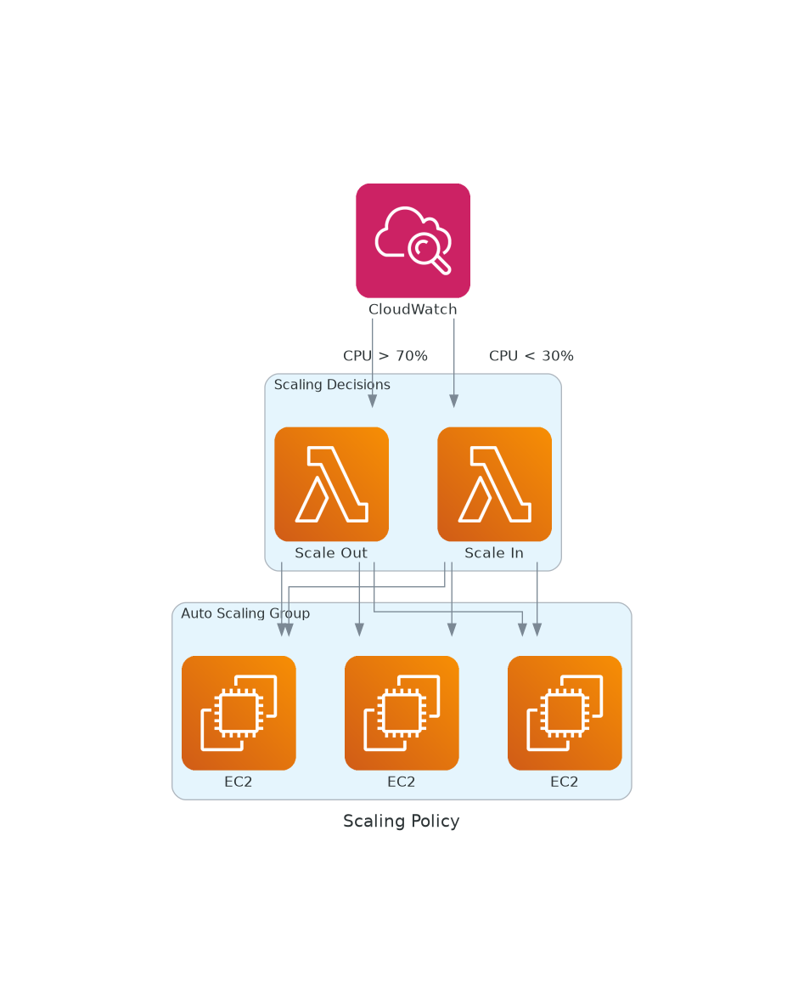
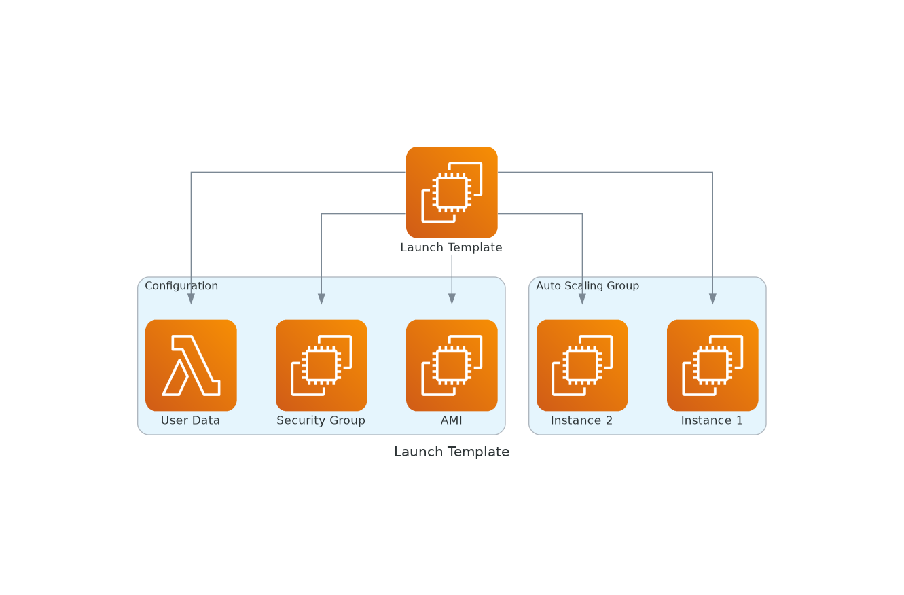

# November Week 1 Day 4 Session 2: Auto Scaling

**📈 자동 확장** • **💰 비용 최적화** • **🔄 탄력적 운영**

*Auto Scaling으로 트래픽에 따라 자동으로 서버 증감*

---

## 🕘 세션 정보
**시간**: 09:40-10:20 (40분)
**목표**: Auto Scaling Group 구성 및 정책 설정

---

## 📖 서비스 개요

### 1. 생성 배경 (Why?)

**문제 상황**:
- **고정 용량**: 트래픽 변화에 대응 불가
- **과다 프로비저닝**: 평소에는 서버 유휴, 비용 낭비
- **과소 프로비저닝**: 트래픽 급증 시 서비스 장애
- **수동 스케일링**: 사람이 직접 서버 추가/제거

**AWS Auto Scaling 솔루션**:
- **자동 확장**: 트래픽 증가 시 자동으로 서버 추가
- **자동 축소**: 트래픽 감소 시 자동으로 서버 제거
- **비용 최적화**: 필요한 만큼만 사용
- **고가용성**: 장애 인스턴스 자동 교체

---

### 2. 핵심 원리 (How?)

**Auto Scaling 아키텍처**:

*그림: Auto Scaling Group 아키텍처 - CloudWatch 메트릭 기반 자동 확장*

**작동 원리**:
1. **메트릭 수집**: CloudWatch가 CPU, 메모리 등 수집
2. **임계값 확인**: 설정한 조건 확인 (예: CPU > 70%)
3. **스케일링 결정**: 확장 또는 축소 결정
4. **인스턴스 조정**: Launch Template으로 인스턴스 생성/종료
5. **ALB 등록**: 새 인스턴스를 ALB Target Group에 자동 등록

**스케일링 정책**:

*그림: 스케일링 정책 - CPU 사용률에 따른 자동 확장/축소*

---

### 3. 주요 사용 사례 (When?)

**적합한 경우**:
- ✅ 트래픽 변동이 큰 웹 서비스
- ✅ 시간대별 부하 차이 (출퇴근 시간, 점심시간)
- ✅ 이벤트성 트래픽 (세일, 프로모션)
- ✅ 비용 최적화 필요

**실제 사례**:
- **쿠팡**: 새벽 배송 주문 시간대 자동 확장
- **배달의민족**: 점심/저녁 시간대 트래픽 대응
- **티켓 예매**: 오픈 시간 트래픽 급증 대응

---

### 4. 비슷한 서비스 비교 (Which?)

**Target Tracking vs Step Scaling vs Scheduled Scaling**:

| 정책 | Target Tracking | Step Scaling | Scheduled Scaling |
|------|-----------------|--------------|-------------------|
| **방식** | 목표값 유지 | 단계별 조정 | 예약 스케줄 |
| **사용 사례** | CPU 50% 유지 | 트래픽 단계별 대응 | 정기적 패턴 |
| **복잡도** | 낮음 | 중간 | 낮음 |
| **유연성** | 중간 | 높음 | 낮음 |
| **권장** | ✅ 일반적 | ✅ 세밀한 제어 | ✅ 예측 가능 |

**선택 기준**:
- **일반적인 경우** → Target Tracking (CPU 50% 유지)
- **세밀한 제어** → Step Scaling (단계별 다른 조치)
- **예측 가능한 패턴** → Scheduled Scaling (매일 오전 9시 확장)

---

### 5. 장단점 분석

**장점**:
- ✅ 자동화된 용량 관리
- ✅ 비용 최적화 (필요한 만큼만)
- ✅ 고가용성 (장애 인스턴스 자동 교체)
- ✅ 트래픽 급증 대응

**단점/제약사항**:
- ⚠️ 스케일 아웃 시간 (인스턴스 시작 2-3분)
- ⚠️ 잘못된 정책 설정 시 비용 증가
- ⚠️ Stateful 애플리케이션 어려움
- ⚠️ 데이터베이스 연결 관리 필요

**대안**:
- Lambda: 서버리스로 즉시 확장
- Fargate: 컨테이너 기반 자동 확장

---

### 6. 비용 구조 💰

**Auto Scaling 비용**:
- **Auto Scaling 자체**: 무료
- **EC2 인스턴스**: 실행 시간만큼 과금
- **CloudWatch 알람**: $0.10/알람/월

**비용 최적화**:
- Desired Capacity를 최소로 유지
- Scale In 정책 적극 활용
- Spot Instance 활용 (최대 90% 할인)
- Reserved Instance와 혼합 사용

**예상 비용 (Lab)**:
- EC2 t3.micro 2-4대: $0.02-0.04/hour
- CloudWatch 알람 2개: $0.20/month
- 합계: ~$0.04/hour

---

### 7. 최신 업데이트 🆕

**2024년 주요 변경사항**:
- Warm Pool 기능: 사전 준비된 인스턴스로 빠른 확장
- Predictive Scaling: ML 기반 예측 확장
- Instance Refresh: 무중단 인스턴스 교체

**2025년 예정**:
- 더 빠른 스케일 아웃 (1분 이내)
- 더 정교한 ML 예측

---

### 8. 잘 사용하는 방법 ✅

**베스트 프랙티스**:
1. **적절한 메트릭 선택**: CPU, 메모리, 네트워크, 커스텀
2. **Cooldown 설정**: 스케일링 후 안정화 시간 (300초)
3. **Health Check 통합**: ALB Health Check 활용
4. **Multi-AZ 배포**: 최소 2개 AZ
5. **Lifecycle Hooks**: 인스턴스 시작/종료 시 작업 수행

**실무 팁**:
- Target Tracking으로 시작 (간단)
- Scale Out은 빠르게, Scale In은 천천히
- Desired Capacity = Min Capacity로 시작

---

### 9. 잘못 사용하는 방법 ❌

**흔한 실수**:
1. ❌ 너무 민감한 임계값 (CPU 60% → 즉시 확장)
2. ❌ Cooldown 너무 짧음 (불필요한 확장/축소 반복)
3. ❌ Min = Max (Auto Scaling 의미 없음)
4. ❌ Health Check 미설정 (장애 인스턴스 유지)
5. ❌ 단일 AZ 배포 (고가용성 부족)

**안티 패턴**:
- 모든 서비스에 Auto Scaling (DB는 부적합)
- Stateful 애플리케이션에 무분별한 적용
- 스케일링 정책 없이 ASG만 생성

---

### 10. 구성 요소 상세

**주요 구성 요소**:

**1. Launch Template**:
- 역할: 인스턴스 생성 템플릿

*그림: Launch Template 구조 - ASG가 사용하는 인스턴스 템플릿*

- 포함 내용:
  - AMI ID
  - Instance Type
  - Security Groups
  - User Data (초기화 스크립트)
  - IAM Role

**2. Auto Scaling Group**:
- 역할: 인스턴스 그룹 관리
- 설정:
  - Min Size: 최소 인스턴스 수
  - Max Size: 최대 인스턴스 수
  - Desired Capacity: 원하는 인스턴스 수
  - Availability Zones: 배포할 AZ

**3. Scaling Policy**:
- **Target Tracking**:
  - Metric: CPU Utilization
  - Target Value: 50%
  - 자동으로 확장/축소

- **Step Scaling**:
  - CPU > 70%: +2 인스턴스
  - CPU > 80%: +4 인스턴스
  - CPU < 30%: -1 인스턴스

- **Scheduled Scaling**:
  - 매일 오전 9시: Min 10, Max 20
  - 매일 오후 6시: Min 2, Max 5

**4. Health Check**:
- EC2 Status Check: 인스턴스 상태
- ELB Health Check: 애플리케이션 상태
- 비정상 인스턴스 자동 교체

---

### 11. 공식 문서 링크 (필수 5개)

**⚠️ 학생들이 직접 확인해야 할 공식 문서**:
- 📘 [Auto Scaling이란?](https://docs.aws.amazon.com/autoscaling/ec2/userguide/what-is-amazon-ec2-auto-scaling.html)
- 📗 [Auto Scaling 사용자 가이드](https://docs.aws.amazon.com/autoscaling/ec2/userguide/)
- 📙 [Scaling Policy](https://docs.aws.amazon.com/autoscaling/ec2/userguide/as-scaling-simple-step.html)
- 📕 [Auto Scaling 요금](https://aws.amazon.com/autoscaling/pricing/)
- 🆕 [Auto Scaling 최신 업데이트](https://aws.amazon.com/autoscaling/whats-new/)

---

**📈 자동 확장** • **💰 비용 최적화** • **🔄 탄력적 운영**

*Auto Scaling으로 효율적인 리소스 관리*

