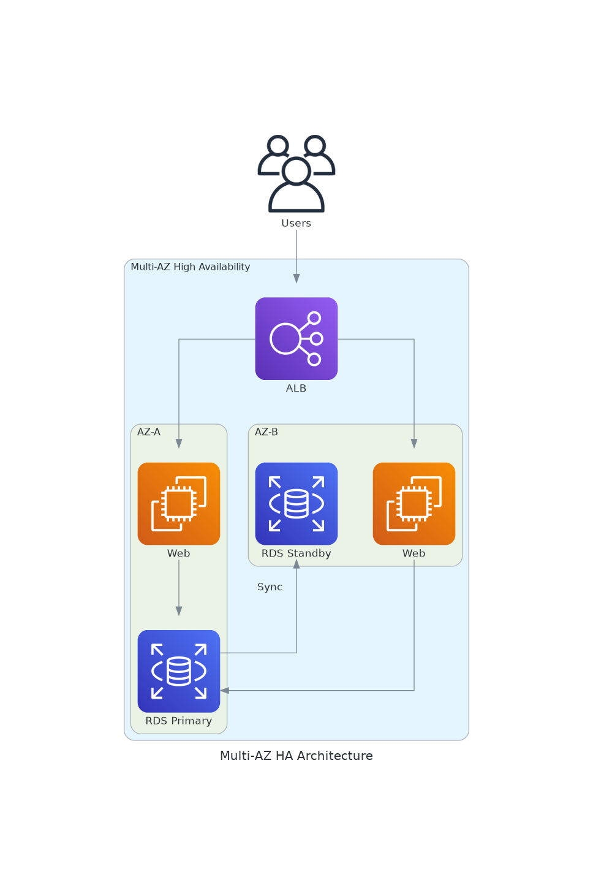

# November Week 1 Day 4 Session 3: 고가용성 아키텍처

<div align="center">

**🔄 Multi-AZ** • **🚀 무중단 배포** • **🛡️ 장애 대응**

*고가용성 설계로 안정적인 서비스 제공*

</div>

---

## 🕘 세션 정보
**시간**: 10:20-11:00 (40분)
**목표**: Multi-AZ 고가용성 설계 및 무중단 배포 전략

---

## 📖 서비스 개요

### 1. 생성 배경 (Why?)

**문제 상황**:
- **단일 장애점**: 하나의 AZ 장애 시 전체 서비스 중단
- **배포 중 다운타임**: 새 버전 배포 시 서비스 중단
- **장애 복구 지연**: 수동 복구로 인한 긴 다운타임
- **데이터 손실 위험**: 백업 부족으로 데이터 손실

**AWS 고가용성 솔루션**:
- **Multi-AZ 배포**: 여러 AZ에 분산 배치
- **자동 Failover**: 장애 시 자동 전환
- **무중단 배포**: Blue-Green, Canary 배포
- **자동 백업**: 정기 백업 및 복구

---

### 2. 핵심 원리 (How?)

**Multi-AZ 고가용성 아키텍처**:



*그림: Multi-AZ 고가용성 아키텍처 - 여러 AZ에 분산 배치로 장애 대응*

**작동 원리**:
1. **Multi-AZ 배포**: 최소 2개 AZ에 리소스 배치
2. **ALB 트래픽 분산**: 정상 AZ로만 트래픽 전송
3. **RDS Multi-AZ**: Primary-Standby 동기 복제
4. **자동 Failover**: 장애 AZ 감지 시 자동 전환
5. **Health Check**: 지속적인 상태 확인

**고가용성 향상**:
```
Multi-AZ 배포 시:
- 단일 AZ 장애 시에도 서비스 지속
- 자동 Failover (일반적으로 1-2분)
- 계획된 유지보수 중에도 가용성 유지
- AZ 장애로부터 보호

참고: 구체적인 가용성 수치는 워크로드와 구성에 따라 다름
AWS SLA: https://aws.amazon.com/compute/sla/
```

---

### 3. 주요 사용 사례 (When?)

**적합한 경우**:
- ✅ 미션 크리티컬 서비스 (금융, 의료, 항공)
- ✅ 24/7 운영 필요
- ✅ SLA 99.9% 이상 요구
- ✅ 데이터 손실 불가 (RPO = 0)

**실제 고객 사례**:

**1. United Airlines - 항공 예약 시스템**:
- **과제**: 수동 장애 조치로 인한 긴 복구 시간
- **솔루션**: 
  - Amazon Application Recovery Controller (ARC) 도입
  - Rapid Recovery 플랫폼으로 자동화
  - Multi-Region 고가용성 구현
- **성과**:
  - 1,000회 이상 성공적인 Cross-Region 장애 조치
  - 400회 이상 자동 데이터베이스 Failover
  - MTTR 7% 감소 (2024년)
  - NPS 5% 증가 (Q3 2024)

**2. HashiCorp - 클라우드 플랫폼**:
- **과제**: 수동 재해 복구 절차의 오류 가능성
- **솔루션**:
  - Amazon Application Recovery Controller 구현
  - Route 53 Failover 레코드 활용
  - 월간 재해 복구 테스트 프로그램
- **성과**:
  - Cross-Region 전환 간소화
  - RTO/RPO 목표 달성
  - 재해 복구 표준화 및 민주화

**3. 대형 금융 기관 - 자산 관리 플랫폼**:
- **과제**: RTO/RPO를 수십 분에서 수 초로 단축 필요
- **솔루션**:
  - Aurora PostgreSQL Global Database
  - Amazon RDS Proxy (Region 내 고가용성)
  - Cross-Region 복제
- **성과**:
  - RTO: 수십 분 → 수 초
  - RPO: 수십 분 → 수 초
  - Region 전체 장애 대응 가능

**4. California Credit Union - 핵심 뱅킹 시스템**:
- **과제**: 기존 DR 사이트의 확장성 부족
- **솔루션**:
  - Fiserv DNA 시스템을 AWS로 마이그레이션
  - EC2, EBS, S3 활용
  - Multi-Region 구성
- **성과**:
  - RTO 목표 달성 또는 초과
  - 확장성 및 Oracle DB 성능 향상
  - Active-Active 구성 계획 중

**5. 미국 보험사 - 3-Tier 애플리케이션**:
- **과제**: 중요 애플리케이션의 재해 복구 필요
- **솔루션**:
  - Pilot Light 시나리오 (Primary + Secondary Region)
  - EventBridge + Lambda로 자동 감지
  - CloudWatch Alarm 기반 Failover
- **성과**:
  - RPO/RTO < 15분
  - 비용 최적화된 솔루션
  - 표준화된 패턴으로 조직 전체 적용

**참조**: 
- [United Airlines 사례](https://aws.amazon.com/blogs/networking-and-content-delivery/united-airlines-implement-enterprise-wide-resilience-program-with-aws/)
- [HashiCorp 사례](https://aws.amazon.com/blogs/architecture/how-hashicorp-made-cross-region-switchover-seamless-with-amazon-application-recovery-controller/)
- [금융 기관 사례](https://aws.amazon.com/blogs/database/how-a-large-financial-aws-customer-implemented-ha-and-dr-for-amazon-aurora-postgresql-using-global-database-and-amazon-rds-proxy/)
- [California Credit Union 사례](https://aws.amazon.com/blogs/publicsector/california-credit-union-enhances-disaster-recovery-and-backup-of-fiserv-dna-core-banking-system-on-aws/)
- [보험사 사례](https://aws.amazon.com/blogs/architecture/how-an-insurance-company-implements-disaster-recovery-of-3-tier-applications/)

---

### 4. 비슷한 서비스 비교 (Which?)

**Blue-Green vs Canary vs Rolling Deployment**:

| 배포 방식 | Blue-Green | Canary | Rolling |
|----------|------------|--------|---------|
| **다운타임** | 없음 | 없음 | 없음 |
| **롤백 속도** | 즉시 | 빠름 | 느림 |
| **리소스 비용** | 2배 | 1.1배 | 1배 |
| **위험도** | 낮음 | 매우 낮음 | 중간 |
| **복잡도** | 낮음 | 높음 | 중간 |
| **사용 사례** | 대규모 변경 | 점진적 검증 | 일반 배포 |

**선택 기준**:
- **안전한 배포** → Blue-Green (즉시 롤백)
- **점진적 검증** → Canary (10% → 50% → 100%)
- **일반적인 경우** → Rolling (순차적 교체)

---

### 5. 장단점 분석

**Multi-AZ 장점**:
- ✅ 높은 가용성 (99.99%)
- ✅ 자동 Failover
- ✅ 데이터 손실 방지
- ✅ 지역적 장애 대응

**Multi-AZ 단점**:
- ⚠️ 비용 증가 (2배 이상)
- ⚠️ 복잡도 증가
- ⚠️ 네트워크 지연 (AZ 간)
- ⚠️ 데이터 동기화 오버헤드

---

### 6. 비용 구조 💰

**Multi-AZ 추가 비용**:
- **EC2**: 2배 (각 AZ에 인스턴스)
- **RDS Multi-AZ**: 2배 (Primary + Standby)
- **데이터 전송**: AZ 간 전송 $0.01/GB
- **ALB**: 동일 (Multi-AZ 기본)

**비용 최적화**:
- Reserved Instance로 장기 할인
- Spot Instance 혼합 사용
- 개발/테스트 환경은 단일 AZ

---

### 7. 최신 업데이트 🆕

**2024-2025년 주요 변경사항**:
- **RDS Blue/Green Deployments**: 안전한 데이터베이스 업그레이드
- **ECS Built-in Blue/Green** (2025.07): ALB/NLB 통합 배포
- **Zonal Autoshift**: 자동 AZ 장애 감지 및 전환
- **Multi-AZ DB Clusters**: 읽기 성능 향상 (2 readable standbys)

**참조**: 
- [RDS Blue/Green Deployments](https://docs.aws.amazon.com/AmazonRDS/latest/UserGuide/blue-green-deployments.html)
- [ECS Blue/Green Deployments](https://docs.aws.amazon.com/AmazonECS/latest/developerguide/deployment-type-blue-green.html)

---

### 8. 잘 사용하는 방법 ✅

**베스트 프랙티스**:
1. **최소 2개 AZ**: 고가용성 기본
2. **3개 AZ 권장**: 더 높은 가용성
3. **Health Check 필수**: 장애 감지 자동화
4. **자동 백업**: 일일 백업 + 트랜잭션 로그
5. **재해 복구 계획**: DR 시나리오 및 테스트

---

### 9. 잘못 사용하는 방법 ❌

**흔한 실수**:
1. ❌ 단일 AZ 배포 (고가용성 부족)
2. ❌ 모든 리소스를 같은 AZ에 배치
3. ❌ Health Check 미설정 (장애 감지 불가)
4. ❌ 백업 미설정 (데이터 손실 위험)
5. ❌ Failover 테스트 안 함 (실제 장애 시 문제)

---

### 10. 구성 요소 상세

**주요 구성 요소**:

**1. Multi-AZ 배포**:
- **ALB**: 자동으로 모든 활성화된 AZ에 배포
- **ASG**: 여러 AZ에 인스턴스 균등 분산 (또는 가중치 기반)
- **RDS Multi-AZ**: Primary (AZ-A) + Standby (AZ-B)
  - 동기식 복제로 데이터 일관성 보장
  - 자동 Failover (일반적으로 1-2분)
  - Standby는 읽기 트래픽 불가 (Read Replica와 다름)
- **RDS Multi-AZ DB Cluster**: Primary + 2 Readable Standbys
  - 읽기 성능 향상 (Standby에서 읽기 가능)
  - 더 빠른 Failover (일반적으로 35초 이내)
- **ElastiCache**: Redis Cluster Mode로 자동 Failover 지원
- **DynamoDB**: 기본적으로 3개 AZ에 자동 복제

**2. Blue-Green 배포**:
- **Blue 환경**: 현재 운영 중인 버전
- **Green 환경**: 새 버전 배포 및 테스트
- **전환**: ALB/NLB Target Group 전환 (즉시)
- **롤백**: Blue로 즉시 복귀 가능
- **AWS 지원**: ECS, RDS, Elastic Beanstalk, Lambda

**RDS Blue/Green 배포 프로세스**:
1. Green 환경 생성 (Blue의 복제본)
2. Green에서 변경 사항 적용 (버전 업그레이드 등)
3. 논리적 복제로 Blue → Green 데이터 동기화
4. 전환 시 1분 이내 다운타임
5. 문제 발생 시 즉시 Blue로 롤백

**3. Canary 배포**:
- **Phase 1**: 10% 트래픽 → 새 버전 (초기 검증)
- **Phase 2**: 50% 트래픽 → 새 버전 (확장 검증)
- **Phase 3**: 100% 트래픽 → 새 버전 (완전 전환)
- **모니터링**: 각 단계마다 CloudWatch 메트릭 확인
- **자동 롤백**: CloudWatch Alarm 기반 자동 롤백 가능

**ECS Canary 배포 옵션**:
- **Canary**: 지정된 비율로 트래픽 전환 (예: 10%, 50%, 100%)
- **Linear**: 일정 간격으로 점진적 전환 (예: 10분마다 10%씩)
- **All-at-once**: 즉시 100% 전환

---

### 11. 공식 문서 링크 (필수 5개)

**⚠️ 학생들이 직접 확인해야 할 공식 문서**:
- 📘 [Multi-AZ 배포 베스트 프랙티스](https://docs.aws.amazon.com/wellarchitected/latest/reliability-pillar/rel_fault_isolation_multiaz_region_system.html)
- 📗 [RDS Multi-AZ 배포](https://docs.aws.amazon.com/AmazonRDS/latest/UserGuide/Concepts.MultiAZSingleStandby.html)
- 📙 [Blue-Green 배포 가이드](https://docs.aws.amazon.com/whitepapers/latest/blue-green-deployments/introduction.html)
- 📕 [ECS Blue/Green 배포](https://docs.aws.amazon.com/AmazonECS/latest/developerguide/deployment-type-blue-green.html)
- 🆕 [RDS Blue/Green 배포](https://docs.aws.amazon.com/AmazonRDS/latest/UserGuide/blue-green-deployments.html)

---

<div align="center">

**🔄 Multi-AZ** • **🚀 무중단 배포** • **🛡️ 장애 대응**

*고가용성 아키텍처로 안정적인 서비스 제공*

</div>
