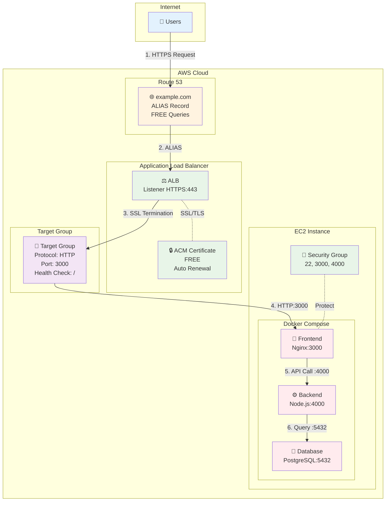
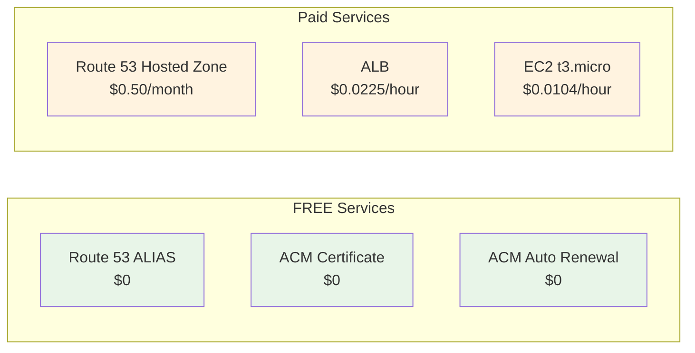
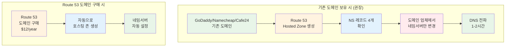
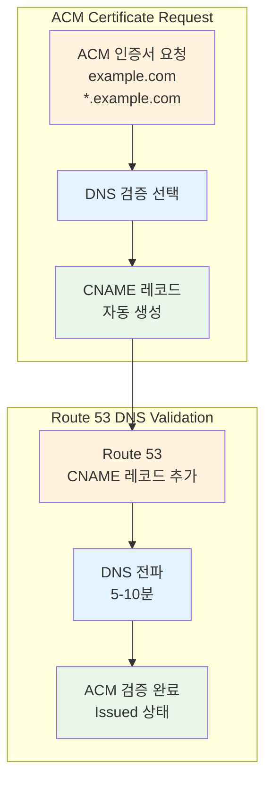
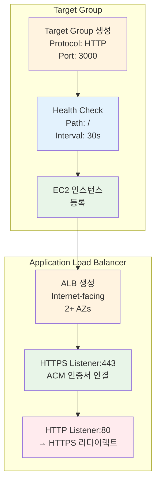

# November Week 1 Day 5 Lab 1: Route 53 + ACM + ALB + Docker Compose HTTPS 배포

<div align="center">

**🌐 도메인 설정** • **🔒 SSL/TLS 인증서** • **⚖️ 로드밸런서** • **🐳 Docker 앱**

*완전한 HTTPS 웹 서비스 배포*

</div>

---

## 🕘 Lab 정보
**시간**: 11:00-12:00 (60분)
**목표**: Route 53 + ACM + ALB + EC2 Docker 통합 HTTPS 배포
**방식**: AWS Web Console 실습
**예상 비용**: $1.50 (2시간 기준)

## 🎯 학습 목표
- [ ] Route 53 호스팅 존 생성 및 도메인 설정
- [ ] ACM 인증서 발급 (DNS 검증)
- [ ] ALB 생성 및 ACM 인증서 연결
- [ ] EC2 Docker Compose 앱 배포
- [ ] HTTPS 웹사이트 접속 확인

---

## 🏗️ 구축할 아키텍처

### 📐 아키텍처 다이어그램



**트래픽 흐름 (상세)**:
```
1. User → Route 53 (DNS 조회: example.com)
2. Route 53 → ALB (ALIAS 레코드, 무료)
3. ALB Listener HTTPS:443 → SSL/TLS 종료 (ACM 인증서)
4. ALB → Target Group (HTTP:3000으로 전달)
5. Target Group → EC2:3000 (Frontend 컨테이너)
6. Frontend → Backend:4000 (API 호출)
7. Backend → Database:5432 (데이터 조회)
```

**포트 매핑**:
```
External (Internet) → ALB:443 (HTTPS)
ALB → Target Group:3000 (HTTP)
Target Group → EC2:3000 (Frontend Container)
Frontend → Backend:4000 (Internal)
Backend → Database:5432 (Internal)
```

**보안 계층**:
```
🔒 HTTPS (443) → ACM Certificate (SSL/TLS 종료)
🔐 Security Group (ALB) → 80, 443 허용
🔐 Security Group (EC2) → 22 (SSH), 3000 (from ALB), 4000 (from ALB)
🔐 Docker Network → Internal Communication (5432)
```

**사용된 AWS 서비스**:
- 🌐 **Route 53**: 도메인 DNS 관리
- 🔒 **ACM**: SSL/TLS 인증서 (무료)
- ⚖️ **ALB**: Application Load Balancer
- 💻 **EC2**: Docker Compose 실행 환경
- 🔐 **Security Groups**: 방화벽 규칙

**비용 절감 포인트**:


**연간 절감액**: $200-500+ (ACM vs 상용 CA)

---

## 🔗 참조 Session

**당일 Session**:
- [Session 1: Route 53](./session_1.md) - DNS 관리, ALIAS 레코드
- [Session 2: CloudFront](./session_2.md) - CDN (선택사항)
- [Session 3: ACM](./session_3.md) - SSL/TLS 인증서

**핵심 개념**:
- Route 53 ALIAS 레코드 (무료)
- ACM DNS 검증 (자동 갱신)
- ALB Target Group (Health Check)
- Docker Compose 멀티 컨테이너

---

## 📋 사전 준비

### 필수 준비물
- [ ] AWS 계정 (프리티어 가능)
- [ ] **도메인 (2가지 옵션 중 선택)**:
  - **옵션 1**: 기존 도메인 보유 (GoDaddy, Namecheap, Cafe24 등) - **권장**
  - **옵션 2**: Route 53에서 도메인 구매 ($12/년)
- [ ] SSH 키페어 (EC2 접속용)
- [ ] Docker Compose 파일 (제공)

### 도메인 준비 방법

**옵션 1: 기존 도메인 사용 (권장)** ⭐
```
이미 도메인을 보유한 경우:
1. Route 53 호스팅 존 생성
2. Route 53 NS 레코드 4개 확인
3. 도메인 등록 업체에서 네임서버만 변경
   (예: GoDaddy, Namecheap, Cafe24, Gabia 등)
4. DNS 전파 대기 (1-2시간)

장점: 추가 비용 없음, 기존 도메인 활용
```

**옵션 2: Route 53에서 도메인 구매**
```
Route 53에서 직접 구매:
1. Route 53 → Registered domains → Register domain
2. 도메인 검색 및 구매 ($12/년)
3. 자동으로 호스팅 존 생성됨
4. 네임서버 자동 설정

장점: AWS 통합 관리, 자동 설정
단점: 비용 발생 ($12/년)
```

**💡 도메인이 없는 경우**:
- **테스트용**: Route 53에서 저렴한 .click, .link 도메인 구매 ($3-5/년)
- **학습용**: 팀원과 도메인 공유 (서브도메인 사용)
  - 예: student1.team-domain.com, student2.team-domain.com

### 예상 비용 (2시간 기준)
| 리소스 | 사용 시간 | 단가 | 예상 비용 |
|--------|----------|------|-----------|
| Route 53 Hosted Zone | 1개월 | $0.50/월 | $0.50 |
| ACM Certificate | 무료 | $0 | $0 |
| ALB | 2시간 | $0.0225/hour | $0.05 |
| EC2 t3.micro | 2시간 | $0.0104/hour | $0.02 |
| **합계** | | | **$0.57** |

---

## 🛠️ Step 1: Route 53 호스팅 존 생성 (15분)

### 📋 이 단계에서 할 일
- Route 53 호스팅 존 생성
- 도메인 네임서버 설정
- DNS 레코드 확인

### 🎨 Step 1 다이어그램



**네임서버 변경 흐름 (기존 도메인)**:
```
기존 도메인 → Route 53 호스팅 존 생성
           → NS 레코드 4개 확인
           → 도메인 업체에서 NS만 변경
           → DNS 전파 대기 (1-2시간)
           → 완료! (추가 비용 없음)
```

**Route 53 구매 흐름**:
```
Route 53 도메인 구매 → 자동 호스팅 존 생성
                   → 자동 NS 설정
                   → 즉시 사용 가능
                   → 비용: $12/년
```

### 🔗 참조 개념
- [Session 1: Route 53](./session_1.md) - 호스팅 존, DNS 레코드

### 📝 실습 절차

#### 1-1. Route 53 호스팅 존 생성

**AWS Console 경로**:
```
AWS Console → Route 53 → Hosted zones → Create hosted zone
```

**설정 값**:
| 항목 | 값 | 설명 |
|------|-----|------|
| Domain name | example.com | 본인 도메인 입력 |
| Type | Public hosted zone | 인터넷 공개 |
| Tags | Name: week1-day5-lab1 | 리소스 태그 |

**⚠️ 주의사항**:
- **기존 도메인 보유 시**: 네임서버만 변경하면 됨 (추가 비용 없음)
- **도메인 없는 경우**: Route 53에서 구매 ($12/년) 또는 팀원과 공유
- **테스트용 저렴한 도메인**: .click ($3/년), .link ($5/년)

#### 1-2. 네임서버 확인 및 변경

**Route 53에서 NS 레코드 확인**:
```
AWS Console → Route 53 → Hosted zones → example.com → NS 레코드
```

**NS 레코드 예시**:
```
ns-123.awsdns-12.com
ns-456.awsdns-45.net
ns-789.awsdns-78.org
ns-012.awsdns-01.co.uk
```

**도메인 등록 업체에서 네임서버 변경**:

**GoDaddy 예시**:
```
1. GoDaddy.com 로그인
2. My Products → Domains → example.com
3. DNS → Nameservers → Change
4. Custom nameservers 선택
5. Route 53 NS 4개 입력
6. Save
```

**Namecheap 예시**:
```
1. Namecheap.com 로그인
2. Domain List → Manage
3. Nameservers → Custom DNS
4. Route 53 NS 4개 입력
5. Save
```

**Cafe24 예시**:
```
1. Cafe24 도메인 관리
2. 네임서버 설정
3. 1차~4차 네임서버에 Route 53 NS 입력
4. 저장
```

**⚠️ 중요**:
- 네임서버 변경 후 전파 시간: 최대 48시간 (보통 1-2시간)
- 기존 DNS 레코드는 Route 53으로 이전 필요
- 이메일 MX 레코드 등도 함께 이전해야 함

#### 1-3. DNS 전파 확인

**확인 명령어**:
```bash
# 네임서버 확인
dig NS example.com

# 또는
nslookup -type=NS example.com
```

**예상 결과**:
```
example.com.  172800  IN  NS  ns-123.awsdns-12.com.
example.com.  172800  IN  NS  ns-456.awsdns-45.net.
example.com.  172800  IN  NS  ns-789.awsdns-78.org.
example.com.  172800  IN  NS  ns-012.awsdns-01.co.uk.
```

### ✅ Step 1 검증

**✅ 체크리스트**:
- [ ] Route 53 호스팅 존 생성 완료
- [ ] NS 레코드 4개 확인
- [ ] 도메인 네임서버 변경 완료
- [ ] DNS 전파 확인 (dig 명령어)

---

## 🛠️ Step 2: VPC 및 Security Groups 생성 (15분)

### 📋 이 단계에서 할 일
- VPC 생성 (또는 Default VPC 사용)
- ALB용 Security Group 생성
- EC2용 Security Group 생성

### 📝 실습 절차

#### 2-1. VPC 확인 (Default VPC 사용)

**AWS Console 경로**:
```
AWS Console → VPC → Your VPCs
```

**Default VPC 확인**:
- VPC ID 확인 (예: vpc-12345678)
- CIDR: 172.31.0.0/16
- Subnets: 최소 2개 AZ

#### 2-2. ALB Security Group 생성

**AWS Console 경로**:
```
AWS Console → EC2 → Security Groups → Create security group
```

**설정 값**:
| 항목 | 값 |
|------|-----|
| Name | week1-day5-alb-sg |
| Description | ALB Security Group for HTTPS |
| VPC | Default VPC |

**Inbound Rules**:
| Type | Protocol | Port | Source | Description |
|------|----------|------|--------|-------------|
| HTTP | TCP | 80 | 0.0.0.0/0 | HTTP from Internet |
| HTTPS | TCP | 443 | 0.0.0.0/0 | HTTPS from Internet |

**Outbound Rules**:
| Type | Protocol | Port | Destination | Description |
|------|----------|------|-------------|-------------|
| All traffic | All | All | 0.0.0.0/0 | Allow all outbound |

#### 2-3. EC2 Security Group 생성

**설정 값**:
| 항목 | 값 |
|------|-----|
| Name | week1-day5-ec2-sg |
| Description | EC2 Security Group for Docker |
| VPC | Default VPC |

**Inbound Rules**:
| Type | Protocol | Port | Source | Description |
|------|----------|------|--------|-------------|
| SSH | TCP | 22 | My IP | SSH from my IP |
| Custom TCP | TCP | 3000 | ALB SG | Frontend from ALB |
| Custom TCP | TCP | 4000 | ALB SG | Backend from ALB |

**⚠️ 중요**: Source에 ALB Security Group ID 입력

### ✅ Step 2 검증

**✅ 체크리스트**:
- [ ] Default VPC 확인
- [ ] ALB Security Group 생성 (80, 443 오픈)
- [ ] EC2 Security Group 생성 (22, 3000, 4000)
- [ ] Security Group 간 연결 확인

---

## 🛠️ Step 3: ACM 인증서 발급 및 DNS 검증 (15분)

### 📋 이 단계에서 할 일
- ACM 인증서 요청
- DNS 검증 레코드 추가
- 인증서 발급 확인

### 🎨 Step 3 다이어그램



**ACM 검증 흐름**:
```
1. ACM 인증서 요청 (example.com, *.example.com)
2. DNS 검증 선택
3. CNAME 레코드 자동 생성
4. Route 53에 CNAME 추가 (자동 또는 수동)
5. DNS 전파 대기 (5-10분)
6. ACM 검증 완료 (Issued)
```

### 🔗 참조 개념
- [Session 3: ACM](./session_3.md) - SSL/TLS 인증서, DNS 검증

### 📝 실습 절차

#### 3-1. ACM 인증서 요청

**⚠️ 중요**: ACM은 **us-east-1 (버지니아)** 리전에서 생성해야 ALB에서 사용 가능

**AWS Console 경로**:
```
AWS Console → Certificate Manager (us-east-1 리전) → Request certificate
```

**설정 값**:
| 항목 | 값 | 설명 |
|------|-----|------|
| Certificate type | Request a public certificate | 공개 인증서 |
| Domain names | example.com<br/>*.example.com | 메인 도메인 + 와일드카드 |
| Validation method | DNS validation | DNS 검증 (권장) |
| Key algorithm | RSA 2048 | 기본값 |
| Tags | Name: week1-day5-acm | 리소스 태그 |

**도메인 입력 예시**:
```
Fully qualified domain name:
- example.com
- *.example.com

(Add another name to this certificate 클릭하여 추가)
```

**⚠️ 주의사항**:
- **와일드카드 인증서**: `*.example.com`으로 모든 서브도메인 커버
- **DNS 검증 권장**: 이메일 검증보다 자동화 가능
- **리전 확인**: 반드시 us-east-1에서 생성

#### 3-2. DNS 검증 레코드 확인

**ACM 콘솔에서 CNAME 레코드 확인**:
```
Certificate Manager → Certificates → example.com → Domains
```

**CNAME 레코드 예시**:
```
Name: _abc123def456.example.com
Type: CNAME
Value: _xyz789ghi012.acm-validations.aws.
```

**💡 자동 추가 옵션**:
- "Create records in Route 53" 버튼 클릭 시 자동 추가
- 수동 추가도 가능 (아래 단계)

#### 3-3. Route 53에 CNAME 레코드 추가

**방법 1: 자동 추가 (권장)**
```
ACM 콘솔 → "Create records in Route 53" 버튼 클릭
→ Route 53에 자동으로 CNAME 추가
```

**방법 2: 수동 추가**

**AWS Console 경로**:
```
AWS Console → Route 53 → Hosted zones → example.com → Create record
```

**설정 값**:
| 항목 | 값 |
|------|-----|
| Record name | _abc123def456 |
| Record type | CNAME |
| Value | _xyz789ghi012.acm-validations.aws. |
| TTL | 300 |

**⚠️ 주의**: ACM 콘솔에 표시된 정확한 값 복사

#### 3-4. 인증서 발급 확인

**확인 방법**:
```
Certificate Manager → Certificates → example.com
Status: Issued (발급 완료)
```

**예상 시간**:
- DNS 전파: 5-10분
- ACM 검증: 추가 5-10분
- 총 소요 시간: 10-20분

**확인 명령어**:
```bash
# DNS 레코드 확인
dig CNAME _abc123def456.example.com

# 또는
nslookup -type=CNAME _abc123def456.example.com
```

**예상 결과**:
```
_abc123def456.example.com. 300 IN CNAME _xyz789ghi012.acm-validations.aws.
```

### ✅ Step 3 검증

**✅ 체크리스트**:
- [ ] ACM 인증서 요청 완료 (us-east-1)
- [ ] 도메인 2개 추가 (example.com, *.example.com)
- [ ] DNS 검증 CNAME 레코드 추가
- [ ] 인증서 상태 "Issued" 확인

**💡 Tip**: 인증서 발급 대기 중 다음 Step 진행 가능

---

## 🛠️ Step 4: EC2 인스턴스 생성 및 Docker 설치 (20분)

### 📋 이 단계에서 할 일
- EC2 인스턴스 생성
- Docker 및 Docker Compose 설치
- 샘플 앱 배포

### 📝 실습 절차

#### 3-1. EC2 인스턴스 생성

**AWS Console 경로**:
```
AWS Console → EC2 → Launch Instance
```

**설정 값**:
| 항목 | 값 |
|------|-----|
| Name | week1-day5-docker-app |
| AMI | Amazon Linux 2023 |
| Instance type | t3.micro |
| Key pair | 기존 키페어 선택 |
| Network | Default VPC |
| Subnet | 아무 Subnet |
| Auto-assign Public IP | Enable |
| Security Group | week1-day5-ec2-sg |

#### 3-2. EC2 접속 및 Docker 설치

**SSH 접속**:
```bash
ssh -i your-key.pem ec2-user@<EC2-Public-IP>
```

**Docker 설치**:
```bash
# Docker 설치
sudo yum update -y
sudo yum install -y docker
sudo systemctl start docker
sudo systemctl enable docker
sudo usermod -aG docker ec2-user

# Docker Compose 설치
sudo curl -L "https://github.com/docker/compose/releases/latest/download/docker-compose-$(uname -s)-$(uname -m)" -o /usr/local/bin/docker-compose
sudo chmod +x /usr/local/bin/docker-compose

# 재접속 (그룹 권한 적용)
exit
ssh -i your-key.pem ec2-user@<EC2-Public-IP>

# 확인
docker --version
docker-compose --version
```

#### 3-3. Docker Compose 앱 배포

**docker-compose.yml 생성**:
```bash
mkdir -p ~/app
cd ~/app
cat > docker-compose.yml << 'EOF'
version: '3.8'

services:
  frontend:
    image: nginx:alpine
    ports:
      - "3000:80"
    volumes:
      - ./frontend:/usr/share/nginx/html
    restart: always

  backend:
    image: node:18-alpine
    ports:
      - "4000:4000"
    working_dir: /app
    volumes:
      - ./backend:/app
    command: sh -c "npm install && node server.js"
    environment:
      - PORT=4000
      - DB_HOST=database
    restart: always

  database:
    image: postgres:15-alpine
    environment:
      - POSTGRES_DB=appdb
      - POSTGRES_USER=appuser
      - POSTGRES_PASSWORD=apppass
    volumes:
      - db_data:/var/lib/postgresql/data
    restart: always

volumes:
  db_data:
EOF
```

**Frontend 파일 생성**:
```bash
mkdir -p frontend
cat > frontend/index.html << 'EOF'
<!DOCTYPE html>
<html>
<head>
    <title>Lab 1 - HTTPS Demo</title>
    <style>
        body {
            font-family: Arial, sans-serif;
            max-width: 800px;
            margin: 50px auto;
            padding: 20px;
            background: linear-gradient(135deg, #667eea 0%, #764ba2 100%);
            color: white;
        }
        .container {
            background: rgba(255,255,255,0.1);
            padding: 30px;
            border-radius: 10px;
            backdrop-filter: blur(10px);
        }
        h1 { font-size: 2.5em; margin-bottom: 20px; }
        .status { 
            background: rgba(255,255,255,0.2);
            padding: 15px;
            border-radius: 5px;
            margin: 10px 0;
        }
        .success { color: #4ade80; }
    </style>
</head>
<body>
    <div class="container">
        <h1>🎉 Lab 1 Success!</h1>
        <div class="status">
            <h2>✅ HTTPS Connection Established</h2>
            <p>Route 53 + ACM + ALB + Docker Compose</p>
        </div>
        <div class="status">
            <h3>Architecture Components:</h3>
            <ul>
                <li>🌐 Route 53: DNS Management</li>
                <li>🔒 ACM: SSL/TLS Certificate (FREE)</li>
                <li>⚖️ ALB: Load Balancer</li>
                <li>🐳 Docker: Frontend Container</li>
            </ul>
        </div>
        <div class="status">
            <p class="success">Protocol: <strong id="protocol"></strong></p>
            <p class="success">Domain: <strong id="domain"></strong></p>
        </div>
    </div>
    <script>
        document.getElementById('protocol').textContent = window.location.protocol;
        document.getElementById('domain').textContent = window.location.hostname;
    </script>
</body>
</html>
EOF
```

**Backend 파일 생성**:
```bash
mkdir -p backend
cat > backend/server.js << 'EOF'
const http = require('http');
const port = process.env.PORT || 4000;

const server = http.createServer((req, res) => {
  res.writeHead(200, { 'Content-Type': 'application/json' });
  res.end(JSON.stringify({
    status: 'success',
    message: 'Backend API is running',
    timestamp: new Date().toISOString()
  }));
});

server.listen(port, () => {
  console.log(`Backend server running on port ${port}`);
});
EOF

cat > backend/package.json << 'EOF'
{
  "name": "backend",
  "version": "1.0.0",
  "main": "server.js",
  "dependencies": {}
}
EOF
```

**앱 실행**:
```bash
docker-compose up -d

# 확인
docker-compose ps
curl localhost:3000
curl localhost:4000
```

### ✅ Step 3 검증

**✅ 체크리스트**:
- [ ] EC2 인스턴스 생성 완료
- [ ] Docker 및 Docker Compose 설치
- [ ] docker-compose.yml 생성
- [ ] Frontend, Backend 파일 생성
- [ ] 컨테이너 3개 실행 중 (frontend, backend, database)
- [ ] localhost:3000 접속 확인
- [ ] localhost:4000 API 응답 확인

---


## 🛠️ Step 5: ALB 생성 및 ACM 인증서 연결 (20분)

### 📋 이 단계에서 할 일
- Target Group 생성
- Application Load Balancer 생성
- HTTPS Listener에 ACM 인증서 연결
- HTTP → HTTPS 리다이렉트 설정

### 🎨 Step 5 다이어그램



**ALB 구성 흐름**:
```
1. Target Group 생성 (HTTP:3000)
2. Health Check 설정 (Path: /)
3. EC2 인스턴스 등록
4. ALB 생성 (Internet-facing, 2+ AZs)
5. HTTPS Listener 생성 + ACM 인증서 연결
6. HTTP Listener 생성 + HTTPS 리다이렉트
```

### 🔗 참조 개념
- [Session 1: Route 53](./session_1.md) - ALIAS 레코드
- [Session 3: ACM](./session_3.md) - SSL/TLS 인증서

### 📝 실습 절차

#### 5-1. Target Group 생성

**AWS Console 경로**:
```
AWS Console → EC2 → Target Groups → Create target group
```

**설정 값**:
| 항목 | 값 | 설명 |
|------|-----|------|
| Target type | Instances | EC2 인스턴스 |
| Target group name | week1-day5-tg | 타겟 그룹 이름 |
| Protocol | HTTP | HTTP 프로토콜 |
| Port | 3000 | Frontend 포트 |
| VPC | Default VPC | VPC 선택 |
| Protocol version | HTTP1 | HTTP 버전 |

**Health Check 설정**:
| 항목 | 값 |
|------|-----|
| Health check protocol | HTTP |
| Health check path | / |
| Health check port | Traffic port |
| Healthy threshold | 2 |
| Unhealthy threshold | 2 |
| Timeout | 5 seconds |
| Interval | 30 seconds |
| Success codes | 200 |

**⚠️ 주의사항**:
- Port는 반드시 **3000** (Frontend 컨테이너 포트)
- Health check path는 **/** (루트 경로)

#### 5-2. EC2 인스턴스 등록

**Target Group에 EC2 추가**:
```
Target Groups → week1-day5-tg → Targets → Register targets
```

**설정**:
- EC2 인스턴스 선택: week1-day5-docker-app
- Port: 3000
- "Include as pending below" 클릭
- "Register pending targets" 클릭

**Health Check 확인**:
```
Targets 탭에서 Status: healthy 확인 (1-2분 소요)
```

#### 5-3. Application Load Balancer 생성

**AWS Console 경로**:
```
AWS Console → EC2 → Load Balancers → Create load balancer → Application Load Balancer
```

**기본 설정**:
| 항목 | 값 |
|------|-----|
| Load balancer name | week1-day5-alb |
| Scheme | Internet-facing |
| IP address type | IPv4 |

**Network mapping**:
| 항목 | 값 |
|------|-----|
| VPC | Default VPC |
| Availability Zones | 최소 2개 AZ 선택 |

**⚠️ 중요**: 반드시 2개 이상의 AZ 선택

**Security groups**:
- week1-day5-alb-sg 선택


#### 5-4. HTTPS Listener 생성 및 ACM 인증서 연결 ⭐

**Listeners and routing**:

**HTTPS Listener (443)**:
| 항목 | 값 |
|------|-----|
| Protocol | HTTPS |
| Port | 443 |
| Default action | Forward to week1-day5-tg |
| **Secure listener settings** | |
| Security policy | ELBSecurityPolicy-2016-08 |
| **Default SSL/TLS certificate** | **⭐ 중요** |
| Certificate source | From ACM |
| Certificate | example.com (발급받은 ACM 인증서 선택) |

**⚠️ 핵심 포인트**:
- **Certificate source**: "From ACM" 선택
- **Certificate**: Step 3에서 발급받은 ACM 인증서 선택
- 인증서 상태가 "Issued"여야 선택 가능

**HTTP Listener (80) - HTTPS 리다이렉트**:
| 항목 | 값 |
|------|-----|
| Protocol | HTTP |
| Port | 80 |
| Default action | Redirect to HTTPS |
| Redirect to | HTTPS |
| Port | 443 |
| Status code | 301 - Permanently moved |

**💡 리다이렉트 설정**:
```
HTTP:80 → HTTPS:443 (301 Redirect)
모든 HTTP 요청을 자동으로 HTTPS로 리다이렉트
```

#### 5-5. ALB 생성 완료 및 확인

**"Create load balancer" 클릭**

**ALB DNS 이름 확인**:
```
Load Balancers → week1-day5-alb → DNS name
예: week1-day5-alb-1234567890.us-east-1.elb.amazonaws.com
```

**ALB 상태 확인**:
```
State: Active (활성화까지 2-3분 소요)
```

**Target Health 확인**:
```
Target Groups → week1-day5-tg → Targets
Status: healthy
```

### ✅ Step 5 검증

**✅ 체크리스트**:
- [ ] Target Group 생성 (HTTP:3000)
- [ ] EC2 인스턴스 등록 및 healthy 상태
- [ ] ALB 생성 (Internet-facing, 2+ AZs)
- [ ] HTTPS Listener 생성 (443)
- [ ] **ACM 인증서 연결 확인** ⭐
- [ ] HTTP Listener 생성 (80 → 443 리다이렉트)
- [ ] ALB 상태 Active 확인

**HTTPS 테스트 (ALB DNS로)**:
```bash
# HTTPS 접속 (인증서 경고 무시)
curl -k https://week1-day5-alb-1234567890.us-east-1.elb.amazonaws.com

# HTTP → HTTPS 리다이렉트 확인
curl -I http://week1-day5-alb-1234567890.us-east-1.elb.amazonaws.com
# 예상: 301 Moved Permanently, Location: https://...
```

---

## 🛠️ Step 6: Route 53 ALIAS 레코드 생성 (10분)

### 📋 이 단계에서 할 일
- Route 53에 ALIAS 레코드 생성
- 도메인을 ALB에 연결
- HTTPS 접속 확인

### 📝 실습 절차

#### 6-1. Route 53 ALIAS 레코드 생성

**AWS Console 경로**:
```
AWS Console → Route 53 → Hosted zones → example.com → Create record
```

**설정 값**:
| 항목 | 값 |
|------|-----|
| Record name | (비워둠 - 루트 도메인) |
| Record type | A - IPv4 address |
| **Alias** | ✅ 체크 |
| Route traffic to | Alias to Application and Classic Load Balancer |
| Region | us-east-1 |
| Load balancer | week1-day5-alb |
| Routing policy | Simple routing |
| Evaluate target health | No |

**⚠️ 주의사항**:
- **Alias 반드시 체크**: ALIAS 레코드는 무료
- **Load balancer 선택**: Step 5에서 생성한 ALB
- **Region 확인**: ALB가 생성된 리전

#### 6-2. DNS 전파 확인

**확인 명령어**:
```bash
# DNS 조회
dig example.com

# 또는
nslookup example.com
```

**예상 결과**:
```
example.com.  60  IN  A  52.1.2.3
example.com.  60  IN  A  52.4.5.6
(ALB의 IP 주소들)
```

#### 6-3. HTTPS 웹사이트 접속

**브라우저에서 접속**:
```
https://example.com
```

**예상 결과**:
- ✅ HTTPS 연결 성공 (자물쇠 아이콘)
- ✅ 인증서 유효 (ACM 인증서)
- ✅ "Lab 1 Success!" 페이지 표시
- ✅ Protocol: https:
- ✅ Domain: example.com

**HTTP 리다이렉트 확인**:
```
http://example.com
→ 자동으로 https://example.com 으로 리다이렉트
```

### ✅ Step 6 검증

**✅ 체크리스트**:
- [ ] Route 53 ALIAS 레코드 생성
- [ ] DNS 전파 확인 (dig/nslookup)
- [ ] HTTPS 접속 성공 (https://example.com)
- [ ] 인증서 유효 확인 (브라우저 자물쇠)
- [ ] HTTP → HTTPS 리다이렉트 확인
- [ ] 웹페이지 정상 표시

---

## 🎉 전체 시스템 테스트

### 📋 테스트 시나리오

#### 테스트 1: HTTPS 연결 확인
```bash
curl -v https://example.com
```

**확인 사항**:
- SSL/TLS 핸드셰이크 성공
- ACM 인증서 사용 확인
- HTTP/1.1 200 OK

#### 테스트 2: HTTP → HTTPS 리다이렉트
```bash
curl -I http://example.com
```

**예상 결과**:
```
HTTP/1.1 301 Moved Permanently
Location: https://example.com/
```

#### 테스트 3: 인증서 정보 확인
```bash
openssl s_client -connect example.com:443 -servername example.com
```

**확인 사항**:
- Issuer: Amazon
- Subject: example.com
- Validity: 유효 기간 확인

### ✅ 최종 검증 체크리스트

**인프라 구성**:
- [ ] Route 53 호스팅 존 생성
- [ ] ACM 인증서 발급 (DNS 검증)
- [ ] VPC 및 Security Groups 설정
- [ ] EC2 Docker Compose 앱 실행
- [ ] Target Group 및 ALB 생성
- [ ] HTTPS Listener + ACM 연결
- [ ] Route 53 ALIAS 레코드

**기능 테스트**:
- [ ] https://example.com 접속 성공
- [ ] HTTPS 인증서 유효
- [ ] HTTP → HTTPS 리다이렉트
- [ ] 웹페이지 정상 표시
- [ ] Protocol: https:// 확인

**보안 확인**:
- [ ] SSL/TLS 암호화 적용
- [ ] ACM 인증서 자동 갱신 설정
- [ ] Security Groups 최소 권한
- [ ] HTTP 접속 차단 (리다이렉트)

---


## 🧹 리소스 정리 (10분)

### ⚠️ 중요: 반드시 순서대로 삭제

**삭제 순서** (역순으로):
```
Step 6 → Step 5 → Step 4 → Step 3 → Step 2 → Step 1
```

### 🗑️ 삭제 절차

#### 1. Route 53 ALIAS 레코드 삭제
```
Route 53 → Hosted zones → example.com → A 레코드 선택 → Delete
```

#### 2. ALB 삭제
```
EC2 → Load Balancers → week1-day5-alb → Actions → Delete
```

**⚠️ 주의**: ALB 삭제 전 ALIAS 레코드 먼저 삭제

#### 3. Target Group 삭제
```
EC2 → Target Groups → week1-day5-tg → Actions → Delete
```

#### 4. EC2 인스턴스 종료
```
EC2 → Instances → week1-day5-docker-app → Instance state → Terminate
```

#### 5. ACM 인증서 삭제
```
Certificate Manager (us-east-1) → example.com → Actions → Delete
```

**⚠️ 주의**: ALB가 사용 중이면 삭제 불가 (ALB 먼저 삭제)

#### 6. Route 53 CNAME 레코드 삭제 (ACM 검증용)
```
Route 53 → Hosted zones → example.com → CNAME 레코드 선택 → Delete
```

#### 7. Security Groups 삭제
```
EC2 → Security Groups → week1-day5-alb-sg → Actions → Delete
EC2 → Security Groups → week1-day5-ec2-sg → Actions → Delete
```

**⚠️ 주의**: EC2 종료 후 삭제 가능

#### 8. Route 53 호스팅 존 삭제 (선택사항)
```
Route 53 → Hosted zones → example.com → Delete hosted zone
```

**⚠️ 주의**: 
- 호스팅 존 삭제 시 도메인 DNS 작동 중지
- 기존 도메인 사용 시 네임서버를 원래대로 복구 필요

### ✅ 정리 완료 확인

**확인 명령어**:
```bash
# ALB 삭제 확인
aws elbv2 describe-load-balancers --names week1-day5-alb
# 예상: LoadBalancerNotFoundException

# EC2 종료 확인
aws ec2 describe-instances --filters "Name=tag:Name,Values=week1-day5-docker-app"
# 예상: State: terminated

# ACM 인증서 삭제 확인
aws acm list-certificates --region us-east-1
# 예상: example.com 인증서 없음
```

**✅ 최종 체크리스트**:
- [ ] Route 53 ALIAS 레코드 삭제
- [ ] ALB 삭제
- [ ] Target Group 삭제
- [ ] EC2 인스턴스 종료
- [ ] ACM 인증서 삭제
- [ ] Route 53 CNAME 레코드 삭제
- [ ] Security Groups 삭제
- [ ] Route 53 호스팅 존 삭제 (선택)

---

## 💰 비용 확인

### 실제 비용 계산 (2시간 기준)

| 리소스 | 사용 시간 | 단가 | 실제 비용 |
|--------|----------|------|-----------|
| Route 53 Hosted Zone | 1개월 | $0.50/월 | $0.50 |
| Route 53 ALIAS Queries | 무료 | $0 | $0 |
| ACM Certificate | 무료 | $0 | $0 |
| ALB | 2시간 | $0.0225/hour | $0.05 |
| ALB Data Processing | 1GB | $0.008/GB | $0.01 |
| EC2 t3.micro | 2시간 | $0.0104/hour | $0.02 |
| EBS 8GB | 2시간 | $0.10/month | $0.01 |
| **합계** | | | **$0.59** |

**💡 비용 절감 포인트**:
- ✅ ACM 인증서: **무료** (상용 CA 대비 $200-500/년 절감)
- ✅ Route 53 ALIAS: **무료** (CNAME 대비 쿼리 비용 절감)
- ✅ ACM 자동 갱신: **무료** (수동 갱신 작업 불필요)

### 실제 비용 확인

**AWS Console 경로**:
```
AWS Console → Cost Explorer → Cost & Usage
```

**필터 설정**:
- Time range: Last 7 days
- Granularity: Daily
- Group by: Service

---

## 🔍 트러블슈팅

### 문제 1: ACM 인증서가 "Pending validation" 상태

**증상**:
- 인증서 상태가 계속 "Pending validation"
- 10분 이상 대기해도 "Issued"로 변경 안 됨

**원인**:
- Route 53 CNAME 레코드 미추가
- CNAME 값 오타
- DNS 전파 지연

**해결 방법**:
```bash
# 1. CNAME 레코드 확인
dig CNAME _abc123def456.example.com

# 2. Route 53에서 CNAME 재확인
Route 53 → Hosted zones → example.com → CNAME 레코드

# 3. ACM 콘솔에서 "Create records in Route 53" 재시도
Certificate Manager → example.com → Create records in Route 53
```

### 문제 2: ALB에서 ACM 인증서 선택 불가

**증상**:
- HTTPS Listener 생성 시 인증서 목록에 없음
- "No certificates available" 메시지

**원인**:
- ACM 인증서가 다른 리전에 생성됨
- 인증서 상태가 "Issued"가 아님

**해결 방법**:
```bash
# 1. ACM 리전 확인
Certificate Manager → 리전 확인 (us-east-1이어야 함)

# 2. 인증서 상태 확인
Certificate Manager → example.com → Status: Issued

# 3. 다른 리전에 생성된 경우
- us-east-1에서 새로 인증서 요청
- DNS 검증 다시 진행
```

### 문제 3: HTTPS 접속 시 "Your connection is not private" 경고

**증상**:
- 브라우저에서 인증서 경고
- NET::ERR_CERT_COMMON_NAME_INVALID

**원인**:
- Route 53 ALIAS 레코드 미생성
- 도메인과 인증서 불일치
- DNS 전파 미완료

**해결 방법**:
```bash
# 1. DNS 확인
dig example.com
# ALB IP가 나와야 함

# 2. 인증서 도메인 확인
openssl s_client -connect example.com:443 -servername example.com
# Subject: example.com 확인

# 3. Route 53 ALIAS 레코드 재확인
Route 53 → Hosted zones → example.com → A 레코드 (ALIAS)
```

### 문제 4: HTTP → HTTPS 리다이렉트 안 됨

**증상**:
- http://example.com 접속 시 HTTPS로 리다이렉트 안 됨
- HTTP로 계속 접속됨

**원인**:
- ALB HTTP Listener 리다이렉트 설정 누락
- Security Group에서 80 포트 차단

**해결 방법**:
```bash
# 1. ALB Listener 확인
Load Balancers → week1-day5-alb → Listeners
HTTP:80 → Redirect to HTTPS:443 확인

# 2. Security Group 확인
Security Groups → week1-day5-alb-sg
Inbound: 80, 443 모두 허용 확인

# 3. 리다이렉트 테스트
curl -I http://example.com
# 예상: 301 Moved Permanently
```

---

## 💡 Lab 회고

### 🤝 페어 회고 (5분)
1. **가장 어려웠던 부분**: 
   - ACM DNS 검증 과정
   - ALB HTTPS Listener 설정
   - Route 53 ALIAS 레코드 이해

2. **새로 배운 점**:
   - ACM 무료 인증서 발급 방법
   - DNS 검증 vs 이메일 검증
   - ALB SSL/TLS 종료 개념
   - Route 53 ALIAS 레코드 장점

3. **실무 적용 아이디어**:
   - 모든 웹사이트 HTTPS 필수 적용
   - ACM 자동 갱신으로 운영 부담 감소
   - ALB로 SSL/TLS 중앙 관리
   - Route 53 ALIAS로 비용 절감

### 📊 학습 성과
- **기술적 성취**: 
  - Route 53 + ACM + ALB 통합 구성
  - HTTPS 웹사이트 완전 배포
  - DNS 검증 프로세스 이해
  - SSL/TLS 종료 개념 습득

- **실무 역량**: 
  - 프로덕션급 HTTPS 설정
  - 보안 인증서 관리
  - 로드밸런서 운영
  - DNS 관리 능력

- **비용 최적화**: 
  - ACM 무료 인증서 활용 ($200-500/년 절감)
  - Route 53 ALIAS 무료 쿼리
  - 자동 갱신으로 운영 비용 절감

### 🔗 다음 Lab 준비
- **Lab 2**: CloudFront + S3 정적 웹사이트 (선택)
- **연계 내용**: 
  - CloudFront에서도 ACM 인증서 사용
  - 글로벌 CDN으로 성능 향상
  - S3 Origin으로 비용 절감

---

## 📚 참고 자료

### 📖 AWS 공식 문서
- [Route 53 사용자 가이드](https://docs.aws.amazon.com/route53/)
- [ACM 사용자 가이드](https://docs.aws.amazon.com/acm/)
- [ALB 사용자 가이드](https://docs.aws.amazon.com/elasticloadbalancing/)
- [Route 53 요금](https://aws.amazon.com/route53/pricing/)
- [ACM 요금](https://aws.amazon.com/certificate-manager/pricing/) (무료)

### 🎯 추가 학습 자료
- [SSL/TLS 작동 원리](https://www.cloudflare.com/learning/ssl/what-is-ssl/)
- [DNS 검증 vs 이메일 검증](https://docs.aws.amazon.com/acm/latest/userguide/dns-validation.html)
- [ALB SSL/TLS 종료](https://docs.aws.amazon.com/elasticloadbalancing/latest/application/create-https-listener.html)

---

<div align="center">

**✅ Lab 완료** • **🔒 HTTPS 보안** • **💰 비용 절감** • **🚀 프로덕션 준비**

*Route 53 + ACM + ALB로 완전한 HTTPS 웹 서비스 구축 완료!*

</div>

