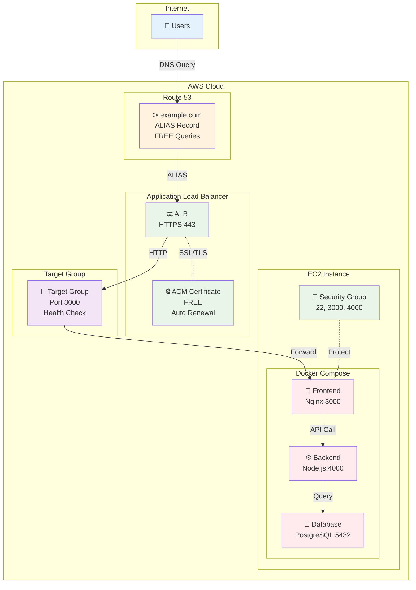
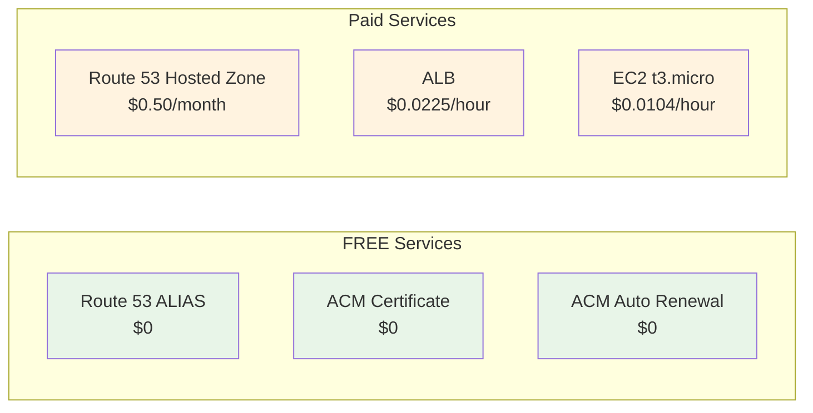
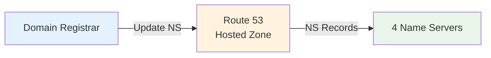

# November Week 1 Day 5 Lab 1: Route 53 + ACM + ALB + Docker Compose HTTPS 배포

<div align="center">

**🌐 도메인 설정** • **🔒 SSL/TLS 인증서** • **⚖️ 로드밸런서** • **🐳 Docker 앱**

*완전한 HTTPS 웹 서비스 배포*

</div>

---

## 🕘 Lab 정보
**시간**: 12:00-13:50 (110분)
**목표**: Route 53 + ACM + ALB + EC2 Docker 통합 HTTPS 배포
**방식**: AWS Web Console 실습
**예상 비용**: $1.50 (2시간 기준)

## 🎯 학습 목표
- [ ] Route 53 호스팅 존 생성 및 도메인 설정
- [ ] ACM 인증서 발급 (DNS 검증)
- [ ] ALB 생성 및 ACM 인증서 연결
- [ ] EC2 Docker Compose 앱 배포
- [ ] HTTPS 웹사이트 접속 확인

---

## 🏗️ 구축할 아키텍처

### 📐 아키텍처 다이어그램



**트래픽 흐름**:
```
1. User → Route 53 (DNS 조회)
2. Route 53 → ALB (ALIAS 레코드, 무료)
3. ALB → ACM (SSL/TLS 인증서 검증)
4. ALB → Target Group (Health Check)
5. Target Group → EC2:3000 (Frontend)
6. Frontend → Backend:4000 (API 호출)
7. Backend → Database:5432 (데이터 조회)
```

**보안 계층**:
```
🔒 HTTPS (443) → ACM Certificate
🔐 Security Group → ALB (80, 443)
🔐 Security Group → EC2 (22, 3000, 4000)
🔐 Docker Network → Internal Communication
```

**사용된 AWS 서비스**:
- 🌐 **Route 53**: 도메인 DNS 관리
- 🔒 **ACM**: SSL/TLS 인증서 (무료)
- ⚖️ **ALB**: Application Load Balancer
- 💻 **EC2**: Docker Compose 실행 환경
- 🔐 **Security Groups**: 방화벽 규칙

**비용 절감 포인트**:


**연간 절감액**: $200-500+ (ACM vs 상용 CA)

---

## 🔗 참조 Session

**당일 Session**:
- [Session 1: Route 53](./session_1.md) - DNS 관리, ALIAS 레코드
- [Session 2: CloudFront](./session_2.md) - CDN (선택사항)
- [Session 3: ACM](./session_3.md) - SSL/TLS 인증서

**핵심 개념**:
- Route 53 ALIAS 레코드 (무료)
- ACM DNS 검증 (자동 갱신)
- ALB Target Group (Health Check)
- Docker Compose 멀티 컨테이너

---

## 📋 사전 준비

### 필수 준비물
- [ ] AWS 계정 (프리티어 가능)
- [ ] 도메인 (Route 53 또는 외부 등록)
- [ ] SSH 키페어 (EC2 접속용)
- [ ] Docker Compose 파일 (제공)

### 예상 비용 (2시간 기준)
| 리소스 | 사용 시간 | 단가 | 예상 비용 |
|--------|----------|------|-----------|
| Route 53 Hosted Zone | 1개월 | $0.50/월 | $0.50 |
| ACM Certificate | 무료 | $0 | $0 |
| ALB | 2시간 | $0.0225/hour | $0.05 |
| EC2 t3.micro | 2시간 | $0.0104/hour | $0.02 |
| **합계** | | | **$0.57** |

---

## 🛠️ Step 1: Route 53 호스팅 존 생성 (15분)

### 📋 이 단계에서 할 일
- Route 53 호스팅 존 생성
- 도메인 네임서버 설정
- DNS 레코드 확인

### 🎨 Step 1 다이어그램



### 🔗 참조 개념
- [Session 1: Route 53](./session_1.md) - 호스팅 존, DNS 레코드

### 📝 실습 절차

#### 1-1. Route 53 호스팅 존 생성

**AWS Console 경로**:
```
AWS Console → Route 53 → Hosted zones → Create hosted zone
```

**설정 값**:
| 항목 | 값 | 설명 |
|------|-----|------|
| Domain name | example.com | 본인 도메인 입력 |
| Type | Public hosted zone | 인터넷 공개 |
| Tags | Name: week1-day5-lab1 | 리소스 태그 |

**⚠️ 주의사항**:
- 도메인은 본인이 소유한 도메인 사용
- 테스트용은 Route 53에서 도메인 구매 ($12/년)
- 또는 Freenom 무료 도메인 사용 가능

#### 1-2. 네임서버 확인

**호스팅 존 생성 후**:
- NS 레코드 4개 확인
- 예: ns-123.awsdns-12.com

**도메인 등록 업체에서 설정**:
- 도메인 관리 페이지 접속
- 네임서버를 Route 53 NS로 변경
- 전파 시간: 최대 48시간 (보통 1-2시간)

#### 1-3. DNS 전파 확인

**확인 명령어**:
```bash
# 네임서버 확인
dig NS example.com

# 또는
nslookup -type=NS example.com
```

**예상 결과**:
```
example.com.  172800  IN  NS  ns-123.awsdns-12.com.
example.com.  172800  IN  NS  ns-456.awsdns-45.net.
example.com.  172800  IN  NS  ns-789.awsdns-78.org.
example.com.  172800  IN  NS  ns-012.awsdns-01.co.uk.
```

### ✅ Step 1 검증

**✅ 체크리스트**:
- [ ] Route 53 호스팅 존 생성 완료
- [ ] NS 레코드 4개 확인
- [ ] 도메인 네임서버 변경 완료
- [ ] DNS 전파 확인 (dig 명령어)

---

## 🛠️ Step 2: VPC 및 Security Groups 생성 (15분)

### 📋 이 단계에서 할 일
- VPC 생성 (또는 Default VPC 사용)
- ALB용 Security Group 생성
- EC2용 Security Group 생성

### 📝 실습 절차

#### 2-1. VPC 확인 (Default VPC 사용)

**AWS Console 경로**:
```
AWS Console → VPC → Your VPCs
```

**Default VPC 확인**:
- VPC ID 확인 (예: vpc-12345678)
- CIDR: 172.31.0.0/16
- Subnets: 최소 2개 AZ

#### 2-2. ALB Security Group 생성

**AWS Console 경로**:
```
AWS Console → EC2 → Security Groups → Create security group
```

**설정 값**:
| 항목 | 값 |
|------|-----|
| Name | week1-day5-alb-sg |
| Description | ALB Security Group for HTTPS |
| VPC | Default VPC |

**Inbound Rules**:
| Type | Protocol | Port | Source | Description |
|------|----------|------|--------|-------------|
| HTTP | TCP | 80 | 0.0.0.0/0 | HTTP from Internet |
| HTTPS | TCP | 443 | 0.0.0.0/0 | HTTPS from Internet |

**Outbound Rules**:
| Type | Protocol | Port | Destination | Description |
|------|----------|------|-------------|-------------|
| All traffic | All | All | 0.0.0.0/0 | Allow all outbound |

#### 2-3. EC2 Security Group 생성

**설정 값**:
| 항목 | 값 |
|------|-----|
| Name | week1-day5-ec2-sg |
| Description | EC2 Security Group for Docker |
| VPC | Default VPC |

**Inbound Rules**:
| Type | Protocol | Port | Source | Description |
|------|----------|------|--------|-------------|
| SSH | TCP | 22 | My IP | SSH from my IP |
| Custom TCP | TCP | 3000 | ALB SG | Frontend from ALB |
| Custom TCP | TCP | 4000 | ALB SG | Backend from ALB |

**⚠️ 중요**: Source에 ALB Security Group ID 입력

### ✅ Step 2 검증

**✅ 체크리스트**:
- [ ] Default VPC 확인
- [ ] ALB Security Group 생성 (80, 443 오픈)
- [ ] EC2 Security Group 생성 (22, 3000, 4000)
- [ ] Security Group 간 연결 확인

---

## 🛠️ Step 3: EC2 인스턴스 생성 및 Docker 설치 (20분)

### 📋 이 단계에서 할 일
- EC2 인스턴스 생성
- Docker 및 Docker Compose 설치
- 샘플 앱 배포

### 📝 실습 절차

#### 3-1. EC2 인스턴스 생성

**AWS Console 경로**:
```
AWS Console → EC2 → Launch Instance
```

**설정 값**:
| 항목 | 값 |
|------|-----|
| Name | week1-day5-docker-app |
| AMI | Amazon Linux 2023 |
| Instance type | t3.micro |
| Key pair | 기존 키페어 선택 |
| Network | Default VPC |
| Subnet | 아무 Subnet |
| Auto-assign Public IP | Enable |
| Security Group | week1-day5-ec2-sg |

#### 3-2. EC2 접속 및 Docker 설치

**SSH 접속**:
```bash
ssh -i your-key.pem ec2-user@<EC2-Public-IP>
```

**Docker 설치**:
```bash
# Docker 설치
sudo yum update -y
sudo yum install -y docker
sudo systemctl start docker
sudo systemctl enable docker
sudo usermod -aG docker ec2-user

# Docker Compose 설치
sudo curl -L "https://github.com/docker/compose/releases/latest/download/docker-compose-$(uname -s)-$(uname -m)" -o /usr/local/bin/docker-compose
sudo chmod +x /usr/local/bin/docker-compose

# 재접속 (그룹 권한 적용)
exit
ssh -i your-key.pem ec2-user@<EC2-Public-IP>

# 확인
docker --version
docker-compose --version
```

#### 3-3. Docker Compose 앱 배포

**docker-compose.yml 생성**:
```bash
mkdir -p ~/app
cd ~/app
cat > docker-compose.yml << 'EOF'
version: '3.8'

services:
  frontend:
    image: nginx:alpine
    ports:
      - "3000:80"
    volumes:
      - ./frontend:/usr/share/nginx/html
    restart: always

  backend:
    image: node:18-alpine
    ports:
      - "4000:4000"
    working_dir: /app
    volumes:
      - ./backend:/app
    command: sh -c "npm install && node server.js"
    environment:
      - PORT=4000
      - DB_HOST=database
    restart: always

  database:
    image: postgres:15-alpine
    environment:
      - POSTGRES_DB=appdb
      - POSTGRES_USER=appuser
      - POSTGRES_PASSWORD=apppass
    volumes:
      - db_data:/var/lib/postgresql/data
    restart: always

volumes:
  db_data:
EOF
```

**Frontend 파일 생성**:
```bash
mkdir -p frontend
cat > frontend/index.html << 'EOF'
<!DOCTYPE html>
<html>
<head>
    <title>Lab 1 - HTTPS Demo</title>
    <style>
        body {
            font-family: Arial, sans-serif;
            max-width: 800px;
            margin: 50px auto;
            padding: 20px;
            background: linear-gradient(135deg, #667eea 0%, #764ba2 100%);
            color: white;
        }
        .container {
            background: rgba(255,255,255,0.1);
            padding: 30px;
            border-radius: 10px;
            backdrop-filter: blur(10px);
        }
        h1 { font-size: 2.5em; margin-bottom: 20px; }
        .status { 
            background: rgba(255,255,255,0.2);
            padding: 15px;
            border-radius: 5px;
            margin: 10px 0;
        }
        .success { color: #4ade80; }
    </style>
</head>
<body>
    <div class="container">
        <h1>🎉 Lab 1 Success!</h1>
        <div class="status">
            <h2>✅ HTTPS Connection Established</h2>
            <p>Route 53 + ACM + ALB + Docker Compose</p>
        </div>
        <div class="status">
            <h3>Architecture Components:</h3>
            <ul>
                <li>🌐 Route 53: DNS Management</li>
                <li>🔒 ACM: SSL/TLS Certificate (FREE)</li>
                <li>⚖️ ALB: Load Balancer</li>
                <li>🐳 Docker: Frontend Container</li>
            </ul>
        </div>
        <div class="status">
            <p class="success">Protocol: <strong id="protocol"></strong></p>
            <p class="success">Domain: <strong id="domain"></strong></p>
        </div>
    </div>
    <script>
        document.getElementById('protocol').textContent = window.location.protocol;
        document.getElementById('domain').textContent = window.location.hostname;
    </script>
</body>
</html>
EOF
```

**Backend 파일 생성**:
```bash
mkdir -p backend
cat > backend/server.js << 'EOF'
const http = require('http');
const port = process.env.PORT || 4000;

const server = http.createServer((req, res) => {
  res.writeHead(200, { 'Content-Type': 'application/json' });
  res.end(JSON.stringify({
    status: 'success',
    message: 'Backend API is running',
    timestamp: new Date().toISOString()
  }));
});

server.listen(port, () => {
  console.log(`Backend server running on port ${port}`);
});
EOF

cat > backend/package.json << 'EOF'
{
  "name": "backend",
  "version": "1.0.0",
  "main": "server.js",
  "dependencies": {}
}
EOF
```

**앱 실행**:
```bash
docker-compose up -d

# 확인
docker-compose ps
curl localhost:3000
curl localhost:4000
```

### ✅ Step 3 검증

**✅ 체크리스트**:
- [ ] EC2 인스턴스 생성 완료
- [ ] Docker 및 Docker Compose 설치
- [ ] docker-compose.yml 생성
- [ ] Frontend, Backend 파일 생성
- [ ] 컨테이너 3개 실행 중 (frontend, backend, database)
- [ ] localhost:3000 접속 확인
- [ ] localhost:4000 API 응답 확인

---

