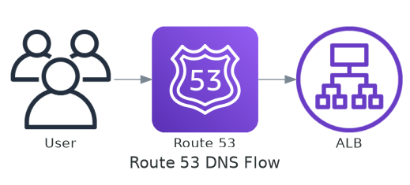
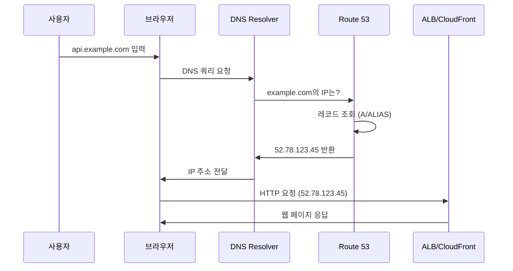
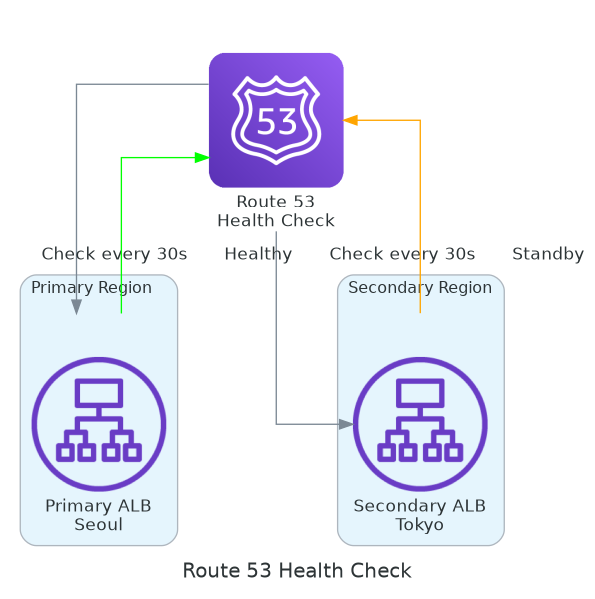
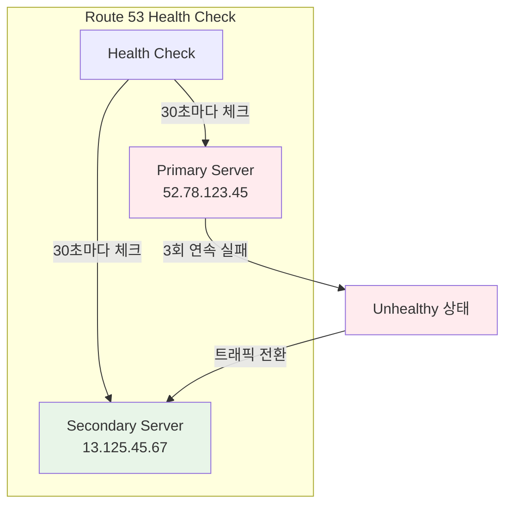
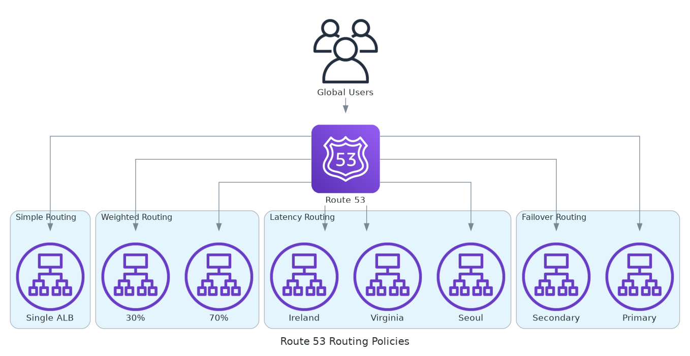
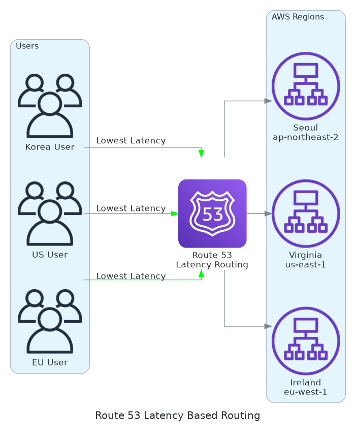
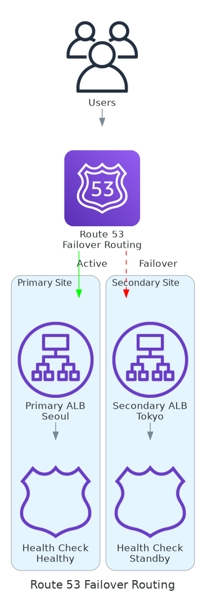
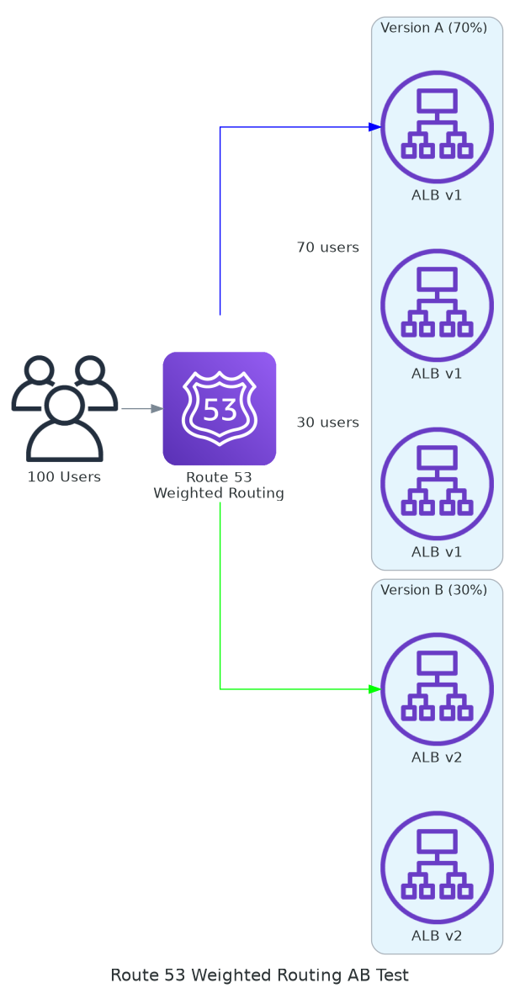
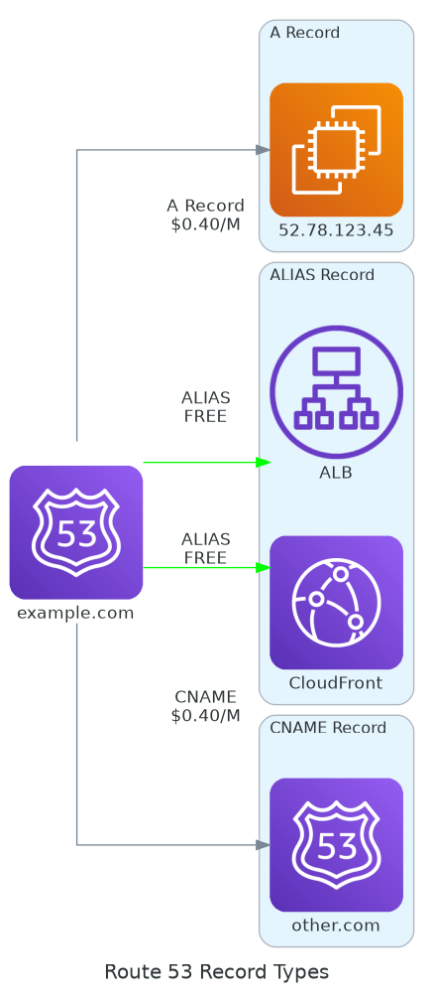
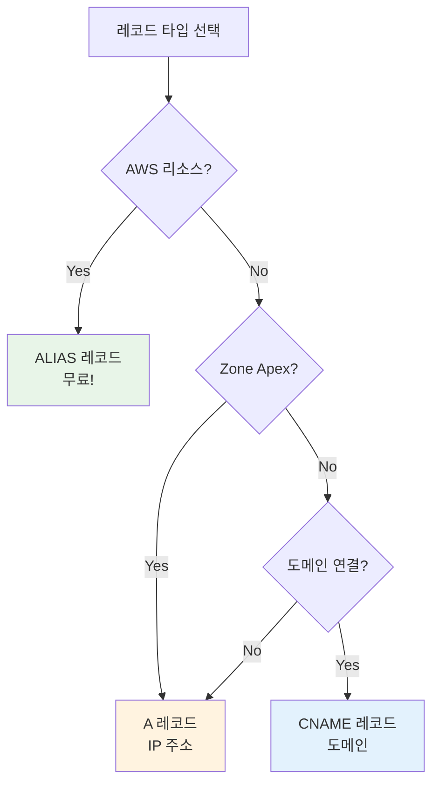

# November Week 1 Day 5 Session 1: Route 53 (DNS)

<div align="center">

**🌐 DNS 관리** • **🔄 Health Check** • **⚡ 라우팅 정책**

*Route 53으로 도메인 연결 및 트래픽 관리*

</div>

---

## 🕘 세션 정보
**시간**: 09:00-09:50 (50분)
**목표**: Route 53 DNS 관리 및 레코드 설정 완전 이해
**방식**: 이론 강의 + 실습 연계

## 🎯 학습 목표
### 📚 학습 목표
- **이해 목표**: DNS 작동 원리 및 Route 53 핵심 개념 이해
- **적용 목표**: 레코드 타입 선택 및 라우팅 정책 적용 능력
- **협업 목표**: 도메인 관리 전략 수립 및 공유

---

## 📖 서비스 개요

### 1. 생성 배경 (Why?) - 5분

**🏠 실생활 비유**:
전화번호부를 생각해보세요. "김철수"라는 이름으로 010-1234-5678을 찾듯이, DNS는 "example.com"이라는 이름으로 "52.78.123.45"라는 IP 주소를 찾아줍니다.

**💼 실무 문제 상황**:
- **IP 주소 기억 어려움**: 
  - 사용자: "52.78.123.45 접속하세요" ❌
  - 사용자: "example.com 접속하세요" ✅
  
- **서버 변경 시 문제**: 
  - 기존: IP 변경 시 모든 사용자에게 새 IP 알려야 함
  - 해결: DNS만 업데이트하면 자동 반영
  
- **장애 대응 지연**: 
  - 기존: 수동으로 DNS 변경 (30분~1시간)
  - 해결: Health Check로 자동 Failover (30초)
  
- **글로벌 서비스 어려움**: 
  - 기존: 한국 사용자도 미국 서버 접속 (느림)
  - 해결: 지역별 최적 서버 자동 연결

**☁️ AWS Route 53 솔루션**:
- **관리형 DNS**: 도메인 이름 → IP 주소 자동 변환
- **Health Check**: 장애 서버 자동 제외
- **라우팅 정책**: 지연시간, 가중치, Failover
- **CloudFront 통합**: ALIAS 레코드로 무료 연결
- **100% SLA**: AWS가 가용성 보장

**📊 시장 동향**:
- **DNS 시장 규모**: 연간 $5B+ (2024년)
- **Route 53 점유율**: 클라우드 DNS 시장 1위
- **주요 고객**: Netflix, Airbnb, Uber, Slack

---

### 2. 핵심 원리 (How?) - 10분

**🔧 Route 53 DNS 조회 흐름**:



*그림: Route 53 DNS 조회 흐름 - 사용자 요청부터 IP 반환까지*

**단계별 작동 원리**:



**1. 사용자 요청**:
- 브라우저에 `api.example.com` 입력
- 브라우저는 IP 주소 필요

**2. DNS Resolver 쿼리**:
- ISP의 DNS Resolver에 쿼리
- Resolver는 Route 53에 질의

**3. Route 53 레코드 조회**:
- Hosted Zone에서 레코드 검색
- A 레코드 또는 ALIAS 레코드 확인
- TTL (Time To Live) 확인

**4. IP 주소 반환**:
- ALB 또는 CloudFront IP 반환
- Resolver가 결과 캐싱 (TTL 동안)

**5. 실제 연결**:
- 브라우저가 반환된 IP로 HTTP 요청
- 웹 서버가 응답

**🔑 핵심 개념**:

**레코드 타입**:
```
A 레코드:
  example.com → 52.78.123.45 (IPv4)
  비용: $0.40/백만 쿼리
  
AAAA 레코드:
  example.com → 2001:0db8::1 (IPv6)
  비용: $0.40/백만 쿼리
  
CNAME:
  www.example.com → example.com
  비용: $0.40/백만 쿼리
  제약: Zone Apex 불가 (example.com ❌)
  
ALIAS (AWS 전용):
  example.com → ALB/CloudFront
  비용: 무료! ⭐
  장점: Zone Apex 가능 (example.com ✅)
  
MX:
  example.com → mail.example.com
  용도: 이메일 서버
  
TXT:
  example.com → "v=spf1 include:_spf.google.com ~all"
  용도: SPF, DKIM, 도메인 인증
```

**TTL (Time To Live)**:
```
TTL 60초:
  - 빠른 업데이트 (1분 내 반영)
  - 높은 쿼리 비용
  - 사용 사례: 배포 중, 장애 대응
  
TTL 300초 (5분) - 권장:
  - 균형잡힌 선택
  - 적절한 비용
  - 사용 사례: 일반적인 운영
  
TTL 3600초 (1시간):
  - 느린 업데이트
  - 낮은 쿼리 비용
  - 사용 사례: 거의 변경 없는 레코드
```

**Health Check 동작**:



*그림: Route 53 Health Check - Primary/Secondary 서버 상태 확인*



**라우팅 정책 비교**:



*그림: Route 53 라우팅 정책 - Simple, Weighted, Latency, Failover*

```
Simple:
  - 단일 리소스
  - Health Check 없음
  - 사용 사례: 간단한 웹사이트
  
Weighted:
  - 가중치 기반 분산 (70% / 30%)
  - A/B 테스트
  - 사용 사례: 카나리 배포
  
Latency:
  - 지연시간 최소화
  - 지역별 최적 서버
  - 사용 사례: 글로벌 서비스
  
Failover:
  - Primary/Secondary
  - Health Check 필수
  - 사용 사례: 재해 복구
  
Geolocation:
  - 지역 기반 라우팅
  - 국가/대륙 단위
  - 사용 사례: 지역별 콘텐츠
  
Geoproximity:
  - 거리 기반 라우팅
  - Bias 조정 가능
  - 사용 사례: 트래픽 세밀 조정
```

---

### 3. 주요 사용 사례 (When?) - 5분

**✅ 적합한 경우**:

**1. 웹 애플리케이션 호스팅**:
```
시나리오: 쇼핑몰 운영
- www.shop.com → ALB (웹 서버)
- api.shop.com → ALB (API 서버)
- admin.shop.com → EC2 (관리자)
```

**2. 글로벌 서비스**:



*그림: Latency-based 라우팅 - 지역별 최적 서버 자동 연결*

```
시나리오: 동영상 스트리밍
- 한국 사용자 → ap-northeast-2 (서울)
- 미국 사용자 → us-east-1 (버지니아)
- 유럽 사용자 → eu-west-1 (아일랜드)
라우팅: Latency-based
```

**3. 고가용성 아키텍처**:



*그림: Failover 라우팅 - Primary/Secondary 자동 전환*

```
시나리오: 금융 서비스
- Primary: ap-northeast-2 (서울)
- Secondary: ap-northeast-1 (도쿄)
Health Check: 30초 간격
Failover: 자동 전환
```

**4. A/B 테스트**:



*그림: Weighted 라우팅 - 트래픽 비율 조정 (70% vs 30%)*

```
시나리오: 신규 기능 테스트
- 기존 버전: 70% 트래픽
- 신규 버전: 30% 트래픽
라우팅: Weighted
```

**📊 실제 기업 사례**:

**Netflix**:
- **문제**: 전 세계 2억+ 사용자
- **해결**: Latency-based 라우팅
- **결과**: 지역별 최적 서버 연결

**Airbnb**:
- **문제**: 신규 기능 안전 배포
- **해결**: Weighted 라우팅 (5% → 50% → 100%)
- **결과**: 점진적 배포로 리스크 최소화

**Uber**:
- **문제**: 서버 장애 시 서비스 중단
- **해결**: Failover 라우팅 + Health Check
- **결과**: 30초 내 자동 복구

**Slack**:
- **문제**: 지역별 데이터 규정 준수
- **해결**: Geolocation 라우팅
- **결과**: EU 사용자는 EU 서버만 접속

---

### 4. 비슷한 서비스 비교 (Which?) - 5분

**AWS 내 대안 서비스**:

**A 레코드 vs CNAME vs ALIAS**:

| 구분 | A 레코드 | CNAME | ALIAS |
|------|----------|-------|-------|
| **대상** | IPv4 주소 | 도메인 이름 | AWS 리소스 |
| **예시** | 52.78.123.45 | example.com | ALB, CloudFront |
| **비용** | $0.40/백만 | $0.40/백만 | **무료** ⭐ |
| **Zone Apex** | ✅ 가능 | ❌ 불가능 | ✅ 가능 |
| **TTL** | 설정 가능 | 설정 가능 | Route 53 관리 |
| **Health Check** | ✅ 가능 | ✅ 가능 | ✅ 가능 |

**레코드 타입 비교**:



*그림: Route 53 레코드 타입 - A, ALIAS, CNAME 비교*

**선택 기준**:



**실무 선택 가이드**:

**1. ALB/CloudFront 연결**:
```
❌ 잘못된 방법:
example.com → A 레코드 → 52.78.123.45
문제: ALB IP 변경 시 수동 업데이트 필요
비용: $0.40/백만 쿼리

✅ 올바른 방법:
example.com → ALIAS → ALB
장점: IP 변경 자동 반영
비용: 무료!
```

**2. 서브도메인 연결**:
```
✅ 가능:
www.example.com → CNAME → example.com

❌ 불가능:
example.com → CNAME → other.com
이유: Zone Apex는 CNAME 불가

✅ 대안:
example.com → ALIAS → ALB
```

**3. 외부 서비스 연결**:
```
예시: GitHub Pages
blog.example.com → CNAME → username.github.io

예시: Vercel
app.example.com → CNAME → cname.vercel-dns.com
```

**Route 53 vs 다른 DNS 서비스**:

| 기능 | Route 53 | Cloudflare | GoDaddy |
|------|----------|------------|---------|
| **ALIAS 레코드** | ✅ 무료 | ❌ 없음 | ❌ 없음 |
| **Health Check** | ✅ 통합 | ✅ 유료 | ❌ 없음 |
| **라우팅 정책** | 6가지 | 제한적 | 기본만 |
| **AWS 통합** | ✅ 완벽 | 부분적 | 없음 |
| **SLA** | 100% | 100% | 99.9% |
| **비용** | $0.50/월 | 무료 | $0.99/월 |

**언제 Route 53을 사용하는가**:
- ✅ AWS 리소스 사용 (ALB, CloudFront)
- ✅ 고급 라우팅 필요 (Latency, Failover)
- ✅ Health Check 통합
- ✅ 프로그래밍 방식 관리 (API)

**언제 다른 DNS를 사용하는가**:
- ✅ 비용 최소화 (Cloudflare 무료)
- ✅ CDN 통합 (Cloudflare)
- ✅ 간단한 도메인 관리 (GoDaddy)

---

### 5. 장단점 분석 - 3분

**장점**:
- ✅ **높은 가용성**: 100% SLA 보장
- ✅ **ALIAS 레코드 무료**: AWS 리소스 연결 시 쿼리 비용 없음
- ✅ **Health Check 통합**: 자동 Failover
- ✅ **다양한 라우팅 정책**: 6가지 정책 (Simple, Weighted, Latency, Failover, Geolocation, Geoproximity)
- ✅ **AWS 통합**: CloudFront, ALB, S3 등 완벽 연동
- ✅ **프로그래밍 가능**: API, CLI, CloudFormation 지원
- ✅ **DNSSEC 지원**: 보안 강화

**단점/제약사항**:
- ⚠️ **호스팅 존 비용**: $0.50/월 (첫 25개)
- ⚠️ **쿼리 비용**: $0.40/백만 건 (ALIAS 제외)
- ⚠️ **학습 곡선**: 라우팅 정책 이해 필요
- ⚠️ **DNS 전파 시간**: TTL에 따라 지연 (최대 48시간)
- ⚠️ **레코드 제한**: 호스팅 존당 10,000개

**대안 방법**:
- **비용 절감**: Cloudflare 무료 DNS (기본 기능만)
- **간단한 관리**: 도메인 등록 업체 DNS (GoDaddy, Namecheap)
- **하이브리드**: Route 53 + Cloudflare CDN

---

### 6. 비용 구조 💰 - 5분

**과금 방식**:

**1. 호스팅 존**:
```
첫 25개: $0.50/월/존
26개 이상: $0.10/월/존

예시:
- 호스팅 존 1개: $0.50/월
- 호스팅 존 30개: (25 × $0.50) + (5 × $0.10) = $13.00/월
```

**2. 표준 쿼리**:
```
첫 10억 건: $0.40/백만 건
10억 건 초과: $0.20/백만 건

예시:
- 100만 쿼리: $0.40
- 20억 쿼리: (10억 × $0.40) + (10억 × $0.20) = $600
```

**3. ALIAS 쿼리** (AWS 리소스):
```
비용: 무료! ⭐

대상:
- ALB (Application Load Balancer)
- CloudFront Distribution
- S3 Website Endpoint
- Elastic Beanstalk
- API Gateway
```

**4. Health Check**:
```
기본: $0.50/월/체크
HTTPS: $1.00/월/체크
계산된 Health Check: $1.00/월/체크

예시:
- HTTP Health Check 2개: $1.00/월
- HTTPS Health Check 1개: $1.00/월
```

**5. Traffic Flow**:
```
정책당: $50/월
쿼리: $0.50/백만 건

사용 사례: 복잡한 라우팅 정책
```

**프리티어 혜택**:
```
❌ Route 53은 프리티어 없음

이유:
- 관리형 서비스 비용
- 높은 가용성 보장
- 글로벌 인프라 운영
```

**비용 최적화 팁**:

**1. ALIAS 레코드 사용**:
```
❌ 비용 발생:
example.com → A 레코드 → 52.78.123.45
비용: $0.40/백만 쿼리

✅ 무료:
example.com → ALIAS → ALB
비용: $0.00
```

**2. TTL 적절히 설정**:
```
TTL 60초:
- 쿼리 많음 → 비용 높음
- 빠른 업데이트

TTL 300초 (권장):
- 균형잡힌 비용
- 적절한 업데이트 속도

TTL 3600초:
- 쿼리 적음 → 비용 낮음
- 느린 업데이트
```

**3. 불필요한 호스팅 존 삭제**:
```
테스트 도메인: test.example.com
운영 종료 후 삭제: $0.50/월 절감
```

**4. Health Check 최소화**:
```
필수 엔드포인트만 체크:
- Primary 서버: ✅
- Secondary 서버: ✅
- 개발 서버: ❌ (불필요)
```

**예상 비용 계산 (Lab 기준)**:

**시나리오: 간단한 웹사이트**:
```
호스팅 존 1개: $0.50/월
A 레코드 쿼리 1,000건: $0.0004
합계: ~$0.50/월
```

**시나리오: 프로덕션 서비스**:
```
호스팅 존 1개: $0.50/월
ALIAS 쿼리 100만 건: $0.00 (무료!)
Health Check 2개: $1.00/월
합계: ~$1.50/월
```

**시나리오: 글로벌 서비스**:
```
호스팅 존 1개: $0.50/월
ALIAS 쿼리 1억 건: $0.00 (무료!)
Health Check 5개: $2.50/월
Latency 라우팅: 추가 비용 없음
합계: ~$3.00/월
```

---

### 7. 최신 업데이트 🆕 - 2분

**2024년 주요 변경사항**:

**1. DNSSEC 지원 강화** (2024.03):
- 도메인 보안 강화
- DNS 스푸핑 방지
- 자동 키 관리

**2. 쿼리 로깅 개선** (2024.06):
- CloudWatch Logs 통합
- 실시간 쿼리 분석
- 비용 최적화 인사이트

**3. Resolver Rules 확장** (2024.09):
- 더 많은 규칙 지원
- 복잡한 하이브리드 환경
- VPC 간 DNS 공유

**4. Route 53 Profiles** (2024.11):
- 멀티 계정 DNS 관리
- 중앙 집중식 정책
- 자동 배포

**2025년 예정**:
- **AI 기반 트래픽 최적화**: 머신러닝으로 최적 라우팅
- **더 빠른 DNS 전파**: TTL 0초 지원 검토
- **비용 절감**: ALIAS 레코드 확대

**Deprecated 기능**:
- ❌ **Classic Health Check**: 2025년 종료 예정
- ❌ **Traffic Policy v1**: v2로 마이그레이션 권장

**참조**: [Route 53 What's New](https://aws.amazon.com/route53/whats-new/)

---

### 8. 잘 사용하는 방법 ✅ - 3분

**베스트 프랙티스**:

**1. ALIAS 레코드 우선 사용**:
```
✅ 올바른 방법:
example.com → ALIAS → ALB
- 비용: 무료
- IP 변경 자동 반영
- Zone Apex 지원

❌ 피해야 할 방법:
example.com → A → 52.78.123.45
- 비용: $0.40/백만 쿼리
- IP 변경 시 수동 업데이트
```

**2. Health Check 설정**:
```
Failover 라우팅 시:
- Primary 서버: Health Check 필수
- Secondary 서버: Health Check 필수
- 체크 간격: 30초 (기본)
- 실패 임계값: 3회 연속

예시:
Primary (서울): 52.78.123.45
  Health Check: HTTP /health
Secondary (도쿄): 13.125.45.67
  Health Check: HTTP /health
```

**3. TTL 적절히 설정**:
```
배포 전:
- TTL 60초로 낮춤
- 빠른 롤백 가능

배포 후:
- TTL 300초로 복원
- 비용 최적화

안정 운영:
- TTL 3600초
- 최소 비용
```

**4. 서브도메인 활용**:
```
도메인 구조:
example.com → ALIAS → CloudFront (정적)
www.example.com → ALIAS → ALB (동적)
api.example.com → ALIAS → ALB (API)
admin.example.com → A → EC2 (관리자)
```

**5. Traffic Policy 사용**:
```
복잡한 라우팅:
- 지역별 + Failover 조합
- Weighted + Latency 조합
- 시각적 편집기
- 버전 관리
```

**실무 팁**:

**도메인 이전 시**:
```
1. Route 53에 호스팅 존 생성
2. 기존 레코드 복사
3. TTL 낮춤 (60초)
4. 네임서버 변경
5. 24-48시간 대기
6. 기존 DNS 삭제
```

**A/B 테스트**:
```
1. Weighted 라우팅 생성
   - 기존: 95% (Weight: 95)
   - 신규: 5% (Weight: 5)
2. 모니터링 (1주)
3. 점진적 증가
   - 10% → 30% → 50% → 100%
4. 문제 시 즉시 롤백
```

**글로벌 서비스**:
```
1. 각 리전에 리소스 배포
   - ap-northeast-2 (서울)
   - us-east-1 (버지니아)
   - eu-west-1 (아일랜드)
2. Latency 라우팅 설정
3. Health Check 추가
4. 모니터링 대시보드
```

---

### 9. 잘못 사용하는 방법 ❌ - 3분

**흔한 실수**:

**1. AWS 리소스에 A 레코드 사용**:
```
❌ 잘못된 방법:
example.com → A → 52.78.123.45 (ALB IP)

문제:
- ALB IP 변경 시 수동 업데이트
- 쿼리 비용 발생 ($0.40/백만)
- Zone Apex 제약

✅ 올바른 방법:
example.com → ALIAS → ALB
- IP 변경 자동 반영
- 무료
- Zone Apex 지원
```

**2. TTL 너무 짧음**:
```
❌ 잘못된 방법:
TTL 10초

문제:
- 쿼리 폭증 (6배 증가)
- 비용 증가
- DNS 서버 부하

✅ 올바른 방법:
- 일반 운영: TTL 300초
- 배포 중: TTL 60초
- 안정 운영: TTL 3600초
```

**3. Zone Apex에 CNAME 사용**:
```
❌ 불가능:
example.com → CNAME → other.com

이유:
- DNS 표준 위반
- Zone Apex는 CNAME 불가
- SOA, NS 레코드와 충돌

✅ 대안:
example.com → ALIAS → ALB
또는
example.com → A → IP 주소
```

**4. Health Check 없이 Failover 설정**:
```
❌ 잘못된 방법:
Failover 라우팅 + Health Check 없음

문제:
- 장애 서버로 계속 라우팅
- 자동 전환 불가
- 서비스 중단

✅ 올바른 방법:
Failover 라우팅 + Health Check
- Primary: Health Check 필수
- Secondary: Health Check 필수
- 자동 Failover
```

**5. 불필요한 호스팅 존 방치**:
```
❌ 잘못된 방법:
테스트 도메인 호스팅 존 유지

문제:
- 매월 $0.50 낭비
- 관리 복잡도 증가
- 보안 리스크

✅ 올바른 방법:
- 사용하지 않는 호스팅 존 삭제
- 정기적인 리소스 정리
- 태그로 관리
```

**안티 패턴**:

**1. 모든 레코드를 A 레코드로**:
```
❌ 안티 패턴:
- example.com → A → IP
- www.example.com → A → IP
- api.example.com → A → IP

문제:
- IP 변경 시 모든 레코드 수동 업데이트
- 비용 증가
- 관리 복잡

✅ 베스트 프랙티스:
- example.com → ALIAS → ALB
- www.example.com → CNAME → example.com
- api.example.com → CNAME → example.com
```

**2. Health Check 과다 사용**:
```
❌ 안티 패턴:
- 개발 서버: Health Check
- 테스트 서버: Health Check
- 스테이징 서버: Health Check

문제:
- 불필요한 비용 ($0.50/월/체크)
- 관리 복잡도

✅ 베스트 프랙티스:
- 프로덕션만 Health Check
- 중요 엔드포인트만
- Failover 필요 시만
```

**3. 복잡한 라우팅 정책 남용**:
```
❌ 안티 패턴:
Simple 라우팅으로 충분한데
Geoproximity + Weighted 조합

문제:
- 불필요한 복잡도
- 디버깅 어려움
- 유지보수 부담

✅ 베스트 프랙티스:
- 필요한 만큼만 사용
- Simple → Weighted → Latency 순서
- 단계적 복잡도 증가
```

---

### 10. 구성 요소 상세 - 5분

**주요 구성 요소**:

**1. Hosted Zone**:
```
역할: 도메인의 DNS 레코드 컨테이너

타입:
- Public Hosted Zone:
  * 인터넷에서 접근 가능
  * 도메인 등록 필요
  * 비용: $0.50/월
  
- Private Hosted Zone:
  * VPC 내부에서만 접근
  * 내부 도메인 (internal.company.com)
  * 비용: $0.50/월

생성:
1. AWS Console → Route 53
2. Create Hosted Zone
3. 도메인 이름 입력
4. 타입 선택 (Public/Private)
5. NS 레코드 자동 생성
```

**2. Record Sets**:
```
A 레코드:
- 도메인 → IPv4 주소
- 예시: example.com → 52.78.123.45
- TTL: 300초 권장
- 비용: $0.40/백만 쿼리

AAAA 레코드:
- 도메인 → IPv6 주소
- 예시: example.com → 2001:0db8::1
- IPv6 지원 필요 시

CNAME:
- 도메인 → 다른 도메인
- 예시: www.example.com → example.com
- 제약: Zone Apex 불가

ALIAS (AWS 전용):
- 도메인 → AWS 리소스
- 예시: example.com → ALB
- 비용: 무료!
- Zone Apex 지원

MX:
- 이메일 서버 설정
- 예시: example.com → mail.example.com
- Priority: 10, 20, 30

TXT:
- 텍스트 정보
- 예시: SPF, DKIM, 도메인 인증
- "v=spf1 include:_spf.google.com ~all"
```

**3. Routing Policies**:
```
Simple:
- 단일 리소스
- Health Check 없음
- 사용 사례: 간단한 웹사이트
- 설정: 레코드 1개

Weighted:
- 가중치 기반 분산
- 예시: 70% / 30%
- 사용 사례: A/B 테스트, 카나리 배포
- 설정: Weight 값 (0-255)

Latency:
- 지연시간 최소화
- 지역별 최적 서버
- 사용 사례: 글로벌 서비스
- 설정: 리전 선택

Failover:
- Primary/Secondary
- Health Check 필수
- 사용 사례: 재해 복구
- 설정: Primary/Secondary 지정

Geolocation:
- 지역 기반 라우팅
- 국가/대륙 단위
- 사용 사례: 지역별 콘텐츠
- 설정: 국가 코드

Geoproximity:
- 거리 기반 라우팅
- Bias 조정 가능 (-99 ~ +99)
- 사용 사례: 트래픽 세밀 조정
- 설정: 좌표 + Bias

Multivalue Answer:
- 여러 IP 반환
- Health Check 지원
- 사용 사례: 간단한 로드밸런싱
- 설정: 여러 레코드
```

**4. Health Check**:
```
타입:
- Endpoint Health Check:
  * HTTP/HTTPS/TCP
  * 30초 간격 (기본)
  * 3회 연속 실패 시 Unhealthy
  
- Calculated Health Check:
  * 여러 Health Check 조합
  * AND, OR, NOT 연산
  * 복잡한 조건
  
- CloudWatch Alarm:
  * CloudWatch 메트릭 기반
  * 커스텀 조건

설정:
- Protocol: HTTP, HTTPS, TCP
- Port: 80, 443, 사용자 정의
- Path: /health, /status
- Interval: 30초 (기본), 10초 (Fast)
- Failure Threshold: 3회 (기본)

비용:
- HTTP: $0.50/월
- HTTPS: $1.00/월
- Fast Interval: $1.00/월
```

**5. Traffic Flow**:
```
역할: 복잡한 라우팅 정책 시각화

기능:
- 드래그 앤 드롭 편집기
- 정책 버전 관리
- 재사용 가능한 템플릿
- 여러 호스팅 존 적용

사용 사례:
- Geolocation + Failover 조합
- Weighted + Latency 조합
- 복잡한 트래픽 관리

비용:
- 정책당: $50/월
- 쿼리: $0.50/백만 건
```

**의존성**:
```
Route 53 → ALB:
- ALIAS 레코드로 연결
- Health Check 통합
- 자동 IP 업데이트

Route 53 → CloudFront:
- ALIAS 레코드로 연결
- 무료 쿼리
- 글로벌 CDN

Route 53 → S3:
- Website Endpoint 필요
- ALIAS 레코드 사용
- 정적 웹사이트 호스팅

Route 53 → VPC:
- Private Hosted Zone
- VPC 연결 필요
- 내부 DNS
```

---

### 11. 공식 문서 링크 (필수 5개)

**⚠️ 학생들이 직접 확인해야 할 공식 문서**:

- 📘 **[Route 53이란?](https://docs.aws.amazon.com/Route53/latest/DeveloperGuide/Welcome.html)**
  - Route 53 개요 및 주요 기능
  - 도메인 등록, DNS 라우팅, Health Check
  - 시작하기 가이드

- 📗 **[Route 53 개발자 가이드](https://docs.aws.amazon.com/Route53/latest/DeveloperGuide/)**
  - 전체 사용자 가이드
  - 호스팅 존 관리
  - 레코드 생성 및 관리
  - 라우팅 정책 상세

- 📙 **[레코드 타입 레퍼런스](https://docs.aws.amazon.com/Route53/latest/DeveloperGuide/ResourceRecordTypes.html)**
  - A, AAAA, CNAME, ALIAS 상세
  - MX, TXT, NS, SOA 레코드
  - 각 레코드 타입 사용 사례

- 📕 **[Route 53 요금](https://aws.amazon.com/route53/pricing/)**
  - 호스팅 존 비용
  - 쿼리 비용 (표준/ALIAS)
  - Health Check 비용
  - Traffic Flow 비용
  - 리전별 가격 차이

- 🆕 **[Route 53 최신 업데이트](https://aws.amazon.com/route53/whats-new/)**
  - 2024년 주요 변경사항
  - 신규 기능 발표
  - 성능 개선 사항
  - Deprecated 기능 안내

**추가 참고 자료**:
- 🔧 **[Route 53 베스트 프랙티스](https://docs.aws.amazon.com/Route53/latest/DeveloperGuide/best-practices.html)**
- 🏗️ **[Route 53 아키텍처 센터](https://aws.amazon.com/architecture/)**
- 📊 **[Route 53 FAQ](https://aws.amazon.com/route53/faqs/)**

---

## 💭 함께 생각해보기 (10분)

### 🤝 페어 토론 (5분)

**토론 주제**:
1. **레코드 타입 선택**:
   - "우리 서비스에 ALB를 연결한다면 A 레코드와 ALIAS 중 어떤 것을 선택하시겠습니까?"
   - "Zone Apex (example.com)에 CloudFront를 연결하려면 어떻게 해야 할까요?"

2. **라우팅 정책 적용**:
   - "글로벌 서비스를 운영한다면 어떤 라우팅 정책을 사용하시겠습니까?"
   - "A/B 테스트를 위해 트래픽을 10%만 신규 버전으로 보내려면?"

3. **비용 최적화**:
   - "월 1억 건의 DNS 쿼리가 발생한다면 어떻게 비용을 절감할 수 있을까요?"
   - "ALIAS 레코드를 사용하면 얼마나 절감되나요?"

**페어 활동 가이드**:
- 👥 **자유 페어링**: 관심사가 비슷한 사람끼리
- 🔄 **역할 교대**: 각자 의견 제시 후 토론
- 📝 **핵심 정리**: 합의된 내용 메모

### 🎯 전체 공유 (5분)

**인사이트 공유**:
- 각 페어의 토론 결과 발표
- 다양한 관점과 해결 방법 공유
- 실무 적용 가능성 논의

**질문 수집**:
- 아직 이해가 어려운 부분
- 실습에서 시도해보고 싶은 것
- 추가로 알고 싶은 내용

### 💡 이해도 체크 질문

**기본 이해도**:
- ✅ "DNS가 무엇인지 설명할 수 있나요?"
- ✅ "A 레코드와 ALIAS 레코드의 차이를 아시나요?"
- ✅ "Route 53의 주요 기능 3가지를 말할 수 있나요?"

**실무 적용**:
- ✅ "ALB를 도메인에 연결하는 방법을 아시나요?"
- ✅ "Health Check를 언제 사용해야 하는지 아시나요?"
- ✅ "비용을 절감하는 방법을 알고 계신가요?"

**심화 이해**:
- ✅ "Latency 라우팅과 Geolocation 라우팅의 차이를 설명할 수 있나요?"
- ✅ "Failover 라우팅을 구성하는 방법을 아시나요?"
- ✅ "Traffic Flow를 언제 사용해야 하는지 판단할 수 있나요?"

---

## 🔑 핵심 키워드

**DNS 기본**:
- **DNS (Domain Name System)**: 도메인 이름 → IP 주소 변환
- **Hosted Zone**: DNS 레코드 컨테이너
- **TTL (Time To Live)**: DNS 캐싱 시간
- **Zone Apex**: 루트 도메인 (example.com)

**레코드 타입**:
- **A 레코드**: 도메인 → IPv4 주소
- **AAAA 레코드**: 도메인 → IPv6 주소
- **CNAME**: 도메인 → 다른 도메인
- **ALIAS**: AWS 리소스 연결 (무료!)
- **MX**: 이메일 서버
- **TXT**: 텍스트 정보 (SPF, DKIM)

**라우팅 정책**:
- **Simple**: 단일 리소스
- **Weighted**: 가중치 기반 분산
- **Latency**: 지연시간 최소화
- **Failover**: Primary/Secondary
- **Geolocation**: 지역 기반
- **Geoproximity**: 거리 기반

**고급 기능**:
- **Health Check**: 엔드포인트 상태 확인
- **Traffic Flow**: 복잡한 라우팅 시각화
- **DNSSEC**: DNS 보안 강화
- **Route 53 Resolver**: 하이브리드 DNS

---

## 📝 세션 마무리

### ✅ 오늘 세션 성과

**학습 완료 항목**:
- [x] Route 53 생성 배경 및 필요성 이해
- [x] DNS 작동 원리 및 레코드 타입 학습
- [x] 라우팅 정책 6가지 이해
- [x] ALIAS 레코드의 장점 파악
- [x] 비용 구조 및 최적화 방법 습득
- [x] 베스트 프랙티스 및 안티 패턴 학습

**실무 연계**:
- ALB/CloudFront 연결 시 ALIAS 레코드 사용
- Health Check로 자동 Failover 구현
- 글로벌 서비스를 위한 Latency 라우팅
- A/B 테스트를 위한 Weighted 라우팅

### 🎯 다음 세션 준비

**Session 2: CloudFront (CDN)**:
- Route 53과 CloudFront 통합
- ALIAS 레코드로 CloudFront 연결
- 글로벌 콘텐츠 배포
- 캐싱 전략 및 성능 최적화

**사전 준비**:
- Route 53 개념 복습
- ALIAS 레코드 이해
- CDN 기본 개념 예습

### 🔗 다음 학습 연결

**Session 2 (CloudFront)**:
- Route 53 ALIAS → CloudFront Distribution
- 정적 콘텐츠 CDN 배포
- Edge Location 활용

**Session 3 (ACM)**:
- Route 53 도메인 인증
- SSL/TLS 인증서 발급
- HTTPS 통합

**Lab 1**:
- Route 53 호스팅 존 생성
- ALB/CloudFront 연결
- 도메인 설정 실습

---

<div align="center">

**🌐 DNS 관리** • **🔄 Health Check** • **⚡ 라우팅 정책**

*Route 53으로 안정적이고 효율적인 도메인 관리*

**다음 세션**: CloudFront (CDN) - 글로벌 콘텐츠 배포

</div>
