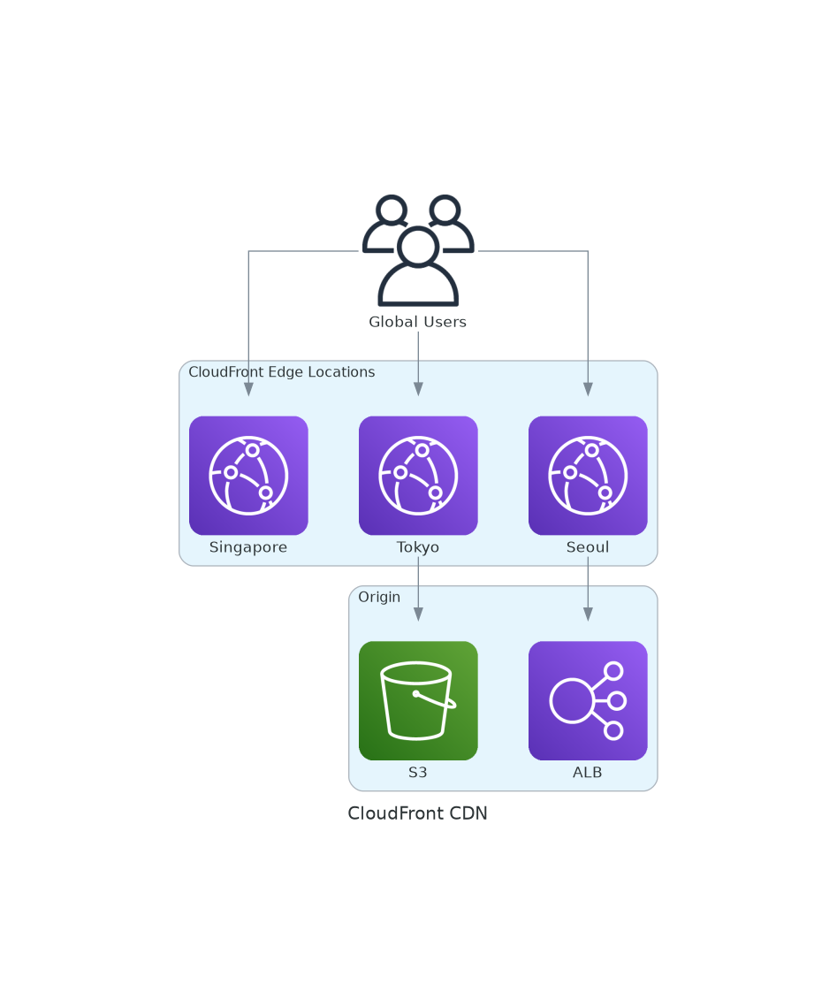
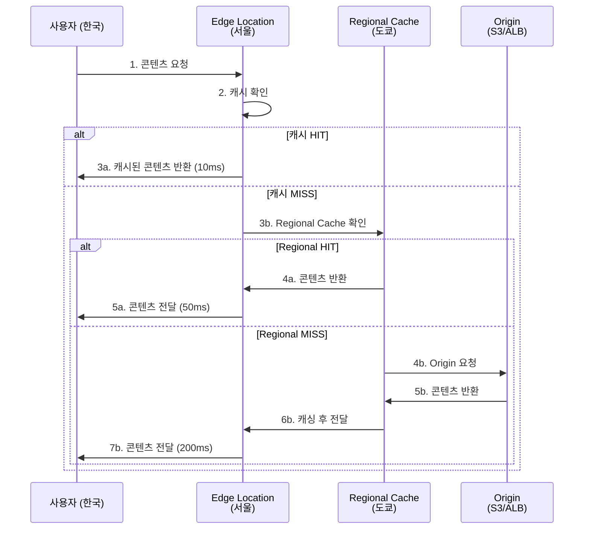

# November Week 1 Day 5 Session 2: CloudFront (CDN)

<div align="center">

**🌍 글로벌 CDN** • **⚡ 엣지 캐싱** • **🔒 HTTPS 배포**

*CloudFront로 전 세계 빠른 콘텐츠 배포*

</div>

---

## 🕘 세션 정보
**시간**: 09:40-10:20 (40분)
**목표**: CloudFront CDN 개념 및 글로벌 배포 전략 완전 이해
**방식**: 이론 강의 + Route 53 연계

## 🎯 학습 목표
### 📚 학습 목표
- **이해 목표**: CDN 작동 원리 및 CloudFront 핵심 개념 이해
- **적용 목표**: Origin 설정 및 캐싱 전략 수립 능력
- **협업 목표**: 글로벌 서비스 배포 전략 수립 및 공유

---

## 📖 서비스 개요

### 1. 생성 배경 (Why?) - 5분

**🏠 실생활 비유**:
편의점을 생각해보세요. 본사 창고(Origin)에서 매번 물건을 가져오는 대신, 동네 편의점(Edge Location)에 미리 물건을 배치해두면 훨씬 빠르게 구매할 수 있습니다. CloudFront는 전 세계 곳곳에 "편의점"을 두어 콘텐츠를 빠르게 제공합니다.

**💼 실무 문제 상황**:
- **느린 글로벌 접속**: 
  - 한국 서버 → 미국 사용자: 200-300ms 지연
  - 미국 서버 → 한국 사용자: 200-300ms 지연
  - 해결: 가까운 Edge Location에서 제공 (10-50ms)
  
- **Origin 서버 부하**: 
  - 모든 요청이 Origin으로 집중
  - 서버 과부하 및 비용 증가
  - 해결: Edge에서 캐싱으로 Origin 부하 90% 감소
  
- **대용량 파일 전송 비용**: 
  - 동영상, 이미지 등 대용량 파일
  - 데이터 전송 비용 높음
  - 해결: Edge 캐싱으로 전송 비용 절감
  
- **DDoS 공격 취약**: 
  - Origin 서버 직접 노출
  - 공격 시 서비스 중단
  - 해결: CloudFront가 방어벽 역할

**☁️ AWS CloudFront 솔루션**:
- **글로벌 CDN**: 450+ Edge Locations (90개국)
- **자동 캐싱**: 정적/동적 콘텐츠 모두 지원
- **Route 53 통합**: ALIAS 레코드로 무료 연결
- **AWS Shield 통합**: DDoS 방어 기본 제공
- **실시간 로그**: CloudWatch Logs 통합

---

### 2. 핵심 원리 (How?) - 10분

**🔧 CloudFront 작동 흐름**:



*그림: CloudFront CDN 구조 - Edge Location과 Origin 간 캐싱*

**단계별 작동 원리**:



**1. 사용자 요청**:
- 브라우저에서 `https://cdn.example.com/image.jpg` 요청
- DNS가 가장 가까운 Edge Location으로 라우팅

**2. Edge Location 캐시 확인**:
- 캐시 HIT: 즉시 반환 (10-50ms)
- 캐시 MISS: Regional Cache 또는 Origin으로 이동

**3. Regional Edge Cache**:
- Edge Location보다 큰 캐시
- 덜 인기있는 콘텐츠 저장
- Origin 부하 추가 감소

**4. Origin 요청**:
- S3, ALB, Custom Origin
- 콘텐츠 가져와서 캐싱
- 다음 요청부터는 캐시 HIT

**🔑 핵심 개념**:

**Edge Location**:
```
전 세계 450+ 위치:
- 북미: 200+
- 유럽: 100+
- 아시아: 100+
- 남미: 30+
- 아프리카: 10+
- 오세아니아: 10+

한국 Edge Locations:
- 서울: 5개
- 부산: 1개
```

**Origin 타입**:
```
S3 Bucket:
- 정적 웹사이트
- 이미지, 동영상, 파일
- OAC (Origin Access Control)로 보안

ALB/NLB:
- 동적 콘텐츠
- API 응답
- 웹 애플리케이션

Custom Origin:
- 온프레미스 서버
- 다른 클라우드
- HTTP/HTTPS 서버
```

**캐싱 동작**:
```
Cache-Control 헤더:
- max-age=3600: 1시간 캐싱
- no-cache: 매번 검증
- no-store: 캐싱 안 함

TTL (Time To Live):
- Minimum TTL: 0초
- Maximum TTL: 31536000초 (1년)
- Default TTL: 86400초 (24시간)

캐시 키:
- URL 경로
- Query String (선택)
- Headers (선택)
- Cookies (선택)
```

**Price Class**:
```
All Edge Locations:
- 전 세계 모든 위치
- 최고 성능
- 최고 비용

200 Edge Locations:
- 북미, 유럽, 아시아, 중동, 아프리카
- 균형잡힌 선택
- 중간 비용

100 Edge Locations:
- 북미, 유럽만
- 비용 최소화
- 제한된 지역
```

---

### 3. 주요 사용 사례 (When?) - 5분

**✅ 적합한 경우**:

**1. 정적 웹사이트 호스팅**:
```
시나리오: 회사 홈페이지
- S3에 HTML, CSS, JS, 이미지 저장
- CloudFront로 전 세계 배포
- Route 53 ALIAS로 도메인 연결
- 비용: $1-5/월
```

**2. 동영상 스트리밍**:
```
시나리오: OTT 서비스
- S3에 동영상 파일 저장
- CloudFront로 스트리밍
- Signed URLs로 접근 제어
- 대역폭 비용 90% 절감
```

**3. API 가속화**:
```
시나리오: 글로벌 API 서비스
- ALB Origin
- 동적 콘텐츠 캐싱
- 지역별 지연시간 감소
- API 응답 속도 3-5배 향상
```

**4. 소프트웨어 배포**:
```
시나리오: 앱 업데이트 배포
- S3에 설치 파일 저장
- CloudFront로 다운로드 제공
- 동시 다운로드 수백만 건
- Origin 부하 없음
```

**📊 실제 기업 사례**:

**Netflix**:
- **문제**: 전 세계 2억+ 사용자에게 동영상 스트리밍
- **해결**: CloudFront + Custom CDN 조합
- **결과**: 99.99% 가용성, 초당 수백만 스트림

**Spotify**:
- **문제**: 음악 파일 글로벌 배포
- **해결**: CloudFront로 음악 캐싱
- **결과**: 재생 시작 시간 70% 단축

**Slack**:
- **문제**: 파일 공유 및 이미지 로딩 느림
- **해결**: CloudFront로 정적 자산 배포
- **결과**: 페이지 로딩 속도 5배 향상

**Airbnb**:
- **문제**: 숙소 이미지 로딩 지연
- **해결**: CloudFront + S3로 이미지 CDN
- **결과**: 이미지 로딩 시간 80% 감소

---

### 4. 비슷한 서비스 비교 (Which?) - 5분

**AWS 내 대안 서비스**:

**CloudFront vs S3 Transfer Acceleration**:

| 구분 | CloudFront | S3 Transfer Acceleration |
|------|------------|--------------------------|
| **목적** | 콘텐츠 배포 | 파일 업로드 가속화 |
| **캐싱** | ✅ 지원 | ❌ 없음 |
| **Edge Locations** | 450+ | 450+ |
| **비용** | $0.085/GB | $0.04/GB (추가) |
| **사용 사례** | 다운로드, 스트리밍 | 대용량 파일 업로드 |

**선택 기준**:
- **콘텐츠 배포** → CloudFront
- **파일 업로드** → S3 Transfer Acceleration

**CloudFront vs Global Accelerator**:

| 구분 | CloudFront | Global Accelerator |
|------|------------|-------------------|
| **계층** | Layer 7 (HTTP/HTTPS) | Layer 4 (TCP/UDP) |
| **캐싱** | ✅ 지원 | ❌ 없음 |
| **프로토콜** | HTTP/HTTPS | TCP/UDP/HTTP/HTTPS |
| **비용** | $0.085/GB | $0.015/hour + $0.015/GB |
| **사용 사례** | 웹사이트, API | 게임, VoIP, IoT |

**선택 기준**:
- **HTTP/HTTPS 콘텐츠** → CloudFront
- **TCP/UDP 애플리케이션** → Global Accelerator

**CloudFront vs 다른 CDN**:

| 기능 | CloudFront | Cloudflare | Akamai |
|------|------------|------------|--------|
| **Edge Locations** | 450+ | 300+ | 4,000+ |
| **AWS 통합** | ✅ 완벽 | 부분적 | 부분적 |
| **무료 티어** | ✅ 1TB/월 | ✅ 무제한 | ❌ 없음 |
| **DDoS 방어** | ✅ 무료 | ✅ 무료 | 💰 유료 |
| **가격** | $0.085/GB | $0.10/GB | $0.15/GB |
| **설정 복잡도** | 중간 | 쉬움 | 복잡 |

**언제 CloudFront를 사용하는가**:
- ✅ AWS 인프라 사용 (S3, ALB)
- ✅ Route 53 통합 (ALIAS 무료)
- ✅ AWS Shield/WAF 통합
- ✅ 프로그래밍 방식 관리 (API)

**언제 다른 CDN을 사용하는가**:
- ✅ 비용 최소화 (Cloudflare 무료)
- ✅ 더 많은 Edge (Akamai)
- ✅ 간단한 설정 (Cloudflare)

---

### 5. 장단점 분석 - 3분

**장점**:
- ✅ **글로벌 성능**: 450+ Edge Locations
- ✅ **AWS 통합**: S3, ALB, Route 53 완벽 연동
- ✅ **무료 티어**: 1TB/월 데이터 전송 무료 (12개월)
- ✅ **DDoS 방어**: AWS Shield Standard 무료
- ✅ **실시간 로그**: CloudWatch Logs 통합
- ✅ **HTTPS 무료**: ACM 인증서 무료 사용
- ✅ **프로그래밍 가능**: API, CLI, CloudFormation

**단점/제약사항**:
- ⚠️ **비용**: $0.085/GB (다른 CDN보다 비쌈)
- ⚠️ **설정 복잡도**: 초보자에게 어려움
- ⚠️ **캐시 무효화 비용**: 1,000건 초과 시 $0.005/건
- ⚠️ **전파 시간**: 설정 변경 후 15-20분 소요
- ⚠️ **Edge Location 수**: Akamai보다 적음

---

### 6. 비용 구조 💰 - 5분

**과금 방식**:

**1. 데이터 전송 (Data Transfer Out)**:
```
북미/유럽 (ap-northeast-2 포함):
- 첫 10TB: $0.085/GB
- 다음 40TB: $0.080/GB
- 다음 100TB: $0.060/GB
- 다음 350TB: $0.040/GB
- 500TB 초과: $0.030/GB

예시:
- 1TB 전송: $85
- 100TB 전송: $7,550
- 1PB 전송: $51,200
```

**2. HTTP/HTTPS 요청**:
```
HTTP 요청:
- $0.0075/10,000 요청

HTTPS 요청:
- $0.010/10,000 요청

예시:
- 100만 HTTP 요청: $0.75
- 100만 HTTPS 요청: $1.00
```

**3. 캐시 무효화 (Invalidation)**:
```
무료:
- 매월 첫 1,000건 무료

유료:
- 1,000건 초과: $0.005/건

예시:
- 5,000건 무효화: (5,000 - 1,000) × $0.005 = $20
```

**4. Field-Level Encryption**:
```
비용:
- $0.02/10,000 요청

사용 사례:
- 신용카드 정보 암호화
- 개인정보 보호
```

**5. Real-Time Logs**:
```
비용:
- $0.01/백만 로그 라인

Kinesis Data Streams 추가 비용:
- $0.015/시간/샤드
- $0.014/GB 데이터
```

**프리티어 혜택** (12개월):
```
✅ 데이터 전송: 1TB/월 무료
✅ HTTP/HTTPS 요청: 1천만 건/월 무료
✅ 캐시 무효화: 1,000건/월 무료
✅ SSL 인증서: ACM 무료

예상 무료 사용량:
- 중소 웹사이트: 완전 무료
- 블로그: 완전 무료
- 작은 API: 완전 무료
```

**비용 최적화 팁**:

**1. Price Class 선택**:
```
All Edge Locations:
- 전 세계 모든 위치
- 최고 비용

200 Edge Locations (권장):
- 북미, 유럽, 아시아, 중동, 아프리카
- 비용 10-15% 절감
- 대부분 사용자 커버

100 Edge Locations:
- 북미, 유럽만
- 비용 30% 절감
- 제한된 지역
```

**2. 캐싱 최적화**:
```
TTL 증가:
- 정적 파일: 1년 (31536000초)
- 이미지: 1주일 (604800초)
- HTML: 1시간 (3600초)

Cache-Control 헤더:
- max-age=31536000, immutable
- Origin 요청 90% 감소
- 비용 90% 절감
```

**3. 압축 활성화**:
```
Gzip/Brotli 압축:
- 텍스트 파일 70-90% 압축
- 데이터 전송 비용 70% 절감
- 자동 압축 설정
```

**4. 캐시 무효화 최소화**:
```
❌ 잘못된 방법:
- 매번 전체 캐시 무효화
- 비용: 수백 달러

✅ 올바른 방법:
- 버전 관리 (style.v2.css)
- 특정 경로만 무효화
- 비용: 무료 (1,000건 이내)
```

**예상 비용 계산**:

**시나리오 1: 블로그**:
```
트래픽: 10GB/월
요청: 10만 건/월
비용: 무료 (프리티어)
```

**시나리오 2: 중소 웹사이트**:
```
트래픽: 100GB/월
요청: 100만 건/월
비용: $8.50 + $1.00 = $9.50/월
```

**시나리오 3: 동영상 스트리밍**:
```
트래픽: 10TB/월
요청: 1천만 건/월
비용: $850 + $10 = $860/월
```

---

### 7. 최신 업데이트 🆕 - 2분

**2024년 주요 변경사항**:

**1. CloudFront Functions 개선** (2024.02):
- JavaScript 런타임 업그레이드
- 더 빠른 실행 속도 (1ms 미만)
- 더 많은 메모리 (10MB)

**2. Origin Shield 확장** (2024.05):
- 더 많은 리전 지원
- Origin 부하 추가 감소
- 캐시 HIT 비율 향상

**3. HTTP/3 지원** (2024.08):
- QUIC 프로토콜 지원
- 더 빠른 연결 설정
- 모바일 성능 향상

**4. Real-Time Logs 개선** (2024.10):
- 더 상세한 로그
- Kinesis Data Streams 통합
- 실시간 분석 가능

**2025년 예정**:
- **AI 기반 캐싱**: 머신러닝으로 최적 TTL 자동 설정
- **더 많은 Edge**: 500+ Edge Locations 목표
- **비용 절감**: 데이터 전송 비용 인하 검토

**Deprecated 기능**:
- ❌ **Flash Media Server**: 2024년 종료
- ❌ **RTMP Distribution**: 2024년 종료 (HLS 사용 권장)

**참조**: [CloudFront What's New](https://aws.amazon.com/cloudfront/whats-new/)

---

### 8. 잘 사용하는 방법 ✅ - 3분

**베스트 프랙티스**:

**1. Origin 보호**:
```
✅ 올바른 방법:
- S3: OAC (Origin Access Control) 사용
- ALB: Custom Header로 CloudFront만 허용
- 보안 그룹: CloudFront IP만 허용

❌ 피해야 할 방법:
- Origin 직접 노출
- 누구나 Origin 접근 가능
```

**2. 캐싱 전략**:
```
정적 파일 (이미지, CSS, JS):
- TTL: 1년
- Cache-Control: max-age=31536000, immutable
- 버전 관리: style.v2.css

동적 콘텐츠 (API):
- TTL: 0-60초
- Cache-Control: max-age=60
- Query String 캐싱

HTML:
- TTL: 1시간
- Cache-Control: max-age=3600
- ETag 사용
```

**3. 압축 설정**:
```
CloudFront 자동 압축:
- Gzip: 텍스트 파일
- Brotli: 최신 브라우저
- 70-90% 크기 감소
```

**4. HTTPS 강제**:
```
Viewer Protocol Policy:
- Redirect HTTP to HTTPS
- HTTPS Only

Origin Protocol Policy:
- HTTPS Only (권장)
- Match Viewer (선택)
```

**5. 모니터링**:
```
CloudWatch 메트릭:
- Requests: 요청 수
- BytesDownloaded: 전송량
- 4xxErrorRate: 클라이언트 오류
- 5xxErrorRate: 서버 오류

알람 설정:
- 5xxErrorRate > 5%
- BytesDownloaded 급증
```

**실무 팁**:

**정적 웹사이트 배포**:
```
1. S3 버킷 생성
2. 정적 파일 업로드
3. CloudFront Distribution 생성
4. OAC 설정
5. Route 53 ALIAS 레코드
6. ACM 인증서 연결
```

**동영상 스트리밍**:
```
1. S3에 동영상 업로드
2. CloudFront Distribution 생성
3. Signed URLs 설정
4. HLS/DASH 형식 사용
5. 적응형 비트레이트
```

---

### 9. 잘못 사용하는 방법 ❌ - 3분

**흔한 실수**:

**1. Origin 직접 노출**:
```
❌ 잘못된 방법:
S3 버킷 Public 설정
→ CloudFront 우회 가능
→ 비용 증가, 보안 취약

✅ 올바른 방법:
S3 버킷 Private + OAC
→ CloudFront만 접근 가능
→ 비용 절감, 보안 강화
```

**2. 캐시 무효화 남용**:
```
❌ 잘못된 방법:
매번 전체 캐시 무효화 (/*)


→ 비용: 수백 달러
→ 불필요한 무효화

✅ 올바른 방법:
버전 관리 (style.v2.css)
→ 비용: 무료
→ 즉시 반영
```

**3. TTL 너무 짧음**:
```
❌ 잘못된 방법:
모든 파일 TTL 60초
→ Origin 부하 증가
→ 캐시 효율 낮음

✅ 올바른 방법:
정적 파일: 1년
동적 콘텐츠: 60초
HTML: 1시간
```

**4. 압축 미사용**:
```
❌ 잘못된 방법:
압축 비활성화
→ 데이터 전송 3-10배
→ 비용 3-10배

✅ 올바른 방법:
Gzip/Brotli 활성화
→ 70-90% 압축
→ 비용 70-90% 절감
```

**5. Price Class 잘못 선택**:
```
❌ 잘못된 방법:
한국 사용자만 있는데 All Edge Locations
→ 불필요한 비용

✅ 올바른 방법:
200 Edge Locations (아시아 포함)
→ 비용 10-15% 절감
→ 성능 동일
```

**안티 패턴**:

**1. CloudFront 없이 S3 직접 사용**:
```
❌ 안티 패턴:
S3 Public + 직접 접근
→ 느린 속도 (200-300ms)
→ 높은 비용
→ DDoS 취약

✅ 베스트 프랙티스:
S3 Private + CloudFront
→ 빠른 속도 (10-50ms)
→ 낮은 비용 (캐싱)
→ DDoS 방어
```

**2. 모든 콘텐츠 no-cache**:
```
❌ 안티 패턴:
Cache-Control: no-cache
→ 캐싱 안 됨
→ Origin 부하 100%

✅ 베스트 프랙티스:
적절한 TTL 설정
→ 캐싱 효율 90%
→ Origin 부하 10%
```

**3. 단일 Distribution으로 모든 것**:
```
❌ 안티 패턴:
하나의 Distribution에 모든 콘텐츠
→ 캐싱 전략 복잡
→ 무효화 어려움

✅ 베스트 프랙티스:
용도별 Distribution 분리
- 정적 파일: cdn-static.example.com
- 동적 API: cdn-api.example.com
- 동영상: cdn-video.example.com
```

---

### 10. 구성 요소 상세 - 5분

**주요 구성 요소**:

**1. Distribution**:
```
역할: CloudFront 배포 단위

타입:
- Web Distribution:
  * HTTP/HTTPS 콘텐츠
  * 정적/동적 콘텐츠
  * 가장 일반적

생성 시간:
- 15-20분 (전 세계 배포)
- 상태: InProgress → Deployed
```

**2. Origin**:
```
S3 Bucket:
- 정적 웹사이트
- OAC로 보안
- 버전 관리 권장

Custom Origin (ALB/NLB):
- 동적 콘텐츠
- HTTP/HTTPS
- Custom Headers

Custom Origin (온프레미스):
- 기존 서버
- HTTP/HTTPS
- 도메인 또는 IP
```

**3. Behavior**:
```
Path Pattern:
- Default (*): 모든 경로
- /images/*: 이미지만
- /api/*: API만

Viewer Protocol Policy:
- HTTP and HTTPS
- Redirect HTTP to HTTPS (권장)
- HTTPS Only

Allowed HTTP Methods:
- GET, HEAD (읽기 전용)
- GET, HEAD, OPTIONS
- GET, HEAD, OPTIONS, PUT, POST, PATCH, DELETE (전체)

Cache Policy:
- CachingOptimized: 정적 파일
- CachingDisabled: 동적 콘텐츠
- Custom: 사용자 정의
```

**4. Cache Policy**:
```
TTL 설정:
- Minimum TTL: 0초
- Maximum TTL: 31536000초 (1년)
- Default TTL: 86400초 (24시간)

Cache Key:
- Headers: Host, User-Agent 등
- Query Strings: ?id=123
- Cookies: session_id

압축:
- Gzip: 자동
- Brotli: 자동
```

**5. Origin Request Policy**:
```
Headers:
- All viewer headers
- Whitelist headers
- CloudFront headers

Query Strings:
- None
- All
- Whitelist

Cookies:
- None
- All
- Whitelist
```

**6. Response Headers Policy**:
```
보안 헤더:
- Strict-Transport-Security
- X-Content-Type-Options
- X-Frame-Options
- X-XSS-Protection

CORS 헤더:
- Access-Control-Allow-Origin
- Access-Control-Allow-Methods
- Access-Control-Allow-Headers

Custom Headers:
- X-Custom-Header: value
```

**7. CloudFront Functions**:
```
역할: Edge에서 JavaScript 실행

사용 사례:
- URL 리다이렉트
- Header 조작
- A/B 테스트
- 인증 토큰 검증

제약사항:
- 실행 시간: 1ms 미만
- 메모리: 10MB
- 네트워크 호출 불가
```

**8. Lambda@Edge**:
```
역할: Edge에서 Node.js/Python 실행

사용 사례:
- 복잡한 로직
- 외부 API 호출
- 이미지 리사이징
- SEO 최적화

제약사항:
- 실행 시간: 5-30초
- 메모리: 128MB-10GB
- 비용: Lambda 요금 추가
```

**의존성**:
```
CloudFront → S3:
- OAC로 보안 연결
- 정적 파일 호스팅
- 버전 관리

CloudFront → ALB:
- Custom Headers
- 동적 콘텐츠
- Health Check

CloudFront → Route 53:
- ALIAS 레코드 (무료)
- 도메인 연결
- DNS 라우팅

CloudFront → ACM:
- SSL/TLS 인증서
- us-east-1 리전 필수
- 자동 갱신
```

---

### 11. 공식 문서 링크 (필수 5개)

**⚠️ 학생들이 직접 확인해야 할 공식 문서**:

- 📘 **[CloudFront란?](https://docs.aws.amazon.com/AmazonCloudFront/latest/DeveloperGuide/Introduction.html)**
- 📗 **[CloudFront 개발자 가이드](https://docs.aws.amazon.com/AmazonCloudFront/latest/DeveloperGuide/)**
- 📙 **[CloudFront 시작하기](https://docs.aws.amazon.com/AmazonCloudFront/latest/DeveloperGuide/GettingStarted.SimpleDistribution.html)**
- 📕 **[CloudFront 요금](https://aws.amazon.com/cloudfront/pricing/)**
- 🆕 **[CloudFront 최신 업데이트](https://aws.amazon.com/cloudfront/whats-new/)**

---

## 💭 함께 생각해보기 (10분)

### 🤝 페어 토론 (5분)

**토론 주제**:
1. **Origin 선택**: "정적 웹사이트를 배포한다면 S3와 ALB 중 어떤 것을 Origin으로 선택하시겠습니까?"
2. **캐싱 전략**: "이미지 파일의 적절한 TTL은 얼마일까요?"
3. **비용 최적화**: "월 100GB 트래픽 웹사이트의 CloudFront 비용은 얼마일까요?"

### 🎯 전체 공유 (5분)

### 💡 이해도 체크 질문

**기본 이해도**:
- ✅ "CDN이 무엇인지 설명할 수 있나요?"
- ✅ "Edge Location의 역할을 아시나요?"

**실무 적용**:
- ✅ "S3를 Origin으로 설정하는 방법을 아시나요?"
- ✅ "캐싱 전략을 수립할 수 있나요?"

---

## 🔑 핵심 키워드

**CDN 기본**: CDN, Edge Location, Origin, Distribution
**캐싱**: TTL, Cache HIT/MISS, Cache Key
**보안**: OAC, AWS Shield, AWS WAF, Signed URLs
**고급**: CloudFront Functions, Lambda@Edge

---

## 📝 세션 마무리

### ✅ 오늘 세션 성과
- [x] CloudFront CDN 개념 완전 이해
- [x] 캐싱 전략 및 비용 최적화 방법 습득

### 🎯 다음 세션: ACM (SSL/TLS)

---

<div align="center">

**🌍 글로벌 CDN** • **⚡ 엣지 캐싱** • **🔒 HTTPS 배포**

*다음: ACM (SSL/TLS) - HTTPS 인증서 관리*

</div>
