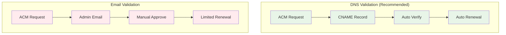
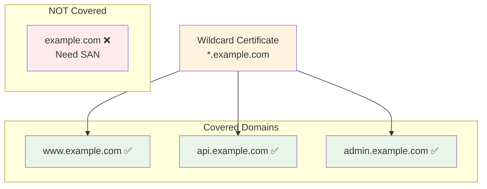
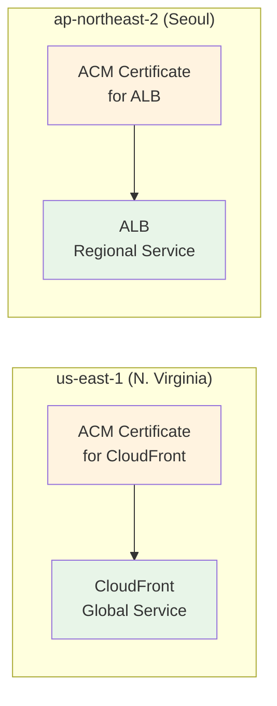
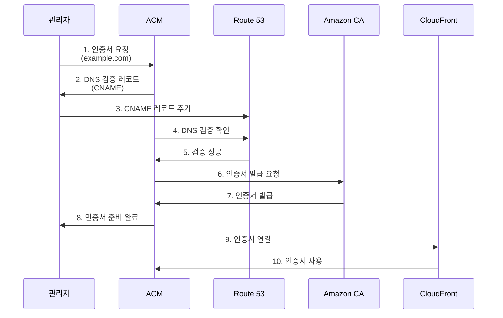
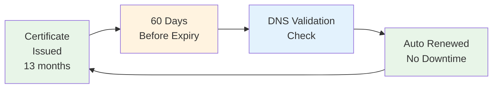
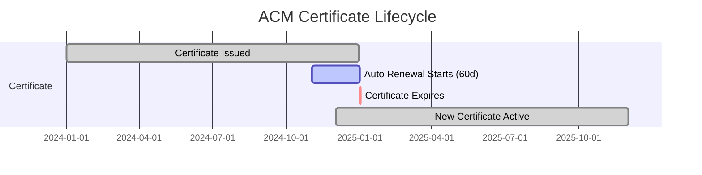
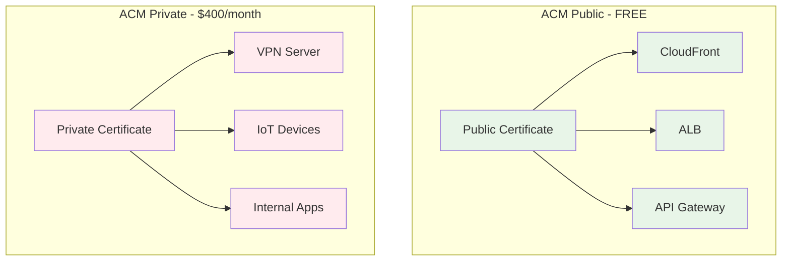
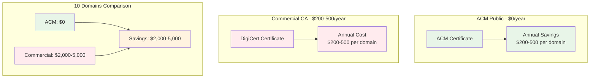

# November Week 1 Day 5 Session 3: ACM (SSL/TLS)

<div align="center">

**🔒 SSL/TLS 인증서** • **🆓 무료 발급** • **🔄 자동 갱신**

*ACM으로 HTTPS 보안 통신 구현*

</div>

---

## 🕘 세션 정보
**시간**: 11:00-11:50 (50분)
**목표**: ACM 인증서 발급 및 HTTPS 통합 완전 이해
**방식**: 이론 강의 + Route 53/CloudFront 연계

## 🎯 학습 목표
### 📚 학습 목표
- **이해 목표**: SSL/TLS 개념 및 ACM 핵심 기능 이해
- **적용 목표**: 인증서 발급 및 도메인 검증 방법 습득
- **협업 목표**: HTTPS 배포 전략 수립 및 공유

---

## 📖 서비스 개요

### 1. 생성 배경 (Why?) - 5분

**🏠 실생활 비유**:
신분증을 생각해보세요. 웹사이트도 "이 사이트가 진짜 example.com이 맞습니다"라는 신분증(SSL/TLS 인증서)이 필요합니다. ACM은 이 신분증을 무료로 발급하고 자동으로 갱신해줍니다.

**💼 실무 문제 상황**:
- **HTTP 보안 취약**: 
  - 평문 통신으로 데이터 노출
  - 중간자 공격(MITM) 가능
  - 브라우저 "안전하지 않음" 경고
  - 해결: HTTPS로 암호화 통신
  
- **인증서 구매 비용**: 
  - 상용 CA: 연간 $50-300
  - 와일드카드: 연간 $200-500
  - 갱신 관리 부담
  - 해결: ACM 무료 발급 + 자동 갱신
  
- **인증서 갱신 누락**: 
  - 수동 갱신 시 만료 위험
  - 서비스 중단 (인증서 만료)
  - 고객 신뢰 손실
  - 해결: ACM 자동 갱신 (60일 전)
  
- **멀티 도메인 관리**: 
  - 여러 도메인마다 인증서 구매
  - 관리 복잡도 증가
  - 비용 증가
  - 해결: ACM SAN/와일드카드 무료

**☁️ AWS ACM 솔루션**:
- **무료 인증서**: Public 인증서 무료 발급
- **자동 갱신**: 만료 60일 전 자동 갱신
- **AWS 통합**: CloudFront, ALB, API Gateway 완벽 연동
- **도메인 검증**: DNS/Email 검증 지원
- **와일드카드**: *.example.com 무료 지원

---

### 2. 핵심 원리 (How?) - 10분

**🔧 ACM 인증서 발급 흐름**:


*그림: ACM 인증서 발급 및 검증 프로세스*

**DNS 검증 vs Email 검증 비교**:



**와일드카드 인증서 커버리지**:



**리전 제약 사항**:



**단계별 작동 원리**:



**1. 인증서 요청**:
- AWS Console에서 ACM 접속
- "Request certificate" 클릭
- 도메인 이름 입력 (example.com, *.example.com)

**2. 검증 방법 선택**:
- DNS 검증 (권장)
- Email 검증

**3. DNS 검증 (권장)**:
- ACM이 CNAME 레코드 제공
- Route 53에 CNAME 추가
- 자동 검증 (수분 내)

**4. 인증서 발급**:
- Amazon Trust Services CA
- 브라우저 신뢰
- 13개월 유효기간

**5. 자동 갱신**:
- 만료 60일 전 자동 갱신
- DNS 검증 자동 확인
- 다운타임 없음

**🔑 핵심 개념**:

**인증서 타입**:
```
Public 인증서:
- 용도: 인터넷 공개 서비스
- 비용: 무료
- CA: Amazon Trust Services
- 브라우저 신뢰: ✅

Private 인증서:
- 용도: 내부 서비스
- 비용: $400/월 (Private CA)
- CA: 자체 CA
- 브라우저 신뢰: ❌ (수동 설치)
```

**도메인 검증 방법**:
```
DNS 검증 (권장):
- CNAME 레코드 추가
- 자동 갱신 지원
- Route 53 통합
- 검증 시간: 수분

Email 검증:
- 도메인 관리자 이메일
- 수동 승인 필요
- 자동 갱신 제한적
- 검증 시간: 수시간
```

**SAN (Subject Alternative Names)**:
```
단일 인증서로 여러 도메인:
- example.com
- www.example.com
- api.example.com
- admin.example.com

최대 10개 도메인 무료
```

**와일드카드 인증서**:
```
*.example.com:
- www.example.com ✅
- api.example.com ✅
- admin.example.com ✅
- example.com ❌ (별도 추가 필요)

조합:
- *.example.com
- example.com
→ 모든 서브도메인 + 루트 도메인
```

**리전 제약**:
```
CloudFront 사용 시:
- 인증서 리전: us-east-1 필수
- 이유: CloudFront는 글로벌 서비스
- 다른 리전 인증서 사용 불가

ALB 사용 시:
- 인증서 리전: ALB와 동일 리전
- 예: ap-northeast-2 ALB → ap-northeast-2 인증서
```

**자동 갱신 조건**:
```
DNS 검증:
- CNAME 레코드 유지
- 자동 갱신 ✅
- 다운타임 없음

Email 검증:
- 수동 승인 필요
- 자동 갱신 제한적
- 관리 부담
```

**자동 갱신 프로세스**:



**갱신 타임라인**:



---

### 3. 주요 사용 사례 (When?) - 5분

**✅ 적합한 경우**:

**1. 정적 웹사이트 HTTPS**:
```
시나리오: 회사 홈페이지
- S3 + CloudFront
- ACM 인증서 (us-east-1)
- Route 53 ALIAS
- 비용: 무료
```

**2. API 서버 HTTPS**:
```
시나리오: REST API
- ALB + EC2
- ACM 인증서 (ap-northeast-2)
- Route 53 A 레코드
- 비용: 무료
```

**3. 멀티 도메인 서비스**:
```
시나리오: 마이크로서비스
- api.example.com
- admin.example.com
- dashboard.example.com
- 단일 SAN 인증서
- 비용: 무료
```

**4. 와일드카드 서비스**:
```
시나리오: 멀티 테넌트 SaaS
- *.example.com
- customer1.example.com
- customer2.example.com
- 무제한 서브도메인
- 비용: 무료
```

**📊 실제 기업 사례**:

**Airbnb**:
- **문제**: 수백 개 서브도메인 HTTPS
- **해결**: ACM 와일드카드 인증서
- **결과**: 인증서 관리 비용 $50K/년 절감

**Slack**:
- **문제**: 팀별 서브도메인 (team.slack.com)
- **해결**: ACM *.slack.com
- **결과**: 자동 갱신으로 운영 부담 제거

**Netflix**:
- **문제**: 글로벌 CDN HTTPS
- **해결**: ACM + CloudFront
- **결과**: 인증서 관리 자동화

**Spotify**:
- **문제**: API 서버 HTTPS
- **해결**: ACM + ALB
- **결과**: 무료 인증서로 비용 절감

---

### 4. 비슷한 서비스 비교 (Which?) - 5분

**ACM vs Let's Encrypt**:

| 구분 | ACM | Let's Encrypt |
|------|-----|---------------|
| **비용** | 무료 | 무료 |
| **유효기간** | 13개월 | 90일 |
| **자동 갱신** | ✅ 자동 (60일 전) | ✅ 자동 (30일 전) |
| **AWS 통합** | ✅ 완벽 | 부분적 |
| **와일드카드** | ✅ 무료 | ✅ 무료 |
| **설치** | 불필요 (AWS 관리) | Certbot 설치 필요 |
| **사용 제약** | AWS 서비스만 | 어디서나 |

**선택 기준**:
- **AWS 서비스** → ACM (완벽 통합)
- **온프레미스/다른 클라우드** → Let's Encrypt

**ACM vs 상용 CA (DigiCert, GlobalSign)**:

| 구분 | ACM | 상용 CA |
|------|-----|---------|
| **비용** | 무료 | $50-500/년 |
| **검증 수준** | DV (Domain Validation) | DV, OV, EV |
| **보증금** | 없음 | $10K-1.5M |
| **브라우저 신뢰** | ✅ 99%+ | ✅ 99%+ |
| **자동 갱신** | ✅ | 제한적 |
| **고객 지원** | AWS Support | 전담 지원 |

**선택 기준**:
- **일반 웹사이트** → ACM (무료)
- **금융/의료** → 상용 CA (OV/EV, 보증금)

**ACM Public vs ACM Private**:

| 구분 | ACM Public | ACM Private |
|------|------------|-------------|
| **용도** | 인터넷 공개 | 내부 서비스 |
| **비용** | 무료 | $400/월 (CA) |
| **브라우저 신뢰** | ✅ | ❌ |
| **검증** | DNS/Email | 불필요 |
| **사용 사례** | 웹사이트, API | VPN, IoT, 내부 앱 |

**선택 기준**:
- **공개 서비스** → ACM Public
- **내부 서비스** → ACM Private

**ACM Public vs Private 비교 다이어그램**:



---

### 5. 장단점 분석 - 3분

**장점**:
- ✅ **무료**: Public 인증서 무료 발급
- ✅ **자동 갱신**: 만료 60일 전 자동 갱신
- ✅ **AWS 통합**: CloudFront, ALB, API Gateway 완벽 연동
- ✅ **와일드카드**: *.example.com 무료
- ✅ **SAN 지원**: 최대 10개 도메인
- ✅ **관리 간편**: AWS Console에서 중앙 관리
- ✅ **보안**: Private Key AWS 관리

**단점/제약사항**:
- ⚠️ **AWS 전용**: AWS 서비스에서만 사용 가능
- ⚠️ **Export 불가**: Private Key 다운로드 불가
- ⚠️ **리전 제약**: CloudFront는 us-east-1 필수
- ⚠️ **DV만 지원**: OV/EV 인증서 불가
- ⚠️ **Email 검증 제한**: 자동 갱신 제한적

**대안 방법**:
- **온프레미스**: Let's Encrypt
- **OV/EV 필요**: 상용 CA (DigiCert)
- **내부 서비스**: ACM Private CA
---

### 6. 비용 구조 💰 - 5분

**과금 방식**:

**1. Public 인증서**:
```
비용: 무료! ⭐

포함 사항:
- 인증서 발급
- 자동 갱신
- 도메인 검증
- SAN (최대 10개)
- 와일드카드

제약 없음:
- 발급 개수 무제한
- 갱신 횟수 무제한
- 도메인 개수 무제한 (SAN 10개 제한만)
```

**2. Private 인증서**:
```
Private CA 비용:
- CA 생성: $400/월
- 인증서 발급: $0.75/개

예시:
- CA 1개 + 인증서 100개: $400 + $75 = $475/월
- CA 1개 + 인증서 1,000개: $400 + $750 = $1,150/월

사용 사례:
- 내부 마이크로서비스
- IoT 디바이스
- VPN 서버
```

**3. 연관 비용**:
```
CloudFront:
- 인증서: 무료
- 데이터 전송: $0.085/GB
- HTTPS 요청: $0.010/10,000

ALB:
- 인증서: 무료
- ALB 시간: $0.0225/hour
- LCU: $0.008/LCU

Route 53:
- ALIAS 쿼리: 무료
- 호스팅 존: $0.50/월
```

**프리티어 혜택**:
```
✅ Public 인증서: 영구 무료
✅ 자동 갱신: 영구 무료
✅ 도메인 검증: 무료
✅ SAN/와일드카드: 무료

❌ Private CA: 프리티어 없음
```

**비용 비교 (연간)**:
```
ACM Public:
- 비용: $0
- 갱신: 자동 (무료)
- 관리: AWS 자동

Let's Encrypt:
- 비용: $0
- 갱신: Certbot 설정 필요
- 관리: 수동

DigiCert:
- 비용: $200-500/년
- 갱신: 수동 ($200-500)
- 관리: 수동

절감액:
- ACM vs DigiCert: $200-500/년/도메인
- 10개 도메인: $2,000-5,000/년 절감
```

**비용 절감 효과 시각화**:



**비용 최적화 팁**:

**1. Public 인증서 최대 활용**:
```
✅ 무료:
- example.com
- *.example.com
- SAN 10개 도메인

비용: $0
```

**2. 와일드카드 사용**:
```
❌ 비효율:
- api.example.com 인증서
- admin.example.com 인증서
- dashboard.example.com 인증서
관리: 3개 인증서

✅ 효율:
- *.example.com 인증서
관리: 1개 인증서
```

**3. Private CA 최소화**:
```
내부 서비스:
- 개발/테스트: Self-Signed (무료)
- 프로덕션: Private CA ($400/월)

절감:
- 개발 환경은 Self-Signed
- 프로덕션만 Private CA
```

---

### 7. 최신 업데이트 🆕 - 2분

**2024년 주요 변경사항**:

**1. 자동 갱신 개선** (2024.01):
- 갱신 성공률 99.9%+
- 더 빠른 갱신 프로세스
- 알림 개선

**2. Private CA 기능 확장** (2024.04):
- 더 많은 인증서 템플릿
- OCSP 응답 개선
- CRL 배포 최적화

**3. CloudWatch 통합 강화** (2024.07):
- 인증서 만료 알림
- 갱신 실패 알림
- 사용 메트릭

**4. 교차 계정 공유** (2024.10):
- AWS RAM 통합
- 멀티 계정 인증서 공유
- 중앙 집중식 관리

**2025년 예정**:
- **더 긴 유효기간**: 13개월 → 24개월 검토
- **OV 인증서**: Organization Validation 지원 검토
- **비용 절감**: Private CA 비용 인하 검토

**Deprecated 기능**:
- ❌ **Email 검증 권장 중단**: DNS 검증 권장
- ❌ **SHA-1 서명**: SHA-256 이상 필수

**참조**: [ACM What's New](https://aws.amazon.com/certificate-manager/whats-new/)

---

### 8. 잘 사용하는 방법 ✅ - 3분

**베스트 프랙티스**:

**1. DNS 검증 사용**:
```
✅ 올바른 방법:
DNS 검증 + Route 53
- 자동 갱신 ✅
- 검증 시간: 수분
- 관리 부담 없음

❌ 피해야 할 방법:
Email 검증
- 수동 승인 필요
- 자동 갱신 제한적
- 관리 부담
```

**2. 와일드카드 + 루트 도메인**:
```
✅ 올바른 방법:
SAN 인증서:
- *.example.com
- example.com

커버:
- www.example.com ✅
- api.example.com ✅
- example.com ✅

❌ 피해야 할 방법:
*.example.com만
- example.com ❌ (커버 안 됨)
```

**3. CloudFront는 us-east-1**:
```
✅ 올바른 방법:
CloudFront 인증서:
- 리전: us-east-1
- 이유: 글로벌 서비스

ALB 인증서:
- 리전: ALB와 동일
- 예: ap-northeast-2
```

**4. 인증서 모니터링**:
```
CloudWatch 알람:
- 만료 30일 전 알림
- 갱신 실패 알림
- SNS 통합

EventBridge:
- 인증서 상태 변경
- 자동화 트리거
```

**5. 태그 관리**:
```
태그 전략:
- Environment: production
- Service: web
- Owner: devops-team
- CostCenter: engineering

용도:
- 비용 추적
- 리소스 관리
- 자동화
```

**실무 팁**:

**CloudFront 배포**:
```
1. us-east-1에서 ACM 인증서 요청
2. DNS 검증 (Route 53)
3. CloudFront Distribution 생성
4. Alternate Domain Names 설정
5. ACM 인증서 선택
6. Route 53 ALIAS 레코드
```

**ALB 배포**:
```
1. ALB 리전에서 ACM 인증서 요청
2. DNS 검증
3. ALB Listener 443 추가
4. ACM 인증서 선택
5. HTTP → HTTPS 리다이렉트
```

**멀티 리전 배포**:
```
각 리전마다 인증서 발급:
- us-east-1: CloudFront용
- ap-northeast-2: 서울 ALB용
- us-west-2: 오레곤 ALB용

동일 도메인, 다른 리전
```

---

### 9. 잘못 사용하는 방법 ❌ - 3분

**흔한 실수**:

**1. CloudFront에 다른 리전 인증서**:
```
❌ 잘못된 방법:
CloudFront + ap-northeast-2 인증서
→ 오류: 인증서 선택 불가

✅ 올바른 방법:
CloudFront + us-east-1 인증서
→ 정상 작동
```

**2. Email 검증 사용**:
```
❌ 잘못된 방법:
Email 검증
→ 수동 승인 필요
→ 자동 갱신 제한적
→ 관리 부담

✅ 올바른 방법:
DNS 검증 + Route 53
→ 자동 검증
→ 자동 갱신
→ 관리 부담 없음
```

**3. 와일드카드만 사용**:
```
❌ 잘못된 방법:
*.example.com만
→ example.com 커버 안 됨

✅ 올바른 방법:
SAN 인증서:
- *.example.com
- example.com
→ 모든 도메인 커버
```

**4. 인증서 만료 모니터링 없음**:
```
❌ 잘못된 방법:
자동 갱신만 믿음
→ 갱신 실패 시 서비스 중단

✅ 올바른 방법:
CloudWatch 알람 설정
→ 만료 30일 전 알림
→ 갱신 실패 즉시 알림
```

**5. Private Key Export 시도**:
```
❌ 불가능:
ACM Private Key 다운로드
→ 보안상 불가능
→ AWS만 관리

✅ 대안:
- AWS 서비스에서만 사용
- 온프레미스는 Let's Encrypt
```

**안티 패턴**:

**1. 도메인마다 별도 인증서**:
```
❌ 안티 패턴:
- api.example.com 인증서
- admin.example.com 인증서
- dashboard.example.com 인증서
관리: 3개 인증서

✅ 베스트 프랙티스:
SAN 인증서 1개:
- api.example.com
- admin.example.com
- dashboard.example.com
관리: 1개 인증서
```

**2. HTTP와 HTTPS 혼용**:
```
❌ 안티 패턴:
- 메인 페이지: HTTPS
- 이미지: HTTP
→ Mixed Content 경고
→ 보안 취약

✅ 베스트 프랙티스:
- 모든 리소스: HTTPS
- HTTP → HTTPS 리다이렉트
```

**3. Self-Signed 프로덕션 사용**:
```
❌ 안티 패턴:
프로덕션에 Self-Signed
→ 브라우저 경고
→ 고객 신뢰 손실

✅ 베스트 프랙티스:
- 개발: Self-Signed
- 프로덕션: ACM
```

---

### 10. 구성 요소 상세 - 5분

**주요 구성 요소**:

**1. Certificate**:
```
Public Certificate:
- 도메인 검증 (DV)
- 브라우저 신뢰
- 무료
- 13개월 유효

Private Certificate:
- 내부 사용
- Private CA 필요
- $0.75/개
- 사용자 정의 유효기간

속성:
- Domain Names: example.com, *.example.com
- Validation Method: DNS, Email
- Key Algorithm: RSA 2048, RSA 4096, ECDSA P-256, ECDSA P-384
- Status: Pending, Issued, Expired, Revoked
```

**2. Domain Validation**:
```
DNS 검증:
- CNAME 레코드 추가
- 자동 검증
- 자동 갱신 지원
- Route 53 통합

Email 검증:
- 도메인 관리자 이메일
- 수동 승인
- 자동 갱신 제한적
- 이메일 주소:
  * admin@example.com
  * administrator@example.com
  * hostmaster@example.com
  * postmaster@example.com
  * webmaster@example.com
```

**3. Certificate Authority**:
```
Amazon Trust Services:
- Public 인증서 발급
- 브라우저 신뢰 99%+
- 루트 CA:
  * Amazon Root CA 1
  * Amazon Root CA 2
  * Amazon Root CA 3
  * Amazon Root CA 4
  * Starfield Services Root CA

Private CA:
- 자체 CA 생성
- 내부 인증서 발급
- 완전한 제어
```

**4. 통합 서비스**:
```
CloudFront:
- 리전: us-east-1 필수
- Alternate Domain Names
- SNI 지원
- Dedicated IP ($600/월)

ALB/NLB:
- 리전: ALB와 동일
- HTTPS Listener
- SNI 지원
- 여러 인증서 가능

API Gateway:
- Custom Domain
- Regional/Edge
- 인증서 리전 일치

Elastic Beanstalk:
- 환경 설정
- 자동 배포
- 로드밸런서 통합
```

**5. 자동 갱신**:
```
갱신 프로세스:
1. 만료 60일 전 시작
2. DNS 검증 자동 확인
3. 새 인증서 발급
4. 자동 배포
5. 이전 인증서 폐기

조건:
- DNS 검증: 자동 갱신 ✅
- Email 검증: 수동 승인 필요
- CNAME 레코드 유지 필수
```

**6. 모니터링**:
```
CloudWatch 메트릭:
- DaysToExpiry: 만료까지 일수
- CertificateRenewalStatus: 갱신 상태

EventBridge 이벤트:
- Certificate Approaching Expiration
- Certificate Renewal Failed
- Certificate Issued

SNS 알림:
- 만료 30일 전
- 만료 7일 전
- 갱신 실패
```

**의존성**:
```
ACM → Route 53:
- DNS 검증 CNAME
- 자동 검증
- 자동 갱신

ACM → CloudFront:
- us-east-1 리전 필수
- HTTPS 배포
- SNI 지원

ACM → ALB:
- 동일 리전 필수
- HTTPS Listener
- 여러 인증서

ACM → CloudWatch:
- 만료 모니터링
- 갱신 상태 추적
- 알림 설정
```

---

### 11. 공식 문서 링크 (필수 5개)

**⚠️ 학생들이 직접 확인해야 할 공식 문서**:

- 📘 **[ACM이란?](https://docs.aws.amazon.com/acm/latest/userguide/acm-overview.html)**
  - ACM 개요 및 주요 기능
  - Public/Private 인증서
  - 자동 갱신 개념

- 📗 **[ACM 사용자 가이드](https://docs.aws.amazon.com/acm/latest/userguide/)**
  - 전체 사용자 가이드
  - 인증서 요청 및 관리
  - 도메인 검증 방법
  - AWS 서비스 통합

- 📙 **[ACM 시작하기](https://docs.aws.amazon.com/acm/latest/userguide/gs.html)**
  - 첫 인증서 요청
  - DNS 검증 설정
  - CloudFront/ALB 연결
  - 테스트 방법

- 📕 **[ACM 요금](https://aws.amazon.com/certificate-manager/pricing/)**
  - Public 인증서: 무료
  - Private CA 비용
  - 연관 서비스 비용

- 🆕 **[ACM 최신 업데이트](https://aws.amazon.com/certificate-manager/whats-new/)**
  - 2024년 주요 변경사항
  - 신규 기능 발표
  - 자동 갱신 개선

**추가 참고 자료**:
- 🔧 **[ACM 베스트 프랙티스](https://docs.aws.amazon.com/acm/latest/userguide/acm-bestpractices.html)**
- 🏗️ **[ACM + CloudFront 가이드](https://docs.aws.amazon.com/AmazonCloudFront/latest/DeveloperGuide/cnames-and-https-requirements.html)**
- 📊 **[ACM FAQ](https://aws.amazon.com/certificate-manager/faqs/)**

---

## 💭 함께 생각해보기 (10분)

### 🤝 페어 토론 (5분)

**토론 주제**:
1. **검증 방법 선택**:
   - "DNS 검증과 Email 검증 중 어떤 것을 선택하시겠습니까?"
   - "Route 53을 사용하지 않는다면 어떻게 DNS 검증을 하나요?"

2. **인증서 설계**:
   - "10개의 서브도메인이 있다면 인증서를 어떻게 구성하시겠습니까?"
   - "와일드카드와 SAN 중 어떤 것이 더 적합할까요?"

3. **리전 전략**:
   - "CloudFront와 ALB를 함께 사용한다면 인증서를 몇 개 발급해야 하나요?"
   - "멀티 리전 배포 시 인증서 관리 전략은?"

**페어 활동 가이드**:
- 👥 **자유 페어링**: 관심사가 비슷한 사람끼리
- 🔄 **역할 교대**: 각자 의견 제시 후 토론
- 📝 **핵심 정리**: 합의된 내용 메모

### 🎯 전체 공유 (5분)

**인사이트 공유**:
- 각 페어의 인증서 설계 전략
- DNS 검증 vs Email 검증 경험
- 실무 적용 계획

**질문 수집**:
- DNS 검증 CNAME 추가 방법
- CloudFront 인증서 연결 방법
- 자동 갱신 실패 시 대응

### 💡 이해도 체크 질문

**기본 이해도**:
- ✅ "SSL/TLS가 무엇인지 설명할 수 있나요?"
- ✅ "ACM의 주요 장점 3가지를 말할 수 있나요?"
- ✅ "DNS 검증과 Email 검증의 차이를 아시나요?"

**실무 적용**:
- ✅ "CloudFront에 인증서를 연결하는 방법을 아시나요?"
- ✅ "와일드카드 인증서를 언제 사용해야 하는지 아시나요?"
- ✅ "인증서 만료를 모니터링하는 방법을 알고 계신가요?"

**심화 이해**:
- ✅ "ACM Public과 Private의 차이를 설명할 수 있나요?"
- ✅ "멀티 리전 배포 시 인증서 전략을 수립할 수 있나요?"
- ✅ "SNI와 Dedicated IP의 차이를 이해하시나요?"

---

## 🔑 핵심 키워드

**SSL/TLS 기본**:
- **SSL/TLS**: 암호화 통신 프로토콜
- **Certificate**: 디지털 인증서
- **CA (Certificate Authority)**: 인증 기관
- **DV (Domain Validation)**: 도메인 검증

**ACM 기능**:
- **Public Certificate**: 공개 인증서 (무료)
- **Private Certificate**: 내부 인증서 (유료)
- **Auto Renewal**: 자동 갱신
- **DNS Validation**: DNS 검증 (권장)

**인증서 타입**:
- **SAN (Subject Alternative Names)**: 여러 도메인
- **Wildcard**: *.example.com
- **Single Domain**: example.com만

**통합**:
- **CloudFront**: us-east-1 필수
- **ALB/NLB**: 동일 리전
- **API Gateway**: Custom Domain
- **Route 53**: DNS 검증

---

## 📝 세션 마무리

### ✅ 오늘 세션 성과

**학습 완료 항목**:
- [x] ACM 생성 배경 및 SSL/TLS 개념 이해
- [x] 인증서 발급 및 검증 프로세스 학습
- [x] DNS 검증 vs Email 검증 차이 파악
- [x] CloudFront/ALB 통합 방법 이해
- [x] 비용 구조 (무료!) 및 절감 효과 습득
- [x] 베스트 프랙티스 및 안티 패턴 학습

**실무 연계**:
- Route 53 + CloudFront + ACM 통합
- DNS 검증으로 자동 갱신
- 와일드카드로 모든 서브도메인 커버
- 무료 인증서로 연간 수백 달러 절감

### 🎯 오후 실습 준비

**Lab 1: Route 53 + CloudFront + ACM 통합**:
- Route 53 호스팅 존 생성
- ACM 인증서 발급 (DNS 검증)
- CloudFront Distribution 생성
- HTTPS 웹사이트 배포

**사전 준비**:
- Route 53 개념 복습
- CloudFront 설정 이해
- ACM 인증서 발급 절차 숙지

### 🔗 전체 통합 이해

**Route 53 + CloudFront + ACM**:
```
1. Route 53: 도메인 관리
   - example.com 호스팅 존
   - ALIAS 레코드

2. ACM: SSL/TLS 인증서
   - us-east-1 리전
   - DNS 검증
   - 자동 갱신

3. CloudFront: 글로벌 CDN
   - S3 Origin
   - ACM 인증서 연결
   - HTTPS 배포

결과: https://example.com
```

---

<div align="center">

**🔒 SSL/TLS 인증서** • **🆓 무료 발급** • **🔄 자동 갱신**

*ACM으로 안전한 HTTPS 통신 구현*

**다음**: Lab 1 - Route 53 + CloudFront + ACM 통합 실습

</div>
