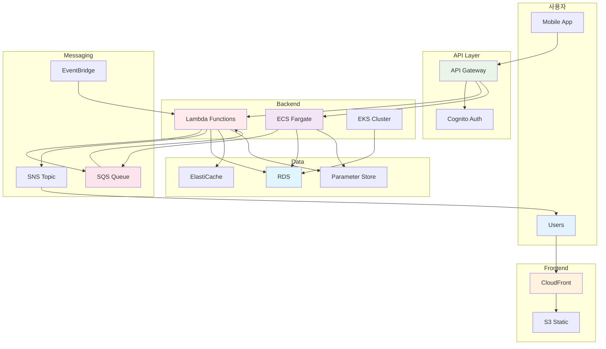

# November Week 2: AWS 실무 서비스 + Terraform 시작

<div align="center">

**📨 메시징** • **🔐 인증** • **🐳 컨테이너** • **📝 IaC 시작**

*실무 필수 AWS 서비스 + Terraform 기초 학습*

</div>

---

## 🎯 Week 2 목표

### 전체 학습 목표
- 실무 웹 프로젝트 필수 AWS 서비스 마스터
- 비동기 처리, 인증, 컨테이너 오케스트레이션 이해
- ECS/Fargate 컨테이너 배포 완전 습득
- Terraform 기초 개념 및 기본 문법 습득
- AWS 리소스를 코드로 관리하는 첫 경험

### 주간 성과물
- SQS + SNS 비동기 처리 시스템
- Cognito + API Gateway 인증 API
- ECS Fargate 프로덕션급 배포
- EventBridge 이벤트 기반 아키텍처
- Terraform으로 관리되는 AWS 리소스

---

## 📊 학습 구조

### 일일 시간표
```
09:00-09:40  Session 1: AWS 서비스 1 (40분)
09:40-10:20  Session 2: AWS 서비스 2 (40분)
10:20-11:00  Session 3: Terraform (40분)
11:00-12:00  Lab: 통합 실습 (60분)
```

### 학습 방식
- **Session 1-2**: AWS 실무 서비스 집중 학습
- **Session 3**: Terraform 점진적 학습
- **Lab**: AWS + Terraform 통합 실습

---

## 📅 주간 커리큘럼

### Day 1 (월): 메시징 & 큐 + Terraform 기초
**시간**: 09:00-12:00

**AWS 서비스**:
- Session 1: **SQS (Simple Queue Service)** (40분)
  - 메시지 큐 개념 및 비동기 처리
  - Standard vs FIFO Queue
  - Dead Letter Queue
  - 실무 사용 사례

- Session 2: **SNS (Simple Notification Service)** (40분)
  - Pub/Sub 패턴
  - 이메일, SMS, 모바일 푸시
  - SQS + SNS Fan-out 패턴
  - CloudWatch 알람 연동

**Terraform**:
- Session 3: **Terraform 소개 & 기초** (40분)
  - IaC가 필요한 이유
  - Terraform vs CloudFormation
  - HCL 기본 문법
  - Provider, Resource 개념

**실습**:
- Lab 1: SQS + SNS 비동기 처리 시스템 (60분)

**학습 포인트**:
- 비동기 작업 처리의 필요성
- 메시지 큐를 통한 시스템 분리
- IaC의 장점 이해

---

### Day 2 (화): API & 인증 + Terraform 명령어
**시간**: 09:00-12:00

**AWS 서비스**:
- Session 1: **API Gateway** (40분)
  - REST API vs HTTP API
  - Lambda 통합
  - 인증/인가 (API Key, JWT)
  - Rate Limiting & Throttling

- Session 2: **Cognito** (40분)
  - User Pool (회원가입/로그인)
  - Identity Pool (AWS 리소스 접근)
  - 소셜 로그인 통합
  - JWT 토큰 관리

**Terraform**:
- Session 3: **Terraform 기본 명령어** (40분)
  - terraform init, plan, apply, destroy
  - State 파일의 역할
  - 첫 리소스 생성 (S3 버킷)

**실습**:
- Lab 1: Cognito + API Gateway + Lambda (60분)

**학습 포인트**:
- API 관리 및 보안
- 사용자 인증/인가 구현
- Terraform 워크플로우 이해

---

### Day 3 (수): 컨테이너 서비스 기초 + Terraform 변수
**시간**: 09:00-12:00

**AWS 서비스**:
- Session 1: **ECR & ECS 기초** (40분)
  - ECR (Docker 이미지 저장소)
  - ECS 아키텍처 (Task, Service, Cluster)
  - EC2 vs Fargate 비교
  - Task Definition 작성

- Session 2: **Fargate 서버리스 컨테이너** (40분)
  - Fargate 개념 및 장점
  - 네트워킹 (awsvpc 모드)
  - 리소스 할당 (CPU/Memory)
  - 로그 관리 (CloudWatch Logs)

**Terraform**:
- Session 3: **Terraform Variable & Output** (40분)
  - Variable 선언 및 사용
  - Output으로 정보 추출
  - 환경별 설정 관리 (dev/prod)
  - tfvars 파일 활용

**실습**:
- Lab 1: 팀 백엔드를 ECS Fargate로 배포 (60분)
  - ECR에 이미지 푸시
  - Task Definition 작성
  - Fargate Service 생성
  - CloudWatch Logs 확인

**학습 포인트**:
- 컨테이너 오케스트레이션 기초
- 서버리스 컨테이너의 장점
- Terraform 변수 활용

---

### Day 4 (목): ECS 심화 & 프로덕션 배포 + Terraform 리소스
**시간**: 09:00-12:00

**AWS 서비스**:
- Session 1: **ECS + ALB 통합** (40분)
  - Application Load Balancer 설정
  - Target Group 구성
  - Health Check 설정
  - Blue/Green 배포 개념

- Session 2: **ECS Auto Scaling & 운영** (40분)
  - Service Auto Scaling
  - Target Tracking 정책
  - CloudWatch 메트릭 활용
  - 로그 분석 및 디버깅

**Terraform**:
- Session 3: **Terraform으로 AWS 리소스 관리** (40분)
  - VPC 리소스 코드화
  - Security Group 관리
  - 리소스 간 의존성
  - ECS 리소스 Terraform 코드

**실습**:
- Lab 1: 프로덕션급 ECS 배포 (60분)
  - ALB + ECS Service
  - Auto Scaling 설정
  - 모니터링 & 알람
  - Terraform으로 전체 관리

**학습 포인트**:
- 프로덕션 환경 구성
- 고가용성 및 확장성
- Terraform 리소스 관계

---

### Day 5 (금): 설정 관리 & 이벤트 기반 아키텍처 + Terraform 통합
**시간**: 09:00-12:00

**AWS 서비스**:
- Session 1: **Systems Manager (Parameter Store)** (40분)
  - 환경변수 중앙 관리
  - Secrets Manager vs Parameter Store
  - 애플리케이션 통합
  - ECS에서 Parameter Store 사용

- Session 2: **EventBridge (CloudWatch Events)** (40분)
  - 이벤트 기반 아키텍처
  - 스케줄링 (Cron Job)
  - AWS 서비스 간 이벤트 연결
  - ECS Task 이벤트 처리

**Terraform**:
- Session 3: **Terraform으로 Week 2 리소스 관리** (40분)
  - SQS, SNS Terraform 코드
  - API Gateway Terraform 코드
  - ECS 전체 스택 코드화
  - 전체 리소스 통합

**실습**:
- Lab 1: 전체 시스템 통합 배포 (60분)
  - Parameter Store + ECS
  - EventBridge 스케줄링
  - Terraform으로 전체 관리
  - Week 2 전체 복습

**학습 포인트**:
- 설정 중앙 관리
- 이벤트 기반 설계
- 전체 아키텍처 통합
- Terraform 실전 활용

---

## 🏗️ Week 2 최종 아키텍처



---

## 📊 Week 2 다루는 AWS 서비스

### 새로 배우는 서비스 (10개)
1. **SQS** - 메시지 큐 (비동기 처리)
2. **SNS** - 알림 서비스 (Pub/Sub)
3. **API Gateway** - API 관리 및 보안
4. **Cognito** - 사용자 인증/인가
5. **ECR** - 컨테이너 이미지 저장소
6. **ECS** - 컨테이너 오케스트레이션
7. **Fargate** - 서버리스 컨테이너
8. **Parameter Store** - 설정 중앙 관리
9. **EventBridge** - 이벤트 기반 아키텍처
10. **ALB Auto Scaling** - ECS 자동 확장

### Week 1 복습 서비스
- VPC, EC2, Lambda, RDS, ElastiCache, S3, CloudFront

---

## 💰 주간 예상 비용

### 일별 비용 (프리티어 활용)
| Day | 주요 리소스 | 예상 비용 |
|-----|------------|-----------|
| Day 1 | SQS + SNS | $0.05 |
| Day 2 | API Gateway + Cognito | $0.10 |
| Day 3 | ECS Fargate (기초) | $0.20 |
| Day 4 | ECS + ALB (프로덕션) | $0.30 |
| Day 5 | 전체 통합 | $0.35 |
| **합계** | | **$1.00** |

### 비용 절감 팁
- Fargate는 최소 스펙 사용 (0.25 vCPU, 0.5GB)
- 실습 완료 후 즉시 ECS Service 삭제
- SQS/SNS는 프리티어 충분
- Parameter Store는 무료
- 실습 완료 후 모든 리소스 삭제

---

## ✅ Week 2 완료 체크리스트

### AWS 서비스 이해도
- [ ] SQS로 비동기 작업 처리 구현
- [ ] SNS로 알림 시스템 구축
- [ ] API Gateway + Cognito 인증 API
- [ ] ECS Fargate 기본 배포
- [ ] ECS + ALB 프로덕션 배포
- [ ] ECS Auto Scaling 설정
- [ ] Parameter Store 설정 관리
- [ ] EventBridge 이벤트 기반 아키텍처

### Terraform 기초
- [ ] IaC 개념 이해
- [ ] HCL 기본 문법 습득
- [ ] terraform init, plan, apply 실행
- [ ] Variable & Output 사용
- [ ] AWS 리소스 코드화 경험

### 실습 완료
- [ ] 비동기 처리 시스템 구축
- [ ] 인증 API 구현
- [ ] ECS 컨테이너 배포 성공
- [ ] 프로덕션급 ECS 구성
- [ ] Terraform으로 리소스 관리

---

## 🔗 Week 3 준비

### Week 3 예고: Terraform 집중
- Terraform 프로그래밍 (for_each, count, condition)
- Module 작성 및 재사용
- 환경 분리 (dev/prod)
- Remote State & Backend
- Week 1-2 전체 인프라 코드화

### 사전 준비사항
- Terraform 설치 확인
- AWS CLI 설정 완료
- Week 2 AWS 서비스 복습

---

<div align="center">

**📨 실무 서비스** • **🐳 컨테이너** • **📝 IaC 시작** • **🔄 점진적 학습**

*Week 2: AWS 실무 역량 + Terraform 기초 완성*

</div>
