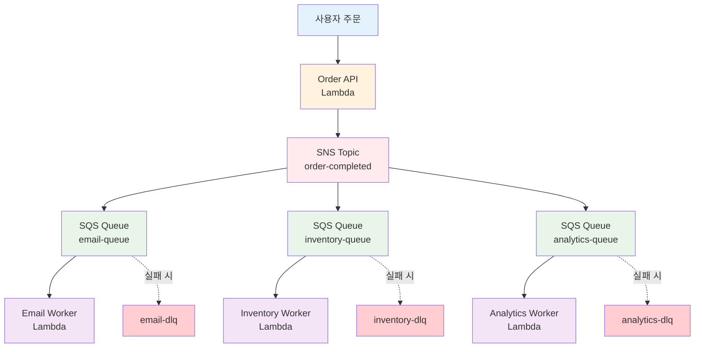

# November Week 2 Day 1 Lab 1: SQS + SNS 비동기 주문 처리 시스템

<div align="center">

**📨 SQS** • **📢 SNS** • **🔄 Fan-out** • **📝 Terraform (선택)**

*실무 시나리오: 이커머스 주문 완료 시 비동기 처리*

</div>

---

## 🕘 Lab 정보
**시간**: 11:00-12:00 (60분)
**목표**: SQS + SNS로 비동기 메시징 시스템 구축
**방식**: AWS Console + Lambda (+ Terraform 선택)

## 🎯 Lab 목표

### 📚 학습 목표
- SQS Queue 생성 및 메시지 전송/수신
- SNS Topic 생성 및 구독 설정
- SNS + SQS Fan-out 패턴 구현
- (선택) Terraform으로 인프라 코드화

### 🛠️ 구현 목표
- 주문 완료 시 여러 작업을 병렬 처리
- 메시지 큐를 통한 시스템 분리
- Dead Letter Queue로 장애 처리

---

## 🏗️ 구축할 아키텍처

### 📐 전체 시스템 구조



### 🔗 참조 Session
- [Session 1: SQS](./session_1.md) - Queue 생성 및 DLQ 설정
- [Session 2: SNS](./session_2.md) - Topic 생성 및 Fan-out 패턴
- [Session 3: Terraform](./session_3.md) - IaC 기초 (선택적 적용)

---

## 🛠️ Phase 1: SQS 기본 구성 (20분)

### 목표
- SQS Queue 생성
- Dead Letter Queue 설정
- Lambda로 메시지 전송/수신

### Step 1-1: Dead Letter Queue 생성 (5분)

**AWS Console 경로**:
```
AWS Console → SQS → Create queue
```

**설정**:
| 항목 | 값 |
|------|-----|
| Type | Standard |
| Name | `email-dlq` |
| Configuration | 기본값 유지 |

**반복**: `inventory-dlq`, `analytics-dlq` 동일하게 생성

### Step 1-2: Main Queue 생성 (10분)

**AWS Console 경로**:
```
AWS Console → SQS → Create queue
```

**email-queue 설정**:
| 항목 | 값 |
|------|-----|
| Type | Standard |
| Name | `email-queue` |
| Visibility timeout | 30 seconds |
| Message retention period | 4 days |
| Dead-letter queue | Enabled |
| - Choose queue | `email-dlq` |
| - Maximum receives | 3 |

**반복**: `inventory-queue`, `analytics-queue` 동일하게 생성

### Step 1-3: Lambda Producer 생성 (5분)

**AWS Console 경로**:
```
AWS Console → Lambda → Create function
```

**설정**:
| 항목 | 값 |
|------|-----|
| Function name | `order-producer` |
| Runtime | Python 3.12 |
| Architecture | x86_64 |

**코드**:
```python
import json
import boto3
import os

sqs = boto3.client('sqs')

def lambda_handler(event, context):
    # 주문 정보
    order = {
        'order_id': '12345',
        'customer_email': 'customer@example.com',
        'items': [
            {'product': 'Laptop', 'quantity': 1, 'price': 1200000}
        ],
        'total_amount': 1200000
    }
    
    # SQS에 메시지 전송
    queue_url = 'https://sqs.ap-northeast-2.amazonaws.com/YOUR_ACCOUNT_ID/email-queue'
    
    response = sqs.send_message(
        QueueUrl=queue_url,
        MessageBody=json.dumps(order)
    )
    
    return {
        'statusCode': 200,
        'body': json.dumps({
            'message': 'Order sent to queue',
            'messageId': response['MessageId']
        })
    }
```

**IAM 권한 추가**:
```
Configuration → Permissions → Execution role → Add permissions
Policy: AmazonSQSFullAccess
```

### Step 1-4: 테스트 (5분)

**Lambda 테스트**:
```
Test → Create test event → Test
```

**SQS 확인**:
```
SQS → email-queue → Send and receive messages → Poll for messages
```

**✅ 체크포인트**:
- [ ] 3개의 Main Queue 생성 완료
- [ ] 3개의 DLQ 생성 완료
- [ ] Lambda Producer 생성 및 테스트 성공
- [ ] SQS에서 메시지 확인

---

## 🛠️ Phase 2: SNS Fan-out 패턴 (25분)

### 목표
- SNS Topic 생성
- SQS Queue를 SNS에 구독
- 하나의 메시지가 모든 Queue로 전달

### Step 2-1: SNS Topic 생성 (5분)

**AWS Console 경로**:
```
AWS Console → SNS → Topics → Create topic
```

**설정**:
| 항목 | 값 |
|------|-----|
| Type | Standard |
| Name | `order-completed` |
| Display name | Order Completed |

### Step 2-2: SQS 구독 설정 (10분)

**AWS Console 경로**:
```
SNS → Topics → order-completed → Create subscription
```

**email-queue 구독**:
| 항목 | 값 |
|------|-----|
| Protocol | Amazon SQS |
| Endpoint | `email-queue` ARN 선택 |
| Enable raw message delivery | 체크 |

**반복**: `inventory-queue`, `analytics-queue` 동일하게 구독

### Step 2-3: SQS Access Policy 설정 (5분)

**각 Queue에 SNS 전송 권한 부여**:

```
SQS → email-queue → Access policy → Edit
```

**Policy 추가**:
```json
{
  "Version": "2012-10-17",
  "Statement": [
    {
      "Effect": "Allow",
      "Principal": {
        "Service": "sns.amazonaws.com"
      },
      "Action": "sqs:SendMessage",
      "Resource": "arn:aws:sqs:ap-northeast-2:YOUR_ACCOUNT_ID:email-queue",
      "Condition": {
        "ArnEquals": {
          "aws:SourceArn": "arn:aws:sns:ap-northeast-2:YOUR_ACCOUNT_ID:order-completed"
        }
      }
    }
  ]
}
```

**반복**: `inventory-queue`, `analytics-queue` 동일하게 설정

### Step 2-4: Lambda Producer 수정 (5분)

**SNS로 메시지 발행하도록 변경**:

```python
import json
import boto3

sns = boto3.client('sns')

def lambda_handler(event, context):
    # 주문 정보
    order = {
        'order_id': '12345',
        'customer_email': 'customer@example.com',
        'items': [
            {'product': 'Laptop', 'quantity': 1, 'price': 1200000}
        ],
        'total_amount': 1200000
    }
    
    # SNS에 메시지 발행
    topic_arn = 'arn:aws:sns:ap-northeast-2:YOUR_ACCOUNT_ID:order-completed'
    
    response = sns.publish(
        TopicArn=topic_arn,
        Message=json.dumps(order),
        Subject='Order Completed'
    )
    
    return {
        'statusCode': 200,
        'body': json.dumps({
            'message': 'Order published to SNS',
            'messageId': response['MessageId']
        })
    }
```

**IAM 권한 추가**:
```
Policy: AmazonSNSFullAccess
```

### Step 2-5: Fan-out 테스트 (5분)

**Lambda 실행**:
```
Test → Test
```

**모든 Queue 확인**:
```
SQS → email-queue → Poll for messages (메시지 확인)
SQS → inventory-queue → Poll for messages (메시지 확인)
SQS → analytics-queue → Poll for messages (메시지 확인)
```

**✅ 체크포인트**:
- [ ] SNS Topic 생성 완료
- [ ] 3개 Queue 구독 완료
- [ ] SQS Access Policy 설정 완료
- [ ] Lambda Producer SNS 연동 완료
- [ ] 모든 Queue에 메시지 전달 확인

---

## 🛠️ Phase 3: Lambda Consumer 구현 (10분)

### 목표
- Queue에서 메시지를 읽어 처리하는 Worker 구현

### Step 3-1: Email Worker Lambda 생성

**AWS Console 경로**:
```
AWS Console → Lambda → Create function
```

**설정**:
| 항목 | 값 |
|------|-----|
| Function name | `email-worker` |
| Runtime | Python 3.12 |

**코드**:
```python
import json

def lambda_handler(event, context):
    for record in event['Records']:
        # SQS 메시지 파싱
        body = json.loads(record['body'])
        
        print(f"📧 이메일 발송 처리")
        print(f"주문 ID: {body['order_id']}")
        print(f"고객 이메일: {body['customer_email']}")
        print(f"총 금액: {body['total_amount']}원")
        
        # 실제로는 여기서 이메일 발송 로직
        # send_email(body['customer_email'], body)
    
    return {
        'statusCode': 200,
        'body': json.dumps('Email processed')
    }
```

**Trigger 추가**:
```
Add trigger → SQS → email-queue 선택
Batch size: 10
```

### Step 3-2: Inventory Worker Lambda 생성

**동일한 방식으로 생성**:

**코드**:
```python
import json

def lambda_handler(event, context):
    for record in event['Records']:
        body = json.loads(record['body'])
        
        print(f"📦 재고 업데이트 처리")
        print(f"주문 ID: {body['order_id']}")
        
        for item in body['items']:
            print(f"상품: {item['product']}, 수량: {item['quantity']}")
            # 실제로는 재고 차감 로직
            # update_inventory(item['product'], -item['quantity'])
    
    return {
        'statusCode': 200,
        'body': json.dumps('Inventory updated')
    }
```

**Trigger**: `inventory-queue`

### Step 3-3: Analytics Worker Lambda 생성

**코드**:
```python
import json

def lambda_handler(event, context):
    for record in event['Records']:
        body = json.loads(record['body'])
        
        print(f"📊 분석 데이터 수집")
        print(f"주문 ID: {body['order_id']}")
        print(f"총 금액: {body['total_amount']}원")
        
        # 실제로는 분석 데이터 저장
        # save_to_analytics_db(body)
    
    return {
        'statusCode': 200,
        'body': json.dumps('Analytics recorded')
    }
```

**Trigger**: `analytics-queue`

### Step 3-4: 전체 시스템 테스트

**Producer Lambda 실행**:
```
order-producer → Test
```

**각 Worker Lambda 로그 확인**:
```
CloudWatch Logs → Log groups → /aws/lambda/email-worker
CloudWatch Logs → Log groups → /aws/lambda/inventory-worker
CloudWatch Logs → Log groups → /aws/lambda/analytics-worker
```

**✅ 체크포인트**:
- [ ] 3개 Worker Lambda 생성 완료
- [ ] SQS Trigger 설정 완료
- [ ] Producer 실행 시 모든 Worker 자동 실행
- [ ] CloudWatch Logs에서 처리 로그 확인

---

## 🛠️ Phase 4: Terraform으로 재구성 (선택, 15분)

### 목표
- 수동으로 만든 인프라를 Terraform 코드로 작성
- IaC의 장점 체험

### 사전 준비
👉 **[Terraform 설치 및 AWS 설정 가이드](../TERRAFORM_SETUP.md)** 완료 필수

### Step 4-1: Terraform 프로젝트 생성

```bash
mkdir terraform-sqs-sns
cd terraform-sqs-sns
```

### Step 4-2: Provider 설정

**provider.tf**:
```hcl
terraform {
  required_providers {
    aws = {
      source  = "hashicorp/aws"
      version = "~> 5.0"
    }
  }
}

provider "aws" {
  region = "ap-northeast-2"
}
```

### Step 4-3: SQS Queue 정의

**sqs.tf**:
```hcl
# Dead Letter Queue
resource "aws_sqs_queue" "email_dlq" {
  name = "email-dlq-tf"
}

# Main Queue
resource "aws_sqs_queue" "email_queue" {
  name                       = "email-queue-tf"
  visibility_timeout_seconds = 30
  message_retention_seconds  = 345600  # 4 days
  
  redrive_policy = jsonencode({
    deadLetterTargetArn = aws_sqs_queue.email_dlq.arn
    maxReceiveCount     = 3
  })
  
  tags = {
    ManagedBy = "Terraform"
    Purpose   = "Email processing"
  }
}

# Inventory Queue
resource "aws_sqs_queue" "inventory_dlq" {
  name = "inventory-dlq-tf"
}

resource "aws_sqs_queue" "inventory_queue" {
  name                       = "inventory-queue-tf"
  visibility_timeout_seconds = 30
  
  redrive_policy = jsonencode({
    deadLetterTargetArn = aws_sqs_queue.inventory_dlq.arn
    maxReceiveCount     = 3
  })
  
  tags = {
    ManagedBy = "Terraform"
    Purpose   = "Inventory processing"
  }
}

# Analytics Queue
resource "aws_sqs_queue" "analytics_dlq" {
  name = "analytics-dlq-tf"
}

resource "aws_sqs_queue" "analytics_queue" {
  name                       = "analytics-queue-tf"
  visibility_timeout_seconds = 30
  
  redrive_policy = jsonencode({
    deadLetterTargetArn = aws_sqs_queue.analytics_dlq.arn
    maxReceiveCount     = 3
  })
  
  tags = {
    ManagedBy = "Terraform"
    Purpose   = "Analytics processing"
  }
}
```

### Step 4-4: SNS Topic 정의

**sns.tf**:
```hcl
resource "aws_sns_topic" "order_completed" {
  name         = "order-completed-tf"
  display_name = "Order Completed (Terraform)"
  
  tags = {
    ManagedBy = "Terraform"
  }
}

# SNS → SQS 구독
resource "aws_sns_topic_subscription" "email_subscription" {
  topic_arn            = aws_sns_topic.order_completed.arn
  protocol             = "sqs"
  endpoint             = aws_sqs_queue.email_queue.arn
  raw_message_delivery = true
}

resource "aws_sns_topic_subscription" "inventory_subscription" {
  topic_arn            = aws_sns_topic.order_completed.arn
  protocol             = "sqs"
  endpoint             = aws_sqs_queue.inventory_queue.arn
  raw_message_delivery = true
}

resource "aws_sns_topic_subscription" "analytics_subscription" {
  topic_arn            = aws_sns_topic.order_completed.arn
  protocol             = "sqs"
  endpoint             = aws_sqs_queue.analytics_queue.arn
  raw_message_delivery = true
}

# SQS Access Policy (SNS가 메시지 전송 가능하도록)
resource "aws_sqs_queue_policy" "email_queue_policy" {
  queue_url = aws_sqs_queue.email_queue.id
  
  policy = jsonencode({
    Version = "2012-10-17"
    Statement = [{
      Effect = "Allow"
      Principal = {
        Service = "sns.amazonaws.com"
      }
      Action   = "sqs:SendMessage"
      Resource = aws_sqs_queue.email_queue.arn
      Condition = {
        ArnEquals = {
          "aws:SourceArn" = aws_sns_topic.order_completed.arn
        }
      }
    }]
  })
}

resource "aws_sqs_queue_policy" "inventory_queue_policy" {
  queue_url = aws_sqs_queue.inventory_queue.id
  
  policy = jsonencode({
    Version = "2012-10-17"
    Statement = [{
      Effect = "Allow"
      Principal = {
        Service = "sns.amazonaws.com"
      }
      Action   = "sqs:SendMessage"
      Resource = aws_sqs_queue.inventory_queue.arn
      Condition = {
        ArnEquals = {
          "aws:SourceArn" = aws_sns_topic.order_completed.arn
        }
      }
    }]
  })
}

resource "aws_sqs_queue_policy" "analytics_queue_policy" {
  queue_url = aws_sqs_queue.analytics_queue.id
  
  policy = jsonencode({
    Version = "2012-10-17"
    Statement = [{
      Effect = "Allow"
      Principal = {
        Service = "sns.amazonaws.com"
      }
      Action   = "sqs:SendMessage"
      Resource = aws_sqs_queue.analytics_queue.arn
      Condition = {
        ArnEquals = {
          "aws:SourceArn" = aws_sns_topic.order_completed.arn
        }
      }
    }]
  })
}
```

### Step 4-5: Output 정의

**outputs.tf**:
```hcl
output "sns_topic_arn" {
  description = "SNS Topic ARN"
  value       = aws_sns_topic.order_completed.arn
}

output "email_queue_url" {
  description = "Email Queue URL"
  value       = aws_sqs_queue.email_queue.url
}

output "inventory_queue_url" {
  description = "Inventory Queue URL"
  value       = aws_sqs_queue.inventory_queue.url
}

output "analytics_queue_url" {
  description = "Analytics Queue URL"
  value       = aws_sqs_queue.analytics_queue.url
}
```

### Step 4-6: Terraform 실행

```bash
# 1. 초기화
terraform init

# 2. 실행 계획 확인
terraform plan

# 3. 적용
terraform apply
# "yes" 입력

# 4. 출력 확인
terraform output
```

### Step 4-7: 비교 및 정리

**수동 vs Terraform 비교**:
| 항목 | 수동 (Console) | Terraform |
|------|----------------|-----------|
| 소요 시간 | 30분 | 5분 (코드 작성 후) |
| 재현성 | 어려움 | 쉬움 (코드 재실행) |
| 버전 관리 | 불가능 | Git으로 가능 |
| 협업 | 어려움 | 코드 리뷰 가능 |
| 문서화 | 별도 필요 | 코드가 문서 |

**정리**:
```bash
# Terraform 리소스 삭제
terraform destroy
# "yes" 입력

# 수동 생성 리소스는 AWS Console에서 삭제
```

**✅ 체크포인트**:
- [ ] Terraform 코드 작성 완료
- [ ] terraform init 성공
- [ ] terraform apply 성공
- [ ] AWS Console에서 리소스 생성 확인
- [ ] 수동 vs Terraform 차이 체감
- [ ] terraform destroy로 정리 완료

---

## 🧹 Lab 정리

### 리소스 삭제 순서

**1. Lambda Functions 삭제**:
```
Lambda → Functions → 선택 → Actions → Delete
- order-producer
- email-worker
- inventory-worker
- analytics-worker
```

**2. SNS Subscriptions 삭제**:
```
SNS → Subscriptions → 선택 → Delete
```

**3. SNS Topic 삭제**:
```
SNS → Topics → order-completed → Delete
```

**4. SQS Queues 삭제**:
```
SQS → Queues → 선택 → Delete
- email-queue, email-dlq
- inventory-queue, inventory-dlq
- analytics-queue, analytics-dlq
```

**5. CloudWatch Logs 삭제** (선택):
```
CloudWatch → Log groups → 선택 → Delete
```

---

## 💡 Lab 회고

### 🤝 페어 회고 (5분)

1. **가장 인상 깊었던 부분**:
   - SQS vs SNS 차이를 체감했나요?
   - Fan-out 패턴의 장점을 느꼈나요?

2. **어려웠던 점**:
   - SQS Access Policy 설정이 어려웠나요?
   - Lambda Trigger 설정은 어땠나요?

3. **실무 적용 아이디어**:
   - 여러분의 프로젝트에 어떻게 적용할 수 있을까요?
   - 어떤 작업을 비동기로 처리하면 좋을까요?

### 📊 학습 성과

**기술적 성취**:
- [ ] SQS Queue 생성 및 메시지 처리
- [ ] SNS Topic 생성 및 구독 설정
- [ ] Fan-out 패턴 구현
- [ ] Lambda 통합
- [ ] (선택) Terraform 코드 작성

**실무 역량**:
- 비동기 메시징 시스템 설계
- AWS 서비스 통합 능력
- 장애 처리 (DLQ) 구현
- IaC 기초 경험

---

## 🔗 다음 단계

### Day 2 예고
**API Gateway + Cognito 인증 시스템**
- REST API 생성
- 사용자 인증/인가
- Lambda 통합
- Terraform 명령어 심화

### 복습 자료
- [Session 1: SQS](./session_1.md)
- [Session 2: SNS](./session_2.md)
- [Session 3: Terraform](./session_3.md)
- [Terraform 설정 가이드](../TERRAFORM_SETUP.md)

---

<div align="center">

**📨 SQS 마스터** • **📢 SNS 활용** • **🔄 Fan-out 구현** • **📝 IaC 경험**

*Lab 1 완료 - 비동기 메시징 시스템 구축 성공!*

</div>
