```mermaid
graph TB
    Q[email-queue<br/>메인 우체통] --> T1[1번 시도]
    T1 -->|실패| T2[2번 시도]
    T2 -->|실패| T3[3번 시도]
    T3 -->|실패| DLQ[email-dlq<br/>실패 보관함]
    T1 -->|성공| OK[처리 완료!]
    T2 -->|성공| OK
    T3 -->|성공| OK
    
    style Q fill:#e8f5e8
    style DLQ fill:#ffebee
    style OK fill:#e3f2fd
```

```mermaid
graph TB
    subgraph "방법 1: 따로따로 (힘들어요)"
        A1[주문] --> B1[email-queue에<br/>편지 쓰기]
        A1 --> B2[inventory-queue에<br/>편지 쓰기]
        A1 --> B3[analytics-queue에<br/>편지 쓰기]
    end
    
    subgraph "방법 2: 방송국 (쉬워요)"
        C1[주문] --> D[SNS 방송국<br/>한 번만 방송]
        D --> E1[email-queue<br/>자동으로 받기]
        D --> E2[inventory-queue<br/>자동으로 받기]
        D --> E3[analytics-queue<br/>자동으로 받기]
    end
    
    style B1 fill:#ffebee
    style B2 fill:#ffebee
    style B3 fill:#ffebee
    style D fill:#e8f5e8
    style E1 fill:#e3f2fd
    style E2 fill:#e3f2fd
    style E3 fill:#e3f2fd
```

# November Week 2 Day 1 Lab 1: SQS + SNS 비동기 주문 처리 시스템

<div align="center">

**📨 SQS** • **📢 SNS** • **🔄 Fan-out** • **📝 Terraform (선택)**

*실무 시나리오: 이커머스 주문 완료 시 비동기 처리*

</div>

---

## 🕘 Lab 정보
**시간**: 11:00-12:00 (60분)
**목표**: SQS + SNS로 비동기 메시징 시스템 구축
**방식**: AWS Console + Lambda (+ Terraform 선택)

## 🎯 Lab 목표

### 📚 학습 목표
- SQS Queue 생성 및 메시지 전송/수신
- SNS Topic 생성 및 구독 설정
- SNS + SQS Fan-out 패턴 구현
- (선택) Terraform으로 인프라 코드화

### 🛠️ 구현 목표
- 주문 완료 시 여러 작업을 병렬 처리
- 메시지 큐를 통한 시스템 분리
- Dead Letter Queue로 장애 처리

---

## 🏗️ 구축할 아키텍처

### 📐 전체 시스템 구조


### 🔗 참조 Session
- [Session 1: SQS](./session_1.md) - Queue 생성 및 DLQ 설정
- [Session 2: SNS](./session_2.md) - Topic 생성 및 Fan-out 패턴
- [Session 3: Terraform](./session_3.md) - IaC 기초 (선택적 적용)

---

## 🛠️ Phase 1: SQS 기본 구성 (20분)

### 🎯 이번 단계에서 할 일
우체통을 3개 만들 거예요! 각 우체통마다 "실패한 편지 보관함"도 만들어요.

**만들 것**:
- 📨 **이메일 우체통** (email-queue) + 실패 보관함 (email-dlq)
- 📦 **재고 우체통** (inventory-queue) + 실패 보관함 (inventory-dlq)
- 📊 **분석 우체통** (analytics-queue) + 실패 보관함 (analytics-dlq)

### 🤔 왜 "실패 보관함"이 필요한가요?

**실생활 비유: 우편 배달**
```
편지를 3번 배달 시도했는데 집에 아무도 없어요
→ 그냥 버리면 안 되죠!
→ "배달 실패 편지 보관함"에 따로 보관해요
→ 나중에 다시 확인할 수 있어요
```

**SQS도 똑같아요**:
```
메시지를 3번 처리 시도했는데 계속 실패해요
→ 그냥 버리면 안 되죠!
→ "Dead Letter Queue"에 따로 보관해요
→ 나중에 왜 실패했는지 확인할 수 있어요
```

---

### Step 1-1: 실패 보관함 만들기 (5분)

**🏠 비유**: 배달 실패 편지를 보관할 상자 3개 만들기

**AWS Console 경로**:
```
AWS Console → SQS → Create queue
```

**설정**:
| 항목 | 값 | 설명 |
|------|-----|------|
| Type | Standard | 빠른 우체통 (순서 상관없음) |
| Name | `email-dlq` | 이메일 실패 보관함 |
| Configuration | 기본값 유지 | 나머지는 그대로 |

**💡 쉽게 이해하기**:
- **Standard**: 빠르게 처리하는 우체통 (편지 순서는 섞일 수 있어요)
- **Name**: 나중에 찾기 쉽게 이름 붙이기
- **dlq**: "Dead Letter Queue"의 줄임말 (실패 보관함)

**반복**: 똑같은 방법으로 2개 더 만들기
- `inventory-dlq` (재고 실패 보관함)
- `analytics-dlq` (분석 실패 보관함)

### Step 1-2: 메인 우체통 만들기 (10분)

**🏠 비유**: 실제로 편지를 받을 우체통 3개 만들기 (실패 보관함과 연결)

**AWS Console 경로**:
```
AWS Console → SQS → Create queue
```

**email-queue 설정**:
| 항목 | 값 | 설명 |
|------|-----|------|
| Type | Standard | 빠른 우체통 |
| Name | `email-queue` | 이메일 우체통 |
| Visibility timeout | 30 seconds | 편지 읽는 시간 (30초) |
| Message retention period | 4 days | 편지 보관 기간 (4일) |
| Dead-letter queue | Enabled | 실패 보관함 사용하기 |
| - Choose queue | `email-dlq` | 위에서 만든 실패 보관함 선택 |
| - Maximum receives | 3 | 3번 실패하면 보관함으로 |

**💡 쉽게 이해하기**:

**Visibility timeout (30초)**:
```
편지를 꺼내서 읽는 동안 다른 사람이 못 보게 숨기는 시간
- 30초 동안 편지 읽기
- 30초 안에 처리 못 하면 다시 우체통에 넣기
- 다른 사람이 다시 시도할 수 있어요
```

**Message retention (4일)**:
```
우체통에 편지를 얼마나 보관할까요?
- 4일 동안 보관해요
- 4일이 지나면 자동으로 버려요
- 너무 오래된 편지는 의미 없으니까요
```

**Maximum receives (3번)**:
```
편지 배달을 몇 번까지 시도할까요?
- 1번 시도: 실패 (집에 아무도 없음)
- 2번 시도: 실패 (또 없음)
- 3번 시도: 실패 (또또 없음)
→ 3번 실패하면 "실패 보관함"으로 이동!
```

**그림으로 보기**:


**반복**: 똑같은 방법으로 2개 더 만들기
- `inventory-queue` → `inventory-dlq` 연결
- `analytics-queue` → `analytics-dlq` 연결

### Step 1-3: 편지 보내는 사람 만들기 (5분)

**🏠 비유**: 우체통에 편지를 넣는 사람 (Lambda 함수)

**AWS Console 경로**:
```
AWS Console → Lambda → Create function
```

**설정**:
| 항목 | 값 | 설명 |
|------|-----|------|
| Function name | `order-producer` | 주문 편지 보내는 사람 |
| Runtime | Python 3.12 | Python으로 만들기 |
| Architecture | x86_64 | 컴퓨터 종류 |

**💡 쉽게 이해하기**:
- **Lambda**: 코드를 실행해주는 로봇
- **Producer**: 편지를 "만들어서 보내는" 사람
- **Python**: 로봇이 이해하는 언어

**코드 (편지 내용 만들기)**:
```python
import json
import boto3
import os

sqs = boto3.client('sqs')  # SQS 우체통 사용 준비

def lambda_handler(event, context):
    # 주문 정보 (편지 내용)
    order = {
        'order_id': '12345',                      # 주문 번호
        'customer_email': 'customer@example.com', # 고객 이메일
        'items': [
            {'product': 'Laptop', 'quantity': 1, 'price': 1200000}
        ],
        'total_amount': 1200000                   # 총 금액
    }
    
    # SQS 우체통에 편지 넣기
    queue_url = 'https://sqs.ap-northeast-2.amazonaws.com/YOUR_ACCOUNT_ID/email-queue'
    
    response = sqs.send_message(
        QueueUrl=queue_url,      # 어느 우체통에?
        MessageBody=json.dumps(order)  # 편지 내용
    )
    
    return {
        'statusCode': 200,
        'body': json.dumps({
            'message': 'Order sent to queue',
            'messageId': response['MessageId']
        })
    }
```

**코드 설명 (한 줄씩)**:
```python
# 1. 필요한 도구 가져오기
import json      # 편지를 예쁘게 포장하는 도구
import boto3     # AWS와 대화하는 도구
import os        # 컴퓨터 환경 정보 보는 도구

# 2. SQS 우체통 사용 준비
sqs = boto3.client('sqs')  # "나 SQS 쓸 거야!" 선언

# 3. 편지 내용 만들기
order = {
    'order_id': '12345',  # 주문 번호 (영수증 번호 같은 거)
    'customer_email': 'customer@example.com',  # 누구한테?
    'items': [...],  # 뭘 샀는지
    'total_amount': 1200000  # 얼마인지
}

# 4. 우체통에 편지 넣기
response = sqs.send_message(
    QueueUrl=queue_url,  # 어느 우체통?
    MessageBody=json.dumps(order)  # 편지 내용 (포장해서)
)
```

**⚠️ 중요**: `YOUR_ACCOUNT_ID`를 여러분의 AWS 계정 번호로 바꾸세요!
```
예시: https://sqs.ap-northeast-2.amazonaws.com/123456789012/email-queue
```

**IAM 권한 추가 (편지 넣을 권한 주기)**:
```
Configuration → Permissions → Execution role → Add permissions
Policy: AmazonSQSFullAccess
```

**💡 쉽게 이해하기**:
```
Lambda가 우체통에 편지를 넣으려면 "권한"이 필요해요
- 마치 우체통 열쇠 같은 거예요
- "AmazonSQSFullAccess" = "SQS 우체통 마음대로 쓸 수 있는 권한"
```

### Step 1-4: 테스트 (잘 작동하는지 확인하기) (5분)

**🏠 비유**: 편지를 실제로 보내보고, 우체통에 들어갔는지 확인하기

**1. Lambda 테스트 (편지 보내기)**:
```
Lambda → order-producer → Test → Create test event → Test 버튼 클릭
```

**💡 무슨 일이 일어나나요?**:
```
1. Lambda 로봇이 깨어나요
2. 주문 정보를 편지로 만들어요
3. email-queue 우체통에 편지를 넣어요
4. "편지 넣었어요!" 메시지를 보여줘요
```

**2. SQS 확인 (우체통에 편지 있는지 보기)**:
```
SQS → email-queue → Send and receive messages → Poll for messages 버튼 클릭
```

**💡 무슨 일이 일어나나요?**:
```
1. 우체통을 열어봐요
2. 편지가 있으면 보여줘요
3. 편지 내용을 읽을 수 있어요
```

**예상 결과**:
```json
{
  "order_id": "12345",
  "customer_email": "customer@example.com",
  "items": [
    {"product": "Laptop", "quantity": 1, "price": 1200000}
  ],
  "total_amount": 1200000
}
```

**그림으로 보기**:


```mermaid
graph LR
    L[Lambda<br/>편지 보내는 사람] -->|편지 넣기| Q[email-queue<br/>우체통]
    Q -->|확인하기| U[우리<br/>편지 읽기]
    
    style L fill:#fff3e0
    style Q fill:#e8f5e8
    style U fill:#e3f2fd
```

**✅ 체크포인트** (다 했는지 확인하기):
- [ ] 3개의 메인 우체통 만들기 완료 (email, inventory, analytics)
- [ ] 3개의 실패 보관함 만들기 완료 (각각 -dlq)
- [ ] Lambda Producer 만들기 완료 (order-producer)
- [ ] Lambda 테스트 성공 (편지 보내기 성공)
- [ ] SQS에서 편지 확인 (우체통에 편지 있음)

**🎉 Phase 1 완료!**
이제 우체통 시스템이 완성되었어요. 다음 단계에서는 "방송국"을 만들어서 한 번에 여러 우체통에 편지를 보낼 거예요!

---

## 🛠️ Phase 2: SNS Fan-out 패턴 (25분)

### 🎯 이번 단계에서 할 일
방송국을 만들어서 한 번에 3개 우체통에 편지를 보낼 거예요!

**만들 것**:
- 📢 **방송국** (SNS Topic) - 한 번 방송하면
- 📨 **3개 우체통이 듣기** (SQS 구독) - 모두 받아요

### 🤔 왜 "방송국"이 필요한가요?

**방법 1: 우체통마다 따로 편지 쓰기** (힘들어요):
```
주문이 들어왔어요!
→ email-queue에 편지 쓰기 (1분)
→ inventory-queue에 편지 쓰기 (1분)
→ analytics-queue에 편지 쓰기 (1분)
총 3분 😱
```

**방법 2: 방송국 사용하기** (쉬워요):
```
주문이 들어왔어요!
→ 방송국에서 한 번만 방송하기 (10초)
→ 3개 우체통이 자동으로 받기
총 10초 ✅
```

**그림으로 보기**:


---

### Step 2-1: 방송국 만들기 (5분)

**🏠 비유**: 학교 방송실 만들기

**AWS Console 경로**:
```
AWS Console → SNS → Topics → Create topic
```

**설정**:
| 항목 | 값 | 설명 |
|------|-----|------|
| Type | Standard | 빠른 방송 (순서 상관없음) |
| Name | `order-completed` | 주문 완료 방송국 |
| Display name | Order Completed | 화면에 보이는 이름 |

**💡 쉽게 이해하기**:
- **Topic**: 방송 주제 (무슨 방송인지)
- **Standard**: 빠르게 방송하기 (순서는 섞일 수 있어요)
- **order-completed**: "주문이 완료되었어요!" 방송

### Step 2-2: 우체통이 방송 듣게 하기 (10분)

**🏠 비유**: 각 교실에 스피커 설치하기 (방송 들을 수 있게)

**AWS Console 경로**:
```
SNS → Topics → order-completed → Create subscription
```

**email-queue 구독 설정**:
| 항목 | 값 | 설명 |
|------|-----|------|
| Protocol | Amazon SQS | SQS 우체통 선택 |
| Endpoint | `email-queue` ARN 선택 | 어느 우체통? |
| Enable raw message delivery | 체크 | 편지 그대로 받기 |

**💡 쉽게 이해하기**:

**Protocol (Amazon SQS)**:
```
방송을 어떻게 받을까요?
- 이메일로? (Email)
- 문자로? (SMS)
- 우체통으로? (SQS) ✅
→ 우리는 우체통으로 받을 거예요!
```

**Endpoint (email-queue)**:
```
어느 우체통이 받을까요?
- email-queue ✅
- inventory-queue
- analytics-queue
→ 지금은 email-queue만 선택해요
```

**Enable raw message delivery (체크)**:
```
편지를 어떻게 받을까요?
- 포장지에 싸서? (체크 안 함)
- 그대로? (체크) ✅
→ 편지 내용만 받으면 되니까 체크해요!
```

**그림으로 보기**:


```mermaid
graph TB
    SNS[SNS 방송국<br/>order-completed] -->|구독| Q1[email-queue<br/>스피커 설치]
    SNS -.->|아직 안 함| Q2[inventory-queue<br/>스피커 없음]
    SNS -.->|아직 안 함| Q3[analytics-queue<br/>스피커 없음]
    
    style SNS fill:#fff3e0
    style Q1 fill:#e8f5e8
    style Q2 fill:#f5f5f5
    style Q3 fill:#f5f5f5
```

**반복**: 똑같은 방법으로 2개 더 구독하기
- `inventory-queue` 구독
- `analytics-queue` 구독

**완성된 모습**:

```mermaid
graph TB
    SNS[SNS 방송국<br/>order-completed] -->|구독| Q1[email-queue<br/>✅ 스피커]
    SNS -->|구독| Q2[inventory-queue<br/>✅ 스피커]
    SNS -->|구독| Q3[analytics-queue<br/>✅ 스피커]
    
    style SNS fill:#fff3e0
    style Q1 fill:#e8f5e8
    style Q2 fill:#e8f5e8
    style Q3 fill:#e8f5e8
```


### Step 2-3: SQS Access Policy 설정 (5분)

**각 Queue에 SNS 전송 권한 부여**:

```
SQS → email-queue → Access policy → Edit
```

**Policy 추가**:
```json
{
  "Version": "2012-10-17",
  "Statement": [
    {
      "Effect": "Allow",
      "Principal": {
        "Service": "sns.amazonaws.com"
      },
      "Action": "sqs:SendMessage",
      "Resource": "arn:aws:sqs:ap-northeast-2:YOUR_ACCOUNT_ID:email-queue",
      "Condition": {
        "ArnEquals": {
          "aws:SourceArn": "arn:aws:sns:ap-northeast-2:YOUR_ACCOUNT_ID:order-completed"
        }
      }
    }
  ]
}
```

**반복**: `inventory-queue`, `analytics-queue` 동일하게 설정

### Step 2-4: Lambda Producer 수정 (5분)

**SNS로 메시지 발행하도록 변경**:

```python
import json
import boto3

sns = boto3.client('sns')

def lambda_handler(event, context):
    # 주문 정보
    order = {
        'order_id': '12345',
        'customer_email': 'customer@example.com',
        'items': [
            {'product': 'Laptop', 'quantity': 1, 'price': 1200000}
        ],
        'total_amount': 1200000
    }
    
    # SNS에 메시지 발행
    topic_arn = 'arn:aws:sns:ap-northeast-2:YOUR_ACCOUNT_ID:order-completed'
    
    response = sns.publish(
        TopicArn=topic_arn,
        Message=json.dumps(order),
        Subject='Order Completed'
    )
    
    return {
        'statusCode': 200,
        'body': json.dumps({
            'message': 'Order published to SNS',
            'messageId': response['MessageId']
        })
    }
```

**IAM 권한 추가**:
```
Policy: AmazonSNSFullAccess
```

### Step 2-5: Fan-out 테스트 (5분)

**Lambda 실행**:
```
Test → Test
```

**모든 Queue 확인**:
```
SQS → email-queue → Poll for messages (메시지 확인)
SQS → inventory-queue → Poll for messages (메시지 확인)
SQS → analytics-queue → Poll for messages (메시지 확인)
```

**✅ 체크포인트**:
- [ ] SNS Topic 생성 완료
- [ ] 3개 Queue 구독 완료
- [ ] SQS Access Policy 설정 완료
- [ ] Lambda Producer SNS 연동 완료
- [ ] 모든 Queue에 메시지 전달 확인

---

## 🛠️ Phase 3: Lambda Consumer 구현 (10분)

### 목표
- Queue에서 메시지를 읽어 처리하는 Worker 구현

### Step 3-1: Email Worker Lambda 생성

**AWS Console 경로**:
```
AWS Console → Lambda → Create function
```

**설정**:
| 항목 | 값 |
|------|-----|
| Function name | `email-worker` |
| Runtime | Python 3.12 |

**코드**:
```python
import json

def lambda_handler(event, context):
    for record in event['Records']:
        # SQS 메시지 파싱
        body = json.loads(record['body'])
        
        print(f"📧 이메일 발송 처리")
        print(f"주문 ID: {body['order_id']}")
        print(f"고객 이메일: {body['customer_email']}")
        print(f"총 금액: {body['total_amount']}원")
        
        # 실제로는 여기서 이메일 발송 로직
        # send_email(body['customer_email'], body)
    
    return {
        'statusCode': 200,
        'body': json.dumps('Email processed')
    }
```

**Trigger 추가**:
```
Add trigger → SQS → email-queue 선택
Batch size: 10
```

### Step 3-2: Inventory Worker Lambda 생성

**동일한 방식으로 생성**:

**코드**:
```python
import json

def lambda_handler(event, context):
    for record in event['Records']:
        body = json.loads(record['body'])
        
        print(f"📦 재고 업데이트 처리")
        print(f"주문 ID: {body['order_id']}")
        
        for item in body['items']:
            print(f"상품: {item['product']}, 수량: {item['quantity']}")
            # 실제로는 재고 차감 로직
            # update_inventory(item['product'], -item['quantity'])
    
    return {
        'statusCode': 200,
        'body': json.dumps('Inventory updated')
    }
```

**Trigger**: `inventory-queue`

### Step 3-3: Analytics Worker Lambda 생성

**코드**:
```python
import json

def lambda_handler(event, context):
    for record in event['Records']:
        body = json.loads(record['body'])
        
        print(f"📊 분석 데이터 수집")
        print(f"주문 ID: {body['order_id']}")
        print(f"총 금액: {body['total_amount']}원")
        
        # 실제로는 분석 데이터 저장
        # save_to_analytics_db(body)
    
    return {
        'statusCode': 200,
        'body': json.dumps('Analytics recorded')
    }
```

**Trigger**: `analytics-queue`

### Step 3-4: 전체 시스템 테스트

**Producer Lambda 실행**:
```
order-producer → Test
```

**각 Worker Lambda 로그 확인**:
```
CloudWatch Logs → Log groups → /aws/lambda/email-worker
CloudWatch Logs → Log groups → /aws/lambda/inventory-worker
CloudWatch Logs → Log groups → /aws/lambda/analytics-worker
```

**✅ 체크포인트**:
- [ ] 3개 Worker Lambda 생성 완료
- [ ] SQS Trigger 설정 완료
- [ ] Producer 실행 시 모든 Worker 자동 실행
- [ ] CloudWatch Logs에서 처리 로그 확인

---

## 🛠️ Phase 4: Terraform으로 재구성 (선택, 15분)

### 목표
- 수동으로 만든 인프라를 Terraform 코드로 작성
- IaC의 장점 체험

### 사전 준비
👉 **[Terraform 설치 및 AWS 설정 가이드](../TERRAFORM_SETUP.md)** 완료 필수

### Step 4-1: Terraform 프로젝트 생성

```bash
mkdir terraform-sqs-sns
cd terraform-sqs-sns
```

### Step 4-2: Provider 설정

**provider.tf**:
```hcl
terraform {
  required_providers {
    aws = {
      source  = "hashicorp/aws"
      version = "~> 5.0"
    }
  }
}

provider "aws" {
  region = "ap-northeast-2"
}
```

### Step 4-3: SQS Queue 정의

**sqs.tf**:
```hcl
# Dead Letter Queue
resource "aws_sqs_queue" "email_dlq" {
  name = "email-dlq-tf"
}

# Main Queue
resource "aws_sqs_queue" "email_queue" {
  name                       = "email-queue-tf"
  visibility_timeout_seconds = 30
  message_retention_seconds  = 345600  # 4 days
  
  redrive_policy = jsonencode({
    deadLetterTargetArn = aws_sqs_queue.email_dlq.arn
    maxReceiveCount     = 3
  })
  
  tags = {
    ManagedBy = "Terraform"
    Purpose   = "Email processing"
  }
}

# Inventory Queue
resource "aws_sqs_queue" "inventory_dlq" {
  name = "inventory-dlq-tf"
}

resource "aws_sqs_queue" "inventory_queue" {
  name                       = "inventory-queue-tf"
  visibility_timeout_seconds = 30
  
  redrive_policy = jsonencode({
    deadLetterTargetArn = aws_sqs_queue.inventory_dlq.arn
    maxReceiveCount     = 3
  })
  
  tags = {
    ManagedBy = "Terraform"
    Purpose   = "Inventory processing"
  }
}

# Analytics Queue
resource "aws_sqs_queue" "analytics_dlq" {
  name = "analytics-dlq-tf"
}

resource "aws_sqs_queue" "analytics_queue" {
  name                       = "analytics-queue-tf"
  visibility_timeout_seconds = 30
  
  redrive_policy = jsonencode({
    deadLetterTargetArn = aws_sqs_queue.analytics_dlq.arn
    maxReceiveCount     = 3
  })
  
  tags = {
    ManagedBy = "Terraform"
    Purpose   = "Analytics processing"
  }
}
```

### Step 4-4: SNS Topic 정의

**sns.tf**:
```hcl
resource "aws_sns_topic" "order_completed" {
  name         = "order-completed-tf"
  display_name = "Order Completed (Terraform)"
  
  tags = {
    ManagedBy = "Terraform"
  }
}

# SNS → SQS 구독
resource "aws_sns_topic_subscription" "email_subscription" {
  topic_arn            = aws_sns_topic.order_completed.arn
  protocol             = "sqs"
  endpoint             = aws_sqs_queue.email_queue.arn
  raw_message_delivery = true
}

resource "aws_sns_topic_subscription" "inventory_subscription" {
  topic_arn            = aws_sns_topic.order_completed.arn
  protocol             = "sqs"
  endpoint             = aws_sqs_queue.inventory_queue.arn
  raw_message_delivery = true
}

resource "aws_sns_topic_subscription" "analytics_subscription" {
  topic_arn            = aws_sns_topic.order_completed.arn
  protocol             = "sqs"
  endpoint             = aws_sqs_queue.analytics_queue.arn
  raw_message_delivery = true
}

# SQS Access Policy (SNS가 메시지 전송 가능하도록)
resource "aws_sqs_queue_policy" "email_queue_policy" {
  queue_url = aws_sqs_queue.email_queue.id
  
  policy = jsonencode({
    Version = "2012-10-17"
    Statement = [{
      Effect = "Allow"
      Principal = {
        Service = "sns.amazonaws.com"
      }
      Action   = "sqs:SendMessage"
      Resource = aws_sqs_queue.email_queue.arn
      Condition = {
        ArnEquals = {
          "aws:SourceArn" = aws_sns_topic.order_completed.arn
        }
      }
    }]
  })
}

resource "aws_sqs_queue_policy" "inventory_queue_policy" {
  queue_url = aws_sqs_queue.inventory_queue.id
  
  policy = jsonencode({
    Version = "2012-10-17"
    Statement = [{
      Effect = "Allow"
      Principal = {
        Service = "sns.amazonaws.com"
      }
      Action   = "sqs:SendMessage"
      Resource = aws_sqs_queue.inventory_queue.arn
      Condition = {
        ArnEquals = {
          "aws:SourceArn" = aws_sns_topic.order_completed.arn
        }
      }
    }]
  })
}

resource "aws_sqs_queue_policy" "analytics_queue_policy" {
  queue_url = aws_sqs_queue.analytics_queue.id
  
  policy = jsonencode({
    Version = "2012-10-17"
    Statement = [{
      Effect = "Allow"
      Principal = {
        Service = "sns.amazonaws.com"
      }
      Action   = "sqs:SendMessage"
      Resource = aws_sqs_queue.analytics_queue.arn
      Condition = {
        ArnEquals = {
          "aws:SourceArn" = aws_sns_topic.order_completed.arn
        }
      }
    }]
  })
}
```

### Step 4-5: Output 정의

**outputs.tf**:
```hcl
output "sns_topic_arn" {
  description = "SNS Topic ARN"
  value       = aws_sns_topic.order_completed.arn
}

output "email_queue_url" {
  description = "Email Queue URL"
  value       = aws_sqs_queue.email_queue.url
}

output "inventory_queue_url" {
  description = "Inventory Queue URL"
  value       = aws_sqs_queue.inventory_queue.url
}

output "analytics_queue_url" {
  description = "Analytics Queue URL"
  value       = aws_sqs_queue.analytics_queue.url
}
```

### Step 4-6: Terraform 실행

```bash
# 1. 초기화
terraform init

# 2. 실행 계획 확인
terraform plan

# 3. 적용
terraform apply
# "yes" 입력

# 4. 출력 확인
terraform output
```

### Step 4-7: 비교 및 정리

**수동 vs Terraform 비교**:
| 항목 | 수동 (Console) | Terraform |
|------|----------------|-----------|
| 소요 시간 | 30분 | 5분 (코드 작성 후) |
| 재현성 | 어려움 | 쉬움 (코드 재실행) |
| 버전 관리 | 불가능 | Git으로 가능 |
| 협업 | 어려움 | 코드 리뷰 가능 |
| 문서화 | 별도 필요 | 코드가 문서 |

**정리**:
```bash
# Terraform 리소스 삭제
terraform destroy
# "yes" 입력

# 수동 생성 리소스는 AWS Console에서 삭제
```

**✅ 체크포인트**:
- [ ] Terraform 코드 작성 완료
- [ ] terraform init 성공
- [ ] terraform apply 성공
- [ ] AWS Console에서 리소스 생성 확인
- [ ] 수동 vs Terraform 차이 체감
- [ ] terraform destroy로 정리 완료

---

## 🧹 Lab 정리

### 리소스 삭제 순서

**1. Lambda Functions 삭제**:
```
Lambda → Functions → 선택 → Actions → Delete
- order-producer
- email-worker
- inventory-worker
- analytics-worker
```

**2. SNS Subscriptions 삭제**:
```
SNS → Subscriptions → 선택 → Delete
```

**3. SNS Topic 삭제**:
```
SNS → Topics → order-completed → Delete
```

**4. SQS Queues 삭제**:
```
SQS → Queues → 선택 → Delete
- email-queue, email-dlq
- inventory-queue, inventory-dlq
- analytics-queue, analytics-dlq
```

**5. CloudWatch Logs 삭제** (선택):
```
CloudWatch → Log groups → 선택 → Delete
```

---

## 💡 Lab 회고

### 🤝 페어 회고 (5분)

1. **가장 인상 깊었던 부분**:
   - SQS vs SNS 차이를 체감했나요?
   - Fan-out 패턴의 장점을 느꼈나요?

2. **어려웠던 점**:
   - SQS Access Policy 설정이 어려웠나요?
   - Lambda Trigger 설정은 어땠나요?

3. **실무 적용 아이디어**:
   - 여러분의 프로젝트에 어떻게 적용할 수 있을까요?
   - 어떤 작업을 비동기로 처리하면 좋을까요?

### 📊 학습 성과

**기술적 성취**:
- [ ] SQS Queue 생성 및 메시지 처리
- [ ] SNS Topic 생성 및 구독 설정
- [ ] Fan-out 패턴 구현
- [ ] Lambda 통합
- [ ] (선택) Terraform 코드 작성

**실무 역량**:
- 비동기 메시징 시스템 설계
- AWS 서비스 통합 능력
- 장애 처리 (DLQ) 구현
- IaC 기초 경험

---

## 🔗 다음 단계

### Day 2 예고
**API Gateway + Cognito 인증 시스템**
- REST API 생성
- 사용자 인증/인가
- Lambda 통합
- Terraform 명령어 심화

### 복습 자료
- [Session 1: SQS](./session_1.md)
- [Session 2: SNS](./session_2.md)
- [Session 3: Terraform](./session_3.md)
- [Terraform 설정 가이드](../TERRAFORM_SETUP.md)

---

<div align="center">

**📨 SQS 마스터** • **📢 SNS 활용** • **🔄 Fan-out 구현** • **📝 IaC 경험**

*Lab 1 완료 - 비동기 메시징 시스템 구축 성공!*

</div>
