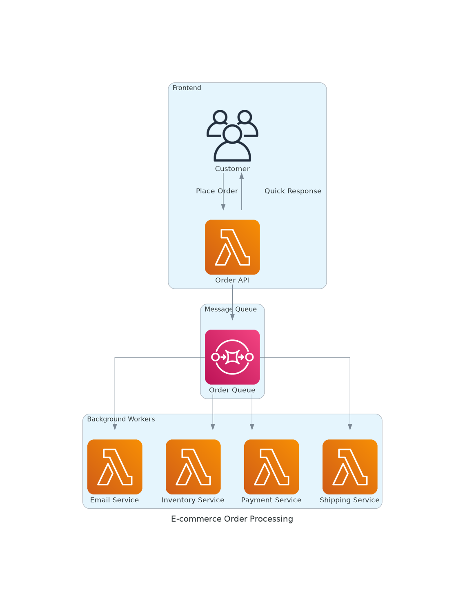
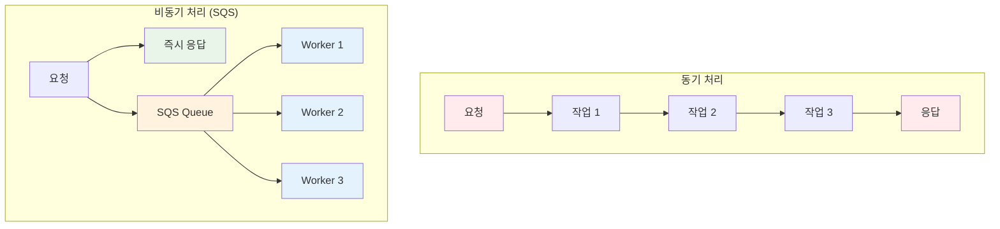
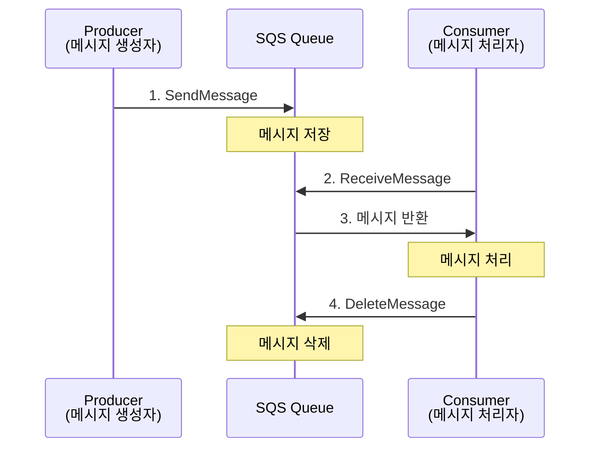
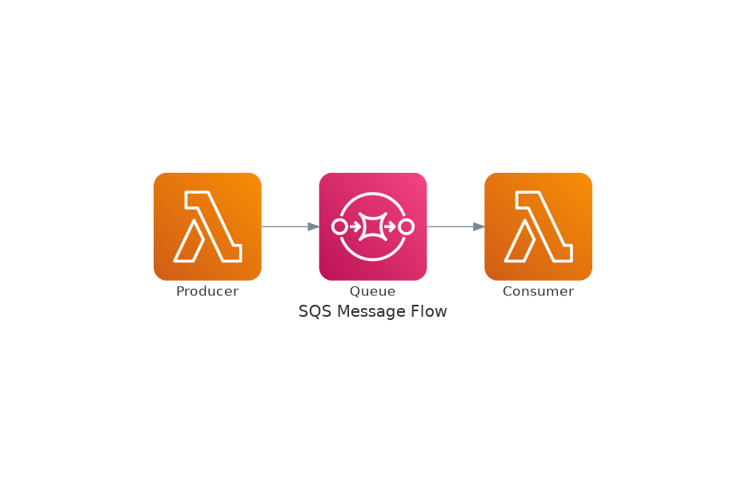
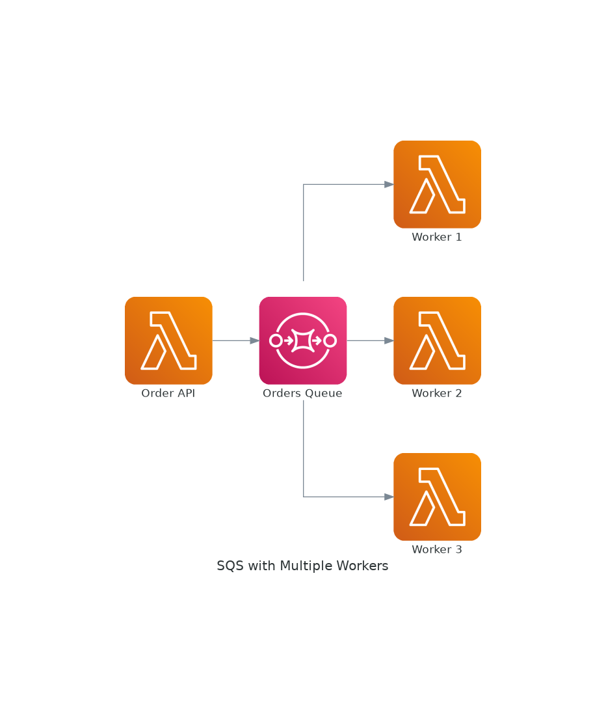
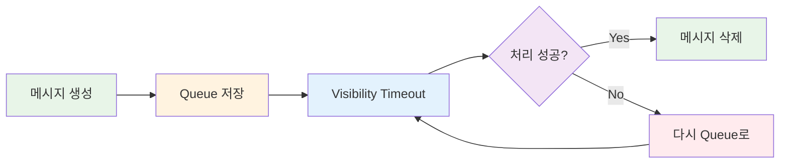
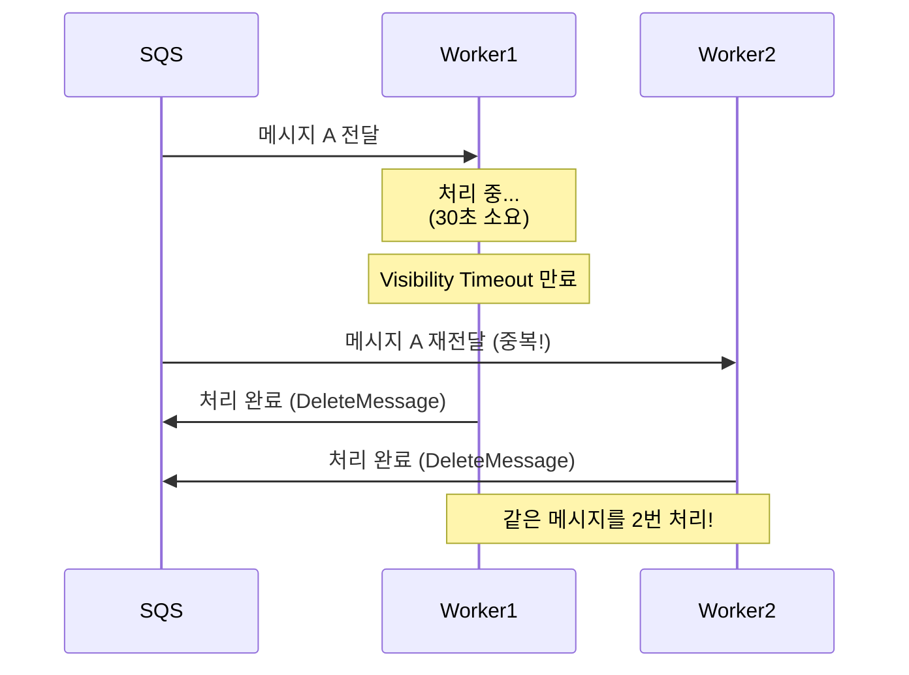
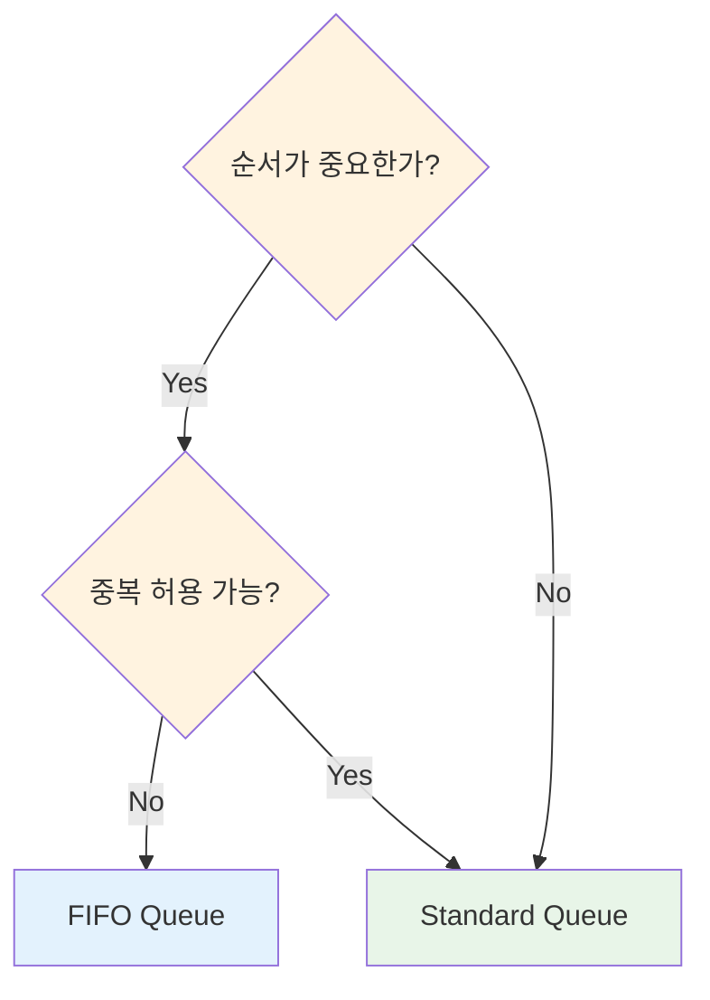
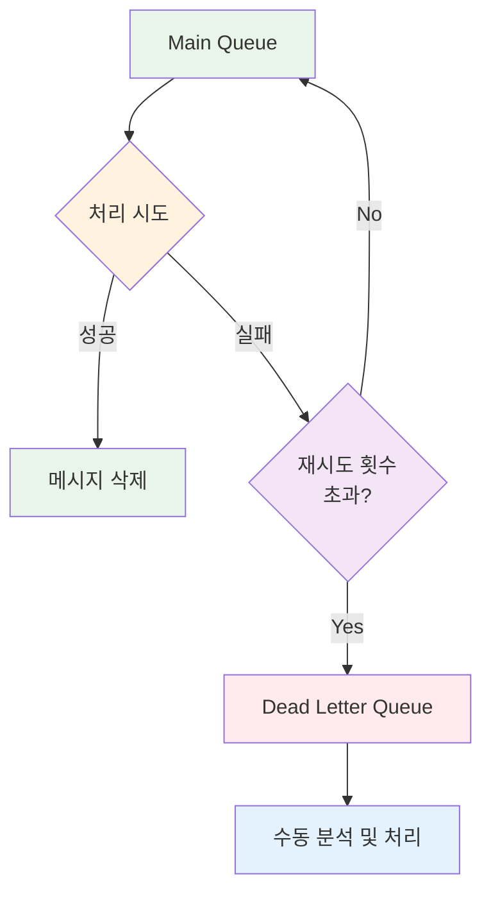
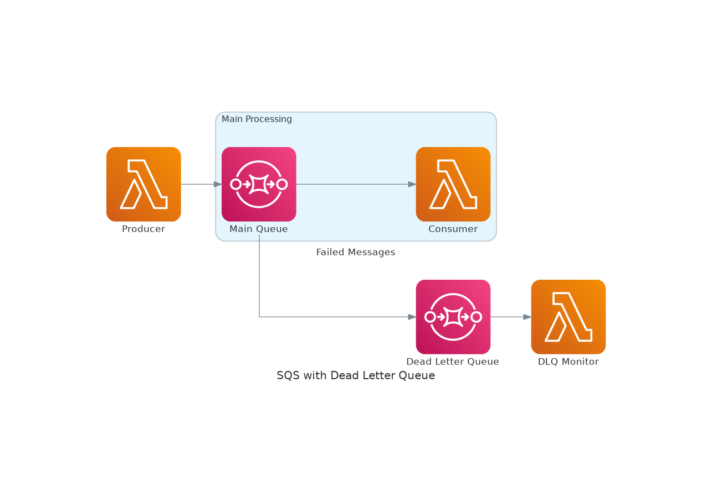

# November Week 2 Day 1 Session 1: SQS (Simple Queue Service)

<div align="center">

**📨 메시지 큐** • **🔄 비동기 처리** • **🛡️ 장애 격리**

*대규모 시스템의 필수 구성 요소, 메시지 큐 마스터하기*

</div>

---

## 🕘 Session 정보
**시간**: 09:00-09:40 (40분)
**목표**: SQS 개념 이해 및 실무 활용 방법 습득
**방식**: 이론 + 실습 예제

## 🎯 학습 목표

### 📚 이해 목표
- 메시지 큐가 필요한 이유 이해
- SQS의 작동 원리 파악
- Standard vs FIFO Queue 차이 이해
- Dead Letter Queue 개념 습득

### 🛠️ 적용 목표
- 비동기 처리가 필요한 상황 판단
- 적절한 Queue 타입 선택
- DLQ를 활용한 장애 처리 설계

---

## 🤔 왜 필요한가? (5분)

### 💼 실무 시나리오: 이커머스 주문 처리

**문제 상황**:
```
사용자가 주문 버튼 클릭
    ↓
서버가 처리해야 할 작업들:
1. 주문 정보 DB 저장 (0.5초)
2. 재고 확인 및 차감 (1초)
3. 결제 처리 (2초)
4. 주문 확인 이메일 발송 (1초)
5. 배송 시스템 연동 (1.5초)
6. 포인트 적립 (0.5초)
---
총 6.5초 대기 😱
```

**동기 처리의 문제점**:
- 사용자가 6.5초 동안 대기
- 한 작업 실패 시 전체 실패
- 트래픽 증가 시 서버 과부하
- 확장성 제한

**SQS를 사용한 비동기 처리**:
```
사용자가 주문 버튼 클릭
    ↓
서버: 주문 정보 DB 저장 (0.5초)
    ↓
SQS에 메시지 전송 (0.1초)
    ↓
사용자에게 "주문 접수 완료" 응답 (0.6초) ✅
    ↓
백그라운드에서 나머지 작업 처리
```

**실제 아키텍처**:



*그림: 이커머스 주문 처리 - 사용자는 즉시 응답을 받고, 나머지 작업은 백그라운드에서 비동기로 처리*

### 🏠 실생활 비유

**우체국 시스템**:
- **동기 처리**: 편지를 직접 배달할 때까지 우체국에서 대기
- **비동기 처리 (SQS)**: 편지를 우체통에 넣고 바로 출발, 우체부가 나중에 배달

### 📊 비동기 처리의 장점



---

## 📖 핵심 개념 (25분)

### 🔍 개념 1: SQS 기본 아키텍처 (8분)

> **정의**: AWS에서 제공하는 완전 관리형 메시지 큐 서비스

**작동 원리**:


**실제 AWS 아키텍처**:



*그림: SQS 메시지 흐름 - Producer가 메시지를 보내면 Queue에 저장되고, Consumer가 처리*

**다중 Worker 처리**:



*그림: 여러 Worker가 동시에 Queue에서 메시지를 가져와 병렬 처리*

**핵심 특징**:
- **완전 관리형**: 서버 관리 불필요
- **무제한 확장**: 메시지 수 제한 없음
- **내구성**: 여러 AZ에 메시지 복제
- **보안**: 암호화 및 IAM 통합

**메시지 생명주기**:


**주요 용어**:
- **Producer**: 메시지를 Queue에 보내는 애플리케이션
- **Consumer**: Queue에서 메시지를 가져와 처리하는 애플리케이션
- **Visibility Timeout**: 메시지를 받은 후 다른 Consumer가 볼 수 없는 시간
- **Message Retention**: 메시지가 Queue에 보관되는 기간 (기본 4일, 최대 14일)

### 🔍 개념 2: Standard vs FIFO Queue (8분)

> **정의**: SQS는 두 가지 Queue 타입을 제공하며, 각각 다른 특성을 가짐

#### Standard Queue (표준 큐)

**특징**:
- **무제한 처리량**: 초당 거의 무제한 메시지 처리
- **최소 1회 전달**: 메시지가 최소 1번 이상 전달 (중복 가능)
- **순서 보장 안 함**: 메시지 순서가 바뀔 수 있음

**사용 사례**:
- 이메일 발송
- 로그 수집
- 이미지 처리
- 순서가 중요하지 않은 작업

**예시**:
```
메시지 전송 순서: A → B → C
실제 처리 순서: B → A → C (순서 바뀜 가능)
메시지 중복: A가 2번 처리될 수 있음
```

#### ⚠️ Standard Queue의 중복 처리 문제와 해결 방법

**중복이 발생하는 이유**:



**중복 발생 시나리오**:
1. Worker1이 메시지를 받아 처리 중
2. **Visibility Timeout 만료** (처리 시간이 너무 길 때)
3. SQS가 메시지를 다시 큐에 노출
4. Worker2가 같은 메시지를 받음 → **중복 처리**

**실무 대응: 멱등성(Idempotency) 보장** 🔑

> **멱등성**: 같은 작업을 여러 번 수행해도 결과가 동일한 성질

**방법 1: 처리 이력 테이블 (권장)**

```python
# Lambda Worker 예시
import boto3
import json
from datetime import datetime

dynamodb = boto3.resource('dynamodb')
table = dynamodb.Table('processed-messages')

def lambda_handler(event, context):
    for record in event['Records']:
        message_id = record['messageId']
        body = json.loads(record['body'])
        order_id = body['orderId']
        
        # 1. 처리 이력 확인 (중복 체크)
        response = table.get_item(Key={'messageId': message_id})
        
        if 'Item' in response:
            print(f"이미 처리된 메시지: {message_id}")
            return  # 중복 처리 방지 ✅
        
        # 2. 비즈니스 로직 처리
        send_email(order_id)
        update_inventory(order_id)
        
        # 3. 처리 완료 기록 (멱등성 보장)
        table.put_item(Item={
            'messageId': message_id,
            'orderId': order_id,
            'processedAt': datetime.now().isoformat(),
            'status': 'completed'
        })
```

**처리 이력 테이블 설계**:
```sql
-- DynamoDB 또는 RDS
CREATE TABLE processed_messages (
    message_id VARCHAR(255) PRIMARY KEY,  -- SQS MessageId
    order_id VARCHAR(255),
    processed_at TIMESTAMP,
    status VARCHAR(50),
    worker_id VARCHAR(255)
);

-- 또는 간단하게 Redis
SET processed:{message_id} "completed" EX 86400  -- 24시간 TTL
```

**방법 2: 트랜잭션 기반 처리**

```python
def process_order(order_id, message_id):
    with db.transaction():
        # 1. 처리 이력 확인 (SELECT FOR UPDATE)
        existing = db.query(
            "SELECT * FROM processed_messages WHERE message_id = %s FOR UPDATE",
            (message_id,)
        )
        
        if existing:
            return  # 이미 처리됨
        
        # 2. 비즈니스 로직
        update_inventory(order_id)
        
        # 3. 처리 완료 기록
        db.execute(
            "INSERT INTO processed_messages (message_id, order_id) VALUES (%s, %s)",
            (message_id, order_id)
        )
```

**방법 3: Visibility Timeout 조정**

```bash
# 처리 시간이 긴 경우 Visibility Timeout 증가
aws sqs set-queue-attributes \
  --queue-url https://sqs.ap-northeast-2.amazonaws.com/.../my-queue \
  --attributes VisibilityTimeout=300  # 5분
```

**실무 권장 사항**:
```
✅ DO:
- MessageId 기반 중복 체크 구현
- 처리 이력을 DynamoDB/Redis에 저장
- 트랜잭션으로 원자성 보장
- Visibility Timeout을 처리 시간보다 길게 설정

❌ DON'T:
- 중복 처리를 무시하고 개발
- 처리 이력 없이 운영
- Visibility Timeout을 너무 짧게 설정
```

**여러 Worker가 동시에 폴링할 때**:
```
SQS Queue (100개 메시지)
    ↓ (ReceiveMessage API 호출)
Worker 1 ──┐
Worker 2 ──┼─→ 각자 독립적으로 폴링
Worker 3 ──┘

✅ SQS가 자동으로 다른 메시지를 각 Worker에게 분배
✅ Visibility Timeout으로 동시 처리 방지
⚠️ 드물게 중복 전달 가능 (At-Least-Once Delivery)
```

#### FIFO Queue (선입선출 큐)

**특징**:
- **정확히 1회 전달**: 메시지 중복 없음
- **순서 보장**: 전송 순서대로 처리
- **제한된 처리량**: 초당 300개 메시지 (배치 사용 시 3,000개)

**사용 사례**:
- 금융 거래
- 주문 처리
- 재고 관리
- 순서가 중요한 작업

**예시**:
```
메시지 전송 순서: A → B → C
실제 처리 순서: A → B → C (순서 보장)
메시지 중복: 없음 (정확히 1회)
```

#### 비교표

| 특성 | Standard Queue | FIFO Queue |
|------|----------------|------------|
| **처리량** | 무제한 | 300 TPS (배치 3,000) |
| **순서** | 보장 안 함 | 보장 |
| **중복** | 가능 | 없음 |
| **지연시간** | 낮음 | 약간 높음 |
| **비용** | 저렴 | 약간 비쌈 |
| **사용 사례** | 대량 처리 | 순서 중요 |

**선택 기준**:


### 🔍 개념 3: Dead Letter Queue (DLQ) (9분)

> **정의**: 처리 실패한 메시지를 별도로 보관하는 Queue

**왜 필요한가?**:
```
일반적인 실패 시나리오:
1. 메시지 처리 중 오류 발생
2. 메시지가 다시 Queue로 돌아감
3. 다른 Consumer가 다시 시도
4. 또 실패...
5. 무한 반복 😱
```

**DLQ 작동 원리**:


**실제 AWS 아키텍처**:



*그림: Dead Letter Queue - 실패한 메시지는 DLQ로 이동하여 별도 모니터링 및 처리*

**설정 방법**:
1. DLQ용 별도 Queue 생성
2. Main Queue에 DLQ 연결
3. `maxReceiveCount` 설정 (예: 3회)
4. 3회 실패 시 자동으로 DLQ로 이동

**실무 활용**:
```python
# Main Queue 설정
main_queue = sqs.create_queue(
    QueueName='orders-queue',
    Attributes={
        'RedrivePolicy': json.dumps({
            'deadLetterTargetArn': dlq_arn,
            'maxReceiveCount': '3'  # 3회 실패 시 DLQ로
        })
    }
)

# DLQ 모니터링
cloudwatch_alarm = cloudwatch.put_metric_alarm(
    AlarmName='DLQ-Messages',
    MetricName='ApproximateNumberOfMessagesVisible',
    Namespace='AWS/SQS',
    Statistic='Average',
    Period=300,
    EvaluationPeriods=1,
    Threshold=1,  # DLQ에 메시지 1개 이상이면 알람
    ComparisonOperator='GreaterThanThreshold'
)
```

**DLQ 메시지 처리 전략**:
1. **즉시 알람**: CloudWatch로 DLQ 메시지 감지
2. **원인 분석**: 로그 확인 및 오류 패턴 파악
3. **수정 후 재처리**: 
   - 코드 수정
   - DLQ → Main Queue로 메시지 이동
   - 재처리
4. **폐기**: 복구 불가능한 메시지는 삭제

**DLQ 베스트 프랙티스**:
- Main Queue와 동일한 타입 사용 (Standard ↔ Standard, FIFO ↔ FIFO)
- DLQ 메시지 보관 기간을 Main Queue보다 길게 설정
- DLQ 모니터링 알람 필수 설정
- 정기적으로 DLQ 메시지 분석

---

## 💭 함께 생각해보기 (10분)

### 🤝 페어 토론 (5분)

**토론 주제**:
1. **Queue 타입 선택**:
   - 여러분의 프로젝트에서 어떤 Queue를 사용하시겠습니까?
   - Standard와 FIFO 중 선택한 이유는?

2. **비동기 처리 적용**:
   - 프로젝트에서 비동기로 처리하면 좋을 작업은?
   - 동기 처리를 유지해야 하는 작업은?

3. **장애 처리**:
   - DLQ에 메시지가 쌓이면 어떻게 대응하시겠습니까?
   - 재처리 전략은?

**페어 활동 가이드**:
- 👥 2명씩 자유롭게 페어링
- 🔄 각자 5분씩 의견 공유
- 📝 핵심 아이디어 메모

### 🎯 전체 공유 (5분)

**공유 내용**:
- 각 팀의 Queue 선택 이유
- 비동기 처리 적용 아이디어
- DLQ 대응 전략

**💡 이해도 체크 질문**:
- ✅ "Standard와 FIFO Queue의 차이를 설명할 수 있나요?"
- ✅ "DLQ가 필요한 이유를 설명할 수 있나요?"
- ✅ "여러분의 프로젝트에 SQS를 어떻게 적용할지 구상했나요?"

---

## 🔑 핵심 키워드

### 📝 오늘의 핵심 용어

**기본 용어**:
- **SQS (Simple Queue Service)**: AWS 관리형 메시지 큐 서비스
- **Producer**: 메시지를 Queue에 보내는 애플리케이션
- **Consumer**: Queue에서 메시지를 가져와 처리하는 애플리케이션
- **Message**: Queue에 저장되는 데이터 단위 (최대 256KB)

**Queue 타입**:
- **Standard Queue**: 무제한 처리량, 순서 보장 안 함, 중복 가능
- **FIFO Queue**: 순서 보장, 중복 없음, 제한된 처리량

**고급 개념**:
- **Visibility Timeout**: 메시지를 받은 후 다른 Consumer가 볼 수 없는 시간
- **Dead Letter Queue (DLQ)**: 처리 실패한 메시지를 보관하는 별도 Queue
- **Message Retention**: 메시지 보관 기간 (기본 4일, 최대 14일)
- **Long Polling**: 메시지가 도착할 때까지 대기 (비용 절감)

---

## 🚀 실무 적용 및 개선 방안

### 💡 현재 Session의 한계점
- 단순 Queue 개념만 다룸
- 실제 코드 구현은 Lab에서
- 성능 최적화는 다루지 않음

### 🔧 실무 개선 방안

#### 1. 성능 최적화
**Batch 처리**:
```python
# 단일 메시지 전송 (비효율)
for message in messages:
    sqs.send_message(QueueUrl=queue_url, MessageBody=message)

# Batch 전송 (효율적)
sqs.send_message_batch(
    QueueUrl=queue_url,
    Entries=[
        {'Id': str(i), 'MessageBody': msg}
        for i, msg in enumerate(messages)
    ]
)
```

**Long Polling 사용**:
```python
# Short Polling (비효율 - 빈 응답 많음)
response = sqs.receive_message(QueueUrl=queue_url)

# Long Polling (효율적 - 메시지 도착까지 대기)
response = sqs.receive_message(
    QueueUrl=queue_url,
    WaitTimeSeconds=20  # 최대 20초 대기
)
```

#### 2. 보안 강화
**암호화**:
- **전송 중 암호화**: HTTPS 사용 (기본)
- **저장 시 암호화**: KMS 키 사용
- **IAM 정책**: 최소 권한 원칙

**IAM 정책 예시**:
```json
{
  "Version": "2012-10-17",
  "Statement": [{
    "Effect": "Allow",
    "Action": [
      "sqs:SendMessage",
      "sqs:ReceiveMessage",
      "sqs:DeleteMessage"
    ],
    "Resource": "arn:aws:sqs:ap-northeast-2:123456789012:my-queue"
  }]
}
```

#### 3. 모니터링 & 알람
**주요 메트릭**:
- `ApproximateNumberOfMessagesVisible`: Queue에 있는 메시지 수
- `ApproximateAgeOfOldestMessage`: 가장 오래된 메시지 나이
- `NumberOfMessagesSent`: 전송된 메시지 수
- `NumberOfMessagesReceived`: 수신된 메시지 수

**CloudWatch 알람 설정**:
```python
cloudwatch.put_metric_alarm(
    AlarmName='SQS-Queue-Depth',
    MetricName='ApproximateNumberOfMessagesVisible',
    Namespace='AWS/SQS',
    Statistic='Average',
    Period=300,
    EvaluationPeriods=2,
    Threshold=1000,  # 메시지 1000개 이상이면 알람
    ComparisonOperator='GreaterThanThreshold',
    AlarmActions=['arn:aws:sns:ap-northeast-2:123456789012:alerts']
)
```

#### 4. 비용 최적화
**비용 구조**:
- **요청 비용**: 100만 요청당 $0.40
- **데이터 전송**: 무료 (동일 리전 내)
- **FIFO Queue**: 100만 요청당 $0.50

**절감 팁**:
- Long Polling 사용 (빈 응답 감소)
- Batch 처리 (요청 수 감소)
- 적절한 Visibility Timeout 설정 (재처리 감소)

### 📊 실제 운영 사례

**사례 1: Netflix**
- **규모**: 초당 수백만 메시지 처리
- **용도**: 비디오 인코딩 작업 큐
- **효과**: 확장 가능한 비동기 처리

**사례 2: Airbnb**
- **규모**: 수천 개의 Queue 운영
- **용도**: 예약 처리, 알림 발송
- **효과**: 시스템 분리 및 안정성 향상

**사례 3: 스타트업 사례**
- **규모**: 일 100만 메시지
- **용도**: 이메일 발송, 이미지 처리
- **비용**: 월 $50 이하

---

## 📝 Session 마무리

### ✅ 오늘 Session 성과
- [ ] SQS 개념 및 필요성 이해
- [ ] Standard vs FIFO Queue 차이 파악
- [ ] Dead Letter Queue 활용 방법 습득
- [ ] 실무 적용 방안 구상

### 🎯 다음 Session 준비
**Session 2: SNS (Simple Notification Service)**
- Pub/Sub 패턴 이해
- SQS + SNS 통합 (Fan-out)
- 알림 시스템 구축

**연결 포인트**:
- SQS는 1:1 메시지 전달
- SNS는 1:N 메시지 전달
- 두 서비스를 함께 사용하면 강력한 비동기 시스템 구축 가능

---

## 🔗 참고 자료

### 📚 AWS 공식 문서
- 📘 [SQS란 무엇인가?](https://docs.aws.amazon.com/AWSSimpleQueueService/latest/SQSDeveloperGuide/welcome.html)
- 📗 [SQS 사용자 가이드](https://docs.aws.amazon.com/AWSSimpleQueueService/latest/SQSDeveloperGuide/)
- 📙 [SQS API 레퍼런스](https://docs.aws.amazon.com/AWSSimpleQueueService/latest/APIReference/)
- 📕 [SQS 요금](https://aws.amazon.com/sqs/pricing/)
- 🆕 [SQS 최신 업데이트](https://aws.amazon.com/sqs/whats-new/)

### 🎯 추가 학습 자료
- [AWS SQS 베스트 프랙티스](https://docs.aws.amazon.com/AWSSimpleQueueService/latest/SQSDeveloperGuide/sqs-best-practices.html)
- [SQS vs Kafka 비교](https://aws.amazon.com/compare/the-difference-between-sqs-and-kafka/)

---

<div align="center">

**📨 메시지 큐** • **🔄 비동기 처리** • **🛡️ 장애 격리** • **📊 확장성**

*Session 1 완료 - 다음은 SNS로 알림 시스템 구축!*

</div>
