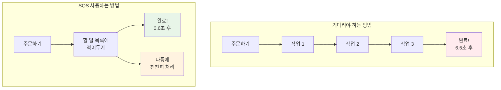
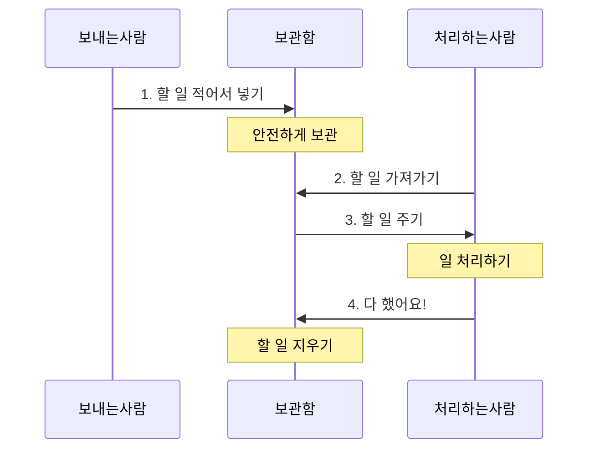
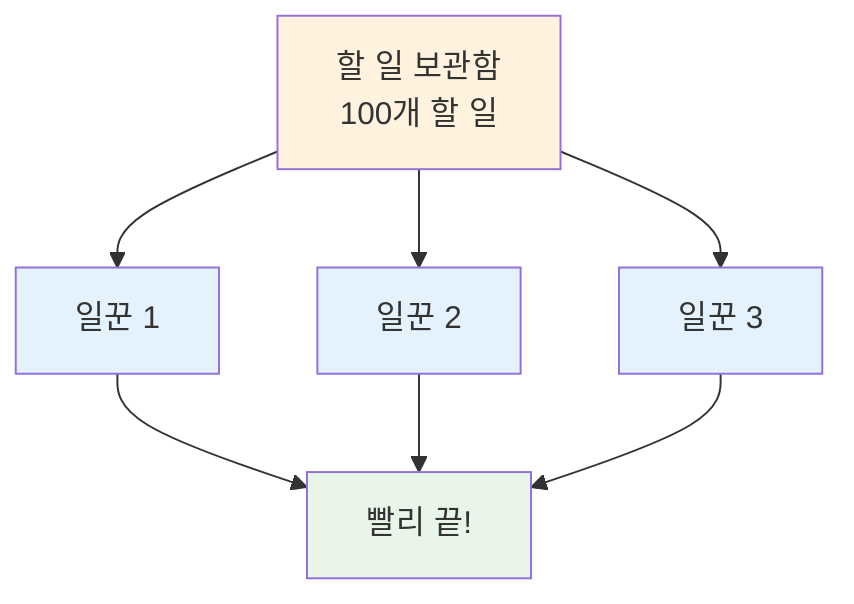
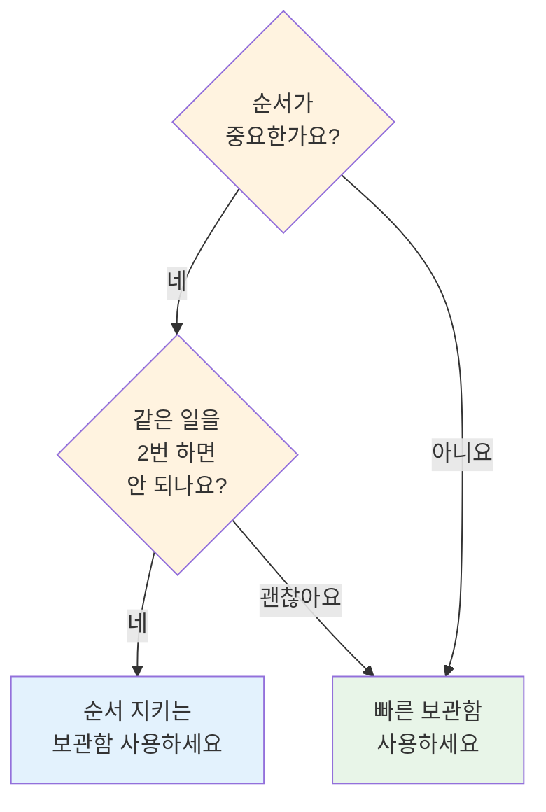
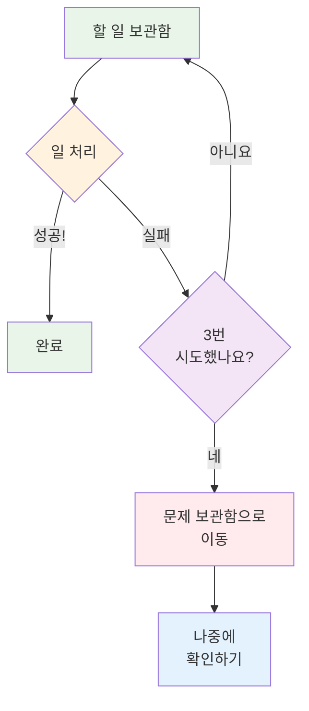
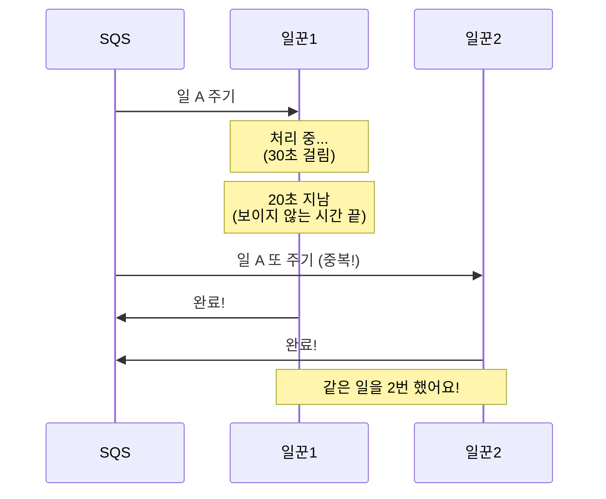

# November Week 2 Day 1 Session 1: SQS (Simple Queue Service)

<div align="center">

**📨 메시지 보관함** • **🔄 나중에 처리하기** • **🛡️ 안전하게 보관**

*줄 서기처럼 순서대로, 메시지 큐 쉽게 이해하기*

</div>

---

## 🕘 Session 정보
**시간**: 09:00-09:40 (40분)
**목표**: 메시지 큐가 뭔지, 왜 필요한지 쉽게 이해하기
**방식**: 실생활 비유 + 그림 + 간단한 예시

## 🎯 학습 목표

### 📚 이해 목표
- 메시지 큐가 뭔지 알기 (우체통 같은 거!)
- 왜 필요한지 이해하기 (기다리지 않아도 돼요)
- 두 가지 종류 알기 (빠른 것 vs 순서 지키는 것)
- 실패하면 어떻게 하는지 알기 (따로 보관함)

### 🛠️ 적용 목표
- 언제 사용하면 좋을지 판단하기
- 어떤 종류를 선택할지 알기
- 실패한 메시지 처리 방법 알기

---

## 🤔 왜 필요한가? (5분)

### 🏠 실생활 비유: 우체통

**우체통 없이 편지 보내기** (기다려야 함):
```
나 → 우체국 가서 줄 서기 → 우체부 만날 때까지 기다리기 → 편지 전달
시간: 30분 😱
```

**우체통 사용하기** (바로 끝!):
```
나 → 우체통에 편지 넣기 → 끝! (바로 집에 가기)
시간: 1분 ✅

우체부는 나중에 편지를 가져가서 배달해요
```

### 💼 실제 예시: 쿠팡 주문하기

**방법 1: 모든 걸 기다리기** (느림):
```
주문 버튼 클릭
    ↓
1. 주문 저장하기 (0.5초)
2. 재고 확인하기 (1초)
3. 결제하기 (2초)
4. 이메일 보내기 (1초)
5. 배송 준비하기 (1.5초)
6. 포인트 주기 (0.5초)
---
총 6.5초 동안 기다려야 해요 😱
```

**방법 2: SQS 사용하기** (빠름):
```
주문 버튼 클릭
    ↓
1. 주문 저장하기 (0.5초)
2. "할 일 목록"에 적어두기 (0.1초)
    ↓
"주문 완료!" 바로 보여주기 (0.6초) ✅
    ↓
나머지는 나중에 천천히 처리해요
```

**그림으로 보기**:


### 🎯 SQS의 장점

1. **빨라요**: 사용자가 기다리지 않아도 돼요
2. **안전해요**: 메시지를 잃어버리지 않아요
3. **독립적이에요**: 한 작업이 실패해도 다른 작업은 계속해요
4. **확장 가능해요**: 일이 많아지면 일꾼을 더 투입할 수 있어요

---

## 📖 핵심 개념 (25분)

### 🔍 개념 1: SQS가 뭔가요? (5분)

> **쉽게 말하면**: AWS가 관리해주는 "할 일 목록 보관함"

**등장인물**:
- **보내는 사람** (Producer): 할 일을 목록에 적는 사람
- **보관함** (Queue): 할 일 목록을 보관하는 곳
- **처리하는 사람** (Consumer): 목록을 보고 일을 하는 사람

**어떻게 작동하나요?**:


**실제 예시**:
```
카페에서 주문하기:
1. 손님: 주문하고 번호표 받기 (보내는 사람)
2. 주문 목록: 주방에 전달 (보관함)
3. 바리스타: 주문 보고 커피 만들기 (처리하는 사람)
4. 완성되면 번호 부르기
```

**여러 명이 동시에 일하기**:


**중요한 용어** (쉽게 설명):
- **메시지**: 할 일 하나 (예: "이메일 보내기")
- **큐(Queue)**: 할 일 목록 보관함
- **보이지 않는 시간**: 누가 일하는 중이면 다른 사람은 못 봐요

### 🔍 개념 2: 두 가지 종류 (5분)

> **쉽게 말하면**: 빠른 것 vs 순서 지키는 것

#### 종류 1: 빠른 보관함 (Standard Queue)

**특징**:
- ⚡ **엄청 빨라요**: 거의 무제한으로 처리 가능
- 🔀 **순서가 바뀔 수 있어요**: A, B, C 순서로 넣었는데 B, A, C로 나올 수 있어요
- 🔄 **가끔 중복돼요**: 같은 일을 2번 할 수도 있어요

**언제 사용하나요?**:
- 이메일 보내기 (순서 상관없어요)
- 사진 처리하기 (누가 먼저든 상관없어요)
- 로그 저장하기 (순서 안 중요해요)

**예시**:
```
카페에서 음료 만들기:
- 주문 순서: 아메리카노 → 라떼 → 주스
- 완성 순서: 주스 → 아메리카노 → 라떼 (빨리 만들어진 것부터)
→ 괜찮아요! 번호로 부르니까요
```

#### 종류 2: 순서 지키는 보관함 (FIFO Queue)

**특징**:
- 📋 **순서를 지켜요**: A, B, C 순서로 넣으면 A, B, C 순서로 나와요
- ✅ **중복 없어요**: 같은 일을 2번 하지 않아요
- 🐢 **조금 느려요**: 초당 300개까지 (배치하면 3,000개)

**언제 사용하나요?**:
- 은행 거래 (순서 중요해요!)
- 주문 처리 (먼저 주문한 사람 먼저)
- 재고 관리 (순서대로 빼야 해요)

**예시**:
```
은행 창구:
- 1번 손님 → 2번 손님 → 3번 손님
- 반드시 이 순서대로 처리해야 해요!
- 같은 사람이 2번 처리되면 안 돼요!
```

#### 비교하기

| | 빠른 보관함 | 순서 지키는 보관함 |
|---|---|---|
| **속도** | 엄청 빠름 ⚡ | 조금 느림 🐢 |
| **순서** | 바뀔 수 있음 🔀 | 항상 지킴 📋 |
| **중복** | 가능함 🔄 | 없음 ✅ |
| **사용 예시** | 이메일, 사진 처리 | 은행, 주문 처리 |

**어떤 걸 선택할까요?**:


### 🔍 개념 3: 실패하면 어떻게 하나요? (5분)

> **쉽게 말하면**: 실패한 일은 "문제 보관함"에 따로 모아요

**문제 상황**:
```
일꾼이 일을 하다가 실패했어요:
1. 일을 다시 보관함에 넣어요
2. 다른 일꾼이 또 시도해요
3. 또 실패...
4. 또 시도...
5. 계속 반복... 😱
```

**해결 방법: 문제 보관함 (Dead Letter Queue)**:


**실생활 예시**:
```
우체국에서 편지 배달:
1. 주소가 잘못됐어요
2. 3번 시도했지만 배달 못 했어요
3. "배달 불가 편지함"에 따로 모아요
4. 나중에 우체국 직원이 확인해요
```

**설정 방법** (간단하게):
```
1. 문제 보관함 만들기
2. 일반 보관함에 연결하기
3. "3번 실패하면 문제 보관함으로" 설정
4. 알람 설정: "문제 보관함에 뭔가 들어오면 알려줘!"
```

**왜 필요한가요?**:
- ✅ 무한 반복 방지
- ✅ 문제 있는 일만 따로 확인
- ✅ 다른 일은 계속 처리
- ✅ 나중에 원인 파악 가능

### 🔍 개념 4: 실무 주의사항 (10분)

#### 같은 일을 2번 하는 문제

**왜 발생하나요?**:
```
상황:
1. 일꾼 1이 일을 가져가서 처리 중 (30초 걸림)
2. 시간이 너무 오래 걸려요 (20초 지남)
3. SQS: "아, 실패한 것 같네?" → 다시 보관함에 넣기
4. 일꾼 2가 같은 일을 가져가요
5. 결과: 같은 일을 2번 처리! 😱
```

**그림으로 보기**:


**해결 방법 1: 처리 이력 확인하기** (권장)

**의사코드** (쉽게 설명):
```
일을 받았을 때:
1. "이미 한 일 목록"을 확인해요
2. 만약 이미 했으면:
   - 건너뛰기 (중복 방지!)
3. 안 했으면:
   - 일 처리하기
   - "이미 한 일 목록"에 기록하기
```

**실생활 예시**:
```
숙제 검사:
1. 선생님이 숙제를 받아요
2. 출석부에 체크해요 (이미 한 일 목록)
3. 같은 학생이 또 제출하면:
   - 출석부 확인 → 이미 체크됨
   - "이미 받았어요" 말하기
```

**실제 코드 예시** (참고용):
```python
# 이미 처리했는지 확인하는 테이블
processed_messages = {}

def process_message(message_id, order_id):
    # 1. 이미 처리했나요?
    if message_id in processed_messages:
        print("이미 처리한 메시지예요. 건너뛰기!")
        return
    
    # 2. 일 처리하기
    send_email(order_id)
    update_inventory(order_id)
    
    # 3. 처리 완료 기록
    processed_messages[message_id] = "완료"
    print("처리 완료!")
```

**해결 방법 2: 시간 늘리기**

```
문제: 일 처리 시간이 30초인데, "보이지 않는 시간"이 20초
해결: "보이지 않는 시간"을 40초로 늘리기

→ 일꾼 1이 끝날 때까지 다른 일꾼이 못 봐요
```

**실무 권장사항**:
```
✅ 해야 할 것:
- 처리 이력을 꼭 확인하세요
- "보이지 않는 시간"을 충분히 길게 설정하세요
- 같은 일을 2번 해도 괜찮게 만드세요

❌ 하지 말아야 할 것:
- 중복 처리를 무시하고 개발하지 마세요
- "보이지 않는 시간"을 너무 짧게 하지 마세요
```

---

## 💭 함께 생각해보기 (10분)

### 🤝 페어 토론 (5분)

**쉬운 질문들**:

1. **일상 생활에서 찾기**:
   - 우리 주변에서 "줄 서기"가 필요한 곳은 어디인가요?
   - 순서가 중요한 경우와 안 중요한 경우를 찾아보세요

2. **간단한 시나리오**:
   - 카페에서 주문할 때:
     * 주문 번호가 순서대로 나와야 할까요?
     * 빨리 만들어진 것부터 나와도 될까요?
   - 어떤 게 더 좋을까요?

3. **실패 상황 상상하기**:
   - 메시지가 처리 안 되면 어떻게 될까요?
   - 어디에 따로 보관하면 좋을까요?

**페어 활동 가이드**:
- 👥 2명씩 편하게 짝 지어요
- 🔄 각자 생각을 이야기해요
- 📝 재미있는 아이디어를 메모해요

### 🎯 전체 공유 (5분)

**공유 내용**:
- 각 팀이 찾은 일상 생활 예시
- 순서가 중요한 경우/안 중요한 경우
- 실패 처리 아이디어

**💡 이해도 체크 질문**:
- ✅ "SQS가 뭔지 친구에게 설명할 수 있나요?"
- ✅ "빠른 보관함과 순서 지키는 보관함의 차이를 알겠나요?"
- ✅ "문제 보관함이 왜 필요한지 이해했나요?"

---

## 🔑 핵심 키워드

### 📝 오늘 배운 용어 (쉽게 정리)

**기본 용어**:
- **SQS**: AWS가 관리해주는 "할 일 목록 보관함"
- **메시지**: 할 일 하나 (예: "이메일 보내기")
- **큐(Queue)**: 할 일 목록을 보관하는 곳
- **보내는 사람**: 할 일을 목록에 적는 사람
- **처리하는 사람**: 목록을 보고 일을 하는 사람

**두 가지 종류**:
- **빠른 보관함**: 엄청 빠르지만 순서가 바뀔 수 있어요
- **순서 지키는 보관함**: 순서를 지키고 중복이 없어요

**고급 개념**:
- **보이지 않는 시간**: 누가 일하는 중이면 다른 사람은 못 봐요
- **문제 보관함**: 실패한 일을 따로 모아두는 곳
- **보관 기간**: 메시지를 얼마나 오래 보관할지 (기본 4일, 최대 14일)

---

## 🚀 실무에서는 어떻게 사용하나요?

### 💡 실제 회사 사례

**사례 1: 쿠팡**
- **사용**: 주문 처리, 배송 알림
- **효과**: 빠른 주문 처리, 안정적인 시스템

**사례 2: 배달의민족**
- **사용**: 주문 알림, 리뷰 처리
- **효과**: 많은 주문도 문제없이 처리

**사례 3: 작은 쇼핑몰**
- **사용**: 이메일 발송, 재고 업데이트
- **비용**: 한 달에 5만원 이하
- **효과**: 고객이 빠르게 주문 완료

### 🔧 더 잘 사용하는 방법

**1. 여러 개를 한번에 보내기**:
```
❌ 나쁜 방법: 메시지 100개를 하나씩 보내기
✅ 좋은 방법: 메시지 100개를 한번에 보내기 (10배 빠름!)
```

**2. 기다리면서 받기**:
```
❌ 나쁜 방법: 계속 "메시지 있어?" 물어보기 (비용 많이 나옴)
✅ 좋은 방법: 메시지 올 때까지 기다리기 (비용 절약!)
```

**3. 보안 강화**:
```
✅ 메시지를 암호화해서 보관해요
✅ 권한이 있는 사람만 볼 수 있어요
✅ 누가 언제 봤는지 기록해요
```

### 💰 비용은 얼마나 나올까요?

**비용 계산**:
- 요청 100만 번: 400원
- 메시지 보관: 무료
- 데이터 전송: 무료 (같은 지역 안에서)

**예시**:
```
작은 쇼핑몰 (하루 1,000개 주문):
- 한 달 요청: 30,000번
- 비용: 약 12원
→ 거의 공짜! 😊
```

---

## 📝 Session 마무리

### ✅ 오늘 배운 것

- [ ] SQS가 뭔지 알았어요 (할 일 목록 보관함)
- [ ] 왜 필요한지 이해했어요 (기다리지 않아도 돼요)
- [ ] 두 가지 종류를 알았어요 (빠른 것 vs 순서 지키는 것)
- [ ] 실패하면 어떻게 하는지 알았어요 (문제 보관함)
- [ ] 같은 일을 2번 하는 문제를 알았어요

### 🎯 다음 Session 준비

**Session 2: SNS (알림 서비스)**
- 한 번에 여러 사람에게 알림 보내기
- 이메일, 문자, 앱 알림
- SQS와 함께 사용하기

**연결 포인트**:
- SQS: 한 사람에게 메시지 보내기 (1:1)
- SNS: 여러 사람에게 메시지 보내기 (1:N)
- 둘이 함께 사용하면 더 강력해요!

---

## 🔗 더 알아보기

### 📚 AWS 공식 문서
- 📘 [SQS가 뭔가요?](https://docs.aws.amazon.com/AWSSimpleQueueService/latest/SQSDeveloperGuide/welcome.html)
- 📗 [SQS 사용 방법](https://docs.aws.amazon.com/AWSSimpleQueueService/latest/SQSDeveloperGuide/)
- 📕 [SQS 비용](https://aws.amazon.com/sqs/pricing/)

### 🎯 추가 학습 자료
- [SQS 잘 사용하는 방법](https://docs.aws.amazon.com/AWSSimpleQueueService/latest/SQSDeveloperGuide/sqs-best-practices.html)

---

<div align="center">

**📨 메시지 보관함** • **🔄 나중에 처리** • **🛡️ 안전하게 보관** • **📊 쉽게 확장**

*Session 1 완료 - 다음은 SNS로 여러 사람에게 알림 보내기!*

</div>
