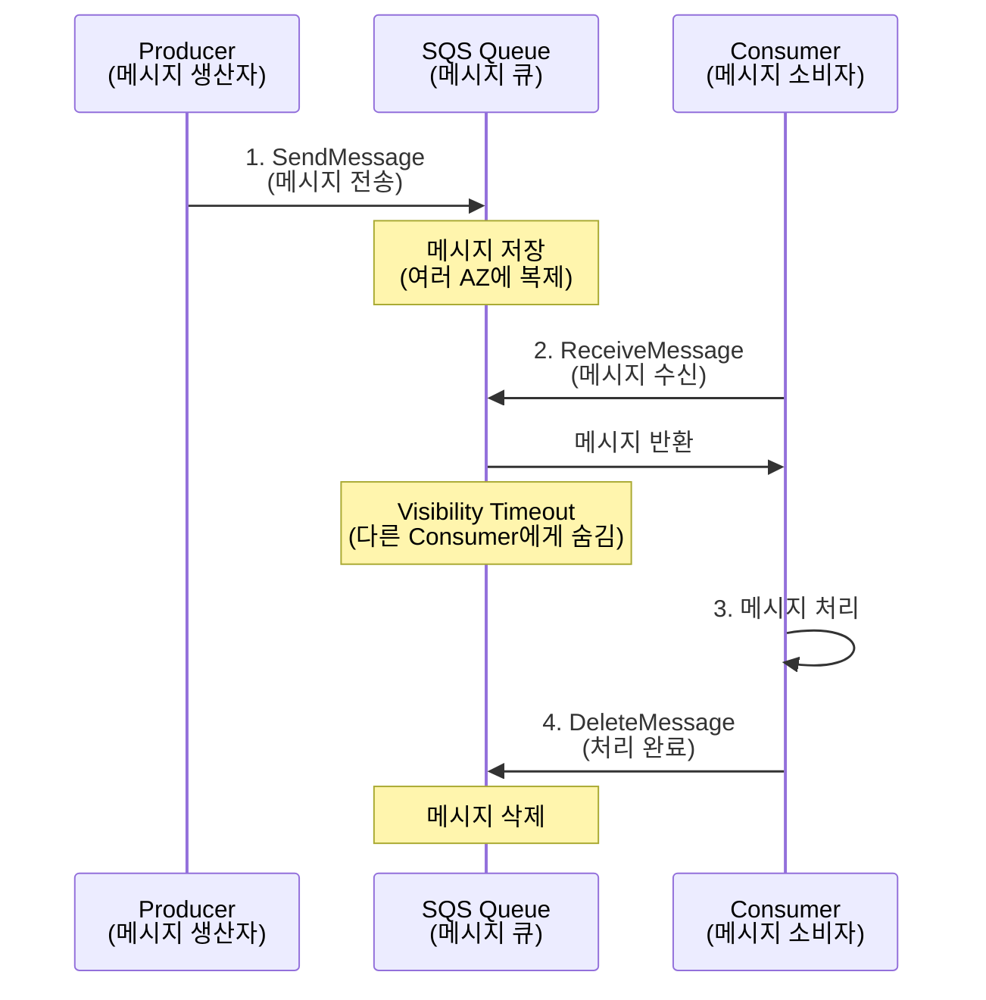

# November Week 2 Day 1 Session 1: SQS (Simple Queue Service)

<div align="center">

**📬 메시지 큐** • **⏰ 비동기 처리** • **🔄 안정적 전달**

*메시지를 안전하게 저장하고 순서대로 처리하는 관리형 큐 서비스*

</div>

---

## 🕘 세션 정보
**시간**: 09:00-09:50 (50분)
**목표**: AWS SQS의 핵심 개념과 실무 활용 방법 이해
**방식**: 개념 설명 + 실무 사례 + 아키텍처 패턴

## 🎯 학습 목표
- SQS의 생성 배경과 필요성 이해
- Standard Queue와 FIFO Queue의 차이점 파악
- 메시지 전달 메커니즘과 가시성 타임아웃 이해
- 실무에서의 활용 패턴과 베스트 프랙티스 습득
- 비용 구조와 최적화 방법 학습

---

## 📖 서비스 개요

### 1. 생성 배경 (Why?) - 5분

**문제 상황**:
- **동기 처리의 한계**: 요청을 받으면 즉시 처리해야 하므로 시스템 부하 증가
- **시스템 간 강한 결합**: 한 시스템이 다운되면 전체 시스템 영향
- **트래픽 급증 대응 어려움**: 갑작스러운 요청 증가 시 시스템 과부하
- **재시도 메커니즘 부재**: 실패한 작업을 다시 시도하기 어려움

**AWS SQS 솔루션**:
- **비동기 처리**: 메시지를 큐에 저장하고 나중에 처리
- **느슨한 결합**: 시스템 간 독립성 확보
- **탄력적 확장**: 메시지 처리 속도를 독립적으로 조절
- **내구성 보장**: 메시지를 여러 AZ에 중복 저장

### 2. 핵심 원리 (How?) - 10분

**SQS 작동 원리**:



**핵심 구성 요소**:

1. **Producer (생산자)**:
   - 메시지를 큐에 전송하는 애플리케이션
   - 여러 Producer가 동시에 메시지 전송 가능

2. **Queue (큐)**:
   - 메시지를 저장하는 버퍼
   - 여러 AZ에 중복 저장하여 내구성 보장

3. **Consumer (소비자)**:
   - 큐에서 메시지를 가져와 처리하는 애플리케이션
   - 여러 Consumer가 동시에 메시지 처리 가능

4. **Visibility Timeout (가시성 타임아웃)**:
   - 메시지를 받은 후 다른 Consumer에게 보이지 않는 시간
   - 기본값: 30초
   - 처리 시간보다 길게 설정 필요

### 3. 주요 사용 사례 (When?) - 5분

**적합한 경우**:

1. **비동기 작업 처리**:
   - 이메일 발송, 이미지 리사이징, 동영상 인코딩
   - 사용자는 즉시 응답 받고, 백그라운드에서 처리

2. **마이크로서비스 간 통신**:
   - 서비스 간 느슨한 결합 유지
   - 한 서비스 장애가 다른 서비스에 영향 최소화

3. **부하 분산 (Load Leveling)**:
   - 트래픽 급증 시 메시지를 큐에 저장
   - Consumer가 처리 가능한 속도로 소비

4. **배치 처리**:
   - 여러 메시지를 모아서 한 번에 처리
   - 데이터베이스 배치 삽입, 로그 집계

**실제 사례**:
- **Netflix**: 동영상 인코딩 작업 큐
- **Airbnb**: 예약 확인 이메일 발송 큐
- **Uber**: 운전자 매칭 요청 큐

### 4. 비슷한 서비스 비교 (Which?) - 5분

**AWS 내 대안 서비스**:

**SQS vs SNS**:
- **SQS 사용**: 메시지를 하나씩 처리, 순서 보장 필요, 재시도 필요
- **SNS 사용**: 한 번에 여러 곳에 알림, 순서 무관, 즉시 전달

**SQS vs Kinesis**:
- **SQS 사용**: 메시지 단위 처리, 순서 보장 (FIFO), 최대 14일 보관
- **Kinesis 사용**: 스트림 데이터 처리, 실시간 분석, 최대 365일 보관

**SQS vs EventBridge**:
- **SQS 사용**: 애플리케이션 간 메시지 전달, 큐 기반
- **EventBridge 사용**: 이벤트 라우팅, 규칙 기반 필터링

**선택 기준**:
| 기준 | SQS | SNS | Kinesis | EventBridge |
|------|-----|-----|---------|-------------|
| 메시지 전달 | 1:1 (큐) | 1:N (Pub/Sub) | 스트림 | 이벤트 라우팅 |
| 순서 보장 | FIFO 가능 | 불가능 | 샤드 내 보장 | 불가능 |
| 재시도 | 자동 | 제한적 | 수동 | 자동 |
| 보관 기간 | 최대 14일 | 즉시 전달 | 최대 365일 | 최대 24시간 |
| 처리 방식 | Pull | Push | Pull | Push |
| 비용 | 요청당 | 요청당 | 샤드당 | 이벤트당 |

### 5. 장단점 분석 - 3분

**장점**:
- ✅ **완전 관리형**: 서버 관리 불필요, AWS가 자동 확장
- ✅ **무제한 확장**: 큐 수, 메시지 수 제한 없음
- ✅ **저렴한 비용**: 요청당 과금, 프리티어 제공
- ✅ **내구성**: 여러 AZ에 중복 저장
- ✅ **보안**: 암호화, IAM 통합, VPC 엔드포인트 지원

**단점/제약사항**:
- ⚠️ **메시지 크기 제한**: 최대 256KB (S3 연동으로 확장 가능)
- ⚠️ **FIFO 처리량 제한**: 초당 300개 메시지 (배치 사용 시 3,000개)
- ⚠️ **정확히 한 번 처리 보장 없음**: Standard Queue는 중복 가능
- ⚠️ **순서 보장 제한**: Standard Queue는 순서 보장 안 됨

**대안**:
- 큰 메시지: S3에 저장하고 참조만 큐에 전송
- 높은 처리량: Standard Queue 사용 또는 Kinesis 고려
- 정확히 한 번: FIFO Queue + 멱등성 처리

### 6. 비용 구조 💰 - 5분

**과금 방식**:
- **요청당 과금**: API 호출 100만 건당 $0.40
- **데이터 전송**: 인터넷으로 나가는 데이터만 과금

**프리티어 혜택** (매월):
- Standard Queue: 100만 건 요청 무료
- FIFO Queue: 100만 건 요청 무료

**비용 최적화 팁**:
1. **Long Polling 사용**: 빈 응답 줄여서 요청 수 감소
2. **배치 처리**: 한 번에 최대 10개 메시지 처리
3. **적절한 Visibility Timeout**: 불필요한 재처리 방지
4. **메시지 크기 최적화**: 불필요한 데이터 제거
5. **Dead Letter Queue 활용**: 실패 메시지 별도 처리

**예상 비용 계산**:
```
월간 1,000만 건 메시지 처리 시:
- 요청 수: 1,000만 건
- 프리티어: -100만 건
- 과금 대상: 900만 건
- 비용: (900만 / 100만) × $0.40 = $3.60/월
```

**실제 사용 예시**:
| 시나리오 | 월간 메시지 | 예상 비용 |
|----------|-------------|-----------|
| 소규모 앱 | 50만 건 | $0 (프리티어) |
| 중규모 앱 | 500만 건 | $1.60 |
| 대규모 앱 | 5,000만 건 | $19.60 |

### 7. 최신 업데이트 🆕 - 2분

**2024년 주요 변경사항**:
- **High Throughput FIFO**: FIFO Queue 처리량 10배 증가 (초당 3,000개)
- **Message Data Protection**: 민감 데이터 자동 탐지 및 마스킹
- **Enhanced Observability**: CloudWatch 메트릭 개선

**2025년 예정**:
- **더 큰 메시지 크기**: 1MB까지 지원 검토 중
- **더 긴 보관 기간**: 30일까지 확장 예정

**참조**: [AWS SQS What's New](https://aws.amazon.com/sqs/whats-new/)

### 8. 잘 사용하는 방법 ✅ - 3분

**베스트 프랙티스**:
1. **Long Polling 사용**: `WaitTimeSeconds=20` 설정으로 빈 응답 최소화
2. **배치 작업**: `SendMessageBatch`, `DeleteMessageBatch` 사용
3. **적절한 Visibility Timeout**: 처리 시간의 2배로 설정
4. **Dead Letter Queue 설정**: 실패 메시지 자동 격리
5. **멱등성 보장**: 중복 메시지 처리 대비

**실무 팁**:
- **메시지 속성 활용**: 메타데이터를 속성으로 저장하여 본문 크기 절약
- **S3 Extended Client**: 큰 메시지는 S3에 저장하고 참조만 전송
- **CloudWatch 알람**: 큐 깊이, 처리 시간 모니터링
- **Auto Scaling 연동**: 큐 깊이에 따라 Consumer 자동 확장

**코드 예시**:
```python
import boto3

sqs = boto3.client('sqs')

# Long Polling으로 메시지 수신
response = sqs.receive_message(
    QueueUrl='https://sqs.ap-northeast-2.amazonaws.com/123456789012/my-queue',
    MaxNumberOfMessages=10,  # 배치 처리
    WaitTimeSeconds=20,      # Long Polling
    VisibilityTimeout=60     # 처리 시간 고려
)

for message in response.get('Messages', []):
    # 메시지 처리
    process_message(message['Body'])
    
    # 처리 완료 후 삭제
    sqs.delete_message(
        QueueUrl='...',
        ReceiptHandle=message['ReceiptHandle']
    )
```

### 9. 잘못 사용하는 방법 ❌ - 3분

**흔한 실수**:
1. **Short Polling 사용**: 빈 응답으로 비용 낭비
2. **Visibility Timeout 너무 짧음**: 중복 처리 발생
3. **메시지 삭제 안 함**: 큐에 메시지 계속 쌓임
4. **에러 처리 없음**: 실패 메시지 무한 재시도
5. **순서 보장 필요한데 Standard 사용**: 순서 뒤바뀜

**안티 패턴**:
- **동기 처리처럼 사용**: 메시지 보내고 즉시 확인 (SQS 장점 상실)
- **큐를 데이터베이스처럼 사용**: 메시지 검색, 수정 시도
- **너무 큰 메시지**: 256KB 제한 초과하여 실패
- **DLQ 없이 운영**: 실패 메시지 추적 불가

**보안 취약점**:
- **암호화 미사용**: 민감 데이터 평문 전송
- **IAM 정책 과도한 권한**: 모든 큐 접근 허용
- **VPC 엔드포인트 미사용**: 인터넷 경유로 보안 위험

### 10. 구성 요소 상세 - 5분

**주요 구성 요소**:

**1. Queue Types (큐 타입)**:

**Standard Queue**:
- **특징**: 무제한 처리량, At-Least-Once 전달, Best-Effort 순서
- **사용 시기**: 높은 처리량 필요, 순서 무관, 중복 허용
- **예시**: 이메일 발송, 로그 수집, 이미지 리사이징

**FIFO Queue**:
- **특징**: 순서 보장, Exactly-Once 처리, 제한된 처리량
- **사용 시기**: 순서 중요, 중복 불가, 금융 거래
- **예시**: 주문 처리, 재고 관리, 결제 시스템

**2. Message Attributes (메시지 속성)**:
- **역할**: 메시지 메타데이터 저장
- **타입**: String, Number, Binary
- **활용**: 필터링, 라우팅, 우선순위 처리

**3. Visibility Timeout (가시성 타임아웃)**:
- **역할**: 메시지 처리 중 다른 Consumer에게 숨김
- **기본값**: 30초
- **범위**: 0초 ~ 12시간
- **설정 팁**: 처리 시간의 2배로 설정

**4. Dead Letter Queue (DLQ)**:
- **역할**: 처리 실패 메시지 격리
- **설정**: `maxReceiveCount` 초과 시 자동 이동
- **활용**: 실패 원인 분석, 수동 재처리

**5. Message Retention (메시지 보관)**:
- **기본값**: 4일
- **범위**: 1분 ~ 14일
- **설정 팁**: 처리 지연 고려하여 충분히 설정

### 11. 공식 문서 링크 (필수 5개)

**⚠️ 학생들이 직접 확인해야 할 공식 문서**:
- 📘 [SQS란 무엇인가?](https://docs.aws.amazon.com/AWSSimpleQueueService/latest/SQSDeveloperGuide/welcome.html)
- 📗 [SQS 사용자 가이드](https://docs.aws.amazon.com/AWSSimpleQueueService/latest/SQSDeveloperGuide/)
- 📙 [SQS API 레퍼런스](https://docs.aws.amazon.com/AWSSimpleQueueService/latest/APIReference/)
- 📕 [SQS 요금](https://aws.amazon.com/sqs/pricing/)
- 🆕 [SQS 최신 업데이트](https://aws.amazon.com/sqs/whats-new/)

---

## 💭 함께 생각해보기

**토론 주제**:
1. 우리 프로젝트에서 SQS를 사용할 만한 부분은?
2. Standard와 FIFO 중 어떤 것을 선택해야 할까?
3. 메시지 처리 실패 시 어떻게 대응할까?

---

## 🔑 핵심 키워드

- **SQS (Simple Queue Service)**: AWS 관리형 메시지 큐 서비스
- **Producer**: 메시지를 큐에 전송하는 애플리케이션
- **Consumer**: 큐에서 메시지를 가져와 처리하는 애플리케이션
- **Visibility Timeout**: 메시지 처리 중 다른 Consumer에게 숨기는 시간
- **Dead Letter Queue**: 처리 실패 메시지를 격리하는 큐
- **Long Polling**: 메시지가 도착할 때까지 대기하는 방식
- **FIFO Queue**: 순서 보장 및 중복 제거 큐
- **Standard Queue**: 무제한 처리량, 순서 보장 없는 큐

---

## 📝 세션 마무리

### ✅ 오늘 세션 성과
- [ ] SQS의 생성 배경과 필요성 이해
- [ ] Standard Queue와 FIFO Queue 차이점 파악
- [ ] 메시지 전달 메커니즘 이해
- [ ] 실무 활용 패턴 학습
- [ ] 비용 구조와 최적화 방법 습득

### 🎯 다음 세션 준비
**Session 2: SNS (Simple Notification Service)**
- Pub/Sub 패턴 이해
- SQS와 SNS 연동 (Fan-out)
- 다양한 구독 프로토콜

---

<div align="center">

**📬 안정적 메시지 전달** • **⏰ 비동기 처리** • **🔄 느슨한 결합**

*SQS로 확장 가능한 마이크로서비스 아키텍처 구축*

</div>
