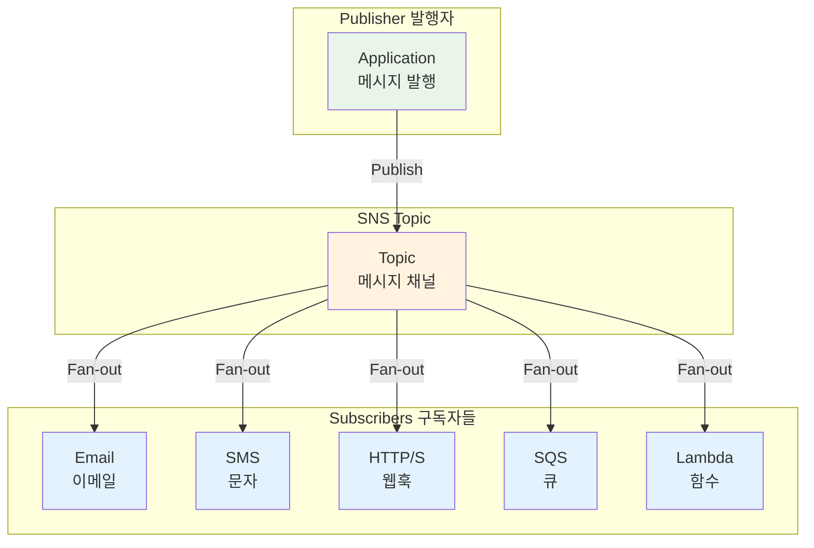
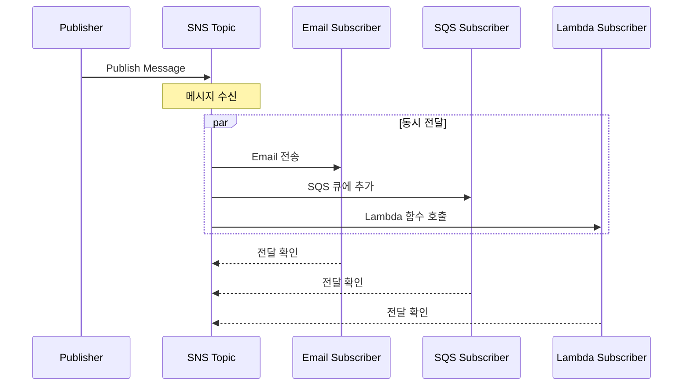

# November Week 2 Day 1 Session 2: SNS (Simple Notification Service)

<div align="center">

**📢 Pub/Sub 메시징** • **🔔 다중 구독자** • **🌐 Fan-out 패턴**

*하나의 메시지를 여러 구독자에게 동시에 전달하는 관리형 알림 서비스*

</div>

---

## 🕘 세션 정보
**시간**: 09:50-10:40 (50분)
**목표**: AWS SNS의 Pub/Sub 패턴과 SQS 연동 방법 이해
**방식**: 개념 설명 + 실무 사례 + 아키텍처 패턴

## 🎯 학습 목표
- SNS의 생성 배경과 Pub/Sub 패턴 이해
- Topic과 Subscription의 개념 파악
- 다양한 프로토콜(Email, SMS, HTTP, SQS, Lambda) 이해
- SNS와 SQS를 함께 사용하는 Fan-out 패턴 습득
- 비용 구조와 최적화 방법 학습

---

## 📖 서비스 개요

### 1. 생성 배경 (Why?) - 5분

**문제 상황**:
- **일대다 통신의 복잡성**: 하나의 이벤트를 여러 시스템에 알려야 할 때 각각 호출 필요
- **강한 결합**: 발행자가 모든 구독자를 알고 있어야 함
- **확장성 문제**: 새로운 구독자 추가 시 발행자 코드 수정 필요
- **실패 처리 어려움**: 한 구독자 실패 시 전체 프로세스 영향

**AWS SNS 솔루션**:
- **Pub/Sub 패턴**: 발행자와 구독자 간 느슨한 결합
- **Fan-out**: 하나의 메시지를 여러 구독자에게 동시 전달
- **다양한 프로토콜**: Email, SMS, HTTP, SQS, Lambda 등 지원
- **자동 재시도**: 전달 실패 시 자동 재시도

### 2. 핵심 원리 (How?) - 10분

**SNS 작동 원리**:



**핵심 구성 요소**:

1. **Publisher (발행자)**:
   - Topic에 메시지를 발행하는 애플리케이션
   - 구독자를 알 필요 없음

2. **Topic (주제)**:
   - 메시지를 전달하는 논리적 채널
   - 여러 구독자를 가질 수 있음
   - Standard와 FIFO 타입 지원

3. **Subscription (구독)**:
   - Topic과 Endpoint를 연결
   - 프로토콜과 엔드포인트 지정

4. **Endpoint (엔드포인트)**:
   - 메시지를 받는 대상
   - Email, SMS, HTTP, SQS, Lambda 등

**메시지 전달 흐름**:


### 3. 주요 사용 사례 (When?) - 5분

**적합한 경우**:

1. **애플리케이션 통합 (Fan-out)**:
   - 하나의 이벤트를 여러 시스템에 전파
   - 마이크로서비스 간 이벤트 브로드캐스트

2. **알림 시스템**:
   - 사용자에게 이메일, SMS, 푸시 알림 동시 발송
   - 시스템 알람을 여러 채널로 전달

3. **이벤트 기반 아키텍처**:
   - 주문 완료 → 이메일, 재고 업데이트, 배송 시작
   - 파일 업로드 → 썸네일 생성, 메타데이터 추출, 알림

4. **모니터링 및 알람**:
   - CloudWatch 알람을 여러 담당자에게 전달
   - 시스템 장애 시 다양한 채널로 알림

**실제 사례**:
- **Netflix**: 동영상 인코딩 완료 알림을 여러 시스템에 전파
- **Airbnb**: 예약 확인을 이메일, SMS, 앱 푸시로 동시 발송
- **Uber**: 운전자 매칭 이벤트를 여러 마이크로서비스에 브로드캐스트

### 4. 비슷한 서비스 비교 (Which?) - 5분

**AWS 내 대안 서비스**:

**SNS vs SQS**:
- **SNS 사용**: 한 번에 여러 곳에 전달 (1:N), 즉시 전달, Push 방식
- **SQS 사용**: 하나씩 처리 (1:1), 나중에 처리, Pull 방식

**SNS vs EventBridge**:
- **SNS 사용**: 간단한 Pub/Sub, 빠른 전달, 프로토콜 다양
- **EventBridge 사용**: 복잡한 라우팅, 규칙 기반 필터링, AWS 서비스 통합

**SNS vs Kinesis**:
- **SNS 사용**: 즉시 전달, 간단한 메시지, 여러 프로토콜
- **Kinesis 사용**: 스트림 처리, 대용량 데이터, 순서 보장

**선택 기준**:
| 기준 | SNS | SQS | EventBridge | Kinesis |
|------|-----|-----|-------------|---------|
| 전달 방식 | Push (1:N) | Pull (1:1) | Push (규칙 기반) | Pull (스트림) |
| 구독자 수 | 무제한 | 1개 | 무제한 | 여러 Consumer |
| 프로토콜 | 다양 (Email, SMS 등) | SQS만 | AWS 서비스 | Kinesis만 |
| 메시지 보관 | 즉시 전달 | 최대 14일 | 최대 24시간 | 최대 365일 |
| 순서 보장 | FIFO 가능 | FIFO 가능 | 불가능 | 샤드 내 보장 |
| 필터링 | 구독 필터 | 없음 | 규칙 기반 | 없음 |

### 5. 장단점 분석 - 3분

**장점**:
- ✅ **간단한 Pub/Sub**: 발행자와 구독자 간 느슨한 결합
- ✅ **다양한 프로토콜**: Email, SMS, HTTP, SQS, Lambda 등
- ✅ **무제한 구독자**: Topic당 구독자 수 제한 없음
- ✅ **자동 재시도**: 전달 실패 시 자동 재시도
- ✅ **저렴한 비용**: 요청당 과금, 프리티어 제공

**단점/제약사항**:
- ⚠️ **메시지 보관 없음**: 즉시 전달만 가능, 나중에 조회 불가
- ⚠️ **순서 보장 제한**: Standard Topic은 순서 보장 안 됨
- ⚠️ **메시지 크기 제한**: 최대 256KB
- ⚠️ **SMS 비용**: 문자 발송 시 추가 비용 발생

**대안**:
- 메시지 보관 필요: SNS + SQS 조합 사용
- 순서 보장: FIFO Topic 사용
- 큰 메시지: S3 참조 전송

### 6. 비용 구조 💰 - 5분

**과금 방식**:
- **API 요청**: Publish 100만 건당 $0.50
- **HTTP/S 전달**: 100만 건당 $0.60
- **Email 전달**: 100만 건당 $2.00
- **SMS 전달**: 건당 약 $0.00645 (국가별 상이)
- **모바일 푸시**: 100만 건당 $0.50

**프리티어 혜택** (매월):
- Publish: 100만 건 무료
- HTTP/S 전달: 10만 건 무료
- Email 전달: 1,000건 무료

**비용 최적화 팁**:
1. **메시지 배치**: 여러 메시지를 하나로 묶어 전송
2. **필터링 활용**: 불필요한 전달 방지
3. **SMS 최소화**: 비용이 높으므로 중요한 알림만
4. **SQS 조합**: 재시도가 필요한 경우 SQS 사용
5. **적절한 프로토콜**: 비용 효율적인 프로토콜 선택

**예상 비용 계산**:
```
월간 100만 건 메시지 발행 시:
- Publish: 100만 건 → $0 (프리티어)
- HTTP 전달 (10만 건): $0 (프리티어)
- Email 전달 (1,000건): $0 (프리티어)
- SMS 전달 (1,000건): $6.45
총 비용: $6.45/월
```

**실제 사용 예시**:
| 시나리오 | 월간 메시지 | 프로토콜 | 예상 비용 |
|----------|-------------|----------|-----------|
| 소규모 앱 | 50만 건 | HTTP | $0 (프리티어) |
| 중규모 앱 | 500만 건 | HTTP + Email | $5.00 |
| 대규모 앱 | 5,000만 건 | HTTP + SMS | $350.00 |

### 7. 최신 업데이트 🆕 - 2분

**2024년 주요 변경사항**:
- **Message Data Protection**: 민감 데이터 자동 탐지 및 마스킹
- **Archive and Replay**: FIFO Topic 메시지 아카이브 및 재생
- **Enhanced Filtering**: 더 복잡한 필터 표현식 지원

**2025년 예정**:
- **더 큰 메시지 크기**: 1MB까지 지원 검토 중
- **더 많은 프로토콜**: 추가 프로토콜 지원 예정

**참조**: [AWS SNS What's New](https://aws.amazon.com/sns/whats-new/)

### 8. 잘 사용하는 방법 ✅ - 3분

**베스트 프랙티스**:
1. **필터 정책 사용**: 구독자가 필요한 메시지만 받도록 필터링
2. **Dead Letter Queue 설정**: 전달 실패 메시지 추적
3. **메시지 속성 활용**: 메타데이터를 속성으로 전달
4. **재시도 정책 설정**: 전달 실패 시 재시도 횟수 및 간격 조정
5. **CloudWatch 모니터링**: 전달 성공률, 실패율 추적

**실무 팁**:
- **SNS + SQS 조합**: Fan-out 패턴으로 안정성 확보
- **메시지 중복 제거**: FIFO Topic 사용 또는 멱등성 처리
- **구독 확인**: Email, HTTP 구독 시 확인 절차 필요
- **IAM 정책**: 최소 권한 원칙 적용

**코드 예시**:
```python
import boto3
import json

sns = boto3.client('sns')

# Topic 생성
response = sns.create_topic(Name='order-events')
topic_arn = response['TopicArn']

# 구독 추가 (SQS)
sns.subscribe(
    TopicArn=topic_arn,
    Protocol='sqs',
    Endpoint='arn:aws:sqs:ap-northeast-2:123456789012:email-queue',
    Attributes={
        'FilterPolicy': json.dumps({
            'event_type': ['order_completed']
        })
    }
)

# 메시지 발행
sns.publish(
    TopicArn=topic_arn,
    Message=json.dumps({
        'order_id': '12345',
        'customer_email': 'customer@example.com'
    }),
    MessageAttributes={
        'event_type': {
            'DataType': 'String',
            'StringValue': 'order_completed'
        }
    }
)
```

### 9. 잘못 사용하는 방법 ❌ - 3분

**흔한 실수**:
1. **필터 없이 모든 메시지 전달**: 불필요한 처리 및 비용 발생
2. **SMS 남용**: 비용이 높으므로 중요한 알림만 사용
3. **재시도 정책 미설정**: 일시적 장애 시 메시지 손실
4. **구독 확인 무시**: Email, HTTP 구독 시 확인 필요
5. **메시지 크기 초과**: 256KB 제한 초과하여 실패

**안티 패턴**:
- **SNS를 큐처럼 사용**: 메시지 보관 안 되므로 SQS 사용 필요
- **순서 보장 필요한데 Standard 사용**: FIFO Topic 사용 필요
- **동기 처리 기대**: SNS는 비동기 전달, 즉시 응답 불가
- **모든 알림을 SMS로**: 비용 폭탄, Email이나 푸시 알림 우선

**보안 취약점**:
- **암호화 미사용**: 민감 데이터 평문 전송
- **IAM 정책 과도한 권한**: 모든 Topic 접근 허용
- **HTTP 엔드포인트 검증 없음**: 악의적 요청 수신 가능

### 10. 구성 요소 상세 - 5분

**주요 구성 요소**:

**1. Topic Types (토픽 타입)**:

**Standard Topic**:
- **특징**: 무제한 처리량, Best-Effort 순서, 중복 가능
- **사용 시기**: 높은 처리량 필요, 순서 무관
- **예시**: 시스템 알람, 로그 수집

**FIFO Topic**:
- **특징**: 순서 보장, 중복 제거, 제한된 처리량
- **사용 시기**: 순서 중요, 중복 불가
- **예시**: 금융 거래, 주문 처리

**2. Subscription Protocols (구독 프로토콜)**:

**Email/Email-JSON**:
- **용도**: 사람에게 알림
- **비용**: 100만 건당 $2.00
- **제약**: 구독 확인 필요

**SMS**:
- **용도**: 긴급 알림
- **비용**: 건당 약 $0.00645
- **제약**: 국가별 규제

**HTTP/HTTPS**:
- **용도**: 웹훅, 외부 시스템 연동
- **비용**: 100만 건당 $0.60
- **제약**: 엔드포인트 검증 필요

**SQS**:
- **용도**: 안정적 메시지 전달
- **비용**: 100만 건당 $0.50
- **장점**: 재시도, 순서 보장

**Lambda**:
- **용도**: 서버리스 처리
- **비용**: 100만 건당 $0.50
- **장점**: 자동 확장, 코드 실행

**3. Message Filtering (메시지 필터링)**:
- **역할**: 구독자가 필요한 메시지만 수신
- **방식**: JSON 필터 정책
- **예시**:
```json
{
  "event_type": ["order_completed", "order_cancelled"],
  "amount": [{"numeric": [">", 100]}]
}
```

**4. Delivery Retry Policy (전달 재시도 정책)**:
- **역할**: 전달 실패 시 자동 재시도
- **설정**: 재시도 횟수, 간격, 백오프
- **기본값**: HTTP는 3회, 다른 프로토콜은 100회

**5. Dead Letter Queue (DLQ)**:
- **역할**: 재시도 실패 메시지 저장
- **설정**: SQS 큐 지정
- **활용**: 실패 원인 분석, 수동 재처리

### 11. 공식 문서 링크 (필수 5개)

**⚠️ 학생들이 직접 확인해야 할 공식 문서**:
- 📘 [SNS란 무엇인가?](https://docs.aws.amazon.com/sns/latest/dg/welcome.html)
- 📗 [SNS 사용자 가이드](https://docs.aws.amazon.com/sns/latest/dg/)
- 📙 [SNS API 레퍼런스](https://docs.aws.amazon.com/sns/latest/api/)
- 📕 [SNS 요금](https://aws.amazon.com/sns/pricing/)
- 🆕 [SNS 최신 업데이트](https://aws.amazon.com/sns/whats-new/)

---

## 💭 함께 생각해보기

**토론 주제**:
1. SQS와 SNS를 함께 사용하는 Fan-out 패턴의 장점은?
2. 어떤 상황에서 어떤 프로토콜을 선택해야 할까?
3. 메시지 필터링을 어떻게 활용할 수 있을까?

---

## 🔑 핵심 키워드

- **SNS (Simple Notification Service)**: AWS 관리형 Pub/Sub 메시징 서비스
- **Topic**: 메시지를 발행하는 논리적 채널
- **Subscription**: Topic과 Endpoint를 연결하는 구독
- **Publisher**: Topic에 메시지를 발행하는 애플리케이션
- **Subscriber**: Topic을 구독하여 메시지를 받는 엔드포인트
- **Fan-out**: 하나의 메시지를 여러 구독자에게 동시 전달
- **Filter Policy**: 구독자가 받을 메시지를 필터링하는 정책
- **FIFO Topic**: 순서 보장 및 중복 제거 토픽

---

## 📝 세션 마무리

### ✅ 오늘 세션 성과
- [ ] SNS의 Pub/Sub 패턴 이해
- [ ] Topic과 Subscription 개념 파악
- [ ] 다양한 프로토콜 이해
- [ ] SNS + SQS Fan-out 패턴 습득
- [ ] 비용 구조와 최적화 방법 학습

### 🎯 다음 세션 준비
**Session 3: EventBridge**
- 이벤트 기반 아키텍처
- 규칙 기반 라우팅
- AWS 서비스 통합

---

<div align="center">

**📢 Pub/Sub 메시징** • **🔔 다중 구독자** • **🌐 Fan-out 패턴**

*SNS로 확장 가능한 이벤트 기반 아키텍처 구축*

</div>
