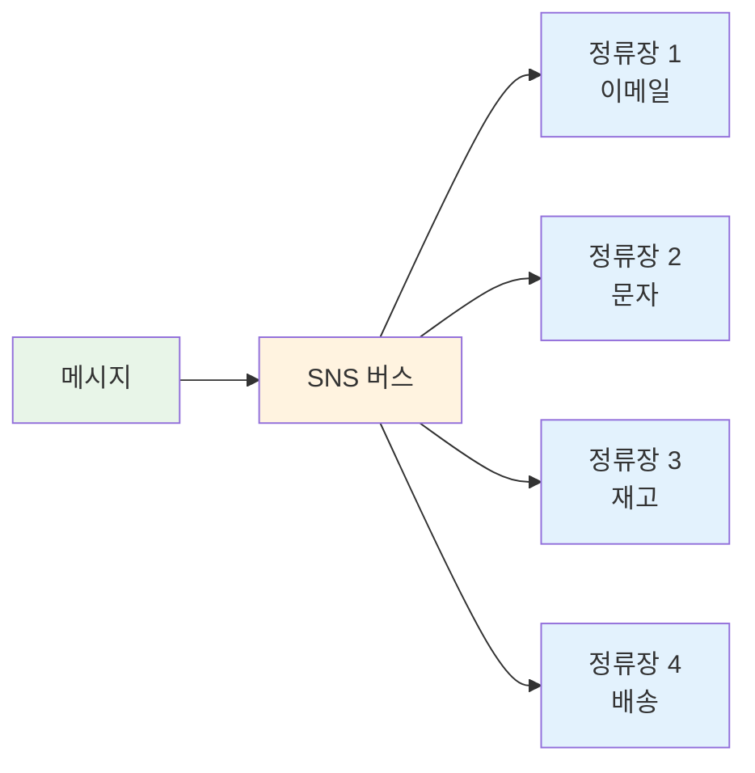
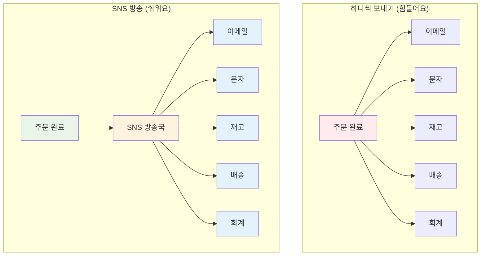
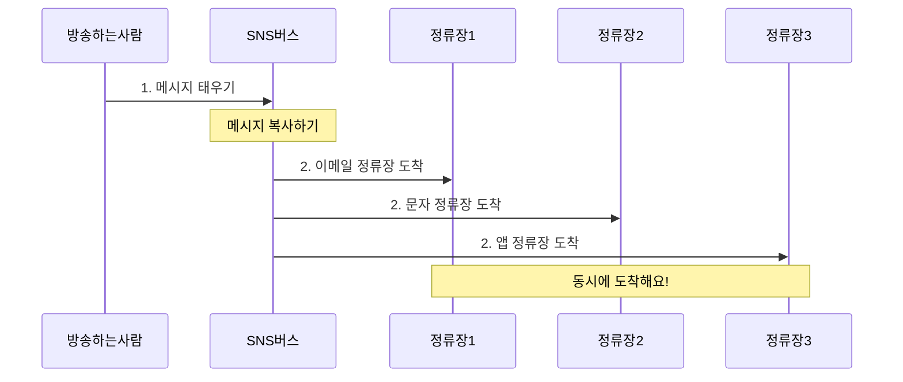
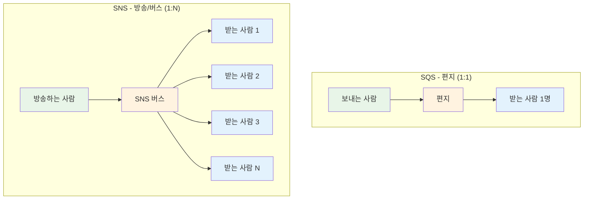
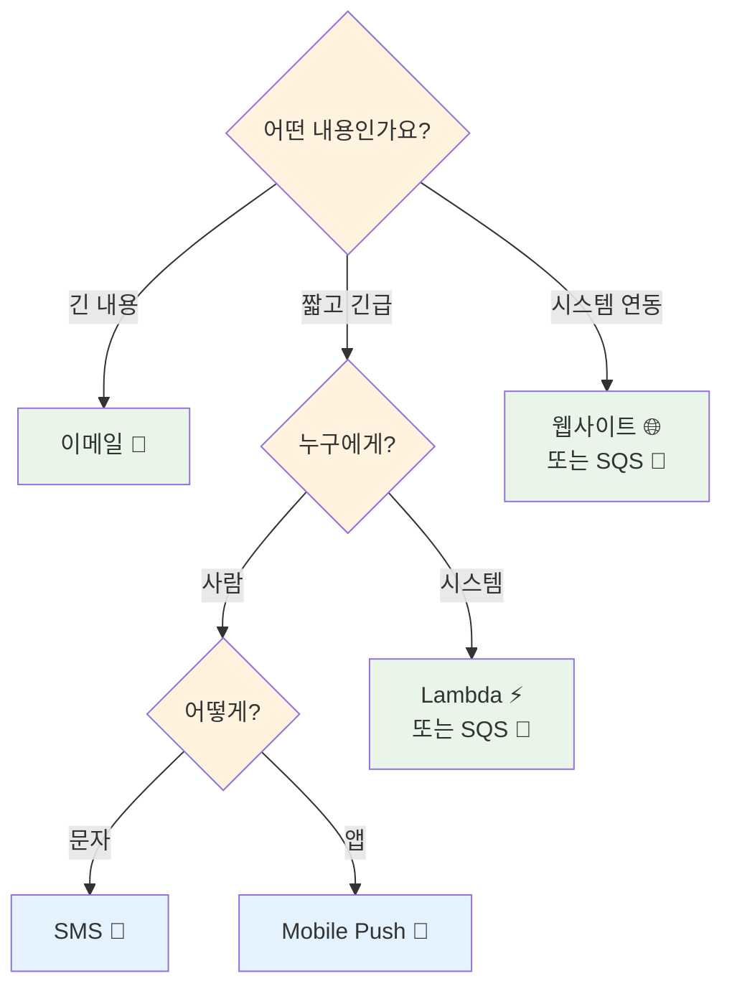
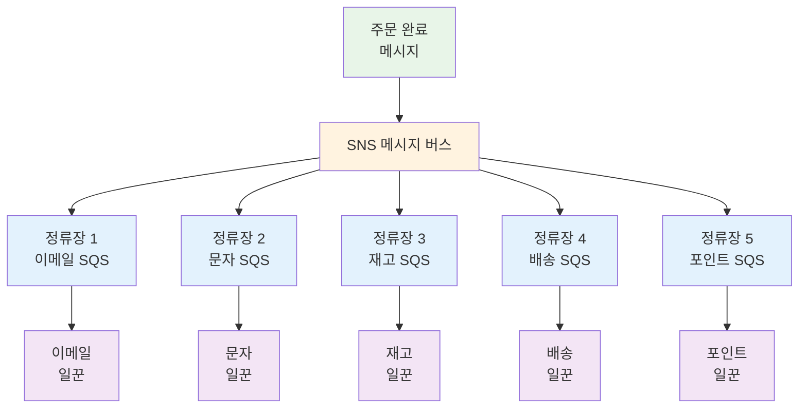
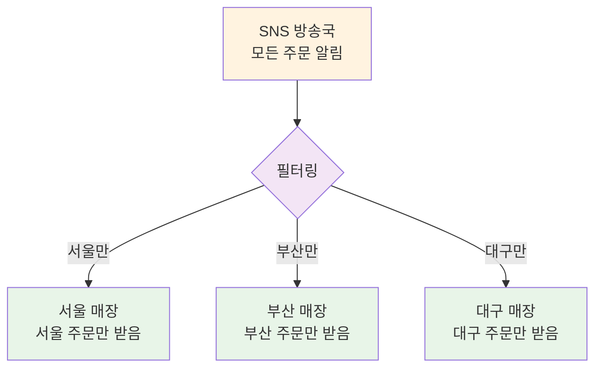

# November Week 2 Day 1 Session 2: SNS (Simple Notification Service)

<div align="center">

**📢 방송하기** • **🔔 알림 보내기** • **🌐 여러 명에게 한번에**

*TV 방송처럼 한 번에 여러 사람에게, SNS로 알림 시스템 만들기*

</div>

---

## 🕘 Session 정보
**시간**: 09:40-10:20 (40분)
**목표**: 한 번에 여러 사람에게 메시지 보내는 방법 이해하기
**방식**: 실생활 비유 + 그림 + 간단한 예시

## 🎯 학습 목표

### 📚 이해 목표
- SNS가 뭔지 알기 (방송국 같은 거!)
- 왜 필요한지 이해하기 (한 번에 여러 명에게)
- 여러 가지 전달 방법 알기 (이메일, 문자, 앱)
- SQS와 함께 사용하는 방법 알기

### 🛠️ 적용 목표
- 언제 사용하면 좋을지 판단하기
- 어떤 전달 방법을 선택할지 알기
- SQS와 SNS를 함께 사용하기

---

## 🤔 왜 필요한가? (5분)

### 🏠 실생활 비유 1: TV 방송국

**편지로 알리기** (느리고 힘들어요):
```
학교 공지사항을 전달하려면:
- 학생 1에게 편지 쓰기
- 학생 2에게 편지 쓰기
- 학생 3에게 편지 쓰기
- ... (100명에게 편지 쓰기)
시간: 하루 종일 😱
```

**방송으로 알리기** (빠르고 쉬워요):
```
학교 방송:
- 마이크 앞에서 한 번만 말하기
- 모든 학생이 동시에 듣기
시간: 1분 ✅
```

### 🚌 실생활 비유 2: 메시지 버스 (Message Bus)

**택시로 이동하기** (비효율적):
```
회사 직원들이 출근하려면:
- 직원 1: 택시 1대 (집 → 회사)
- 직원 2: 택시 1대 (집 → 회사)
- 직원 3: 택시 1대 (집 → 회사)
- ... (100명이 각자 택시)
비용: 엄청 비싸요 😱
```

**버스로 이동하기** (효율적):
```
회사 셔틀버스:
- 버스 1대가 여러 정류장 순회
- 각 정류장에서 직원들 태우기
- 모두 회사에 도착
비용: 훨씬 저렴해요 ✅
```

**SNS는 메시지 버스**:


**메시지 버스의 특징**:
- 🚌 **한 번에 여러 곳**: 버스가 여러 정류장을 순회하듯이
- 🔄 **정해진 경로**: 구독한 곳만 메시지를 받아요
- ⚡ **효율적**: 하나의 메시지로 여러 시스템에 전달
- 🎯 **독립적**: 한 정류장이 문제 있어도 다른 곳은 괜찮아요

### 💼 실제 예시: 쿠팡 주문 알림

**문제 상황 - 하나씩 보내기**:
```
주문 완료 시 알려야 할 곳:
1. 고객 이메일 → 코드 작성
2. 고객 문자 → 코드 작성
3. 관리자 대시보드 → 코드 작성
4. 재고 시스템 → 코드 작성
5. 배송 시스템 → 코드 작성
6. 회계 시스템 → 코드 작성

새로운 곳 추가하려면?
→ 코드를 또 수정해야 해요 😱
```

**SNS 사용하기 - 방송하기**:
```
주문 완료 시:
1. SNS에 한 번만 "주문 완료!" 방송
2. 구독한 모든 곳이 자동으로 받기
3. 새로운 곳 추가?
   → 구독만 하면 끝! (코드 수정 필요 없음) ✅
```

**그림으로 보기**:


### 🎯 SNS의 장점

1. **한 번만 보내요**: 여러 번 코드 쓸 필요 없어요
2. **쉽게 추가해요**: 새로운 구독자 추가가 간단해요
3. **독립적이에요**: 한 곳이 문제 있어도 다른 곳은 괜찮아요
4. **빨라요**: 모두에게 동시에 전달돼요

---

## 📖 핵심 개념 (25분)

### 🔍 개념 1: SNS가 뭔가요? (5분)

> **쉽게 말하면**: AWS가 관리해주는 "방송국" 또는 "메시지 버스"

**두 가지 비유로 이해하기**:

**1. 방송국 비유** 📺
- **방송국** (Topic): 메시지를 방송하는 곳
- **방송하는 사람** (Publisher): 방송국에서 메시지를 말하는 사람
- **듣는 사람** (Subscriber): 방송을 듣는 사람들

**2. 메시지 버스 비유** 🚌
- **버스** (Topic): 메시지를 실어 나르는 버스
- **버스 기사** (Publisher): 메시지를 버스에 태우는 사람
- **정류장** (Subscriber): 메시지를 받는 각 시스템
- **승객** (Message): 버스를 타고 여러 정류장으로 가는 메시지

**어떻게 작동하나요?**:


**실생활 예시**:
```
신문 배달 (방송국 비유):
1. 신문사: 신문 발행 (방송하는 사람)
2. 배달부: 구독자들에게 배달 (방송국)
3. 구독자들: 신문 받기 (듣는 사람)

회사 셔틀버스 (메시지 버스 비유):
1. 버스 기사: 직원들 태우기 (메시지 발행)
2. 셔틀버스: 여러 정류장 순회 (SNS)
3. 각 정류장: 직원들 내리기 (구독자들)
```

**SQS와 비교하기**:


**차이점 정리**:
```
SQS (편지):
- 특정 한 사람에게만 보내요 (1:1)
- 예: 친구에게 편지 쓰기
- 사용: 특정 작업을 특정 일꾼에게

SNS (방송/버스):
- 여러 사람에게 동시에 보내요 (1:N)
- 예: TV 방송, 학교 방송, 셔틀버스
- 사용: 여러 시스템에 동시 알림
```

**메시지 버스로서의 SNS 장점**:
- 🚌 **효율적인 전달**: 하나의 메시지로 여러 시스템에 동시 전달
- 🔄 **느슨한 결합**: 발행자와 구독자가 서로 몰라도 돼요
- ⚡ **확장 가능**: 새로운 정류장(구독자) 추가가 쉬워요
- 🎯 **독립적 처리**: 각 정류장이 독립적으로 메시지 처리

### 🔍 개념 2: 여러 가지 전달 방법 (5분)

> **쉽게 말하면**: 이메일로? 문자로? 앱으로? 선택할 수 있어요

#### 전달 방법 6가지

**1. 이메일** 📧
- **언제**: 긴 내용, 보고서
- **장점**: 자세히 쓸 수 있어요
- **단점**: 바로 안 볼 수도 있어요

```
예시: 주문 확인 이메일
- 주문 내역
- 배송 정보
- 영수증
```

**2. 문자 (SMS)** 📱
- **언제**: 긴급 알림, 인증번호
- **장점**: 바로 확인해요
- **단점**: 비용이 들어요, 짧게만 써요 (160자)

```
예시: 배송 알림
"주문하신 상품이 배송 시작되었습니다"
```

**3. 웹사이트 알림 (HTTP/HTTPS)** 🌐
- **언제**: 다른 시스템과 연결
- **장점**: 자유롭게 사용 가능
- **단점**: 웹사이트가 켜져 있어야 해요

```
예시: 재고 시스템 업데이트
주문 완료 → 재고 시스템에 자동 알림
```

**4. 할 일 목록 (SQS)** 📨
- **언제**: 나중에 처리할 일
- **장점**: 가장 안전해요, 다시 시도 가능
- **단점**: 추가 비용

```
예시: 이메일 발송 작업
주문 완료 → 이메일 발송 목록에 추가
```

**5. 자동 실행 (Lambda)** ⚡
- **언제**: 자동으로 뭔가 실행
- **장점**: 서버 필요 없어요
- **단점**: 15분 이상 걸리는 일은 못 해요

```
예시: 포인트 자동 적립
주문 완료 → 자동으로 포인트 계산해서 적립
```

**6. 앱 알림 (Mobile Push)** 📲
- **언제**: 스마트폰 앱 알림
- **장점**: 바로 확인해요
- **단점**: 앱이 설치되어 있어야 해요

```
예시: 배달 앱 알림
"주문하신 음식이 곧 도착합니다!"
```

#### 어떤 걸 선택할까요?

| 전달 방법 | 언제 사용? | 장점 | 단점 |
|---------|----------|------|------|
| **이메일** | 긴 내용 | 자세히 쓸 수 있음 | 바로 안 봄 |
| **문자** | 긴급 알림 | 바로 확인 | 비용, 짧게만 |
| **웹사이트** | 시스템 연결 | 자유로움 | 항상 켜져 있어야 함 |
| **할 일 목록** | 나중에 처리 | 안전함 | 추가 비용 |
| **자동 실행** | 자동 처리 | 서버 필요 없음 | 시간 제한 |
| **앱 알림** | 스마트폰 | 바로 확인 | 앱 필요 |

**전달 방법 선택 가이드**:


### 🔍 개념 3: SQS와 함께 사용하기 (부채꼴 전달 & 메시지 버스) (5분)

> **쉽게 말하면**: 한 번 방송하면 여러 할 일 목록에 동시에 들어가요 (메시지 버스처럼!)

**왜 필요한가요?**

**문제 상황**:
```
주문 완료 시 해야 할 일:
1. 이메일 보내기 (5초)
2. 문자 보내기 (3초)
3. 재고 빼기 (2초)
4. 배송 준비 (4초)
5. 포인트 주기 (1초)

하나씩 하면: 15초 😱
```

**SNS + SQS 함께 사용 (메시지 버스 패턴)**:
```
SNS 버스에 메시지 태우기 (0.1초)
    ↓
버스가 5개 정류장(SQS)에 동시 도착
    ↓
각 정류장의 일꾼이 동시에 처리
    ↓
전체 시간: 가장 긴 일 시간 (5초) ✅
```

**그림으로 보기 - 메시지 버스 패턴**:


**실생활 예시 1 - 학교 급식**:
```
학교 급식 시간:
- 선생님: "급식 시간입니다!" (방송)
- 1학년 줄, 2학년 줄, 3학년 줄 (각각의 할 일 목록)
- 각 학년이 동시에 급식실로 이동 (동시 처리)
→ 빨리 끝나요!
```

**실생활 예시 2 - 회사 셔틀버스**:
```
회사 셔틀버스:
- 버스 기사: "출발합니다!" (메시지 발행)
- 버스: 여러 정류장 순회 (SNS)
- 각 정류장: 직원들 내리기 (SQS에 메시지 전달)
- 각 부서: 직원들 업무 시작 (독립적 처리)
→ 효율적이에요!
```

**메시지 버스 패턴의 장점**:
1. **동시에 처리**: 모든 일이 동시에 시작돼요 (버스가 모든 정류장에 동시 도착)
2. **독립적**: 한 정류장이 문제 있어도 다른 정류장은 괜찮아요
3. **쉽게 추가**: 새로운 정류장(구독자) 추가가 간단해요
4. **안전함**: SQS의 안전한 보관 기능 사용 (정류장에서 대기)
5. **느슨한 결합**: 발행자는 구독자를 몰라도 돼요 (버스 기사는 승객 목적지 몰라도 됨)

**간단한 설정 방법**:
```
1. SNS 메시지 버스 만들기 (Topic)
2. 여러 개의 정류장 만들기 (SQS Queue)
   - 이메일 정류장
   - 문자 정류장
   - 재고 정류장
   - 배송 정류장
   - 포인트 정류장
3. 각 정류장이 버스 노선 구독하기
4. 메시지를 버스에 태우면 모든 정류장에 자동으로 도착해요!
```

**실무에서 메시지 버스 활용**:
```
마이크로서비스 아키텍처:
- 주문 서비스: SNS에 "주문 완료" 메시지 발행
- SNS 버스: 메시지를 여러 서비스에 전달
- 각 서비스: 독립적으로 메시지 처리
  * 이메일 서비스: 확인 메일 발송
  * 재고 서비스: 재고 차감
  * 배송 서비스: 배송 준비
  * 포인트 서비스: 포인트 적립
→ 서비스 간 느슨한 결합 유지!
```

### 🔍 개념 4: 원하는 메시지만 받기 (10분)

> **쉽게 말하면**: 내가 관심 있는 것만 받을 수 있어요

**왜 필요한가요?**

**문제 상황**:
```
서울 매장 직원:
- 서울 주문 알림 필요 ✅
- 부산 주문 알림 필요 없음 ❌
- 하지만 모든 알림을 다 받고 있어요 😱
```

**필터링 사용**:


**결과**:
```
서울 매장 직원:
- 구독 설정: "서울 주문만 받기"
- 결과: 서울 주문만 받아요 ✅

부산 매장 직원:
- 구독 설정: "부산 주문만 받기"
- 결과: 부산 주문만 받아요 ✅
```

**실생활 예시**:
```
유튜브 구독:
- 모든 영상 알림 받기 (필터 없음)
- 특정 주제 영상만 알림 받기 (필터 사용)
→ 내가 원하는 것만 받아요!
```

**설정 예시** (간단하게):
```
서울 매장 구독 설정:
- 매장: "서울"만
- 금액: "10만원 이상"만
→ 서울 매장의 10만원 이상 주문만 받아요
```

**장점**:
- ✅ 필요한 것만 받아요
- ✅ 불필요한 처리 안 해요
- ✅ 비용 절약돼요

---

## 💭 함께 생각해보기 (10분)

### 🤝 페어 토론 (5분)

**쉬운 질문들**:

1. **일상 생활에서 찾기**:
   - 우리 주변에서 "방송"으로 알리는 것은?
   - 한 명에게 말하는 것 vs 여러 명에게 방송하는 것
   - 어떤 게 더 편할까요?

2. **간단한 시나리오**:
   - 생일 파티 초대장을 보낸다면:
     * 한 명씩 전화하기? (SQS)
     * 단체 카톡 보내기? (SNS)
   - 어떤 게 더 빠를까요?

3. **전달 방법 선택하기**:
   - 긴급한 알림: 이메일? 문자?
   - 긴 내용: 이메일? 문자?
   - 앱 알림: 언제 사용하면 좋을까요?

**페어 활동 가이드**:
- 👥 2명씩 편하게 짝 지어요
- 🔄 각자 생각을 이야기해요
- 📝 재미있는 아이디어를 메모해요

### 🎯 전체 공유 (5분)

**공유 내용**:
- 각 팀이 찾은 방송 예시
- SQS vs SNS 선택 이유
- 전달 방법 선택 아이디어

**💡 이해도 체크 질문**:
- ✅ "SNS가 뭔지 친구에게 설명할 수 있나요?"
- ✅ "SQS와 SNS의 차이를 알겠나요?"
- ✅ "언제 SNS를 사용하면 좋을지 알겠나요?"

---

## 🔑 핵심 키워드

### 📝 오늘 배운 용어 (쉽게 정리)

**기본 용어**:
- **SNS**: AWS가 관리해주는 "방송국"
- **방송국 (Topic)**: 메시지를 방송하는 곳
- **방송하는 사람**: 방송국에서 메시지를 말하는 사람
- **듣는 사람**: 방송을 듣는 사람들
- **구독**: 방송을 듣기 위해 신청하는 것

**전달 방법**:
- **이메일**: 긴 내용 보내기
- **문자**: 긴급 알림
- **웹사이트**: 다른 시스템과 연결
- **할 일 목록**: 나중에 처리할 일
- **자동 실행**: 자동으로 뭔가 실행
- **앱 알림**: 스마트폰 알림

**패턴**:
- **방송 패턴**: 한 번 말하면 여러 명이 듣기
- **부채꼴 전달**: 하나가 여러 곳으로 퍼지기
- **필터링**: 원하는 것만 받기

---

## 🚀 실무에서는 어떻게 사용하나요?

### 💡 실제 회사 사례

**사례 1: 배달의민족**
- **사용**: 주문 알림을 고객, 가게, 배달원에게 동시에
- **효과**: 빠른 알림, 효율적인 시스템

**사례 2: 쿠팡**
- **사용**: 배송 상태를 여러 시스템에 동시에 알림
- **효과**: 실시간 배송 추적

**사례 3: 작은 쇼핑몰**
- **사용**: 주문 알림, 재고 알림
- **비용**: 한 달에 2만원 이하
- **효과**: 자동화된 알림 시스템

### 🔧 더 잘 사용하는 방법

**1. 필터링 활용**:
```
✅ 좋은 방법: 필요한 것만 받기
- 서울 매장: 서울 주문만
- 부산 매장: 부산 주문만
→ 효율적이에요!
```

**2. 실패 대비**:
```
✅ 좋은 방법: SQS와 함께 사용
- SNS → SQS → 처리
- 실패하면 다시 시도
→ 안전해요!
```

**3. 보안 강화**:
```
✅ 메시지를 암호화해요
✅ 권한이 있는 사람만 받아요
✅ 누가 언제 받았는지 기록해요
```

### 💰 비용은 얼마나 나올까요?

**비용 계산**:
- 방송 100만 번: 500원
- 이메일 100만 통: 2,000원
- 문자 1통: 6.45원 (한국 기준)
- SQS/Lambda로 보내기: 무료!

**예시**:
```
작은 쇼핑몰 (하루 1,000개 주문):
- 한 달 방송: 30,000번
- 비용: 약 15원
→ 거의 공짜! 😊
```

**절약 팁**:
```
✅ SQS/Lambda 사용 (무료)
✅ 필터링으로 불필요한 전달 줄이기
✅ 여러 개를 한번에 보내기
```

### 🆕 최신 업데이트 (2024-2025)

**2025년 새로운 기능**:

1. **다른 나라로도 보내기** (2025.07)
   - 한국 → 미국으로도 메시지 보내기 가능
   - 전 세계 서비스 만들기 쉬워졌어요

2. **IPv6 지원** (2025.04)
   - 더 많은 기기와 연결 가능
   - 네트워크가 더 빨라졌어요

**2024년 새로운 기능**:

1. **순서 지키면서 빠르게** (2024년 중반)
   - 순서를 지키면서도 더 빨라졌어요
   - 초당 30,000개 처리 가능!

2. **문자 기능 강화** (2024.09)
   - 문자 보내기가 더 좋아졌어요
   - 양방향 문자 가능 (답장 받기)

3. **데이터 저장 쉬워짐** (2024.11)
   - 메시지를 자동으로 저장할 수 있어요
   - 나중에 분석하기 좋아요

---

## 📝 Session 마무리

### ✅ 오늘 배운 것

- [ ] SNS가 뭔지 알았어요 (방송국)
- [ ] 왜 필요한지 이해했어요 (한 번에 여러 명에게)
- [ ] 여러 가지 전달 방법을 알았어요 (이메일, 문자, 앱 등)
- [ ] SQS와 함께 사용하는 방법을 알았어요 (부채꼴 전달)
- [ ] 필터링으로 원하는 것만 받을 수 있어요

### 🎯 다음 Session 준비

**Session 3: Terraform 기초**
- 인프라를 코드로 관리하기
- 왜 필요한지 이해하기
- Terraform 기본 개념 알기

**연결 포인트**:
- Session 1-2에서 배운 SQS, SNS를 Terraform으로 만들기
- 코드로 관리하면 더 편해요!

---

## 🔗 더 알아보기

### 📚 AWS 공식 문서
- 📘 [SNS가 뭔가요?](https://docs.aws.amazon.com/sns/latest/dg/welcome.html)
- 📗 [SNS 사용 방법](https://docs.aws.amazon.com/sns/latest/dg/)
- 📕 [SNS 비용](https://aws.amazon.com/sns/pricing/)

### 🎯 추가 학습 자료
- [SNS 잘 사용하는 방법](https://docs.aws.amazon.com/sns/latest/dg/sns-best-practices.html)
- [SNS + SQS 함께 사용하기](https://docs.aws.amazon.com/sns/latest/dg/sns-sqs-as-subscriber.html)

---

<div align="center">

**📢 방송하기** • **🔔 알림 보내기** • **🌐 여러 명에게** • **🔄 SQS 통합**

*Session 2 완료 - 다음은 Terraform으로 인프라를 코드로 관리하기!*

</div>
