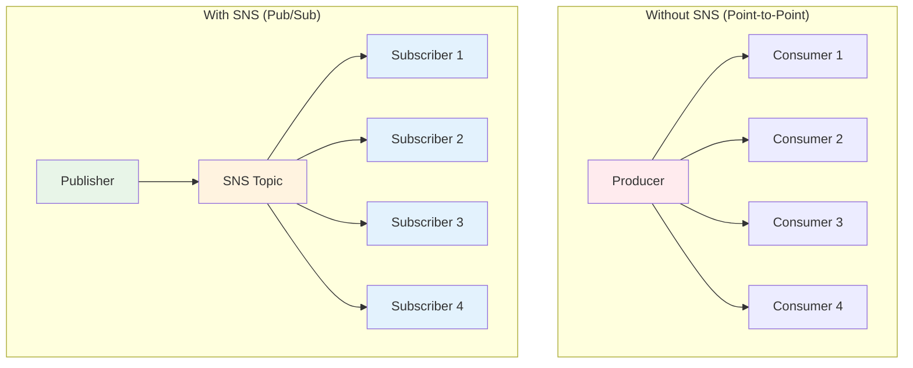
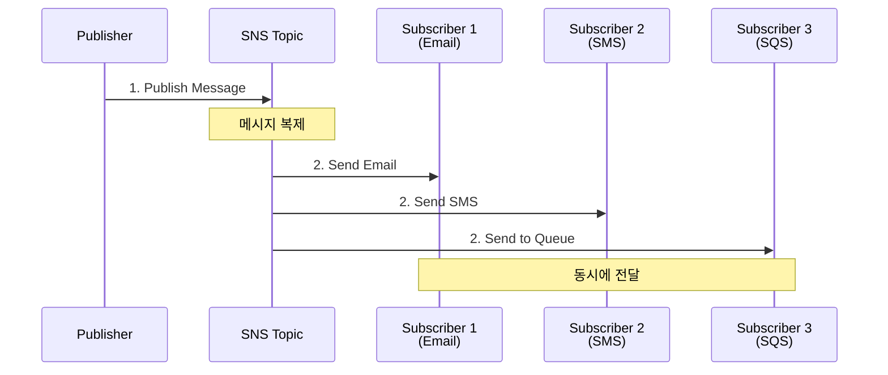
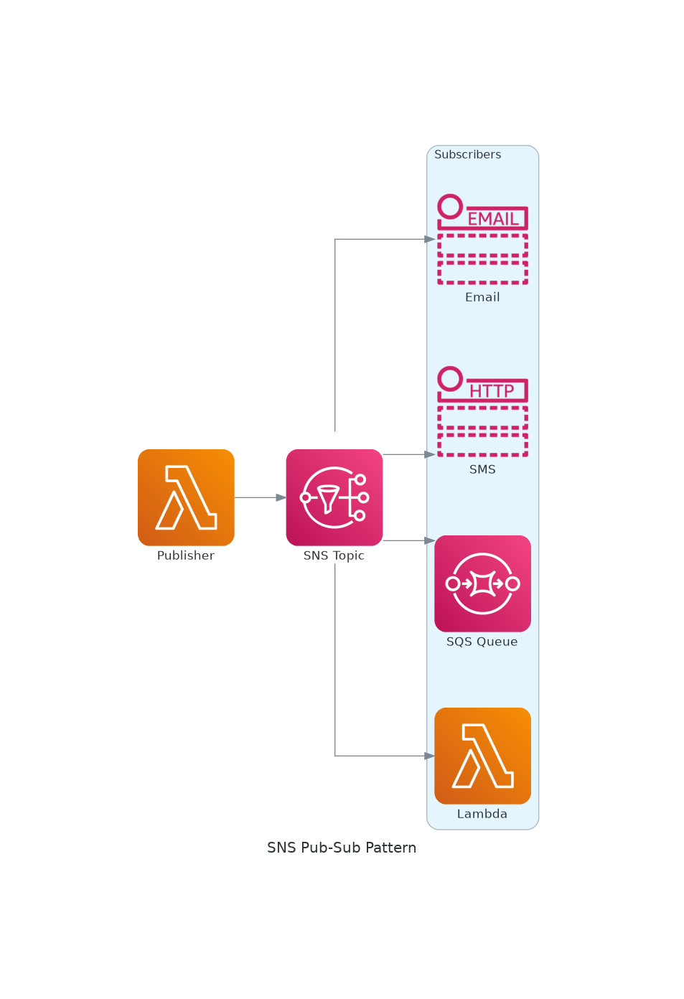
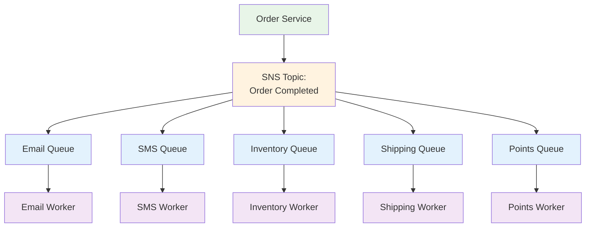
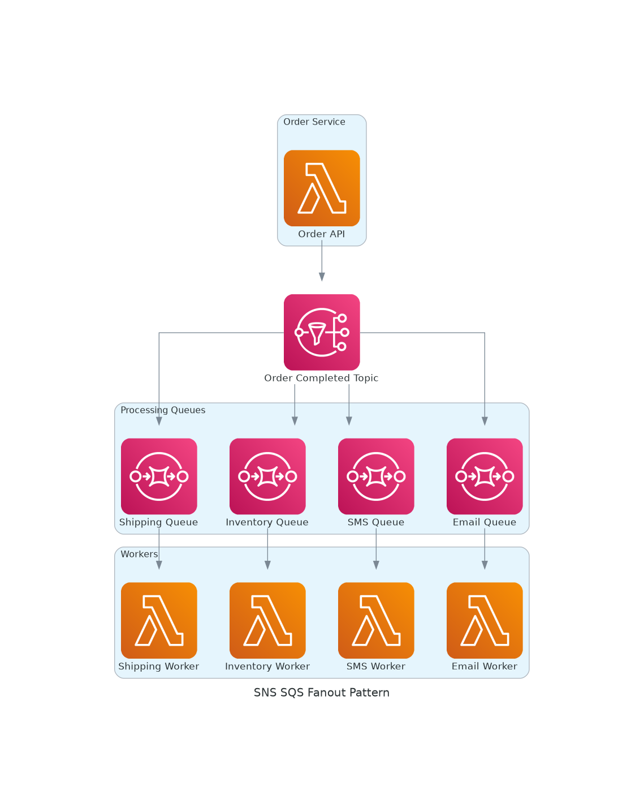
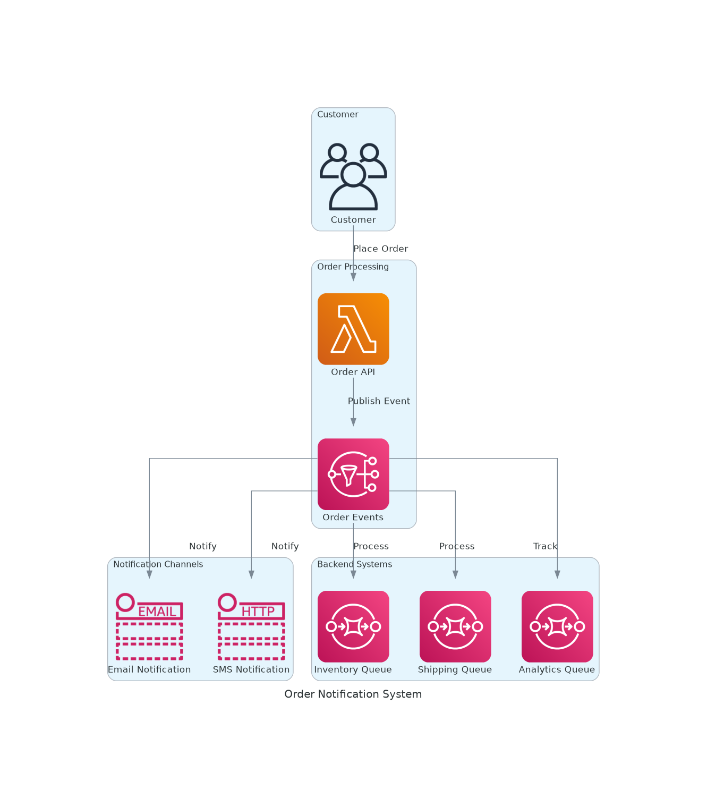

# November Week 2 Day 1 Session 2: SNS (Simple Notification Service)

<div align="center">

**📢 Pub/Sub** • **🔔 알림** • **🌐 Fan-out**

*하나의 메시지를 여러 구독자에게, SNS로 알림 시스템 구축*

</div>

---

## 🕘 Session 정보
**시간**: 09:40-10:20 (40분)
**목표**: SNS Pub/Sub 패턴 이해 및 SQS 통합
**방식**: 이론 + 실습 예제

## 🎯 학습 목표

### 📚 이해 목표
- Pub/Sub 패턴의 개념과 필요성
- SNS의 작동 원리 파악
- SQS + SNS Fan-out 패턴 이해
- 다양한 알림 채널 활용 방법

### 🛠️ 적용 목표
- 알림 시스템 설계 능력
- 적절한 구독 프로토콜 선택
- SQS와 SNS 통합 구현

---

## 🤔 왜 필요한가? (5분)

### 💼 실무 시나리오: 주문 상태 알림

**문제 상황 - SQS만 사용**:
```
주문 완료 시 알림이 필요한 곳:
1. 고객 이메일
2. 고객 SMS
3. 관리자 대시보드
4. 재고 시스템
5. 배송 시스템
6. 회계 시스템

각각에 메시지를 보내려면?
→ 6개의 SQS Queue 필요
→ 6번의 메시지 전송 코드 작성
→ 새로운 시스템 추가 시 코드 수정 😱
```

**SNS를 사용한 Pub/Sub**:
```
주문 완료 시:
1. SNS Topic에 1번만 메시지 발행
2. 구독자들이 자동으로 메시지 수신
3. 새로운 구독자 추가 시 코드 수정 불필요 ✅
```

### 🏠 실생활 비유

**방송국 시스템**:
- **SQS (1:1)**: 편지 - 특정 사람에게만 전달
- **SNS (1:N)**: TV 방송 - 채널을 켜면 누구나 시청 가능

**신문 구독**:
- **Publisher (발행자)**: 신문사가 신문 발행
- **Subscriber (구독자)**: 구독자들이 자동으로 신문 수령
- **새 구독자**: 언제든 구독 신청 가능

### 📊 Pub/Sub의 장점



---

## 📖 핵심 개념 (25분)

### 🔍 개념 1: SNS 기본 아키텍처 (8분)

> **정의**: AWS에서 제공하는 완전 관리형 Pub/Sub 메시징 서비스

**핵심 구성 요소**:
- **Topic**: 메시지를 발행하는 채널
- **Publisher**: Topic에 메시지를 발행하는 주체
- **Subscriber**: Topic을 구독하여 메시지를 받는 주체
- **Subscription**: Topic과 Subscriber를 연결하는 설정

**작동 원리**:


**실제 AWS 아키텍처**:



*그림: SNS Pub/Sub 패턴 - Publisher가 Topic에 메시지를 발행하면 모든 Subscriber가 동시에 수신*

**주요 특징**:
- **완전 관리형**: 서버 관리 불필요
- **높은 처리량**: 초당 수백만 메시지 처리
- **내구성**: 여러 AZ에 메시지 복제
- **유연한 구독**: 다양한 프로토콜 지원

**메시지 필터링**:
```json
// 구독자별로 원하는 메시지만 수신 가능
{
  "store": ["seoul", "busan"],
  "event_type": ["order_completed"]
}
```

### 🔍 개념 2: 구독 프로토콜 (8분)

> **정의**: SNS는 다양한 방식으로 메시지를 전달할 수 있음

#### 지원 프로토콜

**1. Email / Email-JSON**
- **용도**: 관리자 알림, 보고서
- **특징**: 사람이 읽기 쉬운 형식
- **제한**: 수동 확인 필요

```python
# Email 구독 예시
sns.subscribe(
    TopicArn='arn:aws:sns:ap-northeast-2:123456789012:orders',
    Protocol='email',
    Endpoint='admin@example.com'
)
```

**2. SMS**
- **용도**: 긴급 알림, OTP
- **특징**: 즉시 전달
- **제한**: 비용 발생, 길이 제한 (160자)

```python
# SMS 구독 예시
sns.subscribe(
    TopicArn='arn:aws:sns:ap-northeast-2:123456789012:alerts',
    Protocol='sms',
    Endpoint='+821012345678'
)
```

**3. HTTP/HTTPS**
- **용도**: 웹훅, 외부 시스템 연동
- **특징**: 커스텀 엔드포인트
- **제한**: 엔드포인트 가용성 필요

```python
# HTTPS 구독 예시
sns.subscribe(
    TopicArn='arn:aws:sns:ap-northeast-2:123456789012:webhooks',
    Protocol='https',
    Endpoint='https://api.example.com/webhook'
)
```

**4. SQS**
- **용도**: 비동기 처리, 안정적 전달
- **특징**: 메시지 보관, 재시도
- **장점**: 가장 안정적

```python
# SQS 구독 예시
sns.subscribe(
    TopicArn='arn:aws:sns:ap-northeast-2:123456789012:orders',
    Protocol='sqs',
    Endpoint='arn:aws:sqs:ap-northeast-2:123456789012:order-queue'
)
```

**5. Lambda**
- **용도**: 서버리스 처리
- **특징**: 자동 실행
- **장점**: 인프라 관리 불필요

```python
# Lambda 구독 예시
sns.subscribe(
    TopicArn='arn:aws:sns:ap-northeast-2:123456789012:events',
    Protocol='lambda',
    Endpoint='arn:aws:lambda:ap-northeast-2:123456789012:function:processor'
)
```

**6. Mobile Push**
- **용도**: 모바일 앱 알림
- **특징**: iOS/Android 지원
- **플랫폼**: APNS, FCM, ADM

#### 프로토콜 선택 가이드

| 프로토콜 | 사용 사례 | 장점 | 단점 |
|---------|----------|------|------|
| **Email** | 보고서, 알림 | 사람이 읽기 쉬움 | 수동 확인 |
| **SMS** | 긴급 알림, OTP | 즉시 전달 | 비용, 길이 제한 |
| **HTTP/HTTPS** | 웹훅, 외부 연동 | 유연성 | 가용성 필요 |
| **SQS** | 비동기 처리 | 안정적, 재시도 | 추가 비용 |
| **Lambda** | 서버리스 처리 | 자동 실행 | 실행 시간 제한 |
| **Mobile Push** | 앱 알림 | 실시간 | 플랫폼 설정 복잡 |

### 🔍 개념 3: SQS + SNS Fan-out 패턴 (9분)

> **정의**: SNS로 메시지를 발행하고, 여러 SQS Queue가 구독하는 패턴

**왜 Fan-out이 필요한가?**

**문제 상황**:
```
주문 완료 시 처리해야 할 작업:
1. 이메일 발송 (5초)
2. SMS 발송 (3초)
3. 재고 업데이트 (2초)
4. 배송 시스템 연동 (4초)
5. 포인트 적립 (1초)

순차 처리: 15초 소요 😱
병렬 처리 필요!
```

**Fan-out 패턴 해결**:
```
SNS Topic에 메시지 발행 (0.1초)
    ↓
5개의 SQS Queue가 동시에 메시지 수신
    ↓
각 Queue의 Worker가 독립적으로 병렬 처리
    ↓
전체 처리 시간: 가장 긴 작업 시간 (5초) ✅
```

**아키텍처**:


**실제 AWS 아키텍처**:



*그림: SNS + SQS Fan-out 패턴 - 하나의 메시지가 여러 Queue로 동시에 전달되어 병렬 처리*

**전체 시스템 예시**:



*그림: 주문 알림 시스템 - 고객 알림(Email/SMS)과 백엔드 처리(Queue)를 동시에 수행*

**Fan-out 패턴의 장점**:
1. **병렬 처리**: 모든 작업이 동시에 시작
2. **독립성**: 한 작업 실패가 다른 작업에 영향 없음
3. **확장성**: 새로운 구독자 추가 용이
4. **안정성**: SQS의 재시도 메커니즘 활용

**실제 구현**:
```python
# 1. SNS Topic 생성
topic = sns.create_topic(Name='order-completed')

# 2. 여러 SQS Queue 생성 및 구독
queues = ['email', 'sms', 'inventory', 'shipping', 'points']
for queue_name in queues:
    # Queue 생성
    queue = sqs.create_queue(QueueName=f'{queue_name}-queue')
    
    # SNS 구독
    sns.subscribe(
        TopicArn=topic['TopicArn'],
        Protocol='sqs',
        Endpoint=queue['QueueUrl']
    )
    
    # Queue 정책 설정 (SNS가 메시지 전송 가능하도록)
    policy = {
        "Version": "2012-10-17",
        "Statement": [{
            "Effect": "Allow",
            "Principal": {"Service": "sns.amazonaws.com"},
            "Action": "sqs:SendMessage",
            "Resource": queue['QueueArn'],
            "Condition": {
                "ArnEquals": {
                    "aws:SourceArn": topic['TopicArn']
                }
            }
        }]
    }
    sqs.set_queue_attributes(
        QueueUrl=queue['QueueUrl'],
        Attributes={'Policy': json.dumps(policy)}
    )

# 3. 메시지 발행
sns.publish(
    TopicArn=topic['TopicArn'],
    Message=json.dumps({
        'order_id': '12345',
        'customer_email': 'customer@example.com',
        'total_amount': 50000
    }),
    Subject='Order Completed'
)
```

**메시지 필터링**:
```python
# 특정 구독자만 특정 메시지 수신
sns.subscribe(
    TopicArn=topic_arn,
    Protocol='sqs',
    Endpoint=queue_url,
    Attributes={
        'FilterPolicy': json.dumps({
            'store': ['seoul'],  # 서울 매장 주문만
            'amount': [{'numeric': ['>', 100000]}]  # 10만원 이상만
        })
    }
)
```

**Fan-out vs 직접 전송 비교**:

| 방식 | 코드 복잡도 | 확장성 | 장애 격리 | 성능 |
|------|------------|--------|----------|------|
| **직접 전송** | 높음 | 낮음 | 낮음 | 순차 처리 |
| **Fan-out** | 낮음 | 높음 | 높음 | 병렬 처리 |

---

## 💭 함께 생각해보기 (10분)

### 🤝 페어 토론 (5분)

**토론 주제**:
1. **알림 시스템 설계**:
   - 여러분의 프로젝트에서 어떤 알림이 필요한가요?
   - 각 알림에 어떤 프로토콜을 사용하시겠습니까?

2. **Fan-out 적용**:
   - 프로젝트에서 Fan-out 패턴을 적용할 수 있는 곳은?
   - 병렬 처리하면 좋을 작업들은?

3. **SQS vs SNS**:
   - 언제 SQS만 사용하고, 언제 SNS를 추가하시겠습니까?
   - 두 서비스를 함께 사용하는 이유는?

**페어 활동 가이드**:
- 👥 2명씩 자유롭게 페어링
- 🔄 각자 5분씩 의견 공유
- 📝 핵심 아이디어 메모

### 🎯 전체 공유 (5분)

**공유 내용**:
- 각 팀의 알림 시스템 설계
- Fan-out 패턴 적용 아이디어
- SQS + SNS 통합 전략

**💡 이해도 체크 질문**:
- ✅ "Pub/Sub 패턴의 장점을 설명할 수 있나요?"
- ✅ "Fan-out 패턴이 필요한 이유를 설명할 수 있나요?"
- ✅ "여러분의 프로젝트에 SNS를 어떻게 적용할지 구상했나요?"

---

## 🔑 핵심 키워드

### 📝 오늘의 핵심 용어

**기본 용어**:
- **SNS (Simple Notification Service)**: AWS 관리형 Pub/Sub 메시징 서비스
- **Topic**: 메시지를 발행하는 채널
- **Publisher**: Topic에 메시지를 발행하는 주체
- **Subscriber**: Topic을 구독하여 메시지를 받는 주체
- **Subscription**: Topic과 Subscriber를 연결하는 설정

**패턴**:
- **Pub/Sub (Publish/Subscribe)**: 발행/구독 패턴
- **Fan-out**: 하나의 메시지를 여러 구독자에게 전달
- **Message Filtering**: 구독자별로 원하는 메시지만 수신

**프로토콜**:
- **Email/SMS**: 사람에게 알림
- **HTTP/HTTPS**: 웹훅, 외부 시스템 연동
- **SQS**: 안정적 비동기 처리
- **Lambda**: 서버리스 자동 처리
- **Mobile Push**: 모바일 앱 알림

---

## 🚀 실무 적용 및 개선 방안

### 💡 현재 Session의 한계점
- 기본 개념만 다룸
- 실제 코드 구현은 Lab에서
- 고급 기능은 다루지 않음

### 🔧 실무 개선 방안

#### 1. 메시지 필터링 고급 활용
**속성 기반 필터링**:
```python
# 발행 시 속성 추가
sns.publish(
    TopicArn=topic_arn,
    Message='Order completed',
    MessageAttributes={
        'store': {'DataType': 'String', 'StringValue': 'seoul'},
        'amount': {'DataType': 'Number', 'StringValue': '150000'},
        'customer_type': {'DataType': 'String', 'StringValue': 'vip'}
    }
)

# 구독 시 필터 정책
filter_policy = {
    'store': ['seoul', 'busan'],
    'amount': [{'numeric': ['>', 100000]}],
    'customer_type': ['vip']
}
```

#### 2. 재시도 및 DLQ 설정
**SNS → SQS 구독 시 DLQ**:
```python
# SQS Queue에 DLQ 설정
dlq = sqs.create_queue(QueueName='email-dlq')

main_queue = sqs.create_queue(
    QueueName='email-queue',
    Attributes={
        'RedrivePolicy': json.dumps({
            'deadLetterTargetArn': dlq['QueueArn'],
            'maxReceiveCount': '3'
        })
    }
)

# SNS 구독
sns.subscribe(
    TopicArn=topic_arn,
    Protocol='sqs',
    Endpoint=main_queue['QueueUrl']
)
```

#### 3. 메시지 암호화
**전송 중 암호화**:
```python
# Topic 생성 시 암호화 설정
topic = sns.create_topic(
    Name='secure-orders',
    Attributes={
        'KmsMasterKeyId': 'alias/aws/sns'  # KMS 키 사용
    }
)
```

#### 4. 모니터링 & 알람
**주요 메트릭**:
- `NumberOfMessagesPublished`: 발행된 메시지 수
- `NumberOfNotificationsDelivered`: 전달된 알림 수
- `NumberOfNotificationsFailed`: 실패한 알림 수

**CloudWatch 알람**:
```python
cloudwatch.put_metric_alarm(
    AlarmName='SNS-Delivery-Failures',
    MetricName='NumberOfNotificationsFailed',
    Namespace='AWS/SNS',
    Statistic='Sum',
    Period=300,
    EvaluationPeriods=1,
    Threshold=10,  # 5분간 10개 이상 실패 시 알람
    ComparisonOperator='GreaterThanThreshold',
    AlarmActions=['arn:aws:sns:ap-northeast-2:123456789012:alerts']
)
```

#### 5. 비용 최적화
**비용 구조**:
- **발행 요청**: 100만 요청당 $0.50
- **HTTP/HTTPS 전달**: 100만 건당 $0.60
- **Email 전달**: 100만 건당 $2.00
- **SMS 전달**: 건당 $0.00645 (한국 기준)
- **SQS/Lambda 전달**: 무료

**절감 팁**:
- SQS/Lambda 구독 우선 사용 (무료)
- 메시지 필터링으로 불필요한 전달 감소
- Batch 발행 (여러 메시지를 한 번에)

### 📊 실제 운영 사례

**사례 1: Airbnb**
- **규모**: 수천 개의 SNS Topic
- **용도**: 예약 알림, 호스트 알림
- **효과**: 실시간 알림 시스템 구축

**사례 2: Netflix**
- **규모**: 초당 수백만 메시지
- **용도**: 시스템 이벤트 전파
- **효과**: 마이크로서비스 간 느슨한 결합

**사례 3: 스타트업 사례**
- **규모**: 일 10만 알림
- **용도**: 주문 알림, 마케팅 메시지
- **비용**: 월 $20 이하

---

## 📝 Session 마무리

### ✅ 오늘 Session 성과
- [ ] SNS Pub/Sub 패턴 이해
- [ ] 다양한 구독 프로토콜 파악
- [ ] SQS + SNS Fan-out 패턴 습득
- [ ] 실무 알림 시스템 설계 능력

### 🎯 다음 Session 준비
**Session 3: Terraform 기초**
- IaC가 필요한 이유
- Terraform 기본 개념
- HCL 문법 기초

**연결 포인트**:
- Session 1-2에서 배운 SQS, SNS를 Terraform으로 관리
- 인프라를 코드로 관리하는 첫 경험

---

## 🔗 참고 자료

### 📚 AWS 공식 문서
- 📘 [SNS란 무엇인가?](https://docs.aws.amazon.com/sns/latest/dg/welcome.html)
- 📗 [SNS 사용자 가이드](https://docs.aws.amazon.com/sns/latest/dg/)
- 📙 [SNS API 레퍼런스](https://docs.aws.amazon.com/sns/latest/api/)
- 📕 [SNS 요금](https://aws.amazon.com/sns/pricing/)
- 🆕 [SNS 최신 업데이트](https://aws.amazon.com/sns/whats-new/)

### 🎯 추가 학습 자료
- [SNS 베스트 프랙티스](https://docs.aws.amazon.com/sns/latest/dg/sns-best-practices.html)
- [SNS + SQS Fan-out 패턴](https://docs.aws.amazon.com/sns/latest/dg/sns-sqs-as-subscriber.html)

---

<div align="center">

**📢 Pub/Sub** • **🔔 알림** • **🌐 Fan-out** • **🔄 SQS 통합**

*Session 2 완료 - 다음은 Terraform으로 인프라 코드화!*

</div>
