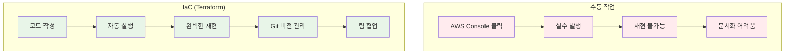
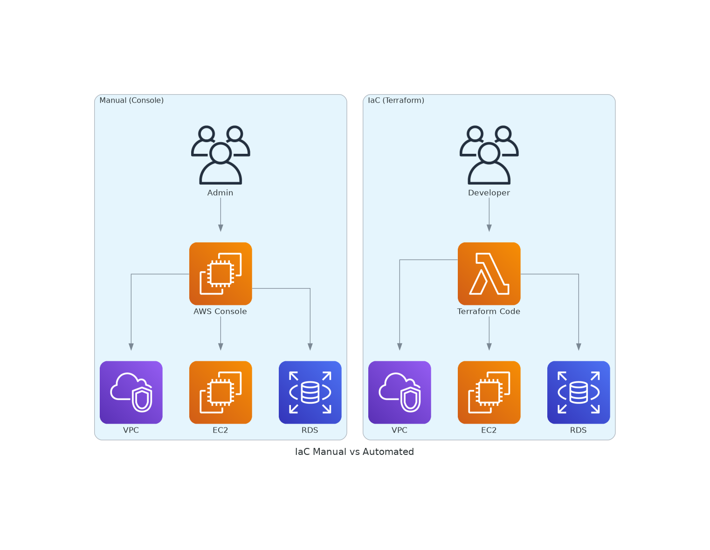
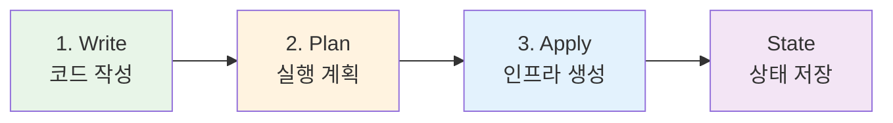
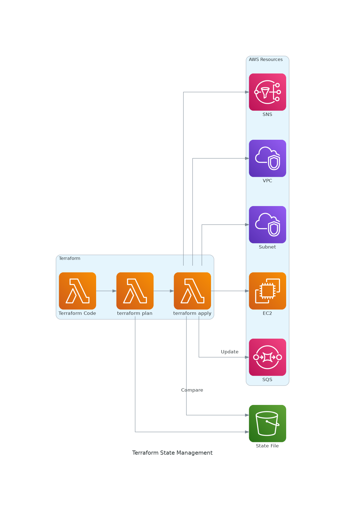
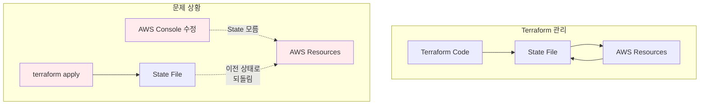

# November Week 2 Day 1 Session 3: Terraform 기초

<div align="center">

**📝 IaC** • **🔧 Terraform** • **🏗️ 코드로 인프라 관리**

*클릭 대신 코드로, 인프라를 버전 관리하는 새로운 방식*

</div>

---

## 🕘 Session 정보
**시간**: 10:20-11:00 (40분)
**목표**: IaC 개념 이해 및 Terraform 기초 습득
**방식**: 이론 + 간단한 예제

## 🎯 학습 목표

### 📚 이해 목표
- IaC가 필요한 이유 이해
- Terraform의 작동 원리 파악
- HCL 기본 문법 이해
- Provider와 Resource 개념 습득

### 🛠️ 적용 목표
- Terraform 설치 및 초기화
- 간단한 리소스 정의 작성
- terraform 기본 명령어 실행

### 📦 사전 준비
**Terraform 설치 및 AWS 설정이 필요합니다!**

👉 **[Terraform 설치 및 AWS 설정 가이드](../TERRAFORM_SETUP.md)** 참조

- Terraform 설치
- AWS CLI 설치
- AWS Access Key 생성
- AWS 인증 설정
- 환경 검증

**Lab 시작 전 반드시 완료하세요!**

---

## 🤔 왜 필요한가? (5분)

### 💼 실무 시나리오: AWS 인프라 구축

**수동 작업의 문제점**:
```
개발 환경 구축 (AWS Console 클릭):
1. VPC 생성 (5분)
2. Subnet 2개 생성 (5분)
3. Internet Gateway 생성 및 연결 (3분)
4. Route Table 설정 (5분)
5. Security Group 생성 (5분)
6. EC2 인스턴스 생성 (5분)
7. RDS 데이터베이스 생성 (10분)
8. SQS Queue 생성 (3분)
9. SNS Topic 생성 (3분)
---
총 44분 소요 😱

문제점:
- 실수하기 쉬움 (클릭 실수)
- 재현 불가능 (어떻게 만들었는지 기억 안 남)
- 문서화 어려움 (스크린샷으로 기록?)
- 팀 협업 어려움 (각자 다르게 구축)
- 환경 복제 어려움 (dev, staging, prod)
```

**Terraform을 사용한 IaC**:
```hcl
# main.tf 파일 하나로 모든 인프라 정의
resource "aws_vpc" "main" {
  cidr_block = "10.0.0.0/16"
}

resource "aws_subnet" "public" {
  vpc_id     = aws_vpc.main.id
  cidr_block = "10.0.1.0/24"
}

# ... 나머지 리소스들

# 실행: terraform apply (1분)
# 재현: 언제든 동일한 환경 구축 가능 ✅
# 버전 관리: Git으로 변경 이력 추적
# 협업: 코드 리뷰로 인프라 검토
```

### 🏠 실생활 비유

**레고 조립 설명서**:
- **수동 작업**: 사진만 보고 기억에 의존해서 조립
- **IaC (Terraform)**: 단계별 조립 설명서 (누구나 동일하게 조립 가능)

**요리 레시피**:
- **수동 작업**: 맛으로 간 맞추기 (매번 다른 맛)
- **IaC (Terraform)**: 정확한 레시피 (항상 동일한 맛)

### 📊 IaC의 장점



**실제 비교**:



*그림: 수동 작업 vs IaC - 코드로 관리하면 자동화, 재현성, 협업이 가능*

---

## 📖 핵심 개념 (25분)

### 🔍 개념 1: Terraform 기본 개념 (8분)

> **정의**: HashiCorp에서 만든 오픈소스 IaC 도구

**핵심 특징**:
- **선언적 (Declarative)**: "어떻게"가 아닌 "무엇을" 정의
- **멀티 클라우드**: AWS, Azure, GCP 모두 지원
- **상태 관리**: 현재 인프라 상태를 추적
- **의존성 관리**: 리소스 간 순서 자동 처리

**Terraform vs CloudFormation**:

| 특성 | Terraform | CloudFormation |
|------|-----------|----------------|
| **제공자** | HashiCorp (오픈소스) | AWS (공식) |
| **지원 클라우드** | 멀티 클라우드 | AWS 전용 |
| **문법** | HCL (간결) | JSON/YAML (장황) |
| **상태 관리** | 명시적 (State 파일) | 암묵적 (AWS 관리) |
| **커뮤니티** | 매우 활발 | AWS 중심 |
| **학습 곡선** | 보통 | 쉬움 |
| **실무 사용** | 매우 높음 | AWS 전용 프로젝트 |

**언제 Terraform을 사용하는가?**:
- 멀티 클라우드 환경
- 인프라 재사용성 중요
- 팀 협업 및 코드 리뷰
- 오픈소스 생태계 활용

**언제 CloudFormation을 사용하는가?**:
- AWS 전용 프로젝트
- AWS 네이티브 통합 필요
- 빠른 시작 (AWS 콘솔 통합)

### 🔍 개념 2: Terraform 작동 원리 (8분)

> **정의**: Terraform은 코드 → 실행 계획 → 적용의 3단계로 작동

**Terraform 워크플로우**:


**실제 AWS 아키텍처**:



*그림: Terraform State 관리 - 코드와 실제 인프라 상태를 비교하여 변경사항 적용*

**1. Write (코드 작성)**:
```hcl
# main.tf
resource "aws_s3_bucket" "example" {
  bucket = "my-terraform-bucket"
}
```

**2. Plan (실행 계획)**:
```bash
$ terraform plan

Terraform will perform the following actions:

  # aws_s3_bucket.example will be created
  + resource "aws_s3_bucket" "example" {
      + bucket = "my-terraform-bucket"
      + id     = (known after apply)
    }

Plan: 1 to add, 0 to change, 0 to destroy.
```

**3. Apply (인프라 생성)**:
```bash
$ terraform apply

aws_s3_bucket.example: Creating...
aws_s3_bucket.example: Creation complete after 2s

Apply complete! Resources: 1 added, 0 changed, 0 destroyed.
```

**4. State (상태 저장)**:
```json
// terraform.tfstate
{
  "version": 4,
  "resources": [
    {
      "type": "aws_s3_bucket",
      "name": "example",
      "instances": [
        {
          "attributes": {
            "bucket": "my-terraform-bucket",
            "id": "my-terraform-bucket"
          }
        }
      ]
    }
  ]
}
```

**State 파일의 역할**:
- **현재 상태 추적**: 실제 인프라와 코드 비교
- **변경 감지**: 무엇이 바뀌었는지 파악
- **의존성 관리**: 리소스 간 관계 저장
- **성능 최적화**: API 호출 최소화

**⚠️ State 파일 주의사항**:
- 민감 정보 포함 (암호, 키 등)
- Git에 커밋하지 말 것 (.gitignore 추가)
- 팀 작업 시 Remote State 사용 (S3 + DynamoDB)

### ⚠️ 중요: 웹 콘솔과 Terraform 혼용 금지

> **핵심 원칙**: 한 번 Terraform으로 관리하기 시작한 리소스는 **절대** 웹 콘솔에서 수정하지 마세요!

**문제 상황**:
```
1. Terraform으로 EC2 인스턴스 생성
   → State 파일에 "t3.micro" 기록

2. AWS 콘솔에서 인스턴스 타입을 "t3.small"로 변경
   → State 파일은 여전히 "t3.micro"

3. 다음에 terraform apply 실행
   → Terraform: "어? State에는 t3.micro인데 실제는 t3.small?"
   → Terraform: "내가 t3.micro로 되돌릴게!" 😱
   → 콘솔에서 한 변경사항이 사라짐!
```

**실제 예시**:
```hcl
# Terraform 코드
resource "aws_instance" "web" {
  instance_type = "t3.micro"
  ami           = "ami-xxxxx"
}

# 1. terraform apply 실행
# → EC2 t3.micro 생성
# → State: instance_type = "t3.micro"

# 2. AWS 콘솔에서 t3.small로 변경
# → 실제 AWS: t3.small
# → State: 여전히 t3.micro (모름)

# 3. 다음 terraform apply 실행
# → Terraform이 State와 실제를 비교
# → "t3.micro여야 하는데 t3.small이네? 수정해야지!"
# → 강제로 t3.micro로 되돌림 (콘솔 변경 사라짐)
```

**왜 이런 일이 발생하는가?**:



**올바른 방법**:
```hcl
# ✅ 올바른 방법: 코드 수정 후 apply
resource "aws_instance" "web" {
  instance_type = "t3.small"  # 코드에서 변경
  ami           = "ami-xxxxx"
}

# terraform apply
# → State 업데이트
# → AWS 리소스 변경
# → 모든 것이 동기화됨
```

**예외 상황: 긴급 대응**:
```
긴급 상황으로 콘솔에서 수정한 경우:

1. 즉시 Terraform 코드도 동일하게 수정
2. terraform plan으로 차이 확인
3. terraform apply로 State 동기화

또는

1. terraform refresh로 State 업데이트
2. terraform show로 현재 상태 확인
3. 코드를 실제 상태에 맞게 수정
```

**팀 규칙 예시**:
```
📋 인프라 변경 규칙

✅ 허용:
- Terraform 코드 수정 → terraform apply
- 코드 리뷰 후 변경
- Git으로 변경 이력 관리

❌ 금지:
- AWS 콘솔에서 직접 수정
- Terraform 관리 리소스를 수동 변경
- State 파일 직접 수정

🚨 긴급 상황:
1. 콘솔에서 수정 (불가피한 경우만)
2. 즉시 팀에 공지
3. 24시간 내 Terraform 코드 동기화
4. 사후 보고서 작성
```

**실무 팁**:
- **태그 활용**: Terraform 관리 리소스에 `ManagedBy: Terraform` 태그 추가
- **읽기 전용 권한**: 개발자에게는 콘솔 읽기 권한만 부여
- **변경 감지**: AWS Config로 수동 변경 감지 및 알람
- **정기 검증**: `terraform plan`을 주기적으로 실행하여 drift 확인

**Drift Detection (상태 불일치 감지)**:
```bash
# 정기적으로 실행하여 State와 실제 차이 확인
terraform plan

# 출력 예시
# ~ resource "aws_instance" "web" {
#     ~ instance_type = "t3.micro" -> "t3.small"
#   }
# 
# 누군가 콘솔에서 변경했다는 의미!
```

### ⚠️ 더 심각한 문제: 콘솔에서 생성한 리소스

> **핵심 문제**: Terraform이 모르는 리소스는 **제어 불가능**하고 **삭제 시 충돌** 발생!

**문제 상황 1: 의존성 충돌**:
```
시나리오:
1. Terraform으로 VPC 생성
2. 누군가 콘솔에서 NAT Gateway 생성 (Terraform 모름)
3. terraform destroy 실행

결과:
❌ Error: Cannot delete VPC
   Reason: VPC has dependencies (NAT Gateway)
   
Terraform: "VPC를 삭제하려는데 뭔가 붙어있어요!"
Terraform: "근데 그게 뭔지 모르겠어요..." 😱
```

**실제 에러 메시지**:
```bash
$ terraform destroy

Error: Error deleting VPC: DependencyViolation: 
The vpc 'vpc-xxxxx' has dependencies and cannot be deleted.

# 원인: 콘솔에서 생성한 NAT Gateway가 VPC에 연결되어 있음
# Terraform은 이 NAT Gateway를 모르기 때문에 삭제할 수 없음
```

**문제 상황 2: 리소스 이름 충돌**:
```
시나리오:
1. Terraform으로 "web-server" Security Group 생성
2. 누군가 콘솔에서 "web-server" Security Group 생성
3. terraform apply 실행

결과:
❌ Error: Security Group "web-server" already exists
   
Terraform: "내가 만들려는데 이미 있네요?"
Terraform: "근데 내 State에는 없는데..." 😱
```

**문제 상황 3: 리소스 한도 초과**:
```
시나리오:
1. Terraform으로 Elastic IP 4개 생성 (한도: 5개)
2. 누군가 콘솔에서 Elastic IP 2개 생성
3. terraform apply로 1개 더 추가 시도

결과:
❌ Error: Elastic IP limit exceeded (5/5)
   
Terraform: "왜 한도 초과지? 내가 4개만 만들었는데..."
실제: 콘솔에서 2개 더 만들어서 총 6개 😱
```

**실제 사례: VPC 삭제 실패**:
```bash
# Terraform 코드
resource "aws_vpc" "main" {
  cidr_block = "10.0.0.0/16"
}

resource "aws_subnet" "public" {
  vpc_id     = aws_vpc.main.id
  cidr_block = "10.0.1.0/24"
}

# terraform destroy 실행
$ terraform destroy

# 1단계: Subnet 삭제 성공
aws_subnet.public: Destroying...
aws_subnet.public: Destruction complete

# 2단계: VPC 삭제 실패
aws_vpc.main: Destroying...
Error: Error deleting VPC: DependencyViolation
  - NAT Gateway (nat-xxxxx) exists
  - Internet Gateway (igw-xxxxx) exists
  - Network Interface (eni-xxxxx) exists

# 원인: 누군가 콘솔에서 생성한 리소스들
# Terraform은 이들을 모르기 때문에 삭제 불가
```

**해결 방법**:

**1. 수동 확인 및 삭제**:
```bash
# AWS CLI로 VPC 의존성 확인
aws ec2 describe-nat-gateways --filter "Name=vpc-id,Values=vpc-xxxxx"
aws ec2 describe-internet-gateways --filter "Name=attachment.vpc-id,Values=vpc-xxxxx"
aws ec2 describe-network-interfaces --filter "Name=vpc-id,Values=vpc-xxxxx"

# 수동으로 삭제
aws ec2 delete-nat-gateway --nat-gateway-id nat-xxxxx
aws ec2 detach-internet-gateway --internet-gateway-id igw-xxxxx --vpc-id vpc-xxxxx
aws ec2 delete-internet-gateway --internet-gateway-id igw-xxxxx

# 다시 terraform destroy 실행
terraform destroy
```

**2. Import 후 관리**:
```bash
# 콘솔에서 생성한 리소스를 Terraform으로 가져오기
terraform import aws_nat_gateway.manual nat-xxxxx

# 코드에 추가
resource "aws_nat_gateway" "manual" {
  # ... 설정
}

# 이제 Terraform이 관리 가능
terraform destroy  # 정상 삭제됨
```

**3. 강제 삭제 (비추천)**:
```bash
# Terraform State에서 제거 (실제 리소스는 남음)
terraform state rm aws_vpc.main

# AWS 콘솔에서 수동 삭제
# 또는 AWS CLI로 강제 삭제
```

**예방 방법**:

**1. 태그 정책**:
```hcl
# 모든 Terraform 리소스에 태그 추가
resource "aws_vpc" "main" {
  cidr_block = "10.0.0.0/16"
  
  tags = {
    ManagedBy = "Terraform"
    Project   = "web-app"
    Owner     = "devops-team"
  }
}

# AWS Config로 태그 없는 리소스 감지
```

**2. IAM 정책으로 콘솔 생성 제한**:
```json
{
  "Version": "2012-10-17",
  "Statement": [
    {
      "Effect": "Deny",
      "Action": [
        "ec2:CreateVpc",
        "ec2:CreateSubnet",
        "ec2:CreateNatGateway"
      ],
      "Resource": "*",
      "Condition": {
        "StringNotEquals": {
          "aws:RequestTag/ManagedBy": "Terraform"
        }
      }
    }
  ]
}
```

**3. 정기 감사**:
```bash
# 태그 없는 리소스 찾기
aws ec2 describe-vpcs --query 'Vpcs[?!Tags || !contains(Tags[].Key, `ManagedBy`)]'

# Terraform State와 실제 리소스 비교
terraform plan -detailed-exitcode
# Exit code 2: 차이 있음 (조사 필요)
```

**팀 규칙 강화**:
```
📋 인프라 생성 규칙

✅ 반드시 Terraform으로:
- 모든 AWS 리소스 생성
- 코드 리뷰 필수
- State 파일 동기화

❌ 절대 금지:
- AWS 콘솔에서 리소스 생성
- Terraform 모르는 리소스 생성
- 수동 인프라 변경

🔍 정기 점검:
- 주 1회: terraform plan 실행
- 월 1회: 태그 없는 리소스 감사
- 분기 1회: 전체 인프라 리뷰

🚨 발견 시 조치:
1. 즉시 팀에 공지
2. 리소스 소유자 확인
3. Import 또는 삭제 결정
4. 재발 방지 대책 수립
```

**실무 경험담**:
```
💬 "VPC 삭제가 안 돼요!"

상황: 프로젝트 종료 후 terraform destroy 실행
문제: VPC 삭제 실패 - 알 수 없는 의존성

원인 조사:
- NAT Gateway 3개 발견 (Terraform은 1개만 알고 있음)
- 개발자가 테스트용으로 콘솔에서 생성
- 테스트 후 삭제 안 함

해결:
- 수동으로 NAT Gateway 삭제
- 월 $135 낭비 발견 (3개월간 방치)
- 이후 IAM 정책으로 콘솔 생성 제한

교훈: 
"Terraform으로 시작했으면 끝까지 Terraform으로!"
```

### 🔍 개념 3: HCL 기본 문법 (9분)

> **정의**: HCL (HashiCorp Configuration Language)은 Terraform의 설정 언어

**기본 구조**:
```hcl
# 블록 타입  블록 레이블        블록 레이블 (선택)
resource    "aws_instance"    "web" {
  # 인수 (Arguments)
  ami           = "ami-0c55b159cbfafe1f0"
  instance_type = "t3.micro"
  
  # 중첩 블록
  tags = {
    Name = "WebServer"
  }
}
```

**주요 블록 타입**:

**1. Provider (제공자)**:
```hcl
# AWS 제공자 설정
provider "aws" {
  region = "ap-northeast-2"  # 서울 리전
}
```

**2. Resource (리소스)**:
```hcl
# EC2 인스턴스 생성
resource "aws_instance" "web" {
  ami           = "ami-0c55b159cbfafe1f0"
  instance_type = "t3.micro"
}

# SQS Queue 생성
resource "aws_sqs_queue" "orders" {
  name = "orders-queue"
}

# SNS Topic 생성
resource "aws_sns_topic" "alerts" {
  name = "alerts-topic"
}
```

**3. Data Source (데이터 소스)**:
```hcl
# 기존 VPC 정보 조회
data "aws_vpc" "default" {
  default = true
}

# 최신 Amazon Linux AMI 조회
data "aws_ami" "amazon_linux" {
  most_recent = true
  owners      = ["amazon"]
  
  filter {
    name   = "name"
    values = ["amzn2-ami-hvm-*-x86_64-gp2"]
  }
}
```

**4. Variable (변수)**:
```hcl
# 변수 선언
variable "instance_type" {
  description = "EC2 instance type"
  type        = string
  default     = "t3.micro"
}

# 변수 사용
resource "aws_instance" "web" {
  instance_type = var.instance_type
}
```

**5. Output (출력)**:
```hcl
# 출력 정의
output "instance_ip" {
  description = "Public IP of the instance"
  value       = aws_instance.web.public_ip
}
```

**데이터 타입**:
```hcl
# String (문자열)
variable "region" {
  type    = string
  default = "ap-northeast-2"
}

# Number (숫자)
variable "instance_count" {
  type    = number
  default = 2
}

# Bool (불린)
variable "enable_monitoring" {
  type    = bool
  default = true
}

# List (리스트)
variable "availability_zones" {
  type    = list(string)
  default = ["ap-northeast-2a", "ap-northeast-2c"]
}

# Map (맵)
variable "tags" {
  type = map(string)
  default = {
    Environment = "dev"
    Project     = "web-app"
  }
}
```

**참조 (References)**:
```hcl
# 리소스 속성 참조
resource "aws_instance" "web" {
  ami           = data.aws_ami.amazon_linux.id  # Data Source 참조
  instance_type = var.instance_type              # Variable 참조
  subnet_id     = aws_subnet.public.id           # 다른 Resource 참조
}

# 출력에서 참조
output "instance_id" {
  value = aws_instance.web.id
}
```

**주석**:
```hcl
# 한 줄 주석

/*
  여러 줄
  주석
*/

// 이것도 한 줄 주석 (C 스타일)
```

---

## 💭 함께 생각해보기 (10분)

### 🤝 페어 토론 (5분)

**토론 주제**:
1. **IaC 적용**:
   - 여러분의 프로젝트에서 IaC를 사용하면 어떤 이점이 있을까요?
   - 수동으로 관리하기 어려운 부분은 무엇인가요?

2. **Terraform vs CloudFormation**:
   - 여러분의 프로젝트에는 어떤 도구가 적합할까요?
   - 선택한 이유는?

3. **코드로 관리**:
   - 인프라를 코드로 관리하면 어떤 점이 좋을까요?
   - 어떤 점이 어려울 것 같나요?

**페어 활동 가이드**:
- 👥 2명씩 자유롭게 페어링
- 🔄 각자 5분씩 의견 공유
- 📝 핵심 아이디어 메모

### 🎯 전체 공유 (5분)

**공유 내용**:
- 각 팀의 IaC 적용 아이디어
- 도구 선택 이유
- 예상되는 어려움과 해결 방안

**💡 이해도 체크 질문**:
- ✅ "IaC가 필요한 이유를 설명할 수 있나요?"
- ✅ "Terraform의 기본 워크플로우를 설명할 수 있나요?"
- ✅ "HCL 기본 문법을 이해했나요?"

---

## 🔑 핵심 키워드

### 📝 오늘의 핵심 용어

**기본 용어**:
- **IaC (Infrastructure as Code)**: 인프라를 코드로 관리하는 방식
- **Terraform**: HashiCorp의 오픈소스 IaC 도구
- **HCL (HashiCorp Configuration Language)**: Terraform 설정 언어
- **State**: 현재 인프라 상태를 저장하는 파일

**Terraform 구성 요소**:
- **Provider**: 클라우드 제공자 (AWS, Azure, GCP)
- **Resource**: 생성할 인프라 리소스
- **Data Source**: 기존 리소스 정보 조회
- **Variable**: 재사용 가능한 변수
- **Output**: 실행 결과 출력

**명령어**:
- **terraform init**: 초기화 (Provider 다운로드)
- **terraform plan**: 실행 계획 확인
- **terraform apply**: 인프라 생성/변경
- **terraform destroy**: 인프라 삭제

---

## 🚀 실무 적용 및 개선 방안

### 💡 현재 Session의 한계점
- 기본 개념만 다룸
- 실제 코드 작성은 Lab에서
- 고급 기능은 다루지 않음

### 🔧 실무 개선 방안

#### 1. 프로젝트 구조
**권장 디렉토리 구조**:
```
terraform/
├── main.tf           # 주요 리소스 정의
├── variables.tf      # 변수 선언
├── outputs.tf        # 출력 정의
├── provider.tf       # Provider 설정
├── terraform.tfvars  # 변수 값 (Git 제외)
└── .gitignore        # State 파일 제외
```

**.gitignore 필수 설정**:
```
# Terraform
*.tfstate
*.tfstate.*
.terraform/
.terraform.lock.hcl
terraform.tfvars
```

#### 2. 변수 관리
**환경별 변수 파일**:
```hcl
# variables.tf
variable "environment" {
  type = string
}

variable "instance_type" {
  type = string
}

# dev.tfvars
environment   = "dev"
instance_type = "t3.micro"

# prod.tfvars
environment   = "prod"
instance_type = "t3.large"

# 실행
terraform apply -var-file="dev.tfvars"
```

#### 3. Remote State
**팀 협업을 위한 Remote State**:
```hcl
# backend.tf
terraform {
  backend "s3" {
    bucket         = "my-terraform-state"
    key            = "prod/terraform.tfstate"
    region         = "ap-northeast-2"
    dynamodb_table = "terraform-locks"  # State Lock
    encrypt        = true
  }
}
```

**장점**:
- 팀원 간 State 공유
- State Lock으로 동시 실행 방지
- 버전 관리 및 백업

#### 4. 모듈화
**재사용 가능한 모듈**:
```hcl
# modules/vpc/main.tf
resource "aws_vpc" "main" {
  cidr_block = var.cidr_block
}

# 모듈 사용
module "vpc" {
  source     = "./modules/vpc"
  cidr_block = "10.0.0.0/16"
}
```

#### 5. 보안
**민감 정보 관리**:
```hcl
# AWS Secrets Manager 사용
data "aws_secretsmanager_secret_version" "db_password" {
  secret_id = "prod/db/password"
}

resource "aws_db_instance" "main" {
  password = data.aws_secretsmanager_secret_version.db_password.secret_string
}
```

### 📊 실제 운영 사례

**사례 1: Airbnb**
- **규모**: 수천 개의 리소스 관리
- **용도**: 전체 인프라 Terraform 관리
- **효과**: 인프라 변경 시간 90% 단축

**사례 2: Uber**
- **규모**: 멀티 클라우드 (AWS, GCP)
- **용도**: 통합 인프라 관리
- **효과**: 클라우드 간 일관성 확보

**사례 3: 스타트업 사례**
- **규모**: 50개 리소스
- **용도**: 개발/스테이징/프로덕션 환경 관리
- **효과**: 환경 복제 시간 1시간 → 5분

### 🆕 최신 업데이트 (2024-2025)

**Terraform 1.9 (2024)**:
- **향상된 State 관리**: 성능 개선
- **Provider 캐싱**: 다운로드 속도 향상
- **에러 메시지 개선**: 더 명확한 오류 설명

**Terraform 1.10 (2025 예정)**:
- **AI 기반 코드 제안**: GitHub Copilot 통합
- **자동 리팩토링**: 코드 최적화 제안
- **향상된 테스트**: 내장 테스트 프레임워크

**HashiCorp Cloud Platform (HCP)**:
- **Terraform Cloud**: 무료 티어 확대
- **Policy as Code**: Sentinel 정책 관리
- **Cost Estimation**: 비용 예측 기능

---

## 📝 Session 마무리

### ✅ 오늘 Session 성과
- [ ] IaC 개념 및 필요성 이해
- [ ] Terraform 기본 원리 파악
- [ ] HCL 기본 문법 습득
- [ ] Provider와 Resource 개념 이해

### 🎯 다음 Lab 준비
**Lab 1: SQS + SNS 비동기 처리 시스템**
- Session 1-2에서 배운 SQS, SNS 구축
- Terraform으로 인프라 코드화 (선택)
- 실제 메시지 전송 및 수신 테스트

**연결 포인트**:
- Session 1: SQS 개념 → Lab에서 실제 구현
- Session 2: SNS 개념 → Lab에서 Fan-out 패턴 구현
- Session 3: Terraform 기초 → Lab에서 선택적 적용

---

## 🔗 참고 자료

### 📚 Terraform 공식 문서
- 📘 [Terraform이란?](https://www.terraform.io/intro)
- 📗 [Terraform 튜토리얼](https://learn.hashicorp.com/terraform)
- 📙 [HCL 문법 가이드](https://www.terraform.io/language)
- 📕 [AWS Provider 문서](https://registry.terraform.io/providers/hashicorp/aws/latest/docs)
- 🆕 [Terraform 최신 업데이트](https://github.com/hashicorp/terraform/releases)

### 🎯 추가 학습 자료
- [Terraform Best Practices](https://www.terraform-best-practices.com/)
- [Terraform AWS Examples](https://github.com/terraform-aws-modules)

---

<div align="center">

**📝 IaC** • **🔧 Terraform** • **🏗️ 코드로 인프라** • **🚀 자동화**

*Session 3 완료 - 다음은 Lab에서 SQS + SNS 실습!*

</div>
