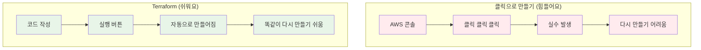
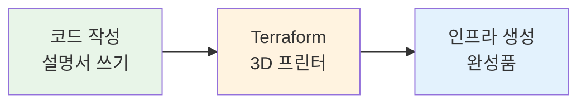
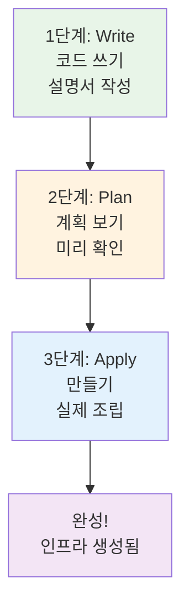
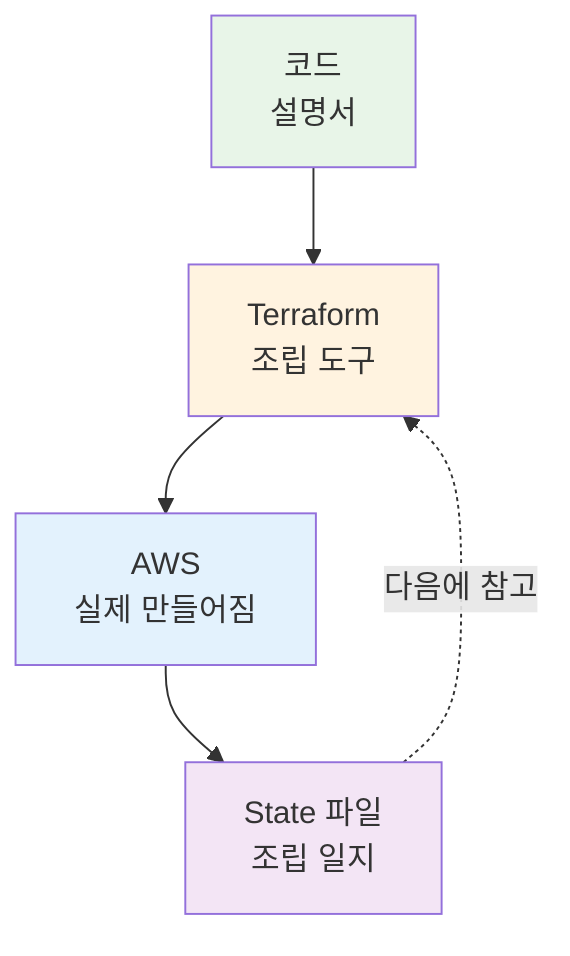
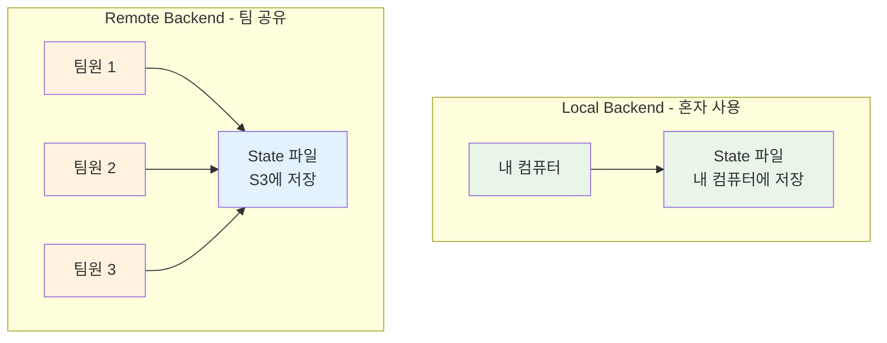
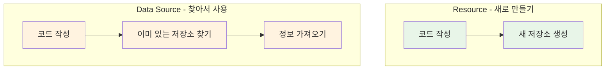
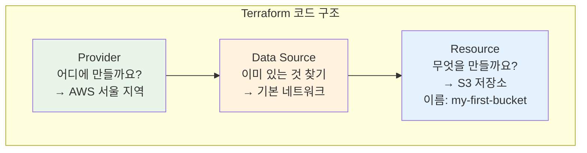
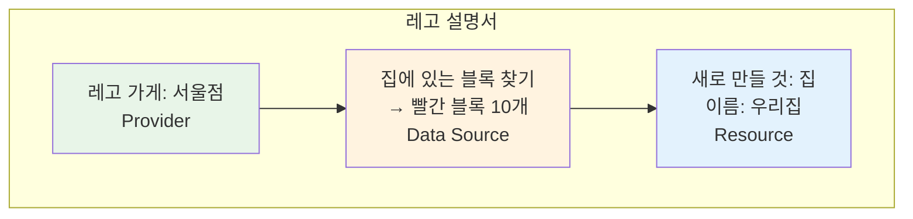

# November Week 2 Day 1 Session 3: Terraform 기초

<div align="center">

**📝 코드로 만들기** • **🔧 자동으로 만들기** • **🏗️ 똑같이 만들기**

*클릭 대신 코드로, 인프라를 레고 설명서처럼 만들기*

</div>

---

## 🕘 Session 정보
**시간**: 10:20-11:00 (40분)
**목표**: 코드로 인프라 만드는 방법 이해하기
**방식**: 실생활 비유 + 그림 + 간단한 예시

## 🎯 학습 목표

### 📚 이해 목표
- 왜 코드로 만드는지 알기 (클릭보다 편해요!)
- Terraform이 뭔지 알기 (자동으로 만들어주는 도구)
- 어떻게 작동하는지 알기 (코드 → 계획 → 만들기)
- 중요한 용어 알기 (Provider, Resource, State)

### 🛠️ 적용 목표
- 언제 사용하면 좋을지 판단하기
- 간단한 코드 읽을 수 있기
- 기본 명령어 알기

### 📦 사전 준비
**Terraform 설치 및 AWS 설정이 필요합니다!**

👉 **[Terraform 설치 및 AWS 설정 가이드](../TERRAFORM_SETUP.md)** 참조

---

## 🤔 왜 필요한가? (5분)

### 🏠 실생활 비유 1: 레고 조립

**사진만 보고 만들기** (어려워요):
```
레고 성 만들기:
- 사진만 보고 기억으로 만들기
- 어떤 블록을 썼는지 기억 안 남
- 친구가 똑같이 만들기 어려움
- 다시 만들려면 또 고민해야 함
시간: 2시간 😱
```

**설명서 보고 만들기** (쉬워요):
```
레고 설명서:
- 단계별로 따라하기
- 어떤 블록을 쓰는지 다 나와 있음
- 친구도 똑같이 만들 수 있음
- 다시 만들기 쉬움
시간: 30분 ✅
```

### 🏠 실생활 비유 2: 요리 레시피

**맛으로 간 맞추기** (매번 달라요):
```
엄마 김치찌개:
- 대충 이 정도?
- 맛으로 간 맞추기
- 매번 맛이 달라요
- 다른 사람이 만들면 완전 다른 맛
```

**레시피 보고 만들기** (항상 같아요):
```
레시피:
- 물 500ml
- 김치 200g
- 돼지고기 100g
- 고춧가루 1큰술
→ 누가 만들어도 똑같은 맛! ✅
```

### 💼 실제 예시: AWS 인프라 만들기

**클릭으로 만들기** (힘들어요):
```
AWS 콘솔에서 클릭:
1. VPC 만들기 (5분)
2. Subnet 만들기 (5분)
3. Internet Gateway 만들기 (3분)
4. Route Table 설정 (5분)
5. Security Group 만들기 (5분)
6. EC2 만들기 (5분)
7. RDS 만들기 (10분)
8. SQS 만들기 (3분)
9. SNS 만들기 (3분)
---
총 44분 😱

문제점:
- 클릭 실수하기 쉬움
- 어떻게 만들었는지 기억 안 남
- 똑같이 다시 만들기 어려움
- 친구가 따라하기 어려움
```

**Terraform으로 만들기** (쉬워요):
```
코드 파일 하나:
- 모든 설정이 코드로 적혀 있음
- 실행 버튼 한 번 (1분)
- 똑같이 다시 만들기 쉬움
- 친구도 똑같이 만들 수 있음
---
총 1분 ✅
```

**그림으로 보기**:


### 🎯 코드로 만들면 좋은 점

1. **빨라요**: 클릭 44분 → 코드 1분
2. **똑같아요**: 누가 만들어도 똑같음
3. **기억해요**: 코드에 다 적혀 있음
4. **공유해요**: 친구에게 코드만 주면 됨

---

## 📖 핵심 개념 (25분)

### 🔍 개념 1: IaC와 Terraform이 뭔가요? (5분)

#### IaC (Infrastructure as Code)

> **전문 용어**: IaC (Infrastructure as Code)
> 
> **쉽게 말하면**: 인프라를 코드로 만드는 것

**등장인물**:
- **인프라** (Infrastructure): 서버, 데이터베이스 같은 것들
- **코드** (Code): 컴퓨터가 이해하는 글

**실생활 예시**:
```
레고 설명서 = IaC
- 레고 블록 = 인프라 (서버, DB)
- 설명서 = 코드
- 설명서대로 조립 = 코드로 인프라 만들기
```

#### Terraform

> **전문 용어**: Terraform
> 
> **쉽게 말하면**: 코드를 보고 자동으로 인프라를 만들어주는 도구

**비유**:
```
3D 프린터:
- 설계도 넣기 (코드)
- 버튼 누르기 (실행)
- 자동으로 만들어짐 (인프라 생성)
```

**Terraform의 특징**:
- 📝 **코드로 작성**: 텍스트 파일에 적어요
- 🤖 **자동으로 만들기**: 버튼 한 번이면 끝
- 🔄 **똑같이 만들기**: 언제든 똑같이 재현
- 🌍 **여러 곳에서 사용**: AWS, Azure, GCP 모두 가능

**그림으로 보기**:


### 🔍 개념 2: Terraform은 어떻게 작동하나요? (5분)

> **쉽게 말하면**: 코드 쓰기 → 계획 보기 → 만들기 3단계

**3단계 과정**:

**1단계: 코드 쓰기 (Write)**
```
레고 설명서 쓰기:
- 어떤 블록을 쓸지 적기
- 어떻게 조립할지 적기
```

**2단계: 계획 보기 (Plan)**
```
설명서 확인하기:
- 필요한 블록이 있는지 확인
- 어떻게 만들어질지 미리 보기
- 문제 없는지 체크
```

**3단계: 만들기 (Apply)**
```
실제로 조립하기:
- 설명서대로 블록 조립
- 완성!
```

**그림으로 보기**:


**실제 명령어** (나중에 배워요):
```bash
# 1단계: 코드는 이미 작성했어요 (main.tf 파일)

# 2단계: 계획 보기
terraform plan
→ "이렇게 만들 거예요!" 보여줌

# 3단계: 만들기
terraform apply
→ 실제로 만들어짐!
```

### 🔍 개념 3: 중요한 용어들 (10분)

#### 용어 1: Provider (제공자)

> **전문 용어**: Provider
> 
> **쉽게 말하면**: 어디에 만들지 정하는 것 (AWS? Azure? GCP?)

**실생활 비유**:
```
레고 가게:
- 레고 가게 = Provider
- 어느 가게에서 살지 정하기
- AWS 가게, Azure 가게, GCP 가게
```

**코드 예시** (간단하게):
```
어디에 만들까요?
→ AWS에 만들래요!
→ 서울 지역에 만들래요!
```

#### 용어 2: Resource (리소스)

> **전문 용어**: Resource
> 
> **쉽게 말하면**: 무엇을 만들지 정하는 것 (서버? DB? 저장소?)

**실생활 비유**:
```
레고 블록:
- 집 블록 = EC2 (서버)
- 창고 블록 = S3 (저장소)
- 우체통 블록 = SQS (할 일 목록)
- 방송국 블록 = SNS (알림)
```

**코드 예시** (간단하게):
```
무엇을 만들까요?
→ 저장소를 만들래요! (S3)
→ 이름은 "my-bucket"이에요!
```

#### 용어 3: State (상태)

> **전문 용어**: State
> 
> **쉽게 말하면**: 지금 뭘 만들었는지 기록하는 노트

**실생활 비유**:
```
레고 조립 일지:
- 어떤 블록을 썼는지 기록
- 어떻게 조립했는지 기록
- 다음에 수정할 때 참고
```

**왜 필요한가요?**:
```
State 파일이 없으면:
- 뭘 만들었는지 기억 못 함
- 수정하려고 해도 모름
- 삭제하려고 해도 모름

State 파일이 있으면:
- 뭘 만들었는지 다 알아요
- 수정하기 쉬워요
- 삭제하기 쉬워요
```

**그림으로 보기**:


#### 용어 3-1: Backend (백엔드)

> **전문 용어**: Backend
> 
> **쉽게 말하면**: State 파일을 어디에 보관할지 정하는 것

**실생활 비유**:
```
조립 일지 보관 장소:
- Local Backend: 내 책상 서랍 (혼자 사용)
- Remote Backend: 학교 도서관 (여럿이 공유)
```

**왜 필요한가요?**:
```
혼자 작업할 때:
- Local Backend (내 컴퓨터에 저장)
- 간단하고 빠름

팀으로 작업할 때:
- Remote Backend (클라우드에 저장)
- 모두가 같은 State 파일 사용
- 동시에 작업해도 안전
```

**Backend 종류**:
```
Local (로컬):
- 내 컴퓨터에 저장
- 혼자 쓸 때 좋음
- 예: terraform.tfstate 파일

Remote (원격):
- S3 같은 곳에 저장
- 팀이 함께 쓸 때 좋음
- 예: AWS S3 버킷
```

**그림으로 보기**:


**언제 사용하나요?**:
```
Local Backend:
- 혼자 연습할 때
- 테스트할 때
- 간단한 프로젝트

Remote Backend:
- 팀 프로젝트
- 실제 서비스
- 안전하게 보관해야 할 때
```

#### 용어 4: Data Source (데이터 소스)

> **전문 용어**: Data Source
> 
> **쉽게 말하면**: 이미 있는 것을 찾아서 정보 가져오기

**Resource vs Data Source**:
```
Resource (리소스):
- 새로 만들기
- 예: 새 저장소 만들기

Data Source (데이터 소스):
- 이미 있는 것 찾기
- 예: 이미 있는 저장소 정보 가져오기
```

**실생활 비유**:
```
레고 블록:
- Resource: 새 블록 사기 (새로 만들기)
- Data Source: 집에 있는 블록 찾기 (이미 있는 것)

학교:
- Resource: 새 교실 만들기
- Data Source: 1학년 1반 교실 찾기 (이미 있음)
```

**언제 사용하나요?**:
```
상황 1: 이미 만들어진 네트워크 사용하기
- 다른 사람이 VPC를 만들어놨어요
- 나는 그 VPC 정보만 가져와서 사용

상황 2: 최신 버전 찾기
- 가장 최신 Amazon Linux 이미지 찾기
- 자동으로 최신 버전 사용
```

**그림으로 보기**:


**간단한 예시**:
```
Resource (새로 만들기):
→ "my-bucket"이라는 저장소 만들기

Data Source (찾아서 사용):
→ "existing-bucket"이라는 저장소 찾기
→ 그 저장소 정보 가져오기
```

#### 용어 5: HCL (HashiCorp Configuration Language)

> **전문 용어**: HCL
> 
> **쉽게 말하면**: Terraform 코드를 쓰는 언어 (영어, 한국어처럼)

**실생활 비유**:
```
레고 설명서 언어:
- 한국어 설명서
- 영어 설명서
- HCL = Terraform 설명서 언어
```

**간단한 예시**:
```
무엇을 만들까요? (Resource)
→ 저장소 (S3)

이름은 뭐예요?
→ "my-bucket"

어디에 만들까요? (Provider)
→ AWS 서울
```

### 🔍 개념 4: 간단한 코드 읽어보기 (5분)

> **쉽게 말하면**: Terraform 코드는 설명서처럼 읽어요

**코드 구조** (천천히 읽어봐요):



**실제 코드** (참고용):
```hcl
# 어디에 만들까요?
provider "aws" {
  region = "ap-northeast-2"  # 서울
}

# 이미 있는 것 찾기
data "aws_vpc" "default" {
  default = true  # 기본 네트워크 찾기
}

# 무엇을 만들까요?
resource "aws_s3_bucket" "my_bucket" {
  bucket = "my-first-bucket"  # 이름
}
```

**코드 읽는 방법**:
1. `#`으로 시작하면 → 설명 (주석)
2. `provider` → 어디에 만들지
3. `data` → 이미 있는 것 찾기 (새로 안 만듦)
4. `resource` → 무엇을 만들지 (새로 만듦)
5. `"aws_s3_bucket"` → S3 저장소
6. `"my_bucket"` → 코드에서 부르는 이름
7. `bucket = "..."` → 실제 이름

**비유로 이해하기**:


---

## 💭 함께 생각해보기 (10분)

### 🤝 페어 토론 (5분)

**쉬운 질문들**:

1. **일상 생활에서 찾기**:
   - 우리 주변에서 "설명서"로 만드는 것은?
   - 설명서 없이 만들기 vs 설명서 보고 만들기
   - 어떤 게 더 쉬울까요?

2. **간단한 시나리오**:
   - 친구에게 레고 만드는 법 알려주기:
     * 전화로 설명하기? (클릭)
     * 설명서 주기? (코드)
   - 어떤 게 더 정확할까요?

3. **Terraform 사용하기**:
   - 언제 Terraform을 쓰면 좋을까요?
   - 클릭으로 만드는 게 나을 때는?

**페어 활동 가이드**:
- 👥 2명씩 편하게 짝 지어요
- 🔄 각자 생각을 이야기해요
- 📝 재미있는 아이디어를 메모해요

### 🎯 전체 공유 (5분)

**공유 내용**:
- 각 팀이 찾은 설명서 예시
- Terraform 사용하면 좋은 경우
- 궁금한 점

**💡 이해도 체크 질문**:
- ✅ "IaC가 뭔지 친구에게 설명할 수 있나요?"
- ✅ "Terraform이 뭐하는 도구인지 알겠나요?"
- ✅ "Provider, Resource, State가 뭔지 알겠나요?"

---

## 🔑 핵심 키워드

### 📝 오늘 배운 용어 (쉽게 정리)

**기본 개념**:
- **IaC (Infrastructure as Code)**: 인프라를 코드로 만드는 것
  - 비유: 레고 설명서
- **Terraform**: 코드를 보고 자동으로 인프라를 만들어주는 도구
  - 비유: 3D 프린터

**중요한 용어**:
- **Provider (제공자)**: 어디에 만들지 (AWS, Azure, GCP)
  - 비유: 레고 가게 선택
- **Data Source (데이터 소스)**: 이미 있는 것 찾기
  - 비유: 집에 있는 블록 찾기
- **Resource (리소스)**: 무엇을 만들지 (서버, DB, 저장소)
  - 비유: 새 레고 블록 사기
- **State (상태)**: 지금 뭘 만들었는지 기록하는 노트
  - 비유: 조립 일지
- **Backend (백엔드)**: State 파일을 어디에 보관할지
  - 비유: 일지 보관 장소 (내 책상 vs 도서관)
- **HCL**: Terraform 코드를 쓰는 언어
  - 비유: 설명서 언어

**3단계 과정**:
- **Write (쓰기)**: 코드 작성 (설명서 쓰기)
- **Plan (계획)**: 미리 확인 (설명서 검토)
- **Apply (적용)**: 실제로 만들기 (조립하기)

---

## 🚀 실무에서는 어떻게 사용하나요?

### 💡 실제 회사 사례

**사례 1: 작은 쇼핑몰**
- **사용**: 개발 환경, 테스트 환경, 실제 환경 만들기
- **효과**: 똑같은 환경을 3번 쉽게 만들기

**사례 2: 게임 회사**
- **사용**: 새 게임 서버 만들기
- **효과**: 1시간 → 5분으로 단축

**사례 3: 스타트업**
- **사용**: 팀원들이 똑같은 환경에서 개발
- **효과**: "내 컴퓨터에서는 되는데?" 문제 해결

### 🔧 잘 사용하는 방법

**✅ 좋은 방법**:
1. **코드로 관리**: 모든 인프라를 코드로 작성
2. **Git 저장**: 코드를 Git에 저장 (버전 관리)
3. **팀 공유**: 팀원들과 코드 공유
4. **주석 작성**: 코드에 설명 달기

**❌ 나쁜 방법**:
1. **섞어 쓰기**: 클릭으로 만들고 코드로 수정 (혼란)
2. **State 삭제**: State 파일 지우기 (기록 사라짐)
3. **주석 없음**: 설명 없이 코드만 쓰기 (이해 어려움)

### ⚠️ 중요한 주의사항

**한 번 Terraform으로 만들면**:
```
✅ 좋은 방법:
- 수정할 때도 Terraform 코드 수정
- 삭제할 때도 Terraform으로 삭제

❌ 나쁜 방법:
- AWS 콘솔에서 클릭으로 수정
- 손으로 직접 삭제
→ Terraform이 혼란스러워해요!
```

**실생활 비유**:
```
레고 설명서로 조립했으면:
✅ 수정할 때도 설명서 보고 수정
❌ 마음대로 블록 빼고 끼우기
→ 설명서랑 안 맞아요!
```

### 💰 비용은 얼마나 나올까요?

**Terraform 자체**:
- 무료! (오픈소스)
- 다운로드 무료
- 사용 무료

**만드는 인프라 비용**:
- AWS 리소스 비용만 나와요
- Terraform은 공짜!

---

## 📝 Session 마무리

### ✅ 오늘 배운 것

- [ ] 왜 코드로 만드는지 알았어요 (레고 설명서처럼)
- [ ] Terraform이 뭔지 알았어요 (자동으로 만들어주는 도구)
- [ ] 어떻게 작동하는지 알았어요 (쓰기 → 계획 → 만들기)
- [ ] 중요한 용어를 알았어요 (Provider, Resource, State)

### 🎯 다음 Lab 준비

**Lab 1: SQS + SNS 비동기 처리 시스템**
- Session 1-2에서 배운 SQS, SNS 만들기
- 클릭으로 만들어볼 거예요 (먼저 경험)
- Terraform은 나중에 배워요 (선택)

**연결 포인트**:
- Session 1: SQS (할 일 목록) → Lab에서 실제로 만들기
- Session 2: SNS (방송국) → Lab에서 실제로 만들기
- Session 3: Terraform (오늘) → 개념만 알아두기

---

## 🔗 더 알아보기

### 📚 참고 자료
- 📘 [Terraform이란?](https://www.terraform.io/intro) - 공식 소개
- 📗 [Terraform 튜토리얼](https://learn.hashicorp.com/terraform) - 따라하기
- 📙 [AWS Provider 문서](https://registry.terraform.io/providers/hashicorp/aws/latest/docs) - AWS 사용법

### 🎯 다음에 배울 내용
- **Lab 1**: SQS + SNS 실제로 만들기
- **나중에**: Terraform으로 자동화하기

---

<div align="center">

**📝 코드로 만들기** • **🔧 자동으로** • **🏗️ 똑같이** • **🚀 쉽게**

*Session 3 완료 - 다음은 Lab에서 SQS + SNS 실습!*

</div>
