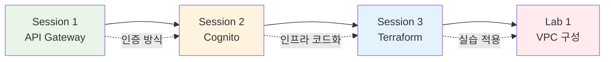

# November Week 2 Day 2: API Gateway + Cognito + Terraform 기본

<div align="center">

**🚪 API Gateway** • **👤 Cognito** • **🔧 Terraform** • **🌐 VPC 실습**

*서버리스 인증 시스템과 Terraform 기초*

</div>

---

## 🕘 일일 스케줄

| 시간 | 구분 | 내용 | 비고 |
|------|------|------|------|
| **09:00-09:40** | 📚 이론 1 | [Session 1: API Gateway](./session_1.md) | REST vs HTTP API |
| **09:40-10:20** | 📚 이론 2 | [Session 2: Cognito](./session_2.md) | 사용자 인증/인가 |
| **10:20-10:30** | ☕ 휴식 | 10분 휴식 | |
| **10:30-11:10** | 📚 이론 3 | [Session 3: Terraform 기본 명령어](./session_3.md) | init, plan, apply, destroy |
| **11:10-11:20** | ☕ 휴식 | 10분 휴식 | |
| **11:20-12:10** | 🛠️ 실습 | [Lab 1: Terraform VPC 구성](./lab_1.md) | Multi-AZ 네트워크 |
| **12:10-13:00** | 🍽️ 점심 | 점심시간 | |

---

## 🎯 Day 2 학습 목표

### 📚 이론 목표
- **API Gateway**: REST API vs HTTP API 차이, Lambda 통합, 인증 방식
- **Cognito**: User Pool vs Identity Pool, JWT 토큰, 데이터 저장 전략
- **Terraform**: init, plan, apply, destroy 워크플로우

### 🛠️ 실습 목표
- Terraform으로 VPC 네트워크 구성
- Multi-AZ 고가용성 설계
- Terraform 명령어 실습

---

## 📖 Session 개요

### Session 1: API Gateway (09:00-09:40)

**핵심 내용**:
- API Gateway 필요성 및 역할
- REST API vs HTTP API 비교
- Lambda 통합 방식 (Proxy Integration)
- 인증/인가 메커니즘 (API Key, IAM, Cognito, Lambda Authorizer)
- Kong과의 비교

**주요 개념**:
```
사용자 → API Gateway → Lambda → DynamoDB
         ↓
    - 인증/인가
    - Rate Limiting
    - 모니터링
```

**비용**:
- HTTP API: $1.29/백만 호출 (70% 저렴)
- REST API: $4.25/백만 호출 (고급 기능)

**공식 문서**:
- [API Gateway란?](https://docs.aws.amazon.com/apigateway/latest/developerguide/welcome.html)
- [REST API vs HTTP API](https://docs.aws.amazon.com/apigateway/latest/developerguide/http-api-vs-rest.html)

---

### Session 2: Cognito (09:40-10:20)

**핵심 내용**:
- User Pool (사용자 인증) vs Identity Pool (AWS 리소스 접근)
- JWT 토큰 구조 (ID Token, Access Token, Refresh Token)
- 인증 흐름 (회원가입 → 로그인 → API 호출)
- 사용자 데이터 저장 전략 (Cognito only vs Cognito + DynamoDB)

**주요 개념**:
```
Client → Cognito User Pool (로그인)
         ↓
    JWT 토큰 발급
         ↓
Client → API Gateway (JWT 검증)
         ↓
    Lambda (사용자 정보 사용)
```

**비용**:
- Essentials: 첫 10,000 MAU 무료
- 다음 40,000 MAU: $0.0055/MAU

**공식 문서**:
- [Cognito란?](https://docs.aws.amazon.com/cognito/latest/developerguide/what-is-amazon-cognito.html)
- [User Pool 가이드](https://docs.aws.amazon.com/cognito/latest/developerguide/cognito-user-identity-pools.html)

---

### Session 3: Terraform 기본 명령어 (10:30-11:10)

**핵심 내용**:
- `terraform init`: Provider 다운로드, Backend 초기화
- `terraform plan`: 변경 사항 미리보기 (Dry-run)
- `terraform apply`: 실제 인프라 배포
- `terraform destroy`: 모든 리소스 삭제

**워크플로우**:
```
코드 작성 → init → plan → apply → 운영 → destroy
```

**주요 옵션**:
- `init -upgrade`: Provider 업그레이드
- `plan -out=tfplan`: 계획 저장
- `apply -auto-approve`: 자동 승인 (CI/CD)
- `destroy -target`: 특정 리소스만 삭제

**공식 문서**:
- [Terraform CLI](https://developer.hashicorp.com/terraform/cli)
- [terraform init](https://developer.hashicorp.com/terraform/cli/commands/init)

---

## 🛠️ Lab 개요

### Lab 1: Terraform으로 VPC 네트워크 구성 (11:20-12:10)

**구축 인프라**:
```
VPC (10.0.0.0/16)
├── AZ-A (ap-northeast-2a)
│   ├── Public Subnet (10.0.1.0/24)
│   └── Private Subnet (10.0.11.0/24)
└── AZ-B (ap-northeast-2b)
    ├── Public Subnet (10.0.2.0/24)
    └── Private Subnet (10.0.12.0/24)

Internet Gateway + Route Tables
```

**실습 단계**:
1. 프로젝트 초기화
2. Provider 설정 + `terraform init`
3. VPC & Subnet 생성
4. IGW & Route Table 설정
5. Output 정의
6. 배포 (`terraform apply`)
7. 검증
8. 정리 (`terraform destroy`)

**학습 효과**:
- Terraform 워크플로우 완전 이해
- AWS VPC 네트워크 구조 파악
- Multi-AZ 고가용성 설계
- State 파일 관리 경험

**예상 비용**: $0 (VPC 자체는 무료)

---

## 🔗 Session 간 연결

### 전체 흐름



**연결 포인트**:
1. **API Gateway + Cognito**: 서버리스 인증 시스템
2. **Cognito + Terraform**: 인프라를 코드로 관리
3. **Terraform + VPC**: 실제 네트워크 인프라 구축

---

## 💡 Day 2 핵심 키워드

### API Gateway
- REST API vs HTTP API
- Lambda Proxy Integration
- Cognito Authorizer
- API Key, IAM 인증

### Cognito
- User Pool (인증)
- Identity Pool (AWS 접근)
- JWT 토큰 (ID, Access, Refresh)
- MAU (Monthly Active Users)

### Terraform
- `terraform init` (초기화)
- `terraform plan` (미리보기)
- `terraform apply` (배포)
- `terraform destroy` (삭제)
- State 파일

### VPC
- Multi-AZ 설계
- Public/Private Subnet
- Internet Gateway
- Route Table

---

## 📊 학습 성과 측정

### ✅ 이론 이해도
- [ ] API Gateway의 역할과 타입 차이 이해
- [ ] Cognito User Pool과 Identity Pool 구분
- [ ] JWT 토큰 구조 및 검증 방식 파악
- [ ] Terraform 워크플로우 이해

### ✅ 실습 완성도
- [ ] Terraform 프로젝트 초기화 성공
- [ ] VPC 네트워크 구성 완료
- [ ] Multi-AZ Subnet 생성 확인
- [ ] 리소스 정리 완료

### ✅ 실무 연계
- [ ] 서버리스 인증 시스템 설계 가능
- [ ] Terraform으로 인프라 관리 가능
- [ ] AWS 네트워크 구조 이해
- [ ] 비용 효율적 선택 가능

---

## 🎯 다음 Day 준비

### Day 3 예고: Terraform Variable & Module
- Variable 활용 (환경별 설정)
- Module 작성 (재사용 가능한 코드)
- Data Source (기존 리소스 참조)
- Local Values (계산된 값)

### 사전 준비
- Day 2 Lab 1 코드 복습
- Terraform 공식 문서 읽기
- AWS VPC 개념 정리

---

## 📚 참고 자료

### AWS 공식 문서
- [API Gateway 개발자 가이드](https://docs.aws.amazon.com/apigateway/latest/developerguide/)
- [Cognito 개발자 가이드](https://docs.aws.amazon.com/cognito/latest/developerguide/)
- [VPC 사용자 가이드](https://docs.aws.amazon.com/vpc/latest/userguide/)

### Terraform 공식 문서
- [Terraform CLI](https://developer.hashicorp.com/terraform/cli)
- [AWS Provider](https://registry.terraform.io/providers/hashicorp/aws/latest/docs)

### 추가 학습
- [AWS Well-Architected Framework](https://aws.amazon.com/architecture/well-architected/)
- [Terraform Best Practices](https://www.terraform-best-practices.com/)

---

<div align="center">

**🚪 API Gateway** • **👤 Cognito** • **🔧 Terraform** • **🌐 VPC**

*Day 2 완료 - 다음: Day 3 Terraform Variable & Module*

</div>
