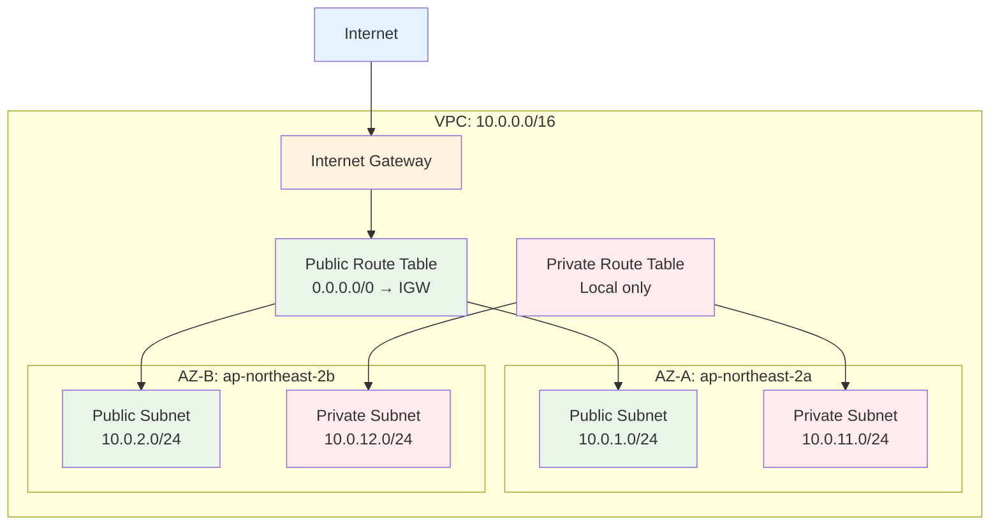

# November Week 2 Day 2 Lab 1: Terraform으로 VPC 네트워크 구성

<div align="center">

**🌐 VPC** • **🔧 Terraform** • **📊 Multi-AZ** • **🚀 실습**

*Terraform으로 프로덕션급 VPC 네트워크 인프라 구축*

</div>

---

## 🕘 Lab 정보
**시간**: 13:00-13:50 (50분)
**목표**: Terraform으로 Multi-AZ VPC 네트워크 구성
**방식**: 직접 코드 작성 및 배포
**사전 준비**: IAM 권한 설정 필수

## 🎯 학습 목표

### 📚 이해 목표
- Terraform으로 AWS 리소스 생성
- VPC 네트워크 구조 이해
- Multi-AZ 고가용성 설계
- Terraform 워크플로우 실습

### 🛠️ 구현 목표
- VPC 생성
- 2개 AZ에 각각 Public/Private Subnet
- Internet Gateway 및 Route Table 설정
- Terraform 명령어 실습

---

## 🏗️ 구축할 아키텍처

### 📐 네트워크 구조

```
VPC (10.0.0.0/16)
├── AZ-A (ap-northeast-2a)
│   ├── Public Subnet (10.0.1.0/24)
│   └── Private Subnet (10.0.11.0/24)
└── AZ-B (ap-northeast-2b)
    ├── Public Subnet (10.0.2.0/24)
    └── Private Subnet (10.0.12.0/24)

Internet Gateway
├── Public Route Table
│   └── 0.0.0.0/0 → IGW
└── Private Route Table
    └── Local only
```

**시각화**:


---

## 🔐 사전 준비 1: Terraform 설치

### Linux (Ubuntu/Debian)

```bash
# 1. HashiCorp GPG 키 추가
wget -O- https://apt.releases.hashicorp.com/gpg | sudo gpg --dearmor -o /usr/share/keyrings/hashicorp-archive-keyring.gpg

# 2. HashiCorp 저장소 추가
echo "deb [signed-by=/usr/share/keyrings/hashicorp-archive-keyring.gpg] https://apt.releases.hashicorp.com $(lsb_release -cs) main" | sudo tee /etc/apt/sources.list.d/hashicorp.list

# 3. 설치
sudo apt update
sudo apt install terraform

# 4. 확인
terraform version
```

### macOS

**방법 1: Homebrew (권장)**
```bash
# 1. Homebrew로 설치
brew tap hashicorp/tap
brew install hashicorp/tap/terraform

# 2. 확인
terraform version
```

**방법 2: 수동 설치**
```bash
# 1. 다운로드
wget https://releases.hashicorp.com/terraform/1.6.4/terraform_1.6.4_darwin_amd64.zip

# 2. 압축 해제
unzip terraform_1.6.4_darwin_amd64.zip

# 3. PATH에 추가
sudo mv terraform /usr/local/bin/

# 4. 확인
terraform version
```

### Windows

**방법 1: Chocolatey (권장)**
```powershell
# 1. Chocolatey로 설치
choco install terraform

# 2. 확인
terraform version
```

**방법 2: 수동 설치**
```powershell
# 1. 다운로드
# https://releases.hashicorp.com/terraform/1.6.4/terraform_1.6.4_windows_amd64.zip

# 2. 압축 해제 후 원하는 폴더에 저장 (예: C:\terraform)

# 3. 환경 변수 PATH에 추가
# 시스템 속성 → 환경 변수 → Path → 편집 → 새로 만들기 → C:\terraform

# 4. 새 터미널 열고 확인
terraform version
```

**예상 출력**:
```
Terraform v1.6.4
on linux_amd64
```

---

## 🔐 사전 준비 2: IAM 권한 설정

### 필요한 IAM 권한

**Terraform 실습에 필요한 권한**:
```json
{
  "Version": "2012-10-17",
  "Statement": [
    {
      "Effect": "Allow",
      "Action": [
        "ec2:CreateVpc",
        "ec2:DeleteVpc",
        "ec2:DescribeVpcs",
        "ec2:ModifyVpcAttribute",
        "ec2:CreateSubnet",
        "ec2:DeleteSubnet",
        "ec2:DescribeSubnets",
        "ec2:CreateInternetGateway",
        "ec2:DeleteInternetGateway",
        "ec2:AttachInternetGateway",
        "ec2:DetachInternetGateway",
        "ec2:DescribeInternetGateways",
        "ec2:CreateRouteTable",
        "ec2:DeleteRouteTable",
        "ec2:DescribeRouteTables",
        "ec2:CreateRoute",
        "ec2:DeleteRoute",
        "ec2:AssociateRouteTable",
        "ec2:DisassociateRouteTable",
        "ec2:CreateTags",
        "ec2:DeleteTags",
        "ec2:DescribeTags",
        "ec2:RunInstances",
        "ec2:TerminateInstances",
        "ec2:DescribeInstances",
        "ec2:DescribeInstanceTypes",
        "ec2:DescribeImages",
        "s3:CreateBucket",
        "s3:DeleteBucket",
        "s3:ListBucket",
        "s3:GetObject",
        "s3:PutObject",
        "s3:DeleteObject",
        "s3:GetBucketVersioning",
        "s3:PutBucketVersioning",
        "iam:GetRole",
        "iam:PassRole",
        "iam:CreateRole",
        "iam:DeleteRole",
        "iam:AttachRolePolicy",
        "iam:DetachRolePolicy"
      ],
      "Resource": "*"
    }
  ]
}
```

**또는 간단하게 관리형 정책 사용**:
- `AmazonEC2FullAccess` (VPC, Subnet, IGW, Route Table, EC2 포함)
- `AmazonS3FullAccess` (S3 Backend용)

### IAM User 생성 및 권한 부여

**방법 1: 관리형 정책 사용 (권장 - 간단)**

**Step 1: IAM User 생성**
```
1. AWS Console 로그인
2. 검색창에 "IAM" 입력 → IAM 서비스 선택
3. 왼쪽 메뉴 → Users → "Create user" 버튼 클릭
4. User name: terraform-user
5. "Next" 클릭
```

**Step 2: 권한 부여**
```
6. "Attach policies directly" 선택
7. 정책 검색 및 선택:
   ✅ AmazonEC2FullAccess (체크박스 선택)
   ✅ AmazonS3FullAccess (체크박스 선택)
8. "Next" 클릭
9. "Create user" 클릭
```

**Step 3: Access Key 생성**
```
10. 생성된 사용자 클릭 (terraform-user)
11. "Security credentials" 탭 선택
12. "Access keys" 섹션에서 "Create access key" 클릭
13. Use case 선택: "Command Line Interface (CLI)" 선택
14. 하단 체크박스 선택: "I understand the above recommendation..."
15. "Next" 클릭
16. Description tag (선택사항): "Terraform Lab"
17. "Create access key" 클릭
```

**Step 4: Access Key 저장 (중요!)**
```
18. ⚠️ 이 화면에서만 Secret Access Key 확인 가능!
19. 두 가지 방법 중 선택:
    
    방법 A: CSV 파일 다운로드
    - "Download .csv file" 클릭
    - 안전한 위치에 저장
    
    방법 B: 직접 복사
    - Access key ID: AKIA... (복사)
    - Secret access key: wJalrXUtn... (복사)
    - 메모장에 안전하게 저장

20. "Done" 클릭
```

**⚠️ 중요 보안 사항**:
- Secret Access Key는 이 화면에서만 확인 가능
- 분실 시 새로운 Access Key 생성 필요
- Access Key는 절대 GitHub 등에 업로드 금지
- 사용 후 비활성화 또는 삭제 권장

**방법 2: 커스텀 정책 사용 (최소 권한 원칙)**

1. IAM Console → Policies → Create policy
2. JSON 탭에서 위의 권한 JSON 붙여넣기
3. Policy name: `TerraformLabPolicy`
4. User 생성 후 해당 정책 연결
5. 위의 Step 3-4와 동일하게 Access Key 생성

### AWS CLI 설정

**Step 1: AWS CLI 설치 확인**
```bash
# AWS CLI 버전 확인
aws --version

# 예상 출력:
# aws-cli/2.x.x Python/3.x.x Linux/x86_64
```

**AWS CLI 미설치 시**:
- Linux: `sudo apt install awscli` 또는 `pip install awscli`
- macOS: `brew install awscli`
- Windows: https://aws.amazon.com/cli/ 에서 설치

**Step 2: AWS CLI 설정**
```bash
# AWS 자격 증명 설정
aws configure

# 프롬프트에 따라 입력:
AWS Access Key ID [None]: AKIA...  # Step 4에서 저장한 Access Key ID
AWS Secret Access Key [None]: wJalrXUtn...  # Step 4에서 저장한 Secret Access Key
Default region name [None]: ap-northeast-2  # 서울 리전
Default output format [None]: json  # JSON 형식
```

**Step 3: 설정 확인**
```bash
# 자격 증명 확인
aws sts get-caller-identity
```

**예상 출력**:
```json
{
    "UserId": "AIDAXXXXXXXXXXXXXXXXX",
    "Account": "123456789012",
    "Arn": "arn:aws:iam::123456789012:user/terraform-user"
}
```

**✅ 출력에서 확인할 사항**:
- `UserId`: IAM User ID
- `Account`: AWS 계정 번호
- `Arn`: IAM User ARN (terraform-user 확인)

**❌ 오류 발생 시**:
```bash
# 오류: Unable to locate credentials
# 해결: aws configure 다시 실행하여 Access Key 재입력

# 오류: InvalidClientTokenId
# 해결: Access Key ID가 잘못됨. 올바른 키 확인 후 재입력

# 오류: SignatureDoesNotMatch
# 해결: Secret Access Key가 잘못됨. 올바른 키 확인 후 재입력
```

**Step 4: 설정 파일 확인 (선택사항)**
```bash
# 설정 파일 위치
# Linux/macOS: ~/.aws/credentials
# Windows: C:\Users\USERNAME\.aws\credentials

# 파일 내용 확인
cat ~/.aws/credentials

# 예상 출력:
# [default]
# aws_access_key_id = AKIA...
# aws_secret_access_key = wJalrXUtn...
```

**✅ 사전 준비 체크리스트**:
- [ ] Terraform 설치 완료 (`terraform version` 확인)
- [ ] AWS CLI 설치 완료 (`aws --version` 확인)
- [ ] IAM User 생성 완료 (terraform-user)
- [ ] 권한 부여 완료 (EC2FullAccess, S3FullAccess)
- [ ] Access Key 생성 및 저장 완료
- [ ] AWS CLI 설정 완료 (`aws sts get-caller-identity` 성공)

---

## 🛠️ Step 1: S3 Backend 버킷 생성 (5분)

### S3 버킷 생성

```bash
# 1. 고유한 버킷 이름 생성 (본인 이름 또는 랜덤 문자열 사용)
BUCKET_NAME="terraform-state-$(whoami)-$(date +%s)"
echo $BUCKET_NAME

# 2. S3 버킷 생성
aws s3 mb s3://${BUCKET_NAME} --region ap-northeast-2

# 3. 버킷 버전 관리 활성화 (State 파일 보호)
aws s3api put-bucket-versioning \
  --bucket ${BUCKET_NAME} \
  --versioning-configuration Status=Enabled

# 4. 버킷 확인
aws s3 ls | grep terraform-state
```

**예상 출력**:
```
make_bucket: terraform-state-user-1699000000
2024-11-04 12:00:00 terraform-state-user-1699000000
```

**⚠️ 버킷 이름 저장**:
```bash
# 버킷 이름을 메모장에 저장하세요!
# 예: terraform-state-user-1699000000
# 다음 단계에서 사용됩니다.
```

**✅ 체크포인트**:
- [ ] S3 버킷 생성 완료
- [ ] 버전 관리 활성화 완료
- [ ] 버킷 이름 저장 완료

---

## 🛠️ Step 2: 프로젝트 초기화 (5분)

### 작업 디렉토리 생성

```bash
# 1. 프로젝트 폴더 생성
mkdir -p ~/terraform-labs/day2-vpc
cd ~/terraform-labs/day2-vpc

# 2. 파일 구조 확인
pwd
# 출력: /home/user/terraform-labs/day2-vpc
```

---

## 🛠️ Step 3: Provider 및 Backend 설정 (10분)

### main.tf 작성

```bash
cat > main.tf << 'EOF'
# Terraform 설정
terraform {
  required_version = ">= 1.0"
  
  required_providers {
    aws = {
      source  = "hashicorp/aws"
      version = "~> 5.0"
    }
  }
  
  # S3 Backend 설정
  backend "s3" {
    bucket = "terraform-state-user-1699000000"  # ⚠️ 본인의 버킷 이름으로 변경!
    key    = "vpc/terraform.tfstate"
    region = "ap-northeast-2"
  }
}

# AWS Provider 설정
provider "aws" {
  region = "ap-northeast-2"  # 서울 리전
}
EOF
```

**⚠️ 중요: 버킷 이름 변경**
```bash
# Step 1에서 생성한 버킷 이름으로 변경하세요!
# 예: terraform-state-user-1699000000

# 방법 1: 텍스트 에디터로 수정
vim main.tf  # 또는 nano, code 등

# 방법 2: sed 명령어로 자동 변경
BUCKET_NAME="terraform-state-user-1699000000"  # 본인 버킷 이름
sed -i "s/terraform-state-user-1699000000/${BUCKET_NAME}/g" main.tf
```

### Backend 초기화

```bash
# Terraform 초기화 (Backend 설정 포함)
terraform init
```

**예상 출력**:
```
Initializing the backend...

Successfully configured the backend "s3"! Terraform will automatically
use this backend unless the backend configuration changes.

Initializing provider plugins...
- Finding hashicorp/aws versions matching "~> 5.0"...
- Installing hashicorp/aws v5.25.0...

Terraform has been successfully initialized!
```

**✅ 체크포인트**:
- [ ] `main.tf` 파일 생성됨
- [ ] 버킷 이름 변경 완료
- [ ] `.terraform/` 폴더 생성됨
- [ ] `.terraform.lock.hcl` 파일 생성됨
- [ ] S3 Backend 초기화 성공
- [ ] AWS Provider 다운로드 완료

**🔍 Backend 확인**:
```bash
# S3에 state 파일 확인 (아직 비어있음)
aws s3 ls s3://${BUCKET_NAME}/vpc/

# 출력: (비어있음 - apply 후 생성됨)
```

---

## 🛠️ Step 4: VPC 및 Subnet 생성 (15분)

### vpc.tf 작성

```bash
cat > vpc.tf << 'EOF'
# VPC
resource "aws_vpc" "main" {
  cidr_block           = "10.0.0.0/16"
  enable_dns_hostnames = true
  enable_dns_support   = true
  
  tags = {
    Name = "terraform-vpc"
  }
}

# Public Subnet - AZ A
resource "aws_subnet" "public_a" {
  vpc_id                  = aws_vpc.main.id
  cidr_block              = "10.0.1.0/24"
  availability_zone       = "ap-northeast-2a"
  map_public_ip_on_launch = true
  
  tags = {
    Name = "public-subnet-a"
    Type = "Public"
  }
}

# Public Subnet - AZ B
resource "aws_subnet" "public_b" {
  vpc_id                  = aws_vpc.main.id
  cidr_block              = "10.0.2.0/24"
  availability_zone       = "ap-northeast-2b"
  map_public_ip_on_launch = true
  
  tags = {
    Name = "public-subnet-b"
    Type = "Public"
  }
}

# Private Subnet - AZ A
resource "aws_subnet" "private_a" {
  vpc_id            = aws_vpc.main.id
  cidr_block        = "10.0.11.0/24"
  availability_zone = "ap-northeast-2a"
  
  tags = {
    Name = "private-subnet-a"
    Type = "Private"
  }
}

# Private Subnet - AZ B
resource "aws_subnet" "private_b" {
  vpc_id            = aws_vpc.main.id
  cidr_block        = "10.0.12.0/24"
  availability_zone = "ap-northeast-2b"
  
  tags = {
    Name = "private-subnet-b"
    Type = "Private"
  }
}
EOF
```

### 계획 확인

```bash
terraform plan
```

**예상 출력**:
```
Terraform will perform the following actions:

  # aws_vpc.main will be created
  + resource "aws_vpc" "main" {
      + cidr_block = "10.0.0.0/16"
      + id         = (known after apply)
    }

  # aws_subnet.public_a will be created
  + resource "aws_subnet" "public_a" {
      + cidr_block = "10.0.1.0/24"
      + vpc_id     = (known after apply)
    }

  # ... (4개 subnet 더)

Plan: 5 to add, 0 to change, 0 to destroy.
```

**✅ 체크포인트**:
- [ ] VPC 1개 생성 예정
- [ ] Subnet 4개 생성 예정
- [ ] 총 5개 리소스 생성

---

## 🛠️ Step 5: Internet Gateway 및 Route Table (15분)

### igw.tf 작성

```bash
cat > igw.tf << 'EOF'
# Internet Gateway
resource "aws_internet_gateway" "main" {
  vpc_id = aws_vpc.main.id
  
  tags = {
    Name = "terraform-igw"
  }
}

# Public Route Table
resource "aws_route_table" "public" {
  vpc_id = aws_vpc.main.id
  
  route {
    cidr_block = "0.0.0.0/0"
    gateway_id = aws_internet_gateway.main.id
  }
  
  tags = {
    Name = "public-rt"
  }
}

# Public Subnet A - Route Table Association
resource "aws_route_table_association" "public_a" {
  subnet_id      = aws_subnet.public_a.id
  route_table_id = aws_route_table.public.id
}

# Public Subnet B - Route Table Association
resource "aws_route_table_association" "public_b" {
  subnet_id      = aws_subnet.public_b.id
  route_table_id = aws_route_table.public.id
}

# Private Route Table
resource "aws_route_table" "private" {
  vpc_id = aws_vpc.main.id
  
  tags = {
    Name = "private-rt"
  }
}

# Private Subnet A - Route Table Association
resource "aws_route_table_association" "private_a" {
  subnet_id      = aws_subnet.private_a.id
  route_table_id = aws_route_table.private.id
}

# Private Subnet B - Route Table Association
resource "aws_route_table_association" "private_b" {
  subnet_id      = aws_subnet.private_b.id
  route_table_id = aws_route_table.private.id
}
EOF
```

### 계획 확인

```bash
terraform plan
```

**예상 출력**:
```
Plan: 12 to add, 0 to change, 0 to destroy.

Changes to Outputs:
  + vpc_id = (known after apply)
```

**✅ 체크포인트**:
- [ ] Internet Gateway 1개
- [ ] Route Table 2개 (Public, Private)
- [ ] Route Table Association 4개
- [ ] 총 12개 리소스 생성 예정

---

## 🛠️ Step 6: Output 설정 (5분)

### outputs.tf 작성

```bash
cat > outputs.tf << 'EOF'
# VPC ID
output "vpc_id" {
  description = "VPC ID"
  value       = aws_vpc.main.id
}

# VPC CIDR
output "vpc_cidr" {
  description = "VPC CIDR Block"
  value       = aws_vpc.main.cidr_block
}

# Public Subnet IDs
output "public_subnet_ids" {
  description = "Public Subnet IDs"
  value = [
    aws_subnet.public_a.id,
    aws_subnet.public_b.id
  ]
}

# Private Subnet IDs
output "private_subnet_ids" {
  description = "Private Subnet IDs"
  value = [
    aws_subnet.private_a.id,
    aws_subnet.private_b.id
  ]
}

# Internet Gateway ID
output "igw_id" {
  description = "Internet Gateway ID"
  value       = aws_internet_gateway.main.id
}
EOF
```

---

## 🛠️ Step 6: 인프라 배포 (5분)

### 최종 계획 확인

```bash
terraform plan
```

### 배포 실행

```bash
terraform apply
```

**프롬프트**:
```
Do you want to perform these actions?
  Terraform will perform the actions described above.
  Only 'yes' will be accepted to approve.

  Enter a value: yes
```

**예상 출력**:
```
aws_vpc.main: Creating...
aws_vpc.main: Creation complete after 2s [id=vpc-0123456789abcdef0]
aws_internet_gateway.main: Creating...
aws_subnet.public_a: Creating...
aws_subnet.public_b: Creating...
aws_subnet.private_a: Creating...
aws_subnet.private_b: Creating...
...
Apply complete! Resources: 12 added, 0 changed, 0 destroyed.

Outputs:

vpc_id = "vpc-0123456789abcdef0"
vpc_cidr = "10.0.0.0/16"
public_subnet_ids = [
  "subnet-0123456789abcdef0",
  "subnet-0123456789abcdef1",
]
private_subnet_ids = [
  "subnet-0123456789abcdef2",
  "subnet-0123456789abcdef3",
]
igw_id = "igw-0123456789abcdef0"
```

**✅ 체크포인트**:
- [ ] 12개 리소스 생성 완료
- [ ] Output 값 출력됨
- [ ] `terraform.tfstate` 파일 생성됨

---

## 🛠️ Step 7: 검증 (5분)

### AWS Console 확인

```bash
# VPC 확인
aws ec2 describe-vpcs \
  --filters "Name=tag:Name,Values=terraform-vpc" \
  --query 'Vpcs[0].[VpcId,CidrBlock]' \
  --output table

# Subnet 확인
aws ec2 describe-subnets \
  --filters "Name=vpc-id,Values=$(terraform output -raw vpc_id)" \
  --query 'Subnets[*].[SubnetId,CidrBlock,AvailabilityZone,Tags[?Key==`Name`].Value|[0]]' \
  --output table
```

### Terraform State 확인

```bash
# State 목록
terraform state list

# 특정 리소스 상세
terraform state show aws_vpc.main
```

**예상 출력**:
```
# terraform state list
aws_vpc.main
aws_internet_gateway.main
aws_subnet.public_a
aws_subnet.public_b
aws_subnet.private_a
aws_subnet.private_b
aws_route_table.public
aws_route_table.private
aws_route_table_association.public_a
aws_route_table_association.public_b
aws_route_table_association.private_a
aws_route_table_association.private_b
```

---

## 🧹 리소스 정리 (5분)

### 삭제 계획 확인

```bash
terraform plan -destroy
```

### 리소스 삭제

```bash
terraform destroy
```

**프롬프트**:
```
Do you really want to destroy all resources?
  Enter a value: yes
```

**예상 출력**:
```
aws_route_table_association.public_a: Destroying...
aws_route_table_association.public_b: Destroying...
...
aws_vpc.main: Destroying...
aws_vpc.main: Destruction complete after 1s

Destroy complete! Resources: 12 destroyed.
```

**✅ 체크포인트**:
- [ ] 12개 리소스 삭제 완료
- [ ] `terraform.tfstate` 파일 비어있음
- [ ] AWS Console에서 리소스 삭제 확인

---

## 💡 Lab 회고

### 🤝 페어 회고 (5분)
1. **Terraform 워크플로우**: init → plan → apply → destroy 순서 이해
2. **리소스 의존성**: VPC → Subnet → IGW → Route Table 순서
3. **Multi-AZ 설계**: 고가용성을 위한 2개 AZ 구성
4. **State 관리**: terraform.tfstate 파일의 중요성

### 📊 학습 성과
- **Terraform 기본**: 4개 명령어 실습 완료
- **AWS 네트워크**: VPC, Subnet, IGW, Route Table 이해
- **IaC 경험**: 코드로 인프라 관리하는 경험
- **실무 패턴**: 프로덕션급 네트워크 구조 학습

### 🎯 다음 단계
- **Day 3**: Terraform Variable & Module
- **Day 4**: Terraform State 관리 (S3 Backend)
- **Day 5**: 전체 인프라 통합 (VPC + EC2 + RDS)

---

## 📋 전체 파일 구조

```
terraform-labs/day2-vpc/
├── main.tf              # Provider 설정
├── vpc.tf               # VPC & Subnet
├── igw.tf               # IGW & Route Table
├── outputs.tf           # Output 정의
├── .terraform/          # Provider 플러그인
├── .terraform.lock.hcl  # Provider 버전 잠금
└── terraform.tfstate    # 현재 인프라 상태
```

---

## 💰 예상 비용

**VPC 리소스**:
- VPC: $0 (무료)
- Subnet: $0 (무료)
- Internet Gateway: $0 (무료)
- Route Table: $0 (무료)

**총 비용**: **$0** (VPC 네트워크 자체는 무료)

**⚠️ 주의**: EC2, NAT Gateway 등 추가 리소스 사용 시 비용 발생

---

<div align="center">

**🌐 VPC 구성 완료** • **🔧 Terraform 실습** • **📊 Multi-AZ** • **💰 무료**

*다음: Day 3 - Terraform Variable & Module*

</div>
