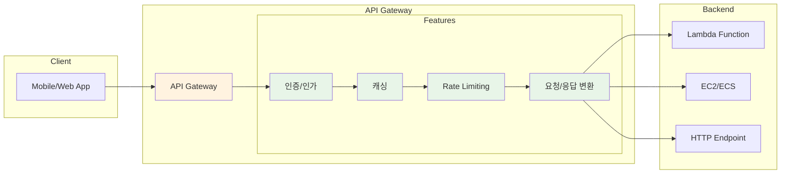
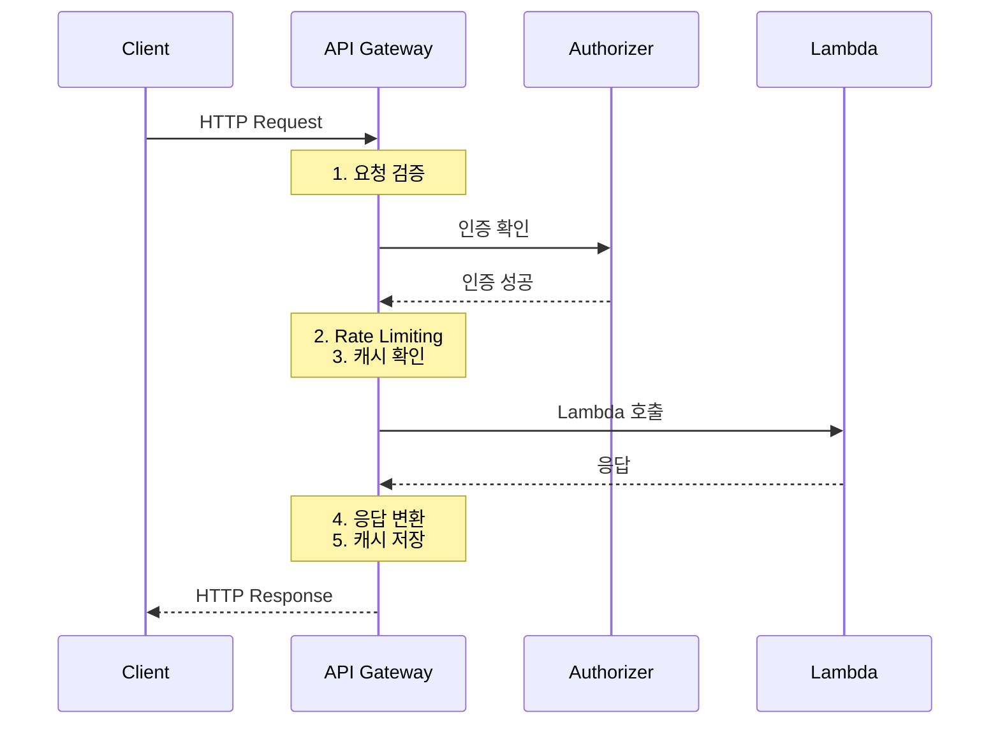

# November Week 2 Day 2 Session 1: API Gateway

<div align="center">

**🚪 API 관리** • **🔐 인증/인가** • **⚡ 서버리스 통합**

*RESTful API를 생성, 배포, 관리하는 완전 관리형 서비스*

</div>

---

## 🕘 세션 정보
**시간**: 09:00-09:50 (50분)
**목표**: AWS API Gateway의 핵심 개념과 Lambda 통합 방법 이해
**방식**: 개념 설명 + 실무 사례 + 아키텍처 패턴

## 🎯 학습 목표
- API Gateway의 생성 배경과 필요성 이해
- REST API와 HTTP API의 차이점 파악
- Lambda 통합 방식 (Proxy vs Custom) 이해
- 인증/인가 메커니즘 (API Key, IAM, Cognito, Lambda Authorizer) 습득
- 비용 구조와 최적화 방법 학습

---

## 📖 서비스 개요

### 1. 생성 배경 (Why?) - 5분

**문제 상황**:
- **API 관리의 복잡성**: 버전 관리, 배포, 모니터링을 직접 구현 필요
- **인증/인가 구현 어려움**: 보안 메커니즘을 매번 새로 개발
- **트래픽 관리 부재**: Rate limiting, Throttling 직접 구현
- **확장성 문제**: 트래픽 증가 시 서버 확장 필요

**AWS API Gateway 솔루션**:
- **완전 관리형**: API 생명주기 전체 관리
- **내장 인증**: API Key, IAM, Cognito, Lambda Authorizer 지원
- **자동 확장**: 트래픽에 따라 자동으로 확장
- **서버리스 통합**: Lambda와 완벽한 통합

### 2. 핵심 원리 (How?) - 10분

**API Gateway 작동 원리**:



**핵심 구성 요소**:

1. **API (Application Programming Interface)**:
   - REST API: 완전한 기능, 높은 비용
   - HTTP API: 기본 기능, 저렴한 비용
   - WebSocket API: 양방향 통신

2. **Resource (리소스)**:
   - API의 경로 (예: /users, /orders)
   - 계층 구조 지원 (예: /users/{id}/orders)

3. **Method (메서드)**:
   - HTTP 메서드 (GET, POST, PUT, DELETE 등)
   - 각 리소스에 여러 메서드 정의 가능

4. **Integration (통합)**:
   - Lambda Function
   - HTTP Endpoint
   - AWS Service (DynamoDB, S3 등)

**요청 처리 흐름**:


### 3. 주요 사용 사례 (When?) - 5분

**적합한 경우**:

1. **서버리스 API**:
   - Lambda 함수를 HTTP 엔드포인트로 노출
   - 인프라 관리 없이 API 제공

2. **마이크로서비스 게이트웨이**:
   - 여러 마이크로서비스를 단일 엔드포인트로 통합
   - 서비스 간 라우팅 및 인증

3. **레거시 시스템 현대화**:
   - 기존 HTTP 엔드포인트를 RESTful API로 변환
   - 인증 및 모니터링 추가

4. **모바일/웹 백엔드**:
   - 모바일 앱의 백엔드 API
   - SPA(Single Page Application) 백엔드

**실제 사례**:
- **Netflix**: 수천 개의 마이크로서비스를 API Gateway로 통합
- **Airbnb**: 모바일 앱 백엔드 API
- **Uber**: 운전자 및 승객 앱 API

### 4. 비슷한 서비스 비교 (Which?) - 5분

**AWS 내 대안 서비스**:

**API Gateway vs ALB (Application Load Balancer)**:
- **API Gateway 사용**: 서버리스, API 관리 기능, 인증/인가 내장
- **ALB 사용**: EC2/ECS 기반, 간단한 로드 밸런싱, 저렴한 비용

**API Gateway vs AppSync**:
- **API Gateway 사용**: REST API, HTTP API, 유연한 통합
- **AppSync 사용**: GraphQL API, 실시간 구독, 오프라인 동기화

**REST API vs HTTP API**:
- **REST API 사용**: 완전한 기능, API Key, Usage Plans, 캐싱
- **HTTP API 사용**: 기본 기능, 저렴한 비용, 빠른 성능

**선택 기준**:
| 기준 | REST API | HTTP API | ALB | AppSync |
|------|----------|----------|-----|---------|
| 비용 | 높음 | 낮음 (70% 저렴) | 매우 낮음 | 중간 |
| 기능 | 완전 | 기본 | 제한적 | GraphQL 전용 |
| 인증 | 모두 지원 | IAM, JWT | 기본 | Cognito, IAM |
| 캐싱 | 지원 | 미지원 | 미지원 | 지원 |
| WebSocket | 지원 | 미지원 | 미지원 | 지원 (구독) |
| 사용 사례 | 복잡한 API | 간단한 API | EC2/ECS | GraphQL |

### 5. 장단점 분석 - 3분

**장점**:
- ✅ **완전 관리형**: 서버 관리 불필요, 자동 확장
- ✅ **내장 인증**: API Key, IAM, Cognito, Lambda Authorizer
- ✅ **모니터링**: CloudWatch 통합, X-Ray 추적
- ✅ **캐싱**: 응답 캐싱으로 성능 향상 (REST API만)
- ✅ **버전 관리**: Stage를 통한 환경 분리

**단점/제약사항**:
- ⚠️ **비용**: 요청당 과금, 대량 트래픽 시 비용 증가
- ⚠️ **타임아웃**: 최대 29초 (Lambda 통합 시)
- ⚠️ **페이로드 크기**: 최대 10MB
- ⚠️ **Cold Start**: Lambda 통합 시 초기 지연

**대안**:
- 비용 절감: HTTP API 사용 또는 ALB 고려
- 긴 처리 시간: 비동기 처리 (SQS, Step Functions)
- 큰 파일: S3 Pre-signed URL 사용

### 6. 비용 구조 💰 - 5분

**과금 방식**:

**REST API**:
- API 호출: 100만 건당 $3.50
- 데이터 전송: GB당 $0.09
- 캐싱: 시간당 $0.02 (0.5GB 캐시)

**HTTP API**:
- API 호출: 100만 건당 $1.00 (REST API 대비 70% 저렴)
- 데이터 전송: GB당 $0.09

**프리티어 혜택** (12개월):
- REST API: 100만 건/월 무료
- HTTP API: 100만 건/월 무료

**비용 최적화 팁**:
1. **HTTP API 우선 고려**: 기본 기능만 필요하면 HTTP API
2. **캐싱 활용**: 반복 요청 캐싱으로 비용 절감 (REST API)
3. **압축 사용**: 응답 압축으로 데이터 전송 비용 절감
4. **적절한 Stage**: 개발/테스트는 별도 Stage
5. **CloudFront 통합**: 정적 콘텐츠는 CloudFront 캐싱

**예상 비용 계산**:
```
월간 1,000만 건 API 호출 시:

REST API:
- API 호출: (1,000만 - 100만) / 100만 × $3.50 = $31.50
- 데이터 전송 (10GB): 10 × $0.09 = $0.90
총 비용: $32.40/월

HTTP API:
- API 호출: (1,000만 - 100만) / 100만 × $1.00 = $9.00
- 데이터 전송 (10GB): 10 × $0.09 = $0.90
총 비용: $9.90/월 (70% 절감)
```

**실제 사용 예시**:
| 시나리오 | 월간 호출 | API 타입 | 예상 비용 |
|----------|-----------|----------|-----------|
| 소규모 앱 | 50만 건 | HTTP | $0 (프리티어) |
| 중규모 앱 | 500만 건 | HTTP | $4.00 |
| 대규모 앱 | 5,000만 건 | HTTP | $49.00 |
| 엔터프라이즈 | 5,000만 건 | REST (캐싱) | $150.00 |

### 7. 최신 업데이트 🆕 - 2분

**2024년 주요 변경사항**:
- **HTTP API JWT Authorizer**: JWT 토큰 검증 기능 강화
- **Mutual TLS**: 클라이언트 인증서 기반 인증 지원
- **Enhanced Observability**: CloudWatch 메트릭 개선

**2025년 예정**:
- **더 긴 타임아웃**: 60초까지 확장 검토 중
- **더 큰 페이로드**: 20MB까지 지원 예정

**참조**: [AWS API Gateway What's New](https://aws.amazon.com/api-gateway/whats-new/)

### 8. 잘 사용하는 방법 ✅ - 3분

**베스트 프랙티스**:
1. **HTTP API 우선**: 기본 기능만 필요하면 HTTP API 사용
2. **Lambda Proxy Integration**: 간단한 통합, 유연한 응답
3. **Stage Variables**: 환경별 설정 분리 (dev, staging, prod)
4. **CloudWatch Logs**: 상세 로깅으로 디버깅
5. **Custom Domain**: 사용자 친화적 도메인 사용

**실무 팁**:
- **CORS 설정**: 웹 애플리케이션에서 API 호출 시 필수
- **Request Validation**: API Gateway에서 요청 검증
- **Response Caching**: 반복 요청 캐싱 (REST API)
- **Throttling**: Rate limiting으로 과도한 요청 방지

**코드 예시**:
```python
import boto3
import json

apigateway = boto3.client('apigateway')

# REST API 생성
response = apigateway.create_rest_api(
    name='my-api',
    description='My REST API',
    endpointConfiguration={
        'types': ['REGIONAL']
    }
)

api_id = response['id']

# 리소스 생성
root_id = apigateway.get_resources(restApiId=api_id)['items'][0]['id']

resource = apigateway.create_resource(
    restApiId=api_id,
    parentId=root_id,
    pathPart='users'
)

# 메서드 생성 (GET)
apigateway.put_method(
    restApiId=api_id,
    resourceId=resource['id'],
    httpMethod='GET',
    authorizationType='NONE'
)

# Lambda 통합
apigateway.put_integration(
    restApiId=api_id,
    resourceId=resource['id'],
    httpMethod='GET',
    type='AWS_PROXY',
    integrationHttpMethod='POST',
    uri=f'arn:aws:apigateway:ap-northeast-2:lambda:path/2015-03-31/functions/arn:aws:lambda:ap-northeast-2:123456789012:function:my-function/invocations'
)
```

### 9. 잘못 사용하는 방법 ❌ - 3분

**흔한 실수**:
1. **REST API 남용**: 기본 기능만 필요한데 REST API 사용
2. **캐싱 미사용**: 반복 요청에도 캐싱 안 함
3. **CORS 미설정**: 웹 앱에서 API 호출 실패
4. **Throttling 미설정**: DDoS 공격에 취약
5. **로깅 미활성화**: 문제 발생 시 디버깅 어려움

**안티 패턴**:
- **동기 처리 강요**: 긴 작업을 API Gateway에서 처리
- **대용량 파일 전송**: 10MB 제한 초과
- **API Key만 사용**: 보안 취약, IAM이나 Cognito 사용 권장
- **Stage 미사용**: 개발/운영 환경 분리 안 함

**보안 취약점**:
- **인증 없음**: 공개 API로 노출
- **Rate Limiting 없음**: 과도한 요청으로 비용 폭탄
- **HTTPS 미사용**: 데이터 평문 전송
- **API Key 하드코딩**: 코드에 API Key 포함

### 10. 구성 요소 상세 - 5분

**주요 구성 요소**:

**1. API Types (API 타입)**:

**REST API**:
- **특징**: 완전한 기능, API Key, Usage Plans, 캐싱
- **비용**: 100만 건당 $3.50
- **사용 시기**: 복잡한 API, 캐싱 필요, API Key 관리

**HTTP API**:
- **특징**: 기본 기능, 저렴한 비용, 빠른 성능
- **비용**: 100만 건당 $1.00
- **사용 시기**: 간단한 API, Lambda 통합, 비용 절감

**WebSocket API**:
- **특징**: 양방향 통신, 실시간 메시징
- **비용**: 연결당 + 메시지당
- **사용 시기**: 채팅, 실시간 알림, 게임

**2. Integration Types (통합 타입)**:

**Lambda Proxy Integration**:
- **특징**: Lambda가 전체 요청/응답 처리
- **장점**: 간단, 유연
- **예시**:
```python
def lambda_handler(event, context):
    return {
        'statusCode': 200,
        'body': json.dumps({'message': 'Hello'})
    }
```

**Lambda Custom Integration**:
- **특징**: API Gateway에서 요청/응답 변환
- **장점**: 세밀한 제어
- **단점**: 복잡한 설정

**HTTP Integration**:
- **특징**: HTTP 엔드포인트 통합
- **용도**: 기존 API 통합, 마이크로서비스

**3. Authorization (인증/인가)**:

**API Key**:
- **용도**: 간단한 인증, Usage Plans
- **보안**: 낮음, 추가 인증 필요

**IAM**:
- **용도**: AWS 서비스 간 통신
- **보안**: 높음, SigV4 서명

**Cognito User Pool**:
- **용도**: 사용자 인증
- **보안**: 높음, JWT 토큰

**Lambda Authorizer**:
- **용도**: 커스텀 인증 로직
- **보안**: 유연, 복잡도 높음

**4. Stages (스테이지)**:
- **역할**: 환경 분리 (dev, staging, prod)
- **기능**: Stage Variables, Canary 배포
- **예시**: `https://api.example.com/dev/users`

**5. Usage Plans (사용 계획)**:
- **역할**: API 사용량 제한
- **기능**: Rate Limiting, Quota
- **예시**: 초당 1,000건, 월 100만 건

### 11. 공식 문서 링크 (필수 5개)

**⚠️ 학생들이 직접 확인해야 할 공식 문서**:
- 📘 [API Gateway란 무엇인가?](https://docs.aws.amazon.com/apigateway/latest/developerguide/welcome.html)
- 📗 [API Gateway 사용자 가이드](https://docs.aws.amazon.com/apigateway/latest/developerguide/)
- 📙 [API Gateway API 레퍼런스](https://docs.aws.amazon.com/apigateway/latest/api/)
- 📕 [API Gateway 요금](https://aws.amazon.com/api-gateway/pricing/)
- 🆕 [API Gateway 최신 업데이트](https://aws.amazon.com/api-gateway/whats-new/)

---

## 💭 함께 생각해보기

**토론 주제**:
1. REST API와 HTTP API 중 어떤 것을 선택해야 할까?
2. Lambda Proxy Integration의 장단점은?
3. 어떤 인증 방식을 선택해야 할까?

---

## 🔑 핵심 키워드

- **API Gateway**: AWS 완전 관리형 API 서비스
- **REST API**: 완전한 기능을 제공하는 API 타입
- **HTTP API**: 기본 기능과 저렴한 비용의 API 타입
- **Lambda Proxy Integration**: Lambda가 전체 요청/응답 처리
- **Stage**: 환경 분리 (dev, staging, prod)
- **Authorizer**: 인증/인가 메커니즘
- **Usage Plan**: API 사용량 제한
- **Throttling**: Rate limiting으로 과도한 요청 방지

---

## 📝 세션 마무리

### ✅ 오늘 세션 성과
- [ ] API Gateway의 필요성 이해
- [ ] REST API와 HTTP API 차이점 파악
- [ ] Lambda 통합 방식 이해
- [ ] 인증/인가 메커니즘 습득
- [ ] 비용 구조와 최적화 방법 학습

### 🎯 다음 세션 준비
**Session 2: Cognito**
- User Pool vs Identity Pool
- JWT 토큰 인증
- API Gateway 통합

---

<div align="center">

**🚪 API 관리** • **🔐 인증/인가** • **⚡ 서버리스 통합**

*API Gateway로 확장 가능한 서버리스 API 구축*

</div>
