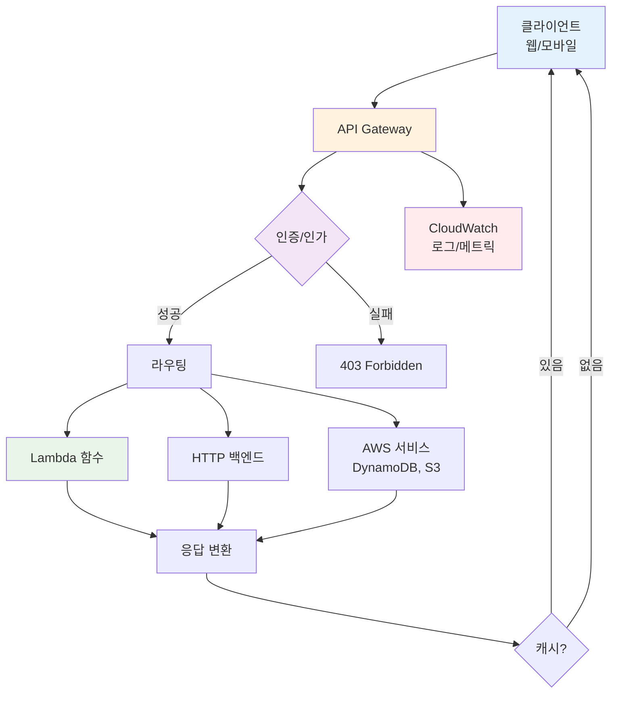
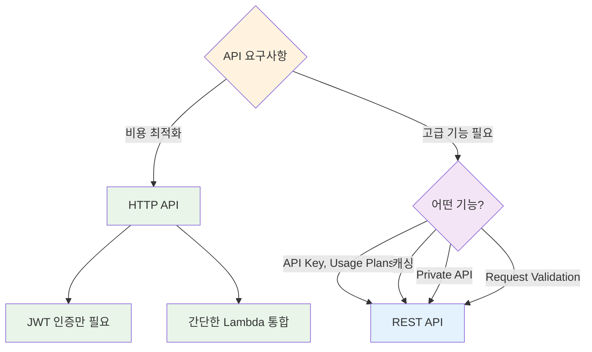

# November Week 2 Day 2 Session 1: API Gateway

<div align="center">

**🚪 API 관리** • **🔐 인증/인가** • **⚡ 서버리스** • **📊 모니터링**

*AWS 관리형 API 서비스로 안전하고 확장 가능한 API 구축*

</div>

---

## 🕘 Session 정보
**시간**: 09:00-09:40 (40분)
**목표**: API Gateway 개념 이해 및 실무 활용 방법 습득
**방식**: 이론 + AWS 공식 문서 기반 설명

## 🎯 학습 목표

### 📚 이해 목표
- API Gateway가 필요한 이유 이해
- REST API vs HTTP API 차이 파악
- Lambda 통합 방식 이해
- 인증/인가 메커니즘 습득

### 🛠️ 적용 목표
- 적절한 API 타입 선택
- Lambda 함수와 API 연동
- 인증 방식 구현
- 비용 효율적 운영

---

## 🤔 왜 필요한가? (5분)

### 💼 실무 시나리오: 서버리스 웹 애플리케이션

**문제 상황**:
```
Lambda 함수 (비즈니스 로직)
    ↓
어떻게 외부에서 호출할까?
- HTTP 엔드포인트 필요
- 인증/인가 필요
- Rate Limiting 필요
- 모니터링 필요
```

**기존 방식 (Week 4 Kong)**:
```
사용자 → Kong (API Gateway) → Backend Service
         ↓
    - 자체 호스팅 (Kubernetes)
    - 플러그인 기반 확장
    - 인프라 관리 필요
```

**AWS API Gateway 방식**:
```
사용자 → API Gateway → Lambda 함수
         ↓
    - AWS 관리형 (서버리스)
    - AWS 서비스 네이티브 통합
    - 인프라 관리 불필요
```

### 🏠 실생활 비유

**호텔 프론트 데스크**:
- **API Gateway**: 호텔 프론트 데스크
- **Lambda 함수**: 각 부서 (청소, 룸서비스, 컨시어지)
- **역할**: 고객 요청을 적절한 부서로 라우팅, 인증, 기록

### 📊 Kong vs API Gateway 비교

| 특징 | Kong | API Gateway |
|------|------|-------------|
| **배포 방식** | 자체 호스팅 (K8s) | AWS 관리형 |
| **인프라 관리** | 필요 (서버, 스케일링) | 불필요 (서버리스) |
| **통합** | 범용 (HTTP 백엔드) | Lambda 최적화 |
| **확장** | 플러그인 | AWS 서비스 통합 |
| **비용** | 인프라 비용 | 사용량 기반 |
| **모니터링** | 별도 설정 | CloudWatch 자동 |
| **사용 사례** | 멀티 클라우드, 온프레미스 | AWS 서버리스 |

**언제 Kong을 사용?**
- 멀티 클라우드 환경
- 온프레미스 통합 필요
- 커스텀 플러그인 개발
- Kubernetes 네이티브 환경

**언제 API Gateway를 사용?**
- AWS Lambda 중심 아키텍처
- 서버리스 애플리케이션
- 빠른 프로토타이핑
- 인프라 관리 최소화

---

## 📖 핵심 개념 (30분)

### 🔍 개념 1: API Gateway 기본 개념 (10분)

> **정의** (AWS 공식): API Gateway는 RESTful API, HTTP API, WebSocket API를 생성, 배포, 관리할 수 있는 AWS 관리형 서비스입니다.

**주요 기능**:
1. **API 생성 및 배포**: REST/HTTP/WebSocket API 지원
2. **백엔드 통합**: Lambda, HTTP 엔드포인트, AWS 서비스
3. **인증/인가**: API Key, IAM, Cognito, Lambda Authorizer
4. **트래픽 관리**: Throttling, Rate Limiting, Caching
5. **모니터링**: CloudWatch 자동 통합

**API Gateway 아키텍처**:


*그림: API Gateway 기본 아키텍처 - 클라이언트 요청을 Lambda 함수로 라우팅하고 DynamoDB와 연동*

**상세 흐름**:



**핵심 구성 요소** (AWS 공식 문서):

1. **API Endpoint**:
   - **Edge-Optimized**: CloudFront 통해 글로벌 배포 (기본값)
   - **Regional**: 특정 리전에만 배포
   - **Private**: VPC 내부에서만 접근

2. **Resource & Method**:
   - **Resource**: API 경로 (예: `/users`, `/orders`)
   - **Method**: HTTP 동사 (GET, POST, PUT, DELETE)

3. **Integration**:
   - **Lambda**: Lambda 함수 호출
   - **HTTP**: HTTP 엔드포인트 프록시
   - **AWS Service**: DynamoDB, S3 등 직접 호출
   - **Mock**: 테스트용 가짜 응답

4. **Stage**:
   - **환경 분리**: dev, staging, prod
   - **버전 관리**: v1, v2
   - **Stage Variables**: 환경별 설정

### 🔍 개념 2: REST API vs HTTP API (10분)

> **AWS 공식**: API Gateway는 두 가지 API 타입을 제공하며, 각각 다른 기능과 가격을 가집니다.

#### REST API (기능 중심)

**특징**:
- **풍부한 기능**: API Key, Usage Plans, Request Validation
- **고급 통합**: VTL 변환, Mock Integration
- **캐싱**: 응답 캐싱 지원
- **Private API**: VPC 내부 전용 API

**사용 사례**:
- 엔터프라이즈급 API
- 복잡한 인증/인가 요구사항
- API 사용량 제어 필요
- 응답 캐싱 필요

**가격** (ap-northeast-2):
- **첫 3억 3천만 호출**: $4.25/백만 호출
- **다음 6억 6천 7백만 호출**: $3.53/백만 호출
- **10억 호출 초과**: $2.97/백만 호출
- **캐싱**: $0.02/시간 (0.5GB 캐시)

#### HTTP API (비용 중심)

**특징**:
- **저렴한 가격**: REST API 대비 70% 저렴
- **빠른 성능**: 낮은 지연시간
- **간단한 설정**: 최소 기능
- **JWT 네이티브**: Cognito, Auth0 통합

**사용 사례**:
- 서버리스 웹 애플리케이션
- 마이크로서비스 API
- 비용 최적화 우선
- 간단한 인증만 필요

**가격** (ap-northeast-2):
- **첫 3억 호출**: $1.29/백만 호출
- **다음 7억 호출**: $1.03/백만 호출
- **10억 호출 초과**: $0.52/백만 호출

#### 비교표

| 기능 | REST API | HTTP API |
|------|----------|----------|
| **가격** | $4.25/백만 | $1.29/백만 (70% 저렴) |
| **성능** | 보통 | 빠름 (60% 낮은 지연) |
| **API Key** | ✅ | ❌ |
| **Usage Plans** | ✅ | ❌ |
| **Request Validation** | ✅ | ❌ |
| **Response Caching** | ✅ | ❌ |
| **Private API** | ✅ | ❌ |
| **JWT 인증** | Lambda Authorizer | ✅ 네이티브 |
| **CORS** | 수동 설정 | ✅ 자동 |
| **WebSocket** | ✅ | ❌ |

**선택 기준**:


### 🔍 개념 3: Lambda 통합 및 인증 (10분)

#### Lambda 통합 방식


*그림: API Gateway와 Lambda 통합 - 서버리스 API 구현의 핵심 패턴*

**1. Lambda Proxy Integration** (권장):
```json
// API Gateway가 Lambda에 전달하는 이벤트
{
  "httpMethod": "POST",
  "path": "/users",
  "headers": {
    "Authorization": "Bearer token..."
  },
  "body": "{\"name\":\"John\"}",
  "queryStringParameters": {
    "page": "1"
  }
}
```

**Lambda 함수 예시**:
```python
def lambda_handler(event, context):
    # API Gateway 이벤트 파싱
    http_method = event['httpMethod']
    path = event['path']
    body = json.loads(event['body'])
    
    # 비즈니스 로직
    if http_method == 'POST' and path == '/users':
        user = create_user(body)
        
        # API Gateway 응답 형식
        return {
            'statusCode': 201,
            'headers': {
                'Content-Type': 'application/json',
                'Access-Control-Allow-Origin': '*'
            },
            'body': json.dumps(user)
        }
```

**2. Lambda Custom Integration**:
- 요청/응답 변환 필요
- VTL (Velocity Template Language) 사용
- 복잡한 매핑 가능

#### 인증/인가 방식

**1. API Key** (REST API만):
```bash
# API Key 생성
aws apigateway create-api-key --name "mobile-app-key"

# Usage Plan 연결
aws apigateway create-usage-plan \
  --name "basic-plan" \
  --throttle burstLimit=100,rateLimit=50
```

**사용 사례**: 간단한 앱 식별, 사용량 제어

**2. IAM 인증**:
```python
# AWS SDK가 자동으로 서명
import boto3

client = boto3.client('apigateway')
response = client.invoke(
    FunctionName='my-api',
    Payload=json.dumps(data)
)
```

**사용 사례**: AWS 서비스 간 통신, 내부 API

**3. Cognito User Pool** (권장):
```javascript
// 프론트엔드에서 JWT 토큰 전송
fetch('https://api.example.com/users', {
  headers: {
    'Authorization': `Bearer ${cognitoToken}`
  }
})
```

**사용 사례**: 사용자 인증, 모바일/웹 앱


*그림: API Gateway + Cognito 인증 흐름 - JWT 토큰 기반 사용자 인증*

**4. Lambda Authorizer** (커스텀):
```python
def lambda_handler(event, context):
    token = event['authorizationToken']
    
    # 토큰 검증 로직
    if validate_token(token):
        return {
            'principalId': 'user123',
            'policyDocument': {
                'Version': '2012-10-17',
                'Statement': [{
                    'Action': 'execute-api:Invoke',
                    'Effect': 'Allow',
                    'Resource': event['methodArn']
                }]
            }
        }
    else:
        raise Exception('Unauthorized')
```

**사용 사례**: 커스텀 인증 로직, 서드파티 OAuth

#### 실무 연동 패턴

**패턴 1: 서버리스 REST API**
```
Client → API Gateway (HTTP API) → Lambda → DynamoDB
         ↓
    Cognito JWT 인증
```

**패턴 2: 마이크로서비스 게이트웨이**
```
Client → API Gateway (REST API) → Lambda → 여러 백엔드
         ↓                              ↓
    API Key 인증                    - RDS
                                    - ElastiCache
                                    - 외부 API
```

**패턴 3: 이벤트 기반 아키텍처**
```
Client → API Gateway → Lambda → SQS/SNS → 비동기 처리
         ↓
    Lambda Authorizer
```

---

## 💰 비용 구조 (5분)

### 프리티어 (12개월)
- **REST API**: 100만 호출/월
- **HTTP API**: 100만 호출/월
- **WebSocket**: 100만 메시지 + 75만 연결 분

### 실제 비용 계산 (ap-northeast-2)

**시나리오**: 월 1천만 호출 서버리스 API

**HTTP API**:
```
첫 3억 호출: 10M * $1.29/M = $12.90
총 비용: $12.90/월
```

**REST API**:
```
첫 3억 호출: 10M * $4.25/M = $42.50
총 비용: $42.50/월
```

**비용 절감**: HTTP API 사용 시 **70% 절감** ($29.60/월)

### 추가 비용

**Lambda 호출**:
```
10M 호출 * $0.20/M = $2.00
Lambda 실행 시간 (128MB, 100ms): $2.08
총 Lambda 비용: $4.08/월
```

**데이터 전송**:
```
10M 호출 * 10KB 응답 = 100GB
첫 10TB 무료 (EC2 Data Transfer)
추가 비용: $0
```

**총 예상 비용**:
- **HTTP API + Lambda**: $16.98/월
- **REST API + Lambda**: $46.58/월

### 비용 최적화 팁

1. **HTTP API 우선 사용**: 70% 저렴
2. **캐싱 활용**: 반복 요청 감소 (REST API만)
3. **Lambda 최적화**: 메모리/실행 시간 최소화
4. **CloudFront 통합**: 정적 콘텐츠 캐싱

---

## 🔑 핵심 키워드

- **API Gateway**: AWS 관리형 API 서비스
- **REST API**: 기능 중심, 고급 기능 제공
- **HTTP API**: 비용 중심, 70% 저렴
- **Lambda Integration**: 서버리스 백엔드 통합
- **Cognito**: 사용자 인증 (JWT)
- **API Key**: 간단한 앱 식별
- **Stage**: 환경 분리 (dev/prod)
- **Throttling**: 요청 제한

---

## 📝 Session 마무리

### ✅ 오늘 Session 성과
- [ ] API Gateway 필요성 이해
- [ ] REST API vs HTTP API 차이 파악
- [ ] Lambda 통합 방식 이해
- [ ] 인증/인가 메커니즘 습득
- [ ] Kong과의 비교를 통한 개념 정리

### 🎯 다음 Session 준비
- **Session 2**: Cognito (사용자 인증/인가)
- **연계**: API Gateway + Cognito 통합 실습

### 🔗 공식 문서 (필수)

**⚠️ 학생들이 직접 확인해야 할 공식 문서**:
- 📘 [API Gateway란?](https://docs.aws.amazon.com/apigateway/latest/developerguide/welcome.html)
- 📗 [API Gateway 개념](https://docs.aws.amazon.com/apigateway/latest/developerguide/api-gateway-basic-concept.html)
- 📙 [REST API vs HTTP API](https://docs.aws.amazon.com/apigateway/latest/developerguide/http-api-vs-rest.html)
- 📕 [API Gateway 요금](https://aws.amazon.com/api-gateway/pricing/)
- 🆕 [API Gateway 최신 업데이트](https://aws.amazon.com/api-gateway/whats-new/)

---

<div align="center">

**🚪 API 관리** • **🔐 인증/인가** • **⚡ 서버리스** • **💰 비용 효율**

*다음: Session 2 - Cognito (사용자 인증)*

</div>
