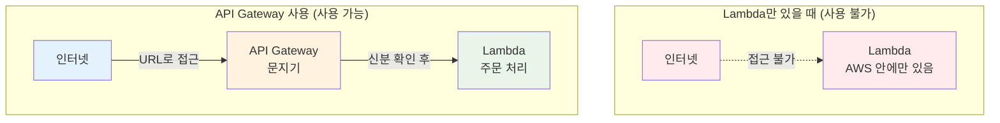
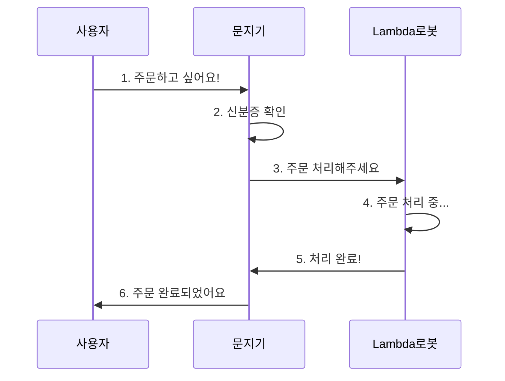
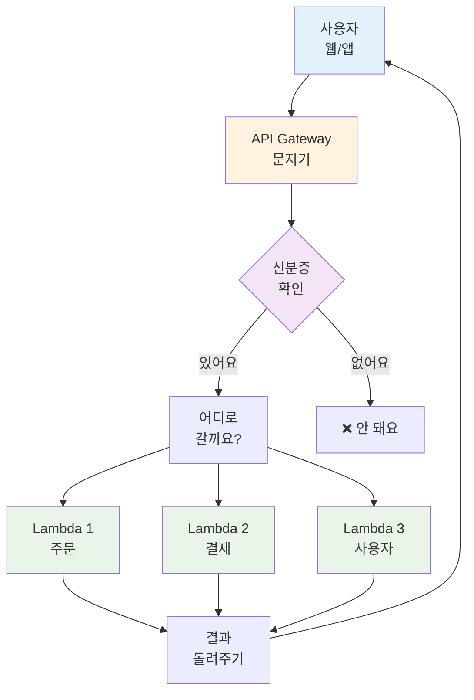
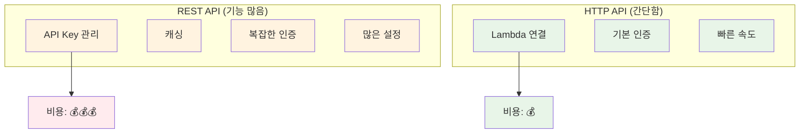
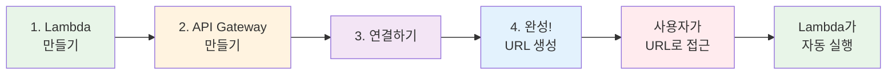
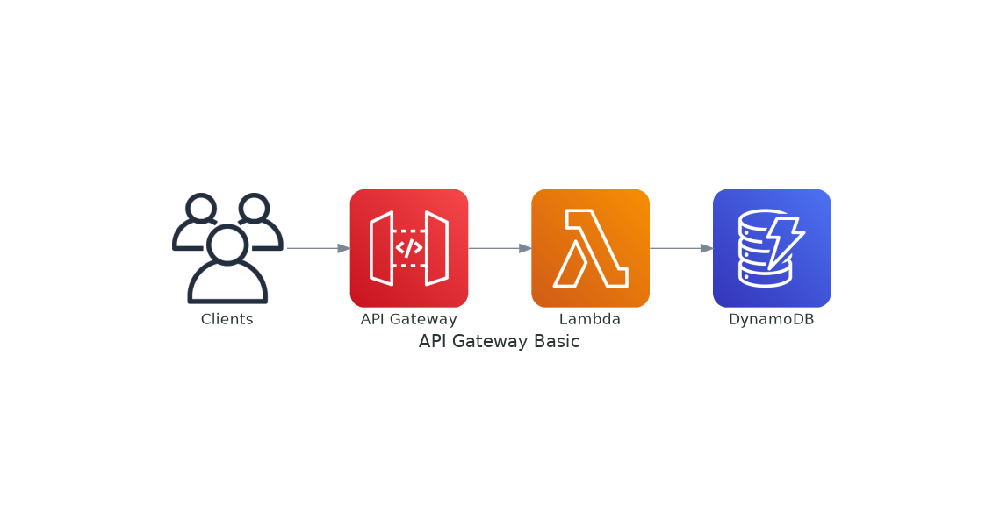
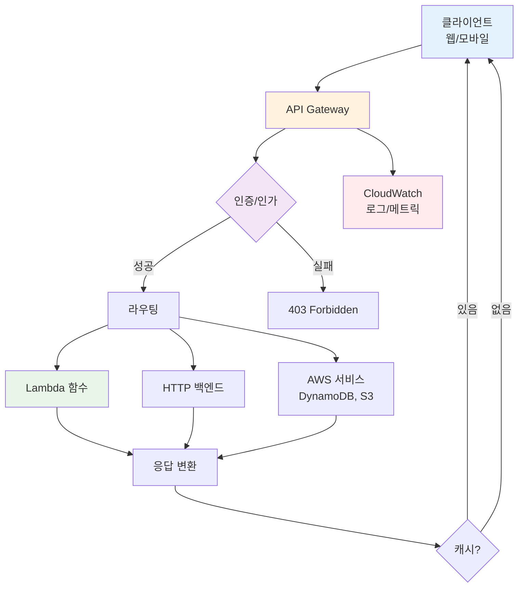
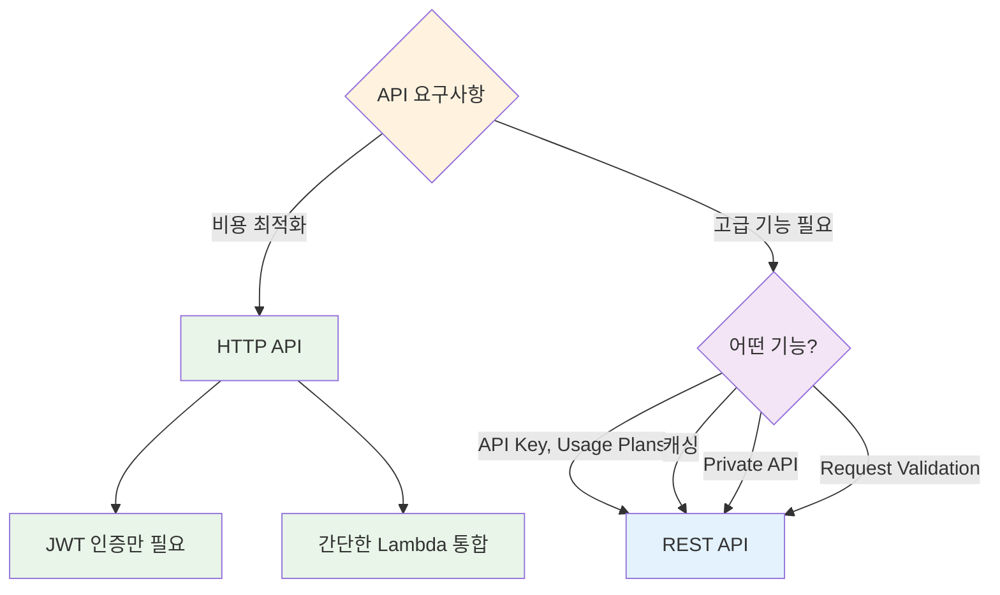
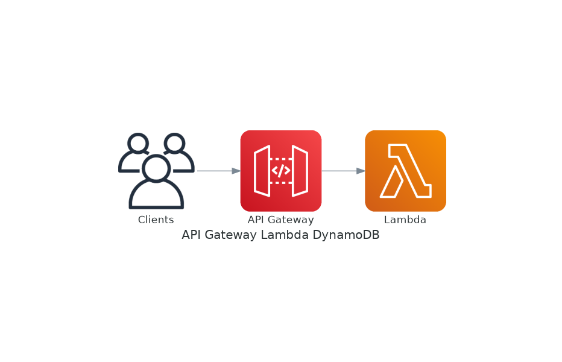
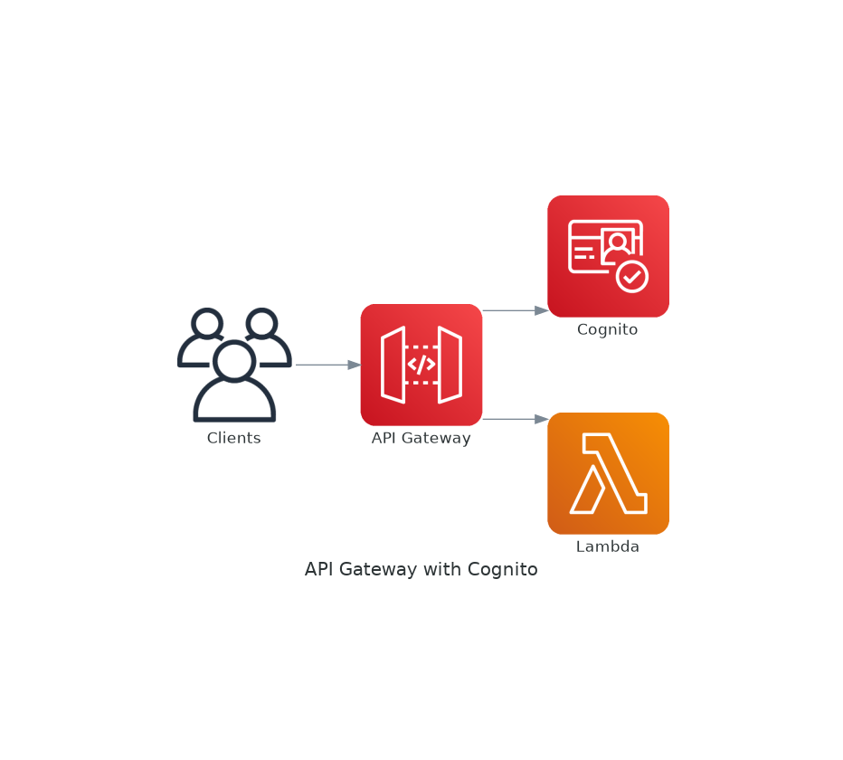

# November Week 2 Day 2 Session 1: API Gateway

<div align="center">

**🚪 문지기** • **🔐 신분증 확인** • **📞 전화 교환원**

*Lambda 함수를 인터넷에서 사용할 수 있게 해주는 문지기*

</div>

---

## 🕘 Session 정보
**시간**: 09:00-09:40 (40분)
**목표**: API Gateway가 뭔지, 왜 필요한지 쉽게 이해하기
**방식**: 실생활 비유 + 그림 + 간단한 예시

## 🎯 학습 목표

### 📚 이해 목표
- API Gateway가 뭔지 알기 (문지기 같은 거!)
- 왜 필요한지 이해하기 (Lambda를 인터넷에 연결)
- 두 가지 종류 알기 (기능 많은 것 vs 저렴한 것)
- Lambda와 어떻게 연결되는지 알기

### 🛠️ 적용 목표
- 언제 사용하면 좋을지 판단하기
- 어떤 종류를 선택할지 알기
- Lambda와 연결하는 방법 알기

---

## 🤔 왜 필요한가? (5분)

### 🏠 실생활 비유 1: 아파트 경비실

**경비실 없이 방문하기** (위험해요):
```
외부 사람 → 바로 집 문 두드리기
    ↓
문제점:
- 누가 오는지 모름 😱
- 위험한 사람도 올 수 있음
- 몇 명이 왔는지 기록 없음
```

**경비실 있는 아파트** (안전해요):
```
외부 사람 → 경비실 (신분증 확인)
    ↓
1. 신분증 확인 (인증)
2. 방문 목적 확인 (인가)
3. 방문 기록 작성 (로그)
4. 집으로 안내
    ↓
안전하고 기록도 남아요 ✅
```

### 🏠 실생활 비유 2: 전화 교환원

**옛날 전화 (교환원 있음)**:
```
전화 걸기 → 교환원 → "몇 번으로 연결해드릴까요?"
    ↓
교환원이 하는 일:
- 전화번호 확인
- 연결해주기
- 통화 기록
- 잘못된 번호 차단
```

**API Gateway = 전화 교환원**:
```
인터넷 요청 → API Gateway → "어느 Lambda로 연결할까요?"
    ↓
API Gateway가 하는 일:
- 신분 확인 (로그인했나요?)
- Lambda 연결해주기
- 요청 기록
- 이상한 요청 차단
```

### 💼 실제 예시: Lambda 함수 사용하기

**문제 상황 - Lambda만 있을 때**:
```
Lambda 함수 (주문 처리 코드)
    ↓
어떻게 인터넷에서 사용할까?
- Lambda는 AWS 안에만 있어요
- 인터넷에서 직접 접근 불가
- URL이 없어요
- 누가 사용하는지 확인 불가
```

**해결 - API Gateway 사용**:
```
인터넷 → API Gateway (문지기) → Lambda 함수
         ↓
API Gateway가 해주는 일:
1. URL 만들어주기 (https://xxx.amazonaws.com/prod/order)
2. 신분 확인 (로그인한 사람만)
3. Lambda 연결해주기
4. 기록 남기기
```

**그림으로 보기**:


### 🎯 API Gateway의 역할

1. **문 만들어주기**: Lambda에 URL 주소 만들기
2. **신분 확인**: 로그인한 사람만 들어오게
3. **교통 정리**: 너무 많은 요청 막기
4. **기록 남기기**: 누가 언제 왔는지 기록

---

## 📖 핵심 개념 (30분)

### 🔍 개념 1: API Gateway가 뭔가요? (10분)

> **쉽게 말하면**: Lambda 함수를 인터넷에서 사용할 수 있게 해주는 "문지기"

**등장인물**:
- **사용자**: 인터넷에서 요청하는 사람 (웹사이트, 앱)
- **API Gateway**: 문지기 (신분 확인, 안내)
- **Lambda 함수**: 일하는 로봇 (주문 처리, 계산 등)

**어떻게 작동하나요?**:


**실생활 예시**:
```
놀이공원 입구:
1. 사람들: 놀이공원 가고 싶어요 (사용자)
2. 입구 직원: 티켓 확인해요 (API Gateway)
3. 놀이기구: 사람들이 탑니다 (Lambda)
```

**API Gateway가 하는 일**:

**1. URL 주소 만들기** (문 만들기):
```
Lambda만 있을 때:
- 주소 없음 ❌
- 인터넷에서 접근 불가

API Gateway 추가하면:
- https://abc123.execute-api.ap-northeast-2.amazonaws.com/prod/order
- 이 주소로 접근 가능 ✅
```

**2. 신분 확인하기** (경비):
```
누가 왔나요?
- 로그인한 사람? ✅ 들어오세요
- 로그인 안 한 사람? ❌ 안 돼요
```

**3. Lambda 연결하기** (안내):
```
어디로 갈까요?
- /order → 주문 Lambda
- /payment → 결제 Lambda
- /user → 사용자 Lambda
```

**4. 기록 남기기** (방명록):
```
누가 언제 왔나요?
- 2024-11-07 15:00 - 홍길동 - 주문
- 2024-11-07 15:01 - 김철수 - 결제
```

**그림으로 보기**:


### 🔍 개념 2: 두 가지 종류 (10분)

> **쉽게 말하면**: 기능 많은 것 vs 저렴한 것

#### 종류 1: REST API (기능 많음)

**특징**:
- 🎁 **기능이 많아요**: 여러 가지 할 수 있어요
- 💰 **조금 비싸요**: 기능이 많으니까요
- 🏢 **회사에서 많이 써요**: 안전하고 기능 많아서

**할 수 있는 일**:
- API Key로 관리 (누가 얼마나 쓰는지)
- 캐싱 (빠르게 응답)
- 복잡한 인증 (여러 방법으로 확인)

**언제 사용하나요?**:
- 큰 회사 시스템
- 보안이 중요할 때
- 많은 기능이 필요할 때

**비유**:
```
고급 아파트:
- 경비실 24시간 (API Key 관리)
- CCTV 많음 (모니터링)
- 주차장 넓음 (캐싱)
→ 관리비 비싸지만 편해요
```

#### 종류 2: HTTP API (저렴함)

**특징**:
- 💵 **엄청 저렴해요**: REST API보다 70% 싸요!
- ⚡ **빨라요**: 기능이 적어서 빠름
- 🎯 **간단해요**: 복잡한 기능 없음

**할 수 있는 일**:
- Lambda 연결 (기본)
- 로그인 확인 (기본)
- 빠른 응답

**언제 사용하나요?**:
- 작은 프로젝트
- 비용 절약하고 싶을 때
- 간단한 API면 충분할 때

**비유**:
```
원룸:
- 경비 없음 (기본 기능만)
- 주차 제한적
- 관리비 저렴
→ 저렴하고 간단해요
```

#### 비교표 (쉽게 이해하기)

| 비교 | REST API<br/>(고급 아파트) | HTTP API<br/>(원룸) |
|------|---------------------------|---------------------|
| **가격** | 비싸요 💰💰💰 | 저렴해요 💰 |
| **기능** | 많아요 🎁🎁🎁 | 기본만 🎁 |
| **속도** | 보통 🚗 | 빨라요 🚀 |
| **사용** | 큰 회사 🏢 | 작은 프로젝트 🏠 |

**그림으로 보기**:


### 🔍 개념 3: Lambda와 연결하기 (10분)

> **쉽게 말하면**: 문지기(API Gateway)와 일꾼(Lambda)을 연결하기

**연결 과정**:

**Step 1: Lambda 함수 만들기** (일꾼 고용):
```python
# Lambda 함수 (주문 처리 로봇)
def lambda_handler(event, context):
    # 주문 정보 받기
    order = event['body']
    
    # 주문 처리하기
    result = "주문 완료!"
    
    # 결과 돌려주기
    return {
        'statusCode': 200,
        'body': result
    }
```

**Step 2: API Gateway 만들기** (문지기 배치):
```
AWS Console → API Gateway → Create API
    ↓
HTTP API 선택 (저렴한 것)
    ↓
이름: my-order-api
```

**Step 3: Lambda 연결하기** (일꾼과 문지기 연결):
```
API Gateway → Routes → Create
    ↓
경로: POST /order
    ↓
연결: Lambda 함수 선택
```

**완성!**:
```
이제 사용할 수 있어요:
https://abc123.execute-api.ap-northeast-2.amazonaws.com/order
    ↓
이 주소로 주문하면
    ↓
Lambda가 자동으로 처리해요!
```

**그림으로 보기**:


---

## 💭 함께 생각해보기 (5분)

### 🤝 페어 토론 (3분)

**토론 주제**:
1. "우리 집 아파트 경비실은 어떤 일을 하나요?"
2. "API Gateway가 없으면 어떤 문제가 생길까요?"
3. "REST API와 HTTP API 중 어떤 걸 선택할까요?"

**페어 활동 가이드**:
- 👥 옆 사람과 이야기하기
- 🔄 각자 1분씩 설명하기
- 📝 중요한 점 메모하기

### 🎯 전체 공유 (2분)

**질문**:
- "API Gateway를 한 문장으로 설명하면?"
- "REST API와 HTTP API의 가장 큰 차이는?"

### 💡 이해도 체크 질문

- ✅ "API Gateway가 뭐하는 건지 설명할 수 있나요?"
- ✅ "Lambda와 어떻게 연결되는지 알겠나요?"
- ✅ "언제 REST API를 쓰고 언제 HTTP API를 쓸까요?"

---

## 🔑 핵심 키워드

**새로운 용어** (쉽게 설명):
- **API Gateway**: Lambda를 인터넷에 연결해주는 문지기
- **REST API**: 기능 많은 API (비싸지만 좋음)
- **HTTP API**: 간단한 API (저렴하고 빠름)
- **Lambda 통합**: Lambda와 API Gateway 연결하기
- **URL**: 인터넷 주소 (집 주소 같은 것)

**중요 개념**:
- **문지기 역할**: 신분 확인, 안내, 기록
- **두 가지 종류**: 기능 많음 vs 저렴함
- **Lambda 연결**: 문지기와 일꾼 연결

---

## 📝 Session 마무리

### ✅ 오늘 Session 성과
- [ ] API Gateway가 뭔지 이해했어요
- [ ] 왜 필요한지 알았어요
- [ ] REST API와 HTTP API 차이를 알았어요
- [ ] Lambda와 연결하는 방법을 알았어요

### 🎯 다음 Session 준비
- **Session 2**: Cognito (로그인 시스템)
- **연결**: API Gateway에서 로그인 확인하는 방법
- **준비**: 로그인이 왜 필요한지 생각해보기

**주요 기능**:
1. **API 생성 및 배포**: REST/HTTP/WebSocket API 지원
2. **백엔드 통합**: Lambda, HTTP 엔드포인트, AWS 서비스
3. **인증/인가**: API Key, IAM, Cognito, Lambda Authorizer
4. **트래픽 관리**: Throttling, Rate Limiting, Caching
5. **모니터링**: CloudWatch 자동 통합

**API Gateway 아키텍처**:



*그림: API Gateway 기본 아키텍처 - 클라이언트 요청을 Lambda 함수로 라우팅하고 DynamoDB와 연동*

**상세 흐름**:



**핵심 구성 요소** (AWS 공식 문서):

1. **API Endpoint**:
   - **Edge-Optimized**: CloudFront 통해 글로벌 배포 (기본값)
   - **Regional**: 특정 리전에만 배포
   - **Private**: VPC 내부에서만 접근

2. **Resource & Method**:
   - **Resource**: API 경로 (예: `/users`, `/orders`)
   - **Method**: HTTP 동사 (GET, POST, PUT, DELETE)

3. **Integration**:
   - **Lambda**: Lambda 함수 호출
   - **HTTP**: HTTP 엔드포인트 프록시
   - **AWS Service**: DynamoDB, S3 등 직접 호출
   - **Mock**: 테스트용 가짜 응답

4. **Stage**:
   - **환경 분리**: dev, staging, prod
   - **버전 관리**: v1, v2
   - **Stage Variables**: 환경별 설정

### 🔍 개념 2: REST API vs HTTP API (10분)

> **AWS 공식**: API Gateway는 두 가지 API 타입을 제공하며, 각각 다른 기능과 가격을 가집니다.

#### REST API (기능 중심)

**특징**:
- **풍부한 기능**: API Key, Usage Plans, Request Validation
- **고급 통합**: VTL 변환, Mock Integration
- **캐싱**: 응답 캐싱 지원
- **Private API**: VPC 내부 전용 API

**사용 사례**:
- 엔터프라이즈급 API
- 복잡한 인증/인가 요구사항
- API 사용량 제어 필요
- 응답 캐싱 필요

**가격** (ap-northeast-2):
- **첫 3억 3천만 호출**: $4.25/백만 호출
- **다음 6억 6천 7백만 호출**: $3.53/백만 호출
- **10억 호출 초과**: $2.97/백만 호출
- **캐싱**: $0.02/시간 (0.5GB 캐시)

#### HTTP API (비용 중심)

**특징**:
- **저렴한 가격**: REST API 대비 70% 저렴
- **빠른 성능**: 낮은 지연시간
- **간단한 설정**: 최소 기능
- **JWT 네이티브**: Cognito, Auth0 통합

**사용 사례**:
- 서버리스 웹 애플리케이션
- 마이크로서비스 API
- 비용 최적화 우선
- 간단한 인증만 필요

**가격** (ap-northeast-2):
- **첫 3억 호출**: $1.29/백만 호출
- **다음 7억 호출**: $1.03/백만 호출
- **10억 호출 초과**: $0.52/백만 호출

#### 비교표

| 기능 | REST API | HTTP API |
|------|----------|----------|
| **가격** | $4.25/백만 | $1.29/백만 (70% 저렴) |
| **성능** | 보통 | 빠름 (60% 낮은 지연) |
| **API Key** | ✅ | ❌ |
| **Usage Plans** | ✅ | ❌ |
| **Request Validation** | ✅ | ❌ |
| **Response Caching** | ✅ | ❌ |
| **Private API** | ✅ | ❌ |
| **JWT 인증** | Lambda Authorizer | ✅ 네이티브 |
| **CORS** | 수동 설정 | ✅ 자동 |
| **WebSocket** | ✅ | ❌ |

**선택 기준**:


### 🔍 개념 3: Lambda 통합 및 인증 (10분)

#### Lambda 통합 방식



*그림: API Gateway와 Lambda 통합 - 서버리스 API 구현의 핵심 패턴*

**1. Lambda Proxy Integration** (권장):
```json
// API Gateway가 Lambda에 전달하는 이벤트
{
  "httpMethod": "POST",
  "path": "/users",
  "headers": {
    "Authorization": "Bearer token..."
  },
  "body": "{\"name\":\"John\"}",
  "queryStringParameters": {
    "page": "1"
  }
}
```

**Lambda 함수 예시**:
```python
def lambda_handler(event, context):
    # API Gateway 이벤트 파싱
    http_method = event['httpMethod']
    path = event['path']
    body = json.loads(event['body'])
    
    # 비즈니스 로직
    if http_method == 'POST' and path == '/users':
        user = create_user(body)
        
        # API Gateway 응답 형식
        return {
            'statusCode': 201,
            'headers': {
                'Content-Type': 'application/json',
                'Access-Control-Allow-Origin': '*'
            },
            'body': json.dumps(user)
        }
```

**2. Lambda Custom Integration**:
- 요청/응답 변환 필요
- VTL (Velocity Template Language) 사용
- 복잡한 매핑 가능

#### 인증/인가 방식

**1. API Key** (REST API만):
```bash
# API Key 생성
aws apigateway create-api-key --name "mobile-app-key"

# Usage Plan 연결
aws apigateway create-usage-plan \
  --name "basic-plan" \
  --throttle burstLimit=100,rateLimit=50
```

**사용 사례**: 간단한 앱 식별, 사용량 제어

**2. IAM 인증**:
```python
# AWS SDK가 자동으로 서명
import boto3

client = boto3.client('apigateway')
response = client.invoke(
    FunctionName='my-api',
    Payload=json.dumps(data)
)
```

**사용 사례**: AWS 서비스 간 통신, 내부 API

**3. Cognito User Pool** (권장):
```javascript
// 프론트엔드에서 JWT 토큰 전송
fetch('https://api.example.com/users', {
  headers: {
    'Authorization': `Bearer ${cognitoToken}`
  }
})
```

**사용 사례**: 사용자 인증, 모바일/웹 앱



*그림: API Gateway + Cognito 인증 흐름 - JWT 토큰 기반 사용자 인증*

**4. Lambda Authorizer** (커스텀):
```python
def lambda_handler(event, context):
    token = event['authorizationToken']
    
    # 토큰 검증 로직
    if validate_token(token):
        return {
            'principalId': 'user123',
            'policyDocument': {
                'Version': '2012-10-17',
                'Statement': [{
                    'Action': 'execute-api:Invoke',
                    'Effect': 'Allow',
                    'Resource': event['methodArn']
                }]
            }
        }
    else:
        raise Exception('Unauthorized')
```

**사용 사례**: 커스텀 인증 로직, 서드파티 OAuth

#### 실무 연동 패턴

**패턴 1: 서버리스 REST API**
```
Client → API Gateway (HTTP API) → Lambda → DynamoDB
         ↓
    Cognito JWT 인증
```

**패턴 2: 마이크로서비스 게이트웨이**
```
Client → API Gateway (REST API) → Lambda → 여러 백엔드
         ↓                              ↓
    API Key 인증                    - RDS
                                    - ElastiCache
                                    - 외부 API
```

**패턴 3: 이벤트 기반 아키텍처**
```
Client → API Gateway → Lambda → SQS/SNS → 비동기 처리
         ↓
    Lambda Authorizer
```

---

## 💰 비용 구조 (5분)

### 프리티어 (12개월)
- **REST API**: 100만 호출/월
- **HTTP API**: 100만 호출/월
- **WebSocket**: 100만 메시지 + 75만 연결 분

### 실제 비용 계산 (ap-northeast-2)

**시나리오**: 월 1천만 호출 서버리스 API

**HTTP API**:
```
첫 3억 호출: 10M * $1.29/M = $12.90
총 비용: $12.90/월
```

**REST API**:
```
첫 3억 호출: 10M * $4.25/M = $42.50
총 비용: $42.50/월
```

**비용 절감**: HTTP API 사용 시 **70% 절감** ($29.60/월)

### 추가 비용

**Lambda 호출**:
```
10M 호출 * $0.20/M = $2.00
Lambda 실행 시간 (128MB, 100ms): $2.08
총 Lambda 비용: $4.08/월
```

**데이터 전송**:
```
10M 호출 * 10KB 응답 = 100GB
첫 10TB 무료 (EC2 Data Transfer)
추가 비용: $0
```

**총 예상 비용**:
- **HTTP API + Lambda**: $16.98/월
- **REST API + Lambda**: $46.58/월

### 비용 최적화 팁

1. **HTTP API 우선 사용**: 70% 저렴
2. **캐싱 활용**: 반복 요청 감소 (REST API만)
3. **Lambda 최적화**: 메모리/실행 시간 최소화
4. **CloudFront 통합**: 정적 콘텐츠 캐싱

---

## 🔑 핵심 키워드

- **API Gateway**: AWS 관리형 API 서비스
- **REST API**: 기능 중심, 고급 기능 제공
- **HTTP API**: 비용 중심, 70% 저렴
- **Lambda Integration**: 서버리스 백엔드 통합
- **Cognito**: 사용자 인증 (JWT)
- **API Key**: 간단한 앱 식별
- **Stage**: 환경 분리 (dev/prod)
- **Throttling**: 요청 제한

---

## 📝 Session 마무리

### ✅ 오늘 Session 성과
- [ ] API Gateway 필요성 이해
- [ ] REST API vs HTTP API 차이 파악
- [ ] Lambda 통합 방식 이해
- [ ] 인증/인가 메커니즘 습득
- [ ] Kong과의 비교를 통한 개념 정리

### 🎯 다음 Session 준비
- **Session 2**: Cognito (사용자 인증/인가)
- **연계**: API Gateway + Cognito 통합 실습

### 🔗 공식 문서 (필수)

**⚠️ 학생들이 직접 확인해야 할 공식 문서**:
- 📘 [API Gateway란?](https://docs.aws.amazon.com/apigateway/latest/developerguide/welcome.html)
- 📗 [API Gateway 개념](https://docs.aws.amazon.com/apigateway/latest/developerguide/api-gateway-basic-concept.html)
- 📙 [REST API vs HTTP API](https://docs.aws.amazon.com/apigateway/latest/developerguide/http-api-vs-rest.html)
- 📕 [API Gateway 요금](https://aws.amazon.com/api-gateway/pricing/)
- 🆕 [API Gateway 최신 업데이트](https://aws.amazon.com/api-gateway/whats-new/)

---

<div align="center">

**🚪 API 관리** • **🔐 인증/인가** • **⚡ 서버리스** • **💰 비용 효율**

*다음: Session 2 - Cognito (사용자 인증)*

</div>
