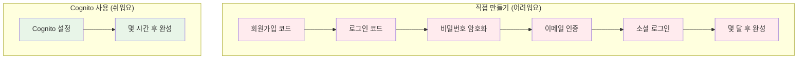
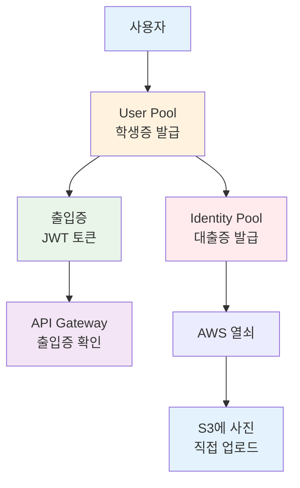
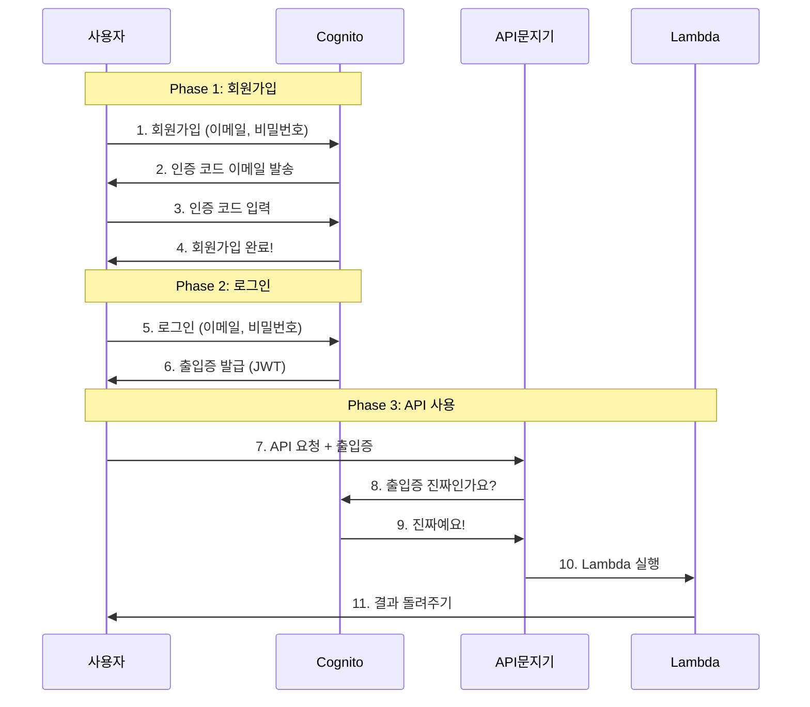
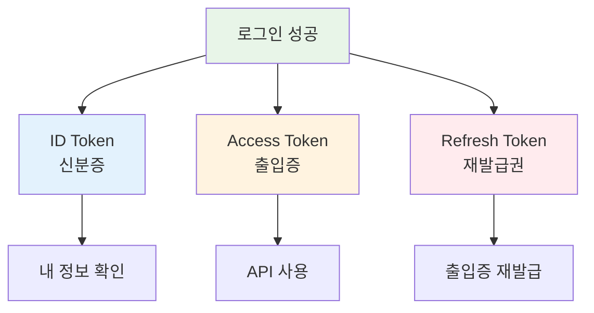
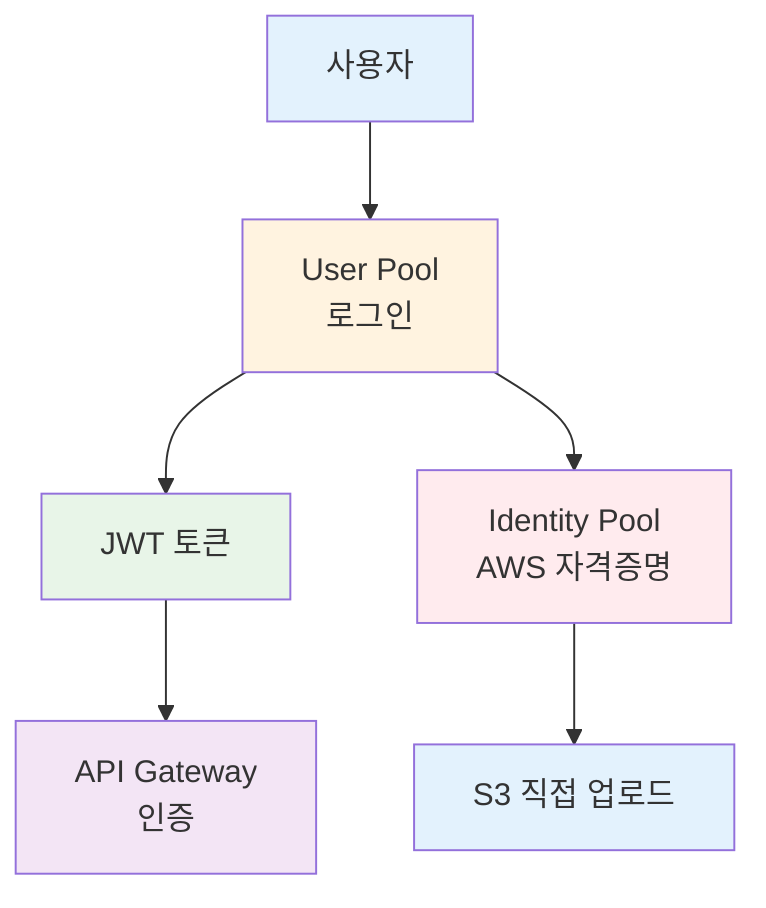
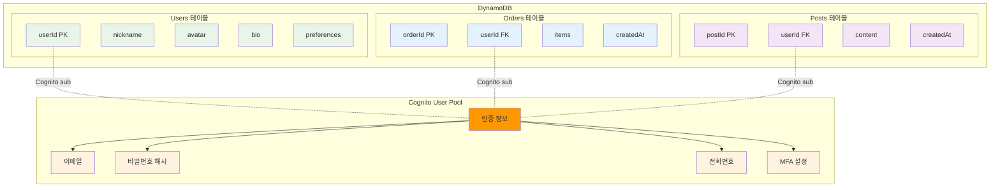

# November Week 2 Day 2 Session 2: Cognito (로그인 시스템)

<div align="center">

**👤 회원가입** • **🔐 로그인** • **🎫 출입증** • **📱 소셜 로그인**

*AWS가 만들어주는 로그인 시스템*

</div>

---

## 🕘 Session 정보
**시간**: 09:40-10:20 (40분)
**목표**: 로그인 시스템이 뭔지, 왜 필요한지 쉽게 이해하기
**방식**: 실생활 비유 + 그림 + 간단한 예시

## 🎯 학습 목표

### 📚 이해 목표
- Cognito가 뭔지 알기 (로그인 시스템!)
- 왜 필요한지 이해하기 (직접 만들면 너무 어려워요)
- 두 가지 종류 알기 (로그인 vs AWS 접근)
- 출입증(JWT 토큰)이 뭔지 알기

### 🛠️ 적용 목표
- 언제 사용하면 좋을지 판단하기
- 회원가입/로그인 흐름 이해하기
- API Gateway와 연결하는 방법 알기

---

## 🤔 왜 필요한가? (5분)

### 🏠 실생활 비유: 학교 출입증

**출입증 없는 학교** (위험해요):
```
누구나 학교에 들어올 수 있어요
    ↓
문제점:
- 학생인지 확인 불가 😱
- 외부인도 들어올 수 있음
- 누가 왔는지 기록 없음
```

**출입증 있는 학교** (안전해요):
```
학교 입구:
1. 출입증 확인 (학생증)
2. 학생이면 들어오기 ✅
3. 학생 아니면 못 들어옴 ❌
4. 출입 기록 남기기
```

### 💼 실제 예시: 웹사이트 로그인

**직접 만들면** (너무 어려워요):
```
로그인 시스템 만들기:
1. 회원가입 페이지 만들기
2. 비밀번호 암호화하기
3. 이메일 인증 보내기
4. 비밀번호 찾기 만들기
5. 로그인 페이지 만들기
6. 출입증(토큰) 만들기
7. 구글 로그인 연결하기
8. 페이스북 로그인 연결하기
---
개발 시간: 몇 달 😱
```

**Cognito 사용하면** (쉬워요):
```
Cognito (AWS가 다 만들어줌):
1. 회원가입 ✅ (자동)
2. 비밀번호 암호화 ✅ (자동)
3. 이메일 인증 ✅ (자동)
4. 비밀번호 찾기 ✅ (자동)
5. 로그인 ✅ (자동)
6. 출입증 만들기 ✅ (자동)
7. 구글 로그인 ✅ (설정만)
8. 페이스북 로그인 ✅ (설정만)
---
개발 시간: 몇 시간 ✅
```

**그림으로 보기**:


### 🎯 Cognito의 장점

1. **빨라요**: 몇 달 → 몇 시간
2. **안전해요**: AWS가 보안 관리
3. **쉬워요**: 코드 거의 안 써도 됨
4. **편해요**: 소셜 로그인도 쉽게

---

## 📖 핵심 개념 (30분)

### 🔍 개념 1: 두 가지 종류 (10분)

> **쉽게 말하면**: 로그인용 vs AWS 접근용

#### 종류 1: User Pool (로그인용)

**역할**: 학교 출입증 시스템

**하는 일**:
- 👤 **회원가입**: 새 학생 등록
- 🔐 **로그인**: 학생 확인
- 🎫 **출입증 발급**: 로그인하면 출입증 줌
- 📱 **소셜 로그인**: 구글, 페이스북으로 로그인

**실생활 비유**:
```
학교 행정실:
- 신입생 등록 (회원가입)
- 학생증 발급 (로그인)
- 출입증 주기 (JWT 토큰)
- 전학생 처리 (소셜 로그인)
```

**언제 사용하나요?**:
- 웹사이트 로그인
- 앱 로그인
- API 사용 전 로그인 확인

#### 종류 2: Identity Pool (AWS 접근용)

**역할**: AWS 열쇠 빌려주기

**하는 일**:
- 🔑 **AWS 열쇠 발급**: S3, DynamoDB 접근 열쇠
- 👻 **익명 접근**: 로그인 없이도 제한적 접근
- 🎯 **권한 관리**: 누구에게 어떤 열쇠 줄지

**실생활 비유**:
```
도서관 대출증:
- 학생증 보여주면 (User Pool)
- 대출증 발급 (Identity Pool)
- 책 빌릴 수 있음 (AWS 리소스 접근)
```

**언제 사용하나요?**:
- 앱에서 S3에 사진 직접 업로드
- 앱에서 DynamoDB 직접 읽기
- 로그인 없이 제한적 기능 사용

#### 비교표 (쉽게 이해하기)

| 비교 | User Pool<br/>(학생증) | Identity Pool<br/>(대출증) |
|------|----------------------|--------------------------|
| **목적** | 로그인 확인 | AWS 접근 |
| **발급** | 출입증 (JWT) | AWS 열쇠 |
| **사용** | 웹/앱 로그인 | S3, DynamoDB |
| **비유** | 학생증 | 도서관 대출증 |

**그림으로 보기**:


### 🔍 개념 2: 로그인 과정 (10분)

> **쉽게 말하면**: 회원가입 → 로그인 → 출입증 받기

#### Phase 1: 회원가입 (학생 등록)

```
1. 회원가입 버튼 클릭
    ↓
2. 이메일, 비밀번호 입력
    ↓
3. Cognito에 정보 저장
    ↓
4. 이메일로 인증 코드 받기
    ↓
5. 인증 코드 입력
    ↓
6. 회원가입 완료! ✅
```

**실생활 비유**:
```
학교 신입생 등록:
1. 등록 신청서 작성
2. 학교에 제출
3. 학교에서 확인
4. 집으로 확인 편지
5. 확인 도장 찍기
6. 등록 완료!
```

#### Phase 2: 로그인 (학생증 확인)

```
1. 로그인 버튼 클릭
    ↓
2. 이메일, 비밀번호 입력
    ↓
3. Cognito가 확인
    ↓
4. 맞으면 출입증 발급 ✅
    ↓
5. 출입증 받기 (JWT 토큰)
```

**실생활 비유**:
```
학교 정문:
1. 학생증 보여주기
2. 경비실에서 확인
3. 학생 맞으면
4. 오늘 출입증 발급
5. 출입증 받고 입장
```

#### Phase 3: API 사용 (출입증으로 입장)

```
1. API 요청할 때
    ↓
2. 출입증 같이 보내기
    ↓
3. API Gateway가 출입증 확인
    ↓
4. 진짜 출입증이면 ✅
    ↓
5. Lambda 실행
```

**실생활 비유**:
```
교실 입장:
1. 교실 문 앞
2. 출입증 보여주기
3. 선생님이 확인
4. 진짜면 입장
5. 수업 듣기
```

**전체 흐름 그림**:


### 🔍 개념 3: 출입증(JWT 토큰) (10분)

> **쉽게 말하면**: 로그인하면 받는 "오늘의 출입증"

#### 출입증이 뭔가요?

**실생활 비유**:
```
놀이공원 입장권:
- 이름: 홍길동
- 나이: 10살
- 유효기간: 오늘 하루
- 도장: 놀이공원 직인
```

**JWT 토큰**:
```json
{
  "이름": "hong@example.com",
  "그룹": "학생",
  "유효기간": "2024-11-07 23:59",
  "발급자": "Cognito"
}
```

#### 출입증 종류 (3가지)

**1. ID Token (신분증)**:
```
내가 누구인지 알려주는 것
- 이름: hong@example.com
- 별명: 홍길동
- 그룹: 학생, 관리자
```

**2. Access Token (출입증)**:
```
어디 들어갈 수 있는지 알려주는 것
- 교실 출입 가능
- 도서관 출입 가능
- 유효기간: 1시간
```

**3. Refresh Token (재발급권)**:
```
출입증 기간 끝나면 새로 받는 것
- 출입증 만료되면
- 이걸로 새 출입증 받기
- 유효기간: 30일
```

**그림으로 보기**:


#### 출입증 사용하기

**API 요청할 때**:
```
요청:
GET /order
Authorization: Bearer <출입증>
    ↓
API Gateway:
"출입증 확인... 진짜네요! 들어오세요"
    ↓
Lambda 실행
```

**출입증 만료되면**:
```
1시간 후:
"출입증 기간 끝났어요"
    ↓
Refresh Token으로 새 출입증 받기
    ↓
새 출입증으로 다시 사용
```

---

## 💭 함께 생각해보기 (5분)

### 🤝 페어 토론 (3분)

**토론 주제**:
1. "학교 학생증은 어떤 정보가 있나요?"
2. "로그인 없이 사용하면 어떤 문제가 생길까요?"
3. "구글 로그인이 편한 이유는 뭘까요?"

**페어 활동 가이드**:
- 👥 옆 사람과 이야기하기
- 🔄 각자 1분씩 설명하기
- 📝 중요한 점 메모하기

### 🎯 전체 공유 (2분)

**질문**:
- "Cognito를 한 문장으로 설명하면?"
- "User Pool과 Identity Pool의 차이는?"
- "JWT 토큰은 왜 필요할까요?"

### 💡 이해도 체크 질문

- ✅ "Cognito가 뭐하는 건지 설명할 수 있나요?"
- ✅ "로그인 과정을 순서대로 말할 수 있나요?"
- ✅ "출입증(JWT)이 뭔지 알겠나요?"

---

## 🔑 핵심 키워드

**새로운 용어** (쉽게 설명):
- **Cognito**: AWS가 만들어주는 로그인 시스템
- **User Pool**: 로그인용 (학생증 발급)
- **Identity Pool**: AWS 접근용 (대출증 발급)
- **JWT 토큰**: 로그인하면 받는 출입증
- **소셜 로그인**: 구글, 페이스북으로 로그인

**중요 개념**:
- **회원가입 → 로그인 → 출입증**: 3단계 과정
- **두 가지 Pool**: 로그인용 vs AWS 접근용
- **3가지 토큰**: 신분증, 출입증, 재발급권

---

## 📝 Session 마무리

### ✅ 오늘 Session 성과
- [ ] Cognito가 뭔지 이해했어요
- [ ] 왜 필요한지 알았어요
- [ ] User Pool과 Identity Pool 차이를 알았어요
- [ ] 로그인 과정을 이해했어요
- [ ] JWT 토큰이 뭔지 알았어요

### 🎯 다음 Session 준비
- **Session 3**: Terraform 명령어
- **연결**: Cognito를 Terraform으로 만들기
- **준비**: 코드로 만드는 게 왜 좋은지 생각해보기

---

## 🤔 왜 필요한가? (5분)

### 💼 실무 시나리오: 서버리스 웹 애플리케이션

**문제 상황**:
```
사용자 인증이 필요한 API
    ↓
직접 구현하면?
- 회원가입/로그인 로직
- 비밀번호 암호화
- JWT 토큰 발급/검증
- 이메일 인증
- 비밀번호 재설정
- MFA (다중 인증)
- 소셜 로그인 (Google, Facebook)
---
개발 시간: 수주 ~ 수개월 😱
```

**Cognito 사용 시**:
```
Cognito User Pool (관리형 서비스)
    ↓
모든 기능 제공:
- ✅ 회원가입/로그인 (자동)
- ✅ 비밀번호 정책 (설정만)
- ✅ JWT 토큰 (자동 발급)
- ✅ 이메일/SMS 인증 (자동)
- ✅ 비밀번호 재설정 (자동)
- ✅ MFA (설정만)
- ✅ 소셜 로그인 (연동만)
---
개발 시간: 수시간 ~ 수일 ✅
```

### 🏠 실생활 비유

**호텔 프론트 데스크 + 회원 시스템**:
- **Cognito**: 호텔 회원 시스템 (가입, 로그인, 회원 정보)
- **API Gateway**: 프론트 데스크 (회원 확인 후 입장)
- **Lambda/ECS**: 호텔 서비스 (룸서비스, 컨시어지)

---

## 📖 핵심 개념 (30분)

### 🔍 개념 1: User Pool vs Identity Pool (10분)

> **정의** (AWS 공식): Cognito는 두 가지 주요 컴포넌트로 구성됩니다 - User Pool (사용자 인증)과 Identity Pool (AWS 리소스 접근).

#### User Pool (사용자 인증)

**역할**: 사용자 디렉토리 + 인증 서버

**주요 기능**:
1. **회원가입/로그인**: 이메일, 전화번호, 사용자명
2. **JWT 토큰 발급**: ID Token, Access Token, Refresh Token
3. **소셜 로그인**: Google, Facebook, Apple, Amazon
4. **MFA**: SMS, TOTP (Google Authenticator)
5. **사용자 관리**: 프로필, 그룹, 속성

**사용 사례**:
- 웹/모바일 앱 로그인
- API 인증 (API Gateway 통합)
- SSO (Single Sign-On)

#### Identity Pool (AWS 리소스 접근)

**역할**: AWS 임시 자격 증명 발급

**주요 기능**:
1. **AWS Credentials 발급**: AccessKeyId, SecretAccessKey, SessionToken
2. **역할 기반 접근**: IAM Role 매핑
3. **익명 접근**: 로그인 없이 제한적 접근

**사용 사례**:
- S3 직접 업로드 (클라이언트 → S3)
- DynamoDB 직접 접근
- 모바일 앱에서 AWS SDK 사용

#### 비교표

| 특징 | User Pool | Identity Pool |
|------|-----------|---------------|
| **목적** | 사용자 인증 | AWS 리소스 접근 |
| **발급** | JWT 토큰 | AWS Credentials |
| **사용처** | API Gateway, 앱 | AWS SDK, S3, DynamoDB |
| **소셜 로그인** | ✅ 직접 지원 | ✅ User Pool 통해 |
| **익명 접근** | ❌ | ✅ |
| **비용** | MAU 기반 | 무료 (AWS 리소스 비용만) |

**일반적인 조합**:


### 🔍 개념 2: 인증 흐름 및 JWT 토큰 (10분)

#### 전체 인증 흐름

**Phase 1: 회원가입**
```
Client → Cognito.signUp(email, password)
         ↓
    User Pool에 사용자 생성
         ↓
    이메일 인증 코드 발송
         ↓
Client → Cognito.confirmSignUp(code)
         ↓
    사용자 활성화 완료
```

**Phase 2: 로그인**
```
Client → Cognito.signIn(email, password)
         ↓
    비밀번호 검증
         ↓
    JWT 토큰 발급:
    - ID Token (사용자 정보)
    - Access Token (권한)
    - Refresh Token (갱신용)
         ↓
Client (localStorage에 저장)
```

**Phase 3: API 호출**
```
Client → API Gateway
         ↓
    Authorization: Bearer <ID Token>
         ↓
    API Gateway가 Cognito에 자동 검증
    (User Pool ID만 설정하면 자동)
         ↓
    검증 성공 → Lambda/ECS/EKS
         ↓
    Lambda에서 사용자 정보 사용
```

#### JWT 토큰 구조

**ID Token** (사용자 정보):
```json
{
  "sub": "user-uuid-1234",
  "email": "user@example.com",
  "email_verified": true,
  "cognito:username": "john",
  "cognito:groups": ["admin", "users"],
  "custom:nickname": "Johnny",
  "iss": "https://cognito-idp.ap-northeast-2.amazonaws.com/...",
  "exp": 1699000000,
  "iat": 1698996400
}
```

**Access Token** (권한):
```json
{
  "sub": "user-uuid-1234",
  "scope": "openid profile email",
  "cognito:groups": ["admin"],
  "iss": "https://cognito-idp.ap-northeast-2.amazonaws.com/...",
  "exp": 1699000000,
  "iat": 1698996400
}
```

**Refresh Token** (갱신용):
- 긴 유효기간 (기본 30일)
- 새로운 ID/Access Token 발급용
- 보안상 중요 (안전하게 저장)

#### Lambda에서 사용자 정보 추출

```python
def lambda_handler(event, context):
    # API Gateway가 검증한 사용자 정보 (자동)
    claims = event['requestContext']['authorizer']['claims']
    
    user_id = claims['sub']
    email = claims['email']
    username = claims['cognito:username']
    groups = claims.get('cognito:groups', '').split(',')
    
    # 권한 확인
    if 'admin' not in groups:
        return {
            'statusCode': 403,
            'body': json.dumps({'error': 'Forbidden'})
        }
    
    # 비즈니스 로직
    return {
        'statusCode': 200,
        'body': json.dumps({
            'userId': user_id,
            'email': email
        })
    }
```

### 🔍 개념 3: 사용자 데이터 저장 전략 (10분)

#### 옵션 1: Cognito만 사용 (간단한 앱)

**Cognito User Pool 속성**:
```
표준 속성 (OIDC 표준):
- email, email_verified
- phone_number, phone_number_verified
- name, family_name, given_name
- birthdate, gender
- address, locale, zoneinfo

Custom 속성 (최대 50개):
- custom:nickname
- custom:age
- custom:preferences
- custom:avatar_url
```

**장점**:
- ✅ 별도 DB 불필요
- ✅ JWT에 자동 포함
- ✅ 관리 간편

**단점**:
- ❌ 복잡한 쿼리 불가
- ❌ 관계형 데이터 어려움
- ❌ 속성 변경 제한적

#### 옵션 2: Cognito + DynamoDB (권장)

**데이터 분리 전략**:



*그림: Cognito + DynamoDB 데이터 전략 - 인증은 Cognito, 프로필/활동 데이터는 DynamoDB*
                            ├── postId ← PK
                            ├── userId ← FK (Cognito sub)
                            └── content
```

**Lambda 구현 예시**:
```python
import boto3
import json

dynamodb = boto3.resource('dynamodb')
users_table = dynamodb.Table('Users')

def lambda_handler(event, context):
    # 1. Cognito에서 검증된 사용자 정보 (자동)
    user_id = event['requestContext']['authorizer']['claims']['sub']
    email = event['requestContext']['authorizer']['claims']['email']
    
    # 2. DynamoDB에서 추가 프로필 조회
    response = users_table.get_item(Key={'userId': user_id})
    
    if 'Item' not in response:
        # 첫 로그인 시 프로필 생성
        users_table.put_item(Item={
            'userId': user_id,
            'email': email,
            'nickname': email.split('@')[0],
            'createdAt': datetime.now().isoformat()
        })
        profile = {'nickname': email.split('@')[0]}
    else:
        profile = response['Item']
    
    # 3. 통합 응답
    return {
        'statusCode': 200,
        'body': json.dumps({
            'userId': user_id,
            'email': email,
            'profile': profile
        })
    }
```

**장점**:
- ✅ 복잡한 쿼리 가능
- ✅ 관계형 데이터 지원
- ✅ 무제한 속성
- ✅ 확장성 높음

**단점**:
- ⚠️ 추가 DB 관리 필요
- ⚠️ 데이터 동기화 고려

#### 옵션 3: Cognito + RDS (복잡한 앱)

**사용 사례**:
- 복잡한 관계형 데이터
- 트랜잭션 필요
- 기존 RDS 인프라 활용

**구조**:
```sql
-- Users 테이블
CREATE TABLE users (
    user_id VARCHAR(255) PRIMARY KEY,  -- Cognito sub
    email VARCHAR(255) UNIQUE,
    nickname VARCHAR(100),
    created_at TIMESTAMP DEFAULT CURRENT_TIMESTAMP
);

-- Orders 테이블
CREATE TABLE orders (
    order_id SERIAL PRIMARY KEY,
    user_id VARCHAR(255) REFERENCES users(user_id),
    total_amount DECIMAL(10, 2),
    created_at TIMESTAMP DEFAULT CURRENT_TIMESTAMP
);
```

---

## 💰 비용 구조 (5분)

### Feature Plans (2024년 11월 신규)

**Lite** (저비용):
- 기본 인증 기능
- 소셜 로그인
- MFA (SMS, TOTP)

**Essentials** (기본, 권장):
- Lite 기능 전체
- Managed Login (호스팅 UI)
- Passwordless 로그인
- Access Token 커스터마이징

**Plus** (고급 보안):
- Essentials 기능 전체
- 위험 기반 인증
- 손상된 자격 증명 감지
- 사용자 활동 로그

### 가격 (ap-northeast-2)

**Essentials (기본)**:
```
프리티어 (12개월):
- 10,000 MAU/월 (직접 로그인 + 소셜)
- 50 MAU/월 (SAML/OIDC 페더레이션)

유료:
- 첫 10,000 MAU: 무료
- 다음 40,000 MAU: $0.0055/MAU
- 다음 950,000 MAU: $0.0046/MAU
- 1M MAU 초과: $0.00325/MAU
```

**Plus (고급 보안)**:
```
- 첫 10,000 MAU: 무료
- 다음 40,000 MAU: $0.0110/MAU
- 다음 950,000 MAU: $0.0092/MAU
- 1M MAU 초과: $0.0065/MAU
```

### 실제 비용 계산

**시나리오**: 월 10만 명 활성 사용자

**Essentials**:
```
첫 10,000 MAU: $0 (무료)
다음 40,000 MAU: 40,000 × $0.0055 = $220
다음 50,000 MAU: 50,000 × $0.0046 = $230
---
총 비용: $450/월
```

**Plus**:
```
첫 10,000 MAU: $0 (무료)
다음 40,000 MAU: 40,000 × $0.0110 = $440
다음 50,000 MAU: 50,000 × $0.0092 = $460
---
총 비용: $900/월
```

### 추가 비용

**SMS MFA**:
- $0.00645/SMS (ap-northeast-2)
- 월 10,000건: $64.50

**이메일 (SES 통합)**:
- $0.10/1,000건
- 월 100,000건: $10

### 비용 최적화 팁

1. **MAU 최소화**: 비활성 사용자 자동 정리
2. **소셜 로그인 활용**: SMS 비용 절감
3. **토큰 유효기간 최적화**: Refresh Token 활용
4. **Feature Plan 선택**: 필요한 기능만 선택

---

## 🔑 핵심 키워드

- **User Pool**: 사용자 디렉토리 + 인증 서버
- **Identity Pool**: AWS 리소스 접근 자격 증명
- **JWT**: JSON Web Token (ID, Access, Refresh)
- **MAU**: Monthly Active Users (과금 기준)
- **MFA**: Multi-Factor Authentication
- **Cognito sub**: 사용자 고유 ID (UUID)
- **Custom Attributes**: 사용자 정의 속성 (최대 50개)
- **Managed Login**: Cognito 호스팅 UI

---

## 📝 Session 마무리

### ✅ 오늘 Session 성과
- [ ] User Pool vs Identity Pool 차이 이해
- [ ] JWT 토큰 구조 및 검증 방식 파악
- [ ] 인증 흐름 (회원가입 → 로그인 → API 호출) 이해
- [ ] 사용자 데이터 저장 전략 습득
- [ ] API Gateway + Cognito 통합 방법 파악

### 🎯 다음 Session 준비
- **Session 3**: Terraform 기본 명령어
- **Lab 1**: Cognito + API Gateway + Lambda 통합 실습

### 🔗 공식 문서 (필수)

**⚠️ 학생들이 직접 확인해야 할 공식 문서**:
- 📘 [Cognito란?](https://docs.aws.amazon.com/cognito/latest/developerguide/what-is-amazon-cognito.html)
- 📗 [User Pool 사용자 가이드](https://docs.aws.amazon.com/cognito/latest/developerguide/cognito-user-identity-pools.html)
- 📙 [JWT 토큰 검증](https://docs.aws.amazon.com/cognito/latest/developerguide/amazon-cognito-user-pools-using-tokens-verifying-a-jwt.html)
- 📕 [Cognito 요금](https://aws.amazon.com/cognito/pricing/)
- 🆕 [Cognito 최신 업데이트](https://aws.amazon.com/about-aws/whats-new/cognito/)

---

<div align="center">

**👤 사용자 관리** • **🔐 JWT 인증** • **💰 비용 효율** • **🔗 API Gateway 통합**

*다음: Session 3 - Terraform 기본 명령어*

</div>
