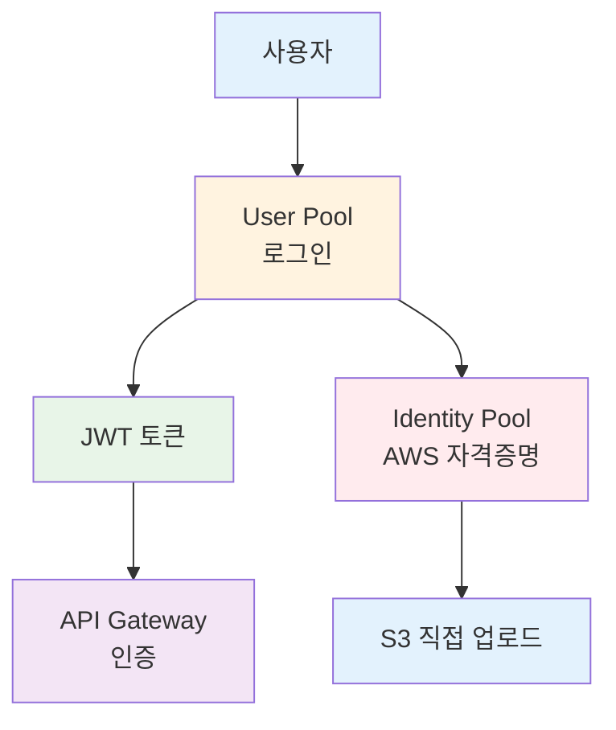
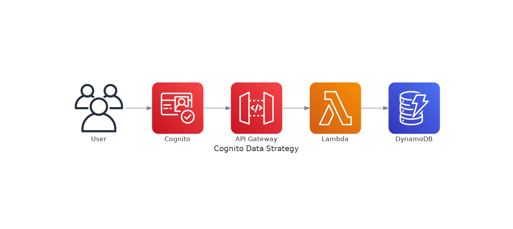

# November Week 2 Day 2 Session 2: Cognito (사용자 인증/인가)

<div align="center">

**👤 사용자 관리** • **🔐 인증/인가** • **🎫 JWT 토큰** • **🔗 소셜 로그인**

*AWS 관리형 사용자 인증 서비스로 안전한 로그인 구현*

</div>

---

## 🕘 Session 정보
**시간**: 09:40-10:20 (40분)
**목표**: Cognito 개념 이해 및 API Gateway 통합 방법 습득
**방식**: 이론 + AWS 공식 문서 기반 설명

## 🎯 학습 목표

### 📚 이해 목표
- Cognito User Pool vs Identity Pool 차이 이해
- JWT 토큰 구조 및 검증 방식 파악
- 소셜 로그인 통합 방법 이해
- 사용자 데이터 저장 전략 습득

### 🛠️ 적용 목표
- User Pool 생성 및 설정
- API Gateway와 Cognito 통합
- JWT 토큰 기반 인증 구현
- 사용자 프로필 관리

---

## 🤔 왜 필요한가? (5분)

### 💼 실무 시나리오: 서버리스 웹 애플리케이션

**문제 상황**:
```
사용자 인증이 필요한 API
    ↓
직접 구현하면?
- 회원가입/로그인 로직
- 비밀번호 암호화
- JWT 토큰 발급/검증
- 이메일 인증
- 비밀번호 재설정
- MFA (다중 인증)
- 소셜 로그인 (Google, Facebook)
---
개발 시간: 수주 ~ 수개월 😱
```

**Cognito 사용 시**:
```
Cognito User Pool (관리형 서비스)
    ↓
모든 기능 제공:
- ✅ 회원가입/로그인 (자동)
- ✅ 비밀번호 정책 (설정만)
- ✅ JWT 토큰 (자동 발급)
- ✅ 이메일/SMS 인증 (자동)
- ✅ 비밀번호 재설정 (자동)
- ✅ MFA (설정만)
- ✅ 소셜 로그인 (연동만)
---
개발 시간: 수시간 ~ 수일 ✅
```

### 🏠 실생활 비유

**호텔 프론트 데스크 + 회원 시스템**:
- **Cognito**: 호텔 회원 시스템 (가입, 로그인, 회원 정보)
- **API Gateway**: 프론트 데스크 (회원 확인 후 입장)
- **Lambda/ECS**: 호텔 서비스 (룸서비스, 컨시어지)

---

## 📖 핵심 개념 (30분)

### 🔍 개념 1: User Pool vs Identity Pool (10분)

> **정의** (AWS 공식): Cognito는 두 가지 주요 컴포넌트로 구성됩니다 - User Pool (사용자 인증)과 Identity Pool (AWS 리소스 접근).

#### User Pool (사용자 인증)

**역할**: 사용자 디렉토리 + 인증 서버

**주요 기능**:
1. **회원가입/로그인**: 이메일, 전화번호, 사용자명
2. **JWT 토큰 발급**: ID Token, Access Token, Refresh Token
3. **소셜 로그인**: Google, Facebook, Apple, Amazon
4. **MFA**: SMS, TOTP (Google Authenticator)
5. **사용자 관리**: 프로필, 그룹, 속성

**사용 사례**:
- 웹/모바일 앱 로그인
- API 인증 (API Gateway 통합)
- SSO (Single Sign-On)

#### Identity Pool (AWS 리소스 접근)

**역할**: AWS 임시 자격 증명 발급

**주요 기능**:
1. **AWS Credentials 발급**: AccessKeyId, SecretAccessKey, SessionToken
2. **역할 기반 접근**: IAM Role 매핑
3. **익명 접근**: 로그인 없이 제한적 접근

**사용 사례**:
- S3 직접 업로드 (클라이언트 → S3)
- DynamoDB 직접 접근
- 모바일 앱에서 AWS SDK 사용

#### 비교표

| 특징 | User Pool | Identity Pool |
|------|-----------|---------------|
| **목적** | 사용자 인증 | AWS 리소스 접근 |
| **발급** | JWT 토큰 | AWS Credentials |
| **사용처** | API Gateway, 앱 | AWS SDK, S3, DynamoDB |
| **소셜 로그인** | ✅ 직접 지원 | ✅ User Pool 통해 |
| **익명 접근** | ❌ | ✅ |
| **비용** | MAU 기반 | 무료 (AWS 리소스 비용만) |

**일반적인 조합**:


### 🔍 개념 2: 인증 흐름 및 JWT 토큰 (10분)

#### 전체 인증 흐름

**Phase 1: 회원가입**
```
Client → Cognito.signUp(email, password)
         ↓
    User Pool에 사용자 생성
         ↓
    이메일 인증 코드 발송
         ↓
Client → Cognito.confirmSignUp(code)
         ↓
    사용자 활성화 완료
```

**Phase 2: 로그인**
```
Client → Cognito.signIn(email, password)
         ↓
    비밀번호 검증
         ↓
    JWT 토큰 발급:
    - ID Token (사용자 정보)
    - Access Token (권한)
    - Refresh Token (갱신용)
         ↓
Client (localStorage에 저장)
```

**Phase 3: API 호출**
```
Client → API Gateway
         ↓
    Authorization: Bearer <ID Token>
         ↓
    API Gateway가 Cognito에 자동 검증
    (User Pool ID만 설정하면 자동)
         ↓
    검증 성공 → Lambda/ECS/EKS
         ↓
    Lambda에서 사용자 정보 사용
```

#### JWT 토큰 구조

**ID Token** (사용자 정보):
```json
{
  "sub": "user-uuid-1234",
  "email": "user@example.com",
  "email_verified": true,
  "cognito:username": "john",
  "cognito:groups": ["admin", "users"],
  "custom:nickname": "Johnny",
  "iss": "https://cognito-idp.ap-northeast-2.amazonaws.com/...",
  "exp": 1699000000,
  "iat": 1698996400
}
```

**Access Token** (권한):
```json
{
  "sub": "user-uuid-1234",
  "scope": "openid profile email",
  "cognito:groups": ["admin"],
  "iss": "https://cognito-idp.ap-northeast-2.amazonaws.com/...",
  "exp": 1699000000,
  "iat": 1698996400
}
```

**Refresh Token** (갱신용):
- 긴 유효기간 (기본 30일)
- 새로운 ID/Access Token 발급용
- 보안상 중요 (안전하게 저장)

#### Lambda에서 사용자 정보 추출

```python
def lambda_handler(event, context):
    # API Gateway가 검증한 사용자 정보 (자동)
    claims = event['requestContext']['authorizer']['claims']
    
    user_id = claims['sub']
    email = claims['email']
    username = claims['cognito:username']
    groups = claims.get('cognito:groups', '').split(',')
    
    # 권한 확인
    if 'admin' not in groups:
        return {
            'statusCode': 403,
            'body': json.dumps({'error': 'Forbidden'})
        }
    
    # 비즈니스 로직
    return {
        'statusCode': 200,
        'body': json.dumps({
            'userId': user_id,
            'email': email
        })
    }
```

### 🔍 개념 3: 사용자 데이터 저장 전략 (10분)

#### 옵션 1: Cognito만 사용 (간단한 앱)

**Cognito User Pool 속성**:
```
표준 속성 (OIDC 표준):
- email, email_verified
- phone_number, phone_number_verified
- name, family_name, given_name
- birthdate, gender
- address, locale, zoneinfo

Custom 속성 (최대 50개):
- custom:nickname
- custom:age
- custom:preferences
- custom:avatar_url
```

**장점**:
- ✅ 별도 DB 불필요
- ✅ JWT에 자동 포함
- ✅ 관리 간편

**단점**:
- ❌ 복잡한 쿼리 불가
- ❌ 관계형 데이터 어려움
- ❌ 속성 변경 제한적

#### 옵션 2: Cognito + DynamoDB (권장)

**데이터 분리 전략**:



*그림: Cognito + DynamoDB 데이터 전략 - 인증은 Cognito, 프로필/활동 데이터는 DynamoDB*

```
Cognito User Pool          DynamoDB
├── 인증 정보           ├── 사용자 프로필 (Users 테이블)
│   ├── 이메일          │   ├── userId (Cognito sub) ← PK
│   ├── 비밀번호        │   ├── nickname
│   └── 전화번호        │   ├── avatar
                        │   ├── bio
                        │   └── preferences
                        │
                        ├── 사용자 활동 (Orders 테이블)
                        │   ├── orderId ← PK
                        │   ├── userId ← FK (Cognito sub)
                        │   ├── items
                        │   └── createdAt
                        │
                        └── 사용자 게시물 (Posts 테이블)
                            ├── postId ← PK
                            ├── userId ← FK (Cognito sub)
                            └── content
```

**Lambda 구현 예시**:
```python
import boto3
import json

dynamodb = boto3.resource('dynamodb')
users_table = dynamodb.Table('Users')

def lambda_handler(event, context):
    # 1. Cognito에서 검증된 사용자 정보 (자동)
    user_id = event['requestContext']['authorizer']['claims']['sub']
    email = event['requestContext']['authorizer']['claims']['email']
    
    # 2. DynamoDB에서 추가 프로필 조회
    response = users_table.get_item(Key={'userId': user_id})
    
    if 'Item' not in response:
        # 첫 로그인 시 프로필 생성
        users_table.put_item(Item={
            'userId': user_id,
            'email': email,
            'nickname': email.split('@')[0],
            'createdAt': datetime.now().isoformat()
        })
        profile = {'nickname': email.split('@')[0]}
    else:
        profile = response['Item']
    
    # 3. 통합 응답
    return {
        'statusCode': 200,
        'body': json.dumps({
            'userId': user_id,
            'email': email,
            'profile': profile
        })
    }
```

**장점**:
- ✅ 복잡한 쿼리 가능
- ✅ 관계형 데이터 지원
- ✅ 무제한 속성
- ✅ 확장성 높음

**단점**:
- ⚠️ 추가 DB 관리 필요
- ⚠️ 데이터 동기화 고려

#### 옵션 3: Cognito + RDS (복잡한 앱)

**사용 사례**:
- 복잡한 관계형 데이터
- 트랜잭션 필요
- 기존 RDS 인프라 활용

**구조**:
```sql
-- Users 테이블
CREATE TABLE users (
    user_id VARCHAR(255) PRIMARY KEY,  -- Cognito sub
    email VARCHAR(255) UNIQUE,
    nickname VARCHAR(100),
    created_at TIMESTAMP DEFAULT CURRENT_TIMESTAMP
);

-- Orders 테이블
CREATE TABLE orders (
    order_id SERIAL PRIMARY KEY,
    user_id VARCHAR(255) REFERENCES users(user_id),
    total_amount DECIMAL(10, 2),
    created_at TIMESTAMP DEFAULT CURRENT_TIMESTAMP
);
```

---

## 💰 비용 구조 (5분)

### Feature Plans (2024년 11월 신규)

**Lite** (저비용):
- 기본 인증 기능
- 소셜 로그인
- MFA (SMS, TOTP)

**Essentials** (기본, 권장):
- Lite 기능 전체
- Managed Login (호스팅 UI)
- Passwordless 로그인
- Access Token 커스터마이징

**Plus** (고급 보안):
- Essentials 기능 전체
- 위험 기반 인증
- 손상된 자격 증명 감지
- 사용자 활동 로그

### 가격 (ap-northeast-2)

**Essentials (기본)**:
```
프리티어 (12개월):
- 10,000 MAU/월 (직접 로그인 + 소셜)
- 50 MAU/월 (SAML/OIDC 페더레이션)

유료:
- 첫 10,000 MAU: 무료
- 다음 40,000 MAU: $0.0055/MAU
- 다음 950,000 MAU: $0.0046/MAU
- 1M MAU 초과: $0.00325/MAU
```

**Plus (고급 보안)**:
```
- 첫 10,000 MAU: 무료
- 다음 40,000 MAU: $0.0110/MAU
- 다음 950,000 MAU: $0.0092/MAU
- 1M MAU 초과: $0.0065/MAU
```

### 실제 비용 계산

**시나리오**: 월 10만 명 활성 사용자

**Essentials**:
```
첫 10,000 MAU: $0 (무료)
다음 40,000 MAU: 40,000 × $0.0055 = $220
다음 50,000 MAU: 50,000 × $0.0046 = $230
---
총 비용: $450/월
```

**Plus**:
```
첫 10,000 MAU: $0 (무료)
다음 40,000 MAU: 40,000 × $0.0110 = $440
다음 50,000 MAU: 50,000 × $0.0092 = $460
---
총 비용: $900/월
```

### 추가 비용

**SMS MFA**:
- $0.00645/SMS (ap-northeast-2)
- 월 10,000건: $64.50

**이메일 (SES 통합)**:
- $0.10/1,000건
- 월 100,000건: $10

### 비용 최적화 팁

1. **MAU 최소화**: 비활성 사용자 자동 정리
2. **소셜 로그인 활용**: SMS 비용 절감
3. **토큰 유효기간 최적화**: Refresh Token 활용
4. **Feature Plan 선택**: 필요한 기능만 선택

---

## 🔑 핵심 키워드

- **User Pool**: 사용자 디렉토리 + 인증 서버
- **Identity Pool**: AWS 리소스 접근 자격 증명
- **JWT**: JSON Web Token (ID, Access, Refresh)
- **MAU**: Monthly Active Users (과금 기준)
- **MFA**: Multi-Factor Authentication
- **Cognito sub**: 사용자 고유 ID (UUID)
- **Custom Attributes**: 사용자 정의 속성 (최대 50개)
- **Managed Login**: Cognito 호스팅 UI

---

## 📝 Session 마무리

### ✅ 오늘 Session 성과
- [ ] User Pool vs Identity Pool 차이 이해
- [ ] JWT 토큰 구조 및 검증 방식 파악
- [ ] 인증 흐름 (회원가입 → 로그인 → API 호출) 이해
- [ ] 사용자 데이터 저장 전략 습득
- [ ] API Gateway + Cognito 통합 방법 파악

### 🎯 다음 Session 준비
- **Session 3**: Terraform 기본 명령어
- **Lab 1**: Cognito + API Gateway + Lambda 통합 실습

### 🔗 공식 문서 (필수)

**⚠️ 학생들이 직접 확인해야 할 공식 문서**:
- 📘 [Cognito란?](https://docs.aws.amazon.com/cognito/latest/developerguide/what-is-amazon-cognito.html)
- 📗 [User Pool 사용자 가이드](https://docs.aws.amazon.com/cognito/latest/developerguide/cognito-user-identity-pools.html)
- 📙 [JWT 토큰 검증](https://docs.aws.amazon.com/cognito/latest/developerguide/amazon-cognito-user-pools-using-tokens-verifying-a-jwt.html)
- 📕 [Cognito 요금](https://aws.amazon.com/cognito/pricing/)
- 🆕 [Cognito 최신 업데이트](https://aws.amazon.com/about-aws/whats-new/cognito/)

---

<div align="center">

**👤 사용자 관리** • **🔐 JWT 인증** • **💰 비용 효율** • **🔗 API Gateway 통합**

*다음: Session 3 - Terraform 기본 명령어*

</div>
