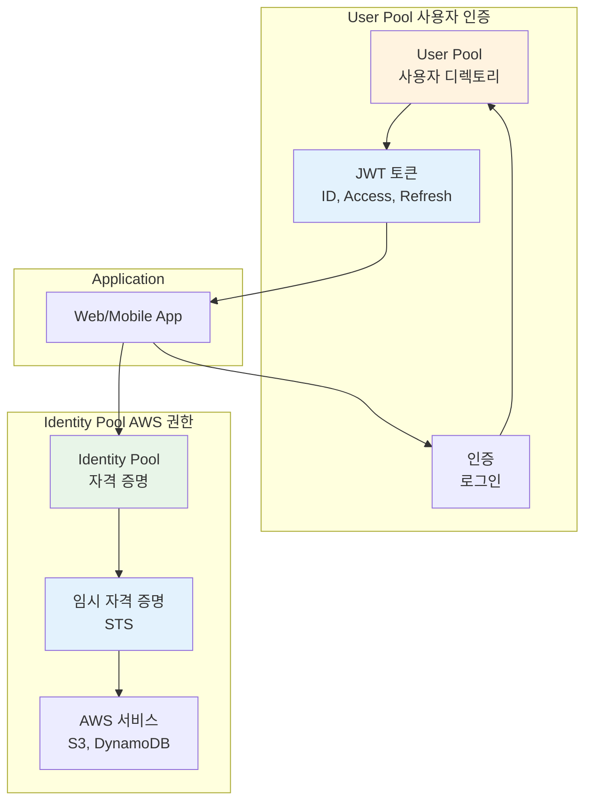
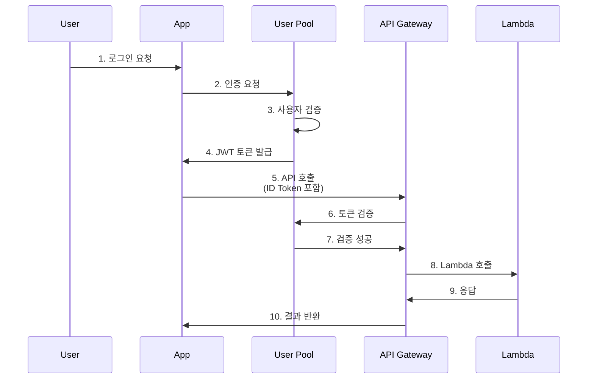

# November Week 2 Day 2 Session 2: Cognito

<div align="center">

**👤 사용자 인증** • **🔐 권한 관리** • **🎫 JWT 토큰**

*웹 및 모바일 앱을 위한 완전 관리형 사용자 인증 및 권한 부여 서비스*

</div>

---

## 🕘 세션 정보
**시간**: 09:50-10:40 (50분)
**목표**: AWS Cognito의 User Pool과 Identity Pool 이해 및 API Gateway 통합
**방식**: 개념 설명 + 실무 사례 + 아키텍처 패턴

## 🎯 학습 목표
- Cognito의 생성 배경과 필요성 이해
- User Pool과 Identity Pool의 차이점 파악
- JWT 토큰 (ID, Access, Refresh) 이해
- API Gateway와 Cognito 통합 방법 습득
- 비용 구조와 최적화 방법 학습

---

## 📖 서비스 개요

### 1. 생성 배경 (Why?) - 5분

**문제 상황**:
- **인증 시스템 구축 복잡성**: 회원가입, 로그인, 비밀번호 재설정 직접 구현
- **보안 관리 어려움**: 비밀번호 암호화, 토큰 관리, MFA 구현
- **확장성 문제**: 사용자 증가 시 데이터베이스 확장 필요
- **소셜 로그인 통합**: Google, Facebook 등 각각 구현 필요

**AWS Cognito 솔루션**:
- **완전 관리형**: 사용자 디렉토리 및 인증 시스템 제공
- **내장 보안**: 암호화, MFA, 적응형 인증
- **자동 확장**: 수백만 사용자까지 자동 확장
- **소셜 로그인**: Google, Facebook, Apple 등 통합

### 2. 핵심 원리 (How?) - 10분

**Cognito 작동 원리**:



**핵심 구성 요소**:

1. **User Pool (사용자 풀)**:
   - 사용자 디렉토리 (회원가입, 로그인)
   - JWT 토큰 발급
   - 소셜 로그인 통합

2. **Identity Pool (자격 증명 풀)**:
   - AWS 서비스 접근 권한
   - 임시 자격 증명 발급
   - 익명 사용자 지원

3. **JWT 토큰**:
   - ID Token: 사용자 정보
   - Access Token: API 접근 권한
   - Refresh Token: 토큰 갱신

**인증 흐름**:


### 3. 주요 사용 사례 (When?) - 5분

**적합한 경우**:

1. **웹/모바일 앱 인증**:
   - 회원가입, 로그인, 비밀번호 재설정
   - 이메일/전화번호 인증
   - MFA (Multi-Factor Authentication)

2. **소셜 로그인**:
   - Google, Facebook, Apple 로그인
   - SAML, OIDC 통합
   - 기업 SSO (Single Sign-On)

3. **API 보안**:
   - API Gateway 인증
   - JWT 토큰 기반 인증
   - 사용자별 권한 관리

4. **AWS 리소스 접근**:
   - S3 버킷 직접 접근
   - DynamoDB 테이블 접근
   - 익명 사용자 지원

**실제 사례**:
- **Netflix**: 수백만 사용자 인증 관리
- **Airbnb**: 소셜 로그인 통합
- **Uber**: 모바일 앱 인증 및 권한 관리

### 4. 비슷한 서비스 비교 (Which?) - 5분

**AWS 내 대안 서비스**:

**Cognito vs IAM**:
- **Cognito 사용**: 앱 사용자 인증, 수백만 사용자, JWT 토큰
- **IAM 사용**: AWS 리소스 접근, 내부 사용자, IAM 정책

**Cognito vs Auth0**:
- **Cognito 사용**: AWS 통합, 저렴한 비용, AWS 서비스 접근
- **Auth0 사용**: 다양한 기능, 멀티 클라우드, 복잡한 인증

**User Pool vs Identity Pool**:
- **User Pool 사용**: 사용자 인증, JWT 토큰, API 접근
- **Identity Pool 사용**: AWS 서비스 접근, 임시 자격 증명, 익명 사용자

**선택 기준**:
| 기준 | User Pool | Identity Pool | IAM | Auth0 |
|------|-----------|---------------|-----|-------|
| 주요 용도 | 사용자 인증 | AWS 권한 | AWS 리소스 | 범용 인증 |
| 토큰 타입 | JWT | STS 자격 증명 | IAM 정책 | JWT |
| 사용자 수 | 무제한 | 무제한 | 제한적 | 무제한 |
| 소셜 로그인 | 지원 | 지원 | 미지원 | 지원 |
| AWS 통합 | 강력 | 매우 강력 | 완벽 | 제한적 |
| 비용 | 저렴 | 저렴 | 무료 | 비쌈 |

### 5. 장단점 분석 - 3분

**장점**:
- ✅ **완전 관리형**: 인프라 관리 불필요, 자동 확장
- ✅ **보안 내장**: 암호화, MFA, 적응형 인증
- ✅ **소셜 로그인**: Google, Facebook, Apple 등 통합
- ✅ **AWS 통합**: API Gateway, Lambda, S3 등 완벽 통합
- ✅ **저렴한 비용**: MAU 기반 과금, 프리티어 제공

**단점/제약사항**:
- ⚠️ **커스터마이징 제한**: UI 커스터마이징 제한적
- ⚠️ **Lambda Trigger 복잡**: 고급 기능 구현 시 복잡
- ⚠️ **마이그레이션 어려움**: 기존 사용자 데이터 이전 복잡
- ⚠️ **리전 제한**: 일부 리전에서만 사용 가능

**대안**:
- UI 커스터마이징: Hosted UI 대신 자체 UI 구축
- 복잡한 로직: Lambda Trigger 활용
- 마이그레이션: User Migration Lambda 사용

### 6. 비용 구조 💰 - 5분

**과금 방식**:

**User Pool**:
- MAU (Monthly Active Users): 월간 활성 사용자 기준
- 처음 50,000 MAU: 무료
- 다음 50,000 MAU: $0.0055/MAU
- 다음 900,000 MAU: $0.0046/MAU
- 1,000,000 MAU 이상: $0.00325/MAU

**Identity Pool**:
- 무료 (STS 비용만 발생)

**고급 보안 기능**:
- 적응형 인증: $0.05/MAU
- 사용자 마이그레이션: $0.05/MAU

**프리티어 혜택** (매월):
- User Pool: 50,000 MAU 무료
- Identity Pool: 무료

**비용 최적화 팁**:
1. **MAU 최적화**: 비활성 사용자 정리
2. **고급 기능 선택적 사용**: 필요한 경우만 적응형 인증
3. **Identity Pool 활용**: AWS 서비스 접근은 Identity Pool
4. **Refresh Token 활용**: 재로그인 최소화
5. **소셜 로그인**: 자체 인증보다 저렴

**예상 비용 계산**:
```
월간 100,000 MAU 시:
- 처음 50,000 MAU: $0 (프리티어)
- 다음 50,000 MAU: 50,000 × $0.0055 = $275
총 비용: $275/월

월간 10,000 MAU 시:
- 10,000 MAU: $0 (프리티어)
총 비용: $0/월
```

**실제 사용 예시**:
| 시나리오 | 월간 MAU | 예상 비용 |
|----------|----------|-----------|
| 소규모 앱 | 10,000 | $0 (프리티어) |
| 중규모 앱 | 100,000 | $275 |
| 대규모 앱 | 1,000,000 | $4,925 |
| 엔터프라이즈 | 10,000,000 | $33,175 |

### 7. 최신 업데이트 🆕 - 2분

**2024년 주요 변경사항**:
- **Managed Login**: 완전 관리형 로그인 UI 개선
- **Advanced Security**: 적응형 인증 기능 강화
- **Custom Domains**: 사용자 지정 도메인 지원 확대

**2025년 예정**:
- **더 많은 소셜 로그인**: 추가 소셜 로그인 제공자
- **향상된 UI**: Hosted UI 커스터마이징 개선

**참조**: [AWS Cognito What's New](https://aws.amazon.com/cognito/whats-new/)

### 8. 잘 사용하는 방법 ✅ - 3분

**베스트 프랙티스**:
1. **User Pool + Identity Pool 조합**: 인증과 권한 분리
2. **Refresh Token 활용**: 사용자 경험 개선
3. **MFA 활성화**: 보안 강화
4. **Lambda Trigger**: 커스텀 로직 구현
5. **CloudWatch 모니터링**: 로그인 실패, 이상 행동 추적

**실무 팁**:
- **Custom Attributes**: 사용자 메타데이터 저장
- **Groups**: 역할 기반 접근 제어 (RBAC)
- **App Clients**: 앱별 설정 분리
- **Domain Name**: 사용자 친화적 도메인

**코드 예시**:
```python
import boto3
import json

cognito = boto3.client('cognito-idp')

# User Pool 생성
response = cognito.create_user_pool(
    PoolName='my-user-pool',
    Policies={
        'PasswordPolicy': {
            'MinimumLength': 8,
            'RequireUppercase': True,
            'RequireLowercase': True,
            'RequireNumbers': True,
            'RequireSymbols': True
        }
    },
    AutoVerifiedAttributes=['email'],
    MfaConfiguration='OPTIONAL',
    Schema=[
        {
            'Name': 'email',
            'AttributeDataType': 'String',
            'Required': True,
            'Mutable': True
        }
    ]
)

user_pool_id = response['UserPool']['Id']

# App Client 생성
client_response = cognito.create_user_pool_client(
    UserPoolId=user_pool_id,
    ClientName='my-app-client',
    GenerateSecret=False,
    ExplicitAuthFlows=[
        'ALLOW_USER_PASSWORD_AUTH',
        'ALLOW_REFRESH_TOKEN_AUTH'
    ]
)
```

### 9. 잘못 사용하는 방법 ❌ - 3분

**흔한 실수**:
1. **User Pool만 사용**: AWS 서비스 접근 시 Identity Pool 필요
2. **Access Token으로 사용자 정보**: ID Token 사용해야 함
3. **MFA 미사용**: 보안 취약
4. **Refresh Token 미활용**: 사용자 경험 저하
5. **Lambda Trigger 과도 사용**: 성능 저하

**안티 패턴**:
- **비밀번호 직접 저장**: Cognito가 관리, 직접 저장 금지
- **토큰 로컬 저장**: 보안 취약, Secure Storage 사용
- **모든 사용자 Admin**: 최소 권한 원칙 위반
- **Custom UI 없이 Hosted UI만**: 브랜딩 제한

**보안 취약점**:
- **JWT 검증 안 함**: 토큰 위조 가능
- **HTTPS 미사용**: 토큰 탈취 위험
- **토큰 만료 미확인**: 만료된 토큰 사용
- **Refresh Token 노출**: 장기 접근 권한 탈취

### 10. 구성 요소 상세 - 5분

**주요 구성 요소**:

**1. User Pool (사용자 풀)**:

**기능**:
- 회원가입, 로그인, 비밀번호 재설정
- 이메일/전화번호 인증
- MFA (SMS, TOTP)
- 소셜 로그인 (Google, Facebook, Apple)

**JWT 토큰**:
- **ID Token**: 사용자 정보 (이름, 이메일 등)
- **Access Token**: API 접근 권한
- **Refresh Token**: 토큰 갱신 (최대 10년)

**2. Identity Pool (자격 증명 풀)**:

**기능**:
- AWS 서비스 접근 권한
- 임시 자격 증명 (STS)
- 익명 사용자 지원
- 역할 기반 접근 제어

**사용 예시**:
```javascript
// S3 직접 접근
AWS.config.credentials = new AWS.CognitoIdentityCredentials({
  IdentityPoolId: 'ap-northeast-2:xxxxx',
  Logins: {
    'cognito-idp.ap-northeast-2.amazonaws.com/ap-northeast-2_xxxxx': idToken
  }
});

const s3 = new AWS.S3();
s3.putObject({
  Bucket: 'my-bucket',
  Key: 'file.txt',
  Body: 'Hello World'
});
```

**3. Lambda Triggers (Lambda 트리거)**:

**Pre-authentication**:
- 로그인 전 커스텀 검증

**Post-authentication**:
- 로그인 후 로깅, 분석

**Pre-sign-up**:
- 회원가입 전 검증

**Post-confirmation**:
- 이메일 인증 후 처리

**Custom Message**:
- 이메일/SMS 커스터마이징

**4. App Clients (앱 클라이언트)**:
- **역할**: 앱별 설정 분리
- **설정**: 인증 흐름, 토큰 만료 시간
- **예시**: Web App, Mobile App, Admin App

**5. Groups (그룹)**:
- **역할**: 역할 기반 접근 제어 (RBAC)
- **기능**: IAM 역할 자동 할당
- **예시**: Admin, User, Guest

### 11. 공식 문서 링크 (필수 5개)

**⚠️ 학생들이 직접 확인해야 할 공식 문서**:
- 📘 [Cognito란 무엇인가?](https://docs.aws.amazon.com/cognito/latest/developerguide/what-is-amazon-cognito.html)
- 📗 [Cognito 사용자 가이드](https://docs.aws.amazon.com/cognito/latest/developerguide/)
- 📙 [Cognito API 레퍼런스](https://docs.aws.amazon.com/cognito-user-identity-pools/latest/APIReference/)
- 📕 [Cognito 요금](https://aws.amazon.com/cognito/pricing/)
- 🆕 [Cognito 최신 업데이트](https://aws.amazon.com/cognito/whats-new/)

---

## 💭 함께 생각해보기

**토론 주제**:
1. User Pool과 Identity Pool을 언제 함께 사용해야 할까?
2. JWT 토큰 3가지 (ID, Access, Refresh)의 역할 차이는?
3. 소셜 로그인과 자체 인증 중 어떤 것을 선택해야 할까?

---

## 🔑 핵심 키워드

- **Cognito**: AWS 완전 관리형 사용자 인증 서비스
- **User Pool**: 사용자 디렉토리 및 인증
- **Identity Pool**: AWS 서비스 접근 권한
- **JWT Token**: ID, Access, Refresh 토큰
- **MAU**: Monthly Active Users (월간 활성 사용자)
- **MFA**: Multi-Factor Authentication (다중 인증)
- **Lambda Trigger**: 커스텀 인증 로직
- **Hosted UI**: 완전 관리형 로그인 UI

---

## 📝 세션 마무리

### ✅ 오늘 세션 성과
- [ ] Cognito의 필요성 이해
- [ ] User Pool과 Identity Pool 차이점 파악
- [ ] JWT 토큰 이해
- [ ] API Gateway 통합 방법 습득
- [ ] 비용 구조와 최적화 방법 학습

### 🎯 다음 세션 준비
**Session 3: Terraform 기본 명령어**
- init, plan, apply, destroy
- State 파일 관리
- 변수 및 출력

---

<div align="center">

**👤 사용자 인증** • **🔐 권한 관리** • **🎫 JWT 토큰**

*Cognito로 안전하고 확장 가능한 인증 시스템 구축*

</div>
