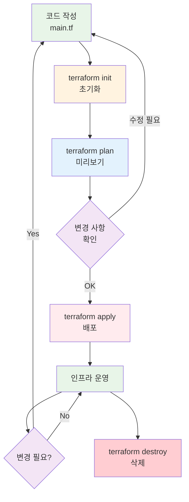

# November Week 2 Day 2 Session 3: Terraform 기본 명령어

<div align="center">

**🔧 init** • **📋 plan** • **🚀 apply** • **🗑️ destroy**

*Terraform 핵심 워크플로우 완벽 이해*

</div>

---

## 🕘 Session 정보
**시간**: 10:30-11:10 (40분)
**목표**: Terraform 기본 명령어 완벽 이해 및 실무 활용
**방식**: 이론 + 실습 데모

## 🎯 학습 목표

### 📚 이해 목표
- Terraform 워크플로우 이해
- 각 명령어의 역할과 실행 순서 파악
- State 파일의 중요성 이해
- 실무 사용 패턴 습득

### 🛠️ 적용 목표
- 올바른 명령어 순서로 인프라 배포
- State 파일 안전하게 관리
- 변경 사항 미리 확인 (plan)
- 안전한 리소스 삭제

---

## 🤔 왜 필요한가? (5분)

### 💼 실무 시나리오: 인프라 변경 관리

**문제 상황**:
```
AWS Console에서 수동 작업:
1. VPC 생성 → 클릭 10번
2. Subnet 생성 → 클릭 15번
3. EC2 생성 → 클릭 20번
---
총 45번 클릭, 30분 소요
실수 가능성 높음 😱
```

**Terraform 사용 시**:
```bash
# 1. 코드 작성 (한 번만)
cat > main.tf

# 2. 실행 (매번 동일)
terraform init    # 초기화
terraform plan    # 미리보기
terraform apply   # 배포
---
3개 명령어, 5분 소요
실수 없음 ✅
```

### 🏠 실생활 비유

**건축 프로세스**:
- **init**: 건축 자재 준비 (시멘트, 벽돌 구매)
- **plan**: 설계도 검토 (무엇을 지을지 확인)
- **apply**: 실제 건축 (집 짓기)
- **destroy**: 철거 (집 허물기)

---

## 📖 핵심 개념 (30분)

### 🔍 개념 1: terraform init (초기화) (8분)

> **정의** (Terraform 공식): `terraform init` 명령어는 Terraform 작업 디렉토리를 초기화합니다. 이는 Terraform 설정 파일이 포함된 새 디렉토리나 기존 디렉토리에서 실행해야 하는 첫 번째 명령어입니다.

#### 실행 시점
```bash
# 1. 처음 Terraform 프로젝트 시작할 때
terraform init

# 2. Provider 버전 변경 시
terraform init -upgrade

# 3. 새로운 모듈 추가 시
terraform init

# 4. Backend 설정 변경 시
terraform init -reconfigure
```

#### 내부 동작 (공식 문서 기반)

**Phase 1: Provider 플러그인 다운로드**
```
main.tf에 정의된 Provider 확인
    ↓
terraform {
  required_providers {
    aws = {
      source  = "hashicorp/aws"
      version = "~> 5.0"
    }
  }
}
    ↓
.terraform/ 폴더에 플러그인 다운로드
    ↓
.terraform/providers/
└── registry.terraform.io/
    └── hashicorp/
        └── aws/
            └── 5.x.x/
                └── linux_amd64/
                    └── terraform-provider-aws_v5.x.x
```

**Phase 2: Backend 초기화**
```
backend 설정 확인
    ↓
terraform {
  backend "s3" {
    bucket = "my-terraform-state"
    key    = "prod/terraform.tfstate"
    region = "ap-northeast-2"
  }
}
    ↓
S3 버킷 연결 확인
    ↓
.terraform/terraform.tfstate (로컬 백엔드 정보)
```

**Phase 3: 모듈 다운로드**
```
module 블록 확인
    ↓
module "vpc" {
  source  = "terraform-aws-modules/vpc/aws"
  version = "5.0.0"
}
    ↓
.terraform/modules/ 폴더에 다운로드
```

#### 실행 예시

```bash
$ terraform init

Initializing the backend...
Initializing provider plugins...
- Finding hashicorp/aws versions matching "~> 5.0"...
- Installing hashicorp/aws v5.25.0...
- Installed hashicorp/aws v5.25.0 (signed by HashiCorp)

Terraform has been successfully initialized!

You may now begin working with Terraform. Try running "terraform plan" to see
any changes that are required for your infrastructure.
```

#### 생성되는 파일/폴더

```
프로젝트/
├── .terraform/              # init이 생성 (Git 제외)
│   ├── providers/          # Provider 플러그인
│   ├── modules/            # 다운로드된 모듈
│   └── terraform.tfstate   # Backend 정보
├── .terraform.lock.hcl     # Provider 버전 잠금
├── main.tf                 # 사용자 작성
└── terraform.tfstate       # apply 후 생성
```

#### 주요 옵션 (공식 문서)

```bash
# Provider 버전 업그레이드
terraform init -upgrade

# Backend 재설정 (기존 state 유지)
terraform init -reconfigure

# Backend 마이그레이션 (state 복사)
terraform init -migrate-state

# 플러그인 다운로드 건너뛰기
terraform init -get-plugins=false
```

### 🔍 개념 2: terraform plan (미리보기) (8분)

> **정의** (Terraform 공식): `terraform plan` 명령어는 실행 계획을 생성합니다. Terraform이 현재 설정을 달성하기 위해 수행할 작업을 결정하고 표시합니다.

#### 실행 시점
```bash
# 1. apply 전 항상 실행 (필수!)
terraform plan

# 2. 코드 변경 후 영향 확인
terraform plan

# 3. 특정 리소스만 확인
terraform plan -target=aws_instance.web

# 4. 삭제 계획 확인
terraform plan -destroy
```

#### 내부 동작 (공식 문서 기반)

**Phase 1: Refresh (현재 상태 확인)**
```
실제 인프라 상태 조회
    ↓
AWS API 호출로 현재 리소스 확인
    ↓
State 파일과 비교
```

**Phase 2: Dependency Graph 생성**
```
리소스 간 의존성 분석
    ↓
aws_vpc.main
    ↓
aws_subnet.public (depends_on vpc)
    ↓
aws_instance.web (depends_on subnet)
```

**Phase 3: Diff 계산**
```
현재 상태 vs 원하는 상태
    ↓
차이점 계산
    ↓
- instance_type: "t3.micro" → "t3.small"
```

**Phase 4: 실행 계획 생성**
```
변경 작업 순서 결정
    ↓
1. aws_instance.web 수정 (in-place)
   - instance_type 변경
```

#### 실행 예시

```bash
$ terraform plan

Terraform used the selected providers to generate the following execution plan.
Resource actions are indicated with the following symbols:
  ~ update in-place

Terraform will perform the following actions:

  # aws_instance.web will be updated in-place
  ~ resource "aws_instance" "web" {
        id                    = "i-1234567890abcdef0"
      ~ instance_type         = "t3.micro" -> "t3.small"
        # (10 unchanged attributes hidden)
    }

Plan: 0 to add, 1 to change, 0 to destroy.
```

#### 출력 기호 의미 (공식 문서)

```
+ create    # 새로 생성
~ update    # 수정 (in-place)
-/+ replace # 삭제 후 재생성 (force replacement)
- destroy   # 삭제
<= read     # 데이터 소스 읽기
```

#### 주요 옵션 (공식 문서)

```bash
# 계획을 파일로 저장
terraform plan -out=tfplan

# 저장된 계획 확인
terraform show tfplan

# 특정 리소스만 계획
terraform plan -target=aws_instance.web

# 변수 값 지정
terraform plan -var="instance_type=t3.small"

# 변수 파일 사용
terraform plan -var-file="prod.tfvars"

# Refresh 건너뛰기 (빠른 계획)
terraform plan -refresh=false
```

### 🔍 개념 3: terraform apply (배포) (8분)

> **정의** (Terraform 공식): `terraform apply` 명령어는 Terraform 설정 파일에 정의된 원하는 상태를 달성하기 위해 필요한 변경 사항을 적용합니다.

#### 실행 시점
```bash
# 1. plan 확인 후 실행 (권장)
terraform plan
terraform apply

# 2. 자동 승인 (CI/CD)
terraform apply -auto-approve

# 3. 저장된 계획 실행 (안전)
terraform plan -out=tfplan
terraform apply tfplan
```

#### 내부 동작 (공식 문서 기반)

**Phase 1: Plan 재실행**
```
terraform plan과 동일한 과정
    ↓
변경 사항 다시 계산
    ↓
사용자에게 확인 요청
    ↓
Do you want to perform these actions?
  Enter a value: yes
```

**Phase 2: 리소스 생성/수정/삭제**
```
실행 계획 순서대로 API 호출
    ↓
1. aws_vpc.main 생성
   → AWS API: CreateVpc()
    ↓
2. aws_subnet.public 생성
   → AWS API: CreateSubnet()
    ↓
3. aws_instance.web 생성
   → AWS API: RunInstances()
```

**Phase 3: State 파일 업데이트**
```
생성된 리소스 정보 수집
    ↓
{
  "type": "aws_instance",
  "name": "web",
  "attributes": {
    "id": "i-1234567890abcdef0",
    "public_ip": "3.35.123.45",
    "instance_type": "t3.micro"
  }
}
    ↓
terraform.tfstate 파일에 저장
```

#### 실행 예시

```bash
$ terraform apply

Terraform used the selected providers to generate the following execution plan.
Resource actions are indicated with the following symbols:
  + create

Terraform will perform the following actions:

  # aws_instance.web will be created
  + resource "aws_instance" "web" {
      + ami                    = "ami-0c55b159cbfafe1f0"
      + instance_type          = "t3.micro"
      + id                     = (known after apply)
      + public_ip              = (known after apply)
    }

Plan: 1 to add, 0 to change, 0 to destroy.

Do you want to perform these actions?
  Terraform will perform the actions described above.
  Only 'yes' will be accepted to approve.

  Enter a value: yes

aws_instance.web: Creating...
aws_instance.web: Still creating... [10s elapsed]
aws_instance.web: Still creating... [20s elapsed]
aws_instance.web: Creation complete after 25s [id=i-1234567890abcdef0]

Apply complete! Resources: 1 added, 0 changed, 0 destroyed.

Outputs:

instance_ip = "3.35.123.45"
```

#### 주요 옵션 (공식 문서)

```bash
# 자동 승인 (CI/CD용)
terraform apply -auto-approve

# 저장된 계획 실행
terraform apply tfplan

# 특정 리소스만 적용
terraform apply -target=aws_instance.web

# 병렬 처리 수 조절 (기본값: 10)
terraform apply -parallelism=5

# 변수 값 지정
terraform apply -var="instance_type=t3.small"

# Refresh 건너뛰기
terraform apply -refresh=false
```

#### 실무 Best Practice (공식 권장)

```bash
# 1. 항상 plan 먼저 실행
terraform plan -out=tfplan

# 2. 계획 검토 후 apply
terraform show tfplan

# 3. 저장된 계획 실행 (안전)
terraform apply tfplan

# 4. 중요한 변경은 백업
cp terraform.tfstate terraform.tfstate.backup
terraform apply
```

### 🔍 개념 4: terraform destroy (삭제) (6분)

> **정의** (Terraform 공식): `terraform destroy` 명령어는 Terraform으로 관리되는 모든 리소스를 삭제합니다. 이는 `terraform apply -destroy`의 편의 명령어입니다.

#### 실행 시점
```bash
# 1. 테스트 환경 정리
terraform destroy

# 2. 프로젝트 종료
terraform destroy

# 3. 특정 리소스만 삭제
terraform destroy -target=aws_instance.web
```

#### 내부 동작 (공식 문서 기반)

**Phase 1: 삭제 계획 생성**
```
terraform.tfstate 읽기
    ↓
모든 리소스 목록 확인
    ↓
의존성 역순으로 삭제 순서 결정
    ↓
3. aws_instance.web 삭제
2. aws_subnet.public 삭제
1. aws_vpc.main 삭제
```

**Phase 2: 사용자 확인**
```
삭제할 리소스 목록 표시
    ↓
Do you really want to destroy all resources?
  Enter a value: yes
```

**Phase 3: 리소스 삭제**
```
역순으로 API 호출
    ↓
1. aws_instance.web 삭제
   → AWS API: TerminateInstances()
    ↓
2. aws_subnet.public 삭제
   → AWS API: DeleteSubnet()
    ↓
3. aws_vpc.main 삭제
   → AWS API: DeleteVpc()
```

**Phase 4: State 파일 정리**
```
terraform.tfstate 업데이트
    ↓
{
  "resources": []  # 빈 배열
}
```

#### 실행 예시

```bash
$ terraform destroy

Terraform used the selected providers to generate the following execution plan.
Resource actions are indicated with the following symbols:
  - destroy

Terraform will perform the following actions:

  # aws_instance.web will be destroyed
  - resource "aws_instance" "web" {
      - id            = "i-1234567890abcdef0" -> null
      - instance_type = "t3.micro" -> null
    }

Plan: 0 to add, 0 to change, 1 to destroy.

Do you really want to destroy all resources?
  Terraform will perform the actions described above.
  Only 'yes' will be accepted to approve.

  Enter a value: yes

aws_instance.web: Destroying... [id=i-1234567890abcdef0]
aws_instance.web: Still destroying... [id=i-1234567890abcdef0, 10s elapsed]
aws_instance.web: Destruction complete after 15s

Destroy complete! Resources: 1 destroyed.
```

#### 주요 옵션 (공식 문서)

```bash
# 자동 승인
terraform destroy -auto-approve

# 특정 리소스만 삭제
terraform destroy -target=aws_instance.web

# 삭제 계획만 확인
terraform plan -destroy

# 변수 값 지정
terraform destroy -var="environment=dev"
```

#### 실무 주의사항 (공식 권장)

**⚠️ 위험한 명령어**:
```bash
# 프로덕션에서 절대 금지!
terraform destroy -auto-approve
```

**✅ 안전한 방법**:
```bash
# 1. 삭제 계획 먼저 확인
terraform plan -destroy

# 2. 특정 리소스만 삭제
terraform destroy -target=aws_instance.test

# 3. 중요 리소스는 lifecycle 보호
resource "aws_db_instance" "prod" {
  lifecycle {
    prevent_destroy = true  # destroy 방지
  }
}
```

---

## 🔄 전체 워크플로우 (5분)

### 표준 Terraform 워크플로우 (공식 권장)



### 실무 시나리오별 명령어

**시나리오 1: 새 프로젝트 시작**
```bash
# 1. 코드 작성
cat > main.tf << 'EOF'
terraform {
  required_providers {
    aws = {
      source  = "hashicorp/aws"
      version = "~> 5.0"
    }
  }
}

provider "aws" {
  region = "ap-northeast-2"
}

resource "aws_instance" "web" {
  ami           = "ami-0c55b159cbfafe1f0"
  instance_type = "t3.micro"
}
EOF

# 2. 초기화
terraform init

# 3. 미리보기
terraform plan

# 4. 배포
terraform apply
```

**시나리오 2: 기존 프로젝트 수정**
```bash
# 1. 코드 수정
vim main.tf  # instance_type 변경

# 2. 미리보기
terraform plan

# 3. 배포
terraform apply
```

**시나리오 3: 프로젝트 정리**
```bash
# 1. 삭제 계획 확인
terraform plan -destroy

# 2. 삭제
terraform destroy
```

### 명령어 실행 순서 (필수)

```
1. init    (최초 1회, Provider 변경 시)
    ↓
2. plan    (매번 필수!)
    ↓
3. apply   (plan 확인 후)
    ↓
4. destroy (프로젝트 종료 시)
```

---

## 🔑 핵심 키워드

- **terraform init**: Provider 다운로드, Backend 초기화
- **terraform plan**: 변경 사항 미리보기 (Dry-run)
- **terraform apply**: 실제 인프라 배포
- **terraform destroy**: 모든 리소스 삭제
- **State 파일**: 현재 인프라 상태 저장
- **.terraform/**: Provider 플러그인 저장 폴더
- **-auto-approve**: 자동 승인 (CI/CD용)
- **-target**: 특정 리소스만 작업
- **-out**: 계획을 파일로 저장

---

## 📝 Session 마무리

### ✅ 오늘 Session 성과
- [ ] Terraform 워크플로우 이해
- [ ] init, plan, apply, destroy 역할 파악
- [ ] State 파일의 중요성 이해
- [ ] 실무 사용 패턴 습득
- [ ] 안전한 인프라 변경 방법 학습

### 🎯 다음 Lab 준비
- **Lab 1**: Cognito + API Gateway + Lambda 통합 실습
- **연계**: Terraform으로 전체 인프라 배포

### 🔗 공식 문서 (필수)

**⚠️ 학생들이 직접 확인해야 할 공식 문서**:
- 📘 [Terraform CLI 개요](https://developer.hashicorp.com/terraform/cli)
- 📗 [terraform init](https://developer.hashicorp.com/terraform/cli/commands/init)
- 📙 [terraform plan](https://developer.hashicorp.com/terraform/cli/commands/plan)
- 📕 [terraform apply](https://developer.hashicorp.com/terraform/cli/commands/apply)
- 🗑️ [terraform destroy](https://developer.hashicorp.com/terraform/cli/commands/destroy)

---

<div align="center">

**🔧 init** • **📋 plan** • **🚀 apply** • **🗑️ destroy**

*다음: Lab 1 - Cognito + API Gateway + Lambda 통합 실습*

</div>
