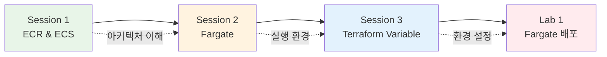

# November Week 2 Day 3: ECS + Fargate + Terraform Variable

<div align="center">

**🐳 ECS** • **🚀 Fargate** • **📦 ECR** • **🔧 Terraform Variable**

*AWS 컨테이너 오케스트레이션과 Terraform 변수 활용*

</div>

---

## 🕘 일일 스케줄

| 시간 | 구분 | 내용 | 비고 |
|------|------|------|------|
| **09:00-09:40** | 📚 이론 1 | [Session 1: ECR & ECS 기초](./session_1.md) | 컨테이너 오케스트레이션 |
| **09:40-10:20** | 📚 이론 2 | [Session 2: Fargate](./session_2.md) | 서버리스 컨테이너 |
| **10:20-10:30** | ☕ 휴식 | 10분 휴식 | |
| **10:30-11:10** | 📚 이론 3 | [Session 3: Terraform Variable](./session_3.md) | 변수 및 환경 관리 |
| **11:10-11:20** | ☕ 휴식 | 10분 휴식 | |
| **11:20-12:20** | 🛠️ 실습 | [Lab 1: ECS Fargate 배포](./lab_1.md) | 컨테이너 배포 |
| **12:20-13:00** | 🍽️ 점심 | 점심시간 | |

---

## 🎯 Day 3 학습 목표

### 📚 이론 목표
- **ECR & ECS**: 컨테이너 레지스트리와 오케스트레이션 이해
- **Fargate**: 서버리스 컨테이너 개념 및 네트워킹
- **Terraform Variable**: 변수 활용 및 환경별 설정 관리

### 🛠️ 실습 목표
- ECR에 Docker 이미지 푸시
- Task Definition 작성
- Fargate Service 배포
- Terraform Variable로 환경 분리

---

## 📖 Session 개요

### Session 1: ECR & ECS 기초 (09:00-09:40)

**핵심 내용**:
- ECR (Elastic Container Registry) 역할
- ECR vs Docker Hub 비교
- ECS 아키텍처 (Cluster, Service, Task, Task Definition)
- EC2 vs Fargate Launch Type 비교

**주요 개념**:
```
Docker 이미지 → ECR (저장)
              ↓
         Task Definition (정의)
              ↓
         ECS Service (실행 & 관리)
              ↓
         Task (실제 컨테이너)
```

**비용**:
- ECR: $0.10/GB/월
- ECS EC2: 인스턴스 비용만
- ECS Fargate: vCPU + 메모리 시간당

**공식 문서**:
- [Amazon ECS란?](https://docs.aws.amazon.com/AmazonECS/latest/developerguide/Welcome.html)
- [Task Definition](https://docs.aws.amazon.com/AmazonECS/latest/developerguide/task_definitions.html)

---

### Session 2: Fargate 서버리스 컨테이너 (09:40-10:20)

**핵심 내용**:
- Fargate 개념 및 장점
- awsvpc 네트워크 모드
- CPU/Memory 조합 선택
- CloudWatch Logs 통합
- Task 실행 역할 (IAM)

**주요 개념**:
```
Fargate Task
├── 독립적인 ENI (네트워크 인터페이스)
├── 전용 CPU/Memory
├── CloudWatch Logs 자동 전송
└── IAM Task Role (AWS 서비스 접근)
```

**네트워킹**:
- awsvpc 모드 (Task마다 ENI)
- Security Group 적용
- Public IP 할당 가능

**공식 문서**:
- [AWS Fargate란?](https://docs.aws.amazon.com/AmazonECS/latest/developerguide/AWS_Fargate.html)
- [Task 네트워킹](https://docs.aws.amazon.com/AmazonECS/latest/developerguide/task-networking.html)

---

### Session 3: Terraform Variable & Output (10:30-11:10)

**핵심 내용**:
- Variable 선언 및 타입
- 변수 값 전달 방법 (CLI, tfvars, 환경변수)
- Output으로 정보 추출
- 환경별 설정 관리 (dev/staging/prod)
- Local Values 활용

**주요 개념**:
```hcl
# Variable 정의
variable "environment" {
  type    = string
  default = "dev"
}

# Variable 사용
resource "aws_instance" "web" {
  instance_type = var.environment == "prod" ? "t3.medium" : "t3.micro"
}

# Output 정의
output "instance_ip" {
  value = aws_instance.web.public_ip
}
```

**환경 분리**:
```
dev.tfvars    → 개발 환경
staging.tfvars → 스테이징 환경
prod.tfvars    → 프로덕션 환경
```

**공식 문서**:
- [Input Variables](https://developer.hashicorp.com/terraform/language/values/variables)
- [Output Values](https://developer.hashicorp.com/terraform/language/values/outputs)

---

## 🛠️ Lab 개요

### Lab 1: ECS Fargate로 컨테이너 배포 (11:20-12:20)

**구축 인프라**:
```
ECR Repository
    ↓
Docker 이미지 푸시
    ↓
ECS Cluster (Fargate)
    ↓
Task Definition
    ↓
Fargate Service (2 Tasks)
    ↓
Application Load Balancer
```

**실습 단계**:
1. ECR Repository 생성
2. Docker 이미지 빌드 및 푸시
3. Task Definition 작성 (Fargate)
4. ECS Cluster 생성
5. Fargate Service 배포
6. ALB 연결 및 테스트
7. CloudWatch Logs 확인
8. 리소스 정리

**사용 기술**:
- ECR (이미지 저장)
- ECS Fargate (컨테이너 실행)
- ALB (로드 밸런싱)
- CloudWatch Logs (로깅)
- Terraform Variable (환경 설정)

**학습 효과**:
- Docker Compose → ECS 마이그레이션 경험
- 서버리스 컨테이너 배포
- 프로덕션급 아키텍처 구성
- Terraform 변수 활용

**예상 비용**: $0.50 (1시간 실습 기준)

---

## 🔗 Session 간 연결

### 전체 흐름



**연결 포인트**:
1. **ECR + ECS**: 컨테이너 저장 및 실행
2. **ECS + Fargate**: 서버리스 실행 환경
3. **Fargate + Terraform**: 인프라 코드화 및 환경 관리

---

## 💡 Day 3 핵심 키워드

### ECS & ECR
- ECR Repository
- Task Definition (JSON)
- ECS Cluster
- ECS Service
- Task (실행 중인 컨테이너)
- Launch Type (EC2 vs Fargate)

### Fargate
- 서버리스 컨테이너
- awsvpc 네트워크 모드
- Task 실행 역할 (IAM)
- CloudWatch Logs
- CPU/Memory 조합

### Terraform
- Variable (입력 변수)
- Output (출력 값)
- tfvars 파일
- 환경별 설정 (dev/prod)
- Local Values

---

## 📊 학습 성과 측정

### ✅ 이론 이해도
- [ ] ECR과 ECS의 역할 구분
- [ ] Task Definition 구조 이해
- [ ] Fargate 네트워킹 방식 파악
- [ ] Terraform 변수 활용 방법 습득

### ✅ 실습 완성도
- [ ] ECR에 이미지 푸시 성공
- [ ] Task Definition 작성 완료
- [ ] Fargate Service 배포 성공
- [ ] ALB 연결 및 접근 확인
- [ ] Terraform Variable 적용

### ✅ 실무 연계
- [ ] Docker Compose → ECS 마이그레이션 이해
- [ ] 서버리스 컨테이너 장점 파악
- [ ] 환경별 인프라 관리 가능
- [ ] 비용 효율적 선택 가능

---

## 🎯 다음 Day 준비

### Day 4 예고: ECS 심화 & 프로덕션 배포
- ECS + ALB 통합
- Auto Scaling 설정
- Blue/Green 배포
- Terraform으로 전체 관리

### 사전 준비
- Day 3 Lab 1 코드 복습
- Docker 이미지 빌드 연습
- Terraform Variable 개념 정리

---

## 📚 참고 자료

### AWS 공식 문서
- [Amazon ECS 개발자 가이드](https://docs.aws.amazon.com/AmazonECS/latest/developerguide/)
- [AWS Fargate 사용자 가이드](https://docs.aws.amazon.com/AmazonECS/latest/userguide/)
- [Amazon ECR 사용자 가이드](https://docs.aws.amazon.com/AmazonECR/latest/userguide/)

### Terraform 공식 문서
- [Input Variables](https://developer.hashicorp.com/terraform/language/values/variables)
- [AWS ECS Resources](https://registry.terraform.io/providers/hashicorp/aws/latest/docs/resources/ecs_cluster)

### 추가 학습
- [ECS Best Practices](https://docs.aws.amazon.com/AmazonECS/latest/bestpracticesguide/)
- [Fargate 요금 계산기](https://aws.amazon.com/fargate/pricing/)

---

<div align="center">

**🐳 ECS** • **🚀 Fargate** • **📦 ECR** • **🔧 Terraform Variable**

*Day 3 완료 - 다음: Day 4 ECS 심화 & 프로덕션 배포*

</div>
