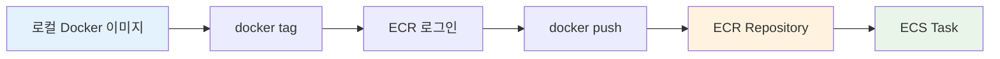
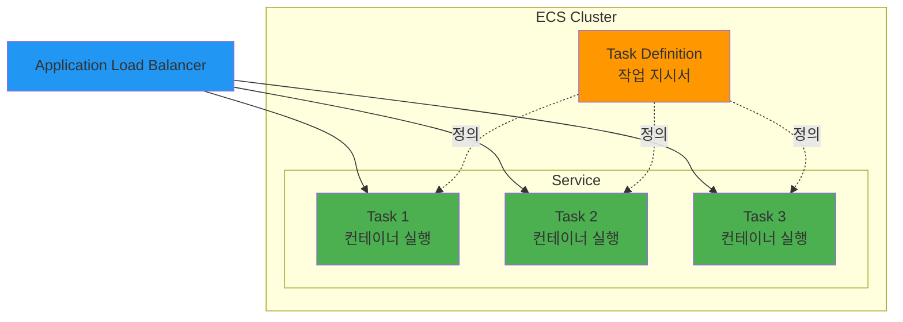
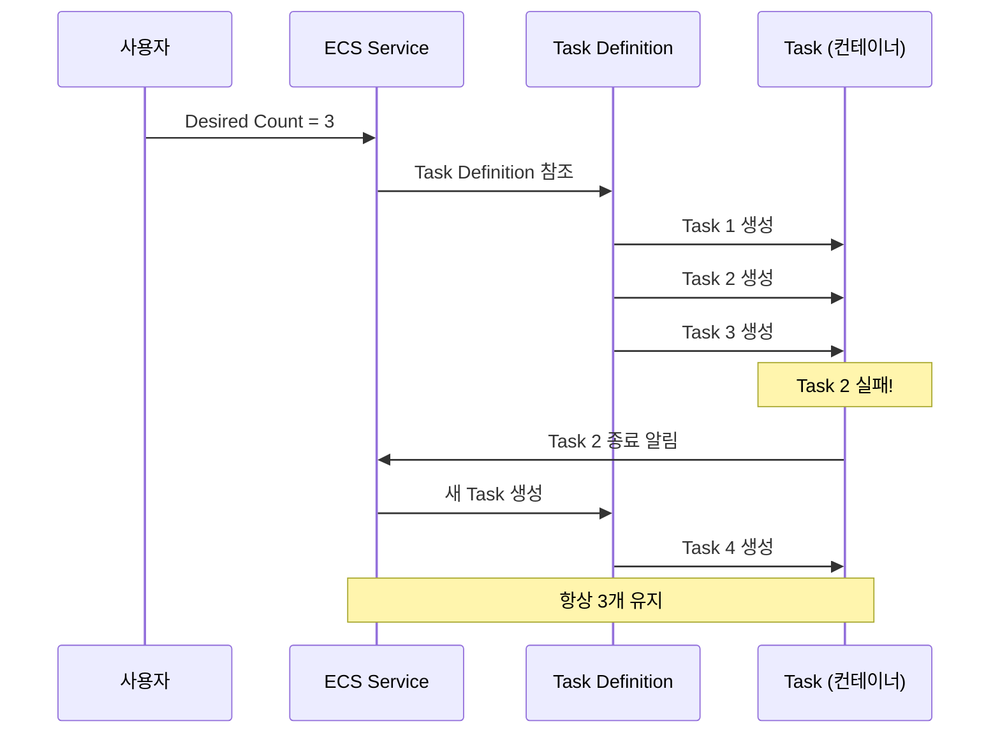
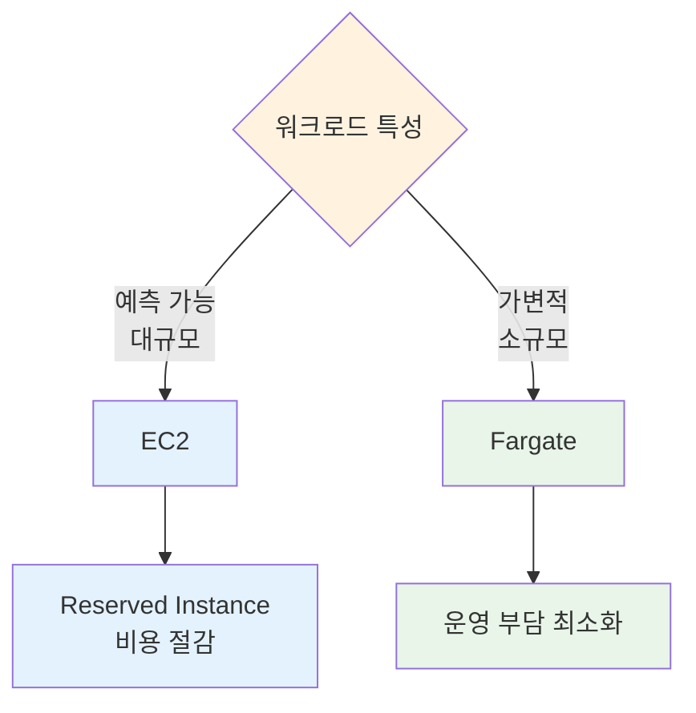

# November Week 2 Day 3 Session 1: ECR & ECS 기초

<div align="center">

**🐳 컨테이너** • **📦 ECR** • **⚙️ ECS** • **🎯 Task Definition**

*AWS 컨테이너 오케스트레이션 서비스 완벽 이해*

</div>

---

## 🕘 Session 정보
**시간**: 09:00-09:40 (40분)
**목표**: ECR과 ECS 기본 개념 이해 및 아키텍처 파악
**방식**: 이론 + AWS 공식 문서 기반 설명

## 🎯 학습 목표

### 📚 이해 목표
- ECR의 역할과 Docker Hub와의 차이 이해
- ECS 아키텍처 (Cluster, Service, Task) 파악
- Task Definition 구조 이해
- EC2 vs Fargate 비교

### 🛠️ 적용 목표
- ECR에 이미지 푸시 방법 습득
- Task Definition 작성 능력
- 적절한 Launch Type 선택

---

## 🤔 왜 필요한가? (5분)

### 💼 실무 시나리오: Docker Compose → AWS 마이그레이션

**문제 상황**:
```
로컬 Docker Compose:
- docker-compose up (단일 서버)
- 확장성 제한
- 고가용성 부족
- 수동 배포

프로덕션 요구사항:
- 자동 확장 (트래픽 증가 시)
- 고가용성 (서버 장애 대응)
- 무중단 배포
- 모니터링 & 로깅
```

**ECS 솔루션**:
```
Docker 이미지 → ECR (저장)
              ↓
         ECS (실행 & 관리)
              ↓
    - 자동 확장 ✅
    - 고가용성 ✅
    - 무중단 배포 ✅
    - CloudWatch 통합 ✅
```

### 🏠 실생활 비유

**물류 센터**:
- **ECR**: 창고 (Docker 이미지 보관)
- **ECS Cluster**: 물류 센터 전체
- **Task Definition**: 작업 지시서 (어떤 컨테이너를 어떻게 실행할지)
- **Task**: 실제 작업 (컨테이너 실행 중)
- **Service**: 작업 관리자 (Task를 계속 유지)

---

## 📖 핵심 개념 (30분)

### 🔍 개념 1: ECR (Elastic Container Registry) (8분)

> **정의** (AWS 공식): Amazon ECR은 완전 관리형 Docker 컨테이너 레지스트리로, 개발자가 Docker 컨테이너 이미지를 쉽게 저장, 관리 및 배포할 수 있게 합니다.

#### ECR vs Docker Hub

| 특징 | ECR | Docker Hub |
|------|-----|------------|
| **위치** | AWS 내부 | 외부 (인터넷) |
| **속도** | 빠름 (같은 리전) | 느림 (인터넷 경유) |
| **보안** | IAM 통합 | 별도 인증 |
| **비용** | 스토리지 + 전송 | 무료 (제한) / 유료 |
| **Private** | 기본 Private | 유료 |
| **ECS 통합** | 네이티브 | 가능 (느림) |

#### ECR 주요 기능

**1. Private Repository**:
```
AWS 계정 내에서만 접근 가능
IAM 정책으로 세밀한 권한 제어
```

**2. 이미지 스캔**:
```
취약점 자동 스캔
CVE 데이터베이스 기반
푸시 시 자동 스캔 가능
```

**3. 수명 주기 정책**:
```
오래된 이미지 자동 삭제
비용 절감
스토리지 관리 자동화
```

#### ECR 사용 흐름



**실제 명령어**:
```bash
# 1. ECR 로그인
aws ecr get-login-password --region ap-northeast-2 | \
  docker login --username AWS --password-stdin \
  123456789012.dkr.ecr.ap-northeast-2.amazonaws.com

# 2. 이미지 태그
docker tag my-app:latest \
  123456789012.dkr.ecr.ap-northeast-2.amazonaws.com/my-app:latest

# 3. 이미지 푸시
docker push \
  123456789012.dkr.ecr.ap-northeast-2.amazonaws.com/my-app:latest
```

### 🔍 개념 2: ECS 아키텍처 (12분)

> **정의** (AWS 공식): Amazon ECS는 완전 관리형 컨테이너 오케스트레이션 서비스로, Docker 컨테이너를 쉽게 실행, 중지 및 관리할 수 있게 합니다.

#### ECS 핵심 구성 요소



**1. Cluster (클러스터)**:
- **역할**: 컨테이너 인스턴스의 논리적 그룹
- **비유**: 물류 센터 전체
- **예시**: `production-cluster`, `dev-cluster`

**2. Task Definition (작업 정의)**:
- **역할**: 컨테이너 실행 방법을 정의하는 JSON 템플릿
- **비유**: 작업 지시서 (어떤 이미지, 얼마나 CPU/메모리)
- **내용**:
  ```json
  {
    "family": "my-app",
    "containerDefinitions": [{
      "name": "web",
      "image": "123456789012.dkr.ecr.ap-northeast-2.amazonaws.com/my-app:latest",
      "cpu": 256,
      "memory": 512,
      "portMappings": [{
        "containerPort": 3000,
        "protocol": "tcp"
      }]
    }]
  }
  ```

**3. Task (작업)**:
- **역할**: Task Definition의 인스턴스 (실제 실행 중인 컨테이너)
- **비유**: 실제 작업 중인 직원
- **생명주기**: 시작 → 실행 → 종료

**4. Service (서비스)**:
- **역할**: 원하는 수의 Task를 유지하고 관리
- **비유**: 작업 관리자 (항상 3명이 일하도록 관리)
- **기능**:
  - Task 개수 유지 (Desired Count)
  - 자동 복구 (Task 실패 시 재시작)
  - 로드 밸런서 통합
  - Auto Scaling

#### ECS 동작 흐름



### 🔍 개념 3: EC2 vs Fargate (10분)

> **AWS 공식**: ECS는 두 가지 Launch Type을 지원합니다 - EC2 (직접 관리)와 Fargate (서버리스).

#### Launch Type 비교

| 특징 | EC2 | Fargate |
|------|-----|---------|
| **서버 관리** | 필요 (EC2 인스턴스) | 불필요 (서버리스) |
| **비용** | 인스턴스 비용 | Task 실행 시간 |
| **확장성** | 수동 (ASG) | 자동 |
| **시작 시간** | 빠름 (인스턴스 준비됨) | 느림 (콜드 스타트) |
| **커스터마이징** | 높음 (OS 접근) | 낮음 (제한적) |
| **적합한 경우** | 대규모, 예측 가능 | 소규모, 가변적 |

#### EC2 Launch Type

**아키텍처**:
```
ECS Cluster
├── EC2 Instance 1 (t3.medium)
│   ├── Task 1 (컨테이너)
│   └── Task 2 (컨테이너)
├── EC2 Instance 2 (t3.medium)
│   ├── Task 3 (컨테이너)
│   └── Task 4 (컨테이너)
```

**장점**:
- ✅ 비용 효율적 (Reserved Instance)
- ✅ 완전한 제어 (OS, 네트워크)
- ✅ GPU, 특수 하드웨어 사용 가능

**단점**:
- ❌ 서버 관리 필요 (패치, 모니터링)
- ❌ 용량 계획 필요
- ❌ 확장 복잡

#### Fargate Launch Type

**아키텍처**:
```
ECS Cluster (서버리스)
├── Task 1 (독립 실행)
├── Task 2 (독립 실행)
├── Task 3 (독립 실행)
└── Task 4 (독립 실행)
```

**장점**:
- ✅ 서버 관리 불필요
- ✅ 자동 확장
- ✅ 빠른 시작 (인프라 준비 불필요)
- ✅ 보안 격리 (Task별 독립)

**단점**:
- ❌ 비용 높음 (소규모는 괜찮음)
- ❌ 제한적 커스터마이징
- ❌ 콜드 스타트 지연

#### 선택 기준



**실무 권장**:
- **Fargate 우선**: 대부분의 경우 (운영 간편)
- **EC2 고려**: 대규모 + 예측 가능 + 비용 민감

---

## 💰 비용 구조 (5분)

### ECR 비용 (ap-northeast-2)

**스토리지**:
```
$0.10/GB/월
예: 10GB 이미지 = $1.00/월
```

**데이터 전송**:
```
같은 리전 ECS → 무료
인터넷 → $0.126/GB (첫 10TB)
```

### ECS 비용

**EC2 Launch Type**:
```
EC2 인스턴스 비용만 발생
ECS 자체는 무료

예: t3.medium 2대
$0.0416/시간 × 2 × 730시간 = $60.74/월
```

**Fargate Launch Type**:
```
vCPU: $0.04656/vCPU/시간
메모리: $0.00511/GB/시간

예: 0.25 vCPU + 0.5GB 메모리
($0.04656 × 0.25 + $0.00511 × 0.5) × 730시간
= $12.20/월 (1개 Task 24/7 실행)
```

### 비용 비교 (월간)

| 시나리오 | EC2 | Fargate |
|---------|-----|---------|
| **소규모** (2 Task) | $60.74 | $24.40 |
| **중규모** (10 Task) | $60.74 | $122.00 |
| **대규모** (50 Task) | $243.00 | $610.00 |

**결론**: 소규모는 Fargate, 대규모는 EC2가 유리

---

## 🔑 핵심 키워드

- **ECR**: Docker 이미지 저장소 (Private, IAM 통합)
- **ECS Cluster**: 컨테이너 인스턴스 그룹
- **Task Definition**: 컨테이너 실행 방법 정의 (JSON)
- **Task**: 실행 중인 컨테이너 인스턴스
- **Service**: Task 개수 유지 및 관리
- **EC2 Launch Type**: 직접 관리 (비용 효율)
- **Fargate Launch Type**: 서버리스 (운영 간편)

---

## 📝 Session 마무리

### ✅ 오늘 Session 성과
- [ ] ECR의 역할과 Docker Hub 차이 이해
- [ ] ECS 아키텍처 (Cluster, Service, Task, Task Definition) 파악
- [ ] EC2 vs Fargate 비교 및 선택 기준 습득
- [ ] 비용 구조 이해

### 🎯 다음 Session 준비
- **Session 2**: Fargate 서버리스 컨테이너 (네트워킹, 로깅)
- **연계**: Task Definition 작성 및 Fargate 배포

### 🔗 공식 문서 (필수)

**⚠️ 학생들이 직접 확인해야 할 공식 문서**:
- 📘 [Amazon ECS란?](https://docs.aws.amazon.com/AmazonECS/latest/developerguide/Welcome.html)
- 📗 [Task Definition 파라미터](https://docs.aws.amazon.com/AmazonECS/latest/developerguide/task_definitions.html)
- 📙 [ECR 사용자 가이드](https://docs.aws.amazon.com/AmazonECR/latest/userguide/)
- 📕 [ECS 요금](https://aws.amazon.com/ecs/pricing/)
- 🆕 [ECS 최신 업데이트](https://aws.amazon.com/ecs/whats-new/)

---

<div align="center">

**🐳 컨테이너** • **📦 ECR** • **⚙️ ECS** • **🎯 Task Definition**

*다음: Session 2 - Fargate 서버리스 컨테이너*

</div>
