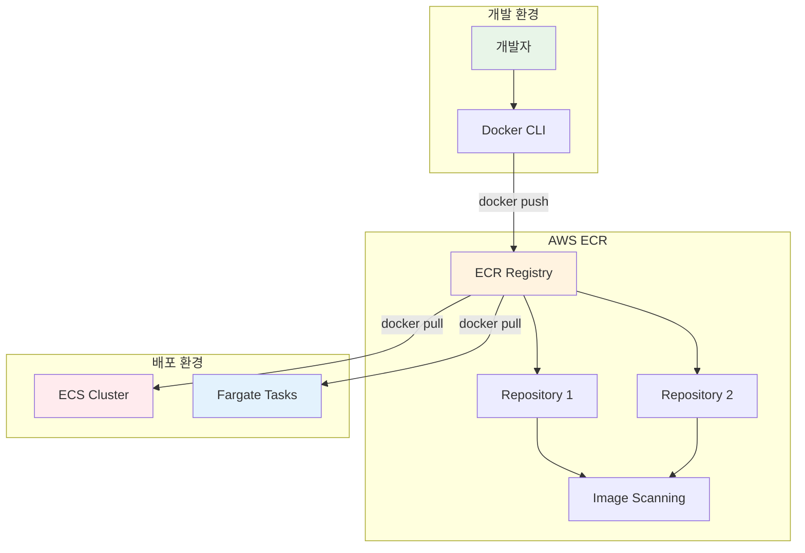
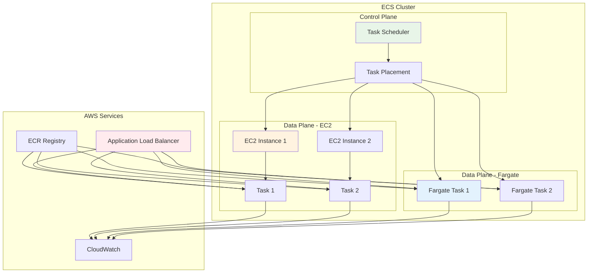

# November Week 2 Day 3 Session 1: ECR & ECS 기초

<div align="center">

**🐳 ECR** • **📦 ECS** • **🔧 컨테이너 오케스트레이션**

*AWS 컨테이너 레지스트리와 오케스트레이션 서비스*

</div>

---

## 🕘 세션 정보
**시간**: 09:00-09:40 (40분)
**목표**: ECR과 ECS의 기본 개념 및 아키텍처 이해
**방식**: 이론 강의 + 실습 예제

## 🎯 학습 목표
- ECR(Elastic Container Registry)의 역할과 Docker Hub와의 차이점 이해
- ECS(Elastic Container Service)의 컨테이너 오케스트레이션 개념 파악
- Task Definition, Service, Cluster의 관계 이해

---

## 📖 서비스 개요

### 1. 생성 배경 (Why?) - 5분

**문제 상황**:
- **Docker Hub 의존성**: 공개 레지스트리 사용 시 보안 및 속도 문제
- **컨테이너 관리 복잡성**: 수십~수백 개 컨테이너를 수동으로 관리하기 어려움
- **확장성 한계**: Docker Compose는 단일 호스트에서만 동작
- **고가용성 부족**: 컨테이너 장애 시 자동 복구 메커니즘 부재

**AWS 솔루션**:
- **ECR**: AWS 통합 프라이빗 컨테이너 레지스트리
  - IAM 기반 접근 제어
  - 이미지 스캔 및 암호화
  - 리전 간 복제 지원
  
- **ECS**: 완전 관리형 컨테이너 오케스트레이션
  - 자동 스케일링 및 로드 밸런싱
  - AWS 서비스와 긴밀한 통합
  - Fargate로 서버리스 실행 가능

### 2. 핵심 원리 (How?) - 10분

**ECR 아키텍처**:


**ECS 아키텍처**:


**핵심 구성 요소**:

**ECR**:
- **Registry**: AWS 계정당 하나의 기본 레지스트리
- **Repository**: 이미지를 저장하는 논리적 단위
- **Image**: 특정 태그가 붙은 컨테이너 이미지
- **Lifecycle Policy**: 오래된 이미지 자동 삭제

**ECS**:
- **Cluster**: 컨테이너 실행 환경의 논리적 그룹
- **Task Definition**: 컨테이너 실행 명세 (JSON)
- **Task**: Task Definition의 실행 인스턴스
- **Service**: Task의 원하는 개수를 유지하는 관리 단위

### 3. 주요 사용 사례 (When?) - 5분

**적합한 경우**:

**ECR 사용 시나리오**:
- **프라이빗 이미지 관리**: 회사 내부 애플리케이션 이미지
- **멀티 리전 배포**: 리전 간 이미지 복제로 글로벌 서비스
- **보안 스캔 필요**: 취약점 자동 스캔 및 알림
- **CI/CD 통합**: CodePipeline, Jenkins와 통합

**ECS 사용 시나리오**:
- **마이크로서비스 아키텍처**: 여러 서비스를 독립적으로 배포
- **배치 작업**: 정기적인 데이터 처리 작업
- **웹 애플리케이션**: ALB와 통합하여 고가용성 웹 서비스
- **하이브리드 워크로드**: EC2와 Fargate 혼합 사용

**실제 사례**:
- **Netflix**: 수천 개의 마이크로서비스를 ECS로 운영
- **Expedia**: 여행 예약 시스템의 컨테이너화
- **Samsung**: 글로벌 서비스의 멀티 리전 배포

### 4. 비슷한 서비스 비교 (Which?) - 5분

**AWS 내 대안 서비스**:

**ECR vs Docker Hub**:
- **언제 Docker Hub 사용**: 
  - 오픈소스 프로젝트
  - 공개 이미지 공유
  - 무료 티어로 충분한 경우
  
- **언제 ECR 사용**:
  - 프라이빗 이미지 필요
  - AWS 서비스와 통합
  - 보안 스캔 및 암호화 필요

**ECS vs EKS vs Fargate**:
- **언제 ECS 사용**:
  - AWS 네이티브 솔루션 선호
  - 간단한 컨테이너 오케스트레이션
  - AWS 서비스와 긴밀한 통합
  
- **언제 EKS 사용**:
  - Kubernetes 표준 필요
  - 멀티 클라우드 전략
  - 복잡한 오케스트레이션 요구
  
- **언제 Fargate 사용**:
  - 서버 관리 불필요
  - 간헐적 워크로드
  - 빠른 시작 필요

**선택 기준**:
| 기준 | ECR | Docker Hub | ECS | EKS | Fargate |
|------|-----|------------|-----|-----|---------|
| **비용** | 스토리지 기반 | 무료/유료 | EC2 비용 | EC2 + 관리 비용 | 사용량 기반 |
| **보안** | IAM 통합 | 제한적 | 높음 | 높음 | 매우 높음 |
| **관리 복잡도** | 낮음 | 매우 낮음 | 중간 | 높음 | 매우 낮음 |
| **AWS 통합** | 완벽 | 없음 | 완벽 | 좋음 | 완벽 |
| **표준 준수** | OCI | Docker | AWS 전용 | Kubernetes | AWS 전용 |

### 5. 장단점 분석 - 3분

**ECR 장점**:
- ✅ AWS 서비스와 완벽한 통합 (IAM, CloudWatch)
- ✅ 자동 이미지 스캔 및 취약점 탐지
- ✅ 리전 간 자동 복제
- ✅ 암호화 (전송 중/저장 시)

**ECR 단점/제약사항**:
- ⚠️ AWS 종속성 (멀티 클라우드 어려움)
- ⚠️ Docker Hub보다 비용 높을 수 있음
- ⚠️ 리전당 별도 레지스트리 필요

**ECS 장점**:
- ✅ 완전 관리형 서비스 (인프라 관리 불필요)
- ✅ AWS 서비스와 긴밀한 통합
- ✅ Fargate로 서버리스 실행 가능
- ✅ 빠른 학습 곡선 (Kubernetes보다 간단)

**ECS 단점/제약사항**:
- ⚠️ AWS 종속성 (이식성 낮음)
- ⚠️ Kubernetes만큼 유연하지 않음
- ⚠️ 커뮤니티 생태계 작음

**대안**:
- **멀티 클라우드**: EKS 또는 자체 Kubernetes 클러스터
- **간단한 워크로드**: Lambda 또는 Elastic Beanstalk

### 6. 비용 구조 💰 - 5분

**ECR 과금 방식**:
- **스토리지**: $0.10/GB/월 (ap-northeast-2)
- **데이터 전송**:
  - 인터넷으로 전송: $0.126/GB (첫 10TB)
  - 같은 리전 내: 무료
  - 다른 리전으로: $0.02/GB

**프리티어 혜택**:
- **ECR**: 프리티어 없음 (사용한 만큼 과금)
- **ECS**: 컨트롤 플레인 무료 (EC2/Fargate 비용만 발생)

**비용 최적화 팁**:
1. **Lifecycle Policy 활용**: 오래된 이미지 자동 삭제
   ```json
   {
     "rules": [{
       "rulePriority": 1,
       "description": "Keep last 10 images",
       "selection": {
         "tagStatus": "any",
         "countType": "imageCountMoreThan",
         "countNumber": 10
       },
       "action": { "type": "expire" }
     }]
   }
   ```

2. **이미지 크기 최적화**: 멀티 스테이지 빌드 사용
3. **리전 선택**: 주 사용 리전에 이미지 배치
4. **압축 활용**: 이미지 레이어 압축

**예상 비용 (ap-northeast-2)**:
| 항목 | 사용량 | 단가 | 월간 비용 |
|------|--------|------|-----------|
| **ECR 스토리지** | 10GB | $0.10/GB | $1.00 |
| **데이터 전송 (인터넷)** | 100GB | $0.126/GB | $12.60 |
| **ECS 컨트롤 플레인** | - | 무료 | $0 |
| **Fargate vCPU** | 0.25 vCPU × 730시간 | $0.04048/vCPU/시간 | $7.39 |
| **Fargate 메모리** | 0.5GB × 730시간 | $0.004445/GB/시간 | $1.62 |
| **합계** | | | **$22.61** |

**Lab 예상 비용**:
- ECR 이미지 저장 (1GB): $0.10/월
- Fargate Task (1시간): $0.05
- 합계: ~$0.15 (1시간 실습 기준)

### 7. 최신 업데이트 🆕 - 2분

**2025년 주요 변경사항**:
- **ECS Managed Instances** (2025.09): EC2 인스턴스 자동 프로비저닝 및 관리
  - 최적의 인스턴스 타입 자동 선택
  - 14일마다 자동 보안 패치
  - 동적 스케일링 및 비용 최적화
  
- **Linear & Canary Deployments** (2025.10): 내장 배포 전략 지원
  - 트래픽 점진적 전환
  - CloudWatch 알람 기반 자동 롤백
  - 무중단 배포 강화

- **ECR 이미지 제한 증가** (2025.08): 리포지토리당 20,000 → 100,000 이미지

**2026년 예정**:
- ECS Service Connect 고도화
- 더 많은 Graviton 프로세서 지원

**Deprecated 기능**:
- EC2-Classic 지원 종료 (2022년 완료)

**참조**: [AWS ECS What's New](https://aws.amazon.com/ecs/whats-new/)

### 8. 잘 사용하는 방법 ✅ - 3분

**베스트 프랙티스**:
1. **IAM 역할 사용**: Access Key 대신 Task Role 사용
2. **이미지 태깅 전략**: 
   - `latest` 태그 사용 지양
   - Git commit SHA 또는 버전 번호 사용
3. **Health Check 설정**: ALB와 ECS 모두 설정
4. **로그 중앙화**: CloudWatch Logs 또는 Firelens 사용
5. **리소스 제한**: CPU/메모리 limits 명시

**실무 팁**:
- **ECR 이미지 스캔**: 푸시 시 자동 스캔 활성화
  ```bash
  aws ecr put-image-scanning-configuration \
    --repository-name my-repo \
    --image-scanning-configuration scanOnPush=true
  ```

- **ECS Exec 활용**: 실행 중인 컨테이너 디버깅
  ```bash
  aws ecs execute-command \
    --cluster my-cluster \
    --task task-id \
    --container my-container \
    --interactive \
    --command "/bin/bash"
  ```

- **Capacity Provider 전략**: EC2와 Fargate 혼합 사용
  ```json
  {
    "capacityProviders": ["FARGATE", "FARGATE_SPOT"],
    "defaultCapacityProviderStrategy": [
      {"capacityProvider": "FARGATE_SPOT", "weight": 4},
      {"capacityProvider": "FARGATE", "weight": 1}
    ]
  }
  ```

**성능 최적화**:
- **이미지 크기 최소화**: Alpine Linux 기반 이미지 사용
- **레이어 캐싱**: 자주 변경되지 않는 레이어를 먼저 배치
- **Fargate 플랫폼 버전**: 최신 버전 사용 (성능 개선)

### 9. 잘못 사용하는 방법 ❌ - 3분

**흔한 실수**:
1. **Root 사용자로 컨테이너 실행**: 보안 취약점
   ```dockerfile
   # ❌ 잘못된 방법
   FROM node:18
   COPY . /app
   CMD ["node", "server.js"]
   
   # ✅ 올바른 방법
   FROM node:18
   RUN useradd -m appuser
   USER appuser
   COPY . /app
   CMD ["node", "server.js"]
   ```

2. **시크릿 하드코딩**: 환경 변수에 직접 입력
   ```json
   // ❌ 잘못된 방법
   {
     "environment": [
       {"name": "DB_PASSWORD", "value": "mypassword123"}
     ]
   }
   
   // ✅ 올바른 방법
   {
     "secrets": [
       {
         "name": "DB_PASSWORD",
         "valueFrom": "arn:aws:secretsmanager:region:account:secret:db-password"
       }
     ]
   }
   ```

3. **Health Check 미설정**: 장애 감지 불가
4. **로그 미수집**: 문제 발생 시 디버깅 어려움
5. **리소스 제한 없음**: 메모리 부족으로 다른 Task 영향

**안티 패턴**:
- **단일 AZ 배포**: 고가용성 부족
- **과도한 Task 크기**: 작은 Task 여러 개가 더 효율적
- **이미지 버전 관리 부재**: `latest` 태그만 사용

**보안 취약점**:
- **Public ECR 사용**: 민감한 이미지는 Private 사용
- **IAM 권한 과다**: 최소 권한 원칙 위반
- **네트워크 격리 부족**: Public Subnet에 민감한 Task 배치

### 10. 구성 요소 상세 - 5분

**ECR 주요 구성 요소**:

**1. Registry**:
- **역할**: AWS 계정당 하나의 기본 레지스트리
- **URI 형식**: `{account-id}.dkr.ecr.{region}.amazonaws.com`
- **인증**: `aws ecr get-login-password` 명령어 사용

**2. Repository**:
- **역할**: 이미지를 저장하는 논리적 단위
- **타입**: Private (기본), Public
- **설정 옵션**:
  - Image scanning (푸시 시 자동 스캔)
  - Encryption (AES-256 또는 KMS)
  - Lifecycle policy (이미지 자동 삭제)

**3. Image**:
- **역할**: 특정 태그가 붙은 컨테이너 이미지
- **태그 전략**:
  - Semantic versioning: `v1.2.3`
  - Git commit SHA: `abc123f`
  - 환경별: `prod-v1.2.3`, `dev-latest`

**ECS 주요 구성 요소**:

**1. Cluster**:
- **역할**: 컨테이너 실행 환경의 논리적 그룹
- **타입**:
  - EC2: 직접 관리하는 EC2 인스턴스
  - Fargate: 서버리스 실행
  - External: 온프레미스 서버

**2. Task Definition**:
- **역할**: 컨테이너 실행 명세 (JSON)
- **주요 설정**:
  ```json
  {
    "family": "my-app",
    "networkMode": "awsvpc",
    "requiresCompatibilities": ["FARGATE"],
    "cpu": "256",
    "memory": "512",
    "containerDefinitions": [{
      "name": "app",
      "image": "123456789012.dkr.ecr.ap-northeast-2.amazonaws.com/my-app:v1",
      "portMappings": [{"containerPort": 80}],
      "logConfiguration": {
        "logDriver": "awslogs",
        "options": {
          "awslogs-group": "/ecs/my-app",
          "awslogs-region": "ap-northeast-2",
          "awslogs-stream-prefix": "ecs"
        }
      }
    }]
  }
  ```

**3. Service**:
- **역할**: Task의 원하는 개수를 유지
- **배포 전략**:
  - Rolling update (기본)
  - Blue/Green (CodeDeploy 사용)
  - Linear/Canary (2025년 신규)
- **Auto Scaling**: Target tracking, Step scaling

**4. Task**:
- **역할**: Task Definition의 실행 인스턴스
- **생명주기**: PENDING → RUNNING → STOPPED
- **네트워킹**: awsvpc 모드 (ENI 할당)

**의존성**:
- **ECR → ECS**: Task Definition에서 ECR 이미지 참조
- **VPC → ECS**: awsvpc 모드에서 Subnet 필요
- **IAM → ECS**: Task Role, Execution Role 필요
- **ALB → ECS**: Service에 Target Group 연결

### 11. 공식 문서 링크 (필수 5개)

**⚠️ 학생들이 직접 확인해야 할 공식 문서**:
- 📘 [ECR이란 무엇인가?](https://docs.aws.amazon.com/AmazonECR/latest/userguide/what-is-ecr.html)
- 📗 [ECS 사용자 가이드](https://docs.aws.amazon.com/AmazonECS/latest/developerguide/)
- 📙 [ECS API 레퍼런스](https://docs.aws.amazon.com/AmazonECS/latest/APIReference/)
- 📕 [ECR 요금](https://aws.amazon.com/ecr/pricing/) | [ECS 요금](https://aws.amazon.com/ecs/pricing/)
- 🆕 [ECS 최신 업데이트](https://aws.amazon.com/ecs/whats-new/)

---

## 💭 함께 생각해보기

### 🤝 페어 토론 (5분)
**토론 주제**:
1. **Docker Compose vs ECS**: 어떤 상황에서 ECS로 마이그레이션해야 할까요?
2. **ECR vs Docker Hub**: 프라이빗 레지스트리의 장점은 무엇일까요?
3. **비용 최적화**: ECR 스토리지 비용을 줄이는 방법은?

**페어 활동 가이드**:
- 👥 **자유 페어링**: 관심사가 비슷한 사람끼리
- 🔄 **역할 교대**: 5분씩 설명자/질문자 역할 바꾸기
- 📝 **핵심 정리**: 대화 내용 중 중요한 점 메모하기

### 🎯 전체 공유 (3분)
- **인사이트 공유**: 페어 토론에서 나온 좋은 아이디어
- **질문 수집**: 아직 이해가 어려운 부분
- **다음 연결**: Session 2 (Fargate)와의 연결고리

### 💡 이해도 체크 질문
- ✅ "ECR과 Docker Hub의 차이점을 설명할 수 있나요?"
- ✅ "ECS의 Task와 Service의 관계를 이해했나요?"
- ✅ "Fargate가 무엇인지 예상할 수 있나요?"

---

## 🔑 핵심 키워드

- **ECR (Elastic Container Registry)**: AWS 관리형 컨테이너 레지스트리
- **ECS (Elastic Container Service)**: AWS 컨테이너 오케스트레이션 서비스
- **Task Definition**: 컨테이너 실행 명세 (JSON)
- **Task**: Task Definition의 실행 인스턴스
- **Service**: Task의 원하는 개수를 유지하는 관리 단위
- **Cluster**: 컨테이너 실행 환경의 논리적 그룹
- **Fargate**: 서버리스 컨테이너 실행 엔진 (Session 2에서 상세 학습)

---

## 📝 세션 마무리

### ✅ 오늘 세션 성과
- [ ] ECR의 역할과 Docker Hub와의 차이점 이해
- [ ] ECS의 기본 아키텍처 파악
- [ ] Task Definition, Service, Cluster의 관계 이해
- [ ] 비용 구조 및 최적화 방법 학습

### 🎯 다음 세션 준비
- **Session 2: Fargate** - 서버리스 컨테이너 실행
- **연계 내용**: ECS에서 Fargate를 사용하는 방법
- **사전 학습**: Fargate가 EC2 기반 ECS와 어떻게 다른지 생각해보기

---

<div align="center">

**🐳 ECR로 이미지 관리** • **📦 ECS로 컨테이너 오케스트레이션** • **🚀 다음은 Fargate**

*Session 2에서 서버리스 컨테이너 실행을 배웁니다*

</div>
