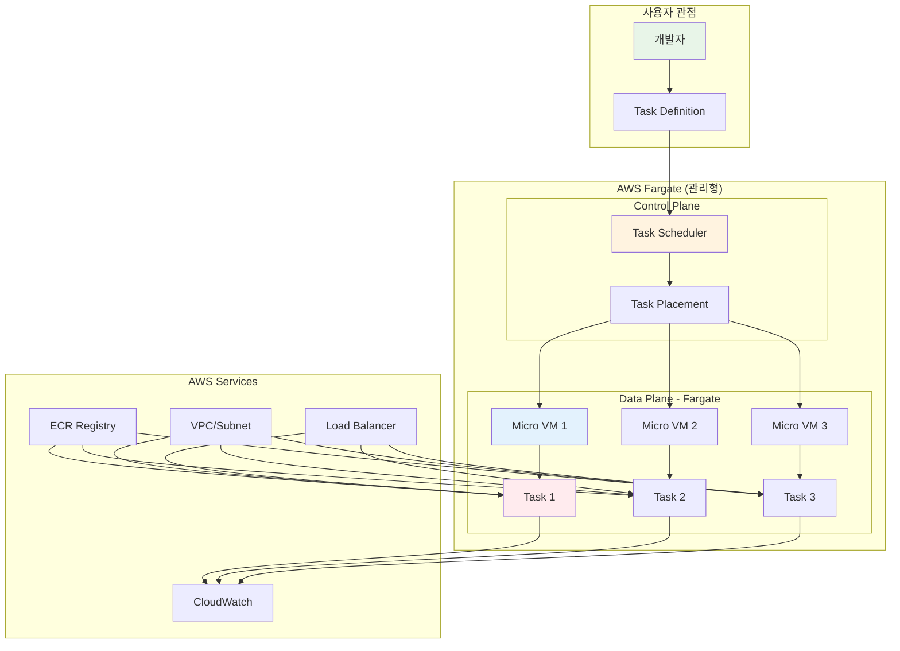
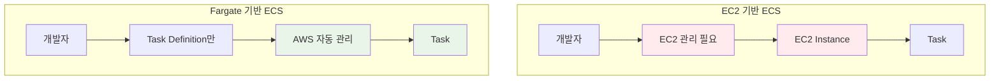

# November Week 2 Day 3 Session 2: Fargate

<div align="center">

**🚀 Fargate** • **☁️ 서버리스** • **🔧 관리 불필요**

*서버 관리 없이 컨테이너 실행하기*

</div>

---

## 🕘 세션 정보
**시간**: 09:40-10:20 (40분)
**목표**: Fargate의 서버리스 컨테이너 실행 개념 이해
**방식**: 이론 강의 + EC2 기반 ECS와 비교

## 🎯 학습 목표
- Fargate의 서버리스 컨테이너 실행 원리 이해
- EC2 기반 ECS와 Fargate의 차이점 파악
- Fargate의 비용 구조 및 최적화 방법 학습

---

## 📖 서비스 개요

### 1. 생성 배경 (Why?) - 5분

**문제 상황**:
- **EC2 관리 부담**: 인스턴스 프로비저닝, 패치, 스케일링 관리
- **리소스 낭비**: 컨테이너가 적게 실행될 때도 EC2 비용 발생
- **복잡한 용량 계획**: 얼마나 많은 EC2 인스턴스가 필요한지 예측 어려움
- **보안 패치 지연**: 수동 패치로 인한 보안 취약점

**AWS Fargate 솔루션**:
- **완전 서버리스**: EC2 인스턴스 관리 불필요
- **사용량 기반 과금**: 실제 사용한 vCPU와 메모리만 과금
- **자동 스케일링**: Task 수에 따라 자동으로 용량 조정
- **보안 강화**: Task 간 완전한 격리 (각 Task가 독립적인 커널)

### 2. 핵심 원리 (How?) - 10분

**Fargate 아키텍처**:


**EC2 vs Fargate 비교**:


**핵심 작동 원리**:

**1. Task 실행 요청**:
```json
{
  "launchType": "FARGATE",
  "taskDefinition": "my-app:1",
  "count": 3,
  "networkConfiguration": {
    "awsvpcConfiguration": {
      "subnets": ["subnet-abc123"],
      "securityGroups": ["sg-xyz789"],
      "assignPublicIp": "ENABLED"
    }
  }
}
```

**2. Fargate가 자동으로 처리**:
- Micro VM 프로비저닝
- ENI (Elastic Network Interface) 할당
- ECR에서 이미지 Pull
- Task 시작 및 모니터링

**3. Task 격리**:
- 각 Task는 독립적인 Micro VM에서 실행
- 커널 수준 격리 (EC2보다 강력한 보안)
- 다른 Task와 리소스 공유 없음

### 3. 주요 사용 사례 (When?) - 5분

**적합한 경우**:

**Fargate 사용 시나리오**:
- **간헐적 워크로드**: 배치 작업, 스케줄 작업
- **빠른 시작**: 프로토타입, MVP 개발
- **마이크로서비스**: 작은 서비스 여러 개
- **이벤트 기반**: Lambda처럼 필요할 때만 실행
- **보안 중요**: Task 간 완전한 격리 필요

**EC2 사용 시나리오**:
- **지속적 워크로드**: 24/7 실행되는 서비스
- **GPU 필요**: 머신러닝, 비디오 처리
- **특수 인스턴스 타입**: 메모리 최적화, 스토리지 최적화
- **비용 최적화**: Reserved Instance, Savings Plans 활용

**실제 사례**:
- **Samsung**: 이벤트 기반 이미지 처리 (Fargate)
- **Expedia**: 여행 검색 API (Fargate)
- **Coca-Cola**: 배치 데이터 처리 (Fargate)

### 4. 비슷한 서비스 비교 (Which?) - 5분

**AWS 내 대안 서비스**:

**Fargate vs Lambda**:
- **언제 Lambda 사용**:
  - 실행 시간 < 15분
  - 이벤트 기반 트리거
  - 상태 비저장 (Stateless)
  
- **언제 Fargate 사용**:
  - 실행 시간 > 15분
  - 컨테이너 이미지 사용
  - 상태 저장 (Stateful) 가능

**Fargate vs EC2 ECS**:
- **언제 EC2 ECS 사용**:
  - 지속적 워크로드 (24/7)
  - GPU 또는 특수 인스턴스 필요
  - Reserved Instance로 비용 절감
  
- **언제 Fargate 사용**:
  - 간헐적 워크로드
  - 관리 부담 최소화
  - 빠른 시작 필요

**Fargate vs EKS on Fargate**:
- **언제 ECS Fargate 사용**:
  - AWS 네이티브 솔루션 선호
  - 간단한 컨테이너 오케스트레이션
  
- **언제 EKS Fargate 사용**:
  - Kubernetes 표준 필요
  - 복잡한 오케스트레이션

**선택 기준**:
| 기준 | Fargate | Lambda | EC2 ECS | EKS Fargate |
|------|---------|--------|---------|-------------|
| **비용** | 사용량 기반 | 매우 저렴 | 지속 워크로드 저렴 | 사용량 기반 |
| **시작 시간** | 30-60초 | 밀리초 | 분 단위 | 30-60초 |
| **실행 시간** | 무제한 | 최대 15분 | 무제한 | 무제한 |
| **관리 복잡도** | 매우 낮음 | 매우 낮음 | 높음 | 중간 |
| **유연성** | 높음 | 낮음 | 매우 높음 | 매우 높음 |

### 5. 장단점 분석 - 3분

**Fargate 장점**:
- ✅ 서버 관리 불필요 (패치, 스케일링 자동)
- ✅ 사용량 기반 과금 (유휴 시간 비용 없음)
- ✅ 빠른 시작 (인프라 프로비저닝 불필요)
- ✅ 강력한 보안 (Task 간 커널 수준 격리)
- ✅ 자동 스케일링 (Task 수에 따라)

**Fargate 단점/제약사항**:
- ⚠️ EC2보다 비용 높을 수 있음 (지속 워크로드)
- ⚠️ GPU 미지원
- ⚠️ 특수 인스턴스 타입 사용 불가
- ⚠️ EBS 볼륨 제한적 (20GB 임시 스토리지)
- ⚠️ 시작 시간 (30-60초, Lambda보다 느림)

**대안**:
- **지속 워크로드**: EC2 ECS + Reserved Instance
- **GPU 필요**: EC2 ECS + GPU 인스턴스
- **초단기 실행**: Lambda

### 6. 비용 구조 💰 - 5분

**Fargate 과금 방식**:
- **vCPU**: $0.04048/vCPU/시간 (ap-northeast-2)
- **메모리**: $0.004445/GB/시간 (ap-northeast-2)
- **최소 과금**: 1분 (이후 초 단위)

**프리티어 혜택**:
- **없음**: Fargate는 프리티어 미제공
- **ECS 컨트롤 플레인**: 무료

**비용 최적화 팁**:
1. **Fargate Spot 사용**: 최대 70% 할인
   ```json
   {
     "capacityProviderStrategy": [
       {
         "capacityProvider": "FARGATE_SPOT",
         "weight": 4,
         "base": 0
       },
       {
         "capacityProvider": "FARGATE",
         "weight": 1,
         "base": 2
       }
     ]
   }
   ```

2. **적절한 리소스 크기**: 과도한 vCPU/메모리 할당 방지
3. **Graviton 프로세서**: 20% 비용 절감 + 40% 성능 향상
4. **Compute Savings Plans**: 1-3년 약정으로 최대 50% 할인

**예상 비용 (ap-northeast-2)**:
| 구성 | vCPU | 메모리 | 시간당 | 월간 (730시간) |
|------|------|--------|--------|----------------|
| **소형** | 0.25 | 0.5GB | $0.012 | $8.76 |
| **중형** | 0.5 | 1GB | $0.025 | $18.25 |
| **대형** | 1 | 2GB | $0.049 | $35.77 |
| **초대형** | 2 | 4GB | $0.099 | $72.27 |

**EC2 vs Fargate 비용 비교**:
| 시나리오 | EC2 (t3.small) | Fargate (0.5 vCPU, 1GB) | 차이 |
|----------|----------------|-------------------------|------|
| **24/7 실행** | $15.18/월 | $18.25/월 | Fargate 20% 비싸 |
| **8시간/일** | $15.18/월 (고정) | $6.08/월 | Fargate 60% 저렴 |
| **간헐적 (100시간/월)** | $15.18/월 (고정) | $2.50/월 | Fargate 84% 저렴 |

**Lab 예상 비용**:
- Fargate Task (0.25 vCPU, 0.5GB, 1시간): $0.012
- ECR 이미지 Pull: 무료 (같은 리전)
- 합계: ~$0.01 (1시간 실습 기준)

### 7. 최신 업데이트 🆕 - 2분

**2025년 주요 변경사항**:
- **Graviton3 프로세서 지원**: 40% 성능 향상, 20% 비용 절감
- **EBS 볼륨 지원 확대**: 최대 200GB까지 확장 가능
- **Fargate Spot 개선**: 중단 알림 2분 → 5분으로 증가

**2024년 주요 변경사항**:
- **Arm 기반 워크로드 지원**: Graviton 프로세서
- **EBS 볼륨 지원**: 상태 저장 워크로드 가능
- **더 큰 Task 크기**: 최대 16 vCPU, 120GB 메모리

**2026년 예정**:
- Fargate 시작 시간 단축 (30초 → 10초 목표)
- 더 많은 리전 확대

**Deprecated 기능**:
- Windows 컨테이너 미지원 (EC2 ECS만 가능)

**참조**: [AWS Fargate What's New](https://aws.amazon.com/fargate/whats-new/)

### 8. 잘 사용하는 방법 ✅ - 3분

**베스트 프랙티스**:
1. **적절한 리소스 크기**: 실제 사용량 모니터링 후 조정
2. **Fargate Spot 활용**: 중단 가능한 워크로드에 사용
3. **Graviton 프로세서**: ARM64 이미지 사용
4. **네트워크 최적화**: VPC Endpoint로 ECR 접근 (데이터 전송 비용 절감)
5. **로그 최적화**: 불필요한 로그 줄이기

**실무 팁**:
- **Task 크기 최적화**:
  ```bash
  # CloudWatch Container Insights로 실제 사용량 확인
  aws cloudwatch get-metric-statistics \
    --namespace AWS/ECS \
    --metric-name CPUUtilization \
    --dimensions Name=ServiceName,Value=my-service \
    --start-time 2025-11-01T00:00:00Z \
    --end-time 2025-11-07T23:59:59Z \
    --period 3600 \
    --statistics Average
  ```

- **Fargate Spot 사용**:
  ```json
  {
    "capacityProviderStrategy": [
      {
        "capacityProvider": "FARGATE_SPOT",
        "weight": 4
      },
      {
        "capacityProvider": "FARGATE",
        "weight": 1,
        "base": 2
      }
    ]
  }
  ```
  - `base: 2`: 최소 2개는 일반 Fargate 사용 (안정성)
  - `weight: 4`: 나머지는 Spot 우선 사용 (비용 절감)

- **Graviton 프로세서**:
  ```json
  {
    "runtimePlatform": {
      "cpuArchitecture": "ARM64",
      "operatingSystemFamily": "LINUX"
    }
  }
  ```

**성능 최적화**:
- **이미지 크기 최소화**: 멀티 스테이지 빌드
- **레이어 캐싱**: 자주 변경되지 않는 레이어 먼저
- **플랫폼 버전**: 최신 버전 사용 (1.4.0 이상)

### 9. 잘못 사용하는 방법 ❌ - 3분

**흔한 실수**:
1. **과도한 리소스 할당**: 필요 이상의 vCPU/메모리
   ```json
   // ❌ 잘못된 방법 (과도한 할당)
   {
     "cpu": "4096",
     "memory": "8192"
   }
   
   // ✅ 올바른 방법 (실제 사용량 기반)
   {
     "cpu": "256",
     "memory": "512"
   }
   ```

2. **24/7 워크로드에 Fargate 사용**: EC2가 더 저렴
3. **GPU 워크로드**: Fargate는 GPU 미지원
4. **대용량 데이터 처리**: 임시 스토리지 20GB 제한
5. **Windows 컨테이너**: Fargate는 Linux만 지원

**안티 패턴**:
- **단일 Task에 모든 서비스**: 마이크로서비스 원칙 위반
- **Fargate Spot만 사용**: 중단 시 서비스 장애
- **로그 미수집**: CloudWatch Logs 설정 필수

**보안 취약점**:
- **Public IP 할당**: 불필요한 경우 비활성화
  ```json
  {
    "networkConfiguration": {
      "awsvpcConfiguration": {
        "assignPublicIp": "DISABLED"  // Private Subnet 사용
      }
    }
  }
  ```
- **IAM 권한 과다**: Task Role 최소 권한 원칙
- **시크릿 하드코딩**: Secrets Manager 사용

### 10. 구성 요소 상세 - 5분

**Fargate 주요 구성 요소**:

**1. Task Definition (Fargate 전용 설정)**:
```json
{
  "family": "my-fargate-app",
  "networkMode": "awsvpc",  // Fargate는 awsvpc만 지원
  "requiresCompatibilities": ["FARGATE"],
  "cpu": "256",  // 0.25 vCPU
  "memory": "512",  // 0.5 GB
  "runtimePlatform": {
    "cpuArchitecture": "ARM64",  // Graviton 프로세서
    "operatingSystemFamily": "LINUX"
  },
  "containerDefinitions": [{
    "name": "app",
    "image": "123456789012.dkr.ecr.ap-northeast-2.amazonaws.com/my-app:v1",
    "portMappings": [{
      "containerPort": 80,
      "protocol": "tcp"
    }],
    "logConfiguration": {
      "logDriver": "awslogs",
      "options": {
        "awslogs-group": "/ecs/my-fargate-app",
        "awslogs-region": "ap-northeast-2",
        "awslogs-stream-prefix": "fargate"
      }
    },
    "secrets": [{
      "name": "DB_PASSWORD",
      "valueFrom": "arn:aws:secretsmanager:ap-northeast-2:123456789012:secret:db-password"
    }]
  }],
  "executionRoleArn": "arn:aws:iam::123456789012:role/ecsTaskExecutionRole",
  "taskRoleArn": "arn:aws:iam::123456789012:role/ecsTaskRole"
}
```

**2. CPU/메모리 조합**:
| vCPU | 메모리 (GB) |
|------|-------------|
| 0.25 | 0.5, 1, 2 |
| 0.5 | 1, 2, 3, 4 |
| 1 | 2, 3, 4, 5, 6, 7, 8 |
| 2 | 4 ~ 16 (1GB 단위) |
| 4 | 8 ~ 30 (1GB 단위) |
| 8 | 16 ~ 60 (4GB 단위) |
| 16 | 32 ~ 120 (8GB 단위) |

**3. 네트워킹 (awsvpc 모드)**:
- **ENI 할당**: 각 Task에 독립적인 ENI
- **Security Group**: Task 수준 방화벽
- **Public IP**: 선택적 할당 가능
- **VPC Endpoint**: ECR, CloudWatch Logs 접근 최적화

**4. 스토리지**:
- **임시 스토리지**: 기본 20GB (최대 200GB)
- **EBS 볼륨**: 상태 저장 워크로드 지원 (2024년 신규)
- **EFS**: 여러 Task 간 공유 스토리지

**5. IAM 역할**:
- **Execution Role**: ECR 이미지 Pull, CloudWatch Logs 쓰기
- **Task Role**: 애플리케이션이 AWS 서비스 접근

**의존성**:
- **VPC → Fargate**: awsvpc 모드에서 Subnet 필요
- **ECR → Fargate**: Task Definition에서 ECR 이미지 참조
- **IAM → Fargate**: Execution Role, Task Role 필수
- **CloudWatch → Fargate**: 로그 및 메트릭 수집

### 11. 공식 문서 링크 (필수 5개)

**⚠️ 학생들이 직접 확인해야 할 공식 문서**:
- 📘 [Fargate란 무엇인가?](https://docs.aws.amazon.com/AmazonECS/latest/developerguide/AWS_Fargate.html)
- 📗 [Fargate 사용자 가이드](https://docs.aws.amazon.com/AmazonECS/latest/userguide/what-is-fargate.html)
- 📙 [Fargate Task Definition](https://docs.aws.amazon.com/AmazonECS/latest/developerguide/task_definition_parameters.html)
- 📕 [Fargate 요금](https://aws.amazon.com/fargate/pricing/)
- 🆕 [Fargate 최신 업데이트](https://aws.amazon.com/fargate/whats-new/)

---

## 💭 함께 생각해보기

### 🤝 페어 토론 (5분)
**토론 주제**:
1. **Fargate vs EC2**: 어떤 워크로드에 Fargate가 적합할까요?
2. **비용 최적화**: Fargate Spot을 언제 사용해야 할까요?
3. **실무 적용**: 현재 프로젝트에 Fargate를 적용한다면?

**페어 활동 가이드**:
- 👥 **자유 페어링**: 관심사가 비슷한 사람끼리
- 🔄 **역할 교대**: 5분씩 설명자/질문자 역할 바꾸기
- 📝 **핵심 정리**: 대화 내용 중 중요한 점 메모하기

### 🎯 전체 공유 (3분)
- **인사이트 공유**: 페어 토론에서 나온 좋은 아이디어
- **질문 수집**: 아직 이해가 어려운 부분
- **다음 연결**: Session 3 (Terraform Variable)와의 연결고리

### 💡 이해도 체크 질문
- ✅ "Fargate와 EC2 ECS의 차이점을 설명할 수 있나요?"
- ✅ "Fargate의 비용 구조를 이해했나요?"
- ✅ "Fargate Spot을 언제 사용해야 하는지 아나요?"

---

## 🔑 핵심 키워드

- **Fargate**: AWS 서버리스 컨테이너 실행 엔진
- **awsvpc 네트워크 모드**: 각 Task에 독립적인 ENI 할당
- **Fargate Spot**: 최대 70% 할인된 Fargate (중단 가능)
- **Graviton 프로세서**: ARM64 기반, 20% 비용 절감
- **Execution Role**: ECR 이미지 Pull, CloudWatch Logs 쓰기 권한
- **Task Role**: 애플리케이션이 AWS 서비스 접근 권한
- **Micro VM**: Task 간 커널 수준 격리

---

## 📝 세션 마무리

### ✅ 오늘 세션 성과
- [ ] Fargate의 서버리스 컨테이너 실행 원리 이해
- [ ] EC2 기반 ECS와 Fargate의 차이점 파악
- [ ] Fargate의 비용 구조 및 최적화 방법 학습
- [ ] Fargate Spot 및 Graviton 프로세서 활용법 습득

### 🎯 다음 세션 준비
- **Session 3: Terraform Variable** - 환경별 설정 관리
- **연계 내용**: Terraform으로 Fargate Task Definition 관리
- **사전 학습**: Terraform의 변수 개념 복습

---

<div align="center">

**🚀 서버 관리 없이** • **☁️ 컨테이너 실행** • **💰 사용량 기반 과금**

*Session 3에서 Terraform Variable로 환경 관리를 배웁니다*

</div>
