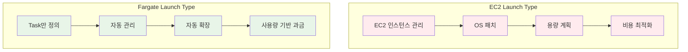
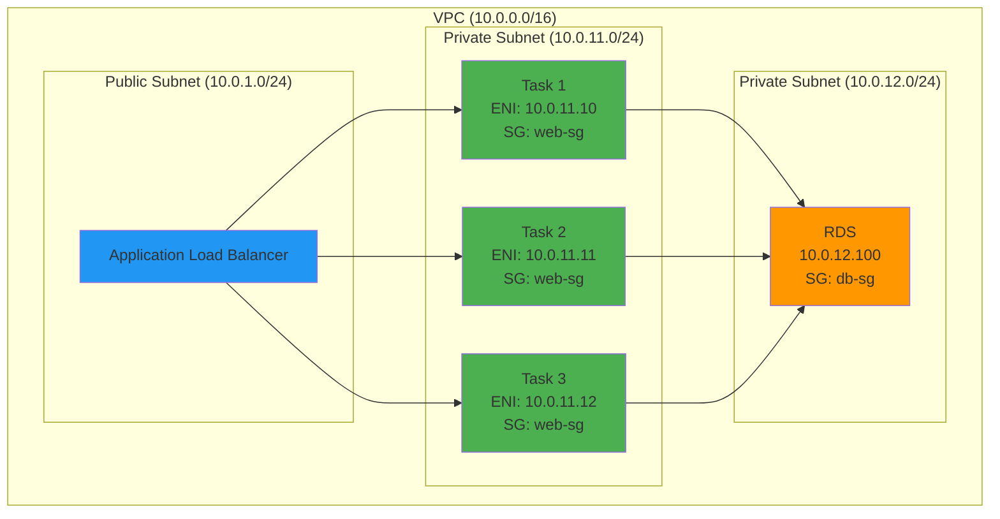

# November Week 2 Day 3 Session 2: Fargate 서버리스 컨테이너

<div align="center">

**🚀 Fargate** • **🌐 awsvpc** • **📊 CloudWatch** • **🔐 IAM Role**

*서버 관리 없이 컨테이너 실행하기*

</div>

---

## 🕘 Session 정보
**시간**: 09:40-10:20 (40분)
**목표**: Fargate 서버리스 컨테이너 이해 및 네트워킹 파악
**방식**: 이론 + AWS 공식 문서 기반 설명

## 🎯 학습 목표

### 📚 이해 목표
- Fargate 서버리스 개념 이해
- awsvpc 네트워크 모드 파악
- Task 실행 역할 (IAM) 이해
- CloudWatch Logs 통합 방법

### 🛠️ 적용 목표
- Fargate Task Definition 작성 능력
- 적절한 CPU/Memory 조합 선택
- 네트워킹 및 로깅 설정

---

## 🤔 왜 필요한가? (5분)

### 💼 실무 시나리오: 서버 관리 부담

**EC2 Launch Type의 문제**:
```
서버 관리 작업:
- EC2 인스턴스 프로비저닝
- OS 패치 및 업데이트
- 보안 설정 및 모니터링
- 용량 계획 (얼마나 많은 인스턴스?)
- Auto Scaling 설정
- 비용 최적화 (Reserved Instance)

→ 개발자가 인프라 관리에 시간 소비
→ 애플리케이션 개발에 집중 어려움
```

**Fargate 솔루션**:
```
서버리스 컨테이너:
✅ 서버 관리 불필요
✅ 자동 확장
✅ 사용한 만큼만 비용
✅ 보안 격리 (Task별 독립)
✅ 빠른 배포

→ 개발자는 애플리케이션에만 집중
→ 운영 부담 최소화
```

### 🏠 실생활 비유

**택시 vs 자가용**:
- **EC2**: 자가용 (직접 관리, 유지보수, 주차 걱정)
- **Fargate**: 택시 (필요할 때만 사용, 관리 불필요)

---

## 📖 핵심 개념 (30분)

### 🔍 개념 1: Fargate 서버리스 컨테이너 (10분)

> **정의** (AWS 공식): AWS Fargate는 컨테이너를 위한 서버리스 컴퓨팅 엔진으로, 서버를 관리하지 않고도 컨테이너를 실행할 수 있게 합니다.

#### Fargate 핵심 특징

**1. 서버리스**:
```
EC2 인스턴스 없음
→ 프로비저닝 불필요
→ 패치 불필요
→ 용량 계획 불필요
```

**2. Task 단위 격리**:
```
각 Task는 독립적인 환경
├── 전용 CPU/Memory
├── 독립적인 ENI (네트워크)
├── 독립적인 보안 그룹
└── 독립적인 IAM Role
```

**3. 자동 확장**:
```
ECS Service Auto Scaling
→ CPU/Memory 사용률 기반
→ 자동으로 Task 추가/제거
→ 인프라 걱정 없음
```

#### Fargate vs EC2 실무 비교



#### CPU/Memory 조합 선택

**Fargate 지원 조합** (ap-northeast-2):

| vCPU | 메모리 (GB) | 시간당 비용 |
|------|-------------|-------------|
| 0.25 | 0.5, 1, 2 | $0.01419 |
| 0.5 | 1, 2, 3, 4 | $0.02838 |
| 1 | 2, 3, 4, 5, 6, 7, 8 | $0.05676 |
| 2 | 4 ~ 16 | $0.11352 |
| 4 | 8 ~ 30 | $0.22704 |

**선택 기준**:
```
웹 서버 (정적):
- 0.25 vCPU + 0.5GB
- 가벼운 워크로드

API 서버 (동적):
- 0.5 vCPU + 1GB
- 중간 워크로드

데이터 처리:
- 1 vCPU + 2GB
- CPU 집약적

배치 작업:
- 2 vCPU + 4GB
- 메모리 집약적
```

### 🔍 개념 2: awsvpc 네트워크 모드 (10분)

> **AWS 공식**: Fargate는 awsvpc 네트워크 모드를 필수로 사용하며, 각 Task에 독립적인 ENI (Elastic Network Interface)를 할당합니다.

#### awsvpc 네트워크 아키텍처



#### awsvpc 핵심 특징

**1. Task별 독립 ENI**:
```
각 Task는 자신만의 ENI를 가짐
├── Private IP 주소 (필수)
├── Public IP 주소 (선택)
├── Security Group (Task별 설정 가능)
└── VPC Flow Logs 추적 가능
```

**2. 네트워크 격리**:
```
Task 1 (10.0.11.10) → Security Group A
Task 2 (10.0.11.11) → Security Group B
Task 3 (10.0.11.12) → Security Group A

→ Task별 독립적인 보안 정책
```

**3. 컨테이너 간 통신**:
```
같은 Task 내 컨테이너:
- localhost로 통신 가능
- 포트 충돌 없음

다른 Task 간:
- Private IP로 통신
- Security Group 규칙 적용
```

#### 인터넷 접근 방법

**Public Subnet + Public IP**:
```
Task (Public Subnet)
├── Public IP: 자동 할당
├── Internet Gateway 경유
└── 외부 인터넷 직접 접근 가능

사용 사례:
- 외부 API 호출
- 패키지 다운로드
- 외부 서비스 연동
```

**Private Subnet + NAT Gateway**:
```
Task (Private Subnet)
├── Private IP만 존재
├── NAT Gateway 경유
└── 외부 인터넷 접근 가능 (단방향)

사용 사례:
- 보안이 중요한 애플리케이션
- 외부에서 직접 접근 불가
- ALB를 통한 접근만 허용
```

**ECR 이미지 Pull**:
```
방법 1: Public Subnet + Public IP
→ 인터넷 경유

방법 2: Private Subnet + NAT Gateway
→ NAT Gateway 경유

방법 3: VPC Endpoint (권장)
→ AWS 내부 네트워크 사용
→ 데이터 전송 비용 절감
```

### 🔍 개념 3: IAM Role & CloudWatch Logs (10분)

#### Task 실행 역할 (Task Execution Role)

> **AWS 공식**: Task 실행 역할은 ECS 에이전트가 사용자를 대신하여 AWS API를 호출할 수 있도록 하는 IAM 역할입니다.

**역할**:
```
Task 실행 역할 (ecsTaskExecutionRole):
├── ECR 이미지 Pull
├── CloudWatch Logs 전송
├── Secrets Manager 접근
└── SSM Parameter Store 접근
```

**필수 권한**:
```json
{
  "Version": "2012-10-17",
  "Statement": [
    {
      "Effect": "Allow",
      "Action": [
        "ecr:GetAuthorizationToken",
        "ecr:BatchCheckLayerAvailability",
        "ecr:GetDownloadUrlForLayer",
        "ecr:BatchGetImage",
        "logs:CreateLogStream",
        "logs:PutLogEvents"
      ],
      "Resource": "*"
    }
  ]
}
```

#### Task 역할 (Task Role)

**역할**:
```
Task 역할 (애플리케이션이 사용):
├── S3 버킷 접근
├── DynamoDB 테이블 접근
├── SQS 큐 접근
└── 기타 AWS 서비스 접근
```

**예시**:
```json
{
  "Version": "2012-10-17",
  "Statement": [
    {
      "Effect": "Allow",
      "Action": [
        "s3:GetObject",
        "s3:PutObject"
      ],
      "Resource": "arn:aws:s3:::my-bucket/*"
    }
  ]
}
```

#### CloudWatch Logs 통합

**자동 로깅**:
```
Task Definition에 설정:
{
  "logConfiguration": {
    "logDriver": "awslogs",
    "options": {
      "awslogs-group": "/ecs/my-app",
      "awslogs-region": "ap-northeast-2",
      "awslogs-stream-prefix": "ecs"
    }
  }
}

→ 컨테이너 stdout/stderr 자동 전송
→ CloudWatch Logs에서 실시간 확인
```

**로그 구조**:
```
Log Group: /ecs/my-app
├── Log Stream: ecs/my-app/task-id-1
│   ├── 2025-11-04 09:00:00 [INFO] Server started
│   ├── 2025-11-04 09:00:01 [INFO] Listening on port 3000
│   └── 2025-11-04 09:00:02 [INFO] Connected to database
├── Log Stream: ecs/my-app/task-id-2
└── Log Stream: ecs/my-app/task-id-3
```

**로그 검색 및 분석**:
```
CloudWatch Logs Insights:
- 로그 쿼리 및 분석
- 에러 패턴 탐지
- 성능 메트릭 추출
- 알람 설정
```

---

## 💰 비용 구조 (5분)

### Fargate 비용 (ap-northeast-2)

**기본 과금**:
```
vCPU: $0.04656/vCPU/시간
메모리: $0.00511/GB/시간
```

**예시 계산**:

**1. 소규모 웹 서버** (0.25 vCPU + 0.5GB):
```
vCPU: $0.04656 × 0.25 = $0.01164/시간
메모리: $0.00511 × 0.5 = $0.00256/시간
합계: $0.01420/시간

월간 (24/7): $0.01420 × 730시간 = $10.37/월
```

**2. API 서버** (0.5 vCPU + 1GB):
```
vCPU: $0.04656 × 0.5 = $0.02328/시간
메모리: $0.00511 × 1 = $0.00511/시간
합계: $0.02839/시간

월간 (24/7): $0.02839 × 730시간 = $20.72/월
```

**3. 데이터 처리** (1 vCPU + 2GB):
```
vCPU: $0.04656 × 1 = $0.04656/시간
메모리: $0.00511 × 2 = $0.01022/시간
합계: $0.05678/시간

월간 (24/7): $0.05678 × 730시간 = $41.45/월
```

### 비용 최적화 팁

**1. 적절한 크기 선택**:
```
과도한 리소스 할당 방지
→ CloudWatch 메트릭 모니터링
→ CPU/Memory 사용률 확인
→ 적정 크기로 조정
```

**2. Spot Fargate** (최대 70% 할인):
```
중단 가능한 워크로드:
- 배치 작업
- 데이터 처리
- 테스트 환경

→ Spot 가격으로 실행
→ 비용 대폭 절감
```

**3. 스케줄링**:
```
필요할 때만 실행:
- 업무 시간에만 실행
- 야간/주말 중지
- ECS Scheduled Tasks 활용
```

---

## 🔑 핵심 키워드

- **Fargate**: 서버리스 컨테이너 실행 환경
- **awsvpc**: Task별 독립 ENI 할당 네트워크 모드
- **Task 실행 역할**: ECR, CloudWatch 접근 권한
- **Task 역할**: 애플리케이션의 AWS 서비스 접근 권한
- **CloudWatch Logs**: 컨테이너 로그 자동 수집
- **ENI**: Task별 독립적인 네트워크 인터페이스
- **Security Group**: Task별 네트워크 보안 정책

---

## 📝 Session 마무리

### ✅ 오늘 Session 성과
- [ ] Fargate 서버리스 개념 이해
- [ ] awsvpc 네트워크 모드 파악
- [ ] Task 실행 역할과 Task 역할 구분
- [ ] CloudWatch Logs 통합 방법 습득
- [ ] 비용 구조 및 최적화 방법 이해

### 🎯 다음 Session 준비
- **Session 3**: Terraform Variable & Output (환경별 설정 관리)
- **연계**: Fargate Task Definition을 Terraform으로 관리

### 🔗 공식 문서 (필수)

**⚠️ 학생들이 직접 확인해야 할 공식 문서**:
- 📘 [AWS Fargate란?](https://docs.aws.amazon.com/AmazonECS/latest/developerguide/AWS_Fargate.html)
- 📗 [Fargate Task 네트워킹](https://docs.aws.amazon.com/AmazonECS/latest/developerguide/fargate-task-networking.html)
- 📙 [Task 실행 역할](https://docs.aws.amazon.com/AmazonECS/latest/developerguide/task_execution_IAM_role.html)
- 📕 [Fargate 요금](https://aws.amazon.com/fargate/pricing/)
- 🆕 [Fargate 최신 업데이트](https://aws.amazon.com/fargate/whats-new/)

---

<div align="center">

**🚀 Fargate** • **🌐 awsvpc** • **📊 CloudWatch** • **🔐 IAM Role**

*다음: Session 3 - Terraform Variable & Output*

</div>
