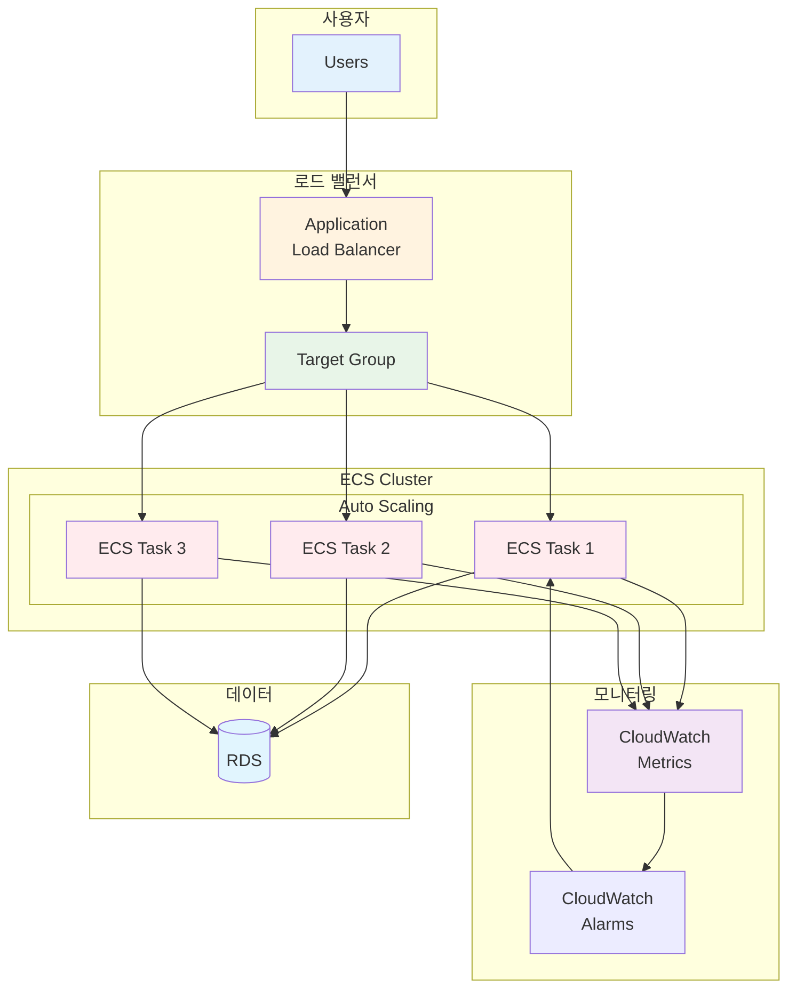

# November Week 2 Day 4: ECS 심화 & 프로덕션 배포

<div align="center">

**⚖️ ALB 통합** • **📈 Auto Scaling** • **📝 Terraform 구성**

*프로덕션급 ECS 배포 및 자동 확장 구현*

</div>

---

## 🕘 일일 스케줄

### 📊 시간 배분
```
09:00-09:50  Session 1: ALB (50분)
09:50-10:00  휴식 (10분)
10:00-10:40  Session 2: ECS Auto Scaling (40분)
10:40-10:50  휴식 (10분)
10:50-11:40  Session 3: Terraform Auto Scaling (50분)
11:40-12:00  Lab 준비 (20분)
```

### 🗓️ 상세 스케줄
| 시간 | 구분 | 내용 | 목적 |
|------|------|------|------|
| **09:00-09:50** | 📚 이론 1 | Application Load Balancer (50분) | Layer 7 로드 밸런싱 |
| **09:50-10:00** | ☕ 휴식 | 10분 휴식 | |
| **10:00-10:40** | 📚 이론 2 | ECS Auto Scaling & 운영 (40분) | 자동 확장 및 모니터링 |
| **10:40-10:50** | ☕ 휴식 | 10분 휴식 | |
| **10:50-11:40** | 📚 이론 3 | Terraform Auto Scaling (50분) | IaC로 Auto Scaling 관리 |
| **11:40-12:00** | 🛠️ 준비 | Lab 환경 준비 (20분) | 실습 준비 |

---

## 🎯 Day 4 목표

### 📚 학습 목표
- **ALB 통합**: ECS Service와 ALB 연동 방법 이해
- **Auto Scaling**: 트래픽에 따른 자동 확장 구현
- **Terraform 구성**: Auto Scaling 정책을 코드로 관리
- **프로덕션 배포**: 고가용성 및 확장성 확보

### 🛠️ 실무 역량
- Layer 7 로드 밸런싱 설계
- Target Tracking 정책 설정
- CloudWatch 메트릭 활용
- Terraform으로 인프라 자동화

---

## 📚 세션 구성

### Session 1: Application Load Balancer (09:00-09:50)
**주제**: Layer 7 로드 밸런서로 트래픽 분산

**핵심 내용**:
- ALB vs NLB vs CLB 비교
- Target Group 및 Health Check
- ECS Service 통합
- 고가용성 구현

**학습 포인트**:
- Layer 7 로드 밸런싱 원리
- Target Group 동작 방식
- Health Check 설정 방법
- ECS와의 통합 패턴

**참조**: [Session 1 상세 내용](./session_1.md)

---

### Session 2: ECS Auto Scaling & 운영 (10:00-10:40)
**주제**: ECS Service 자동 확장 및 운영 관리

**핵심 내용**:
- Service Auto Scaling 개념
- Target Tracking vs Step Scaling
- CloudWatch 메트릭 및 알람
- 로그 분석 및 디버깅

**학습 포인트**:
- Auto Scaling 정책 설계
- 메트릭 기반 확장
- 운영 모니터링
- 트러블슈팅 방법

**참조**: [Session 2 상세 내용](./session_2.md)

---

### Session 3: Terraform으로 Auto Scaling 구성 (10:50-11:40)
**주제**: Terraform으로 ECS Auto Scaling 코드화

**핵심 내용**:
- Auto Scaling 리소스 구조
- Target Tracking 정책 코드
- CloudWatch 알람 통합
- 전체 스택 코드화

**학습 포인트**:
- Terraform Auto Scaling 리소스
- 정책 코드 작성
- 메트릭 연동
- 베스트 프랙티스

**참조**: [Session 3 상세 내용](./session_3.md)

---

## 🛠️ 실습 (Lab 1)

### Lab 1: 프로덕션급 ECS 배포
**시간**: 별도 진행 (60분)
**목표**: ALB + ECS + Auto Scaling 통합 배포

**실습 내용**:
1. ALB 및 Target Group 생성
2. ECS Service 배포 (ALB 통합)
3. Auto Scaling 정책 설정
4. CloudWatch 모니터링 구성
5. Terraform으로 전체 관리

**참조**: [Lab 1 상세 가이드](./lab_1.md)

---

## 🏗️ Day 4 아키텍처

### 전체 구조


### 주요 구성 요소
- **ALB**: Layer 7 로드 밸런싱
- **Target Group**: ECS Task 등록 및 Health Check
- **ECS Service**: 컨테이너 오케스트레이션
- **Auto Scaling**: 트래픽 기반 자동 확장
- **CloudWatch**: 메트릭 수집 및 알람

---

## 💰 예상 비용

### Day 4 리소스 비용
| 리소스 | 사양 | 시간당 | 실습 시간 | 예상 비용 |
|--------|------|--------|-----------|-----------|
| ALB | 1개 | $0.0225 | 2시간 | $0.045 |
| ECS Fargate | 0.25 vCPU, 0.5GB | $0.01 | 2시간 | $0.02 |
| CloudWatch | 메트릭/알람 | 무료 | - | $0 |
| **합계** | | | | **$0.065** |

### 비용 절감 팁
- ALB는 실습 완료 후 즉시 삭제
- ECS Service는 최소 Task 수 유지
- CloudWatch 메트릭은 프리티어 활용
- 실습 완료 후 모든 리소스 정리

---

## ✅ Day 4 체크리스트

### 이론 학습
- [ ] ALB의 Layer 7 로드 밸런싱 이해
- [ ] Target Group 및 Health Check 설정 방법 파악
- [ ] ECS Service Auto Scaling 원리 이해
- [ ] Target Tracking 정책 설계 방법 습득
- [ ] CloudWatch 메트릭 및 알람 활용
- [ ] Terraform Auto Scaling 리소스 구조 이해

### 실습 완료
- [ ] ALB 및 Target Group 생성
- [ ] ECS Service와 ALB 통합
- [ ] Auto Scaling 정책 설정
- [ ] CloudWatch 모니터링 구성
- [ ] Terraform으로 전체 스택 관리

### 실무 역량
- [ ] 프로덕션급 ECS 배포 경험
- [ ] 고가용성 아키텍처 설계
- [ ] 자동 확장 정책 구성
- [ ] 운영 모니터링 체계 구축

---

## 🔗 관련 자료

### 📚 Session 자료
- [Session 1: Application Load Balancer](./session_1.md)
- [Session 2: ECS Auto Scaling & 운영](./session_2.md)
- [Session 3: Terraform Auto Scaling](./session_3.md)

### 🛠️ 실습 자료
- [Lab 1: 프로덕션급 ECS 배포](./lab_1.md)

### 📖 AWS 공식 문서
- [Application Load Balancer](https://docs.aws.amazon.com/elasticloadbalancing/latest/application/)
- [ECS Service Auto Scaling](https://docs.aws.amazon.com/AmazonECS/latest/developerguide/service-auto-scaling.html)
- [CloudWatch Metrics](https://docs.aws.amazon.com/AmazonCloudWatch/latest/monitoring/)

### 🎯 다음 Day
- [Day 5: 설정 관리 & 이벤트 기반 아키텍처](../day5/README.md)

---

## 💡 Day 4 회고

### 🤝 학습 성과
1. **프로덕션 배포**: 실무 수준의 ECS 배포 경험
2. **자동 확장**: 트래픽 기반 Auto Scaling 구현
3. **IaC 실전**: Terraform으로 복잡한 인프라 관리
4. **운영 역량**: 모니터링 및 트러블슈팅 능력 향상

### 📊 다음 학습
- **Day 5**: Parameter Store, EventBridge
- **Week 3**: Terraform 심화 (Module, Remote State)

---

<div align="center">

**⚖️ 로드 밸런싱** • **📈 Auto Scaling** • **📝 IaC 구성** • **🚀 프로덕션 배포**

*Day 4: 프로덕션급 ECS 배포 완성*

</div>
