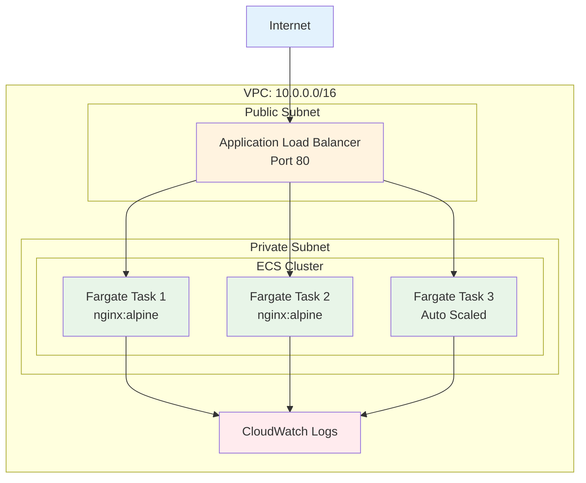

# November Week 2 Day 4 Lab 1: Terraform으로 Fargate 기반 ECS 배포

<div align="center">

**🐳 ECS Fargate** • **📝 Terraform** • **⚖️ ALB** • **📊 Auto Scaling**

*Terraform으로 프로덕션급 서버리스 컨테이너 인프라 구축*

</div>

---

## 🕘 Lab 정보
**시간**: 11:00-12:00 (60분)
**목표**: Terraform으로 Fargate + ALB + Auto Scaling 완전 자동화
**방식**: 직접 코드 작성 및 배포
**사전 준비**: Day 3 Lab 1 완료 (VPC 인프라)

## 🎯 학습 목표

### 📚 이해 목표
- Terraform으로 ECS 리소스 관리
- Fargate Task Definition 코드화
- ALB와 ECS Service 통합
- Auto Scaling 정책 설정

### 🛠️ 구현 목표
- VPC 인프라 (Day 3 재사용)
- ECR 리포지토리
- ECS Cluster + Fargate Service
- ALB + Target Group
- Auto Scaling 정책

---

## 🏗️ 구축할 아키텍처

### 📐 전체 구조

```
Internet
    ↓
Application Load Balancer (Public Subnet)
    ↓
ECS Fargate Service (Private Subnet)
    ├── Task 1 (Container)
    ├── Task 2 (Container)
    └── Task 3 (Auto Scaling)
    ↓
CloudWatch Logs
```

**시각화**:


### 🔗 참조 Session
**이전 Day Session** (기반 지식):
- [November Week 2 Day 3 Session 1: ECR & ECS 기초](../day3/session_1.md) - ECS 아키텍처
- [November Week 2 Day 3 Session 2: Fargate 서버리스 컨테이너](../day3/session_2.md) - Fargate 개념
- [November Week 2 Day 3 Lab 1: Variable 기반 VPC](../day3/lab_1.md) - VPC 인프라

**당일 Session** (심화 내용):
- [November Week 2 Day 4 Session 1: ECS + ALB 통합](../session_1.md) - ALB 연동
- [November Week 2 Day 4 Session 2: ECS Auto Scaling](../session_2.md) - Auto Scaling
- [November Week 2 Day 4 Session 3: Terraform AWS 리소스](../session_3.md) - ECS Terraform 코드

---

## 🛠️ Step 1: 프로젝트 구조 생성 (5분)

### 📋 디렉토리 생성
```bash
mkdir -p ~/terraform-lab/day4-lab1
cd ~/terraform-lab/day4-lab1
```

### 📝 파일 구조
```
day4-lab1/
├── variables.tf      # Variable 정의
├── terraform.tfvars  # 환경 값
├── vpc.tf           # VPC 리소스 (Day 3 재사용)
├── ecs.tf           # ECS Cluster, Task Definition
├── alb.tf           # ALB, Target Group
├── autoscaling.tf   # Auto Scaling 정책
├── iam.tf           # IAM Role (Task Execution, Task Role)
├── cloudwatch.tf    # CloudWatch Logs
├── outputs.tf       # Output 정의
└── backend.tf       # S3 Backend
```

---

## 🛠️ Step 2: Variable 정의 (5분)

### 📝 variables.tf 작성
```bash
cat <<'EOF' > variables.tf
# 프로젝트 설정
variable "project_name" {
  description = "프로젝트 이름"
  type        = string
  default     = "ecs-fargate-demo"
}

variable "environment" {
  description = "환경 (dev, prod)"
  type        = string
  default     = "dev"
}

# VPC 설정
variable "vpc_cidr" {
  description = "VPC CIDR 블록"
  type        = string
  default     = "10.0.0.0/16"
}

variable "azs" {
  description = "Availability Zones"
  type        = list(string)
  default     = ["ap-northeast-2a", "ap-northeast-2c"]
}

variable "public_subnet_cidrs" {
  description = "Public Subnet CIDR 블록"
  type        = list(string)
  default     = ["10.0.1.0/24", "10.0.2.0/24"]
}

variable "private_subnet_cidrs" {
  description = "Private Subnet CIDR 블록"
  type        = list(string)
  default     = ["10.0.11.0/24", "10.0.12.0/24"]
}

# ECS 설정
variable "container_image" {
  description = "컨테이너 이미지"
  type        = string
  default     = "nginx:alpine"
}

variable "container_port" {
  description = "컨테이너 포트"
  type        = number
  default     = 80
}

variable "task_cpu" {
  description = "Task CPU (256, 512, 1024, 2048, 4096)"
  type        = string
  default     = "256"
}

variable "task_memory" {
  description = "Task Memory (512, 1024, 2048, 4096, 8192)"
  type        = string
  default     = "512"
}

variable "desired_count" {
  description = "원하는 Task 개수"
  type        = number
  default     = 2
}

# Auto Scaling 설정
variable "min_capacity" {
  description = "최소 Task 개수"
  type        = number
  default     = 2
}

variable "max_capacity" {
  description = "최대 Task 개수"
  type        = number
  default     = 4
}

variable "target_cpu_utilization" {
  description = "목표 CPU 사용률 (%)"
  type        = number
  default     = 70
}
EOF
```

### 📝 terraform.tfvars 작성
```bash
cat <<'EOF' > terraform.tfvars
project_name = "ecs-fargate-demo"
environment  = "dev"

# VPC
vpc_cidr             = "10.0.0.0/16"
azs                  = ["ap-northeast-2a", "ap-northeast-2c"]
public_subnet_cidrs  = ["10.0.1.0/24", "10.0.2.0/24"]
private_subnet_cidrs = ["10.0.11.0/24", "10.0.12.0/24"]

# ECS
container_image = "nginx:alpine"
container_port  = 80
task_cpu        = "256"
task_memory     = "512"
desired_count   = 2

# Auto Scaling
min_capacity             = 2
max_capacity             = 4
target_cpu_utilization   = 70
EOF
```

---

## 🛠️ Step 3: VPC 리소스 (Day 3 재사용) (5분)

### 📝 vpc.tf 작성
```bash
cat <<'EOF' > vpc.tf
# VPC
resource "aws_vpc" "main" {
  cidr_block           = var.vpc_cidr
  enable_dns_hostnames = true
  enable_dns_support   = true

  tags = {
    Name        = "${var.project_name}-vpc"
    Environment = var.environment
  }
}

# Internet Gateway
resource "aws_internet_gateway" "main" {
  vpc_id = aws_vpc.main.id

  tags = {
    Name        = "${var.project_name}-igw"
    Environment = var.environment
  }
}

# Public Subnets
locals {
  public_subnets_map = {
    for idx, cidr in var.public_subnet_cidrs :
    "public-${idx}" => {
      cidr = cidr
      az   = var.azs[idx]
    }
  }
}

resource "aws_subnet" "public" {
  for_each = local.public_subnets_map

  vpc_id                  = aws_vpc.main.id
  cidr_block              = each.value.cidr
  availability_zone       = each.value.az
  map_public_ip_on_launch = true

  tags = {
    Name        = "${var.project_name}-${each.key}"
    Environment = var.environment
    Type        = "Public"
  }
}

# Private Subnets
locals {
  private_subnets_map = {
    for idx, cidr in var.private_subnet_cidrs :
    "private-${idx}" => {
      cidr = cidr
      az   = var.azs[idx]
    }
  }
}

resource "aws_subnet" "private" {
  for_each = local.private_subnets_map

  vpc_id            = aws_vpc.main.id
  cidr_block        = each.value.cidr
  availability_zone = each.value.az

  tags = {
    Name        = "${var.project_name}-${each.key}"
    Environment = var.environment
    Type        = "Private"
  }
}

# Public Route Table
resource "aws_route_table" "public" {
  vpc_id = aws_vpc.main.id

  route {
    cidr_block = "0.0.0.0/0"
    gateway_id = aws_internet_gateway.main.id
  }

  tags = {
    Name        = "${var.project_name}-public-rt"
    Environment = var.environment
  }
}

# Public Route Table Association
resource "aws_route_table_association" "public" {
  for_each = aws_subnet.public

  subnet_id      = each.value.id
  route_table_id = aws_route_table.public.id
}

# Private Route Table
resource "aws_route_table" "private" {
  vpc_id = aws_vpc.main.id

  tags = {
    Name        = "${var.project_name}-private-rt"
    Environment = var.environment
  }
}

# Private Route Table Association
resource "aws_route_table_association" "private" {
  for_each = aws_subnet.private

  subnet_id      = each.value.id
  route_table_id = aws_route_table.private.id
}
EOF
```

---

## 🛠️ Step 4: IAM Role (Task Execution & Task Role) (10분)

### 📝 iam.tf 작성
```bash
cat <<'EOF' > iam.tf
# Task Execution Role (ECS가 Task를 실행하기 위한 권한)
resource "aws_iam_role" "ecs_task_execution_role" {
  name = "${var.project_name}-ecs-task-execution-role"

  assume_role_policy = jsonencode({
    Version = "2012-10-17"
    Statement = [
      {
        Action = "sts:AssumeRole"
        Effect = "Allow"
        Principal = {
          Service = "ecs-tasks.amazonaws.com"
        }
      }
    ]
  })

  tags = {
    Name        = "${var.project_name}-ecs-task-execution-role"
    Environment = var.environment
  }
}

# Task Execution Role Policy 연결
resource "aws_iam_role_policy_attachment" "ecs_task_execution_role_policy" {
  role       = aws_iam_role.ecs_task_execution_role.name
  policy_arn = "arn:aws:iam::aws:policy/service-role/AmazonECSTaskExecutionRolePolicy"
}

# Task Role (컨테이너가 AWS 서비스에 접근하기 위한 권한)
resource "aws_iam_role" "ecs_task_role" {
  name = "${var.project_name}-ecs-task-role"

  assume_role_policy = jsonencode({
    Version = "2012-10-17"
    Statement = [
      {
        Action = "sts:AssumeRole"
        Effect = "Allow"
        Principal = {
          Service = "ecs-tasks.amazonaws.com"
        }
      }
    ]
  })

  tags = {
    Name        = "${var.project_name}-ecs-task-role"
    Environment = var.environment
  }
}

# Task Role에 CloudWatch Logs 권한 추가
resource "aws_iam_role_policy" "ecs_task_cloudwatch_policy" {
  name = "${var.project_name}-ecs-task-cloudwatch-policy"
  role = aws_iam_role.ecs_task_role.id

  policy = jsonencode({
    Version = "2012-10-17"
    Statement = [
      {
        Effect = "Allow"
        Action = [
          "logs:CreateLogGroup",
          "logs:CreateLogStream",
          "logs:PutLogEvents"
        ]
        Resource = "*"
      }
    ]
  })
}
EOF
```

### 💡 IAM Role 설명
- **Task Execution Role**: ECS가 ECR 이미지 pull, CloudWatch Logs 전송 등을 위한 권한
- **Task Role**: 컨테이너 내 애플리케이션이 AWS 서비스(S3, DynamoDB 등)에 접근하기 위한 권한

---

계속해서 다음 Step들을 작성하겠습니다.
## 🛠️ Step 5: CloudWatch Logs (5분)

### 📝 cloudwatch.tf 작성
```bash
cat <<'EOF' > cloudwatch.tf
# CloudWatch Log Group
resource "aws_cloudwatch_log_group" "ecs" {
  name              = "/ecs/${var.project_name}"
  retention_in_days = 7

  tags = {
    Name        = "${var.project_name}-ecs-logs"
    Environment = var.environment
  }
}
EOF
```

---

## 🛠️ Step 6: ECS Cluster & Task Definition (10분)

### 📝 ecs.tf 작성
```bash
cat <<'EOF' > ecs.tf
# ECS Cluster
resource "aws_ecs_cluster" "main" {
  name = "${var.project_name}-cluster"

  setting {
    name  = "containerInsights"
    value = "enabled"
  }

  tags = {
    Name        = "${var.project_name}-cluster"
    Environment = var.environment
  }
}

# Security Group for ECS Tasks
resource "aws_security_group" "ecs_tasks" {
  name        = "${var.project_name}-ecs-tasks-sg"
  description = "Security group for ECS tasks"
  vpc_id      = aws_vpc.main.id

  ingress {
    description     = "Allow traffic from ALB"
    from_port       = var.container_port
    to_port         = var.container_port
    protocol        = "tcp"
    security_groups = [aws_security_group.alb.id]
  }

  egress {
    description = "Allow all outbound traffic"
    from_port   = 0
    to_port     = 0
    protocol    = "-1"
    cidr_blocks = ["0.0.0.0/0"]
  }

  tags = {
    Name        = "${var.project_name}-ecs-tasks-sg"
    Environment = var.environment
  }
}

# ECS Task Definition
resource "aws_ecs_task_definition" "app" {
  family                   = "${var.project_name}-task"
  network_mode             = "awsvpc"
  requires_compatibilities = ["FARGATE"]
  cpu                      = var.task_cpu
  memory                   = var.task_memory
  execution_role_arn       = aws_iam_role.ecs_task_execution_role.arn
  task_role_arn            = aws_iam_role.ecs_task_role.arn

  container_definitions = jsonencode([
    {
      name      = "${var.project_name}-container"
      image     = var.container_image
      essential = true

      portMappings = [
        {
          containerPort = var.container_port
          protocol      = "tcp"
        }
      ]

      logConfiguration = {
        logDriver = "awslogs"
        options = {
          "awslogs-group"         = aws_cloudwatch_log_group.ecs.name
          "awslogs-region"        = "ap-northeast-2"
          "awslogs-stream-prefix" = "ecs"
        }
      }

      environment = [
        {
          name  = "ENVIRONMENT"
          value = var.environment
        }
      ]
    }
  ])

  tags = {
    Name        = "${var.project_name}-task"
    Environment = var.environment
  }
}

# ECS Service
resource "aws_ecs_service" "app" {
  name            = "${var.project_name}-service"
  cluster         = aws_ecs_cluster.main.id
  task_definition = aws_ecs_task_definition.app.arn
  desired_count   = var.desired_count
  launch_type     = "FARGATE"

  network_configuration {
    subnets          = [for subnet in aws_subnet.private : subnet.id]
    security_groups  = [aws_security_group.ecs_tasks.id]
    assign_public_ip = false
  }

  load_balancer {
    target_group_arn = aws_lb_target_group.app.arn
    container_name   = "${var.project_name}-container"
    container_port   = var.container_port
  }

  depends_on = [
    aws_lb_listener.app
  ]

  # Auto Scaling이 desired_count를 관리하므로 Terraform이 변경 감지하지 않도록 설정
  lifecycle {
    ignore_changes = [desired_count]
  }

  tags = {
    Name        = "${var.project_name}-service"
    Environment = var.environment
  }
}
EOF
```

### 💡 ECS 리소스 설명
- **Cluster**: ECS Task들이 실행되는 논리적 그룹
- **Task Definition**: 컨테이너 실행 방법 정의 (이미지, CPU, 메모리, 로그 등)
- **Service**: Task를 원하는 개수만큼 유지하고 ALB와 연동
- **⚠️ lifecycle.ignore_changes**: Auto Scaling이 `desired_count`를 관리하므로 Terraform이 변경 감지하지 않도록 설정 (Terraform 공식 권장사항)

---

## 🛠️ Step 7: Application Load Balancer (10분)

### 📝 alb.tf 작성
```bash
cat <<'EOF' > alb.tf
# Security Group for ALB
resource "aws_security_group" "alb" {
  name        = "${var.project_name}-alb-sg"
  description = "Security group for ALB"
  vpc_id      = aws_vpc.main.id

  ingress {
    description = "Allow HTTP from anywhere"
    from_port   = 80
    to_port     = 80
    protocol    = "tcp"
    cidr_blocks = ["0.0.0.0/0"]
  }

  egress {
    description = "Allow all outbound traffic"
    from_port   = 0
    to_port     = 0
    protocol    = "-1"
    cidr_blocks = ["0.0.0.0/0"]
  }

  tags = {
    Name        = "${var.project_name}-alb-sg"
    Environment = var.environment
  }
}

# Application Load Balancer
resource "aws_lb" "app" {
  name               = "${var.project_name}-alb"
  internal           = false
  load_balancer_type = "application"
  security_groups    = [aws_security_group.alb.id]
  subnets            = [for subnet in aws_subnet.public : subnet.id]

  enable_deletion_protection = false

  tags = {
    Name        = "${var.project_name}-alb"
    Environment = var.environment
  }
}

# Target Group
resource "aws_lb_target_group" "app" {
  name        = "${var.project_name}-tg"
  port        = var.container_port
  protocol    = "HTTP"
  vpc_id      = aws_vpc.main.id
  target_type = "ip"

  health_check {
    enabled             = true
    healthy_threshold   = 2
    unhealthy_threshold = 2
    timeout             = 5
    interval            = 30
    path                = "/"
    matcher             = "200"
  }

  tags = {
    Name        = "${var.project_name}-tg"
    Environment = var.environment
  }
}

# ALB Listener
resource "aws_lb_listener" "app" {
  load_balancer_arn = aws_lb.app.arn
  port              = "80"
  protocol          = "HTTP"

  default_action {
    type             = "forward"
    target_group_arn = aws_lb_target_group.app.arn
  }
}
EOF
```

### 💡 ALB 설명
- **ALB**: HTTP/HTTPS 트래픽을 여러 Target으로 분산
- **Target Group**: ECS Task들이 등록되는 그룹 (target_type = "ip")
- **Health Check**: Task가 정상인지 주기적으로 확인

---

## 🛠️ Step 8: Auto Scaling (5분)

### 📝 autoscaling.tf 작성
```bash
cat <<'EOF' > autoscaling.tf
# Auto Scaling Target
resource "aws_appautoscaling_target" "ecs_target" {
  max_capacity       = var.max_capacity
  min_capacity       = var.min_capacity
  resource_id        = "service/${aws_ecs_cluster.main.name}/${aws_ecs_service.app.name}"
  scalable_dimension = "ecs:service:DesiredCount"
  service_namespace  = "ecs"
}

# Auto Scaling Policy (Target Tracking - CPU)
resource "aws_appautoscaling_policy" "ecs_policy_cpu" {
  name               = "${var.project_name}-cpu-autoscaling"
  policy_type        = "TargetTrackingScaling"
  resource_id        = aws_appautoscaling_target.ecs_target.resource_id
  scalable_dimension = aws_appautoscaling_target.ecs_target.scalable_dimension
  service_namespace  = aws_appautoscaling_target.ecs_target.service_namespace

  target_tracking_scaling_policy_configuration {
    predefined_metric_specification {
      predefined_metric_type = "ECSServiceAverageCPUUtilization"
    }

    target_value       = var.target_cpu_utilization
    scale_in_cooldown  = 300
    scale_out_cooldown = 60
  }
}

# Auto Scaling Policy (Target Tracking - Memory)
resource "aws_appautoscaling_policy" "ecs_policy_memory" {
  name               = "${var.project_name}-memory-autoscaling"
  policy_type        = "TargetTrackingScaling"
  resource_id        = aws_appautoscaling_target.ecs_target.resource_id
  scalable_dimension = aws_appautoscaling_target.ecs_target.scalable_dimension
  service_namespace  = aws_appautoscaling_target.ecs_target.service_namespace

  target_tracking_scaling_policy_configuration {
    predefined_metric_specification {
      predefined_metric_type = "ECSServiceAverageMemoryUtilization"
    }

    target_value       = 80
    scale_in_cooldown  = 300
    scale_out_cooldown = 60
  }
}
EOF
```

### 💡 Auto Scaling 설명
- **Target Tracking**: 목표 메트릭(CPU 70%)을 유지하도록 자동 조정
- **Scale Out**: CPU 70% 초과 시 Task 추가 (60초 대기)
- **Scale In**: CPU 70% 미만 시 Task 제거 (300초 대기)

---

## 🛠️ Step 9: Output & Backend (5분)

### 📝 outputs.tf 작성
```bash
cat <<'EOF' > outputs.tf
# VPC 정보
output "vpc_id" {
  description = "VPC ID"
  value       = aws_vpc.main.id
}

# ECS 정보
output "ecs_cluster_name" {
  description = "ECS Cluster 이름"
  value       = aws_ecs_cluster.main.name
}

output "ecs_service_name" {
  description = "ECS Service 이름"
  value       = aws_ecs_service.app.name
}

# ALB 정보
output "alb_dns_name" {
  description = "ALB DNS 이름"
  value       = aws_lb.app.dns_name
}

output "alb_url" {
  description = "ALB URL"
  value       = "http://${aws_lb.app.dns_name}"
}

# CloudWatch Logs
output "cloudwatch_log_group" {
  description = "CloudWatch Log Group 이름"
  value       = aws_cloudwatch_log_group.ecs.name
}
EOF
```

### 📝 backend.tf 작성
```bash
cat <<'EOF' > backend.tf
terraform {
  required_version = ">= 1.0"
  
  required_providers {
    aws = {
      source  = "hashicorp/aws"
      version = "~> 6.0"  # 최신 버전 사용 (6.19.0)
    }
  }

  backend "s3" {
    bucket         = "terraform-state-sunny-1762228054"
    key            = "november/week2/day4/lab1/terraform.tfstate"
    region         = "ap-northeast-2"
    encrypt        = true
    dynamodb_table = "terraform-state-lock"
  }
}

provider "aws" {
  region = "ap-northeast-2"
}
EOF
```

**📋 Terraform 버전 정보**:
- **Terraform Core**: >= 1.0
- **AWS Provider**: ~> 6.0 (최신 6.19.0 사용)
- **Backend**: S3 + DynamoDB (State Locking)

---

계속해서 배포 및 검증 단계를 작성하겠습니다.
## 🛠️ Step 10: 전체 배포 (5분)

### 📝 Terraform 초기화
```bash
terraform init
```

### 📝 Plan 확인
```bash
terraform plan
```

**예상 결과**:
```
Plan: 30+ add, 0 change, 0 destroy.

Changes to Outputs:
  + alb_url              = (known after apply)
  + ecs_cluster_name     = "ecs-fargate-demo-cluster"
  + ecs_service_name     = "ecs-fargate-demo-service"
```

### 📝 Apply 실행
```bash
terraform apply
```

**배포 시간**: 약 3-5분 소요

---

## ✅ Step 11: 검증 (5분)

### 📝 ALB URL 확인
```bash
# ALB URL 출력
terraform output alb_url

# 예상 출력:
# http://ecs-fargate-demo-alb-1234567890.ap-northeast-2.elb.amazonaws.com
```

### 📝 웹 브라우저 접속
```bash
# ALB URL로 접속
curl $(terraform output -raw alb_url)
```

**예상 결과**:
```html
<!DOCTYPE html>
<html>
<head>
<title>Welcome to nginx!</title>
...
```

### 📝 ECS Service 상태 확인
```bash
# ECS Service 확인
aws ecs describe-services \
  --cluster $(terraform output -raw ecs_cluster_name) \
  --services $(terraform output -raw ecs_service_name) \
  --query 'services[0].[serviceName,status,runningCount,desiredCount]' \
  --output table
```

**예상 결과**:
```
---------------------------------
|      DescribeServices         |
+-------------------------------+
|  ecs-fargate-demo-service     |
|  ACTIVE                       |
|  2                            |
|  2                            |
+-------------------------------+
```

### 📝 Task 목록 확인
```bash
# Task 목록
aws ecs list-tasks \
  --cluster $(terraform output -raw ecs_cluster_name) \
  --service-name $(terraform output -raw ecs_service_name) \
  --query 'taskArns' \
  --output table
```

### 📝 CloudWatch Logs 확인
```bash
# 최근 로그 확인
aws logs tail $(terraform output -raw cloudwatch_log_group) --follow
```

---

## 🧪 Step 12: Auto Scaling 테스트 (선택, 5분)

### 📝 부하 생성
```bash
# ALB에 부하 생성 (다른 터미널에서 실행)
while true; do
  curl -s $(terraform output -raw alb_url) > /dev/null
  echo "Request sent"
  sleep 0.1
done
```

### 📝 Auto Scaling 확인
```bash
# 5분 후 Task 개수 확인
aws ecs describe-services \
  --cluster $(terraform output -raw ecs_cluster_name) \
  --services $(terraform output -raw ecs_service_name) \
  --query 'services[0].[runningCount,desiredCount]' \
  --output table
```

**예상 결과** (CPU 70% 초과 시):
```
-----------------
|  2 → 3 → 4    |  (자동 증가)
-----------------
```

### 📝 CloudWatch 메트릭 확인
```bash
# CPU 사용률 확인
aws cloudwatch get-metric-statistics \
  --namespace AWS/ECS \
  --metric-name CPUUtilization \
  --dimensions Name=ServiceName,Value=$(terraform output -raw ecs_service_name) \
               Name=ClusterName,Value=$(terraform output -raw ecs_cluster_name) \
  --start-time $(date -u -d '10 minutes ago' +%Y-%m-%dT%H:%M:%S) \
  --end-time $(date -u +%Y-%m-%dT%H:%M:%S) \
  --period 300 \
  --statistics Average \
  --query 'Datapoints[*].[Timestamp,Average]' \
  --output table
```

---

## ✅ 실습 체크포인트

### ✅ VPC 인프라
- [ ] VPC 생성 완료
- [ ] Public/Private Subnet 생성
- [ ] Internet Gateway 연결
- [ ] Route Table 설정

### ✅ IAM Role
- [ ] Task Execution Role 생성
- [ ] Task Role 생성
- [ ] 필요한 Policy 연결

### ✅ ECS 리소스
- [ ] ECS Cluster 생성
- [ ] Task Definition 작성
- [ ] ECS Service 배포
- [ ] Task 2개 Running 상태

### ✅ ALB 설정
- [ ] ALB 생성 (Public Subnet)
- [ ] Target Group 생성
- [ ] Health Check 정상
- [ ] ALB URL 접속 가능

### ✅ Auto Scaling
- [ ] Auto Scaling Target 설정
- [ ] CPU 기반 정책 생성
- [ ] Memory 기반 정책 생성
- [ ] 부하 테스트 시 자동 확장

### ✅ 모니터링
- [ ] CloudWatch Logs 확인
- [ ] Container Insights 활성화
- [ ] 메트릭 확인 가능

---

## 🔍 트러블슈팅

### 문제 1: Task가 시작되지 않음
**증상**:
```
Task failed to start: CannotPullContainerError
```

**원인**:
- Task Execution Role에 ECR 권한 없음
- 이미지 이름 오타

**해결**:
```bash
# Task Execution Role 확인
aws iam get-role --role-name ecs-fargate-demo-ecs-task-execution-role

# 이미지 이름 확인
terraform state show aws_ecs_task_definition.app | grep image
```

### 문제 2: ALB Health Check 실패
**증상**:
```
Target health check failed
```

**원인**:
- Security Group 설정 오류
- 컨테이너 포트 불일치

**해결**:
```bash
# Security Group 확인
aws ec2 describe-security-groups \
  --filters "Name=tag:Name,Values=ecs-fargate-demo-ecs-tasks-sg" \
  --query 'SecurityGroups[0].IpPermissions'

# Target Group Health 확인
aws elbv2 describe-target-health \
  --target-group-arn $(terraform state show aws_lb_target_group.app | grep arn | head -1 | awk '{print $3}' | tr -d '"')
```

### 문제 3: Auto Scaling 동작 안 함
**증상**:
```
Task 개수가 증가하지 않음
```

**원인**:
- CloudWatch 메트릭 수집 지연
- Scale Out Cooldown 시간

**해결**:
```bash
# Auto Scaling 정책 확인
aws application-autoscaling describe-scaling-policies \
  --service-namespace ecs \
  --resource-id service/$(terraform output -raw ecs_cluster_name)/$(terraform output -raw ecs_service_name)

# 최소 5-10분 대기 후 재확인
```

---

## 🧹 리소스 정리

### ⚠️ 중요: 반드시 순서대로 삭제

```bash
# Terraform으로 전체 삭제
terraform destroy
```

**삭제 확인**:
```bash
# ECS Service 삭제 확인
aws ecs list-services --cluster ecs-fargate-demo-cluster

# ALB 삭제 확인
aws elbv2 describe-load-balancers \
  --names ecs-fargate-demo-alb 2>/dev/null || echo "ALB 삭제 완료"

# VPC 삭제 확인
aws ec2 describe-vpcs \
  --filters "Name=tag:Name,Values=ecs-fargate-demo-vpc" \
  --query 'Vpcs[0].VpcId' \
  --output text
```

---

## 💡 Lab 회고

### 🤝 페어 회고 (5분)
1. **Terraform의 장점**: 수동 배포 대비 어떤 점이 좋았나요?
2. **Fargate의 편리함**: EC2 대비 관리 부담이 줄어든 점은?
3. **Auto Scaling 효과**: 자동 확장이 실무에서 어떻게 활용될까요?

### 📊 학습 성과
- **IaC 실전**: Terraform으로 복잡한 인프라 완전 자동화
- **Fargate 마스터**: 서버리스 컨테이너 프로덕션 배포
- **ALB 통합**: 로드 밸런싱 및 Health Check 구성
- **Auto Scaling**: 트래픽에 따른 자동 확장 구현

### 🔗 다음 Lab 준비
- **Day 5 Lab**: EventBridge + Lambda + ECS 이벤트 기반 아키텍처
- **연계 내용**: 오늘 배포한 ECS Service를 EventBridge로 제어

---

## 📚 추가 학습 자료

### AWS 공식 문서
- [ECS Fargate 사용자 가이드](https://docs.aws.amazon.com/AmazonECS/latest/developerguide/AWS_Fargate.html)
- [Application Load Balancer](https://docs.aws.amazon.com/elasticloadbalancing/latest/application/)
- [ECS Auto Scaling](https://docs.aws.amazon.com/AmazonECS/latest/developerguide/service-auto-scaling.html)

### Terraform 문서
- [AWS ECS Resources](https://registry.terraform.io/providers/hashicorp/aws/latest/docs/resources/ecs_cluster)
- [AWS ALB Resources](https://registry.terraform.io/providers/hashicorp/aws/latest/docs/resources/lb)

---

<div align="center">

**🐳 Fargate** • **📝 Terraform** • **⚖️ ALB** • **📊 Auto Scaling**

*프로덕션급 서버리스 컨테이너 인프라 완성*

</div>
