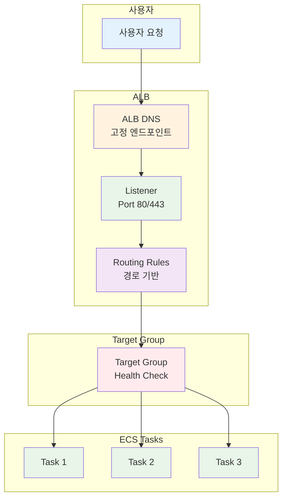

# November Week 2 Day 4 Session 1: Application Load Balancer (ALB)

**⚖️ 로드 밸런싱** • **🎯 Target Group** • **💚 Health Check**

*Layer 7 로드 밸런서로 트래픽 분산 및 고가용성 구현*

---

## 🕘 세션 정보
**시간**: 09:00-09:50 (50분)
**목표**: ALB의 역할과 ECS Service 통합 방법 이해
**방식**: 이론 강의 + 아키텍처 설계

## 🎯 학습 목표
- ALB의 Layer 7 로드 밸런싱 원리 이해
- Target Group 및 Health Check 설정 방법 파악
- ECS Service와의 통합 및 고가용성 구현 방법 습득

---

## 📖 서비스 개요

### 1. 생성 배경 (Why?) - 5분

**문제 상황**:
- **단일 진입점 부재**: 여러 Task에 직접 접근 시 IP 관리 어려움
- **트래픽 분산 불가**: 특정 Task에 트래픽 집중
- **장애 대응 수동**: Task 장애 시 수동으로 트래픽 재분배
- **무중단 배포 어려움**: 새 버전 배포 시 서비스 중단

**AWS ALB 솔루션**:
- **단일 DNS 엔드포인트**: ALB DNS로 모든 트래픽 수신
- **자동 트래픽 분산**: 여러 Target에 균등 분배
- **Health Check**: 비정상 Target 자동 제외
- **무중단 배포**: Rolling Update, Blue/Green 지원

### 2. 핵심 원리 (How?) - 10분

**ALB 아키텍처**:

**작동 원리**:
1. **요청 수신**: ALB가 고정 DNS로 모든 요청 수신
2. **라우팅 결정**: Listener Rule에 따라 Target Group 선택
3. **Health Check**: 정상 Target에만 트래픽 전송
4. **트래픽 분산**: Round Robin 또는 Least Outstanding Requests

### 3. 주요 사용 사례 (When?) - 5분

**적합한 경우**:
- **마이크로서비스**: 경로 기반 라우팅 (`/api`, `/web`)
- **컨테이너 워크로드**: ECS, EKS와 통합
- **SSL/TLS 종료**: 인증서 중앙 관리
- **고가용성**: Multi-AZ 배포

**실제 사례**:
- **Netflix**: 수천 개의 마이크로서비스 라우팅
- **Airbnb**: 글로벌 트래픽 분산
- **Slack**: WebSocket 연결 관리

### 4. 비슷한 서비스 비교 (Which?) - 5분

**AWS 내 대안 서비스**:
- **Network Load Balancer (NLB)** vs **ALB**
  - 언제 NLB 사용: TCP/UDP 트래픽, 초저지연, 고정 IP 필요
  - 언제 ALB 사용: HTTP/HTTPS, 경로 기반 라우팅, WebSocket

- **Classic Load Balancer (CLB)** vs **ALB**
  - 언제 CLB 사용: 레거시 애플리케이션 (권장하지 않음)
  - 언제 ALB 사용: 모든 신규 애플리케이션

**선택 기준**:
| 기준 | ALB | NLB | CLB |
|------|-----|-----|-----|
| 프로토콜 | HTTP/HTTPS | TCP/UDP | HTTP/TCP |
| 라우팅 | 경로/호스트 기반 | IP/포트 기반 | 기본 |
| 지연시간 | 중간 | 매우 낮음 | 높음 |
| 비용 | 중간 | 낮음 | 낮음 |
| 적합한 규모 | 중대형 | 대규모 | 소규모 |

### 5. 장단점 분석 - 3분

**장점**:
- ✅ Layer 7 라우팅 (경로, 호스트, 헤더 기반)
- ✅ SSL/TLS 종료 (인증서 중앙 관리)
- ✅ WebSocket 지원
- ✅ 고정 DNS 엔드포인트
- ✅ Health Check 자동화

**단점/제약사항**:
- ⚠️ NLB보다 높은 지연시간 (수 ms)
- ⚠️ 고정 IP 미지원 (NLB 사용 필요)
- ⚠️ TCP/UDP 프로토콜 미지원
- ⚠️ 비용이 NLB보다 약간 높음

### 6. 비용 구조 💰 - 5분

**과금 방식**:
- **시간당 비용**: ALB 실행 시간
- **LCU (Load Balancer Capacity Unit)**: 처리량 기반
  - 새 연결 수
  - 활성 연결 수
  - 처리된 바이트
  - Rule 평가 수

**프리티어 혜택**:
- ❌ ALB는 프리티어 미제공
- 첫 달부터 과금

**비용 최적화 팁**:
1. **불필요한 ALB 삭제**: 미사용 ALB 정리
2. **Listener Rule 최소화**: Rule 평가 비용 절감
3. **Connection Draining**: 불필요한 연결 종료
4. **CloudWatch 메트릭 모니터링**: LCU 사용량 추적
5. **NLB 고려**: TCP 트래픽은 NLB가 저렴

**예상 비용 (ap-northeast-2)**:
| 항목 | 단가 | 월간 (예시) |
|------|------|-------------|
| ALB 시간당 | $0.0225/hour | $16.43 (730시간) |
| LCU | $0.008/LCU-hour | $5.84 (1 LCU) |
| **합계** | | **$22.27/월** |

**Lab 예상 비용**:
- ALB 1시간: $0.0225
- LCU (최소): $0.008
- 합계: ~$0.03/시간

### 7. 최신 업데이트 🆕 - 2분

**2024년 주요 변경사항**:
- **Weighted Target Groups**: 가중치 기반 트래픽 분산
- **gRPC 지원 강화**: gRPC Health Check
- **IPv6 Dual-stack**: IPv4/IPv6 동시 지원

**2025년 예정**:
- **더 낮은 지연시간**: 성능 개선
- **비용 최적화**: LCU 계산 방식 개선

**참조**: [AWS ALB What's New](https://aws.amazon.com/elasticloadbalancing/application-load-balancer/whats-new/)

### 8. 잘 사용하는 방법 ✅ - 3분

**베스트 프랙티스**:
1. **Multi-AZ 배포**: 최소 2개 AZ에 Subnet 배치
2. **Health Check 최적화**: 
   - Interval: 30초
   - Timeout: 5초
   - Healthy/Unhealthy Threshold: 2
3. **SSL/TLS 정책**: 최신 보안 정책 사용
4. **Access Logs 활성화**: S3에 로그 저장
5. **CloudWatch 알람**: 5XX 에러, Unhealthy Target 모니터링

**실무 팁**:
- **Connection Draining**: 60초 설정 (기본 300초는 너무 김)
- **Sticky Session**: 세션 유지 필요 시 활성화
- **Path-based Routing**: 마이크로서비스별 경로 분리

**성능 최적화**:
- **Keep-Alive**: HTTP Keep-Alive 활성화
- **Compression**: gzip 압축 활성화
- **Caching**: CloudFront와 함께 사용

### 9. 잘못 사용하는 방법 ❌ - 3분

**흔한 실수**:
1. **단일 AZ 배포**: 고가용성 부족
2. **Health Check 경로 오류**: `/health` 엔드포인트 미구현
3. **Timeout 설정 부적절**: 너무 짧거나 긴 Timeout
4. **Security Group 오류**: ALB → Target 통신 차단
5. **SSL 인증서 만료**: 자동 갱신 미설정

**안티 패턴**:
- **ALB 없이 Task 직접 노출**: IP 관리 어려움
- **Health Check 미설정**: 장애 Task에 트래픽 전송
- **Access Logs 미활성화**: 트러블슈팅 어려움

**보안 취약점**:
- **HTTP만 사용**: HTTPS 필수
- **Security Group 전체 오픈**: 필요한 포트만 허용
- **WAF 미사용**: DDoS, SQL Injection 방어 부족

### 10. 구성 요소 상세 - 5분

**주요 구성 요소**:

**1. Listener**:
- **역할**: 특정 포트에서 연결 수신
- **설정 옵션**:
  - Protocol: HTTP, HTTPS
  - Port: 80, 443
  - Default Action: Forward, Redirect, Fixed Response

**2. Listener Rule**:
- **역할**: 요청을 Target Group으로 라우팅
- **설정 옵션**:
  - Path Pattern: `/api/*`, `/web/*`
  - Host Header: `api.example.com`
  - HTTP Method: GET, POST
  - Priority: 1-50000

**3. Target Group**:
- **역할**: 트래픽을 받을 대상 그룹
- **설정 옵션**:
  - Target Type: `ip` (Fargate 필수), `instance`, `lambda`
  - Protocol: HTTP, HTTPS
  - Health Check: Path, Interval, Timeout

**4. Target**:
- **역할**: 실제 트래픽 처리
- **설정 옵션**:
  - IP Address (Fargate)
  - Instance ID (EC2)
  - Port: 80, 8080, 3000

**의존성**:
- **VPC**: ALB는 VPC 내에 배포
- **Subnet**: 최소 2개 AZ의 Public Subnet
- **Security Group**: Inbound 80/443, Outbound Target 포트
- **IAM Role**: ECS Service-Linked Role (자동 생성)

### 11. 공식 문서 링크 (필수 5개)

**⚠️ 학생들이 직접 확인해야 할 공식 문서**:
- 📘 [ALB란 무엇인가?](https://docs.aws.amazon.com/elasticloadbalancing/latest/application/introduction.html)
- 📗 [ALB 사용자 가이드](https://docs.aws.amazon.com/elasticloadbalancing/latest/application/)
- 📙 [ALB API 레퍼런스](https://docs.aws.amazon.com/elasticloadbalancing/latest/APIReference/)
- 📕 [ALB 요금](https://aws.amazon.com/elasticloadbalancing/pricing/)
- 🆕 [ALB 최신 업데이트](https://aws.amazon.com/elasticloadbalancing/application-load-balancer/whats-new/)

---

## 💭 함께 생각해보기

### 🤝 페어 토론 (5분)
1. **ALB vs NLB**: 어떤 상황에서 ALB를 선택해야 할까요?
2. **Health Check**: Health Check 실패 시 어떻게 대응해야 할까요?
3. **비용 최적화**: ALB 비용을 줄이는 방법은 무엇일까요?

### 🎯 전체 공유 (3분)
- 페어 토론에서 나온 인사이트 공유
- 실무 경험 공유

### 💡 이해도 체크 질문
- ✅ "ALB의 Layer 7 라우팅이란 무엇인가요?"
- ✅ "Fargate에서 Target Type을 `ip`로 설정해야 하는 이유는?"
- ✅ "Health Check가 실패하면 어떻게 되나요?"

---

## 🔑 핵심 키워드
- **ALB (Application Load Balancer)**: Layer 7 로드 밸런서
- **Target Group**: 트래픽을 받을 대상 그룹
- **Health Check**: 대상 상태 확인
- **Listener**: 특정 포트에서 연결 수신
- **Listener Rule**: 라우팅 규칙
- **LCU (Load Balancer Capacity Unit)**: 처리량 단위

---

## 📝 세션 마무리

### ✅ 오늘 세션 성과
- [ ] ALB의 Layer 7 로드 밸런싱 원리 이해
- [ ] Target Group 및 Health Check 설정 방법 파악
- [ ] ECS Service와의 통합 방법 습득
- [ ] 비용 구조 및 최적화 방법 이해

### 🎯 다음 세션 준비
- **Session 2**: ECS Auto Scaling & 운영
- **연계 내용**: ALB와 Auto Scaling 통합
- **사전 학습**: CloudWatch 메트릭 개념

---

**⚖️ 로드 밸런싱** • **🎯 고가용성** • **💰 비용 최적화**

*ALB로 안정적이고 확장 가능한 서비스 구축*

