# November Week 2 Day 4 Session 1: ECS + ALB 통합

<div align="center">

**⚖️ ALB** • **🐳 ECS** • **🎯 Target Group** • **💚 Health Check**

*Application Load Balancer로 ECS Service 로드 밸런싱*

</div>

---

## 🕘 세션 정보
**시간**: 09:00-09:40 (40분)
**목표**: ALB와 ECS Service 통합 및 고가용성 구현
**방식**: 이론 강의 + 아키텍처 설계

## 🎯 학습 목표
- ALB의 역할과 ECS Service와의 통합 방법 이해
- Target Group 및 Health Check 설정 방법 파악
- 고가용성 및 무중단 배포 개념 습득

---

## 📖 서비스 개요

### 1. 생성 배경 (Why?) - 5분

**문제 상황**:
- **단일 진입점 부재**: 여러 Task에 직접 접근 시 IP 관리 어려움
- **트래픽 분산 불가**: 특정 Task에 트래픽 집중
- **장애 대응 수동**: Task 장애 시 수동으로 트래픽 재분배
- **무중단 배포 어려움**: 새 버전 배포 시 서비스 중단

**AWS ALB + ECS 솔루션**:
- **단일 DNS 엔드포인트**: ALB DNS로 모든 트래픽 수신
- **자동 트래픽 분산**: 여러 Task에 균등 분배
- **Health Check**: 비정상 Task 자동 제외
- **무중단 배포**: Rolling Update, Blue/Green 지원

**ALB + ECS 사용**:
```
사용자 → ALB (고정 DNS)
         ↓
    Target Group
         ↓
    ┌────┴────┬────────┐
    ↓         ↓        ↓
  Task 1   Task 2   Task 3

장점:
✅ 단일 진입점 (ALB DNS)
✅ 자동 트래픽 분산
✅ Health Check로 장애 Task 제외
✅ Task IP 변경 자동 추적
```

### 🏠 실생활 비유

**식당 웨이팅 시스템**:
- **ALB**: 입구의 웨이팅 직원 (고객을 빈 테이블로 안내)
- **Target Group**: 사용 가능한 테이블 목록
- **Health Check**: 테이블 상태 확인 (청소 완료, 사용 가능)
- **ECS Task**: 각 테이블

---

## 📖 핵심 개념 (30분)

### 🔍 개념 1: Application Load Balancer (ALB) (10분)

> **정의** (AWS 공식): Application Load Balancer makes routing decisions at the application layer (HTTP/HTTPS), supports path-based routing, and can route requests to one or more ports on each container instance in your cluster.

#### ⚠️ 필수 요구사항 (AWS 공식 문서)

**1. Service-Linked IAM Role**:
> Amazon ECS requires the service-linked IAM role which provides the permissions needed to register and deregister targets with your load balancer when tasks are created and stopped.

- ECS가 ALB에 Task를 자동으로 등록/해제하기 위한 권한 필요
- 서비스 생성 시 자동으로 생성됨

**2. IPv6 구성 시**:
> For services in an IPv6-only configuration, you must set the target group IP address type of the Application Load Balancer to `dualstack` or `dualstack-without-public-ipv4`.

**3. 다중 포트 사용 시**:
> If your service requires access to multiple load balanced ports, such as port 80 and port 443 for an HTTP/HTTPS service, you can configure two listeners.

- HTTP (80) + HTTPS (443) 동시 사용 가능
- 각 포트마다 별도 Listener 구성

#### ALB 주요 특징

**1. Layer 7 로드 밸런싱**:
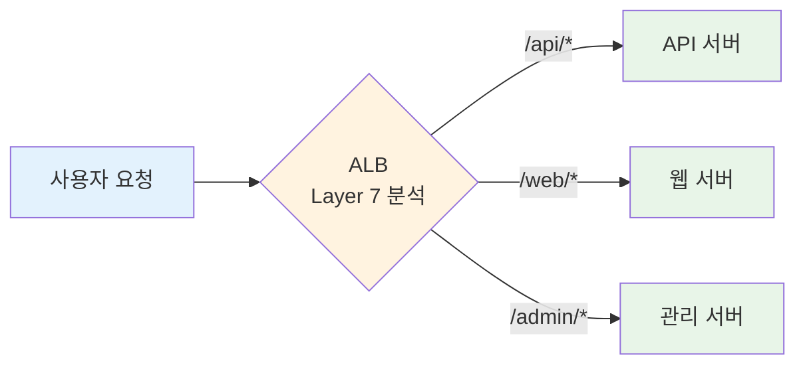

**라우팅 규칙**:
- URL 경로 기반: `/api` → API 서버, `/web` → 웹 서버
- 호스트 기반: `api.example.com` → API, `www.example.com` → 웹
- HTTP 헤더 기반: User-Agent, Custom Header

**2. 고정 진입점**:
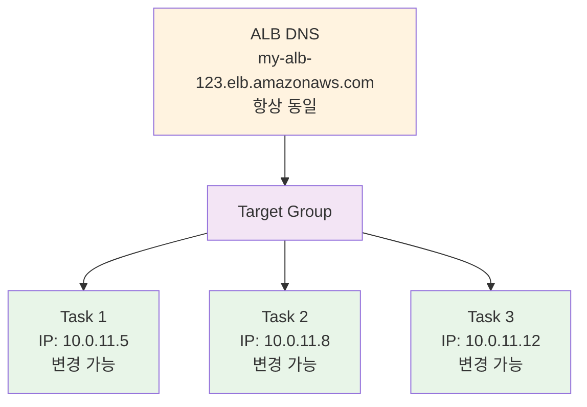

**3. SSL/TLS 종료**:
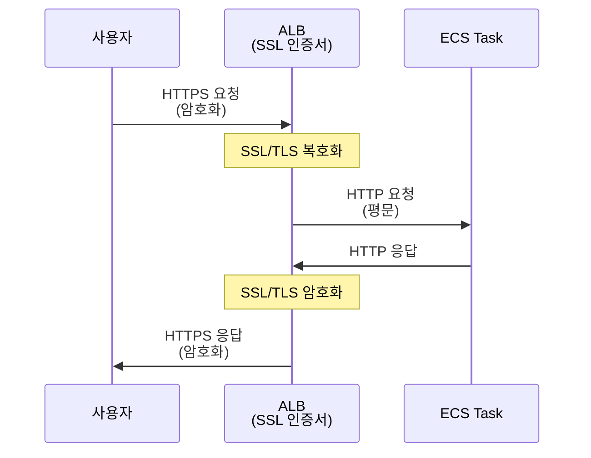

#### ALB 구성 요소

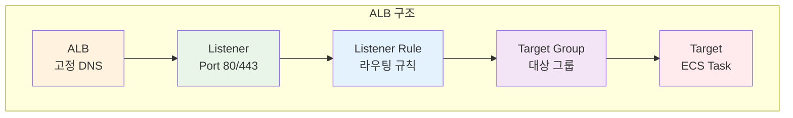

**구성 요소 설명**:
- **Listener**: 특정 포트(80, 443)에서 연결 수신
- **Listener Rule**: 요청을 어떤 Target Group으로 보낼지 결정
- **Target Group**: 트래픽을 받을 대상들의 그룹
- **Target**: 실제 트래픽을 처리하는 ECS Task

---

### 🔍 개념 2: Target Group (10분)

> **정의**: Target Group은 하나 이상의 등록된 대상(Target)으로 요청을 라우팅하는 논리적 그룹입니다.

#### ⚠️ 중요: Fargate 필수 설정

**AWS 공식 문서 (필수 요구사항)**:
> For services with tasks using the `awsvpc` network mode, when you create a target group for your service, you must choose `ip` as the target type, not `instance`. This is because tasks that use the `awsvpc` network mode are associated with an elastic network interface, not an Amazon EC2 instance.

**핵심 포인트**:
- ✅ **Fargate는 항상 `awsvpc` 네트워크 모드 사용**
- ✅ **Target Type은 반드시 `ip`로 설정**
- ❌ **`instance` 타입 사용 불가**
- 이유: Fargate Task는 ENI(Elastic Network Interface)를 가지며, EC2 인스턴스가 아님

#### Target Type 비교

**1. IP 타입** (Fargate 필수):
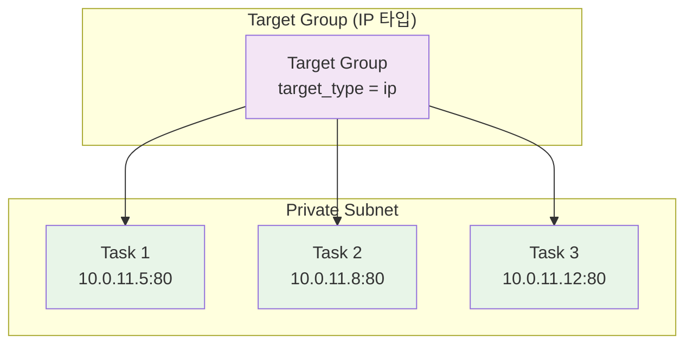

**특징**:
- ✅ Fargate Task는 IP 타입만 지원
- ✅ Task의 Private IP로 직접 통신
- ✅ Task 재시작 시 자동으로 IP 업데이트

**2. Instance 타입** (EC2 Launch Type):
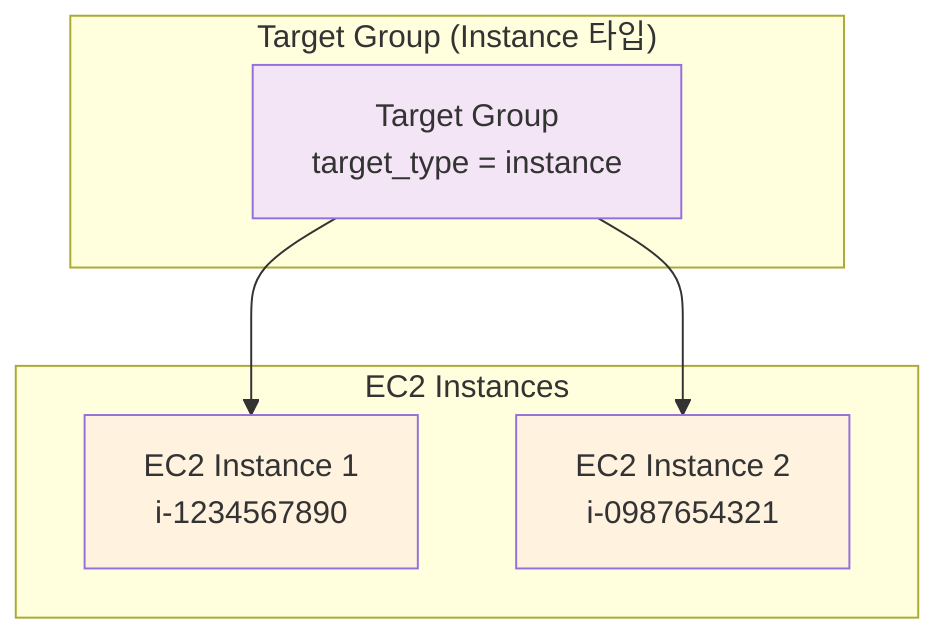

**특징**:
- EC2 인스턴스 ID로 등록
- Dynamic Port Mapping 사용

#### Target Group 설정

**주요 설정 항목**:
```hcl
resource "aws_lb_target_group" "app" {
  name        = "my-tg"
  port        = 80              # Target 포트
  protocol    = "HTTP"          # 프로토콜
  vpc_id      = aws_vpc.main.id
  target_type = "ip"            # Fargate는 "ip" 필수

  health_check {
    enabled             = true
    healthy_threshold   = 2     # 2번 성공 시 정상
    unhealthy_threshold = 2     # 2번 실패 시 비정상
    timeout             = 5     # 5초 타임아웃
    interval            = 30    # 30초마다 체크
    path                = "/"   # Health Check 경로
    matcher             = "200" # 성공 HTTP 코드
  }
}
```

---

### 🔍 개념 3: Health Check (10분)

> **정의**: Health Check는 Target의 상태를 주기적으로 확인하여 정상적인 Target에만 트래픽을 전송하도록 합니다.

#### Health Check 동작 원리

**정상 시나리오**:
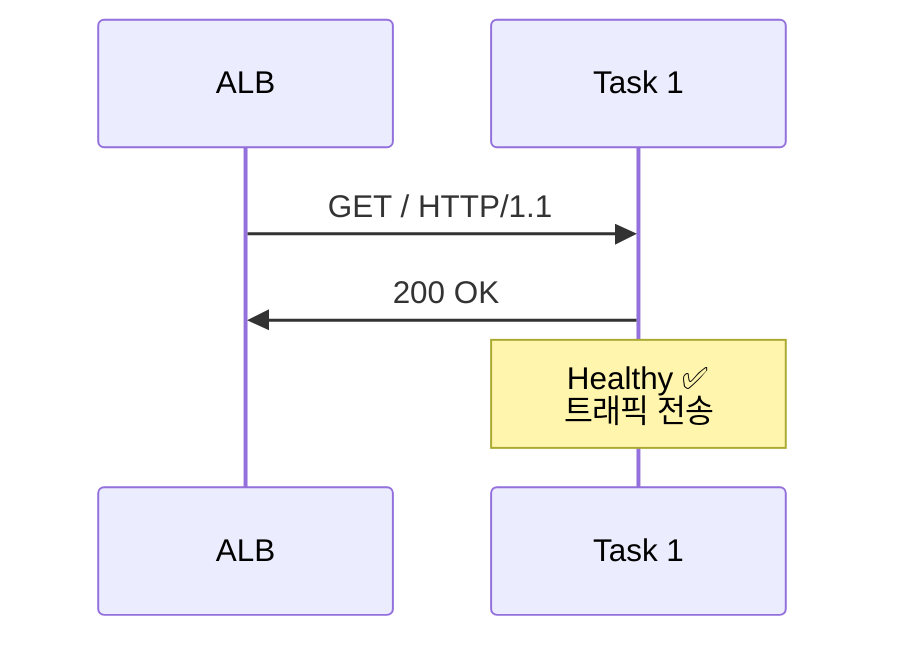

**비정상 시나리오**:
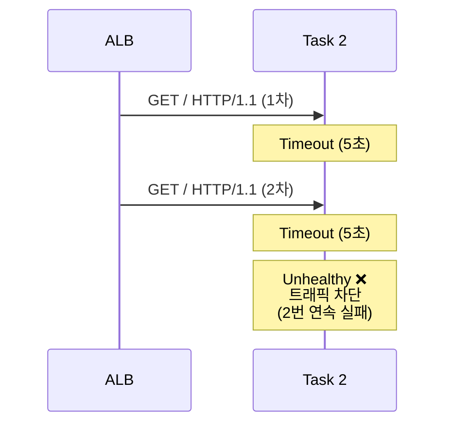

#### Health Check 상태 전이

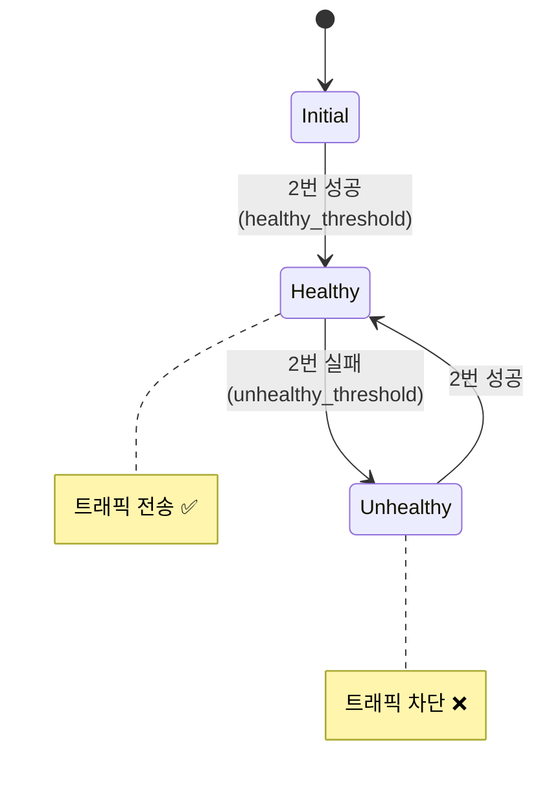

#### Health Check 설정 최적화

**빠른 장애 감지** (프로덕션 권장):
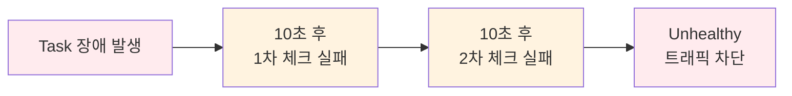

```hcl
health_check {
  interval            = 10  # 10초마다 체크
  timeout             = 5   # 5초 타임아웃
  healthy_threshold   = 2   # 2번 성공 시 정상
  unhealthy_threshold = 2   # 2번 실패 시 비정상
}

장애 감지 시간: 10초 × 2회 = 20초
복구 감지 시간: 10초 × 2회 = 20초
```

**느린 장애 감지** (개발 환경):
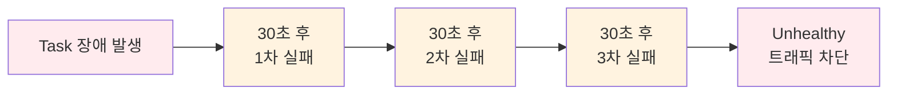

```hcl
health_check {
  interval            = 30  # 30초마다 체크
  timeout             = 5   # 5초 타임아웃
  healthy_threshold   = 3   # 3번 성공 시 정상
  unhealthy_threshold = 3   # 3번 실패 시 비정상
}

장애 감지 시간: 30초 × 3회 = 90초
복구 감지 시간: 30초 × 3회 = 90초
```

---

## 🏗️ ECS + ALB 통합 아키텍처 (5분)

### 전체 구조

```mermaid
graph TB
    subgraph "Internet"
        User[사용자]
    end
    
    subgraph "VPC"
        subgraph "Public Subnet"
            ALB[Application Load Balancer<br/>DNS: my-alb.elb.amazonaws.com]
        end
        
        subgraph "Private Subnet"
            subgraph "ECS Cluster"
                T1[Task 1<br/>10.0.11.5:80<br/>Healthy ✅]
                T2[Task 2<br/>10.0.11.8:80<br/>Healthy ✅]
                T3[Task 3<br/>10.0.11.12:80<br/>Unhealthy ❌]
            end
        end
        
        TG[Target Group<br/>Health Check: GET /]
    end
    
    User --> ALB
    ALB --> TG
    TG --> T1
    TG --> T2
    TG -.X T3
    
    style User fill:#e3f2fd
    style ALB fill:#fff3e0
    style TG fill:#f3e5f5
    style T1 fill:#e8f5e8
    style T2 fill:#e8f5e8
    style T3 fill:#ffebee
```

### 트래픽 흐름

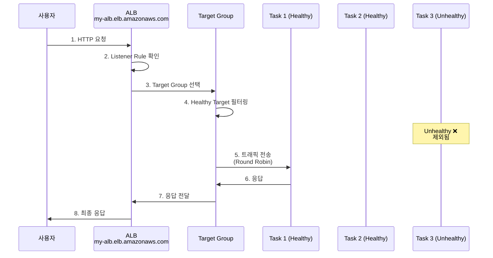

**단계별 설명**:
1. **사용자 요청**: `http://my-alb.elb.amazonaws.com`
2. **ALB 수신**: Listener (Port 80) 확인
3. **Target Group 선택**: Listener Rule에 따라 TG 선택
4. **Healthy Target 필터링**: Unhealthy Task 제외
5. **트래픽 전송**: Round Robin 방식으로 분산
6-8. **응답 반환**: Task → TG → ALB → 사용자

---

## 💡 실무 베스트 프랙티스 (5분)

### ✅ 권장 사항

**1. Health Check 경로 분리**:
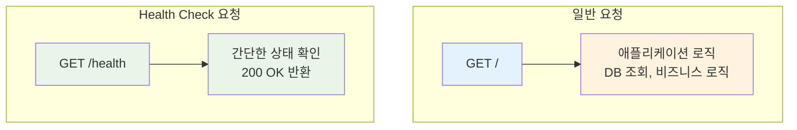

**이유**:
- Health Check 로그와 실제 트래픽 로그 분리
- Health Check 전용 로직 구현 가능
- 데이터베이스 연결 상태 등 확인 가능

**2. Deregistration Delay 설정**:
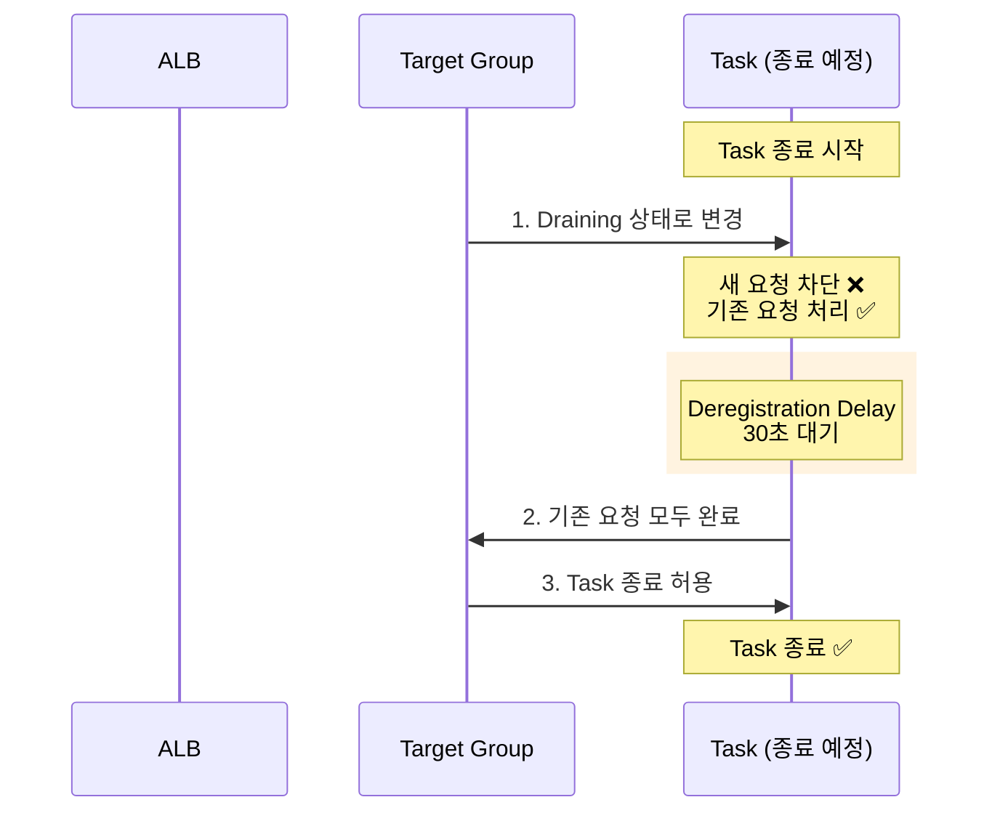

```hcl
resource "aws_lb_target_group" "app" {
  deregistration_delay = 30  # 30초

  # Task 종료 시:
  # 1. Target Group에서 제거 (새 요청 차단)
  # 2. 30초 대기 (기존 요청 처리 완료)
  # 3. Task 종료
}
```

**3. Connection Draining (무중단 배포)**:
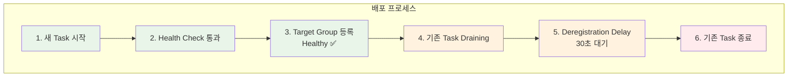

**결과**: 무중단 배포 ✅

### ❌ 피해야 할 실수

**1. Health Check 경로 미설정**:
```
❌ path = "/"
   → 실제 애플리케이션 로직 실행
   → 불필요한 부하

✅ path = "/health"
   → 간단한 상태 확인만
```

**2. Timeout 너무 짧게 설정**:
```
❌ timeout = 2
   → 느린 응답도 실패로 판단
   → 정상 Task도 Unhealthy 처리

✅ timeout = 5
   → 충분한 응답 시간 제공
```

**3. Threshold 너무 높게 설정**:
```
❌ unhealthy_threshold = 10
   → 장애 감지 시간: 30초 × 10 = 300초 (5분)
   → 장애 Task에 5분간 트래픽 전송

✅ unhealthy_threshold = 2
   → 장애 감지 시간: 30초 × 2 = 60초
```

---

## 🔗 다음 Session 연계

### Session 2: ECS Auto Scaling
- ALB 메트릭 기반 Auto Scaling
- Target Tracking 정책
- CPU/Memory 사용률 모니터링

### Lab 1: Terraform으로 전체 구축
- VPC + ALB + ECS + Auto Scaling
- Health Check 설정
- 무중단 배포 테스트

---

## 📚 참고 자료

### AWS 공식 문서 (필수 확인)
- 📘 [Use an Application Load Balancer for Amazon ECS](https://docs.aws.amazon.com/AmazonECS/latest/developerguide/alb.html)
- 📗 [Service Load Balancing](https://docs.aws.amazon.com/AmazonECS/latest/developerguide/service-load-balancing.html)
- 📙 [Application Load Balancer User Guide](https://docs.aws.amazon.com/elasticloadbalancing/latest/application/)
- 📕 [Target Groups](https://docs.aws.amazon.com/elasticloadbalancing/latest/application/load-balancer-target-groups.html)
- 📙 [Health Checks](https://docs.aws.amazon.com/elasticloadbalancing/latest/application/target-group-health-checks.html)
- 🆕 [Optimize Health Check Parameters](https://docs.aws.amazon.com/AmazonECS/latest/developerguide/load-balancer-healthcheck.html)
- 🆕 [Optimize Connection Draining](https://docs.aws.amazon.com/AmazonECS/latest/developerguide/load-balancer-connection-draining.html)

---

<div align="center">

**⚖️ 로드 밸런싱** • **💚 Health Check** • **🎯 고가용성** • **🔄 무중단 배포**

*ALB로 안정적인 ECS Service 운영*

</div>
