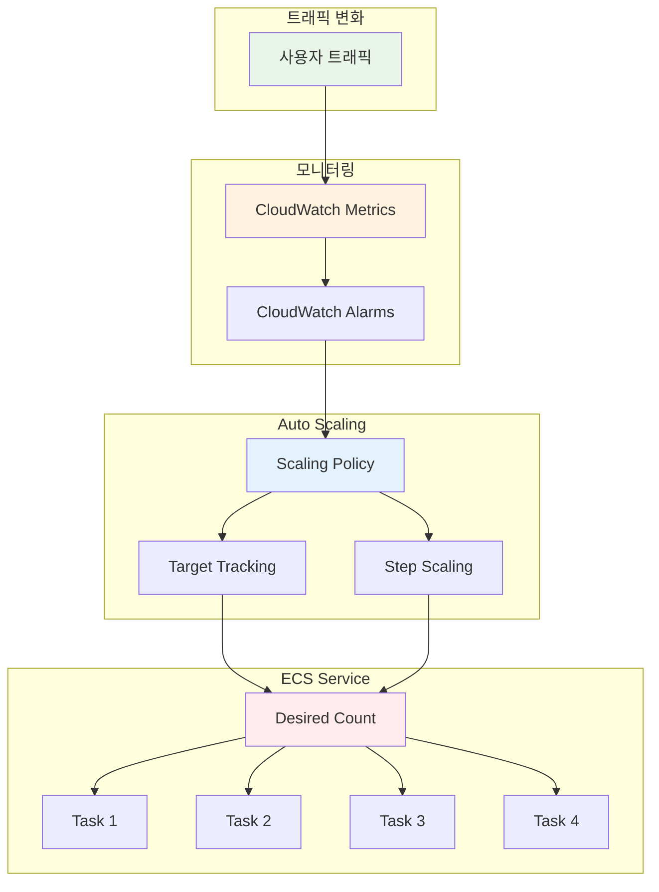
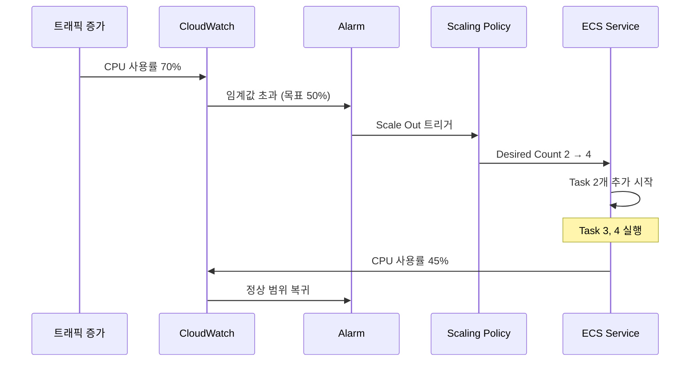

# November Week 2 Day 4 Session 2: ECS Auto Scaling & 운영

<div align="center">

**📈 Auto Scaling** • **📊 CloudWatch** • **🔍 모니터링** • **🛠️ 운영**

*ECS Service 자동 확장 및 운영 관리*

</div>

---

## 🕘 세션 정보
**시간**: 09:40-10:20 (40분)
**목표**: ECS Service Auto Scaling 및 운영 모니터링 이해
**방식**: 이론 강의 + 실무 운영 사례

## 🎯 학습 목표
- ECS Service Auto Scaling의 동작 원리 이해
- Target Tracking, Step Scaling 정책 파악
- CloudWatch 메트릭 및 알람 설정 방법 습득
- 실무 운영 및 트러블슈팅 능력 향상

---

## 📖 서비스 개요

### 1. 생성 배경 (Why?) - 5분

**문제 상황**:
- **고정된 Task 수**: 트래픽 변화에 대응 불가
- **수동 스케일링**: 트래픽 급증 시 수동으로 Task 추가
- **리소스 낭비**: 트래픽 적을 때도 많은 Task 실행
- **비용 증가**: 불필요한 리소스 사용으로 비용 상승

**AWS ECS Auto Scaling 솔루션**:
- **자동 확장**: 트래픽에 따라 Task 수 자동 조정
- **Target Tracking**: 목표 메트릭 유지 (CPU 50%)
- **Step Scaling**: 단계별 확장 (트래픽 급증 대응)
- **Scheduled Scaling**: 예측 가능한 패턴 대응

### 2. 핵심 원리 (How?) - 10분

**ECS Auto Scaling 아키텍처**:


**Auto Scaling 동작 흐름**:


**핵심 스케일링 정책**:

**1. Target Tracking Scaling**:
- **목표 메트릭 유지**: CPU 50%, Memory 70%
- **자동 조정**: 목표값 유지하도록 Task 수 조정
- **가장 간단**: 설정 및 관리 용이

**2. Step Scaling**:
- **단계별 확장**: 메트릭 범위에 따라 다른 확장
- **급격한 변화 대응**: 트래픽 급증 시 빠른 확장
- **세밀한 제어**: 여러 단계 설정 가능

**3. Scheduled Scaling**:
- **예측 가능한 패턴**: 특정 시간에 확장
- **비용 최적화**: 필요한 시간에만 리소스 사용
- **정기 작업**: 배치 작업, 이벤트 대응

### 3. 주요 사용 사례 (When?) - 5분

**적합한 경우**:

**Target Tracking 사용 시나리오**:
- **일반적인 웹 서비스**: CPU/메모리 기반 확장
- **안정적인 트래픽**: 점진적 변화
- **간단한 설정**: 빠른 구현 필요

**Step Scaling 사용 시나리오**:
- **트래픽 급증**: 이벤트, 프로모션
- **세밀한 제어**: 단계별 다른 확장 비율
- **비용 최적화**: 과도한 확장 방지

**Scheduled Scaling 사용 시나리오**:
- **정기 배치 작업**: 매일 새벽 데이터 처리
- **예측 가능한 패턴**: 점심시간, 저녁시간 트래픽
- **이벤트 대응**: 특정 날짜/시간 확장

**실제 사례**:
- **Netflix**: Target Tracking으로 스트리밍 서비스 확장
- **Expedia**: Step Scaling으로 검색 트래픽 대응
- **Airbnb**: Scheduled Scaling으로 예약 피크 시간 대응

### 4. 비슷한 서비스 비교 (Which?) - 5분

**AWS 내 대안 서비스**:

**ECS Auto Scaling vs EC2 Auto Scaling**:
- **언제 ECS Auto Scaling 사용**:
  - 컨테이너 기반 애플리케이션
  - Task 수준 확장
  - Fargate 사용
  
- **언제 EC2 Auto Scaling 사용**:
  - 인스턴스 수준 확장
  - EC2 기반 ECS
  - 클러스터 용량 관리

**ECS Auto Scaling vs Lambda Auto Scaling**:
- **언제 ECS Auto Scaling 사용**:
  - 장시간 실행 (> 15분)
  - 상태 저장 (Stateful)
  - 컨테이너 이미지 사용
  
- **언제 Lambda Auto Scaling 사용**:
  - 단기 실행 (< 15분)
  - 상태 비저장 (Stateless)
  - 이벤트 기반 처리

**선택 기준**:
| 기준 | Target Tracking | Step Scaling | Scheduled Scaling | Lambda |
|------|-----------------|--------------|-------------------|--------|
| **설정 복잡도** | 낮음 | 중간 | 낮음 | 매우 낮음 |
| **반응 속도** | 중간 | 빠름 | 즉시 | 매우 빠름 |
| **세밀한 제어** | 낮음 | 높음 | 중간 | 낮음 |
| **비용 효율** | 높음 | 중간 | 매우 높음 | 높음 |
| **적합한 워크로드** | 일반 웹 | 트래픽 급증 | 정기 작업 | 이벤트 기반 |

### 5. 장단점 분석 - 3분

**ECS Auto Scaling 장점**:
- ✅ 자동 확장으로 수동 개입 불필요
- ✅ 트래픽 변화에 빠른 대응
- ✅ 비용 최적화 (필요한 만큼만 실행)
- ✅ 고가용성 유지 (최소 Task 수 보장)
- ✅ CloudWatch 통합 (메트릭 기반 확장)

**ECS Auto Scaling 단점/제약사항**:
- ⚠️ 확장 지연 (Task 시작 시간 30-60초)
- ⚠️ 과도한 확장 가능 (임계값 설정 중요)
- ⚠️ 비용 예측 어려움 (트래픽 변동 시)
- ⚠️ Cooldown 기간 필요 (빈번한 확장 방지)

**대안**:
- **예측 가능한 트래픽**: Scheduled Scaling 사용
- **초단기 실행**: Lambda 사용
- **고정 워크로드**: Auto Scaling 미사용

### 6. 비용 구조 💰 - 5분

**Auto Scaling 과금 방식**:
- **Auto Scaling 자체**: 무료
- **CloudWatch 메트릭**: 기본 메트릭 무료, 커스텀 메트릭 $0.30/메트릭/월
- **CloudWatch 알람**: $0.10/알람/월
- **Fargate Task**: 실행된 Task만큼 과금

**프리티어 혜택**:
- **CloudWatch 알람**: 10개 무료
- **CloudWatch 메트릭**: 기본 메트릭 무료

**비용 최적화 팁**:
1. **적절한 임계값 설정**: 과도한 확장 방지
   ```json
   {
     "TargetValue": 50.0,  // CPU 50% 유지
     "ScaleInCooldown": 300,  // 5분 대기
     "ScaleOutCooldown": 60   // 1분 대기
   }
   ```

2. **Minimum/Maximum 설정**: 비용 상한선
   ```json
   {
     "MinCapacity": 2,  // 최소 2개
     "MaxCapacity": 10  // 최대 10개
   }
   ```

3. **Fargate Spot 활용**: 최대 70% 할인
4. **Scheduled Scaling**: 예측 가능한 패턴 대응

**예상 비용 (ap-northeast-2)**:
| 시나리오 | Task 수 | vCPU | 메모리 | 시간당 | 월간 (730시간) |
|----------|---------|------|--------|--------|----------------|
| **최소 (2 Task)** | 2 | 0.25 | 0.5GB | $0.024 | $17.52 |
| **평균 (5 Task)** | 5 | 0.25 | 0.5GB | $0.060 | $43.80 |
| **최대 (10 Task)** | 10 | 0.25 | 0.5GB | $0.120 | $87.60 |

**Auto Scaling 효과**:
| 시나리오 | 고정 (10 Task) | Auto Scaling (평균 5) | 절감 |
|----------|----------------|----------------------|------|
| **월간 비용** | $87.60 | $43.80 | **50%** |

**Lab 예상 비용**:
- CloudWatch 알람 (1개): $0.10/월
- Fargate Task (평균 3개, 1시간): $0.036
- 합계: ~$0.04 (1시간 실습 기준)

### 7. 최신 업데이트 🆕 - 2분

**2025년 주요 변경사항**:
- **Predictive Scaling**: 머신러닝 기반 예측 확장
- **더 빠른 확장**: Task 시작 시간 단축 (30초 → 20초)
- **향상된 메트릭**: 더 많은 기본 메트릭 제공

**2024년 주요 변경사항**:
- **Application Auto Scaling 통합**: ECS, Lambda, DynamoDB 통합 관리
- **커스텀 메트릭 지원**: 애플리케이션 메트릭 기반 확장
- **Cooldown 개선**: 더 세밀한 Cooldown 제어

**2026년 예정**:
- AI 기반 자동 임계값 설정
- 더 많은 스케일링 정책 옵션

**Deprecated 기능**:
- 없음 (지속적으로 개선 중)

**참조**: [ECS Auto Scaling What's New](https://aws.amazon.com/ecs/whats-new/)

### 8. 잘 사용하는 방법 ✅ - 3분

**베스트 프랙티스**:
1. **Target Tracking 우선**: 대부분의 경우 충분
2. **적절한 메트릭 선택**:
   - CPU-bound: CPU 사용률
   - Memory-bound: 메모리 사용률
   - Request-bound: ALB RequestCountPerTarget
3. **Cooldown 설정**: 빈번한 확장 방지
4. **최소/최대 설정**: 비용 및 성능 균형
5. **CloudWatch 알람**: 이상 징후 모니터링

**실무 팁**:
- **Target Tracking 설정**:
  ```json
  {
    "TargetTrackingScalingPolicyConfiguration": {
      "TargetValue": 50.0,
      "PredefinedMetricSpecification": {
        "PredefinedMetricType": "ECSServiceAverageCPUUtilization"
      },
      "ScaleInCooldown": 300,
      "ScaleOutCooldown": 60
    }
  }
  ```

- **Step Scaling 설정**:
  ```json
  {
    "StepScalingPolicyConfiguration": {
      "AdjustmentType": "PercentChangeInCapacity",
      "StepAdjustments": [
        {
          "MetricIntervalLowerBound": 0,
          "MetricIntervalUpperBound": 10,
          "ScalingAdjustment": 10
        },
        {
          "MetricIntervalLowerBound": 10,
          "ScalingAdjustment": 30
        }
      ],
      "Cooldown": 60
    }
  }
  ```

- **CloudWatch 알람**:
  ```bash
  aws cloudwatch put-metric-alarm \
    --alarm-name high-cpu \
    --alarm-description "CPU > 70%" \
    --metric-name CPUUtilization \
    --namespace AWS/ECS \
    --statistic Average \
    --period 60 \
    --threshold 70 \
    --comparison-operator GreaterThanThreshold \
    --evaluation-periods 2
  ```

**성능 최적화**:
- **메트릭 선택**: 애플리케이션 특성에 맞는 메트릭
- **임계값 조정**: 로드 테스트로 최적값 찾기
- **Cooldown 최적화**: Scale Out 빠르게, Scale In 천천히

### 9. 잘못 사용하는 방법 ❌ - 3분

**흔한 실수**:
1. **과도한 임계값**: CPU 90% → 확장 지연
   ```json
   // ❌ 잘못된 방법
   {
     "TargetValue": 90.0  // 너무 높음
   }
   
   // ✅ 올바른 방법
   {
     "TargetValue": 50.0  // 여유 있게
   }
   ```

2. **Cooldown 미설정**: 빈번한 확장으로 비용 증가
3. **최대값 미설정**: 무제한 확장으로 비용 폭증
4. **잘못된 메트릭**: CPU 대신 메모리 사용해야 하는 경우
5. **Health Check Grace Period 부족**: 시작 중인 Task Unhealthy 판정

**안티 패턴**:
- **단일 메트릭 의존**: 여러 메트릭 조합 권장
- **Scheduled Scaling만 사용**: 예상치 못한 트래픽 대응 불가
- **Auto Scaling 미사용**: 수동 관리로 비효율

**보안 취약점**:
- **IAM 권한 과다**: Auto Scaling에 필요한 최소 권한만
  ```json
  {
    "Effect": "Allow",
    "Action": [
      "ecs:DescribeServices",
      "ecs:UpdateService",
      "cloudwatch:PutMetricAlarm",
      "cloudwatch:DescribeAlarms"
    ],
    "Resource": "*"
  }
  ```
- **CloudWatch Logs 미수집**: 확장 이유 추적 불가
- **알람 미설정**: 이상 징후 감지 불가

### 10. 구성 요소 상세 - 5분

**ECS Auto Scaling 주요 구성 요소**:

**1. Scaling Policy**:
- **Target Tracking**:
  ```json
  {
    "PolicyName": "cpu-target-tracking",
    "PolicyType": "TargetTrackingScaling",
    "TargetTrackingScalingPolicyConfiguration": {
      "TargetValue": 50.0,
      "PredefinedMetricSpecification": {
        "PredefinedMetricType": "ECSServiceAverageCPUUtilization"
      },
      "ScaleInCooldown": 300,
      "ScaleOutCooldown": 60
    }
  }
  ```

- **Step Scaling**:
  ```json
  {
    "PolicyName": "cpu-step-scaling",
    "PolicyType": "StepScaling",
    "StepScalingPolicyConfiguration": {
      "AdjustmentType": "PercentChangeInCapacity",
      "StepAdjustments": [
        {
          "MetricIntervalLowerBound": 0,
          "MetricIntervalUpperBound": 10,
          "ScalingAdjustment": 10
        },
        {
          "MetricIntervalLowerBound": 10,
          "ScalingAdjustment": 30
        }
      ],
      "Cooldown": 60
    }
  }
  ```

**2. CloudWatch 메트릭**:
- **기본 메트릭**:
  - `CPUUtilization`: CPU 사용률
  - `MemoryUtilization`: 메모리 사용률
  - `ALBRequestCountPerTarget`: Target당 요청 수
  
- **커스텀 메트릭**:
  ```python
  import boto3
  
  cloudwatch = boto3.client('cloudwatch')
  cloudwatch.put_metric_data(
      Namespace='MyApp',
      MetricData=[{
          'MetricName': 'QueueDepth',
          'Value': 100,
          'Unit': 'Count'
      }]
  )
  ```

**3. Scalable Target**:
```json
{
  "ServiceNamespace": "ecs",
  "ResourceId": "service/my-cluster/my-service",
  "ScalableDimension": "ecs:service:DesiredCount",
  "MinCapacity": 2,
  "MaxCapacity": 10
}
```

**4. CloudWatch 알람**:
```json
{
  "AlarmName": "high-cpu",
  "MetricName": "CPUUtilization",
  "Namespace": "AWS/ECS",
  "Statistic": "Average",
  "Period": 60,
  "EvaluationPeriods": 2,
  "Threshold": 70.0,
  "ComparisonOperator": "GreaterThanThreshold",
  "Dimensions": [
    {
      "Name": "ServiceName",
      "Value": "my-service"
    },
    {
      "Name": "ClusterName",
      "Value": "my-cluster"
    }
  ]
}
```

**의존성**:
- **ECS Service → Auto Scaling**: Service에 Scaling Policy 연결
- **CloudWatch → Auto Scaling**: 메트릭 기반 확장 결정
- **IAM → Auto Scaling**: Application Auto Scaling 역할 필요
- **ALB → CloudWatch**: Target 메트릭 수집

### 11. 공식 문서 링크 (필수 5개)

**⚠️ 학생들이 직접 확인해야 할 공식 문서**:
- 📘 [ECS Service Auto Scaling](https://docs.aws.amazon.com/AmazonECS/latest/developerguide/service-auto-scaling.html)
- 📗 [Auto Scaling 베스트 프랙티스](https://docs.aws.amazon.com/AmazonECS/latest/developerguide/capacity-autoscaling-best-practice.html)
- 📙 [CloudWatch 메트릭](https://docs.aws.amazon.com/AmazonECS/latest/developerguide/cloudwatch-metrics.html)
- 📕 [Application Auto Scaling 요금](https://aws.amazon.com/autoscaling/pricing/)
- 🆕 [ECS 최신 업데이트](https://aws.amazon.com/ecs/whats-new/)

---

## 💭 함께 생각해보기

### 🤝 페어 토론 (5분)
**토론 주제**:
1. **스케일링 정책**: Target Tracking vs Step Scaling 언제 사용?
2. **메트릭 선택**: CPU vs 메모리 vs 요청 수?
3. **비용 최적화**: Auto Scaling으로 비용을 얼마나 줄일 수 있을까?

### 🎯 전체 공유 (3분)
- **인사이트 공유**: 페어 토론에서 나온 좋은 아이디어
- **질문 수집**: 아직 이해가 어려운 부분
- **다음 연결**: Lab 1 (프로덕션급 ECS 배포)

### 💡 이해도 체크 질문
- ✅ "Target Tracking과 Step Scaling의 차이를 설명할 수 있나요?"
- ✅ "Cooldown이 왜 필요한지 이해했나요?"
- ✅ "어떤 메트릭을 선택해야 하는지 아나요?"

---

## 🔑 핵심 키워드

- **Target Tracking Scaling**: 목표 메트릭 유지 정책
- **Step Scaling**: 단계별 확장 정책
- **Scheduled Scaling**: 예약된 시간 확장
- **Cooldown**: 확장 후 대기 시간
- **Scalable Target**: Auto Scaling 대상
- **CloudWatch Metrics**: 확장 기준 메트릭
- **Desired Count**: 원하는 Task 수

---

## 📝 세션 마무리

### ✅ 오늘 세션 성과
- [ ] ECS Service Auto Scaling 동작 원리 이해
- [ ] Target Tracking, Step Scaling 정책 파악
- [ ] CloudWatch 메트릭 및 알람 설정 방법 습득
- [ ] 비용 최적화 및 운영 방법 학습

### 🎯 다음 Lab 준비
- **Lab 1: 프로덕션급 ECS 배포** - ALB + Auto Scaling 통합
- **연계 내용**: Session 1 (ALB) + Session 2 (Auto Scaling) 통합
- **사전 학습**: Terraform 기본 명령어 복습

---

<div align="center">

**📈 자동 확장** • **📊 메트릭 기반** • **💰 비용 최적화**

*Lab 1에서 ALB + Auto Scaling 통합 실습을 진행합니다*

</div>
