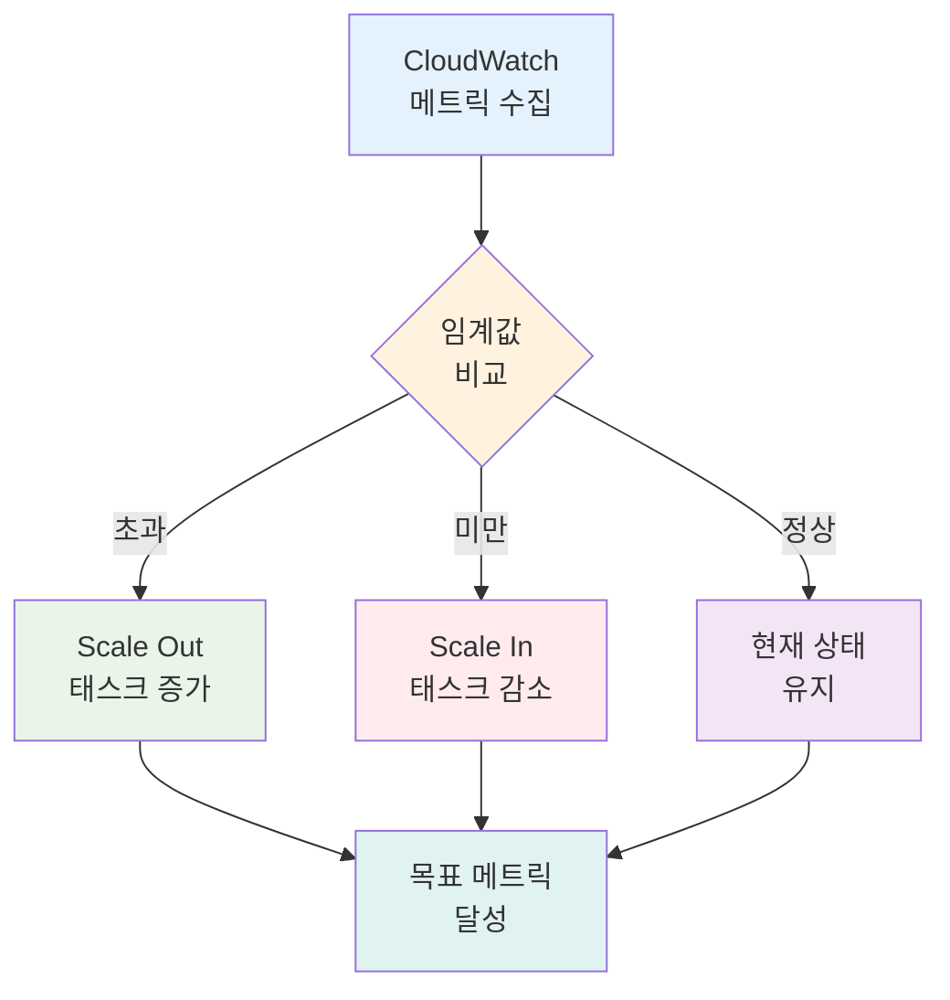
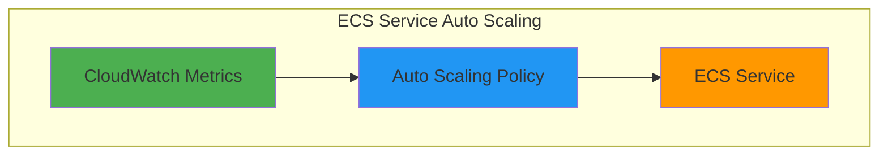
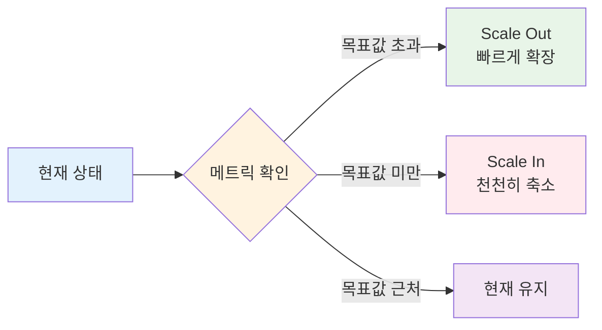
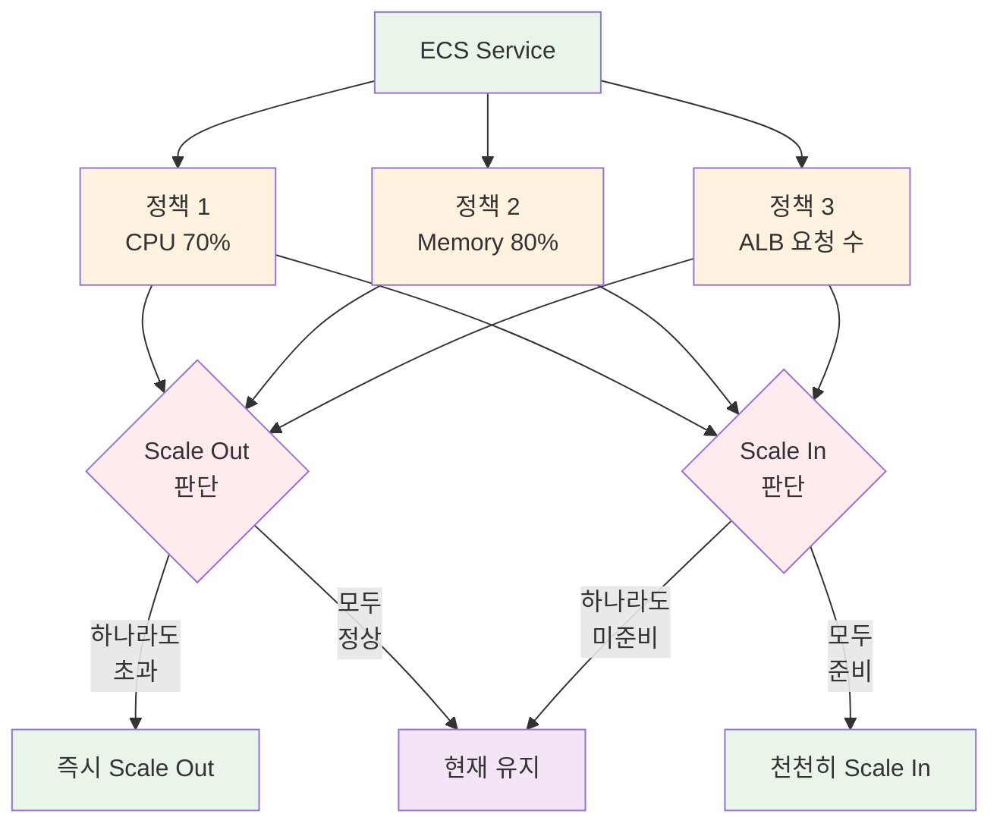

# November Week 2 Day 4 Session 2: ECS Auto Scaling (10:00-10:50)

**🔄 자동 확장** • **📊 메트릭 기반** • **⚡ 가용성 우선**

*트래픽 변화에 자동으로 대응하는 탄력적 서비스*

---

## 🕘 세션 정보
**시간**: 10:00-10:50 (50분)
**목표**: ECS Service Auto Scaling 이해 및 정책 설계
**방식**: 이론 설명 + 실습 준비

## 🎯 세션 목표

### 📚 학습 목표
- **이해 목표**: Auto Scaling의 필요성과 동작 원리 이해
- **적용 목표**: Target Tracking 정책 설계 및 구성
- **협업 목표**: 적절한 메트릭과 임계값 선택 토론

### 🤔 왜 필요한가? (5분)

**현실 문제 상황**:
- 💼 **실무 시나리오**: "새벽 2시에 갑자기 트래픽이 10배 증가했어요. 서비스가 다운됐습니다."
- 🏠 **일상 비유**: "식당에 손님이 갑자기 몰리면 직원을 더 부르듯이, 서비스도 자동으로 확장되어야 합니다"
- ☁️ **AWS 아키텍처**: "ECS Service Auto Scaling + CloudWatch Alarms로 자동 대응"
- 📊 **시장 동향**: "Netflix, Amazon 등 대규모 서비스의 필수 기능"

**학습 전후 비교**:

---

## 📖 핵심 개념 (35분)

### 🔍 개념 1: Auto Scaling 기본 원리 (12분)

> **정의**: 트래픽이나 리소스 사용량에 따라 ECS 태스크 수를 자동으로 조정하는 기능

**상세 설명**:
- **핵심 원리**: CloudWatch 메트릭 모니터링 → 임계값 초과 → 태스크 수 조정
- **주요 특징**:
  - 자동 CloudWatch 알람 생성 및 관리
  - 목표 메트릭 값 유지
  - 급격한 변화 최소화
- **사용 목적**: 가용성 보장 + 비용 최적화

**시각적 이해**:

**🔧 AWS 구현 예시**:

**🔧 AWS 서비스 매핑**:
- **ECS Service** → **Auto Scaling Target**: 확장 대상 서비스
- **CloudWatch Metrics** → **모니터링**: CPU, Memory, ALB 메트릭
- **Auto Scaling Policy** → **확장 규칙**: Target Tracking, Step Scaling

---

### 🔍 개념 2: Target Tracking Scaling Policy (12분)

> **정의**: 목표 메트릭 값을 설정하면 AWS가 자동으로 CloudWatch 알람을 생성하고 스케일링을 관리하는 정책

**단계별 이해**:

**1단계: 기본 동작**
- 목표 메트릭 값 설정 (예: CPU 70%)
- AWS가 자동으로 CloudWatch 알람 생성
- 메트릭이 목표값을 벗어나면 자동 조정

**2단계: Scale Out vs Scale In**

**3단계: 가용성 우선 원칙**
> "The intention of Service Auto Scaling is to always prioritize availability"

- **Scale Out**: 빠르게 확장 (애플리케이션 가용성 우선)
- **Scale In**: 천천히 축소 (보수적 접근)
- **배포 중**: Scale-in 중지, Scale-out은 계속

**실무 연결**:
- **사용 사례**: CPU/Memory 기반 확장, ALB 요청 수 기반 확장
- **장점**: 
  - 수동 알람 설정 불필요
  - 자동으로 최적 용량 유지
  - 급격한 변화 방지
- **단점**: 
  - 메트릭이 목표값보다 낮을 때는 Scale Out 불가
  - 데이터 부족 시 스케일링 안 함

---

### 🔍 개념 3: 다중 정책 및 메트릭 선택 (11분)

> **정의**: 여러 Target Tracking 정책을 동시에 사용하여 다양한 메트릭 기반 확장 가능

**개념 간 관계**:

**종합 비교표**:
| 구분 | Target Tracking | Step Scaling | Scheduled Scaling |
|------|-----------------|--------------|-------------------|
| **목적** | 목표 메트릭 유지 | 단계별 확장 | 예측 가능한 패턴 |
| **특징** | 자동 알람 관리 | 세밀한 제어 | 시간 기반 |
| **사용 시기** | 일반적인 경우 | 복잡한 로직 | 주기적 트래픽 |
| **장점** | 설정 간단 | 유연한 제어 | 예측 가능 |
| **주의사항** | 목표값 초과만 Scale Out | 알람 직접 관리 | 예상 빗나가면 비효율 |

**주요 메트릭 선택**:

**1. ECSServiceAverageCPUUtilization**
- **사용 시기**: CPU 집약적 워크로드
- **권장 임계값**: 70-80%
- **예시**: 데이터 처리, 계산 작업

**2. ECSServiceAverageMemoryUtilization**
- **사용 시기**: 메모리 집약적 워크로드
- **권장 임계값**: 80-90%
- **예시**: 캐싱, 인메모리 DB

**3. ALBRequestCountPerTarget**
- **사용 시기**: 웹 애플리케이션
- **권장 임계값**: 태스크당 1000 요청/분
- **예시**: API 서버, 웹 서비스
- **⚠️ 제약**: Blue/Green 배포 미지원

**🔑 핵심 키워드 정리**:
- **Target Tracking**: 목표 메트릭 기반 자동 확장
- **Scale Out**: 빠른 확장 (가용성 우선)
- **Scale In**: 천천히 축소 (보수적 접근)
- **CloudWatch Alarms**: 자동 생성 및 관리
- **다중 정책**: 여러 메트릭 동시 사용 가능

---

## 💭 함께 생각해보기 (10분)

### 🤝 페어 토론 (5분)

**토론 주제**:
1. **메트릭 선택**: "우리 서비스에 가장 적합한 메트릭은 무엇일까요?"
   - CPU vs Memory vs ALB 요청 수
   - 여러 메트릭을 함께 사용해야 할까요?

2. **임계값 설정**: "목표 메트릭 값을 어떻게 정해야 할까요?"
   - 너무 낮으면? (비용 증가)
   - 너무 높으면? (성능 저하)

3. **실무 적용**: "배포 중에는 왜 Scale-in이 중지될까요?"
   - 가용성 보장
   - 안정적인 배포

**페어 활동 가이드**:
- 👥 **자유 페어링**: 관심사나 경험이 비슷한 사람끼리
- 🔄 **역할 교대**: 5분씩 설명자/질문자 역할 바꾸기
- 📝 **핵심 정리**: 대화 내용 중 중요한 점 메모하기

### 🎯 전체 공유 (5분)

**인사이트 공유**:
- 각 페어에서 나온 좋은 아이디어
- 메트릭 선택 기준
- 임계값 설정 경험

**질문 수집**:
- Auto Scaling 관련 궁금한 점
- 실무 적용 시 고려사항

**다음 연결**:
- Session 3에서 실제 정책 구성 방법 학습
- Lab 1에서 직접 Auto Scaling 설정

**💡 이해도 체크 질문**:
- ✅ "Target Tracking과 Step Scaling의 차이를 설명할 수 있나요?"
- ✅ "왜 Scale Out은 빠르고 Scale In은 느릴까요?"
- ✅ "다중 정책 사용 시 Scale Out/In 판단 기준은?"

---

## 🔗 공식 문서 (필수)

**⚠️ 학생들이 직접 확인해야 할 공식 문서**:
- 📘 [ECS Service Auto Scaling이란?](https://docs.aws.amazon.com/AmazonECS/latest/developerguide/service-auto-scaling.html)
- 📗 [Target Tracking Scaling Policies](https://docs.aws.amazon.com/AmazonECS/latest/developerguide/service-autoscaling-targettracking.html)
- 📙 [Step Scaling Policies](https://docs.aws.amazon.com/AmazonECS/latest/developerguide/service-autoscaling-stepscaling.html)
- 📕 [CloudWatch Metrics for ECS](https://docs.aws.amazon.com/AmazonECS/latest/developerguide/cloudwatch-metrics.html)
- 🆕 [ECS Auto Scaling 최신 업데이트](https://aws.amazon.com/about-aws/whats-new/containers/)

---

## 📝 세션 마무리

### ✅ 오늘 세션 성과
- [ ] Auto Scaling의 필요성과 동작 원리 이해
- [ ] Target Tracking 정책의 특징 파악
- [ ] 다중 정책 사용 시나리오 이해
- [ ] 적절한 메트릭 선택 기준 습득

### 🎯 다음 세션 준비
- **Session 3**: Terraform으로 Auto Scaling 구성
- **연계 내용**: 실제 정책 코드 작성 및 배포
- **사전 준비**: Terraform 기본 문법 복습

### 🔮 다음 학습 예고
- **Lab 1**: ECS Service + ALB + Auto Scaling 통합 구성
- **실습 내용**: CPU 기반 Target Tracking 정책 설정
- **검증**: 부하 테스트로 자동 확장 확인

---

**🔄 자동 확장** • **📊 메트릭 기반** • **⚡ 가용성 우선** • **🤝 협업 학습**

*다음 세션에서는 Terraform으로 Auto Scaling을 직접 구성합니다*

