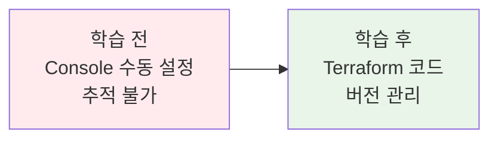
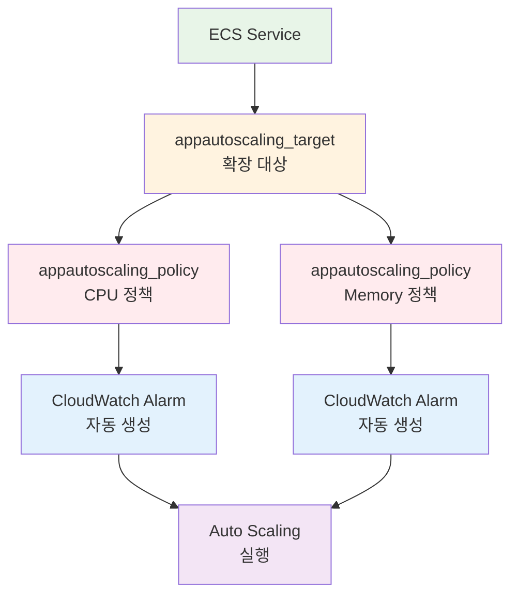
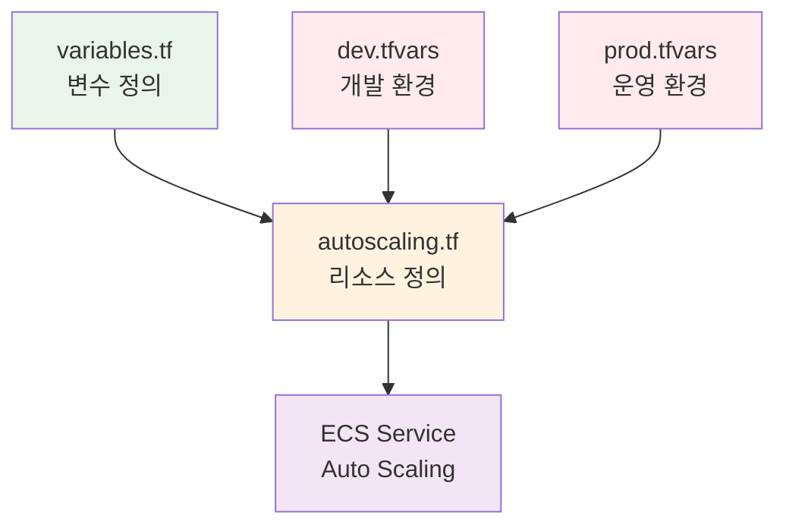

# November Week 2 Day 4 Session 3: Terraform으로 Auto Scaling 구성 (11:00-11:50)

<div align="center">

**📝 IaC 구현** • **🔄 Auto Scaling** • **🎯 실전 코드**

*Terraform으로 ECS Auto Scaling을 코드로 관리하기*

</div>

---

## 🕘 세션 정보
**시간**: 11:00-11:50 (50분)
**목표**: Terraform으로 ECS Auto Scaling 정책 구성
**방식**: 코드 중심 설명 + 실습 준비

## 🎯 세션 목표

### 📚 학습 목표
- **이해 목표**: Terraform Auto Scaling 리소스 구조 이해
- **적용 목표**: Target Tracking 정책을 Terraform 코드로 작성
- **협업 목표**: 코드 리뷰를 통한 베스트 프랙티스 공유

### 🤔 왜 필요한가? (5분)

**현실 문제 상황**:
- 💼 **실무 시나리오**: "AWS Console로 설정한 Auto Scaling 정책이 누가 언제 어떻게 바꿨는지 모르겠어요"
- 🏠 **일상 비유**: "레시피를 문서화하면 누구나 같은 요리를 만들 수 있듯이, 인프라도 코드로 관리해야 합니다"
- ☁️ **AWS 아키텍처**: "Terraform으로 Auto Scaling 정책을 버전 관리하고 재사용"
- 📊 **시장 동향**: "IaC는 현대 DevOps의 필수 요소"

**학습 전후 비교**:


---

## 📖 핵심 개념 (35분)

### 🔍 개념 1: Auto Scaling 리소스 구조 (12분)

> **정의**: Terraform에서 ECS Auto Scaling을 구성하는 3가지 핵심 리소스

**상세 설명**:
- **핵심 원리**: Target → Policy → CloudWatch (자동 생성)
- **주요 특징**:
  - `aws_appautoscaling_target`: 확장 대상 정의
  - `aws_appautoscaling_policy`: 확장 정책 정의
  - CloudWatch Alarms: AWS가 자동 생성
- **사용 목적**: 인프라를 코드로 관리하고 버전 관리

**시각적 이해**:


**🔧 Terraform 리소스 매핑**:
- **ECS Service** → **확장 대상**: `aws_appautoscaling_target`
- **Auto Scaling 정책** → **정책 정의**: `aws_appautoscaling_policy`
- **CloudWatch Alarms** → **자동 생성**: Terraform이 관리하지 않음

**기본 구조** (Terraform 공식 문서 기반):
```hcl
# 1. 확장 대상 정의
resource "aws_appautoscaling_target" "ecs_target" {
  max_capacity       = 4
  min_capacity       = 2
  resource_id        = "service/${aws_ecs_cluster.main.name}/${aws_ecs_service.app.name}"
  scalable_dimension = "ecs:service:DesiredCount"
  service_namespace  = "ecs"
  
  # 선택적: 스케일링 일시 중지 설정
  # suspended_state {
  #   dynamic_scaling_in_suspended  = false
  #   dynamic_scaling_out_suspended = false
  #   scheduled_scaling_suspended   = false
  # }
}

# 2. Auto Scaling 정책 정의
resource "aws_appautoscaling_policy" "cpu_policy" {
  name               = "cpu-auto-scaling"
  policy_type        = "TargetTrackingScaling"
  resource_id        = aws_appautoscaling_target.ecs_target.resource_id
  scalable_dimension = aws_appautoscaling_target.ecs_target.scalable_dimension
  service_namespace  = aws_appautoscaling_target.ecs_target.service_namespace

  target_tracking_scaling_policy_configuration {
    predefined_metric_specification {
      predefined_metric_type = "ECSServiceAverageCPUUtilization"
    }
    target_value = 70.0
    
    # 선택적: Scale-in 비활성화
    # disable_scale_in = false
  }
}
```

**📋 주요 파라미터 설명** (Terraform Registry 공식):
- `max_capacity` (Required): 최대 태스크 수
- `min_capacity` (Required): 최소 태스크 수
- `resource_id` (Required): ECS 서비스 식별자 형식 `service/클러스터명/서비스명`
- `scalable_dimension` (Required): `ecs:service:DesiredCount` (ECS 서비스용)
- `service_namespace` (Required): `ecs` (ECS 서비스용)
- `suspended_state` (Optional): 스케일링 일시 중지 설정
- `policy_type` (Optional): `TargetTrackingScaling` 또는 `StepScaling` (기본값: `StepScaling`)
- `disable_scale_in` (Optional): Scale-in 비활성화 (기본값: `false`)

---

### 🔍 개념 2: Target Tracking 정책 구성 (12분)

> **정의**: `target_tracking_scaling_policy_configuration` 블록으로 목표 메트릭 기반 확장 정책 정의

**단계별 이해**:

**1단계: 기본 CPU 정책**
```hcl
resource "aws_appautoscaling_policy" "cpu_policy" {
  name               = "${var.service_name}-cpu-scaling"
  policy_type        = "TargetTrackingScaling"
  resource_id        = aws_appautoscaling_target.ecs_target.resource_id
  scalable_dimension = aws_appautoscaling_target.ecs_target.scalable_dimension
  service_namespace  = aws_appautoscaling_target.ecs_target.service_namespace

  target_tracking_scaling_policy_configuration {
    # CPU 메트릭 사용
    predefined_metric_specification {
      predefined_metric_type = "ECSServiceAverageCPUUtilization"
    }
    
    # 목표값: 70%
    target_value = 70.0
    
    # Scale-in 쿨다운: 300초 (5분)
    scale_in_cooldown = 300
    
    # Scale-out 쿨다운: 60초 (1분)
    scale_out_cooldown = 60
  }
}
```

**2단계: Memory 정책 추가**
```hcl
resource "aws_appautoscaling_policy" "memory_policy" {
  name               = "${var.service_name}-memory-scaling"
  policy_type        = "TargetTrackingScaling"
  resource_id        = aws_appautoscaling_target.ecs_target.resource_id
  scalable_dimension = aws_appautoscaling_target.ecs_target.scalable_dimension
  service_namespace  = aws_appautoscaling_target.ecs_target.service_namespace

  target_tracking_scaling_policy_configuration {
    # Memory 메트릭 사용
    predefined_metric_specification {
      predefined_metric_type = "ECSServiceAverageMemoryUtilization"
    }
    
    # 목표값: 80%
    target_value = 80.0
    
    scale_in_cooldown  = 300
    scale_out_cooldown = 60
  }
}
```

**3단계: ALB 요청 수 기반 정책**
```hcl
resource "aws_appautoscaling_policy" "alb_policy" {
  name               = "${var.service_name}-alb-scaling"
  policy_type        = "TargetTrackingScaling"
  resource_id        = aws_appautoscaling_target.ecs_target.resource_id
  scalable_dimension = aws_appautoscaling_target.ecs_target.scalable_dimension
  service_namespace  = aws_appautoscaling_target.ecs_target.service_namespace

  target_tracking_scaling_policy_configuration {
    # ALB 요청 수 메트릭
    predefined_metric_specification {
      predefined_metric_type = "ALBRequestCountPerTarget"
      resource_label         = "${aws_lb.main.arn_suffix}/${aws_lb_target_group.app.arn_suffix}"
    }
    
    # 목표값: 태스크당 1000 요청/분
    target_value = 1000.0
    
    scale_in_cooldown  = 300
    scale_out_cooldown = 60
  }
}
```

**실무 연결**:
- **사용 사례**: 
  - CPU 정책: 계산 집약적 워크로드
  - Memory 정책: 캐싱, 인메모리 처리
  - ALB 정책: 웹 애플리케이션
- **장점**: 
  - 여러 메트릭 동시 사용 가능
  - 코드로 정책 버전 관리
  - 환경별 다른 임계값 적용 가능
- **주의사항**: 
  - ALB 정책은 Blue/Green 배포 미지원
  - resource_label 정확히 설정 필요
  - **⚠️ Terraform 버전**: AWS Provider 6.19.0 이상 권장
  - **⚠️ ECS Service lifecycle**: `desired_count`를 `ignore_changes`에 추가 필요
    ```hcl
    resource "aws_ecs_service" "app" {
      # ... 기타 설정 ...
      
      lifecycle {
        ignore_changes = [desired_count]  # Auto Scaling이 관리
      }
    }
    ```

---

### 🔍 개념 3: 변수화 및 모듈화 (11분)

> **정의**: 재사용 가능한 Auto Scaling 모듈 구성 및 환경별 설정 분리

**개념 간 관계**:


**variables.tf - 변수 정의**:
```hcl
variable "service_name" {
  description = "ECS 서비스 이름"
  type        = string
}

variable "autoscaling_config" {
  description = "Auto Scaling 설정"
  type = object({
    min_capacity = number
    max_capacity = number
    cpu_target   = number
    memory_target = number
  })
  
  default = {
    min_capacity  = 2
    max_capacity  = 4
    cpu_target    = 70
    memory_target = 80
  }
}

variable "cooldown_config" {
  description = "쿨다운 시간 설정 (초)"
  type = object({
    scale_in  = number
    scale_out = number
  })
  
  default = {
    scale_in  = 300  # 5분
    scale_out = 60   # 1분
  }
}
```

**autoscaling.tf - 리소스 정의**:
```hcl
# Auto Scaling Target
resource "aws_appautoscaling_target" "ecs_target" {
  max_capacity       = var.autoscaling_config.max_capacity
  min_capacity       = var.autoscaling_config.min_capacity
  resource_id        = "service/${aws_ecs_cluster.main.name}/${aws_ecs_service.app.name}"
  scalable_dimension = "ecs:service:DesiredCount"
  service_namespace  = "ecs"
}

# CPU 기반 정책
resource "aws_appautoscaling_policy" "cpu_policy" {
  name               = "${var.service_name}-cpu-scaling"
  policy_type        = "TargetTrackingScaling"
  resource_id        = aws_appautoscaling_target.ecs_target.resource_id
  scalable_dimension = aws_appautoscaling_target.ecs_target.scalable_dimension
  service_namespace  = aws_appautoscaling_target.ecs_target.service_namespace

  target_tracking_scaling_policy_configuration {
    predefined_metric_specification {
      predefined_metric_type = "ECSServiceAverageCPUUtilization"
    }
    target_value       = var.autoscaling_config.cpu_target
    scale_in_cooldown  = var.cooldown_config.scale_in
    scale_out_cooldown = var.cooldown_config.scale_out
  }
}

# Memory 기반 정책
resource "aws_appautoscaling_policy" "memory_policy" {
  name               = "${var.service_name}-memory-scaling"
  policy_type        = "TargetTrackingScaling"
  resource_id        = aws_appautoscaling_target.ecs_target.resource_id
  scalable_dimension = aws_appautoscaling_target.ecs_target.scalable_dimension
  service_namespace  = aws_appautoscaling_target.ecs_target.service_namespace

  target_tracking_scaling_policy_configuration {
    predefined_metric_specification {
      predefined_metric_type = "ECSServiceAverageMemoryUtilization"
    }
    target_value       = var.autoscaling_config.memory_target
    scale_in_cooldown  = var.cooldown_config.scale_in
    scale_out_cooldown = var.cooldown_config.scale_out
  }
}
```

**dev.tfvars - 개발 환경**:
```hcl
service_name = "myapp-dev"

autoscaling_config = {
  min_capacity  = 1
  max_capacity  = 2
  cpu_target    = 80
  memory_target = 85
}

cooldown_config = {
  scale_in  = 180  # 3분 (빠른 테스트)
  scale_out = 30   # 30초
}
```

**prod.tfvars - 운영 환경**:
```hcl
service_name = "myapp-prod"

autoscaling_config = {
  min_capacity  = 2
  max_capacity  = 10
  cpu_target    = 70
  memory_target = 80
}

cooldown_config = {
  scale_in  = 300  # 5분 (안정적)
  scale_out = 60   # 1분
}
```

**종합 비교표**:
| 구분 | 개발 환경 | 운영 환경 | 이유 |
|------|----------|----------|------|
| **Min Capacity** | 1 | 2 | 비용 vs 가용성 |
| **Max Capacity** | 2 | 10 | 트래픽 규모 |
| **CPU Target** | 80% | 70% | 여유 용량 확보 |
| **Scale-in Cooldown** | 3분 | 5분 | 안정성 우선 |
| **Scale-out Cooldown** | 30초 | 1분 | 빠른 대응 |

**🔑 핵심 키워드 정리**:
- **aws_appautoscaling_target**: 확장 대상 정의 (max/min capacity)
- **aws_appautoscaling_policy**: 확장 정책 정의 (policy_type)
- **target_tracking_scaling_policy_configuration**: Target Tracking 설정
- **predefined_metric_specification**: 사전 정의 메트릭 (CPU, Memory, ALB)
- **scale_in_cooldown / scale_out_cooldown**: 쿨다운 시간 (초)
- **suspended_state**: 스케일링 일시 중지 설정 (선택적)
- **disable_scale_in**: Scale-in 비활성화 (선택적)

**📚 Terraform 공식 문서 참조**:
- [aws_appautoscaling_target](https://registry.terraform.io/providers/hashicorp/aws/latest/docs/resources/appautoscaling_target) - 최신 버전: 6.19.0
- [aws_appautoscaling_policy](https://registry.terraform.io/providers/hashicorp/aws/latest/docs/resources/appautoscaling_policy) - Target Tracking 상세 설명

---

## 💭 함께 생각해보기 (10분)

### 🤝 페어 토론 (5분)

**토론 주제**:
1. **변수 설계**: "어떤 값들을 변수로 분리해야 할까요?"
   - 환경별로 다른 값
   - 자주 변경되는 값
   - 재사용 가능한 값

2. **쿨다운 시간**: "Scale-in과 Scale-out 쿨다운을 왜 다르게 설정할까요?"
   - Scale-out: 빠르게 (가용성)
   - Scale-in: 천천히 (안정성)

3. **다중 정책**: "CPU와 Memory 정책을 동시에 사용하는 이유는?"
   - 다양한 워크로드 대응
   - 더 정확한 확장 판단

**페어 활동 가이드**:
- 👥 **자유 페어링**: 코드 리뷰 경험이 있는 사람과 없는 사람 매칭
- 🔄 **코드 리뷰**: 서로의 코드를 리뷰하며 개선점 찾기
- 📝 **베스트 프랙티스**: 좋은 코드 패턴 공유

### 🎯 전체 공유 (5분)

**인사이트 공유**:
- 각 페어에서 발견한 코드 개선점
- 변수 설계 아이디어
- 실무 적용 시 고려사항

**질문 수집**:
- Terraform Auto Scaling 관련 궁금한 점
- 코드 구조화 방법

**다음 연결**:
- Lab 1에서 실제 코드 작성 및 배포
- 부하 테스트로 Auto Scaling 동작 확인

**💡 이해도 체크 질문**:
- ✅ "aws_appautoscaling_target과 aws_appautoscaling_policy의 관계를 설명할 수 있나요?"
- ✅ "환경별로 다른 Auto Scaling 설정을 어떻게 관리하나요?"
- ✅ "쿨다운 시간을 어떻게 설정해야 할까요?"

---

## 🔗 공식 문서 (필수)

**⚠️ 학생들이 직접 확인해야 할 공식 문서**:
- 📘 [Terraform aws_appautoscaling_target](https://registry.terraform.io/providers/hashicorp/aws/latest/docs/resources/appautoscaling_target)
- 📗 [Terraform aws_appautoscaling_policy](https://registry.terraform.io/providers/hashicorp/aws/latest/docs/resources/appautoscaling_policy)
- 📙 [ECS Auto Scaling with Terraform](https://docs.aws.amazon.com/AmazonECS/latest/developerguide/service-auto-scaling.html)
- 📕 [Target Tracking Scaling Policies](https://docs.aws.amazon.com/autoscaling/application/userguide/application-auto-scaling-target-tracking.html)
- 🆕 [Terraform AWS Provider 최신 업데이트](https://github.com/hashicorp/terraform-provider-aws/releases)

---

## 📝 세션 마무리

### ✅ 오늘 세션 성과
- [ ] Terraform Auto Scaling 리소스 구조 이해
- [ ] Target Tracking 정책 코드 작성 방법 습득
- [ ] 변수화 및 환경별 설정 분리 방법 학습
- [ ] 코드 리뷰를 통한 베스트 프랙티스 공유

### 🎯 다음 Lab 준비
- **Lab 1**: ECS + ALB + Auto Scaling 통합 구성
- **연계 내용**: 오늘 배운 Terraform 코드를 실제로 배포
- **사전 준비**: 
  - Day 2 Lab 1 (VPC 구성) 복습
  - Day 3 Lab 1 (ECS + ALB) 복습

### 🔮 다음 학습 예고
- **Lab 1 Part 1**: VPC + ALB 구성
- **Lab 1 Part 2**: ECS Service 배포
- **Lab 1 Part 3**: Auto Scaling 정책 적용 및 테스트

---

<div align="center">

**📝 IaC 구현** • **🔄 Auto Scaling** • **🎯 실전 코드** • **🤝 코드 리뷰**

*다음 Lab에서는 오늘 배운 코드를 실제로 배포하고 테스트합니다*

</div>
