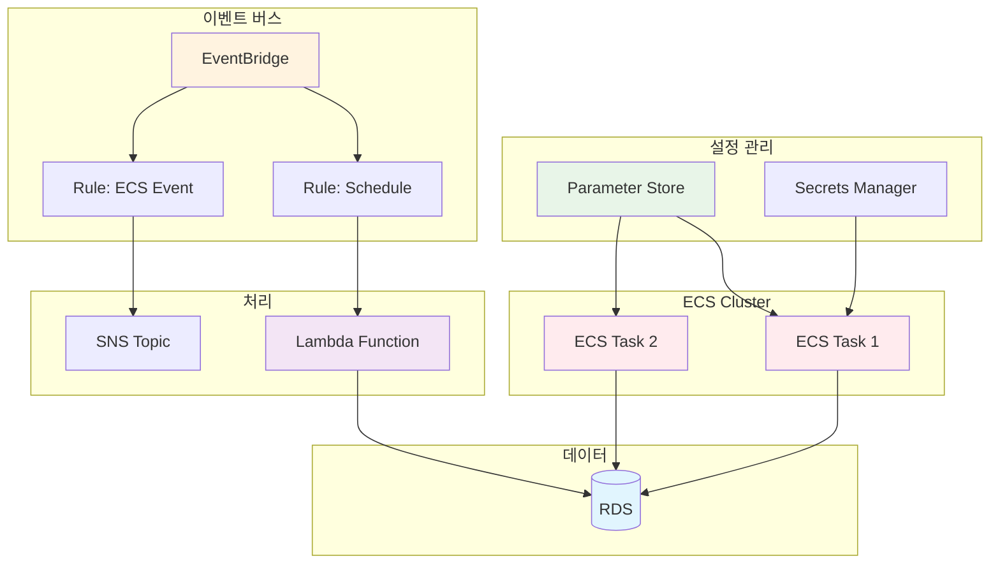
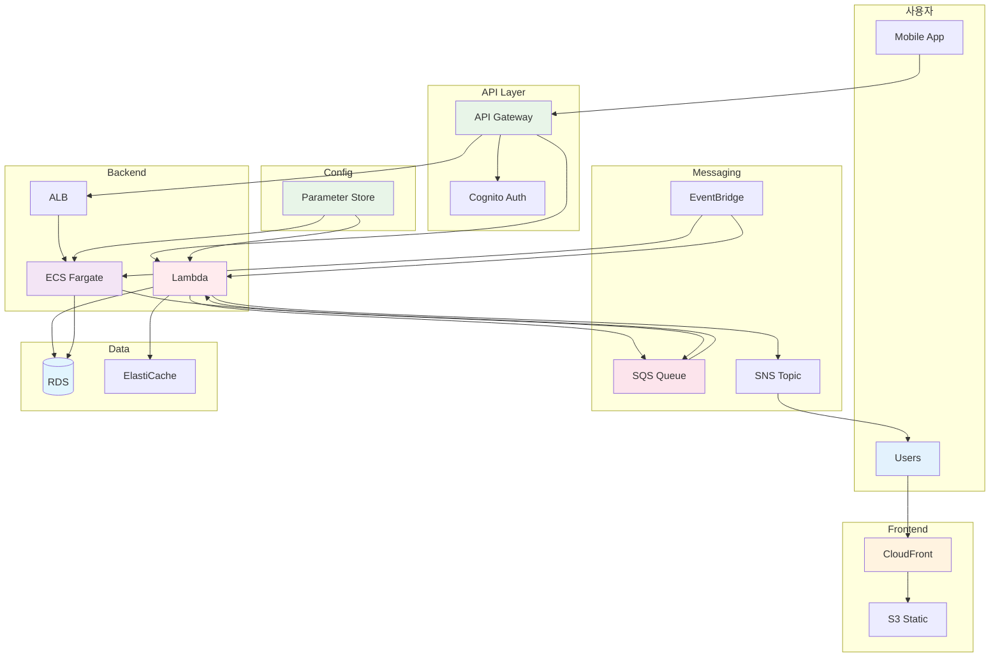

# November Week 2 Day 5: 설정 관리 & 이벤트 기반 아키텍처

<div align="center">

**🔐 Parameter Store** • **📡 EventBridge** • **📝 Terraform 통합**

*중앙 집중식 설정 관리 및 이벤트 기반 아키텍처 구축*

</div>

---

## 🕘 일일 스케줄

### 📊 시간 배분
```
09:00-09:40  Session 1: Parameter Store (40분)
09:40-09:50  휴식 (10분)
09:50-10:30  Session 2: EventBridge (40분)
10:30-10:40  휴식 (10분)
10:40-11:30  Session 3: Terraform 보안 변수 (50분)
11:30-12:00  Lab 준비 (30분)
```

### 🗓️ 상세 스케줄
| 시간 | 구분 | 내용 | 목적 |
|------|------|------|------|
| **09:00-09:40** | 📚 이론 1 | Parameter Store (40분) | 중앙 집중식 설정 관리 |
| **09:40-09:50** | ☕ 휴식 | 10분 휴식 | |
| **09:50-10:30** | 📚 이론 2 | EventBridge (40분) | 이벤트 기반 아키텍처 |
| **10:30-10:40** | ☕ 휴식 | 10분 휴식 | |
| **10:40-11:30** | 📚 이론 3 | Terraform 보안 변수 (50분) | 민감 정보 안전 관리 |
| **11:30-12:00** | 🛠️ 준비 | Lab 환경 준비 (30분) | 실습 준비 |

---

## 🎯 Day 5 목표

### 📚 학습 목표
- **Parameter Store**: 중앙 집중식 설정 및 시크릿 관리
- **EventBridge**: 이벤트 기반 아키텍처 구축
- **Terraform 통합**: 보안 변수를 코드로 안전하게 관리
- **Week 2 통합**: 전체 시스템 통합 및 복습

### 🛠️ 실무 역량
- 설정 중앙 관리 전략
- 이벤트 기반 설계 패턴
- 민감 정보 보호 방법
- 전체 아키텍처 통합 능력

---

## 📚 세션 구성

### Session 1: Systems Manager Parameter Store (09:00-09:40)
**주제**: 중앙 집중식 설정 및 시크릿 관리

**핵심 내용**:
- Parameter Store 개념 및 필요성
- String vs SecureString
- ECS에서 Parameter Store 활용
- Secrets Manager와의 차이점

**학습 포인트**:
- 설정 중앙 관리의 장점
- 민감 정보 보호 방법
- ECS Task Definition 통합
- 실무 활용 패턴

**참조**: [Session 1 상세 내용](./session_1.md)

---

### Session 2: EventBridge (09:50-10:30)
**주제**: 서버리스 이벤트 버스로 이벤트 기반 아키텍처 구축

**핵심 내용**:
- EventBridge 개념 및 역할
- Event Bus, Rule, Target
- Event Pattern 작성
- AWS 서비스 통합

**학습 포인트**:
- 이벤트 기반 아키텍처 설계
- Event Pattern 작성 방법
- 스케줄링 (Cron Job)
- 서비스 간 이벤트 연결

**참조**: [Session 2 상세 내용](./session_2.md)

---

### Session 3: Terraform에서 ECS 보안 변수 관리 (10:40-11:30)
**주제**: Terraform으로 민감 정보를 안전하게 관리

**핵심 내용**:
- Terraform 민감 정보 관리
- Parameter Store 통합
- IAM 역할 최소 권한
- 환경별 보안 변수 분리

**학습 포인트**:
- 민감 정보 하드코딩 방지
- Terraform sensitive 변수
- IAM 역할 분리 전략
- 보안 베스트 프랙티스

**참조**: [Session 3 상세 내용](./session_3.md)

---

## 🛠️ 실습 (Lab 1)

### Lab 1: 전체 시스템 통합 배포
**시간**: 별도 진행 (60분)
**목표**: Week 2 전체 서비스 통합 및 복습

**실습 내용**:
1. Parameter Store 설정 생성
2. ECS Task에 Parameter Store 통합
3. EventBridge Rule 생성
4. 스케줄링 및 이벤트 처리
5. Terraform으로 전체 관리

**참조**: [Lab 1 상세 가이드](./lab_1.md)

---

## 🏗️ Day 5 아키텍처

### 전체 구조


### 주요 구성 요소
- **Parameter Store**: 중앙 집중식 설정 관리
- **EventBridge**: 이벤트 기반 아키텍처
- **ECS Task**: 설정 및 이벤트 통합
- **Lambda**: 이벤트 처리
- **SNS**: 알림 전송

---

## 💰 예상 비용

### Day 5 리소스 비용
| 리소스 | 사양 | 비용 | 실습 시간 | 예상 비용 |
|--------|------|------|-----------|-----------|
| Parameter Store | Standard | 무료 | - | $0 |
| EventBridge | Rule | 무료 (프리티어) | - | $0 |
| ECS Fargate | 0.25 vCPU, 0.5GB | $0.01/시간 | 2시간 | $0.02 |
| Lambda | 128MB | 무료 (프리티어) | - | $0 |
| **합계** | | | | **$0.02** |

### 비용 절감 팁
- Parameter Store Standard는 무료
- EventBridge는 프리티어 충분
- Lambda는 프리티어 활용
- ECS는 최소 스펙 사용
- 실습 완료 후 모든 리소스 정리

---

## ✅ Day 5 체크리스트

### 이론 학습
- [ ] Parameter Store 개념 및 활용 방법 이해
- [ ] SecureString 암호화 방식 파악
- [ ] EventBridge 이벤트 기반 아키텍처 이해
- [ ] Event Pattern 작성 방법 습득
- [ ] Terraform 보안 변수 관리 방법 이해
- [ ] IAM 역할 최소 권한 원칙 적용

### 실습 완료
- [ ] Parameter Store 파라미터 생성
- [ ] ECS Task에 Parameter Store 통합
- [ ] EventBridge Rule 생성
- [ ] 스케줄링 및 이벤트 처리 구현
- [ ] Terraform으로 전체 시스템 관리

### Week 2 통합
- [ ] SQS + SNS 비동기 처리 복습
- [ ] API Gateway + Cognito 인증 복습
- [ ] ECS Fargate 배포 복습
- [ ] ALB + Auto Scaling 복습
- [ ] 전체 아키텍처 통합 이해

---

## 🔗 관련 자료

### 📚 Session 자료
- [Session 1: Parameter Store](./session_1.md)
- [Session 2: EventBridge](./session_2.md)
- [Session 3: Terraform 보안 변수](./session_3.md)

### 🛠️ 실습 자료
- [Lab 1: 전체 시스템 통합](./lab_1.md)

### 📖 AWS 공식 문서
- [Parameter Store](https://docs.aws.amazon.com/systems-manager/latest/userguide/systems-manager-parameter-store.html)
- [EventBridge](https://docs.aws.amazon.com/eventbridge/latest/userguide/)
- [Terraform AWS Provider](https://registry.terraform.io/providers/hashicorp/aws/latest/docs)

### 🎯 다음 Week
- [Week 3: Terraform 심화](../../week_03/README.md)

---

## 💡 Day 5 & Week 2 회고

### 🤝 Day 5 학습 성과
1. **설정 관리**: 중앙 집중식 설정 및 시크릿 관리
2. **이벤트 기반**: EventBridge를 통한 이벤트 아키텍처
3. **보안 강화**: Terraform으로 민감 정보 안전 관리
4. **전체 통합**: Week 2 전체 서비스 통합 경험

### 📊 Week 2 전체 성과
**배운 AWS 서비스 (10개)**:
- ✅ SQS - 메시지 큐
- ✅ SNS - 알림 서비스
- ✅ API Gateway - API 관리
- ✅ Cognito - 사용자 인증
- ✅ ECR - 컨테이너 이미지 저장소
- ✅ ECS/Fargate - 컨테이너 오케스트레이션
- ✅ ALB - 로드 밸런싱
- ✅ Parameter Store - 설정 관리
- ✅ EventBridge - 이벤트 버스
- ✅ Auto Scaling - 자동 확장

**Terraform 기초 완성**:
- ✅ IaC 개념 이해
- ✅ HCL 기본 문법
- ✅ terraform init, plan, apply
- ✅ Variable & Output
- ✅ AWS 리소스 코드화

**실무 역량**:
- ✅ 비동기 처리 시스템 구축
- ✅ 인증 API 구현
- ✅ 컨테이너 배포 및 운영
- ✅ 프로덕션급 아키텍처 설계
- ✅ IaC로 인프라 관리

### 🎯 Week 3 준비
**다음 주 학습 내용**:
- Terraform 프로그래밍 (for_each, count, condition)
- Module 작성 및 재사용
- Remote State & Backend
- 환경 분리 (dev/prod)
- Week 1-2 전체 인프라 코드화

**사전 준비사항**:
- Week 2 AWS 서비스 복습
- Terraform 기본 문법 복습
- AWS CLI 설정 확인

---

## 🏆 Week 2 최종 아키텍처



---

<div align="center">

**🔐 설정 관리** • **📡 이벤트 기반** • **📝 Terraform 통합** • **🎓 Week 2 완성**

*Day 5: Week 2 전체 통합 및 마무리*

</div>
