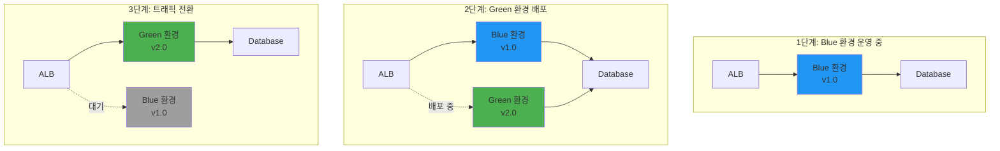
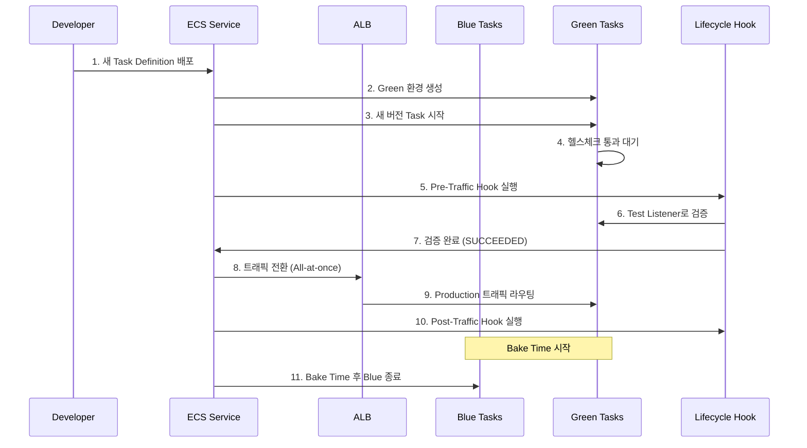
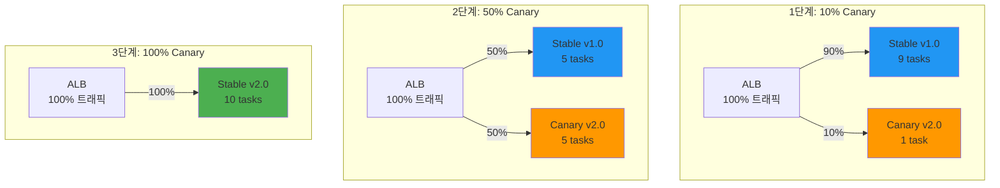
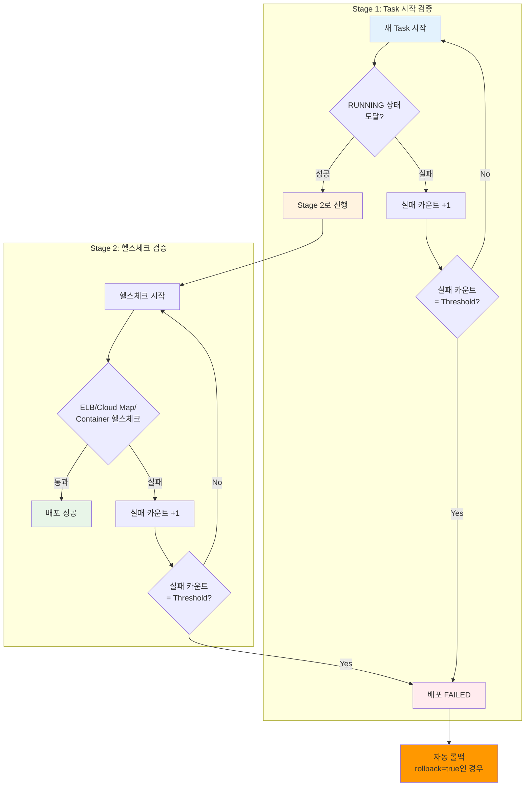

# November Week 2 Day 5 Session 1: ECS 실전 배포 전략

<div align="center">

**🚀 Blue/Green 배포** • **🎯 Canary 배포** • **🛡️ Circuit Breaker**

*무중단 배포와 안전한 릴리스 전략*

</div>

---

## 🕘 세션 정보
**시간**: 09:00-09:50 (50분)
**목표**: 실전 배포 전략 이해 및 ECS 배포 패턴 학습
**방식**: 이론 + 실무 사례 분석

## 🎯 학습 목표
### 📚 학습 목표
- **이해 목표**: Blue/Green, Canary 배포 전략의 차이점과 장단점 이해
- **적용 목표**: ECS에서 각 배포 전략을 구현하는 방법 습득
- **협업 목표**: 배포 전략 선택 시 고려사항 토론

### 🤔 왜 필요한가? (5분)

**현실 문제 상황**:
- 💼 **실무 시나리오**: "새 버전 배포 후 장애 발생, 긴급 롤백 필요"
- 🏠 **일상 비유**: "새 제품 출시 전 베타 테스트로 문제 미리 발견"
- ☁️ **AWS 아키텍처**: "ECS Blue/Green 배포로 무중단 릴리스"
- 📊 **시장 동향**: "Netflix, Amazon 등 대규모 서비스의 필수 배포 전략"

**학습 전후 비교**:


---

## 📖 핵심 개념 (35분)

### 🔍 개념 1: Blue/Green 배포 (12분)

> **정의**: 두 개의 동일한 프로덕션 환경(Blue/Green)을 유지하며, 검증 후 트래픽을 전환하는 배포 전략

**상세 설명**:
- **핵심 원리**: 새 버전(Green)을 별도 환경에 배포 후 검증 완료 시 트래픽 전환
- **주요 특징**:
  - 즉시 롤백 가능 (트래픽만 다시 전환)
  - 완전한 환경 분리
  - Lifecycle Hook을 통한 자동 검증
  - Bake Time 동안 두 환경 동시 실행
- **사용 목적**: 무중단 배포 및 빠른 롤백

**⚠️ 중요**: ECS Blue/Green 배포는 **All-at-once 트래픽 전환만 지원**합니다. Canary/Linear 배포는 CodeDeploy 배포 설정으로 구현합니다.

**시각적 이해**:


**ECS Blue/Green 배포 구성 요소**:

1. **Target Group**:
   - Blue Target Group: 현재 버전
   - Green Target Group: 새 버전

2. **ALB Listener**:
   - Production Listener: 실제 트래픽
   - Test Listener: 배포 검증용

3. **ECS Service**:
   - Task Definition 업데이트
   - 새 Task Set 생성

**배포 프로세스**:


**Lifecycle Hooks**:
- **PreTrafficHook**: 트래픽 전환 전 검증 (Lambda 함수)
- **PostTrafficHook**: 트래픽 전환 후 검증 (Lambda 함수)
- Hook 결과: `SUCCEEDED`, `FAILED`, `IN_PROGRESS`

**Terraform 구성 예시**:
```hcl
# CodeDeploy Application
resource "aws_codedeploy_app" "ecs" {
  name             = "ecs-app"
  compute_platform = "ECS"
}

# CodeDeploy Deployment Group
resource "aws_codedeploy_deployment_group" "ecs" {
  app_name               = aws_codedeploy_app.ecs.name
  deployment_group_name  = "ecs-deployment-group"
  service_role_arn       = aws_iam_role.codedeploy.arn
  deployment_config_name = "CodeDeployDefault.ECSAllAtOnce"

  blue_green_deployment_config {
    terminate_blue_instances_on_deployment_success {
      action                           = "TERMINATE"
      termination_wait_time_in_minutes = 5
    }

    deployment_ready_option {
      action_on_timeout = "CONTINUE_DEPLOYMENT"
    }
  }

  ecs_service {
    cluster_name = aws_ecs_cluster.main.name
    service_name = aws_ecs_service.app.name
  }

  load_balancer_info {
    target_group_pair_info {
      prod_traffic_route {
        listener_arns = [aws_lb_listener.prod.arn]
      }

      test_traffic_route {
        listener_arns = [aws_lb_listener.test.arn]
      }

      target_group {
        name = aws_lb_target_group.blue.name
      }

      target_group {
        name = aws_lb_target_group.green.name
      }
    }
  }
}
```

**장점**:
- ✅ 즉시 롤백 가능 (트래픽만 전환)
- ✅ 배포 검증 시간 확보
- ✅ 무중단 배포
- ✅ 명확한 배포 상태

**단점**:
- ⚠️ 2배의 리소스 필요 (비용 증가)
- ⚠️ 데이터베이스 스키마 변경 시 복잡
- ⚠️ 상태 저장 애플리케이션에 부적합

---

### 🔍 개념 2: Canary 배포 (12분)

> **정의**: CodeDeploy 배포 설정을 통해 새 버전을 소수의 사용자에게 먼저 배포하여 검증 후 점진적으로 확대하는 배포 전략

**상세 설명**:
- **핵심 원리**: CodeDeploy가 트래픽을 점진적으로 전환 (예: 10% → 100%)
- **주요 특징**:
  - 위험 최소화 (소수 사용자만 영향)
  - CloudWatch 알람 기반 자동 롤백
  - 사전 정의된 배포 설정 사용
- **사용 목적**: 안전한 점진적 배포

**⚠️ 중요**: Canary 배포는 **CodeDeploy 배포 설정(Deployment Configuration)**으로 구현됩니다. ECS 자체 기능이 아닙니다.

**시각적 이해**:


**Canary 배포 단계**:

1. **초기 배포 (10%)**:
   - 1-2개 Task에 새 버전 배포
   - 메트릭 모니터링 (에러율, 응답시간)

2. **점진적 확대 (50%)**:
   - 문제 없으면 50%로 확대
   - 계속 모니터링

3. **완전 전환 (100%)**:
   - 모든 검증 통과 시 100% 전환
   - 이전 버전 종료

**ECS Canary 배포 구현**:

**CodeDeploy 배포 설정 (Deployment Configuration)**:

AWS는 사전 정의된 Canary 배포 설정을 제공합니다:

1. **Canary 배포**:
   - `CodeDeployDefault.ECSCanary10Percent5Minutes`
     * 10% 트래픽을 5분간 전환
     * 문제 없으면 나머지 90% 전환
   - `CodeDeployDefault.ECSCanary10Percent15Minutes`
     * 10% 트래픽을 15분간 전환

2. **Linear 배포**:
   - `CodeDeployDefault.ECSLinear10PercentEvery1Minutes`
     * 1분마다 10%씩 증가
   - `CodeDeployDefault.ECSLinear10PercentEvery3Minutes`
     * 3분마다 10%씩 증가

3. **All-at-once 배포**:
   - `CodeDeployDefault.ECSAllAtOnce`
     * 즉시 100% 전환

**Terraform 구성**:
```hcl
resource "aws_codedeploy_deployment_group" "canary" {
  app_name               = aws_codedeploy_app.ecs.name
  deployment_group_name  = "ecs-canary-deployment"
  service_role_arn       = aws_iam_role.codedeploy.arn
  
  # Canary 배포 설정
  deployment_config_name = "CodeDeployDefault.ECSCanary10Percent5Minutes"

  ecs_service {
    cluster_name = aws_ecs_cluster.main.name
    service_name = aws_ecs_service.app.name
  }

  load_balancer_info {
    target_group_pair_info {
      prod_traffic_route {
        listener_arns = [aws_lb_listener.prod.arn]
      }

      target_group {
        name = aws_lb_target_group.blue.name
      }

      target_group {
        name = aws_lb_target_group.green.name
      }
    }
  }

  # CloudWatch 알람 기반 자동 롤백
  alarm_configuration {
    alarms  = [aws_cloudwatch_metric_alarm.error_rate.alarm_name]
    enabled = true
  }

  auto_rollback_configuration {
    enabled = true
    events  = ["DEPLOYMENT_FAILURE", "DEPLOYMENT_STOP_ON_ALARM"]
  }
}
```

**장점**:
- ✅ 위험 최소화 (소수 사용자만 영향)
- ✅ 실시간 검증 가능
- ✅ 자동 롤백 지원
- ✅ 리소스 효율적 (Blue/Green 대비)

**단점**:
- ⚠️ 배포 시간 길어짐
- ⚠️ 복잡한 모니터링 필요
- ⚠️ 트래픽 분산 로직 필요

---

### 🔍 개념 3: ECS Deployment Circuit Breaker (11분)

> **정의**: Rolling Update 배포 중 Task가 정상 상태에 도달하지 못할 때 자동으로 감지하고 롤백하는 ECS 내장 기능

**상세 설명**:
- **핵심 원리**: Task 상태와 헬스체크를 모니터링하여 배포 실패 감지
- **주요 특징**:
  - Rolling Update 배포 타입 전용
  - 2단계 검증 (RUNNING 상태 + 헬스체크)
  - 자동 롤백 옵션
  - EventBridge 이벤트 발생
- **사용 목적**: 배포 실패 자동 감지 및 롤백

**⚠️ 중요**: Circuit Breaker는 **Rolling Update 배포 타입에만 적용**됩니다. Blue/Green 배포에는 사용할 수 없습니다.

**Circuit Breaker 동작 방식**:

ECS Deployment Circuit Breaker는 2단계로 배포를 검증합니다:



**Threshold 계산 공식**:
```
Threshold = 0.5 × desired_count
최소값: 3
최대값: 200
```

**예시**:
- desired_count = 4 → Threshold = 2 (0.5 × 4 = 2, 최소값 3보다 작으므로 3)
- desired_count = 10 → Threshold = 5 (0.5 × 10 = 5)
- desired_count = 500 → Threshold = 200 (0.5 × 500 = 250, 최대값 200 적용)

**검증 항목**:

**Stage 1: Task 상태 확인**
- Task가 RUNNING 상태에 도달하는지 확인
- 실패 시 실패 카운트 증가
- Threshold 도달 시 배포 실패

**Stage 2: 헬스체크**
1. **ELB 헬스체크**: Target Group의 헬스체크
2. **Cloud Map 헬스체크**: Service Discovery 헬스체크
3. **Container 헬스체크**: Task Definition의 healthCheck 설정

**ECS Circuit Breaker 구현**:

**Terraform 구성**:
```hcl
resource "aws_ecs_service" "app" {
  name            = "app-service"
  cluster         = aws_ecs_cluster.main.id
  task_definition = aws_ecs_task_definition.app.arn
  desired_count   = 10
  launch_type     = "FARGATE"

  # Circuit Breaker 설정
  deployment_circuit_breaker {
    enable   = true    # Circuit Breaker 활성화
    rollback = true    # 실패 시 자동 롤백
  }

  deployment_configuration {
    maximum_percent         = 200
    minimum_healthy_percent = 100
    
    # Rolling Update 배포 타입 (Circuit Breaker 필수)
    deployment_controller {
      type = "ECS"  # Rolling Update
    }
  }

  # 헬스체크 설정
  load_balancer {
    target_group_arn = aws_lb_target_group.app.arn
    container_name   = "app"
    container_port   = 80
  }
}
```

**Task Definition 헬스체크**:
```hcl
resource "aws_ecs_task_definition" "app" {
  family = "app"
  
  container_definitions = jsonencode([
    {
      name  = "app"
      image = "nginx:latest"
      
      # Container 헬스체크
      healthCheck = {
        command     = ["CMD-SHELL", "curl -f http://localhost/ || exit 1"]
        interval    = 30
        timeout     = 5
        retries     = 3
        startPeriod = 60
      }
    }
  ])
}
```

**EventBridge 모니터링**:
```hcl
resource "aws_cloudwatch_event_rule" "deployment_failed" {
  name        = "ecs-deployment-failed"
  description = "ECS 배포 실패 감지"

  event_pattern = jsonencode({
    source      = ["aws.ecs"]
    detail-type = ["ECS Service Deployment State Change"]
    detail = {
      eventName = ["SERVICE_DEPLOYMENT_FAILED"]
    }
  })
}

resource "aws_cloudwatch_event_target" "sns" {
  rule      = aws_cloudwatch_event_rule.deployment_failed.name
  target_id = "SendToSNS"
  arn       = aws_sns_topic.alerts.arn
}
```

**동작 시나리오**:

**시나리오 1: Task 시작 실패**
```
1. 새 Task Definition 배포 시작
2. 새 Task 시작 시도
3. Task가 RUNNING 상태 도달 실패 (예: 이미지 pull 실패)
4. 실패 카운트 증가 (1/5)
5. 5번 실패 시 배포 FAILED
6. rollback=true → 이전 Task Definition으로 자동 롤백
7. EventBridge 이벤트 발생 → SNS 알림
```

**시나리오 2: 헬스체크 실패**
```
1. 새 Task가 RUNNING 상태 도달 (Stage 1 통과)
2. ELB 헬스체크 시작
3. 헬스체크 실패 (예: 애플리케이션 오류)
4. 실패 카운트 증가
5. Threshold 도달 시 배포 FAILED
6. 자동 롤백 실행
```

**장점**:
- ✅ 배포 실패 자동 감지
- ✅ 빠른 롤백 (이전 Task Definition으로)
- ✅ EventBridge 통합 (알림 자동화)
- ✅ 추가 비용 없음 (ECS 내장 기능)

**단점**:
- ⚠️ Rolling Update 배포만 지원
- ⚠️ Blue/Green 배포에는 미적용
- ⚠️ Threshold 계산 자동 (수동 조정 불가)
- ⚠️ 롤백 대상은 가장 최근 COMPLETED 배포

---

## 💭 함께 생각해보기 (10분)

### 🤝 페어 토론 (5분)

**토론 주제**:
1. **배포 전략 선택**: "우리 서비스에는 어떤 배포 전략이 적합할까요?"
   - Blue/Green: 빠른 롤백이 중요한 경우
   - Canary: 위험 최소화가 중요한 경우
   - Rolling: 리소스 효율이 중요한 경우

2. **Circuit Breaker 적용**: "어떤 서비스 간 통신에 Circuit Breaker를 적용해야 할까요?"
   - 외부 API 호출
   - 데이터베이스 연결
   - 마이크로서비스 간 통신

3. **실무 경험 공유**: "배포 중 장애를 경험한 적이 있다면 어떻게 대응했나요?"

**페어 활동 가이드**:
- 👥 **자유 페어링**: 관심사나 경험이 비슷한 사람끼리
- 🔄 **역할 교대**: 각자 경험이나 의견 공유
- 📝 **핵심 정리**: 토론 내용 중 중요한 점 메모

### 🎯 전체 공유 (5분)

**인사이트 공유**:
- 각 배포 전략의 실무 적용 사례
- Circuit Breaker 적용 시 주의사항
- 배포 전략 선택 기준

**질문 수집**:
- Blue/Green vs Canary 선택 기준
- Circuit Breaker 임계값 설정 방법
- 롤백 시나리오 대응 방안

### 💡 이해도 체크 질문

- ✅ "Blue/Green 배포와 Canary 배포의 차이점을 설명할 수 있나요?"
- ✅ "Circuit Breaker의 3가지 상태를 설명할 수 있나요?"
- ✅ "실무에서 어떤 상황에 각 배포 전략을 사용할지 판단할 수 있나요?"

---

## 🔑 핵심 키워드

### 배포 전략
- **Blue/Green 배포**: 두 환경 유지, All-at-once 트래픽 전환, Lifecycle Hook 검증
- **Canary 배포**: CodeDeploy 배포 설정, 점진적 전환, CloudWatch 알람 기반 롤백
- **Linear 배포**: 일정 간격으로 점진적 증가

### ECS Deployment Circuit Breaker
- **Rolling Update 전용**: Blue/Green 배포에는 미적용
- **2단계 검증**: Stage 1 (RUNNING 상태) + Stage 2 (헬스체크)
- **Threshold**: 0.5 × desired_count (최소 3, 최대 200)
- **자동 롤백**: 가장 최근 COMPLETED 배포로 복구

### CodeDeploy
- **Deployment Configuration**: Canary, Linear, All-at-once 설정
- **Lifecycle Hook**: Lambda 함수로 배포 검증
- **Auto Rollback**: CloudWatch 알람 기반 자동 롤백

---

## 📝 세션 마무리

### ✅ 오늘 세션 성과
- [ ] Blue/Green 배포 전략 이해
- [ ] Canary 배포 구현 방법 습득
- [ ] Circuit Breaker 패턴 학습
- [ ] 실무 배포 전략 선택 기준 파악

### 🎯 다음 세션 준비
- **Session 2**: ECS 모니터링 & 로깅
  - Container Insights
  - CloudWatch Logs Insights
  - 알람 및 대시보드

### 🔗 참고 자료
- 📘 [ECS Blue/Green Deployments](https://docs.aws.amazon.com/AmazonECS/latest/developerguide/deployment-type-blue-green.html)
- 📗 [CodeDeploy for ECS](https://docs.aws.amazon.com/AmazonECS/latest/developerguide/deployment-type-bluegreen.html)
- 📙 [ECS Deployment Circuit Breaker](https://docs.aws.amazon.com/AmazonECS/latest/developerguide/deployment-circuit-breaker.html)
- 📕 [Deployment Failure Detection](https://docs.aws.amazon.com/AmazonECS/latest/developerguide/deployment-failure-detection.html)
- 🆕 [Built-in Blue/Green Deployments](https://aws.amazon.com/blogs/aws/accelerate-safe-software-releases-with-new-built-in-blue-green-deployments-in-amazon-ecs/)

---

<div align="center">

**🚀 안전한 배포** • **🎯 점진적 전환** • **🛡️ 장애 방지**

*실전 배포 전략으로 안정적인 서비스 운영*

</div>
