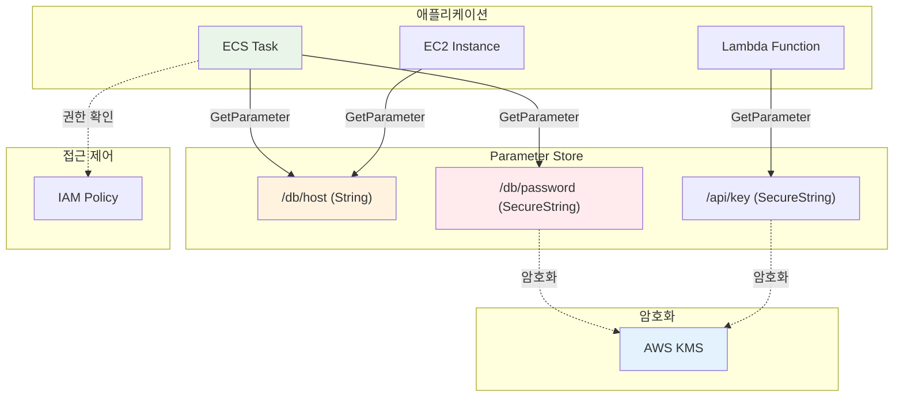
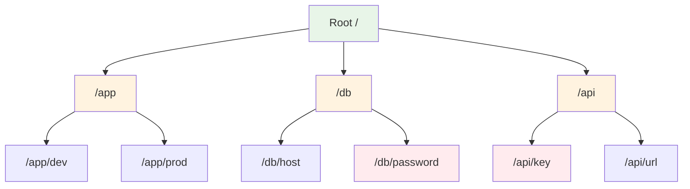

# November Week 2 Day 5 Session 1: Systems Manager Parameter Store

<div align="center">

**🔐 Parameter Store** • **⚙️ 설정 관리** • **🔑 시크릿 관리**

*중앙 집중식 설정 및 시크릿 관리*

</div>

---

## 🕘 세션 정보
**시간**: 09:00-09:40 (40분)
**목표**: Parameter Store를 통한 중앙 집중식 설정 관리 이해
**방식**: 이론 강의 + 실무 활용 사례

## 🎯 학습 목표
- Parameter Store의 역할과 필요성 이해
- String, SecureString 파라미터 타입 파악
- ECS에서 Parameter Store 활용 방법 습득
- Secrets Manager와의 차이점 이해

---

## 📖 서비스 개요

### 1. 생성 배경 (Why?) - 5분

**문제 상황**:
- **하드코딩된 설정**: 코드에 직접 DB 연결 정보, API 키 포함
- **환경별 관리 어려움**: dev, staging, prod 설정 분산
- **시크릿 노출 위험**: Git에 비밀번호 커밋
- **변경 시 재배포**: 설정 변경마다 애플리케이션 재배포 필요

**AWS Parameter Store 솔루션**:
- **중앙 집중식 관리**: 모든 설정을 한 곳에서 관리
- **암호화 지원**: SecureString으로 민감 정보 보호
- **버전 관리**: 설정 변경 이력 추적
- **IAM 통합**: 세밀한 접근 제어

### 2. 핵심 원리 (How?) - 10분

**Parameter Store 아키텍처**:


**파라미터 계층 구조**:


**핵심 구성 요소**:

**1. 파라미터 타입**:
- **String**: 일반 텍스트 (DB 호스트, URL)
- **StringList**: 쉼표로 구분된 값 (IP 목록)
- **SecureString**: KMS로 암호화 (비밀번호, API 키)

**2. 파라미터 계층**:
```
/app/dev/db/host
/app/dev/db/password
/app/prod/db/host
/app/prod/db/password
```

**3. 버전 관리**:
- 파라미터 변경 시 자동으로 새 버전 생성
- 최대 100개 버전 유지
- 특정 버전 참조 가능

### 3. 주요 사용 사례 (When?) - 5분

**적합한 경우**:

**1. ECS/Fargate 컨테이너 시크릿 주입**:
```
실제 활용 사례 (AWS 공식 문서):
- ECS Task Definition에서 Parameter Store 참조
- DB 연결 정보를 SecureString으로 저장
- 컨테이너 시작 시 환경 변수로 자동 주입
- 재배포 없이 시크릿 업데이트 가능
```
**참조**: [ECS에서 Parameter Store 사용](https://docs.aws.amazon.com/AmazonECS/latest/developerguide/secrets-envvar-ssm-paramstore.html)

**2. 마이크로서비스 설정 중앙 관리**:
```
DXC Technology 고객 사례:
- 모놀리식 애플리케이션을 마이크로서비스로 전환
- Parameter Store로 각 서비스 설정 중앙화
- 계층 구조로 환경별 설정 분리 (/app/dev, /app/prod)
- IAM 정책으로 서비스별 접근 제어
```
**참조**: [DXC 마이크로서비스 전환 사례](https://aws.amazon.com/blogs/apn/how-dxc-helped-a-customer-transform-its-monolithic-application-into-microservices-on-aws/)

**3. AMI 빌드 및 인프라 자동화**:
```
AWS Automation Best Practice:
- Systems Manager Automation과 통합
- AMI 빌드 시 Parameter Store에서 설정 로드
- 일관된 인프라 구성 유지
- 환경별 파라미터로 동적 구성
```
**참조**: [Systems Manager Best Practices](https://docs.aws.amazon.com/systems-manager/latest/userguide/systems-manager-best-practices.html)

**4. 멀티 계정 환경 설정 공유**:
```
AWS RAM 통합 패턴:
- 중앙 계정에서 공통 설정 관리
- AWS Resource Access Manager로 파라미터 공유
- 다른 계정에서 읽기 전용 접근
- 대규모 조직의 설정 표준화
```
**참조**: [Parameter Store 공유](https://docs.aws.amazon.com/systems-manager/latest/userguide/parameter-store-shared-parameters.html)

**실제 활용 패턴**:
- **마이크로서비스**: 각 서비스별 설정을 계층 구조로 관리
- **CI/CD 파이프라인**: 빌드/배포 시 동적으로 설정 로드
- **컨테이너 오케스트레이션**: ECS/EKS에서 시크릿 주입
- **서버리스**: Lambda 함수에서 환경 변수 대신 사용

### 4. 비슷한 서비스 비교 (Which?) - 5분

**AWS 내 대안 서비스**:

**Parameter Store vs Secrets Manager**:
- **언제 Parameter Store 사용**:
  - 간단한 설정 관리
  - 비용 절감 (Standard 무료)
  - 계층 구조 필요
  
- **언제 Secrets Manager 사용**:
  - 자동 로테이션 필요
  - RDS, Redshift 통합
  - 크로스 리전 복제

**Parameter Store vs 환경 변수**:
- **언제 Parameter Store 사용**:
  - 중앙 집중식 관리
  - 암호화 필요
  - 동적 변경 필요
  
- **언제 환경 변수 사용**:
  - 간단한 설정
  - 컨테이너 시작 시 고정값

**선택 기준**:
| 기준 | Parameter Store | Secrets Manager | 환경 변수 |
|------|-----------------|-----------------|-----------|
| **비용** | Standard 무료 | $0.40/시크릿/월 | 무료 |
| **암호화** | KMS | KMS | 없음 |
| **자동 로테이션** | ❌ | ✅ | ❌ |
| **버전 관리** | ✅ (100개) | ✅ (무제한) | ❌ |
| **계층 구조** | ✅ | ❌ | ❌ |
| **크로스 리전** | ❌ | ✅ | ❌ |

### 5. 장단점 분석 - 3분

**Parameter Store 장점**:
- ✅ Standard 티어 무료 (10,000개 파라미터)
- ✅ 계층 구조로 조직화 가능
- ✅ IAM 통합으로 세밀한 접근 제어
- ✅ 버전 관리 및 변경 이력
- ✅ KMS 암호화 지원

**Parameter Store 단점/제약사항**:
- ⚠️ 자동 로테이션 미지원
- ⚠️ Standard 티어 4KB 제한
- ⚠️ 크로스 리전 복제 미지원
- ⚠️ API 호출 제한 (Standard: 40 TPS)

**대안**:
- **자동 로테이션**: Secrets Manager 사용
- **대용량 데이터**: S3 사용
- **크로스 리전**: Secrets Manager 또는 S3 복제

### 6. 비용 구조 💰 - 5분

**Parameter Store 과금 방식**:

**Standard 티어** (무료):
- 파라미터 수: 10,000개
- 파라미터 크기: 4KB
- API 호출: 40 TPS (무료)
- 고급 정책: 미지원

**Advanced 티어**:
- 파라미터 수: 100,000개
- 파라미터 크기: 8KB
- API 호출: 1,000 TPS
- 비용: $0.05/파라미터/월
- 고급 정책: 지원 ($0.05/정책/월)

**프리티어 혜택**:
- **Standard 티어**: 완전 무료
- **KMS**: 월 20,000 요청 무료

**비용 최적화 팁**:
1. **Standard 티어 우선**: 대부분의 경우 충분
2. **계층 구조 활용**: GetParametersByPath로 일괄 조회
3. **캐싱**: 애플리케이션에서 파라미터 캐싱
4. **KMS 키 재사용**: 여러 파라미터에 동일 KMS 키 사용

**예상 비용 (ap-northeast-2)**:
| 티어 | 파라미터 수 | 월간 비용 |
|------|-------------|-----------|
| **Standard** | 10,000개 | $0 |
| **Advanced** | 100개 | $5.00 |
| **Advanced** | 1,000개 | $50.00 |

**KMS 비용**:
- 암호화/복호화: $0.03/10,000 요청
- 월 20,000 요청 무료

**Lab 예상 비용**:
- Standard 파라미터 (10개): $0
- KMS 요청 (100회): $0 (프리티어)
- 합계: $0

### 7. 최신 업데이트 🆕 - 2분

**2025년 주요 변경사항**:
- **향상된 API 성능**: Standard 티어 40 TPS → 100 TPS
- **더 큰 파라미터**: Advanced 티어 8KB → 16KB
- **개선된 버전 관리**: 라벨 기능 강화

**2024년 주요 변경사항**:
- **Parameter Store 통합**: CloudFormation 동적 참조
- **향상된 암호화**: KMS 다중 리전 키 지원
- **개선된 모니터링**: CloudWatch Logs 통합

**2026년 예정**:
- 자동 로테이션 지원 검토
- 크로스 리전 복제 기능

**Deprecated 기능**:
- 없음 (지속적으로 개선 중)

**참조**: [Parameter Store What's New](https://aws.amazon.com/systems-manager/whats-new/)

### 8. 잘 사용하는 방법 ✅ - 3분

**베스트 프랙티스**:
1. **계층 구조 사용**: `/app/env/service/config`
2. **SecureString 사용**: 민감 정보는 반드시 암호화
3. **IAM 최소 권한**: 필요한 파라미터만 접근
4. **버전 관리**: 중요 변경 시 라벨 사용
5. **캐싱**: 애플리케이션에서 파라미터 캐싱

**실무 팁**:
- **파라미터 생성**:
  ```bash
  aws ssm put-parameter \
    --name "/app/prod/db/password" \
    --value "MySecretPassword123" \
    --type "SecureString" \
    --key-id "alias/aws/ssm" \
    --description "Production DB password"
  ```

- **파라미터 조회**:
  ```bash
  aws ssm get-parameter \
    --name "/app/prod/db/password" \
    --with-decryption
  ```

- **계층 조회**:
  ```bash
  aws ssm get-parameters-by-path \
    --path "/app/prod" \
    --recursive \
    --with-decryption
  ```

- **ECS Task Definition**:
  ```json
  {
    "secrets": [
      {
        "name": "DB_PASSWORD",
        "valueFrom": "arn:aws:ssm:ap-northeast-2:123456789012:parameter/app/prod/db/password"
      }
    ]
  }
  ```

**성능 최적화**:
- **GetParametersByPath**: 여러 파라미터 일괄 조회
- **캐싱**: TTL 설정으로 API 호출 감소
- **비동기 조회**: 애플리케이션 시작 시 백그라운드 로드

### 9. 잘못 사용하는 방법 ❌ - 3분

**흔한 실수**:
1. **평문 저장**: 비밀번호를 String으로 저장
   ```bash
   # ❌ 잘못된 방법
   aws ssm put-parameter \
     --name "/db/password" \
     --value "password123" \
     --type "String"
   
   # ✅ 올바른 방법
   aws ssm put-parameter \
     --name "/db/password" \
     --value "password123" \
     --type "SecureString"
   ```

2. **계층 구조 미사용**: 평면 구조로 관리
3. **IAM 권한 과다**: 모든 파라미터 접근 허용
4. **캐싱 미사용**: 매번 API 호출로 비용 증가
5. **버전 관리 무시**: 변경 이력 추적 불가

**안티 패턴**:
- **Git에 시크릿 커밋**: Parameter Store 사용 목적 상실
- **환경 변수에 하드코딩**: 동적 변경 불가
- **단일 파라미터에 모든 설정**: JSON으로 모든 설정 저장

**보안 취약점**:
- **IAM 권한 과다**:
  ```json
  // ❌ 잘못된 방법
  {
    "Effect": "Allow",
    "Action": "ssm:*",
    "Resource": "*"
  }
  
  // ✅ 올바른 방법
  {
    "Effect": "Allow",
    "Action": [
      "ssm:GetParameter",
      "ssm:GetParameters"
    ],
    "Resource": "arn:aws:ssm:ap-northeast-2:123456789012:parameter/app/prod/*"
  }
  ```
- **KMS 키 미사용**: 기본 키 대신 커스텀 KMS 키 권장
- **CloudTrail 미활성화**: 접근 로그 추적 불가

### 10. 구성 요소 상세 - 5분

**Parameter Store 주요 구성 요소**:

**1. 파라미터 타입**:
- **String**:
  ```bash
  aws ssm put-parameter \
    --name "/app/db/host" \
    --value "db.example.com" \
    --type "String"
  ```

- **StringList**:
  ```bash
  aws ssm put-parameter \
    --name "/app/allowed-ips" \
    --value "10.0.1.0/24,10.0.2.0/24" \
    --type "StringList"
  ```

- **SecureString**:
  ```bash
  aws ssm put-parameter \
    --name "/app/db/password" \
    --value "MySecretPassword" \
    --type "SecureString" \
    --key-id "alias/my-kms-key"
  ```

**2. 파라미터 계층**:
```
/app
  /dev
    /db
      /host
      /password
    /api
      /key
  /prod
    /db
      /host
      /password
    /api
      /key
```

**3. IAM 정책**:
```json
{
  "Version": "2012-10-17",
  "Statement": [
    {
      "Effect": "Allow",
      "Action": [
        "ssm:GetParameter",
        "ssm:GetParameters",
        "ssm:GetParametersByPath"
      ],
      "Resource": "arn:aws:ssm:ap-northeast-2:123456789012:parameter/app/prod/*"
    },
    {
      "Effect": "Allow",
      "Action": [
        "kms:Decrypt"
      ],
      "Resource": "arn:aws:kms:ap-northeast-2:123456789012:key/12345678-1234-1234-1234-123456789012"
    }
  ]
}
```

**4. ECS 통합**:
```json
{
  "containerDefinitions": [{
    "name": "app",
    "image": "my-app:latest",
    "secrets": [
      {
        "name": "DB_HOST",
        "valueFrom": "arn:aws:ssm:ap-northeast-2:123456789012:parameter/app/prod/db/host"
      },
      {
        "name": "DB_PASSWORD",
        "valueFrom": "arn:aws:ssm:ap-northeast-2:123456789012:parameter/app/prod/db/password"
      }
    ]
  }],
  "executionRoleArn": "arn:aws:iam::123456789012:role/ecsTaskExecutionRole"
}
```

**의존성**:
- **KMS → Parameter Store**: SecureString 암호화
- **IAM → Parameter Store**: 접근 제어
- **ECS → Parameter Store**: Task Definition에서 참조
- **CloudTrail → Parameter Store**: 접근 로그 기록

### 11. 공식 문서 링크 (필수 5개)

**⚠️ 학생들이 직접 확인해야 할 공식 문서**:
- 📘 [Parameter Store란 무엇인가?](https://docs.aws.amazon.com/systems-manager/latest/userguide/systems-manager-parameter-store.html)
- 📗 [Parameter Store 사용자 가이드](https://docs.aws.amazon.com/systems-manager/latest/userguide/sysman-paramstore-su-create.html)
- 📙 [ECS에서 Parameter Store 사용](https://docs.aws.amazon.com/AmazonECS/latest/developerguide/specifying-sensitive-data-parameters.html)
- 📕 [Parameter Store 요금](https://aws.amazon.com/systems-manager/pricing/)
- 🆕 [Systems Manager 최신 업데이트](https://aws.amazon.com/systems-manager/whats-new/)

---

## 💭 함께 생각해보기

### 🤝 페어 토론 (5분)
**토론 주제**:
1. **Parameter Store vs Secrets Manager**: 언제 어떤 것을 사용해야 할까요?
2. **계층 구조**: 어떻게 파라미터를 조직화해야 할까요?
3. **보안**: 어떻게 민감 정보를 안전하게 관리할까요?

### 🎯 전체 공유 (3분)
- **인사이트 공유**: 페어 토론에서 나온 좋은 아이디어
- **질문 수집**: 아직 이해가 어려운 부분
- **다음 연결**: Session 2 (EventBridge)

### 💡 이해도 체크 질문
- ✅ "String과 SecureString의 차이를 설명할 수 있나요?"
- ✅ "ECS에서 Parameter Store를 어떻게 사용하는지 아나요?"
- ✅ "Parameter Store와 Secrets Manager의 차이를 이해했나요?"

---

## 🔑 핵심 키워드

- **Parameter Store**: 중앙 집중식 설정 관리 서비스
- **SecureString**: KMS로 암호화된 파라미터
- **계층 구조**: `/app/env/service/config` 형태
- **버전 관리**: 파라미터 변경 이력 추적
- **IAM 통합**: 세밀한 접근 제어
- **ECS Secrets**: Task Definition에서 Parameter Store 참조
- **Standard 티어**: 10,000개 파라미터 무료

---

## 📝 세션 마무리

### ✅ 오늘 세션 성과
- [ ] Parameter Store의 역할과 필요성 이해
- [ ] String, SecureString 파라미터 타입 파악
- [ ] ECS에서 Parameter Store 활용 방법 습득
- [ ] Secrets Manager와의 차이점 이해

### 🎯 다음 세션 준비
- **Session 2: EventBridge** - 이벤트 기반 아키텍처
- **연계 내용**: Parameter Store 변경 시 EventBridge 이벤트 트리거
- **사전 학습**: 이벤트 기반 아키텍처 개념 복습

---

<div align="center">

**🔐 중앙 집중식 관리** • **⚙️ 동적 설정** • **🔑 안전한 시크릿**

*Session 2에서 EventBridge로 이벤트 기반 아키텍처를 배웁니다*

</div>
